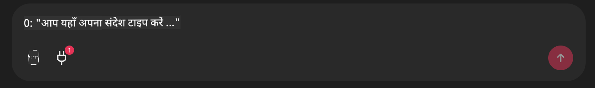

<!--
CO_OP_TRANSLATOR_METADATA:
{
  "original_hash": "9bf0395cbc541ce8db2a9699c8678dfc",
  "translation_date": "2025-07-12T14:21:11+00:00",
  "source_file": "11-mcp/code_samples/github-mcp/README.md",
  "language_code": "hi"
}
-->
# Github MCP सर्वर उदाहरण

## विवरण

यह एक डेमो था जो Microsoft Reactor के माध्यम से आयोजित AI एजेंट्स हैकाथॉन के लिए बनाया गया था।

यह टूल उपयोगकर्ता के Github रिपोज़ के आधार पर हैकाथॉन प्रोजेक्ट्स की सिफारिश करने के लिए इस्तेमाल किया जाता है।  
यह इस प्रकार किया जाता है:

1. **Github Agent** - Github MCP सर्वर का उपयोग करके रिपोज़ और उन रिपोज़ के बारे में जानकारी प्राप्त करना।  
2. **Hackathon Agent** - Github Agent से प्राप्त डेटा लेकर, उपयोगकर्ता द्वारा उपयोग की गई भाषाओं और AI एजेंट्स हैकाथॉन के प्रोजेक्ट ट्रैक्स के आधार पर रचनात्मक हैकाथॉन प्रोजेक्ट आइडियाज बनाना।  
3. **Events Agent** - हैकाथॉन एजेंट के सुझाव के आधार पर, Events Agent AI Agent Hackathon श्रृंखला से संबंधित इवेंट्स की सिफारिश करेगा।  

## कोड चलाना

### पर्यावरण चर (Environment Variables)

यह डेमो Azure Open AI Service, Semantic Kernel, Github MCP Server और Azure AI Search का उपयोग करता है।

सुनिश्चित करें कि इन टूल्स का उपयोग करने के लिए आपके पास सही पर्यावरण चर सेट हैं:

```python
AZURE_OPENAI_CHAT_DEPLOYMENT_NAME=""
AZURE_OPENAI_EMBEDDING_DEPLOYMENT_NAME=""
AZURE_OPENAI_ENDPOINT=""
AZURE_OPENAI_API_KEY=""
AZURE_OPENAI_API_VERSION=""
AZURE_SEARCH_SERVICE_ENDPOINT=""
AZURE_SEARCH_API_KEY=""
```

## Chainlit सर्वर चलाना

MCP सर्वर से कनेक्ट करने के लिए, यह डेमो Chainlit को चैट इंटरफ़ेस के रूप में उपयोग करता है।

सर्वर चलाने के लिए, अपने टर्मिनल में निम्नलिखित कमांड का उपयोग करें:

```bash
chainlit run app.py -w
```

यह आपके Chainlit सर्वर को `localhost:8000` पर शुरू कर देगा और साथ ही आपके Azure AI Search Index को `event-descriptions.md` सामग्री से भर देगा।

## MCP सर्वर से कनेक्ट करना

Github MCP सर्वर से कनेक्ट करने के लिए, "Type your message here.." चैट बॉक्स के नीचे "plug" आइकन चुनें:



वहाँ से आप "Connect an MCP" पर क्लिक करके Github MCP Server से कनेक्ट करने का कमांड जोड़ सकते हैं:

```bash
npx -y @modelcontextprotocol/server-github --env GITHUB_PERSONAL_ACCESS_TOKEN=[YOUR PERSONAL ACCESS TOKEN]
```

"[YOUR PERSONAL ACCESS TOKEN]" को अपने वास्तविक Personal Access Token से बदलें।

कनेक्ट होने के बाद, प्लग आइकन के पास (1) दिखना चाहिए जो कनेक्शन की पुष्टि करता है। यदि नहीं दिखे, तो `chainlit run app.py -w` के साथ chainlit सर्वर को पुनः शुरू करने का प्रयास करें।

## डेमो का उपयोग करना

हैकाथॉन प्रोजेक्ट्स की सिफारिश करने के एजेंट वर्कफ़्लो को शुरू करने के लिए, आप इस तरह का संदेश टाइप कर सकते हैं:

"Recommend hackathon projects for the Github user koreyspace"

Router Agent आपके अनुरोध का विश्लेषण करेगा और यह तय करेगा कि कौन से एजेंट्स (GitHub, Hackathon, और Events) का संयोजन आपकी क्वेरी को संभालने के लिए सबसे उपयुक्त है। ये एजेंट्स मिलकर GitHub रिपोज़ एनालिसिस, प्रोजेक्ट आइडियेशन, और संबंधित टेक इवेंट्स के आधार पर व्यापक सिफारिशें प्रदान करते हैं।

**अस्वीकरण**:  
यह दस्तावेज़ AI अनुवाद सेवा [Co-op Translator](https://github.com/Azure/co-op-translator) का उपयोग करके अनुवादित किया गया है। जबकि हम सटीकता के लिए प्रयासरत हैं, कृपया ध्यान दें कि स्वचालित अनुवादों में त्रुटियाँ या अशुद्धियाँ हो सकती हैं। मूल दस्तावेज़ अपनी मूल भाषा में ही अधिकारिक स्रोत माना जाना चाहिए। महत्वपूर्ण जानकारी के लिए, पेशेवर मानव अनुवाद की सलाह दी जाती है। इस अनुवाद के उपयोग से उत्पन्न किसी भी गलतफहमी या गलत व्याख्या के लिए हम जिम्मेदार नहीं हैं।