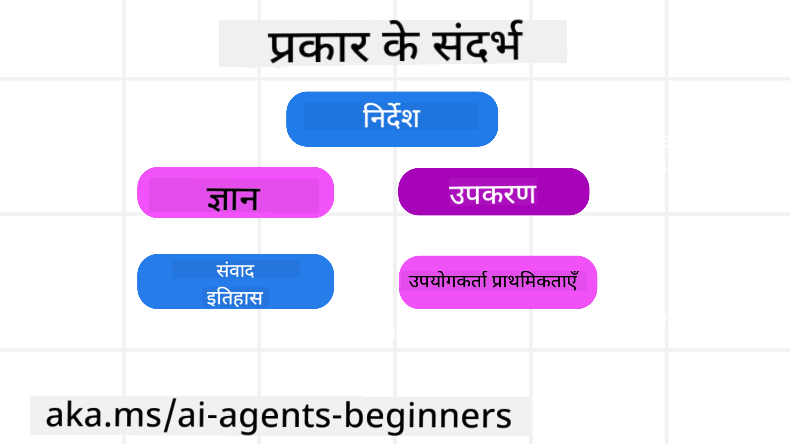
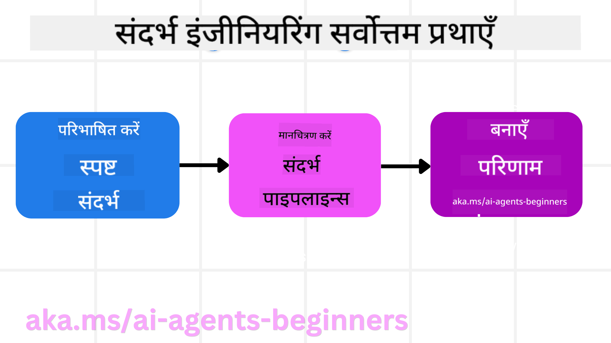

<!--
CO_OP_TRANSLATOR_METADATA:
{
  "original_hash": "cb7e50f471905ce6fdb92a30269a7a98",
  "translation_date": "2025-09-04T09:55:26+00:00",
  "source_file": "12-context-engineering/README.md",
  "language_code": "hi"
}
-->
# एआई एजेंट्स के लिए संदर्भ इंजीनियरिंग

> _(ऊपर दी गई छवि पर क्लिक करें इस पाठ का वीडियो देखने के लिए)_

जिस एप्लिकेशन के लिए आप एआई एजेंट बना रहे हैं, उसकी जटिलता को समझना एक भरोसेमंद एजेंट बनाने के लिए महत्वपूर्ण है। हमें ऐसे एआई एजेंट्स बनाने की आवश्यकता है जो जानकारी को प्रभावी ढंग से प्रबंधित करें ताकि जटिल आवश्यकताओं को पूरा किया जा सके, केवल प्रॉम्प्ट इंजीनियरिंग से आगे बढ़कर।

इस पाठ में, हम देखेंगे कि संदर्भ इंजीनियरिंग क्या है और एआई एजेंट्स बनाने में इसका क्या महत्व है।

## परिचय

इस पाठ में शामिल होगा:

• **संदर्भ इंजीनियरिंग क्या है** और यह प्रॉम्प्ट इंजीनियरिंग से कैसे अलग है।

• **प्रभावी संदर्भ इंजीनियरिंग के लिए रणनीतियाँ**, जिसमें जानकारी को लिखने, चुनने, संक्षिप्त करने और अलग करने के तरीके शामिल हैं।

• **सामान्य संदर्भ विफलताएँ** जो आपके एआई एजेंट को बाधित कर सकती हैं और उन्हें ठीक करने के तरीके।

## सीखने के लक्ष्य

इस पाठ को पूरा करने के बाद, आप समझ पाएंगे कि:

• **संदर्भ इंजीनियरिंग को परिभाषित करें** और इसे प्रॉम्प्ट इंजीनियरिंग से अलग करें।

• **एलएलएम (लार्ज लैंग्वेज मॉडल) एप्लिकेशन में संदर्भ के प्रमुख घटकों की पहचान करें।**

• **संदर्भ को लिखने, चुनने, संक्षिप्त करने और अलग करने की रणनीतियाँ लागू करें** ताकि एजेंट का प्रदर्शन बेहतर हो सके।

• **सामान्य संदर्भ विफलताओं को पहचानें** जैसे कि संदूषण, ध्यान भटकाव, भ्रम, और टकराव, और उनके समाधान की तकनीकें लागू करें।

## संदर्भ इंजीनियरिंग क्या है?

एआई एजेंट्स के लिए, संदर्भ वह है जो एआई एजेंट को कुछ कार्य करने की योजना बनाने के लिए प्रेरित करता है। संदर्भ इंजीनियरिंग यह सुनिश्चित करने की प्रक्रिया है कि एआई एजेंट के पास कार्य का अगला चरण पूरा करने के लिए सही जानकारी हो। संदर्भ विंडो का आकार सीमित होता है, इसलिए एजेंट निर्माताओं के रूप में हमें ऐसी प्रणालियाँ और प्रक्रियाएँ बनानी होंगी जो संदर्भ विंडो में जानकारी जोड़ने, हटाने और संक्षिप्त करने का प्रबंधन करें।

### प्रॉम्प्ट इंजीनियरिंग बनाम संदर्भ इंजीनियरिंग

प्रॉम्प्ट इंजीनियरिंग एक स्थिर निर्देशों के सेट पर केंद्रित है जो एआई एजेंट्स को नियमों के एक सेट के साथ प्रभावी ढंग से मार्गदर्शन करता है। संदर्भ इंजीनियरिंग एक गतिशील जानकारी के सेट को प्रबंधित करने के बारे में है, जिसमें प्रारंभिक प्रॉम्प्ट भी शामिल है, ताकि यह सुनिश्चित किया जा सके कि एआई एजेंट के पास समय के साथ आवश्यक जानकारी हो। संदर्भ इंजीनियरिंग का मुख्य विचार इस प्रक्रिया को दोहराने योग्य और विश्वसनीय बनाना है।

### संदर्भ के प्रकार

यह याद रखना महत्वपूर्ण है कि संदर्भ केवल एक चीज नहीं है। एआई एजेंट को आवश्यक जानकारी विभिन्न स्रोतों से प्राप्त हो सकती है, और यह हमारी जिम्मेदारी है कि एजेंट को इन स्रोतों तक पहुंच प्रदान करें:

एआई एजेंट को प्रबंधित करने की आवश्यकता वाले संदर्भ के प्रकारों में शामिल हैं:

• **निर्देश:** ये एजेंट के "नियमों" की तरह हैं – प्रॉम्प्ट्स, सिस्टम संदेश, कुछ उदाहरण (एआई को कुछ करने का तरीका दिखाना), और उन उपकरणों का विवरण जिनका वह उपयोग कर सकता है। यह वह जगह है जहां प्रॉम्प्ट इंजीनियरिंग संदर्भ इंजीनियरिंग के साथ मिलती है।

• **ज्ञान:** इसमें तथ्य, डेटाबेस से प्राप्त जानकारी, या एजेंट द्वारा संचित दीर्घकालिक यादें शामिल हैं। यदि एजेंट को विभिन्न ज्ञान भंडार और डेटाबेस तक पहुंच की आवश्यकता है, तो इसमें एक रिट्रीवल ऑगमेंटेड जनरेशन (RAG) प्रणाली को एकीकृत करना शामिल है।

• **उपकरण:** ये बाहरी कार्यों, एपीआई और एमसीपी सर्वरों की परिभाषाएँ हैं जिन्हें एजेंट कॉल कर सकता है, साथ ही उनके उपयोग से प्राप्त प्रतिक्रिया (परिणाम)।

• **वार्तालाप इतिहास:** उपयोगकर्ता के साथ चल रहे संवाद। समय के साथ, ये वार्तालाप लंबे और अधिक जटिल हो जाते हैं, जिसका अर्थ है कि वे संदर्भ विंडो में अधिक स्थान लेते हैं।

• **उपयोगकर्ता प्राथमिकताएँ:** समय के साथ उपयोगकर्ता की पसंद या नापसंद के बारे में सीखी गई जानकारी। ये प्रमुख निर्णय लेते समय उपयोगकर्ता की मदद करने के लिए संग्रहीत और उपयोग की जा सकती हैं।

## प्रभावी संदर्भ इंजीनियरिंग के लिए रणनीतियाँ

### योजना बनाने की रणनीतियाँ

अच्छी संदर्भ इंजीनियरिंग अच्छी योजना से शुरू होती है। यहां एक दृष्टिकोण है जो आपको संदर्भ इंजीनियरिंग की अवधारणा को लागू करने के बारे में सोचने में मदद करेगा:

1. **स्पष्ट परिणाम परिभाषित करें** - एआई एजेंट्स को सौंपे जाने वाले कार्यों के परिणाम स्पष्ट रूप से परिभाषित होने चाहिए। इस प्रश्न का उत्तर दें - "जब एआई एजेंट अपना कार्य पूरा कर लेगा, तो दुनिया कैसी दिखेगी?" दूसरे शब्दों में, उपयोगकर्ता को एआई एजेंट के साथ बातचीत के बाद क्या बदलाव, जानकारी, या प्रतिक्रिया प्राप्त होनी चाहिए।

2. **संदर्भ का मानचित्र बनाएं** - एक बार जब आप एआई एजेंट के परिणामों को परिभाषित कर लेते हैं, तो आपको इस प्रश्न का उत्तर देना होगा "एआई एजेंट को यह कार्य पूरा करने के लिए किस जानकारी की आवश्यकता है?" इस तरह आप यह मानचित्र बनाना शुरू कर सकते हैं कि वह जानकारी कहाँ स्थित हो सकती है।

3. **संदर्भ पाइपलाइनों का निर्माण करें** - अब जब आप जानते हैं कि जानकारी कहाँ है, तो आपको इस प्रश्न का उत्तर देना होगा "एजेंट यह जानकारी कैसे प्राप्त करेगा?" इसे विभिन्न तरीकों से किया जा सकता है, जिसमें RAG, MCP सर्वरों और अन्य उपकरणों का उपयोग शामिल है।

### व्यावहारिक रणनीतियाँ

योजना बनाना महत्वपूर्ण है, लेकिन एक बार जब जानकारी हमारे एजेंट के संदर्भ विंडो में प्रवाहित होने लगती है, तो हमें इसे प्रबंधित करने के लिए व्यावहारिक रणनीतियों की आवश्यकता होती है:

#### संदर्भ प्रबंधन

जबकि कुछ जानकारी संदर्भ विंडो में स्वचालित रूप से जोड़ी जाएगी, संदर्भ इंजीनियरिंग इस जानकारी को अधिक सक्रिय रूप से प्रबंधित करने के बारे में है, जिसे कुछ रणनीतियों द्वारा किया जा सकता है:

1. **एजेंट स्क्रैचपैड**  
   यह एआई एजेंट को एक सत्र के दौरान वर्तमान कार्यों और उपयोगकर्ता इंटरैक्शन के बारे में प्रासंगिक जानकारी नोट करने की अनुमति देता है। यह संदर्भ विंडो के बाहर एक फ़ाइल या रनटाइम ऑब्जेक्ट में मौजूद होना चाहिए जिसे एजेंट इस सत्र के दौरान बाद में पुनः प्राप्त कर सकता है यदि आवश्यक हो।

2. **यादें**  
   स्क्रैचपैड एक सत्र की संदर्भ विंडो के बाहर जानकारी प्रबंधित करने के लिए अच्छे हैं। यादें एजेंट्स को कई सत्रों में प्रासंगिक जानकारी संग्रहीत और पुनः प्राप्त करने में सक्षम बनाती हैं। इसमें सारांश, उपयोगकर्ता प्राथमिकताएँ और भविष्य में सुधार के लिए प्रतिक्रिया शामिल हो सकती है।

3. **संदर्भ को संक्षिप्त करना**  
   जब संदर्भ विंडो बढ़ती है और अपनी सीमा के करीब पहुंचती है, तो सारांश और ट्रिमिंग जैसी तकनीकों का उपयोग किया जा सकता है। इसमें केवल सबसे प्रासंगिक जानकारी रखना या पुराने संदेशों को हटाना शामिल है।

4. **मल्टी-एजेंट सिस्टम**  
   मल्टी-एजेंट सिस्टम विकसित करना संदर्भ इंजीनियरिंग का एक रूप है क्योंकि प्रत्येक एजेंट की अपनी संदर्भ विंडो होती है। जब इन एजेंट्स के बीच संदर्भ साझा और पास किया जाता है, तो इसे योजना बनाना महत्वपूर्ण होता है।

5. **सैंडबॉक्स वातावरण**  
   यदि किसी एजेंट को कुछ कोड चलाने या किसी दस्तावेज़ में बड़ी मात्रा में जानकारी संसाधित करने की आवश्यकता है, तो यह परिणामों को संसाधित करने के लिए बड़ी मात्रा में टोकन ले सकता है। इसे संदर्भ विंडो में संग्रहीत करने के बजाय, एजेंट एक सैंडबॉक्स वातावरण का उपयोग कर सकता है जो इस कोड को चला सकता है और केवल परिणाम और अन्य प्रासंगिक जानकारी पढ़ सकता है।

6. **रनटाइम स्टेट ऑब्जेक्ट्स**  
   यह तब किया जाता है जब एजेंट को कुछ जानकारी तक पहुंचने की आवश्यकता होती है। एक जटिल कार्य के लिए, यह एजेंट को प्रत्येक उप-कार्य के परिणामों को चरण दर चरण संग्रहीत करने में सक्षम बनाता है, जिससे संदर्भ केवल उस विशिष्ट उप-कार्य से जुड़ा रहता है।

### संदर्भ इंजीनियरिंग का उदाहरण

मान लीजिए हम चाहते हैं कि एक एआई एजेंट **"मुझे पेरिस की यात्रा बुक करें।"**

• केवल प्रॉम्प्ट इंजीनियरिंग का उपयोग करने वाला एक साधारण एजेंट बस जवाब दे सकता है: **"ठीक है, आप पेरिस कब जाना चाहेंगे?"**। यह केवल उपयोगकर्ता द्वारा पूछे गए समय पर आपके सीधे प्रश्न को संसाधित करता है।

• संदर्भ इंजीनियरिंग रणनीतियों का उपयोग करने वाला एक एजेंट इससे कहीं अधिक करेगा। जवाब देने से पहले, इसकी प्रणाली:

  ◦ **आपके कैलेंडर की जांच करें** उपलब्ध तिथियों के लिए (वास्तविक समय डेटा प्राप्त करना)।

 ◦ **पिछली यात्रा प्राथमिकताओं को याद करें** (दीर्घकालिक स्मृति से) जैसे आपकी पसंदीदा एयरलाइन, बजट, या क्या आप सीधे उड़ानों को प्राथमिकता देते हैं।

 ◦ **उपलब्ध उपकरणों की पहचान करें** उड़ान और होटल बुकिंग के लिए।

- फिर, एक उदाहरण प्रतिक्रिया हो सकती है: "नमस्ते [आपका नाम]! मुझे दिख रहा है कि आप अक्टूबर के पहले सप्ताह में खाली हैं। क्या मैं [पसंदीदा एयरलाइन] पर पेरिस के लिए सीधे उड़ानों को आपके सामान्य बजट [बजट] के भीतर देखूं?"। यह समृद्ध, संदर्भ-सचेत प्रतिक्रिया संदर्भ इंजीनियरिंग की शक्ति को प्रदर्शित करती है।

## सामान्य संदर्भ विफलताएँ

### संदर्भ संदूषण

**यह क्या है:** जब एक भ्रम (एलएलएम द्वारा उत्पन्न गलत जानकारी) या त्रुटि संदर्भ में प्रवेश करती है और बार-बार संदर्भित होती है, जिससे एजेंट असंभव लक्ष्यों का पीछा करता है या बेतुकी रणनीतियाँ विकसित करता है।

**क्या करें:** **संदर्भ मान्यता** और **क्वारंटाइन** लागू करें। जानकारी को दीर्घकालिक स्मृति में जोड़ने से पहले मान्य करें। यदि संभावित संदूषण का पता चलता है, तो संदर्भ थ्रेड्स को ताजा शुरू करें ताकि खराब जानकारी फैलने से रोकी जा सके।

**यात्रा बुकिंग उदाहरण:** आपका एजेंट एक **छोटे स्थानीय हवाई अड्डे से एक दूरस्थ अंतरराष्ट्रीय शहर के लिए सीधी उड़ान** का भ्रम उत्पन्न करता है जो वास्तव में अंतरराष्ट्रीय उड़ानें प्रदान नहीं करता। यह गैर-मौजूद उड़ान विवरण संदर्भ में सहेजा जाता है। बाद में, जब आप एजेंट से बुक करने के लिए कहते हैं, तो यह इस असंभव मार्ग के लिए टिकट खोजने की कोशिश करता रहता है, जिससे बार-बार त्रुटियाँ होती हैं।

**समाधान:** एक कदम लागू करें जो **वास्तविक समय एपीआई के साथ उड़ान अस्तित्व और मार्गों को मान्य करता है** _पहले_ उड़ान विवरण को एजेंट के कार्य संदर्भ में जोड़ने से। यदि मान्यता विफल होती है, तो गलत जानकारी "क्वारंटाइन" की जाती है और आगे उपयोग नहीं की जाती।

### संदर्भ ध्यान भटकाव

**यह क्या है:** जब संदर्भ इतना बड़ा हो जाता है कि मॉडल संचित इतिहास पर बहुत अधिक ध्यान केंद्रित करता है बजाय इसके कि उसने प्रशिक्षण के दौरान क्या सीखा, जिससे दोहराव या अनुपयोगी क्रियाएँ होती हैं। मॉडल संदर्भ विंडो भरने से पहले ही गलतियाँ करना शुरू कर सकते हैं।

**क्या करें:** **संदर्भ सारांश** का उपयोग करें। समय-समय पर संचित जानकारी को छोटे सारांशों में संक्षिप्त करें, महत्वपूर्ण विवरण रखते हुए अनावश्यक इतिहास को हटा दें। इससे "फोकस" को पुनः सेट करने में मदद मिलती है।

**यात्रा बुकिंग उदाहरण:** आप लंबे समय तक विभिन्न सपनों के यात्रा गंतव्यों पर चर्चा कर रहे हैं, जिसमें दो साल पहले की आपकी बैकपैकिंग यात्रा का विस्तृत विवरण शामिल है। जब आप अंततः पूछते हैं **"अगले महीने के लिए सस्ती उड़ान खोजें,"** तो एजेंट पुराने, अप्रासंगिक विवरणों में उलझ जाता है और आपके बैकपैकिंग गियर या पिछले यात्रा कार्यक्रमों के बारे में पूछता रहता है, आपकी वर्तमान अनुरोध को नजरअंदाज करता है।

**समाधान:** कुछ टर्न के बाद या जब संदर्भ बहुत बड़ा हो जाता है, तो एजेंट को **वार्तालाप के सबसे हालिया और प्रासंगिक हिस्सों का सारांश बनाना चाहिए** – आपकी वर्तमान यात्रा तिथियों और गंतव्य पर ध्यान केंद्रित करते हुए – और अगले एलएलएम कॉल के लिए उस संक्षिप्त सारांश का उपयोग करना चाहिए, कम प्रासंगिक ऐतिहासिक चैट को छोड़कर।

### संदर्भ भ्रम

**यह क्या है:** जब अनावश्यक संदर्भ, अक्सर बहुत अधिक उपलब्ध उपकरणों के रूप में, मॉडल को खराब प्रतिक्रियाएँ उत्पन्न करने या अप्रासंगिक उपकरणों को कॉल करने का कारण बनता है। छोटे मॉडल विशेष रूप से इसके प्रति संवेदनशील होते हैं।

**क्या करें:** RAG तकनीकों का उपयोग करके **उपकरण लोडआउट प्रबंधन** लागू करें। उपकरण विवरणों को एक वेक्टर डेटाबेस में संग्रहीत करें और प्रत्येक विशिष्ट कार्य के लिए केवल सबसे प्रासंग

---

**अस्वीकरण**:  
यह दस्तावेज़ AI अनुवाद सेवा [Co-op Translator](https://github.com/Azure/co-op-translator) का उपयोग करके अनुवादित किया गया है। जबकि हम सटीकता सुनिश्चित करने का प्रयास करते हैं, कृपया ध्यान दें कि स्वचालित अनुवाद में त्रुटियां या अशुद्धियां हो सकती हैं। मूल दस्तावेज़, जो इसकी मूल भाषा में है, को प्रामाणिक स्रोत माना जाना चाहिए। महत्वपूर्ण जानकारी के लिए, पेशेवर मानव अनुवाद की सिफारिश की जाती है। इस अनुवाद के उपयोग से उत्पन्न किसी भी गलतफहमी या गलत व्याख्या के लिए हम उत्तरदायी नहीं हैं।