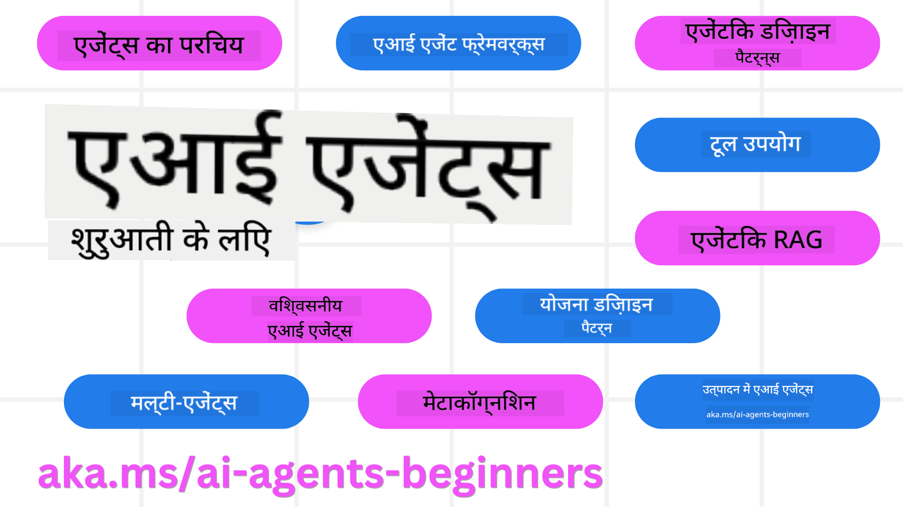

<!--
CO_OP_TRANSLATOR_METADATA:
{
  "original_hash": "6b07046397366e6f6f4524c9ddeba1e1",
  "translation_date": "2025-07-12T14:46:06+00:00",
  "source_file": "README.md",
  "language_code": "hi"
}
-->
# शुरुआती लोगों के लिए AI एजेंट्स - एक कोर्स

## AI एजेंट्स बनाने की शुरुआत करने के लिए जरूरी सब कुछ सिखाने वाले 11 पाठ

  
  
  
  

### 🌐 बहुभाषी समर्थन

#### GitHub Action के माध्यम से समर्थित (स्वचालित और हमेशा अपडेटेड)

[French](../fr/README.md) | [Spanish](../es/README.md) | [German](../de/README.md) | [Russian](../ru/README.md) | [Arabic](../ar/README.md) | [Persian (Farsi)](../fa/README.md) | [Urdu](../ur/README.md) | [Chinese (Simplified)](../zh/README.md) | [Chinese (Traditional, Macau)](../mo/README.md) | [Chinese (Traditional, Hong Kong)](../hk/README.md) | [Chinese (Traditional, Taiwan)](../tw/README.md) | [Japanese](../ja/README.md) | [Korean](../ko/README.md) | [Hindi](./README.md) | [Bengali](../bn/README.md) | [Marathi](../mr/README.md) | [Nepali](../ne/README.md) | [Punjabi (Gurmukhi)](../pa/README.md) | [Portuguese (Portugal)](../pt/README.md) | [Portuguese (Brazil)](../br/README.md) | [Italian](../it/README.md) | [Polish](../pl/README.md) | [Turkish](../tr/README.md) | [Greek](../el/README.md) | [Thai](../th/README.md) | [Swedish](../sv/README.md) | [Danish](../da/README.md) | [Norwegian](../no/README.md) | [Finnish](../fi/README.md) | [Dutch](../nl/README.md) | [Hebrew](../he/README.md) | [Vietnamese](../vi/README.md) | [Indonesian](../id/README.md) | [Malay](../ms/README.md) | [Tagalog (Filipino)](../tl/README.md) | [Swahili](../sw/README.md) | [Hungarian](../hu/README.md) | [Czech](../cs/README.md) | [Slovak](../sk/README.md) | [Romanian](../ro/README.md) | [Bulgarian](../bg/README.md) | [Serbian (Cyrillic)](../sr/README.md) | [Croatian](../hr/README.md) | [Slovenian](../sl/README.md) | [Ukrainian](../uk/README.md) | [Burmese (Myanmar)](../my/README.md)

**यदि आप अतिरिक्त भाषाओं में अनुवाद चाहते हैं, तो वे [यहाँ](https://github.com/Azure/co-op-translator/blob/main/getting_started/supported-languages.md) सूचीबद्ध हैं**

  
  

## 🌱 शुरुआत कैसे करें

इस कोर्स में AI एजेंट्स बनाने के मूल सिद्धांतों को कवर करने वाले 11 पाठ हैं। हर पाठ अपने विषय पर केंद्रित है, इसलिए आप अपनी पसंद से कहीं से भी शुरू कर सकते हैं!

इस कोर्स के लिए बहुभाषी समर्थन उपलब्ध है। हमारी [उपलब्ध भाषाओं की सूची यहाँ देखें](../..)।

यदि आप पहली बार Generative AI मॉडल के साथ काम कर रहे हैं, तो हमारा [Generative AI For Beginners](https://aka.ms/genai-beginners) कोर्स देखें, जिसमें GenAI के साथ निर्माण के 21 पाठ शामिल हैं।

इस रिपॉजिटरी को [⭐ स्टार देना](https://docs.github.com/en/get-started/exploring-projects-on-github/saving-repositories-with-stars?WT.mc_id=academic-105485-koreyst) और [फोर्क करना](https://github.com/microsoft/ai-agents-for-beginners/fork) न भूलें ताकि आप कोड चला सकें।

### आपको क्या चाहिए

इस कोर्स के हर पाठ में कोड उदाहरण शामिल हैं, जो code_samples फोल्डर में मिलेंगे। आप [इस रिपॉजिटरी को फोर्क](https://github.com/microsoft/ai-agents-for-beginners/fork) करके अपनी कॉपी बना सकते हैं।

इन अभ्यासों में कोड उदाहरण Azure AI Foundry और GitHub Model Catalogs का उपयोग करते हैं ताकि Language Models के साथ इंटरैक्ट किया जा सके:

- [Github Models](https://aka.ms/ai-agents-beginners/github-models) - मुफ्त / सीमित  
- [Azure AI Foundry](https://aka.ms/ai-agents-beginners/ai-foundry) - Azure अकाउंट आवश्यक

यह कोर्स Microsoft के निम्न AI Agent फ्रेमवर्क और सेवाओं का भी उपयोग करता है:

- [Azure AI Agent Service](https://aka.ms/ai-agents-beginners/ai-agent-service)  
- [Semantic Kernel](https://aka.ms/ai-agents-beginners/semantic-kernel)  
- [AutoGen](https://aka.ms/ai-agents/autogen)

इस कोर्स के लिए कोड चलाने के बारे में अधिक जानकारी के लिए [Course Setup](./00-course-setup/README.md) देखें।

## 🙏 मदद करना चाहते हैं?

क्या आपके पास सुझाव हैं या आपने कोई वर्तनी या कोड की गलतियाँ पाई हैं? [इश्यू उठाएँ](https://github.com/microsoft/ai-agents-for-beginners/issues?WT.mc_id=academic-105485-koreyst) या [पुल रिक्वेस्ट बनाएं](https://github.com/microsoft/ai-agents-for-beginners/pulls?WT.mc_id=academic-105485-koreyst)

यदि आप अटक गए हैं या AI एजेंट्स बनाने को लेकर कोई सवाल है, तो हमारे [Azure AI Foundry Community Discord](https://discord.gg/kzRShWzttr) में शामिल हों।

यदि आपके पास प्रोडक्ट फीडबैक है या निर्माण के दौरान कोई त्रुटि आती है, तो हमारे [Azure AI Foundry Developer Forum](https://aka.ms/azureaifoundry/forum) पर जाएं।

## 📂 हर पाठ में शामिल है

- README में लिखित पाठ और एक छोटा वीडियो  
- Azure AI Foundry और Github Models (मुफ्त) के लिए Python कोड उदाहरण  
- सीखने को जारी रखने के लिए अतिरिक्त संसाधनों के लिंक

## 🗃️ पाठ

| **पाठ**                                | **पाठ्य और कोड**                                   | **वीडियो**                                                  | **अतिरिक्त सीखने के संसाधन**                                                          |
|----------------------------------------|----------------------------------------------------|------------------------------------------------------------|----------------------------------------------------------------------------------------|
| AI एजेंट्स और एजेंट उपयोग के मामले परिचय | [लिंक](./01-intro-to-ai-agents/README.md)          | [वीडियो](https://youtu.be/3zgm60bXmQk?si=z8QygFvYQv-9WtO1)  | [लिंक](https://aka.ms/ai-agents-beginners/collection?WT.mc_id=academic-105485-koreyst) |
| AI एजेंटिक फ्रेमवर्क्स का अन्वेषण       | [लिंक](./02-explore-agentic-frameworks/README.md)  | [वीडियो](https://youtu.be/ODwF-EZo_O8?si=Vawth4hzVaHv-u0H)  | [लिंक](https://aka.ms/ai-agents-beginners/collection?WT.mc_id=academic-105485-koreyst) |
| AI एजेंटिक डिज़ाइन पैटर्न की समझ       | [लिंक](./03-agentic-design-patterns/README.md)     | [वीडियो](https://youtu.be/m9lM8qqoOEA?si=BIzHwzstTPL8o9GF)  | [लिंक](https://aka.ms/ai-agents-beginners/collection?WT.mc_id=academic-105485-koreyst) |
| टूल उपयोग डिज़ाइन पैटर्न                | [लिंक](./04-tool-use/README.md)                    | [वीडियो](https://youtu.be/vieRiPRx-gI?si=2z6O2Xu2cu_Jz46N)  | [लिंक](https://aka.ms/ai-agents-beginners/collection?WT.mc_id=academic-105485-koreyst) |
| एजेंटिक RAG                           | [लिंक](./05-agentic-rag/README.md)                 | [वीडियो](https://youtu.be/WcjAARvdL7I?si=gKPWsQpKiIlDH9A3)  | [लिंक](https://aka.ms/ai-agents-beginners/collection?WT.mc_id=academic-105485-koreyst) |
| भरोसेमंद AI एजेंट्स बनाना              | [लिंक](./06-building-trustworthy-agents/README.md) | [वीडियो](https://youtu.be/iZKkMEGBCUQ?si=jZjpiMnGFOE9L8OK ) | [लिंक](https://aka.ms/ai-agents-beginners/collection?WT.mc_id=academic-105485-koreyst) |
| योजना डिज़ाइन पैटर्न                   | [लिंक](./07-planning-design/README.md)             | [वीडियो](https://youtu.be/kPfJ2BrBCMY?si=6SC_iv_E5-mzucnC)  | [लिंक](https://aka.ms/ai-agents-beginners/collection?WT.mc_id=academic-105485-koreyst) |
| मल्टी-एजेंट डिज़ाइन पैटर्न             | [लिंक](./08-multi-agent/README.md)                 | [वीडियो](https://youtu.be/V6HpE9hZEx0?si=rMgDhEu7wXo2uo6g)  | [लिंक](https://aka.ms/ai-agents-beginners/collection?WT.mc_id=academic-105485-koreyst) |
| मेटाकॉग्निशन डिज़ाइन पैटर्न           | [लिंक](./09-metacognition/README.md)               | [वीडियो](https://youtu.be/His9R6gw6Ec?si=8gck6vvdSNCt6OcF)  | [लिंक](https://aka.ms/ai-agents-beginners/collection?WT.mc_id=academic-105485-koreyst) |
| प्रोडक्शन में AI एजेंट्स                | [लिंक](./10-ai-agents-production/README.md)        | [वीडियो](https://youtu.be/l4TP6IyJxmQ?si=31dnhexRo6yLRJDl)  | [लिंक](https://aka.ms/ai-agents-beginners/collection?WT.mc_id=academic-105485-koreyst) |
| MCP के साथ AI एजेंट्स                   | [लिंक](./11-mcp/README.md)                         |                                                            | [लिंक](https://aka.ms/mcp-for-beginners)                                               |

## 🎒 अन्य कोर्स

हमारी टीम अन्य कोर्स भी बनाती है! देखें:
- [**नया** Model Context Protocol (MCP) शुरुआती के लिए](https://github.com/microsoft/mcp-for-beginners?WT.mc_id=academic-105485-koreyst)
- [.NET का उपयोग करके शुरुआती के लिए Generative AI](https://github.com/microsoft/Generative-AI-for-beginners-dotnet?WT.mc_id=academic-105485-koreyst)
- [शुरुआती के लिए Generative AI](https://github.com/microsoft/generative-ai-for-beginners?WT.mc_id=academic-105485-koreyst)
- [शुरुआती के लिए ML](https://aka.ms/ml-beginners?WT.mc_id=academic-105485-koreyst)
- [शुरुआती के लिए डेटा साइंस](https://aka.ms/datascience-beginners?WT.mc_id=academic-105485-koreyst)
- [शुरुआती के लिए AI](https://aka.ms/ai-beginners?WT.mc_id=academic-105485-koreyst)
- [शुरुआती के लिए साइबरसिक्योरिटी](https://github.com/microsoft/Security-101??WT.mc_id=academic-96948-sayoung)
- [शुरुआती के लिए वेब डेवलपमेंट](https://aka.ms/webdev-beginners?WT.mc_id=academic-105485-koreyst)
- [शुरुआती के लिए IoT](https://aka.ms/iot-beginners?WT.mc_id=academic-105485-koreyst)
- [शुरुआती के लिए XR डेवलपमेंट](https://github.com/microsoft/xr-development-for-beginners?WT.mc_id=academic-105485-koreyst)
- [AI Paired Programming के लिए GitHub Copilot में महारत हासिल करें](https://aka.ms/GitHubCopilotAI?WT.mc_id=academic-105485-koreyst)
- [C#/.NET डेवलपर्स के लिए GitHub Copilot में महारत हासिल करें](https://github.com/microsoft/mastering-github-copilot-for-dotnet-csharp-developers?WT.mc_id=academic-105485-koreyst)
- [अपना खुद का Copilot एडवेंचर चुनें](https://github.com/microsoft/CopilotAdventures?WT.mc_id=academic-105485-koreyst)

## 🌟 समुदाय का धन्यवाद

Agentic RAG को दर्शाने वाले महत्वपूर्ण कोड नमूनों के योगदान के लिए [Shivam Goyal](https://www.linkedin.com/in/shivam2003/) का धन्यवाद।

## योगदान

यह प्रोजेक्ट योगदान और सुझावों का स्वागत करता है। अधिकांश योगदानों के लिए आपको एक Contributor License Agreement (CLA) से सहमत होना होगा, जिसमें आप यह घोषणा करते हैं कि आपके पास अपने योगदान का उपयोग करने का अधिकार है और आप हमें वह अधिकार प्रदान करते हैं। विवरण के लिए देखें  
<https://cla.opensource.microsoft.com>।

जब आप एक पुल रिक्वेस्ट सबमिट करते हैं, तो एक CLA बॉट स्वचालित रूप से यह निर्धारित करेगा कि आपको CLA प्रदान करने की आवश्यकता है या नहीं और PR को उपयुक्त रूप से चिह्नित करेगा (जैसे, स्टेटस चेक, टिप्पणी)। बस बॉट द्वारा दिए गए निर्देशों का पालन करें। आपको यह केवल उन सभी रिपोज में एक बार करना होगा जो हमारे CLA का उपयोग करते हैं।

इस प्रोजेक्ट ने [Microsoft Open Source Code of Conduct](https://opensource.microsoft.com/codeofconduct/) को अपनाया है।  
अधिक जानकारी के लिए देखें [Code of Conduct FAQ](https://opensource.microsoft.com/codeofconduct/faq/) या किसी भी अतिरिक्त प्रश्न या टिप्पणी के लिए [opencode@microsoft.com](mailto:opencode@microsoft.com) से संपर्क करें।

## ट्रेडमार्क

इस प्रोजेक्ट में प्रोजेक्ट्स, उत्पादों, या सेवाओं के ट्रेडमार्क या लोगो हो सकते हैं। Microsoft ट्रेडमार्क या लोगो के अधिकृत उपयोग के लिए [Microsoft के ट्रेडमार्क और ब्रांड दिशानिर्देश](https://www.microsoft.com/legal/intellectualproperty/trademarks/usage/general) का पालन करना आवश्यक है।  
इस प्रोजेक्ट के संशोधित संस्करणों में Microsoft ट्रेडमार्क या लोगो का उपयोग भ्रमित करने वाला नहीं होना चाहिए और न ही Microsoft के प्रायोजन का संकेत देना चाहिए।  
किसी भी तृतीय-पक्ष ट्रेडमार्क या लोगो का उपयोग उन तृतीय-पक्षों की नीतियों के अधीन होगा।

**अस्वीकरण**:  
यह दस्तावेज़ AI अनुवाद सेवा [Co-op Translator](https://github.com/Azure/co-op-translator) का उपयोग करके अनुवादित किया गया है। जबकि हम सटीकता के लिए प्रयासरत हैं, कृपया ध्यान दें कि स्वचालित अनुवादों में त्रुटियाँ या अशुद्धियाँ हो सकती हैं। मूल दस्तावेज़ अपनी मूल भाषा में ही अधिकारिक स्रोत माना जाना चाहिए। महत्वपूर्ण जानकारी के लिए, पेशेवर मानव अनुवाद की सलाह दी जाती है। इस अनुवाद के उपयोग से उत्पन्न किसी भी गलतफहमी या गलत व्याख्या के लिए हम जिम्मेदार नहीं हैं।