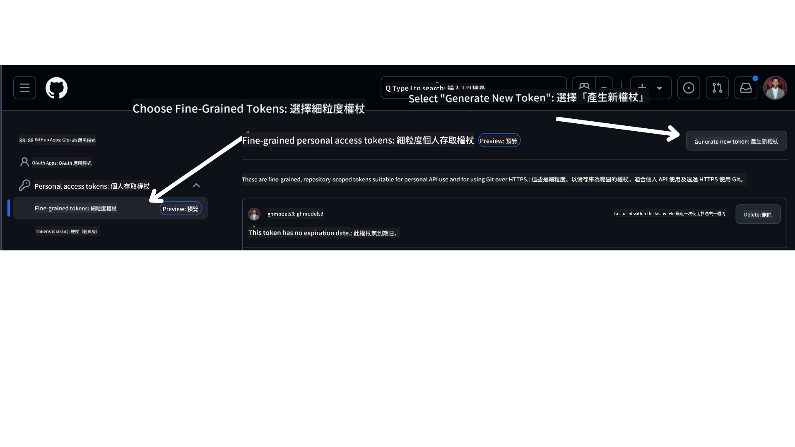

<!--
CO_OP_TRANSLATOR_METADATA:
{
  "original_hash": "76945069b52a49cd0432ae3e0b0ba22e",
  "translation_date": "2025-07-12T07:45:24+00:00",
  "source_file": "00-course-setup/README.md",
  "language_code": "hk"
}
-->
你現在應該已經擁有這個課程的分支版本，連結如下：


## 執行程式碼

本課程提供一系列的 Jupyter 筆記本，讓你可以實際操作並建立 AI 代理人。

程式碼範例使用以下其中一種：

**需要 GitHub 帳號 - 免費**：

1) Semantic Kernel Agent Framework + GitHub Models Marketplace。標示為 (semantic-kernel.ipynb)
2) AutoGen Framework + GitHub Models Marketplace。標示為 (autogen.ipynb)

**需要 Azure 訂閱**：
3) Azure AI Foundry + Azure AI Agent Service。標示為 (azureaiagent.ipynb)

我們鼓勵你嘗試這三種範例，看看哪一種最適合你。

無論你選擇哪一種，接下來要依照以下步驟進行設定：

## 需求

- Python 3.12+
  - **NOTE**：如果你尚未安裝 Python 3.12，請先安裝。接著使用 python3.12 建立虛擬環境，確保從 requirements.txt 安裝正確版本的套件。
- GitHub 帳號 - 用於存取 GitHub Models Marketplace
- Azure 訂閱 - 用於存取 Azure AI Foundry
- Azure AI Foundry 帳號 - 用於存取 Azure AI Agent Service

本儲存庫根目錄中包含 `requirements.txt`，內含執行程式碼範例所需的所有 Python 套件。

你可以在儲存庫根目錄的終端機執行以下指令安裝：

```bash
pip install -r requirements.txt
```

建議建立 Python 虛擬環境，以避免衝突與問題。

## 設定 VSCode
請確保 VSCode 使用正確版本的 Python。


## 使用 GitHub Models 範例的設定

### 步驟 1：取得你的 GitHub Personal Access Token (PAT)

本課程目前使用 GitHub Models Marketplace，提供免費存取大型語言模型 (LLMs)，用於建立 AI 代理人。

要使用此服務，你需要建立 GitHub Personal Access Token。

請在你的 GitHub 帳號中操作。

在畫面左側選擇 `Fine-grained tokens` 選項。

接著選擇 `Generate new token`。



系統會要求你輸入 token 名稱、選擇過期時間（建議：30 天），並設定 token 權限範圍（Public Repositories）。

同時需要編輯此 token 的權限：Permissions -> Models -> 允許存取 GitHub Models。

複製你剛建立的 token，接著將它加入本課程附帶的 `.env` 檔案中。

### 步驟 2：建立你的 `.env` 檔案

在終端機執行以下指令建立 `.env` 檔案：

```bash
cp .env.example .env
```

此指令會複製範例檔案並在目錄中建立 `.env`，你可以在裡面填入環境變數的值。

複製 token 後，使用你喜歡的文字編輯器打開 `.env`，將 token 貼到 `GITHUB_TOKEN` 欄位。

現在你就可以執行本課程的程式碼範例了。

## 使用 Azure AI Foundry 和 Azure AI Agent Service 範例的設定

### 步驟 1：取得你的 Azure 專案端點

請依照此處說明建立 Azure AI Foundry 的 hub 和專案：[Hub resources overview](https://learn.microsoft.com/en-us/azure/ai-foundry/concepts/ai-resources)

建立專案後，需取得專案的連接字串。

可在 Azure AI Foundry 入口網站的專案 **Overview** 頁面找到。


### 步驟 2：建立你的 `.env` 檔案

在終端機執行以下指令建立 `.env` 檔案：

```bash
cp .env.example .env
```

此指令會複製範例檔案並在目錄中建立 `.env`，你可以在裡面填入環境變數的值。

複製連接字串後，使用你喜歡的文字編輯器打開 `.env`，將連接字串貼到 `PROJECT_ENDPOINT` 欄位。

### 步驟 3：登入 Azure

為了安全起見，我們將使用 [keyless authentication](https://learn.microsoft.com/azure/developer/ai/keyless-connections?tabs=csharp%2Cazure-cli?WT.mc_id=academic-105485-koreyst) 透過 Microsoft Entra ID 認證 Azure OpenAI。首先，請依照你的作業系統安裝 **Azure CLI**，參考[安裝說明](https://learn.microsoft.com/cli/azure/install-azure-cli?WT.mc_id=academic-105485-koreyst)。

接著，打開終端機執行 `az login --use-device-code` 登入你的 Azure 帳號。

登入後，在終端機選擇你的訂閱。

## 額外環境變數 - Azure Search 與 Azure OpenAI

在 Agentic RAG 課程（第 5 課）中，有使用 Azure Search 與 Azure OpenAI 的範例。

若要執行這些範例，需在 `.env` 檔案中加入以下環境變數：

### 專案 Overview 頁面

- `AZURE_SUBSCRIPTION_ID` - 在專案 **Overview** 頁面的 **Project details** 查看。

- `AZURE_AI_PROJECT_NAME` - 在專案 **Overview** 頁面頂端查看。

- `AZURE_OPENAI_SERVICE` - 在 **Overview** 頁面的 **Included capabilities** 標籤中找到 **Azure OpenAI Service**。

### 管理中心

- `AZURE_OPENAI_RESOURCE_GROUP` - 在 **Management Center** 的 **Overview** 頁面中 **Project properties** 查看。

- `GLOBAL_LLM_SERVICE` - 在 **Connected resources** 中找到 **Azure AI Services** 連線名稱。若未列出，請在 Azure 入口網站的資源群組中查看 AI Services 資源名稱。

### 模型與端點頁面

- `AZURE_OPENAI_EMBEDDING_DEPLOYMENT_NAME` - 選擇你的嵌入模型（例如 `text-embedding-ada-002`），並記下模型詳細資料中的 **Deployment name**。

- `AZURE_OPENAI_CHAT_DEPLOYMENT_NAME` - 選擇你的聊天模型（例如 `gpt-4o-mini`），並記下模型詳細資料中的 **Deployment name**。

### Azure 入口網站

- `AZURE_OPENAI_ENDPOINT` - 找到 **Azure AI services**，點擊後進入 **Resource Management**，再到 **Keys and Endpoint**，往下捲動至「Azure OpenAI endpoints」，複製標示為「Language APIs」的端點。

- `AZURE_OPENAI_API_KEY` - 同一頁面複製 KEY 1 或 KEY 2。

- `AZURE_SEARCH_SERVICE_ENDPOINT` - 找到你的 **Azure AI Search** 資源，點擊後查看 **Overview**。

- `AZURE_SEARCH_API_KEY` - 進入 **Settings**，再到 **Keys**，複製主要或次要管理金鑰。

### 外部網頁

- `AZURE_OPENAI_API_VERSION` - 參考 [API 版本生命週期](https://learn.microsoft.com/en-us/azure/ai-services/openai/api-version-deprecation#latest-ga-api-release) 頁面中的 **Latest GA API release**。

### 設定無密鑰認證

為避免硬編碼憑證，我們將使用 Azure OpenAI 的無密鑰連線。為此，我們會匯入 `DefaultAzureCredential`，並在後續呼叫此函式取得憑證。

```python
from azure.identity import DefaultAzureCredential, InteractiveBrowserCredential
```

## 遇到困難？

如果在設定過程中遇到任何問題，歡迎加入我們的

或

。

## 下一課

你現在已準備好執行本課程的程式碼。祝你在 AI 代理人的世界中學習愉快！

[AI 代理人介紹與應用案例](../01-intro-to-ai-agents/README.md)

**免責聲明**：  
本文件由 AI 翻譯服務 [Co-op Translator](https://github.com/Azure/co-op-translator) 進行翻譯。雖然我們致力於確保準確性，但請注意自動翻譯可能包含錯誤或不準確之處。原始文件的母語版本應被視為權威來源。對於重要資訊，建議採用專業人工翻譯。我們不對因使用本翻譯而引起的任何誤解或誤釋承擔責任。