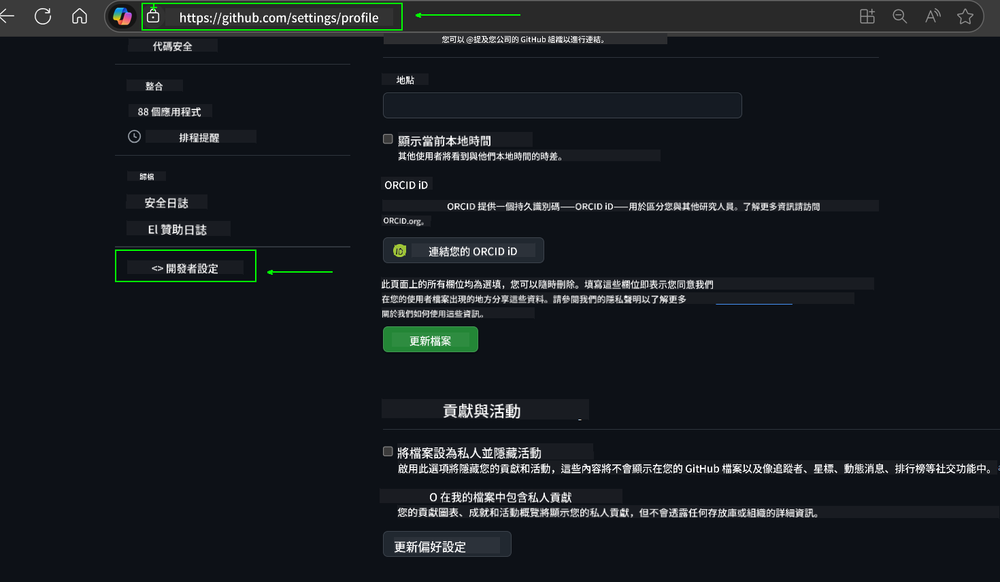
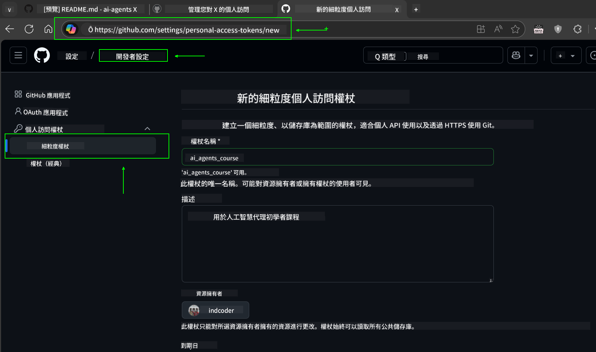
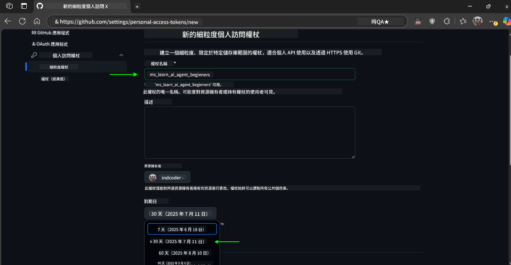
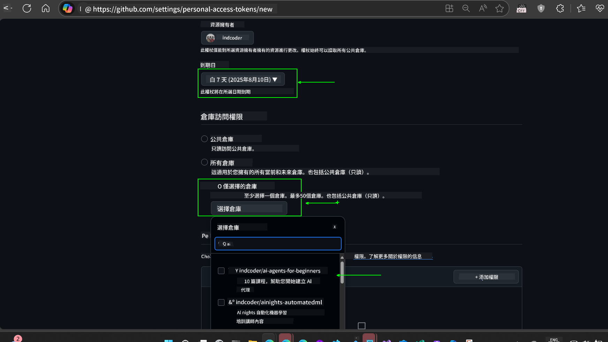
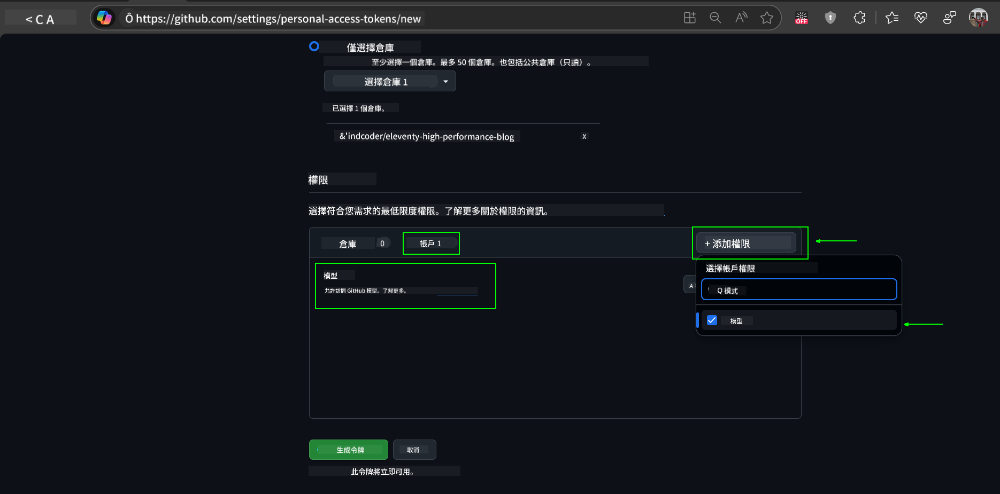
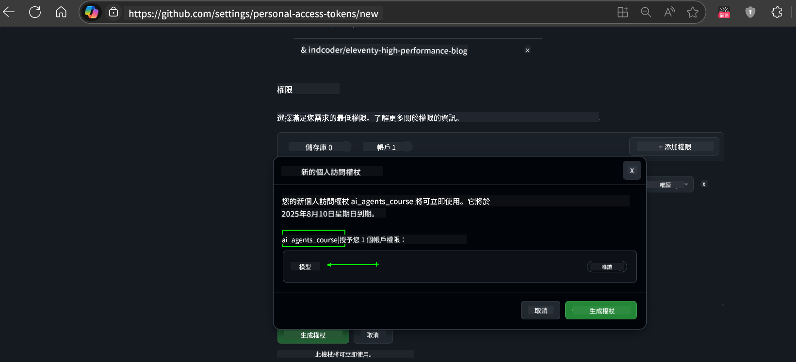
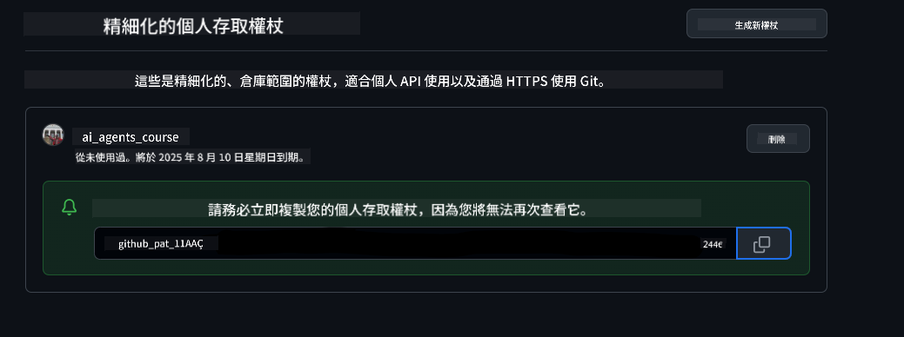
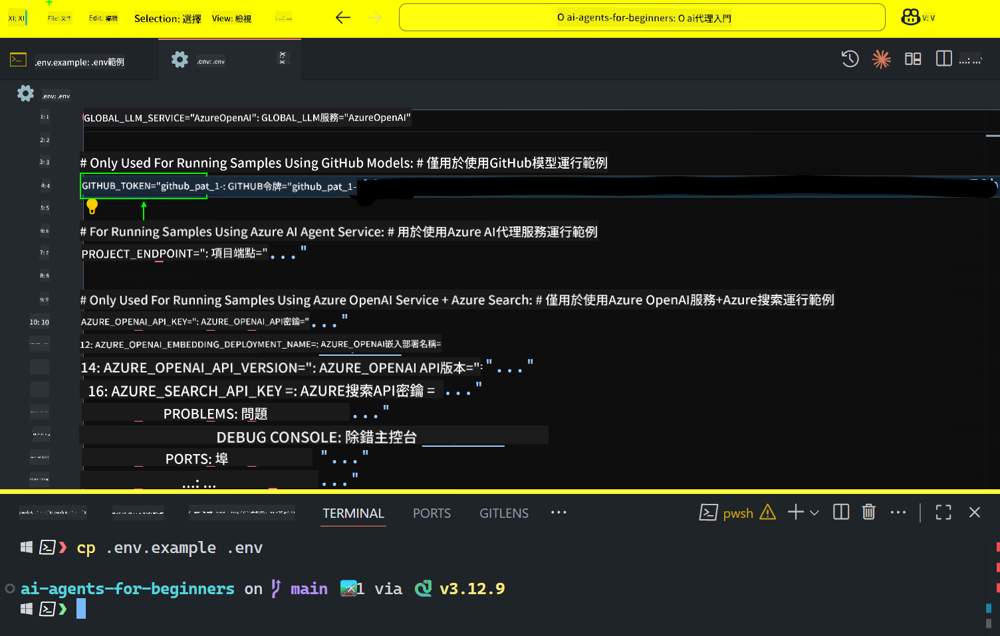

<!--
CO_OP_TRANSLATOR_METADATA:
{
  "original_hash": "c55b973b1562abf5aadf6a4028265ac5",
  "translation_date": "2025-08-28T09:31:28+00:00",
  "source_file": "00-course-setup/README.md",
  "language_code": "hk"
}
-->
# 課程設置

## 簡介

這一課將涵蓋如何運行本課程的代碼示例。

## 加入其他學員並獲取幫助

在開始克隆你的倉庫之前，請加入 [AI Agents For Beginners Discord 頻道](https://aka.ms/ai-agents/discord)，以獲取設置幫助、解答課程相關問題，或與其他學員交流。

## 克隆或分叉此倉庫

首先，請克隆或分叉 GitHub 倉庫。這樣你就可以擁有課程材料的自己的版本，方便運行、測試和調整代碼！

可以通過點擊以下鏈接完成：

你現在應該在以下鏈接中擁有課程的分叉版本：


## 運行代碼

本課程提供了一系列 Jupyter Notebook，讓你可以親自體驗如何構建 AI Agents。

代碼示例使用以下選項之一：

**需要 GitHub 帳戶 - 免費**：

1) Semantic Kernel Agent Framework + GitHub Models Marketplace，標記為 (semantic-kernel.ipynb)  
2) AutoGen Framework + GitHub Models Marketplace，標記為 (autogen.ipynb)  

**需要 Azure 訂閱**：  
3) Azure AI Foundry + Azure AI Agent Service，標記為 (azureaiagent.ipynb)  

我們鼓勵你嘗試所有三種類型的示例，看看哪一種最適合你。

無論選擇哪種選項，都將決定你需要遵循以下哪個設置步驟：

## 要求

- Python 3.12+
  - **注意**：如果你尚未安裝 Python 3.12，請確保安裝它。然後使用 python3.12 創建虛擬環境，以確保從 requirements.txt 文件中安裝正確的版本。
- 一個 GitHub 帳戶 - 用於訪問 GitHub Models Marketplace
- Azure 訂閱 - 用於訪問 Azure AI Foundry
- Azure AI Foundry 帳戶 - 用於訪問 Azure AI Agent Service

我們在此倉庫的根目錄中包含了一個 `requirements.txt` 文件，其中包含運行代碼示例所需的所有 Python 包。

你可以在倉庫根目錄的終端中運行以下命令來安裝它們：

```bash
pip install -r requirements.txt
```  
我們建議創建一個 Python 虛擬環境以避免任何衝突和問題。

## 設置 VSCode

確保你在 VSCode 中使用正確版本的 Python。


## 使用 GitHub Models 的示例設置

### 步驟 1：獲取你的 GitHub Personal Access Token (PAT)

本課程利用 GitHub Models Marketplace，提供免費訪問大型語言模型 (LLMs)，你將使用它們來構建 AI Agents。

要使用 GitHub Models，你需要創建一個 [GitHub Personal Access Token](https://docs.github.com/en/authentication/keeping-your-account-and-data-secure/managing-your-personal-access-tokens)。

這可以通過進入你的 GitHub 帳戶完成。

請在創建令牌時遵循 [最小權限原則](https://docs.github.com/en/get-started/learning-to-code/storing-your-secrets-safely)。這意味著你應該僅賦予令牌運行本課程代碼示例所需的權限。

1. 在屏幕左側的 **Developer settings** 中選擇 `Fine-grained tokens` 選項  
   

   然後選擇 `Generate new token`。

   

2. 為你的令牌輸入一個描述性名稱，反映其用途，方便以後識別。

    🔐 **令牌有效期建議**  
    建議有效期：30 天  
    如果希望更安全，可以選擇更短的期限，例如 7 天 🛡️  
    這是一個很好的方式，幫助你在學習動力高漲時完成課程 🚀。

    

3. 將令牌的作用範圍限制為此倉庫的分叉版本。

    

4. 限制令牌的權限：在 **Permissions** 下，點擊 **Account** 標籤，然後點擊 "+ Add permissions" 按鈕。會出現一個下拉菜單。請搜索 **Models** 並勾選它。  
    

5. 在生成令牌之前，驗證所需的權限。  
   

6. 在生成令牌之前，確保你準備好將令牌存儲在安全的地方，例如密碼管理器保險庫，因為生成後將無法再次查看。  
   

複製你剛剛創建的新令牌。現在，你需要將其添加到本課程包含的 `.env` 文件中。

### 步驟 2：創建 `.env` 文件

在終端中運行以下命令來創建 `.env` 文件：

```bash
cp .env.example .env
```

這將複製示例文件並在你的目錄中創建 `.env` 文件，然後你需要填寫環境變量的值。

複製令牌後，打開你喜歡的文本編輯器，將令牌粘貼到 `.env` 文件中的 `GITHUB_TOKEN` 字段。  


現在你應該能夠運行本課程的代碼示例。

## 使用 Azure AI Foundry 和 Azure AI Agent Service 的示例設置

### 步驟 1：獲取你的 Azure 項目端點

按照此處的步驟創建 Azure AI Foundry 中的 hub 和項目：[Hub 資源概述](https://learn.microsoft.com/en-us/azure/ai-foundry/concepts/ai-resources)

創建項目後，你需要獲取項目的連接字符串。

這可以通過進入 Azure AI Foundry 門戶中項目的 **Overview** 頁面完成。


### 步驟 2：創建 `.env` 文件

在終端中運行以下命令來創建 `.env` 文件：

```bash
cp .env.example .env
```

這將複製示例文件並在你的目錄中創建 `.env` 文件，然後你需要填寫環境變量的值。

複製令牌後，打開你喜歡的文本編輯器，將令牌粘貼到 `.env` 文件中的 `PROJECT_ENDPOINT` 字段。

### 步驟 3：登錄 Azure

作為安全最佳實踐，我們將使用 [無密鑰身份驗證](https://learn.microsoft.com/azure/developer/ai/keyless-connections?tabs=csharp%2Cazure-cli?WT.mc_id=academic-105485-koreyst) 通過 Microsoft Entra ID 驗證到 Azure OpenAI。

接下來，打開終端並運行 `az login --use-device-code` 登錄到你的 Azure 帳戶。

登錄後，在終端中選擇你的訂閱。

## 額外的環境變量 - Azure Search 和 Azure OpenAI

在第 5 課的 Agentic RAG 課程中，有一些示例使用了 Azure Search 和 Azure OpenAI。

如果你想運行這些示例，需要將以下環境變量添加到 `.env` 文件中：

### 項目概覽頁面

- `AZURE_SUBSCRIPTION_ID` - 查看項目 **Overview** 頁面的 **Project details**。
- `AZURE_AI_PROJECT_NAME` - 查看項目 **Overview** 頁面頂部的名稱。
- `AZURE_OPENAI_SERVICE` - 在 **Overview** 頁面的 **Included capabilities** 標籤中找到 Azure OpenAI Service。

### 管理中心

- `AZURE_OPENAI_RESOURCE_GROUP` - 在 **Management Center** 的 **Overview** 頁面中，進入 **Project properties**。
- `GLOBAL_LLM_SERVICE` - 在 **Connected resources** 下找到 Azure AI Services 的連接名稱。如果未列出，請檢查 Azure 入口網站中資源組的 AI Services 資源名稱。

### 模型 + 端點頁面

- `AZURE_OPENAI_EMBEDDING_DEPLOYMENT_NAME` - 選擇你的嵌入模型（例如 `text-embedding-ada-002`），並記下模型詳情中的 **Deployment name**。
- `AZURE_OPENAI_CHAT_DEPLOYMENT_NAME` - 選擇你的聊天模型（例如 `gpt-4o-mini`），並記下模型詳情中的 **Deployment name**。

### Azure 入口網站

- `AZURE_OPENAI_ENDPOINT` - 查找 **Azure AI services**，點擊它，然後進入 **Resource Management**，選擇 **Keys and Endpoint**，向下滾動到 "Azure OpenAI endpoints"，複製 "Language APIs" 的端點。
- `AZURE_OPENAI_API_KEY` - 在同一屏幕中，複製 KEY 1 或 KEY 2。
- `AZURE_SEARCH_SERVICE_ENDPOINT` - 找到你的 **Azure AI Search** 資源，點擊它，然後查看 **Overview**。
- `AZURE_SEARCH_API_KEY` - 然後進入 **Settings**，選擇 **Keys**，複製主密鑰或次密鑰。

### 外部網頁

- `AZURE_OPENAI_API_VERSION` - 訪問 [API 版本生命周期](https://learn.microsoft.com/en-us/azure/ai-services/openai/api-version-deprecation#latest-ga-api-release) 頁面，查看 **Latest GA API release**。

### 設置無密鑰身份驗證

為避免硬編碼憑據，我們將使用 Azure OpenAI 的無密鑰連接。為此，我們將導入 `DefaultAzureCredential`，稍後調用 `DefaultAzureCredential` 函數以獲取憑據。

```python
from azure.identity import DefaultAzureCredential, InteractiveBrowserCredential
```

## 卡住了嗎？

如果在運行設置時遇到任何問題，請加入我們的

## 下一課

現在你已準備好運行本課程的代碼。祝你在探索 AI Agents 的世界中學習愉快！

[AI Agents 和 Agent 用例簡介](../01-intro-to-ai-agents/README.md)

---

**免責聲明**：  
此文件已使用人工智能翻譯服務 [Co-op Translator](https://github.com/Azure/co-op-translator) 翻譯。我們致力於提供準確的翻譯，但請注意，自動翻譯可能包含錯誤或不準確之處。應以原始語言的文件作為權威來源。對於關鍵資訊，建議尋求專業人工翻譯。我們對因使用此翻譯而引起的任何誤解或誤釋不承擔責任。