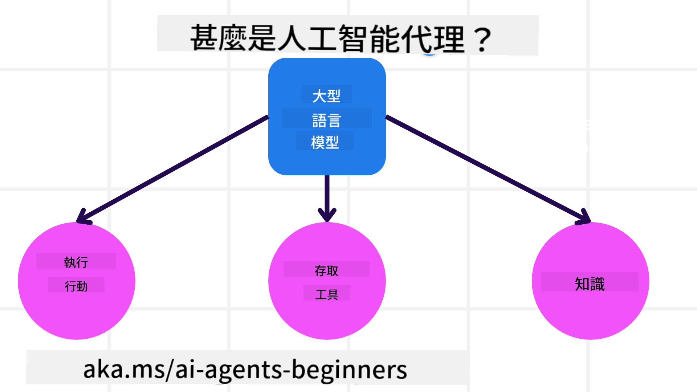
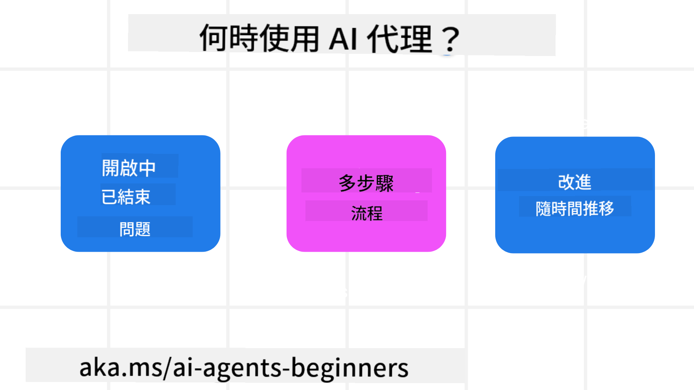

<!--
CO_OP_TRANSLATOR_METADATA:
{
  "original_hash": "d84943abc8f001ad4670418d32c2d899",
  "translation_date": "2025-07-12T08:02:39+00:00",
  "source_file": "01-intro-to-ai-agents/README.md",
  "language_code": "hk"
}
-->
加入我們的社群，與其他學習者和 AI Agent 建立者交流，並隨時提出你對本課程的任何疑問。

開始本課程前，我們先深入了解什麼是 AI Agents，以及如何在我們所建構的應用程式和工作流程中運用它們。

## 介紹

本課程涵蓋：

- 什麼是 AI Agents，以及不同類型的代理人是什麼？
- AI Agents 最適合用於哪些應用場景？它們如何幫助我們？
- 設計 Agentic 解決方案時的一些基本構建要素是什麼？

## 學習目標
完成本課程後，你應該能夠：

- 理解 AI Agent 的概念，以及它們與其他 AI 解決方案的不同之處。
- 有效地應用 AI Agents。
- 為用戶和客戶高效設計 Agentic 解決方案。

## 定義 AI Agents 及其類型

### 什麼是 AI Agents？

AI Agents 是一種**系統**，它讓**大型語言模型（LLMs）**能夠**執行動作**，透過賦予 LLMs **使用工具**和**知識**的能力來擴展其功能。

讓我們將這個定義拆解成幾個部分：

- **系統** — 重要的是要將代理人視為由多個組件組成的系統，而非單一元件。AI Agent 的基本組件包括：
  - **環境** — AI Agent 運作的特定空間。例如，若我們有一個旅遊訂票 AI Agent，環境可能就是該 AI Agent 用來完成任務的旅遊訂票系統。
  - **感測器** — 環境中包含資訊並提供回饋。AI Agents 使用感測器來收集並解讀環境當前狀態的資訊。在旅遊訂票代理人的例子中，旅遊訂票系統可以提供飯店空房狀況或機票價格等資訊。
  - **執行器** — 當 AI Agent 收到環境的當前狀態後，會根據當前任務決定要執行什麼動作來改變環境。對旅遊訂票代理人來說，可能是為用戶預訂一間可用的房間。

**大型語言模型** — 代理人的概念早於 LLMs 的出現。使用 LLMs 建構 AI Agents 的優勢在於它們能理解人類語言和資料，這使得 LLMs 能夠解讀環境資訊並制定改變環境的計劃。

**執行動作** — 在 AI Agent 系統之外，LLMs 的行動通常限於根據用戶提示生成內容或資訊。在 AI Agent 系統中，LLMs 能透過解讀用戶請求並使用環境中可用的工具來完成任務。

**使用工具** — LLM 可使用的工具由 1) 它所運作的環境，以及 2) AI Agent 的開發者所定義。以旅遊代理人為例，代理人可用的工具受限於訂票系統中可執行的操作，且開發者也可以限制代理人只能使用訂機票的工具。

**記憶與知識** — 記憶可以是用戶與代理人對話中的短期記憶。長期來看，除了環境提供的資訊外，AI Agents 還能從其他系統、服務、工具甚至其他代理人那裡檢索知識。以旅遊代理人為例，這些知識可能是存放在客戶資料庫中用戶的旅遊偏好資訊。

### 不同類型的代理人

現在我們有了 AI Agents 的一般定義，讓我們看看一些具體的代理人類型，以及它們如何應用於旅遊訂票 AI 代理人。

| **代理人類型**               | **描述**                                                                                                                           | **範例**                                                                                                                                                                                                                     |
| ---------------------------- | ---------------------------------------------------------------------------------------------------------------------------------- | ---------------------------------------------------------------------------------------------------------------------------------------------------------------------------------------------------------------------------- |
| **簡單反射代理人**           | 根據預先定義的規則立即執行動作。                                                                                                  | 旅遊代理人解讀電子郵件內容，將旅遊投訴轉交給客服部門。                                                                                                                                                                      |
| **基於模型的反射代理人**     | 根據世界模型及其變化執行動作。                                                                                                    | 旅遊代理人根據歷史價格資料，優先處理價格變動顯著的路線。                                                                                                                                                                    |
| **目標導向代理人**           | 透過解讀目標並決定達成目標的行動來制定計劃。                                                                                      | 旅遊代理人根據當前位置到目的地，安排必要的交通工具（汽車、大眾運輸、航班）來完成行程預訂。                                                                                                                                |
| **效用導向代理人**           | 考慮偏好並以數值權衡取捨來決定如何達成目標。                                                                                      | 旅遊代理人在訂票時權衡便利性與成本，最大化效用。                                                                                                                                                                            |
| **學習型代理人**             | 透過回饋不斷改進並調整行動。                                                                                                      | 旅遊代理人根據旅程後的顧客調查回饋，改進未來的訂票安排。                                                                                                                                                                    |
| **階層式代理人**             | 由多個代理人組成分層系統，高層代理人將任務拆分成子任務，由低層代理人完成。                                                        | 旅遊代理人取消行程時，將任務拆分為取消特定訂單等子任務，由低層代理人完成，並向高層代理人回報。                                                                                                                            |
| **多代理系統 (MAS)**         | 多個代理人獨立完成任務，可能合作或競爭。                                                                                          | 合作：多個代理人分別負責訂酒店、機票和娛樂活動。競爭：多個代理人管理並競爭同一酒店訂房日曆，為客戶預訂房間。                                                                                                              |

## 何時使用 AI Agents

在前面章節中，我們用旅遊代理人的案例說明不同類型代理人在旅遊訂票不同場景中的應用。整個課程中，我們將持續使用這個應用案例。

讓我們看看 AI Agents 最適合用於哪些類型的應用場景：

- **開放式問題** — 讓 LLM 判斷完成任務所需的步驟，因為這些步驟不一定能硬編碼到工作流程中。
- **多步驟流程** — 需要一定複雜度的任務，AI Agent 需在多個回合中使用工具或資訊，而非一次性檢索。
- **持續改進** — 代理人能透過環境或用戶的回饋不斷改進，以提供更佳效用。

我們會在「建立可信賴的 AI Agents」課程中探討更多使用 AI Agents 的考量。

## Agentic 解決方案基礎

### 代理人開發

設計 AI Agent 系統的第一步是定義工具、動作和行為。本課程聚焦於使用 **Azure AI Agent Service** 來定義代理人。它提供的功能包括：

- 選擇開放模型，如 OpenAI、Mistral 和 Llama
- 使用授權資料，透過 Tripadvisor 等供應商
- 使用標準化的 OpenAPI 3.0 工具

### Agentic 模式

與 LLM 的溝通是透過提示（prompts）進行。由於 AI Agents 具備半自主性，環境變化後不一定能或需要手動重新提示 LLM。我們使用 **Agentic 模式**，讓我們能以更具擴展性的方式，在多個步驟中提示 LLM。

本課程將介紹目前流行的一些 Agentic 模式。

### Agentic 框架

Agentic 框架讓開發者能透過程式碼實現 agentic 模式。這些框架提供範本、插件和工具，促進 AI Agent 之間更好的協作，並提升 AI Agent 系統的可觀察性與故障排除能力。

本課程將探索以研究為導向的 AutoGen 框架，以及適合生產環境的 Semantic Kernel Agent 框架。

## 上一課

[課程設定](../00-course-setup/README.md)

## 下一課

[探索 Agentic 框架](../02-explore-agentic-frameworks/README.md)

**免責聲明**：  
本文件由 AI 翻譯服務 [Co-op Translator](https://github.com/Azure/co-op-translator) 進行翻譯。雖然我們致力於確保準確性，但請注意自動翻譯可能包含錯誤或不準確之處。原始文件的母語版本應被視為權威來源。對於重要資訊，建議採用專業人工翻譯。我們不對因使用本翻譯而引起的任何誤解或誤釋承擔責任。