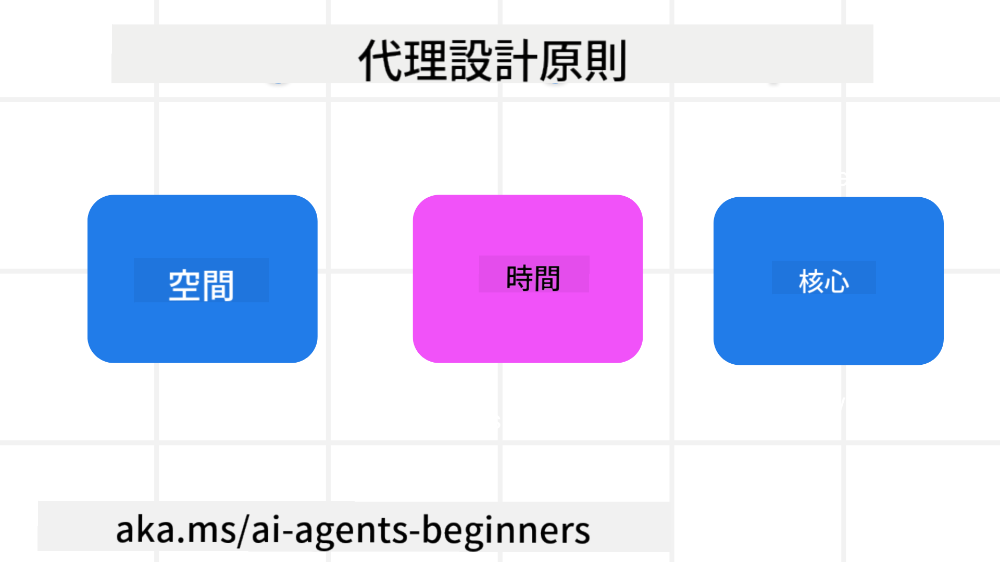

<!--
CO_OP_TRANSLATOR_METADATA:
{
  "original_hash": "4c46e4ff9e349c521e2b0b17f51afa64",
  "translation_date": "2025-08-28T09:35:31+00:00",
  "source_file": "03-agentic-design-patterns/README.md",
  "language_code": "hk"
}
-->

> _(點擊上方圖片觀看本課程的影片)_
# AI 代理設計原則

## 簡介

設計 AI 代理系統有許多不同的思路。由於生成式 AI 設計中的模糊性是一種特性而非缺陷，工程師有時可能難以確定從何處著手。我們制定了一套以人為中心的用戶體驗設計原則，幫助開發者構建以客戶為中心的代理系統，以解決業務需求。這些設計原則並非一種規範的架構，而是為定義和構建代理體驗的團隊提供的一個起點。

一般來說，代理應該：

- 擴展和放大人類的能力（如頭腦風暴、解決問題、自動化等）
- 填補知識空白（如幫助快速掌握知識領域、翻譯等）
- 促進並支持我們每個人偏好的合作方式
- 幫助我們成為更好的自己（例如，作為生活教練/任務管理者，幫助我們學習情緒調節和正念技能，建立韌性等）

## 本課程將涵蓋

- 什麼是代理設計原則
- 實施這些設計原則時應遵循的指導方針
- 使用這些設計原則的一些示例

## 學習目標

完成本課程後，您將能夠：

1. 解釋什麼是代理設計原則
2. 解釋使用代理設計原則的指導方針
3. 理解如何使用代理設計原則構建代理

## 代理設計原則

### 代理（空間）

這是代理運行的環境。這些原則指導我們如何設計能夠在物理和數字世界中運作的代理。

- **連接而非取代** – 幫助人們與其他人、事件和可操作的知識建立聯繫，以促進合作和連接。
  - 代理幫助連接事件、知識和人。
  - 代理拉近人與人之間的距離，而不是取代或貶低人。
- **易於訪問但偶爾隱形** – 代理主要在背景中運行，僅在相關和適當時提醒我們。
  - 代理對於授權用戶來說，在任何設備或平台上都易於發現和訪問。
  - 代理支持多模態輸入和輸出（如聲音、語音、文本等）。
  - 代理可以根據用戶需求的感知，在前景和背景之間、主動和被動之間無縫切換。
  - 代理可能以隱形形式運行，但其背景處理路徑及與其他代理的合作對用戶是透明且可控的。

### 代理（時間）

這是代理隨時間運行的方式。這些原則指導我們如何設計能夠跨越過去、現在和未來進行交互的代理。

- **過去**：反思包括狀態和上下文的歷史。
  - 代理基於對更豐富的歷史數據（不僅僅是事件、人或狀態）的分析，提供更相關的結果。
  - 代理從過去的事件中創造聯繫，並積極反思記憶以應對當前情況。
- **現在**：推動而非僅僅通知。
  - 代理體現了一種全面的與人交互的方式。當事件發生時，代理不僅僅是靜態通知或其他形式的靜態提示。代理可以簡化流程或動態生成提示，在正確的時刻吸引用戶的注意。
  - 代理根據上下文環境、社會和文化變化以及用戶意圖提供信息。
  - 代理的交互可以是漸進的，隨著時間的推移發展/增長複雜性，以長期賦能用戶。
- **未來**：適應和演進。
  - 代理適應各種設備、平台和模式。
  - 代理適應用戶行為、無障礙需求，並且可以自由定制。
  - 代理通過持續的用戶交互來塑造和演進。

### 代理（核心）

這是代理設計核心中的關鍵要素。

- **擁抱不確定性但建立信任**。
  - 預期代理會有一定程度的不確定性。不確定性是代理設計中的一個關鍵元素。
  - 信任和透明是代理設計的基礎層。
  - 人類掌控代理的開啟/關閉，並且代理的狀態始終清晰可見。

## 實施這些原則的指導方針

當您使用上述設計原則時，請遵循以下指導方針：

1. **透明性**：告知用戶 AI 的參與，說明其運作方式（包括過去的行為），以及如何提供反饋和修改系統。
2. **控制權**：允許用戶自定義、指定偏好和個性化，並控制系統及其屬性（包括忘記的能力）。
3. **一致性**：在設備和端點之間提供一致的多模態體驗。盡可能使用熟悉的 UI/UX 元素（例如，語音交互的麥克風圖標），並盡可能減少用戶的認知負擔（例如，提供簡潔的回應、視覺輔助和“了解更多”內容）。

## 如何使用這些原則和指導方針設計一個旅行代理

假設您正在設計一個旅行代理，以下是如何考慮使用這些設計原則和指導方針：

1. **透明性** – 告知用戶旅行代理是一個 AI 驅動的代理。提供一些基本的使用說明（例如，一條“你好”消息、示例提示）。在產品頁面上清楚地記錄這些內容。顯示用戶過去提出的提示列表。明確說明如何提供反饋（如點讚或點踩、發送反饋按鈕等）。清楚說明代理是否有使用或主題限制。
2. **控制權** – 確保用戶清楚如何在代理創建後進行修改，例如系統提示。允許用戶選擇代理的詳細程度、寫作風格，以及代理應避免討論的內容。允許用戶查看和刪除任何相關文件或數據、提示和過去的對話。
3. **一致性** – 確保分享提示、添加文件或照片以及標記某人或某事的圖標是標準且易於識別的。使用回形針圖標表示文件上傳/共享，使用圖片圖標表示圖形上傳。

### 對 AI 代理設計模式有更多疑問？

加入 [Azure AI Foundry Discord](https://aka.ms/ai-agents/discord)，與其他學習者交流，參加辦公時間並解答您的 AI 代理相關問題。

## 其他資源

## 上一課程

[探索代理框架](../02-explore-agentic-frameworks/README.md)

## 下一課程

[工具使用設計模式](../04-tool-use/README.md)

---

**免責聲明**：  
此文件已使用人工智能翻譯服務 [Co-op Translator](https://github.com/Azure/co-op-translator) 翻譯。我們致力於提供準確的翻譯，但請注意，自動翻譯可能包含錯誤或不準確之處。應以原始語言的文件作為權威來源。對於關鍵資訊，建議尋求專業人工翻譯。我們對因使用此翻譯而引起的任何誤解或錯誤解讀概不負責。  