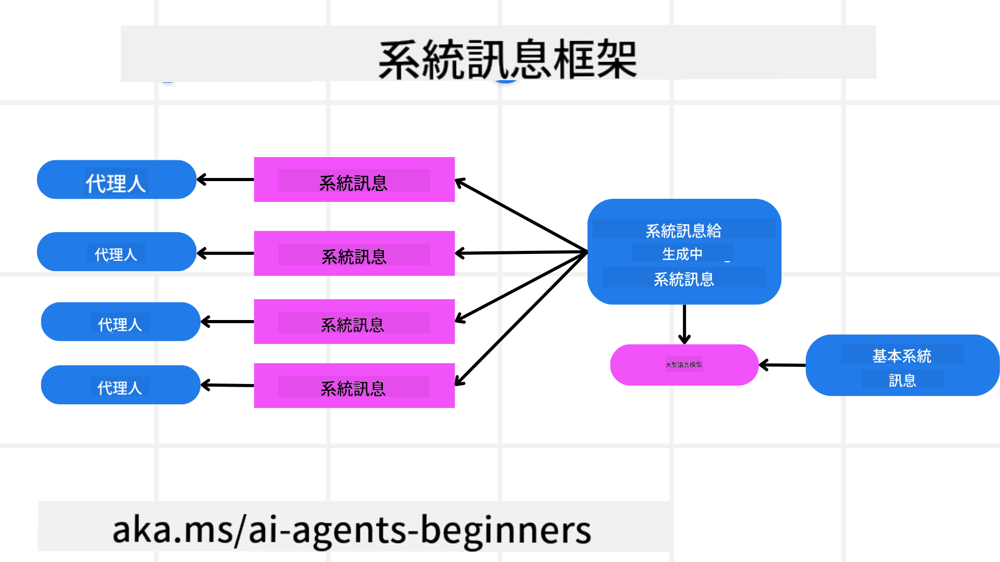
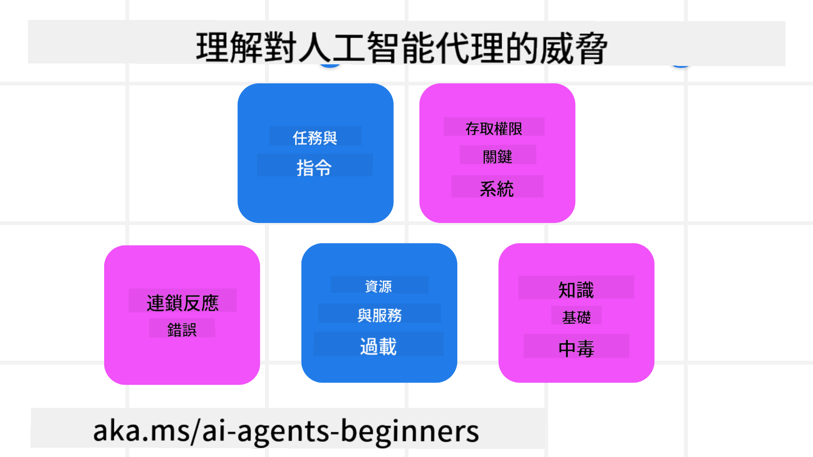

<!--
CO_OP_TRANSLATOR_METADATA:
{
  "original_hash": "f57852cac3a86c4a5ef47f793cc12178",
  "translation_date": "2025-07-12T10:23:19+00:00",
  "source_file": "06-building-trustworthy-agents/README.md",
  "language_code": "hk"
}
-->
[](https://youtu.be/iZKkMEGBCUQ?si=Q-kEbcyHUMPoHp8L)

> _(點擊上方圖片觀看本課程影片)_

# 建立值得信賴的 AI 代理人

## 介紹

本課程將涵蓋：

- 如何建立及部署安全且有效的 AI 代理人
- 開發 AI 代理人時的重要安全考量
- 開發 AI 代理人時如何維護資料及用戶隱私

## 學習目標

完成本課程後，你將能夠：

- 識別並減輕建立 AI 代理人時的風險
- 實施安全措施，確保資料及存取權限得到妥善管理
- 創建能維護資料隱私並提供優質用戶體驗的 AI 代理人

## 安全性

首先來看看如何建立安全的代理應用程式。安全性代表 AI 代理能如預期般運作。作為代理應用程式的開發者，我們有方法和工具來最大化安全性：

### 建立系統訊息框架

如果你曾使用大型語言模型（LLMs）建立 AI 應用程式，你會知道設計穩健的系統提示或系統訊息的重要性。這些提示設定了元規則、指令和指引，決定 LLM 如何與用戶及資料互動。

對於 AI 代理人來說，系統提示更為重要，因為 AI 代理需要非常具體的指令來完成我們設計的任務。

為了創建可擴展的系統提示，我們可以使用系統訊息框架來建立應用程式中的一個或多個代理人：



#### 步驟 1：建立元系統訊息

元提示將由 LLM 用來生成我們所建立代理人的系統提示。我們將其設計為模板，以便在需要時能有效地創建多個代理人。

以下是一個我們會給 LLM 的元系統訊息範例：

```plaintext
You are an expert at creating AI agent assistants. 
You will be provided a company name, role, responsibilities and other
information that you will use to provide a system prompt for.
To create the system prompt, be descriptive as possible and provide a structure that a system using an LLM can better understand the role and responsibilities of the AI assistant. 
```

#### 步驟 2：建立基本提示

接下來是建立描述 AI 代理的基本提示。你應該包含代理的角色、代理將完成的任務，以及代理的其他責任。

範例如下：

```plaintext
You are a travel agent for Contoso Travel that is great at booking flights for customers. To help customers you can perform the following tasks: lookup available flights, book flights, ask for preferences in seating and times for flights, cancel any previously booked flights and alert customers on any delays or cancellations of flights.  
```

#### 步驟 3：提供基本系統訊息給 LLM

現在我們可以透過提供元系統訊息作為系統訊息，搭配我們的基本系統訊息來優化此系統訊息。

這將產生更適合引導我們 AI 代理的系統訊息：

```markdown
**Company Name:** Contoso Travel  
**Role:** Travel Agent Assistant

**Objective:**  
You are an AI-powered travel agent assistant for Contoso Travel, specializing in booking flights and providing exceptional customer service. Your main goal is to assist customers in finding, booking, and managing their flights, all while ensuring that their preferences and needs are met efficiently.

**Key Responsibilities:**

1. **Flight Lookup:**
    
    - Assist customers in searching for available flights based on their specified destination, dates, and any other relevant preferences.
    - Provide a list of options, including flight times, airlines, layovers, and pricing.
2. **Flight Booking:**
    
    - Facilitate the booking of flights for customers, ensuring that all details are correctly entered into the system.
    - Confirm bookings and provide customers with their itinerary, including confirmation numbers and any other pertinent information.
3. **Customer Preference Inquiry:**
    
    - Actively ask customers for their preferences regarding seating (e.g., aisle, window, extra legroom) and preferred times for flights (e.g., morning, afternoon, evening).
    - Record these preferences for future reference and tailor suggestions accordingly.
4. **Flight Cancellation:**
    
    - Assist customers in canceling previously booked flights if needed, following company policies and procedures.
    - Notify customers of any necessary refunds or additional steps that may be required for cancellations.
5. **Flight Monitoring:**
    
    - Monitor the status of booked flights and alert customers in real-time about any delays, cancellations, or changes to their flight schedule.
    - Provide updates through preferred communication channels (e.g., email, SMS) as needed.

**Tone and Style:**

- Maintain a friendly, professional, and approachable demeanor in all interactions with customers.
- Ensure that all communication is clear, informative, and tailored to the customer's specific needs and inquiries.

**User Interaction Instructions:**

- Respond to customer queries promptly and accurately.
- Use a conversational style while ensuring professionalism.
- Prioritize customer satisfaction by being attentive, empathetic, and proactive in all assistance provided.

**Additional Notes:**

- Stay updated on any changes to airline policies, travel restrictions, and other relevant information that could impact flight bookings and customer experience.
- Use clear and concise language to explain options and processes, avoiding jargon where possible for better customer understanding.

This AI assistant is designed to streamline the flight booking process for customers of Contoso Travel, ensuring that all their travel needs are met efficiently and effectively.

```

#### 步驟 4：反覆調整與改進

此系統訊息框架的價值在於能更輕鬆地擴展多個代理人的系統訊息創建，並隨時間改進你的系統訊息。很少會有系統訊息第一次就能完全符合你的使用案例。能夠透過更改基本系統訊息並重新執行系統，進行小幅調整和改進，讓你能比較和評估結果。

## 理解威脅

要建立值得信賴的 AI 代理人，了解並減輕對 AI 代理的風險和威脅非常重要。以下僅列出部分對 AI 代理的不同威脅，以及你如何更好地規劃和準備。



### 任務與指令

**描述：** 攻擊者試圖透過提示或操控輸入來改變 AI 代理的指令或目標。

**緩解措施：** 執行驗證檢查和輸入過濾，偵測可能危險的提示，避免被 AI 代理處理。由於這類攻擊通常需要頻繁與代理互動，限制對話回合數也是防止此類攻擊的方法之一。

### 存取關鍵系統

**描述：** 若 AI 代理能存取儲存敏感資料的系統和服務，攻擊者可能會破壞代理與這些服務間的通訊。這些攻擊可能是直接攻擊，或透過代理間接獲取系統資訊。

**緩解措施：** AI 代理應僅在必要時存取系統，以防止此類攻擊。代理與系統間的通訊也應保持安全。實施身份驗證和存取控制是保護資訊的另一種方法。

### 資源與服務過載

**描述：** AI 代理可存取不同工具和服務以完成任務。攻擊者可能利用此能力，透過 AI 代理發送大量請求攻擊這些服務，導致系統故障或高額成本。

**緩解措施：** 實施政策限制 AI 代理對服務的請求數量。限制對 AI 代理的對話回合數和請求數也是防止此類攻擊的方式。

### 知識庫污染

**描述：** 此類攻擊不直接針對 AI 代理，而是針對 AI 代理將使用的知識庫及其他服務。可能涉及破壞 AI 代理用來完成任務的資料或資訊，導致對用戶產生偏頗或非預期的回應。

**緩解措施：** 定期驗證 AI 代理在工作流程中使用的資料。確保資料存取安全，僅由可信任的人員更改，以避免此類攻擊。

### 連鎖錯誤

**描述：** AI 代理存取多種工具和服務以完成任務。攻擊者引起的錯誤可能導致 AI 代理連接的其他系統失效，使攻擊範圍擴大且更難排查。

**緩解措施：** 一種避免方法是讓 AI 代理在受限環境中運作，例如在 Docker 容器中執行任務，以防止直接系統攻擊。建立備援機制和錯誤重試邏輯，當某些系統回應錯誤時，也能防止更大範圍的系統故障。

## 人工介入流程

另一種建立值得信賴 AI 代理系統的有效方法是採用人工介入流程（Human-in-the-loop）。這種流程讓用戶能在代理運行期間提供回饋。用戶實際上扮演多代理系統中的代理角色，透過批准或終止運行程序來參與。


以下是使用 AutoGen 展示此概念實作的程式碼片段：

```python

# Create the agents.
model_client = OpenAIChatCompletionClient(model="gpt-4o-mini")
assistant = AssistantAgent("assistant", model_client=model_client)
user_proxy = UserProxyAgent("user_proxy", input_func=input)  # Use input() to get user input from console.

# Create the termination condition which will end the conversation when the user says "APPROVE".
termination = TextMentionTermination("APPROVE")

# Create the team.
team = RoundRobinGroupChat([assistant, user_proxy], termination_condition=termination)

# Run the conversation and stream to the console.
stream = team.run_stream(task="Write a 4-line poem about the ocean.")
# Use asyncio.run(...) when running in a script.
await Console(stream)

```

## 結論

建立值得信賴的 AI 代理人需要謹慎設計、強健的安全措施及持續迭代。透過實施結構化的元提示系統、理解潛在威脅並採取緩解策略，開發者能創造既安全又有效的 AI 代理人。此外，結合人工介入流程確保 AI 代理持續符合用戶需求，同時降低風險。隨著 AI 持續發展，積極維護安全、隱私及倫理考量將是促進 AI 系統信任與可靠性的關鍵。

## 其他資源

- <a href="https://learn.microsoft.com/azure/ai-studio/responsible-use-of-ai-overview" target="_blank">Responsible AI overview</a>
- <a href="https://learn.microsoft.com/azure/ai-studio/concepts/evaluation-approach-gen-ai" target="_blank">Evaluation of generative AI models and AI applications</a>
- <a href="https://learn.microsoft.com/azure/ai-services/openai/concepts/system-message?context=%2Fazure%2Fai-studio%2Fcontext%2Fcontext&tabs=top-techniques" target="_blank">Safety system messages</a>
- <a href="https://blogs.microsoft.com/wp-content/uploads/prod/sites/5/2022/06/Microsoft-RAI-Impact-Assessment-Template.pdf?culture=en-us&country=us" target="_blank">Risk Assessment Template</a>

## 上一課

[Agentic RAG](../05-agentic-rag/README.md)

## 下一課

[Planning Design Pattern](../07-planning-design/README.md)

**免責聲明**：  
本文件由 AI 翻譯服務 [Co-op Translator](https://github.com/Azure/co-op-translator) 進行翻譯。雖然我們致力於確保準確性，但請注意自動翻譯可能包含錯誤或不準確之處。原始文件的母語版本應被視為權威來源。對於重要資訊，建議採用專業人工翻譯。我們不對因使用本翻譯而引起的任何誤解或誤釋承擔責任。