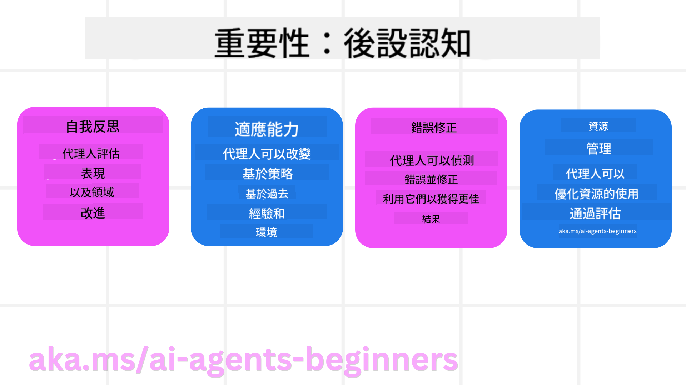
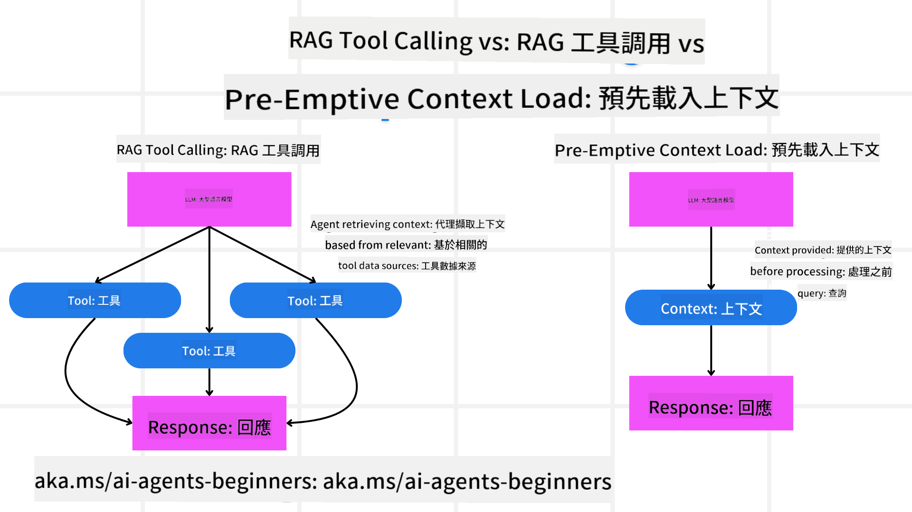

<!--
CO_OP_TRANSLATOR_METADATA:
{
  "original_hash": "8cbf460468c802c7994aa62e0e0779c9",
  "translation_date": "2025-07-12T12:03:53+00:00",
  "source_file": "09-metacognition/README.md",
  "language_code": "hk"
}
-->
[](https://youtu.be/His9R6gw6Ec?si=3_RMb8VprNvdLRhX)

> _(點擊上方圖片觀看本課程影片)_
# AI 代理中的後設認知

## 介紹

歡迎來到 AI 代理後設認知的課程！本章節專為對 AI 代理如何思考自身思考過程感到好奇的初學者設計。完成本課程後，你將了解關鍵概念，並掌握實用範例，應用後設認知於 AI 代理設計中。

## 學習目標

完成本課程後，你將能夠：

1. 理解代理定義中推理迴圈的影響。
2. 運用規劃與評估技術協助自我修正的代理。
3. 創建能操作程式碼以完成任務的代理。

## 後設認知簡介

後設認知指的是涉及思考自身思考的高階認知過程。對 AI 代理而言，這意味著能根據自我覺察和過去經驗評估並調整行動。後設認知，或稱「思考思考」，是發展具代理性的 AI 系統的重要概念。它讓 AI 系統能意識自身內部過程，並能監控、調節及適應其行為。就像我們在觀察環境或解決問題時所做的自我覺察一樣。這種自我覺察能幫助 AI 系統做出更佳決策、識別錯誤，並隨時間提升表現——這也與圖靈測試及 AI 是否會接管的辯論息息相關。

在具代理性的 AI 系統中，後設認知能協助解決多項挑戰，例如：
- 透明度：確保 AI 系統能解釋其推理與決策。
- 推理能力：增強 AI 系統綜合資訊並做出合理決策的能力。
- 適應性：使 AI 系統能調整以應對新環境及變化條件。
- 感知能力：提升 AI 系統辨識及解讀環境資料的準確度。

### 什麼是後設認知？

後設認知，或稱「思考思考」，是一種涉及自我覺察與自我調節認知過程的高階認知能力。在 AI 領域，後設認知使代理能評估並調整策略與行動，從而提升解決問題與決策的能力。理解後設認知後，你可以設計出不僅更聰明，且更具適應性與效率的 AI 代理。真正的後設認知會讓 AI 明確地推理自身的推理過程。

範例：「我優先選擇較便宜的航班，因為……但我可能錯過了直飛航班，讓我再重新檢查一下。」
追蹤它如何或為何選擇某條路線。
- 注意到它犯錯是因為過度依賴上次用戶偏好，因此它不僅修改最終建議，也調整決策策略。
- 診斷模式，例如：「每當我看到用戶提到‘太擠’，我不僅要移除某些景點，還要反思如果我總是以人氣排名‘熱門景點’，那我的選擇方法可能有缺陷。」

### 後設認知在 AI 代理中的重要性

後設認知在 AI 代理設計中扮演關鍵角色，原因包括：



- 自我反思：代理能評估自身表現並找出改進空間。
- 適應性：代理能根據過去經驗及環境變化調整策略。
- 錯誤修正：代理能自主偵測並修正錯誤，提升準確度。
- 資源管理：代理能透過規劃與評估行動，優化時間與計算資源的使用。

## AI 代理的組成部分

在深入後設認知過程前，先了解 AI 代理的基本組成。AI 代理通常包含：

- Persona：代理的人格與特質，定義其與用戶互動的方式。
- Tools：代理能執行的功能與能力。
- Skills：代理擁有的知識與專長。

這些組成部分協同運作，形成能執行特定任務的「專業單元」。

**範例**：
想像一個旅遊代理，不僅規劃你的假期，還能根據即時資料與過去客戶旅程經驗調整行程。

### 範例：旅遊代理服務中的後設認知

假設你設計一個由 AI 驅動的旅遊代理服務。這個代理「Travel Agent」協助用戶規劃假期。為了融入後設認知，Travel Agent 需要根據自我覺察與過去經驗評估並調整行動。後設認知在此的應用如下：

#### 當前任務

協助用戶規劃巴黎之旅。

#### 完成任務的步驟

1. **收集用戶偏好**：詢問用戶旅行日期、預算、興趣（如博物館、美食、購物）及特殊需求。
2. **檢索資訊**：搜尋符合用戶偏好的航班、住宿、景點及餐廳。
3. **產生建議**：提供包含航班細節、飯店預訂及建議活動的個人化行程。
4. **根據回饋調整**：詢問用戶對建議的意見，並做必要調整。

#### 所需資源

- 航班與飯店訂房資料庫存取權。
- 巴黎景點與餐廳資訊。
- 來自過去互動的用戶回饋資料。

#### 經驗與自我反思

Travel Agent 利用後設認知評估表現並從過去經驗學習。例如：

1. **分析用戶回饋**：檢視用戶回饋，判斷哪些建議受歡迎，哪些不受歡迎，並調整未來建議。
2. **適應性**：若用戶曾表示不喜歡擁擠場所，Travel Agent 未來會避免在尖峰時段推薦熱門景點。
3. **錯誤修正**：若過去曾建議已客滿的飯店，Travel Agent 會學習更嚴謹地檢查可用性後再推薦。

#### 實務開發範例

以下是融入後設認知的 Travel Agent 程式碼簡化範例：

```python
class Travel_Agent:
    def __init__(self):
        self.user_preferences = {}
        self.experience_data = []

    def gather_preferences(self, preferences):
        self.user_preferences = preferences

    def retrieve_information(self):
        # Search for flights, hotels, and attractions based on preferences
        flights = search_flights(self.user_preferences)
        hotels = search_hotels(self.user_preferences)
        attractions = search_attractions(self.user_preferences)
        return flights, hotels, attractions

    def generate_recommendations(self):
        flights, hotels, attractions = self.retrieve_information()
        itinerary = create_itinerary(flights, hotels, attractions)
        return itinerary

    def adjust_based_on_feedback(self, feedback):
        self.experience_data.append(feedback)
        # Analyze feedback and adjust future recommendations
        self.user_preferences = adjust_preferences(self.user_preferences, feedback)

# Example usage
travel_agent = Travel_Agent()
preferences = {
    "destination": "Paris",
    "dates": "2025-04-01 to 2025-04-10",
    "budget": "moderate",
    "interests": ["museums", "cuisine"]
}
travel_agent.gather_preferences(preferences)
itinerary = travel_agent.generate_recommendations()
print("Suggested Itinerary:", itinerary)
feedback = {"liked": ["Louvre Museum"], "disliked": ["Eiffel Tower (too crowded)"]}
travel_agent.adjust_based_on_feedback(feedback)
```

#### 為何後設認知重要

- **自我反思**：代理能分析表現並找出改進點。
- **適應性**：代理能根據回饋與變化調整策略。
- **錯誤修正**：代理能自主偵測並修正錯誤。
- **資源管理**：代理能優化時間與計算資源使用。

透過後設認知，Travel Agent 能提供更個人化且準確的旅遊建議，提升整體用戶體驗。

---

## 2. 代理中的規劃

規劃是 AI 代理行為的關鍵組成部分。它涉及規劃達成目標所需的步驟，考量當前狀態、資源及可能障礙。

### 規劃要素

- **當前任務**：明確定義任務。
- **完成任務的步驟**：將任務拆解為可管理的步驟。
- **所需資源**：識別必要資源。
- **經驗**：利用過去經驗輔助規劃。

**範例**：
以下是 Travel Agent 協助用戶有效規劃旅程所需採取的步驟：

### Travel Agent 的步驟

1. **收集用戶偏好**
   - 詢問用戶旅行日期、預算、興趣及特殊需求。
   - 範例：「你打算什麼時候出發？」「你的預算範圍是多少？」「你喜歡哪些假期活動？」

2. **檢索資訊**
   - 根據用戶偏好搜尋相關旅遊選項。
   - **航班**：尋找符合預算與日期的航班。
   - **住宿**：尋找符合地點、價格及設施偏好的飯店或租屋。
   - **景點與餐廳**：找出符合用戶興趣的熱門景點、活動及餐飲選擇。

3. **產生建議**
   - 將檢索到的資訊整合成個人化行程。
   - 提供航班選項、飯店預訂及建議活動，確保符合用戶偏好。

4. **向用戶呈現行程**
   - 與用戶分享建議行程供其審閱。
   - 範例：「這是為你規劃的巴黎行程，包括航班細節、飯店預訂及推薦活動與餐廳。請告訴我你的想法！」

5. **收集回饋**
   - 詢問用戶對建議行程的意見。
   - 範例：「你喜歡這些航班選項嗎？」「飯店符合你的需求嗎？」「有沒有想新增或刪除的活動？」

6. **根據回饋調整**
   - 根據用戶回饋修改行程。
   - 調整航班、住宿及活動建議以更符合用戶偏好。

7. **最終確認**
   - 向用戶呈現更新後的行程以供最終確認。
   - 範例：「我已根據你的回饋做出調整，這是更新後的行程。你覺得如何？」

8. **預訂與確認**
   - 用戶確認後，進行航班、住宿及預先安排活動的預訂。
   - 將確認細節發送給用戶。

9. **持續支援**
   - 在旅程前及期間，隨時協助用戶處理變更或額外需求。
   - 範例：「如果旅途中需要任何協助，隨時聯絡我！」

### 範例互動

```python
class Travel_Agent:
    def __init__(self):
        self.user_preferences = {}
        self.experience_data = []

    def gather_preferences(self, preferences):
        self.user_preferences = preferences

    def retrieve_information(self):
        flights = search_flights(self.user_preferences)
        hotels = search_hotels(self.user_preferences)
        attractions = search_attractions(self.user_preferences)
        return flights, hotels, attractions

    def generate_recommendations(self):
        flights, hotels, attractions = self.retrieve_information()
        itinerary = create_itinerary(flights, hotels, attractions)
        return itinerary

    def adjust_based_on_feedback(self, feedback):
        self.experience_data.append(feedback)
        self.user_preferences = adjust_preferences(self.user_preferences, feedback)

# Example usage within a booing request
travel_agent = Travel_Agent()
preferences = {
    "destination": "Paris",
    "dates": "2025-04-01 to 2025-04-10",
    "budget": "moderate",
    "interests": ["museums", "cuisine"]
}
travel_agent.gather_preferences(preferences)
itinerary = travel_agent.generate_recommendations()
print("Suggested Itinerary:", itinerary)
feedback = {"liked": ["Louvre Museum"], "disliked": ["Eiffel Tower (too crowded)"]}
travel_agent.adjust_based_on_feedback(feedback)
```

## 3. 修正型 RAG 系統

首先，我們先了解 RAG 工具與預先載入上下文的差異。



### 檢索增強生成（RAG）

RAG 結合檢索系統與生成模型。當收到查詢時，檢索系統會從外部來源擷取相關文件或資料，並將這些資訊用於增強生成模型的輸入，幫助模型產生更準確且具上下文相關性的回應。

在 RAG 系統中，代理會從知識庫檢索相關資訊，並用以生成適當的回應或行動。

### 修正型 RAG 方法

修正型 RAG 方法著重於利用 RAG 技術修正錯誤並提升 AI 代理的準確度。這包括：

1. **提示技術**：使用特定提示引導代理檢索相關資訊。
2. **工具**：實作演算法與機制，使代理能評估檢索資訊的相關性並生成準確回應。
3. **評估**：持續評估代理表現並調整以提升準確性與效率。

#### 範例：搜尋代理中的修正型 RAG

以一個從網路檢索資訊回答用戶查詢的搜尋代理為例。修正型 RAG 方法可能包括：

1. **提示技術**：根據用戶輸入形成搜尋查詢。
2. **工具**：使用自然語言處理與機器學習演算法對搜尋結果進行排序與篩選。
3. **評估**：分析用戶回饋，識別並修正檢索資訊中的不準確之處。

### 旅遊代理中的修正型 RAG

修正型 RAG（檢索增強生成）提升 AI 在檢索與生成資訊時的能力，同時修正錯誤。讓我們看看 Travel Agent 如何運用修正型 RAG 方法，提供更準確且相關的旅遊建議。

這包括：

- **提示技術**：使用特定提示引導代理檢索相關資訊。
- **工具**：實作演算法與機制，使代理能評估檢索資訊的相關性並生成準確回應。
- **評估**：持續評估代理表現並調整以提升準確性與效率。

#### 在 Travel Agent 中實作修正型 RAG 的步驟

1. **初始用戶互動**
   - Travel Agent 收集用戶初步偏好，如目的地、旅行日期、預算及興趣。
   - 範例：

     ```python
     preferences = {
         "destination": "Paris",
         "dates": "2025-04-01 to 2025-04-10",
         "budget": "moderate",
         "interests": ["museums", "cuisine"]
     }
     ```

2. **資訊檢索**
   - Travel Agent 根據用戶偏好檢索航班、住宿、景點及餐廳資訊。
   - 範例：

     ```python
     flights = search_flights(preferences)
     hotels = search_hotels(preferences)
     attractions = search_attractions(preferences)
     ```

3. **產生初步建議**
   - Travel Agent 利用檢索資訊生成個人化行程。
   - 範例：

     ```python
     itinerary = create_itinerary(flights, hotels, attractions)
     print("Suggested Itinerary:", itinerary)
     ```

4. **收集用戶回饋**
   - Travel Agent 詢問用戶對初步建議的意見。
   - 範例：

     ```python
     feedback = {
         "liked": ["Louvre Museum"],
         "disliked": ["Eiffel Tower (too crowded)"]
     }
     ```

5. **修正型 RAG 流程**
   - **提示技術**：Travel Agent 根據用戶回饋形成新的搜尋查詢。
     - 範例：

       ```python
       if "disliked" in feedback:
           preferences["avoid"] = feedback["disliked"]
       ```

   - **工具**：Travel Agent 使用演算法對新搜尋結果進行排序與篩選，強調根據用戶回饋的相關性。
     - 範例：

       ```python
       new_attractions = search_attractions(preferences)
       new_itinerary = create_itinerary(flights, hotels, new_attractions)
       print("Updated Itinerary:", new_itinerary)
       ```

   - **評估**：Travel Agent 持續分析用戶回饋，評估建議的相關性與準確度，並做必要調整。
     - 範例：

       ```python
       def adjust_preferences(preferences, feedback):
           if "liked" in feedback:
               preferences["favorites"] = feedback["liked"]
           if "disliked" in feedback:
               preferences["avoid"] = feedback["disliked"]
           return preferences

       preferences = adjust_preferences(preferences, feedback)
       ```

#### 實務範例

以下是結合修正型 RAG 方法於 Travel Agent 的簡化 Python 程式碼範例：
### 預先載入上下文

預先載入上下文是指在處理查詢之前，先將相關的背景資訊載入模型。這樣模型從一開始就能取得這些資訊，有助於生成更具參考價值的回應，而無需在過程中額外檢索資料。

以下是一個簡化的範例，展示如何在 Python 中為旅遊代理應用程式實現預先載入上下文：

#### 說明

1. **初始化（`__init__` 方法）**：`TravelAgent` 類別預先載入一個字典，包含巴黎、東京、紐約和雪梨等熱門旅遊地點的資訊。字典中包括每個地點的國家、貨幣、語言及主要景點等細節。

2. **取得資訊（`get_destination_info` 方法）**：當使用者查詢特定旅遊地點時，`get_destination_info` 方法會從預先載入的上下文字典中擷取相關資訊。

透過預先載入上下文，旅遊代理應用程式能快速回應使用者查詢，無需即時從外部來源檢索資料，提升效率與反應速度。

### 在迭代前以目標啟動計劃

以目標啟動計劃是指在開始時先設定明確的目標或期望結果。透過事先定義目標，模型能以此作為整個迭代過程的指引，確保每次迭代都朝向達成目標前進，使流程更有效率且聚焦。

以下示範如何在 Python 中為旅遊代理在迭代前以目標啟動旅遊計劃：

### 情境

旅遊代理想為客戶規劃一趟客製化假期。目標是根據客戶的偏好和預算，打造一個最大化滿意度的旅遊行程。

### 步驟

1. 定義客戶的偏好和預算。
2. 根據這些偏好啟動初步計劃。
3. 透過迭代優化計劃，以提升客戶滿意度。

#### Python 程式碼

#### 程式碼說明

1. **初始化（`__init__` 方法）**：`TravelAgent` 類別初始化時帶入一組潛在旅遊地點清單，每個地點包含名稱、費用和活動類型等屬性。

2. **啟動計劃（`bootstrap_plan` 方法）**：根據客戶偏好和預算，建立初步旅遊計劃。方法會遍歷地點清單，若符合偏好且預算允許，則加入計劃中。

3. **匹配偏好（`match_preferences` 方法）**：判斷某地點是否符合客戶偏好。

4. **迭代計劃（`iterate_plan` 方法）**：透過嘗試替換計劃中的地點，優化符合客戶偏好和預算限制的行程。

5. **計算費用（`calculate_cost` 方法）**：計算目前計劃的總費用，包括可能新增的地點。

#### 範例使用

- **初步計劃**：旅遊代理根據客戶對觀光的偏好及 2000 美元預算，建立初步計劃。
- **優化計劃**：旅遊代理透過迭代優化計劃，提升符合客戶偏好和預算的程度。

透過以明確目標（如最大化客戶滿意度）啟動計劃並持續迭代，旅遊代理能打造符合客戶需求且優化的旅遊行程，確保從一開始就與客戶偏好和預算相符，並隨著迭代不斷改進。

### 利用大型語言模型進行重排序與評分

大型語言模型（LLM）可用於重排序與評分，透過評估檢索到的文件或生成回應的相關性與品質。運作方式如下：

**檢索**：初步檢索根據查詢取得一組候選文件或回應。

**重排序**：LLM 評估這些候選項目，根據相關性和品質重新排序，確保最相關且高品質的資訊優先呈現。

**評分**：LLM 為每個候選項目分配分數，反映其相關性與品質，有助於選出最佳回應或文件。

透過 LLM 進行重排序與評分，系統能提供更精準且符合上下文的資訊，提升整體使用者體驗。

以下示範旅遊代理如何利用大型語言模型（LLM）根據使用者偏好重排序與評分旅遊地點，使用 Python 實作：

#### 情境 - 根據偏好旅遊

旅遊代理想根據客戶偏好推薦最佳旅遊地點。LLM 將協助重排序並評分地點，確保呈現最相關選項。

#### 步驟：

1. 收集使用者偏好。
2. 檢索潛在旅遊地點清單。
3. 使用 LLM 根據偏好重排序並評分地點。

以下示範如何更新先前範例，使用 Azure OpenAI 服務：

#### 需求

1. 需擁有 Azure 訂閱。
2. 建立 Azure OpenAI 資源並取得 API 金鑰。

#### Python 範例程式碼

#### 程式碼說明 - 偏好預訂者

1. **初始化**：`TravelAgent` 類別初始化時帶入潛在旅遊地點清單，每個地點包含名稱和描述等屬性。

2. **取得推薦（`get_recommendations` 方法）**：根據使用者偏好產生提示詞，並向 Azure OpenAI API 發送 HTTP POST 請求，取得重排序與評分後的地點。

3. **產生提示詞（`generate_prompt` 方法）**：構建 Azure OpenAI 的提示詞，包含使用者偏好與地點清單，引導模型根據偏好重排序並評分地點。

4. **API 呼叫**：使用 `requests` 函式庫向 Azure OpenAI API 端點發送 POST 請求，回應包含重排序與評分結果。

5. **範例使用**：旅遊代理收集使用者偏好（如對觀光和多元文化感興趣），並利用 Azure OpenAI 服務取得重排序與評分後的旅遊地點推薦。

請務必將 `your_azure_openai_api_key` 替換為您的 Azure OpenAI API 金鑰，並將 `https://your-endpoint.com/...` 替換為您 Azure OpenAI 部署的實際端點 URL。

透過 LLM 進行重排序與評分，旅遊代理能提供更個人化且相關的旅遊建議，提升客戶整體體驗。

### RAG：提示技術與工具的區別

檢索增強生成（RAG）既可視為一種提示技術，也可作為開發 AI 代理的工具。理解兩者差異，有助於更有效運用 RAG。

#### RAG 作為提示技術

**是什麼？**

- 作為提示技術，RAG 涉及設計特定查詢或提示，引導從大型語料庫或資料庫中檢索相關資訊，並用於生成回應或執行動作。

**運作方式：**

1. **設計提示**：根據任務或使用者輸入，建立結構良好的提示或查詢。
2. **檢索資訊**：利用提示從既有知識庫或資料集中搜尋相關資料。
3. **生成回應**：結合檢索到的資訊與生成式 AI 模型，產生完整且連貫的回應。

**旅遊代理範例**：

- 使用者輸入：「我想參觀巴黎的博物館。」
- 提示：「找出巴黎的頂級博物館。」
- 檢索資訊：羅浮宮、奧賽博物館等細節。
- 生成回應：「這裡有幾個巴黎的頂級博物館：羅浮宮、奧賽博物館和龐畢度中心。」

#### RAG 作為工具

**是什麼？**

- 作為工具，RAG 是一個整合系統，自動化檢索與生成流程，讓開發者無需為每個查詢手動設計提示，即可輕鬆實現複雜 AI 功能。

**運作方式：**

1. **整合**：將 RAG 嵌入 AI 代理架構，自動處理檢索與生成任務。
2. **自動化**：工具管理整個流程，從接收使用者輸入到產生最終回應，無需每步驟明確提示。
3. **效率**：簡化檢索與生成流程，提升代理效能，回應更快速且準確。

**旅遊代理範例**：

- 使用者輸入：「我想參觀巴黎的博物館。」
- RAG 工具：自動檢索博物館資訊並生成回應。
- 生成回應：「這裡有幾個巴黎的頂級博物館：羅浮宮、奧賽博物館和龐畢度中心。」

### 比較

| 方面                   | 提示技術                                               | 工具                                                  |
|------------------------|--------------------------------------------------------|-------------------------------------------------------|
| **手動 vs 自動**       | 每個查詢需手動設計提示。                               | 自動化檢索與生成流程。                                 |
| **控制度**             | 對檢索過程有較多控制。                                 | 簡化並自動化檢索與生成。                               |
| **彈性**               | 可根據需求自訂提示。                                   | 適合大規模實作，更有效率。                             |
| **複雜度**             | 需設計與調整提示詞。                                   | 容易整合於 AI 代理架構中。                             |

### 實務範例

**提示技術範例：**

**工具範例：**

### 評估相關性

評估相關性是 AI 代理效能的重要環節，確保代理檢索與生成的資訊對使用者而言適切、準確且有用。以下探討如何評估 AI 代理的相關性，並附實務範例與技術。

#### 評估相關性的關鍵概念

1. **上下文意識**：
   - 代理需理解使用者查詢的上下文，才能檢索並生成相關資訊。
   - 範例：使用者查詢「巴黎最佳餐廳」，代理應考慮使用者偏好，如料理類型與預算。

2. **準確性**：
   - 代理提供的資訊應為事實正確且最新。
   - 範例：推薦目前營業且評價良好的餐廳，而非過時或已歇業的選項。

3. **使用者意圖**：
   - 代理應推斷使用者查詢背後的意圖，提供最相關的資訊。
   - 範例：使用者查詢「經濟型飯店」，代理應優先推薦價格合理的選項。

4. **回饋迴路**：
   - 持續收集並分析使用者回饋，有助代理優化相關性評估。
   - 範例：根據使用者對先前推薦的評分與回饋，改進未來回應。

#### 評估相關性的實務技術

1. **相關性評分**：
   - 根據項目與使用者查詢及偏好的匹配程度，為每個檢索項目分配相關性分數。
   - 範例：

2. **過濾與排序**：
   - 過濾掉不相關項目，並根據相關性分數排序剩餘項目。
   - 範例：

3. **自然語言處理（NLP）**：
   - 利用 NLP 技術理解使用者查詢，檢索相關資訊。
   - 範例：

4. **使用者回饋整合**：
   - 收集使用者對推薦的回饋，調整未來的相關性評估。
   - 範例：

#### 範例：旅遊代理評估推薦相關性

以下為旅遊代理如何評估旅遊推薦相關性的實務範例：

### 帶著意圖搜尋

帶著意圖搜尋是指理解並解析使用者查詢背後的目的或目標，以檢索並生成最相關且有用的資訊。此方法超越單純關鍵字匹配，著重於掌握使用者的實際需求與上下文。

#### 帶著意圖搜尋的關鍵概念

1. **理解使用者意圖**：
   - 使用者意圖可分為三大類：資訊型、導航型與交易型。
     - **資訊型意圖**：使用者尋求某主題的資訊（如「巴黎有哪些最佳博物館？」）。
     - **導航型意圖**：使用者想前往特定網站或頁面（如「羅浮宮官方網站」）。
     - **交易型意圖**：使用者希望完成交易，如訂機票或購買商品（如「訂購飛往巴黎的機票」）。

2. **上下文意識**：
   - 分析使用者查詢的上下文，有助準確判斷意圖，包括先前互動、使用者偏好及當前查詢細節。

3. **自然語言處理（NLP）**：
   - 運用 NLP 技術理解並解析使用者的自然語言查詢，包括實體識別、情感分析與查詢解析等任務。

4. **個人化**：
   - 根據使用者歷史、偏好與回饋，個人化搜尋結果，提升資訊相關性。
#### 實務範例：以旅遊代理為例的意圖搜尋

讓我們以旅遊代理為例，看看如何實作帶有意圖的搜尋。

1. **收集用戶偏好**

   ```python
   class Travel_Agent:
       def __init__(self):
           self.user_preferences = {}

       def gather_preferences(self, preferences):
           self.user_preferences = preferences
   ```

2. **理解用戶意圖**

   ```python
   def identify_intent(query):
       if "book" in query or "purchase" in query:
           return "transactional"
       elif "website" in query or "official" in query:
           return "navigational"
       else:
           return "informational"
   ```

3. **情境感知**

   ```python
   def analyze_context(query, user_history):
       # Combine current query with user history to understand context
       context = {
           "current_query": query,
           "user_history": user_history
       }
       return context
   ```

4. **搜尋並個人化結果**

   ```python
   def search_with_intent(query, preferences, user_history):
       intent = identify_intent(query)
       context = analyze_context(query, user_history)
       if intent == "informational":
           search_results = search_information(query, preferences)
       elif intent == "navigational":
           search_results = search_navigation(query)
       elif intent == "transactional":
           search_results = search_transaction(query, preferences)
       personalized_results = personalize_results(search_results, user_history)
       return personalized_results

   def search_information(query, preferences):
       # Example search logic for informational intent
       results = search_web(f"best {preferences['interests']} in {preferences['destination']}")
       return results

   def search_navigation(query):
       # Example search logic for navigational intent
       results = search_web(query)
       return results

   def search_transaction(query, preferences):
       # Example search logic for transactional intent
       results = search_web(f"book {query} to {preferences['destination']}")
       return results

   def personalize_results(results, user_history):
       # Example personalization logic
       personalized = [result for result in results if result not in user_history]
       return personalized[:10]  # Return top 10 personalized results
   ```

5. **使用範例**

   ```python
   travel_agent = Travel_Agent()
   preferences = {
       "destination": "Paris",
       "interests": ["museums", "cuisine"]
   }
   travel_agent.gather_preferences(preferences)
   user_history = ["Louvre Museum website", "Book flight to Paris"]
   query = "best museums in Paris"
   results = search_with_intent(query, preferences, user_history)
   print("Search Results:", results)
   ```

---

## 4. 以工具形式生成程式碼

程式碼生成代理利用 AI 模型來撰寫和執行程式碼，解決複雜問題並自動化任務。

### 程式碼生成代理

程式碼生成代理使用生成式 AI 模型來撰寫和執行程式碼。這些代理能夠解決複雜問題、自動化任務，並透過生成及執行多種程式語言的程式碼，提供有價值的見解。

#### 實務應用

1. **自動程式碼生成**：為特定任務生成程式碼片段，例如資料分析、網頁爬蟲或機器學習。
2. **以 SQL 作為 RAG**：使用 SQL 查詢從資料庫擷取和操作資料。
3. **問題解決**：撰寫並執行程式碼來解決特定問題，例如優化演算法或分析資料。

#### 範例：用於資料分析的程式碼生成代理

假設你正在設計一個程式碼生成代理，流程可能如下：

1. **任務**：分析資料集以識別趨勢和模式。
2. **步驟**：
   - 將資料集載入資料分析工具。
   - 生成 SQL 查詢以篩選和彙總資料。
   - 執行查詢並取得結果。
   - 利用結果生成視覺化和洞察。
3. **所需資源**：可存取資料集、資料分析工具及 SQL 功能。
4. **經驗**：利用過去分析結果提升未來分析的準確性和相關性。

### 範例：用於旅遊代理的程式碼生成代理

在此範例中，我們設計一個程式碼生成代理 Travel Agent，協助用戶規劃旅程，透過生成和執行程式碼來完成任務。此代理能處理如取得旅遊選項、篩選結果及編排行程等工作，並利用生成式 AI 技術。

#### 程式碼生成代理概述

1. **收集用戶偏好**：蒐集用戶輸入，如目的地、旅遊日期、預算和興趣。
2. **生成程式碼以擷取資料**：產生程式碼片段以取得航班、飯店和景點資料。
3. **執行生成的程式碼**：執行程式碼以取得即時資訊。
4. **生成行程**：將取得的資料彙整成個人化旅遊計畫。
5. **根據回饋調整**：接收用戶回饋，必要時重新生成程式碼以優化結果。

#### 逐步實作

1. **收集用戶偏好**

   ```python
   class Travel_Agent:
       def __init__(self):
           self.user_preferences = {}

       def gather_preferences(self, preferences):
           self.user_preferences = preferences
   ```

2. **生成程式碼以擷取資料**

   ```python
   def generate_code_to_fetch_data(preferences):
       # Example: Generate code to search for flights based on user preferences
       code = f"""
       def search_flights():
           import requests
           response = requests.get('https://api.example.com/flights', params={preferences})
           return response.json()
       """
       return code

   def generate_code_to_fetch_hotels(preferences):
       # Example: Generate code to search for hotels
       code = f"""
       def search_hotels():
           import requests
           response = requests.get('https://api.example.com/hotels', params={preferences})
           return response.json()
       """
       return code
   ```

3. **執行生成的程式碼**

   ```python
   def execute_code(code):
       # Execute the generated code using exec
       exec(code)
       result = locals()
       return result

   travel_agent = Travel_Agent()
   preferences = {
       "destination": "Paris",
       "dates": "2025-04-01 to 2025-04-10",
       "budget": "moderate",
       "interests": ["museums", "cuisine"]
   }
   travel_agent.gather_preferences(preferences)
   
   flight_code = generate_code_to_fetch_data(preferences)
   hotel_code = generate_code_to_fetch_hotels(preferences)
   
   flights = execute_code(flight_code)
   hotels = execute_code(hotel_code)

   print("Flight Options:", flights)
   print("Hotel Options:", hotels)
   ```

4. **生成行程**

   ```python
   def generate_itinerary(flights, hotels, attractions):
       itinerary = {
           "flights": flights,
           "hotels": hotels,
           "attractions": attractions
       }
       return itinerary

   attractions = search_attractions(preferences)
   itinerary = generate_itinerary(flights, hotels, attractions)
   print("Suggested Itinerary:", itinerary)
   ```

5. **根據回饋調整**

   ```python
   def adjust_based_on_feedback(feedback, preferences):
       # Adjust preferences based on user feedback
       if "liked" in feedback:
           preferences["favorites"] = feedback["liked"]
       if "disliked" in feedback:
           preferences["avoid"] = feedback["disliked"]
       return preferences

   feedback = {"liked": ["Louvre Museum"], "disliked": ["Eiffel Tower (too crowded)"]}
   updated_preferences = adjust_based_on_feedback(feedback, preferences)
   
   # Regenerate and execute code with updated preferences
   updated_flight_code = generate_code_to_fetch_data(updated_preferences)
   updated_hotel_code = generate_code_to_fetch_hotels(updated_preferences)
   
   updated_flights = execute_code(updated_flight_code)
   updated_hotels = execute_code(updated_hotel_code)
   
   updated_itinerary = generate_itinerary(updated_flights, updated_hotels, attractions)
   print("Updated Itinerary:", updated_itinerary)
   ```

### 利用環境感知與推理

根據資料表的結構確實能提升查詢生成的效果，透過環境感知與推理來達成。

以下是示範做法：

1. **理解結構**：系統會理解資料表的結構，並以此作為查詢生成的基礎。
2. **根據回饋調整**：系統會根據回饋調整用戶偏好，並推理哪些欄位需要更新。
3. **生成並執行查詢**：系統會根據新的偏好生成並執行查詢，以取得更新的航班和飯店資料。

以下是結合上述概念的 Python 程式碼範例：

```python
def adjust_based_on_feedback(feedback, preferences, schema):
    # Adjust preferences based on user feedback
    if "liked" in feedback:
        preferences["favorites"] = feedback["liked"]
    if "disliked" in feedback:
        preferences["avoid"] = feedback["disliked"]
    # Reasoning based on schema to adjust other related preferences
    for field in schema:
        if field in preferences:
            preferences[field] = adjust_based_on_environment(feedback, field, schema)
    return preferences

def adjust_based_on_environment(feedback, field, schema):
    # Custom logic to adjust preferences based on schema and feedback
    if field in feedback["liked"]:
        return schema[field]["positive_adjustment"]
    elif field in feedback["disliked"]:
        return schema[field]["negative_adjustment"]
    return schema[field]["default"]

def generate_code_to_fetch_data(preferences):
    # Generate code to fetch flight data based on updated preferences
    return f"fetch_flights(preferences={preferences})"

def generate_code_to_fetch_hotels(preferences):
    # Generate code to fetch hotel data based on updated preferences
    return f"fetch_hotels(preferences={preferences})"

def execute_code(code):
    # Simulate execution of code and return mock data
    return {"data": f"Executed: {code}"}

def generate_itinerary(flights, hotels, attractions):
    # Generate itinerary based on flights, hotels, and attractions
    return {"flights": flights, "hotels": hotels, "attractions": attractions}

# Example schema
schema = {
    "favorites": {"positive_adjustment": "increase", "negative_adjustment": "decrease", "default": "neutral"},
    "avoid": {"positive_adjustment": "decrease", "negative_adjustment": "increase", "default": "neutral"}
}

# Example usage
preferences = {"favorites": "sightseeing", "avoid": "crowded places"}
feedback = {"liked": ["Louvre Museum"], "disliked": ["Eiffel Tower (too crowded)"]}
updated_preferences = adjust_based_on_feedback(feedback, preferences, schema)

# Regenerate and execute code with updated preferences
updated_flight_code = generate_code_to_fetch_data(updated_preferences)
updated_hotel_code = generate_code_to_fetch_hotels(updated_preferences)

updated_flights = execute_code(updated_flight_code)
updated_hotels = execute_code(updated_hotel_code)

updated_itinerary = generate_itinerary(updated_flights, updated_hotels, feedback["liked"])
print("Updated Itinerary:", updated_itinerary)
```

#### 說明 — 根據回饋進行預訂

1. **結構感知**：`schema` 字典定義了如何根據回饋調整偏好，包含 `favorites` 和 `avoid` 等欄位及其對應調整。
2. **調整偏好（`adjust_based_on_feedback` 方法）**：此方法根據用戶回饋和結構調整偏好。
3. **基於環境的調整（`adjust_based_on_environment` 方法）**：此方法根據結構和回饋自訂調整內容。
4. **生成並執行查詢**：系統根據調整後的偏好生成程式碼以取得更新的航班和飯店資料，並模擬執行這些查詢。
5. **生成行程**：系統根據新的航班、飯店和景點資料建立更新後的行程。

透過讓系統具備環境感知並基於結構推理，能生成更精準且相關的查詢，帶來更佳的旅遊建議和更個人化的使用體驗。

### 將 SQL 作為 Retrieval-Augmented Generation (RAG) 技術

SQL（結構化查詢語言）是與資料庫互動的強大工具。當作為 Retrieval-Augmented Generation (RAG) 方法的一部分使用時，SQL 能從資料庫擷取相關資料，協助 AI 代理生成回應或執行動作。以下說明 SQL 在旅遊代理中作為 RAG 技術的應用。

#### 主要概念

1. **資料庫互動**：
   - 使用 SQL 查詢資料庫，擷取相關資訊並操作資料。
   - 範例：從旅遊資料庫取得航班細節、飯店資訊和景點資料。

2. **與 RAG 整合**：
   - 根據用戶輸入和偏好生成 SQL 查詢。
   - 擷取的資料用於產生個人化建議或動作。

3. **動態查詢生成**：
   - AI 代理根據情境和用戶需求動態生成 SQL 查詢。
   - 範例：根據預算、日期和興趣自訂篩選條件。

#### 應用範例

- **自動程式碼生成**：為特定任務生成程式碼片段。
- **以 SQL 作為 RAG**：使用 SQL 查詢操作資料。
- **問題解決**：撰寫並執行程式碼解決問題。

**範例**：
資料分析代理：

1. **任務**：分析資料集找出趨勢。
2. **步驟**：
   - 載入資料集。
   - 生成 SQL 查詢篩選資料。
   - 執行查詢並取得結果。
   - 產生視覺化和洞察。
3. **資源**：資料集存取權限、SQL 功能。
4. **經驗**：利用過去結果提升未來分析。

#### 實務範例：在旅遊代理中使用 SQL

1. **收集用戶偏好**

   ```python
   class Travel_Agent:
       def __init__(self):
           self.user_preferences = {}

       def gather_preferences(self, preferences):
           self.user_preferences = preferences
   ```

2. **生成 SQL 查詢**

   ```python
   def generate_sql_query(table, preferences):
       query = f"SELECT * FROM {table} WHERE "
       conditions = []
       for key, value in preferences.items():
           conditions.append(f"{key}='{value}'")
       query += " AND ".join(conditions)
       return query
   ```

3. **執行 SQL 查詢**

   ```python
   import sqlite3

   def execute_sql_query(query, database="travel.db"):
       connection = sqlite3.connect(database)
       cursor = connection.cursor()
       cursor.execute(query)
       results = cursor.fetchall()
       connection.close()
       return results
   ```

4. **生成建議**

   ```python
   def generate_recommendations(preferences):
       flight_query = generate_sql_query("flights", preferences)
       hotel_query = generate_sql_query("hotels", preferences)
       attraction_query = generate_sql_query("attractions", preferences)
       
       flights = execute_sql_query(flight_query)
       hotels = execute_sql_query(hotel_query)
       attractions = execute_sql_query(attraction_query)
       
       itinerary = {
           "flights": flights,
           "hotels": hotels,
           "attractions": attractions
       }
       return itinerary

   travel_agent = Travel_Agent()
   preferences = {
       "destination": "Paris",
       "dates": "2025-04-01 to 2025-04-10",
       "budget": "moderate",
       "interests": ["museums", "cuisine"]
   }
   travel_agent.gather_preferences(preferences)
   itinerary = generate_recommendations(preferences)
   print("Suggested Itinerary:", itinerary)
   ```

#### 範例 SQL 查詢

1. **航班查詢**

   ```sql
   SELECT * FROM flights WHERE destination='Paris' AND dates='2025-04-01 to 2025-04-10' AND budget='moderate';
   ```

2. **飯店查詢**

   ```sql
   SELECT * FROM hotels WHERE destination='Paris' AND budget='moderate';
   ```

3. **景點查詢**

   ```sql
   SELECT * FROM attractions WHERE destination='Paris' AND interests='museums, cuisine';
   ```

透過將 SQL 作為 Retrieval-Augmented Generation (RAG) 技術的一部分，像 Travel Agent 這樣的 AI 代理能動態擷取並利用相關資料，提供準確且個人化的建議。

### 元認知範例

為了示範元認知的實作，我們來建立一個簡單代理，讓它在解決問題時能「反思自己的決策過程」。本例中，我們設計一個系統，代理嘗試優化飯店選擇，並在做出錯誤或次優決策時，評估自身推理並調整策略。

我們將模擬一個簡單範例，代理根據價格和品質的組合選擇飯店，但會「反思」決策並做出相應調整。

#### 如何說明元認知：

1. **初始決策**：代理會選擇最便宜的飯店，未考慮品質影響。
2. **反思與評估**：初次選擇後，代理會根據用戶回饋檢查該飯店是否為「不佳」選擇，若品質過低，代理會反思其推理。
3. **調整策略**：代理根據反思調整策略，從「最便宜」改為「最高品質」，以提升未來決策。

範例如下：

```python
class HotelRecommendationAgent:
    def __init__(self):
        self.previous_choices = []  # Stores the hotels chosen previously
        self.corrected_choices = []  # Stores the corrected choices
        self.recommendation_strategies = ['cheapest', 'highest_quality']  # Available strategies

    def recommend_hotel(self, hotels, strategy):
        """
        Recommend a hotel based on the chosen strategy.
        The strategy can either be 'cheapest' or 'highest_quality'.
        """
        if strategy == 'cheapest':
            recommended = min(hotels, key=lambda x: x['price'])
        elif strategy == 'highest_quality':
            recommended = max(hotels, key=lambda x: x['quality'])
        else:
            recommended = None
        self.previous_choices.append((strategy, recommended))
        return recommended

    def reflect_on_choice(self):
        """
        Reflect on the last choice made and decide if the agent should adjust its strategy.
        The agent considers if the previous choice led to a poor outcome.
        """
        if not self.previous_choices:
            return "No choices made yet."

        last_choice_strategy, last_choice = self.previous_choices[-1]
        # Let's assume we have some user feedback that tells us whether the last choice was good or not
        user_feedback = self.get_user_feedback(last_choice)

        if user_feedback == "bad":
            # Adjust strategy if the previous choice was unsatisfactory
            new_strategy = 'highest_quality' if last_choice_strategy == 'cheapest' else 'cheapest'
            self.corrected_choices.append((new_strategy, last_choice))
            return f"Reflecting on choice. Adjusting strategy to {new_strategy}."
        else:
            return "The choice was good. No need to adjust."

    def get_user_feedback(self, hotel):
        """
        Simulate user feedback based on hotel attributes.
        For simplicity, assume if the hotel is too cheap, the feedback is "bad".
        If the hotel has quality less than 7, feedback is "bad".
        """
        if hotel['price'] < 100 or hotel['quality'] < 7:
            return "bad"
        return "good"

# Simulate a list of hotels (price and quality)
hotels = [
    {'name': 'Budget Inn', 'price': 80, 'quality': 6},
    {'name': 'Comfort Suites', 'price': 120, 'quality': 8},
    {'name': 'Luxury Stay', 'price': 200, 'quality': 9}
]

# Create an agent
agent = HotelRecommendationAgent()

# Step 1: The agent recommends a hotel using the "cheapest" strategy
recommended_hotel = agent.recommend_hotel(hotels, 'cheapest')
print(f"Recommended hotel (cheapest): {recommended_hotel['name']}")

# Step 2: The agent reflects on the choice and adjusts strategy if necessary
reflection_result = agent.reflect_on_choice()
print(reflection_result)

# Step 3: The agent recommends again, this time using the adjusted strategy
adjusted_recommendation = agent.recommend_hotel(hotels, 'highest_quality')
print(f"Adjusted hotel recommendation (highest_quality): {adjusted_recommendation['name']}")
```

#### 代理的元認知能力

關鍵在於代理能夠：
- 評估先前的選擇和決策過程。
- 根據反思調整策略，也就是元認知的實踐。

這是一種簡單的元認知形式，系統能根據內部回饋調整推理過程。

### 結論

元認知是強大的工具，能顯著提升 AI 代理的能力。透過整合元認知流程，你可以設計出更聰明、更具適應性且更有效率的代理。利用額外資源，深入探索 AI 代理中元認知的精彩世界。

## 上一課

[Multi-Agent Design Pattern](../08-multi-agent/README.md)

## 下一課

[AI Agents in Production](../10-ai-agents-production/README.md)

**免責聲明**：  
本文件由 AI 翻譯服務 [Co-op Translator](https://github.com/Azure/co-op-translator) 進行翻譯。雖然我們致力於確保準確性，但請注意自動翻譯可能包含錯誤或不準確之處。原始文件的母語版本應被視為權威來源。對於重要資訊，建議採用專業人工翻譯。我們不對因使用本翻譯而引起的任何誤解或誤釋承擔責任。