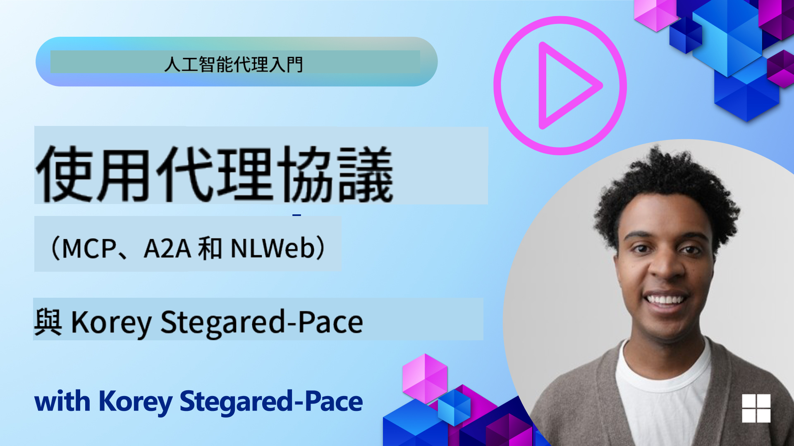
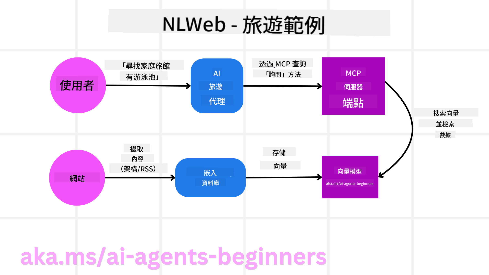

<!--
CO_OP_TRANSLATOR_METADATA:
{
  "original_hash": "8612bfcb6c9a658c999e9deaf4f8f896",
  "translation_date": "2025-08-28T09:50:01+00:00",
  "source_file": "11-agentic-protocols/README.md",
  "language_code": "hk"
}
-->
# 使用 Agentic Protocols（MCP、A2A 和 NLWeb）

隨着 AI Agent 的使用日益增長，確保標準化、安全性及支持開放創新的協議需求也隨之增加。在本課程中，我們將介紹三種旨在滿足這些需求的協議——模型上下文協議（Model Context Protocol，簡稱 MCP）、Agent-to-Agent（A2A）以及自然語言網絡（Natural Language Web，簡稱 NLWeb）。

## 課程簡介

在本課程中，我們將探討：

• **MCP** 如何讓 AI Agent 存取外部工具和數據以完成用戶任務。

• **A2A** 如何實現不同 AI Agent 之間的通信與協作。

• **NLWeb** 如何為任何網站提供自然語言介面，使 AI Agent 能夠發現並與內容互動。

## 學習目標

• **識別** MCP、A2A 和 NLWeb 在 AI Agent 背景下的核心目的及優勢。

• **解釋** 每種協議如何促進 LLM、工具及其他 Agent 之間的通信與互動。

• **認識** 每種協議在構建複雜 Agent 系統中所扮演的不同角色。

## 模型上下文協議（MCP）

**模型上下文協議（MCP）** 是一種開放標準，為應用程序提供了一種標準化方式，讓其能向 LLM 提供上下文和工具。這使得 AI Agent 能夠以一致的方式連接到不同的數據來源和工具，成為一種「通用適配器」。

接下來，我們將探討 MCP 的組成部分、與直接使用 API 的比較優勢，以及 AI Agent 如何使用 MCP 伺服器的示例。

### MCP 核心組成部分

MCP 基於 **客戶端-伺服器架構**，其核心組成部分包括：

• **主機（Hosts）**：LLM 應用程序（例如像 VSCode 這樣的代碼編輯器），負責啟動與 MCP 伺服器的連接。

• **客戶端（Clients）**：主機應用程序中的組件，維護與伺服器的一對一連接。

• **伺服器（Servers）**：輕量級程序，負責提供特定功能。

MCP 協議包含三個核心原語，這些是 MCP 伺服器的功能：

• **工具（Tools）**：這些是 AI Agent 可調用以執行操作的離散功能。例如，天氣服務可能提供一個「獲取天氣」工具，或電商伺服器可能提供一個「購買產品」工具。MCP 伺服器會在其功能列表中廣告每個工具的名稱、描述及輸入/輸出結構。

• **資源（Resources）**：這些是 MCP 伺服器可提供的只讀數據項或文檔，客戶端可按需檢索它們。例如文件內容、數據庫記錄或日誌文件。資源可以是文本（如代碼或 JSON）或二進制文件（如圖片或 PDF）。

• **提示（Prompts）**：這些是預定義的模板，提供建議的提示，支持更複雜的工作流程。

### MCP 的優勢

MCP 為 AI Agent 提供了顯著的優勢：

• **動態工具發現**：Agent 可動態接收伺服器提供的工具列表及其描述。這與傳統 API 不同，後者通常需要靜態編碼進行集成，任何 API 的變更都需要更新代碼。MCP 提供了一種「一次集成」的方法，提升了適應性。

• **跨 LLM 的互操作性**：MCP 可在不同的 LLM 上運行，提供靈活性以切換核心模型，從而評估性能。

• **標準化的安全性**：MCP 包含標準身份驗證方法，當添加對其他 MCP 伺服器的訪問時，這種方法更具可擴展性，簡化了管理不同傳統 API 的密鑰和身份驗證類型的過程。

### MCP 示例

假設用戶希望使用一個基於 MCP 的 AI 助手預訂航班。

1. **連接**：AI 助手（MCP 客戶端）連接到航空公司的 MCP 伺服器。

2. **工具發現**：客戶端詢問航空公司的 MCP 伺服器：「你有哪些可用工具？」伺服器回應提供如「搜索航班」和「預訂航班」的工具。

3. **工具調用**：用戶向 AI 助手請求：「請幫我搜索從波特蘭到檀香山的航班。」AI 助手利用其 LLM 確定需要調用「搜索航班」工具，並將相關參數（出發地、目的地）傳遞給 MCP 伺服器。

4. **執行與回應**：MCP 伺服器作為封裝器，實際調用航空公司的內部預訂 API，接收航班信息（如 JSON 數據），並將其返回給 AI 助手。

5. **進一步互動**：AI 助手展示航班選項。一旦用戶選擇航班，助手可能調用同一 MCP 伺服器上的「預訂航班」工具，完成預訂。

## Agent-to-Agent 協議（A2A）

MCP 專注於將 LLM 連接到工具，而 **Agent-to-Agent（A2A）協議** 則更進一步，實現不同 AI Agent 之間的通信與協作。A2A 將來自不同組織、環境和技術棧的 AI Agent 連接起來，共同完成一項共享任務。

我們將探討 A2A 的組成部分及其優勢，並通過旅行應用的示例來展示其應用。

### A2A 核心組成部分

A2A 專注於實現 Agent 之間的通信，讓它們協作完成用戶的子任務。協議的每個組成部分都為此作出貢獻：

#### Agent 卡片

類似於 MCP 伺服器共享工具列表，Agent 卡片包含：

• Agent 的名稱。  
• **描述其完成的一般任務**。  
• **具體技能列表**及其描述，幫助其他 Agent（甚至人類用戶）了解何時及為何需要調用該 Agent。  
• Agent 的**當前端點 URL**。  
• Agent 的**版本**及**功能**，例如流式回應和推送通知。

#### Agent 執行器

Agent 執行器負責**將用戶聊天的上下文傳遞給遠程 Agent**，遠程 Agent 需要這些上下文來理解需要完成的任務。在 A2A 伺服器中，Agent 使用其自己的大型語言模型（LLM）解析傳入請求，並使用其內部工具執行任務。

#### 工件（Artifact）

當遠程 Agent 完成請求的任務後，其工作成果會以工件的形式創建。工件**包含 Agent 工作的結果**、**完成的描述**以及通過協議傳遞的**文本上下文**。工件發送後，與遠程 Agent 的連接將關閉，直到再次需要時重新建立。

#### 事件隊列

此組件用於**處理更新和傳遞消息**。在生產環境中，這對於防止 Agent 之間的連接在任務完成前被關閉尤為重要，特別是當任務完成時間較長時。

### A2A 的優勢

• **增強協作**：它使來自不同供應商和平台的 Agent 能夠互動、共享上下文並協作工作，實現傳統上分離系統之間的無縫自動化。  

• **模型選擇靈活性**：每個 A2A Agent 可自行決定使用哪個 LLM 來處理請求，允許根據需求優化或微調模型，而不像某些 MCP 場景中僅限於單一 LLM 連接。  

• **內建身份驗證**：身份驗證直接集成到 A2A 協議中，為 Agent 交互提供了強大的安全框架。  

### A2A 示例

讓我們擴展旅行預訂場景，這次使用 A2A。

1. **用戶向多 Agent 發出請求**：用戶與「旅行 Agent」A2A 客戶端/Agent 互動，例如說：「請幫我預訂下週去檀香山的整個行程，包括航班、酒店和租車。」

2. **旅行 Agent 的編排**：旅行 Agent 收到這個複雜請求，使用其 LLM 推理任務，確定需要與其他專業 Agent 互動。

3. **Agent 間通信**：旅行 Agent 使用 A2A 協議連接到下游 Agent，例如「航空公司 Agent」、「酒店 Agent」和「租車 Agent」，這些 Agent 分別由不同公司創建。

4. **委派任務執行**：旅行 Agent 將具體任務分配給這些專業 Agent（例如「查找飛往檀香山的航班」、「預訂酒店」、「租車」）。每個專業 Agent 運行自己的 LLM，並利用自己的工具（這些工具可能本身是 MCP 伺服器）完成其特定部分的預訂。

5. **整合回應**：所有下游 Agent 完成任務後，旅行 Agent 將結果（航班詳情、酒店確認、租車預訂）整合，並以聊天形式的綜合回應返回給用戶。

## 自然語言網絡（NLWeb）

網站長期以來一直是用戶訪問互聯網信息和數據的主要方式。

接下來，我們將探討 NLWeb 的不同組成部分、NLWeb 的優勢，以及通過旅行應用展示 NLWeb 的工作方式。

### NLWeb 的組成部分

- **NLWeb 應用程序（核心服務代碼）**：處理自然語言問題的系統。它連接平台的不同部分以生成回應。可以將其視為網站自然語言功能的**引擎**。

- **NLWeb 協議**：這是一套**與網站進行自然語言交互的基本規則**，以 JSON 格式返回回應（通常使用 Schema.org）。其目的是為「AI 網絡」創建一個簡單的基礎，就像 HTML 使在線共享文檔成為可能一樣。

- **MCP 伺服器（模型上下文協議端點）**：每個 NLWeb 設置也作為一個**MCP 伺服器**。這意味著它可以與其他 AI 系統**共享工具（如「ask」方法）和數據**。實際上，這使網站的內容和功能可被 AI Agent 使用，讓網站成為更廣泛「Agent 生態系統」的一部分。

- **嵌入模型**：這些模型用於**將網站內容轉換為稱為向量的數字表示**（嵌入）。這些向量以計算機可比較和搜索的方式捕捉含義。它們存儲在一個特殊的數據庫中，用戶可以選擇使用哪種嵌入模型。

- **向量數據庫（檢索機制）**：該數據庫**存儲網站內容的嵌入**。當有人提出問題時，NLWeb 會檢查向量數據庫以快速找到最相關的信息，並按相似度排序給出快速答案列表。NLWeb 支持多種向量存儲系統，如 Qdrant、Snowflake、Milvus、Azure AI Search 和 Elasticsearch。

### NLWeb 示例

讓我們再次考慮旅行預訂網站，但這次由 NLWeb 提供支持。

1. **數據攝取**：旅行網站現有的產品目錄（例如航班列表、酒店描述、旅遊套餐）使用 Schema.org 格式化或通過 RSS 提要加載。NLWeb 的工具攝取這些結構化數據，創建嵌入，並將其存儲在本地或遠程向量數據庫中。

2. **自然語言查詢（人類）**：用戶訪問網站，並在聊天介面中輸入：「幫我找一間下週在檀香山有游泳池的適合家庭入住的酒店。」

3. **NLWeb 處理**：NLWeb 應用程序接收該查詢，將查詢發送到 LLM 進行理解，同時搜索其向量數據庫以查找相關的酒店列表。

4. **準確結果**：LLM 幫助解釋數據庫的搜索結果，根據「適合家庭入住」、「游泳池」和「檀香山」的條件識別最佳匹配，然後格式化為自然語言回應。關鍵是，回應引用的是網站目錄中的實際酒店，避免虛構信息。

5. **AI Agent 互動**：由於 NLWeb 作為 MCP 伺服器運行，外部 AI 旅行 Agent 也可以連接到該網站的 NLWeb 實例。AI Agent 可以直接使用 `ask` MCP 方法查詢網站，例如：`ask("酒店推薦的檀香山地區有沒有素食餐廳？")`。NLWeb 實例會處理該請求，利用其數據庫中的餐廳信息（如果已加載），並返回結構化的 JSON 回應。

### 還有關於 MCP/A2A/NLWeb 的問題嗎？

加入 [Azure AI Foundry Discord](https://aka.ms/ai-agents/discord)，與其他學習者交流，參加辦公時間，並獲得有關 AI Agent 的問題解答。

## 資源

- [MCP 初學者指南](https://aka.ms/mcp-for-beginners)  
- [MCP 文檔](https://github.com/microsoft/semantic-kernel/tree/main/python/semantic-kernel/semantic_kernel/connectors/mcp)  
- [NLWeb 資源庫](https://github.com/nlweb-ai/NLWeb)  
- [Semantic Kernel 指南](https://learn.microsoft.com/semantic-kernel/)  

---

**免責聲明**：  
本文件已使用人工智能翻譯服務 [Co-op Translator](https://github.com/Azure/co-op-translator) 進行翻譯。我們致力於提供準確的翻譯，但請注意，自動翻譯可能包含錯誤或不準確之處。應以原始語言的文件作為權威來源。對於關鍵資訊，建議尋求專業人工翻譯。我們對因使用此翻譯而引起的任何誤解或錯誤解讀概不負責。