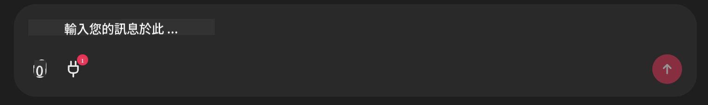

<!--
CO_OP_TRANSLATOR_METADATA:
{
  "original_hash": "9bf0395cbc541ce8db2a9699c8678dfc",
  "translation_date": "2025-08-28T09:56:01+00:00",
  "source_file": "11-agentic-protocols/code_samples/github-mcp/README.md",
  "language_code": "hk"
}
-->
# Github MCP 伺服器示例

## 描述

這是一個為 Microsoft Reactor 主辦的 AI Agents Hackathon 而創建的示範。

此工具用於根據用戶的 Github 儲存庫推薦黑客松項目。其工作方式如下：

1. **Github Agent** - 使用 Github MCP 伺服器檢索儲存庫及其相關資訊。
2. **Hackathon Agent** - 根據 Github Agent 提供的數據，結合用戶的項目、使用的程式語言以及 AI Agents Hackathon 的項目主題，提出創意黑客松項目。
3. **Events Agent** - 根據 Hackathon Agent 的建議，Events Agent 會推薦 AI Agents Hackathon 系列中相關的活動。

## 執行程式碼

### 環境變數

此示範使用 Azure Open AI Service、Semantic Kernel、Github MCP Server 和 Azure AI Search。

請確保已正確設置環境變數以使用這些工具：

```python
AZURE_OPENAI_CHAT_DEPLOYMENT_NAME=""
AZURE_OPENAI_EMBEDDING_DEPLOYMENT_NAME=""
AZURE_OPENAI_ENDPOINT=""
AZURE_OPENAI_API_KEY=""
AZURE_OPENAI_API_VERSION=""
AZURE_SEARCH_SERVICE_ENDPOINT=""
AZURE_SEARCH_API_KEY=""
``` 

## 執行 Chainlit 伺服器

為了連接 MCP 伺服器，此示範使用 Chainlit 作為聊天介面。

要啟動伺服器，請在終端中使用以下指令：

```bash
chainlit run app.py -w
```

此指令將啟動您的 Chainlit 伺服器，地址為 `localhost:8000`，並將 `event-descriptions.md` 的內容填充到 Azure AI Search Index 中。

## 連接 MCP 伺服器

要連接 Github MCP 伺服器，請點擊 "Type your message here.." 聊天框下方的 "plug" 圖標：



然後，您可以點擊 "Connect an MCP" 以添加連接 Github MCP 伺服器的指令：

```bash
npx -y @modelcontextprotocol/server-github --env GITHUB_PERSONAL_ACCESS_TOKEN=[YOUR PERSONAL ACCESS TOKEN]
```

將 "[YOUR PERSONAL ACCESS TOKEN]" 替換為您的實際個人訪問令牌。

連接成功後，您應該會看到 "plug" 圖標旁顯示 (1)，確認已連接。如果未顯示，請嘗試使用 `chainlit run app.py -w` 重新啟動 Chainlit 伺服器。

## 使用示範

要啟動推薦黑客松項目的代理工作流程，您可以輸入類似以下的訊息：

"Recommend hackathon projects for the Github user koreyspace"

Router Agent 會分析您的請求並確定最適合處理您的查詢的代理組合（GitHub、Hackathon 和 Events）。這些代理將協同工作，基於 Github 儲存庫分析、項目創意以及相關技術活動提供全面的推薦。

---

**免責聲明**：  
本文件已使用人工智能翻譯服務 [Co-op Translator](https://github.com/Azure/co-op-translator) 進行翻譯。儘管我們致力於提供準確的翻譯，但請注意，自動翻譯可能包含錯誤或不準確之處。原始語言的文件應被視為具權威性的來源。對於重要信息，建議使用專業人工翻譯。我們對因使用此翻譯而引起的任何誤解或錯誤解釋概不負責。