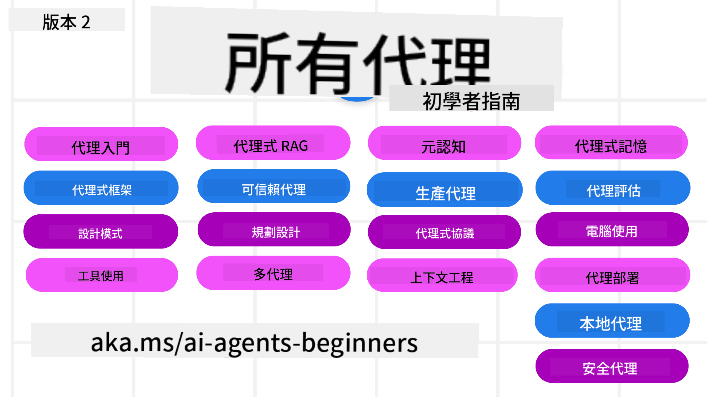

<!--
CO_OP_TRANSLATOR_METADATA:
{
  "original_hash": "9cb9bf18040a36fb1d822b10e92e7c04",
  "translation_date": "2025-09-07T07:45:40+00:00",
  "source_file": "README.md",
  "language_code": "hk"
}
-->
# AI Agents for Beginners - 初學者的 AI 代理課程

## 一個教你如何開始建立 AI 代理的課程

  
  
  
  
  

### 🌐 多語言支援

#### 透過 GitHub Action 支援（自動化且隨時保持最新）

[法文](../fr/README.md) | [西班牙文](../es/README.md) | [德文](../de/README.md) | [俄文](../ru/README.md) | [阿拉伯文](../ar/README.md) | [波斯文（法爾西）](../fa/README.md) | [烏爾都文](../ur/README.md) | [中文（簡體）](../zh/README.md) | [中文（繁體，澳門）](../mo/README.md) | [中文（繁體，香港）](./README.md) | [中文（繁體，台灣）](../tw/README.md) | [日文](../ja/README.md) | [韓文](../ko/README.md) | [印地文](../hi/README.md) | [孟加拉文](../bn/README.md) | [馬拉地文](../mr/README.md) | [尼泊爾文](../ne/README.md) | [旁遮普文（古木基文）](../pa/README.md) | [葡萄牙文（葡萄牙）](../pt/README.md) | [葡萄牙文（巴西）](../br/README.md) | [意大利文](../it/README.md) | [波蘭文](../pl/README.md) | [土耳其文](../tr/README.md) | [希臘文](../el/README.md) | [泰文](../th/README.md) | [瑞典文](../sv/README.md) | [丹麥文](../da/README.md) | [挪威文](../no/README.md) | [芬蘭文](../fi/README.md) | [荷蘭文](../nl/README.md) | [希伯來文](../he/README.md) | [越南文](../vi/README.md) | [印尼文](../id/README.md) | [馬來文](../ms/README.md) | [塔加洛文（菲律賓語）](../tl/README.md) | [斯瓦希里文](../sw/README.md) | [匈牙利文](../hu/README.md) | [捷克文](../cs/README.md) | [斯洛伐克文](../sk/README.md) | [羅馬尼亞文](../ro/README.md) | [保加利亞文](../bg/README.md) | [塞爾維亞文（西里爾字母）](../sr/README.md) | [克羅地亞文](../hr/README.md) | [斯洛文尼亞文](../sl/README.md) | [烏克蘭文](../uk/README.md) | [緬甸文（緬甸）](../my/README.md)

**如果你希望支援其他語言，可以參考 [這裡](https://github.com/Azure/co-op-translator/blob/main/getting_started/supported-languages.md)**

  
  
  

## 🌱 開始學習

這個課程包含了建立 AI 代理的基礎知識，每個課程都有自己的主題，你可以從任何一個你感興趣的地方開始！

此課程支援多語言版本，請參考我們的 [可用語言](../..)。

如果這是你第一次使用生成式 AI 模型，建議先參考我們的 [生成式 AI 初學者課程](https://aka.ms/genai-beginners)，該課程包含 21 節關於生成式 AI 的教學。

別忘了 [給這個倉庫加星（🌟）](https://docs.github.com/en/get-started/exploring-projects-on-github/saving-repositories-with-stars?WT.mc_id=academic-105485-koreyst) 和 [分叉這個倉庫](https://github.com/microsoft/ai-agents-for-beginners/fork) 來運行代碼。

### 與其他學習者交流，解答你的問題

如果你遇到困難或有任何關於建立 AI 代理的問題，歡迎加入我們的 [Azure AI Foundry 社群 Discord 頻道](https://aka.ms/ai-agents/discord)。

### 你需要準備什麼

每節課程都包含代碼範例，這些範例可以在 `code_samples` 資料夾中找到。你可以 [分叉這個倉庫](https://github.com/microsoft/ai-agents-for-beginners/fork) 來建立自己的副本。

這些練習中的代碼範例使用了 Azure AI Foundry 和 GitHub 模型目錄來與語言模型互動：

- [GitHub 模型](https://aka.ms/ai-agents-beginners/github-models) - 免費 / 有限
- [Azure AI Foundry](https://aka.ms/ai-agents-beginners/ai-foundry) - 需要 Azure 帳戶

此課程還使用了以下來自 Microsoft 的 AI 代理框架和服務：

- [Azure AI Agent Service](https://aka.ms/ai-agents-beginners/ai-agent-service)  
- [Semantic Kernel](https://aka.ms/ai-agents-beginners/semantic-kernel)  
- [AutoGen](https://aka.ms/ai-agents/autogen)  

更多有關運行此課程代碼的信息，請參考 [課程設置](./00-course-setup/README.md)。

## 🙏 想要幫忙？

如果你有建議或發現拼寫或代碼錯誤，請[提交問題](https://github.com/microsoft/ai-agents-for-beginners/issues?WT.mc_id=academic-105485-koreyst)或[創建拉取請求](https://github.com/microsoft/ai-agents-for-beginners/pulls?WT.mc_id=academic-105485-koreyst)。

## 📂 每節課程包含

- README 中的書面課程和一段簡短的影片  
- 支援 Azure AI Foundry 和 GitHub 模型（免費）的 Python 代碼範例  
- 連結到額外的學習資源，幫助你繼續學習  

## 🗃️ 課程列表

| **課程**                                     | **文字與代碼**                                    | **影片**                                                  | **額外學習資源**                                                                     |
|----------------------------------------------|----------------------------------------------------|------------------------------------------------------------|----------------------------------------------------------------------------------------|
| AI 代理簡介及其應用案例                      | [連結](./01-intro-to-ai-agents/README.md)          | [影片](https://youtu.be/3zgm60bXmQk?si=z8QygFvYQv-9WtO1)  | [連結](https://aka.ms/ai-agents-beginners/collection?WT.mc_id=academic-105485-koreyst) |
| 探索 AI 代理框架                             | [連結](./02-explore-agentic-frameworks/README.md)  | [影片](https://youtu.be/ODwF-EZo_O8?si=Vawth4hzVaHv-u0H)  | [連結](https://aka.ms/ai-agents-beginners/collection?WT.mc_id=academic-105485-koreyst) |
| 理解 AI 代理設計模式                         | [連結](./03-agentic-design-patterns/README.md)     | [影片](https://youtu.be/m9lM8qqoOEA?si=BIzHwzstTPL8o9GF)  | [連結](https://aka.ms/ai-agents-beginners/collection?WT.mc_id=academic-105485-koreyst) |
| 工具使用設計模式                             | [連結](./04-tool-use/README.md)                    | [影片](https://youtu.be/vieRiPRx-gI?si=2z6O2Xu2cu_Jz46N)  | [連結](https://aka.ms/ai-agents-beginners/collection?WT.mc_id=academic-105485-koreyst) |
| 代理式 RAG                                   | [連結](./05-agentic-rag/README.md)                 | [影片](https://youtu.be/WcjAARvdL7I?si=gKPWsQpKiIlDH9A3)  | [連結](https://aka.ms/ai-agents-beginners/collection?WT.mc_id=academic-105485-koreyst) |
| 建立值得信賴的 AI 代理                       | [連結](./06-building-trustworthy-agents/README.md) | [影片](https://youtu.be/iZKkMEGBCUQ?si=jZjpiMnGFOE9L8OK)  | [連結](https://aka.ms/ai-agents-beginners/collection?WT.mc_id=academic-105485-koreyst) |
| 規劃設計模式                                 | [連結](./07-planning-design/README.md)             | [影片](https://youtu.be/kPfJ2BrBCMY?si=6SC_iv_E5-mzucnC)  | [連結](https://aka.ms/ai-agents-beginners/collection?WT.mc_id=academic-105485-koreyst) |
| 多代理設計模式                               | [連結](./08-multi-agent/README.md)                 | [影片](https://youtu.be/V6HpE9hZEx0?si=rMgDhEu7wXo2uo6g)  | [連結](https://aka.ms/ai-agents-beginners/collection?WT.mc_id=academic-105485-koreyst) |
| 後設認知設計模式                             | [連結](./09-metacognition/README.md)               | [影片](https://youtu.be/His9R6gw6Ec?si=8gck6vvdSNCt6OcF)  | [連結](https://aka.ms/ai-agents-beginners/collection?WT.mc_id=academic-105485-koreyst) |
| 生產中的 AI 代理                             | [連結](./10-ai-agents-production/README.md)        | [影片](https://youtu.be/l4TP6IyJxmQ?si=31dnhexRo6yLRJDl)  | [連結](https://aka.ms/ai-agents-beginners/collection?WT.mc_id=academic-105485-koreyst) |
| 使用代理協議（MCP、A2A 和 NLWeb）            | [連結](./11-agentic-protocols/README.md)           | [影片](https://youtu.be/X-Dh9R3Opn8)                      | [連結](https://aka.ms/ai-agents-beginners/collection?WT.mc_id=academic-105485-koreyst) |  
| AI代理的上下文工程                     | [Link](./12-context-engineering/README.md)         | [Video](https://youtu.be/F5zqRV7gEag)                                 | [Link](https://aka.ms/ai-agents-beginners/collection?WT.mc_id=academic-105485-koreyst) |
| 管理代理記憶                           | 即將推出 - 9月11日                                |                                                            |                                                                                        |
| 評估AI代理                             | 即將推出 - 9月18日                                |                                                            |                                                                                        |
| 建立電腦使用代理（CUA）                | 即將推出 - 9月25日                                |                                                            |                                                                                        |
| 部署可擴展代理                         | 即將推出 - 9月25日                                |                                                            |                                                                                        |
| 創建本地AI代理                         | 即將推出 - 10月3日                                |                                                            |                                                                                        |
| 確保AI代理的安全性                     | 即將推出 - 10月10日                               |                                                            |                                                                                        |

## 🎒 其他課程

我們的團隊還製作了其他課程！查看以下內容：

- [**NEW** 初學者的模型上下文協議（MCP）](https://github.com/microsoft/mcp-for-beginners?WT.mc_id=academic-105485-koreyst)
- [使用 .NET 的初學者生成式AI](https://github.com/microsoft/Generative-AI-for-beginners-dotnet?WT.mc_id=academic-105485-koreyst)
- [生成式AI初學者課程](https://github.com/microsoft/generative-ai-for-beginners?WT.mc_id=academic-105485-koreyst)
- [使用 Java 的初學者生成式AI](https://github.com/microsoft/generative-ai-for-beginners-java?WT.mc_id=academic-105485-koreyst)
- [初學者的機器學習](https://aka.ms/ml-beginners?WT.mc_id=academic-105485-koreyst)
- [初學者的數據科學](https://aka.ms/datascience-beginners?WT.mc_id=academic-105485-koreyst)
- [初學者的人工智能](https://aka.ms/ai-beginners?WT.mc_id=academic-105485-koreyst)
- [初學者的網絡安全](https://github.com/microsoft/Security-101??WT.mc_id=academic-96948-sayoung)
- [初學者的網頁開發](https://aka.ms/webdev-beginners?WT.mc_id=academic-105485-koreyst)
- [初學者的物聯網](https://aka.ms/iot-beginners?WT.mc_id=academic-105485-koreyst)
- [初學者的XR開發](https://github.com/microsoft/xr-development-for-beginners?WT.mc_id=academic-105485-koreyst)
- [掌握GitHub Copilot進行AI配對編程](https://aka.ms/GitHubCopilotAI?WT.mc_id=academic-105485-koreyst)
- [掌握GitHub Copilot為C#/.NET開發者服務](https://github.com/microsoft/mastering-github-copilot-for-dotnet-csharp-developers?WT.mc_id=academic-105485-koreyst)
- [選擇你的Copilot冒險](https://github.com/microsoft/CopilotAdventures?WT.mc_id=academic-105485-koreyst)

## 🌟 社群感謝

感謝 [Shivam Goyal](https://www.linkedin.com/in/shivam2003/) 提供重要的代碼範例，展示了代理式RAG。

## 貢獻

此項目歡迎貢獻和建議。大多數貢獻需要您同意一份貢獻者許可協議（CLA），聲明您有權並確實授予我們使用您貢獻的權利。詳情請訪問 
<https://cla.opensource.microsoft.com>。

當您提交拉取請求時，CLA機器人會自動判斷您是否需要提供CLA並適當地標記PR（例如，狀態檢查、評論）。只需按照機器人提供的指示操作即可。您只需在所有使用CLA的倉庫中完成一次此操作。

此項目已採用 [Microsoft開源行為準則](https://opensource.microsoft.com/codeofconduct/)。
欲了解更多信息，請參閱 [行為準則FAQ](https://opensource.microsoft.com/codeofconduct/faq/) 或聯繫 [opencode@microsoft.com](mailto:opencode@microsoft.com) 提出其他問題或意見。

## 商標

此項目可能包含項目、產品或服務的商標或標誌。授權使用Microsoft商標或標誌必須遵守並符合
[Microsoft的商標和品牌指南](https://www.microsoft.com/legal/intellectualproperty/trademarks/usage/general)。
在修改版本中使用Microsoft商標或標誌不得引起混淆或暗示Microsoft的贊助。
任何使用第三方商標或標誌的行為必須遵守該第三方的政策。

---

**免責聲明**：  
本文件已使用人工智能翻譯服務 [Co-op Translator](https://github.com/Azure/co-op-translator) 進行翻譯。儘管我們致力於提供準確的翻譯，請注意自動翻譯可能包含錯誤或不準確之處。原始文件的母語版本應被視為權威來源。對於重要信息，建議使用專業人工翻譯。我們對因使用此翻譯而引起的任何誤解或錯誤解釋概不負責。