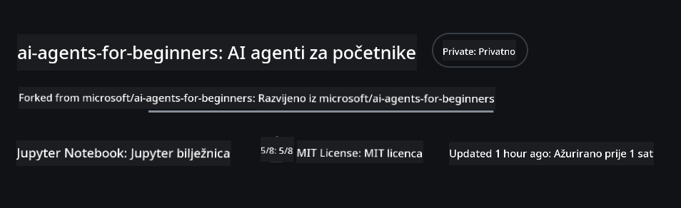
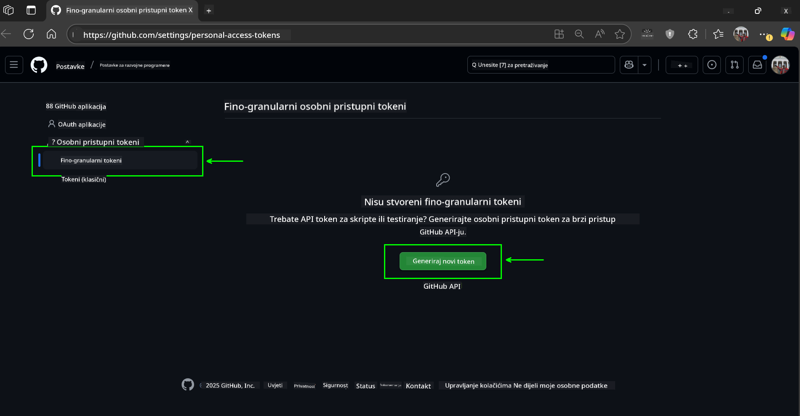
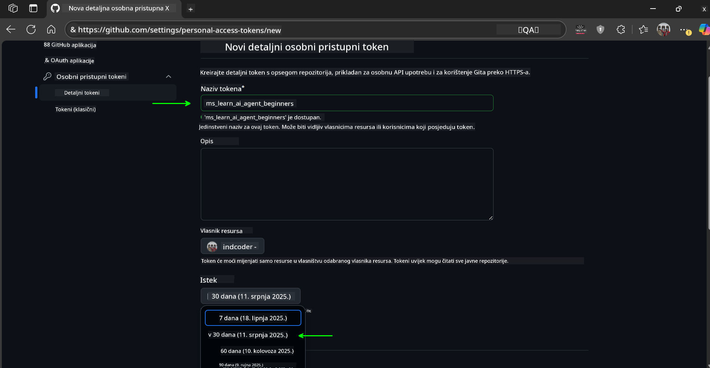
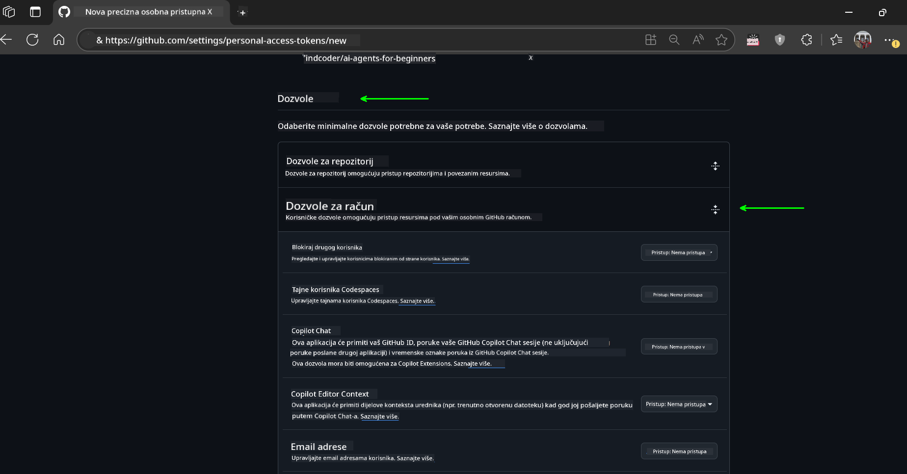
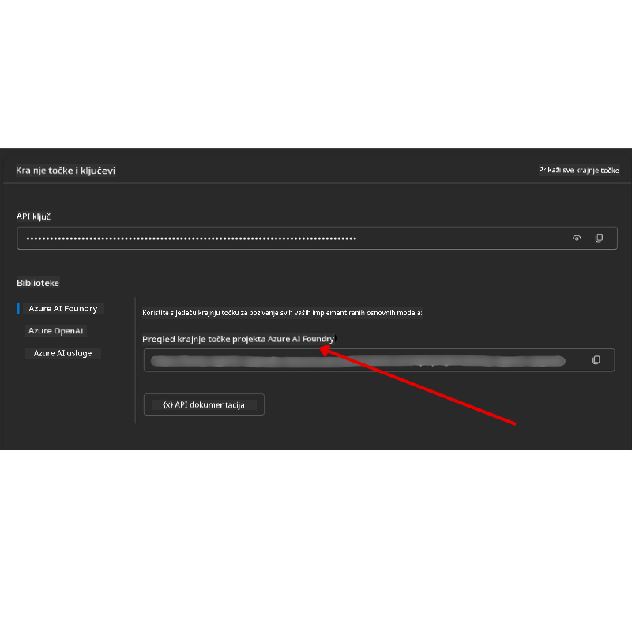

<!--
CO_OP_TRANSLATOR_METADATA:
{
  "original_hash": "c6a79c8f2b56a80370ff7e447765524f",
  "translation_date": "2025-07-23T09:17:01+00:00",
  "source_file": "00-course-setup/README.md",
  "language_code": "hr"
}
-->
# Postavljanje tečaja

## Uvod

Ova lekcija obuhvaća kako pokrenuti primjere koda iz ovog tečaja.

## Klonirajte ili forkajte ovaj repozitorij

Za početak, klonirajte ili forkajte GitHub repozitorij. Time ćete dobiti vlastitu verziju materijala tečaja kako biste mogli pokretati, testirati i prilagođavati kod!

To možete učiniti klikom na poveznicu do

Sada biste trebali imati vlastitu forkanu verziju ovog tečaja na sljedećoj poveznici:



## Pokretanje koda

Ovaj tečaj nudi niz Jupyter Notebooks datoteka koje možete pokrenuti kako biste stekli praktično iskustvo u izradi AI agenata.

Primjeri koda koriste:

**Zahtijeva GitHub račun - besplatno**:

1) Semantic Kernel Agent Framework + GitHub Models Marketplace. Označeno kao (semantic-kernel.ipynb)
2) AutoGen Framework + GitHub Models Marketplace. Označeno kao (autogen.ipynb)

**Zahtijeva Azure pretplatu**:
3) Azure AI Foundry + Azure AI Agent Service. Označeno kao (azureaiagent.ipynb)

Preporučujemo da isprobate sve tri vrste primjera kako biste vidjeli koji vam najbolje odgovara.

Ovisno o opciji koju odaberete, odredit će se koraci postavljanja koje trebate slijediti u nastavku:

## Zahtjevi

- Python 3.12+
  - **NAPOMENA**: Ako nemate instaliran Python 3.12, osigurajte da ga instalirate. Zatim kreirajte svoj venv koristeći python3.12 kako biste osigurali da se instaliraju ispravne verzije iz datoteke requirements.txt.
- GitHub račun - za pristup GitHub Models Marketplaceu
- Azure pretplata - za pristup Azure AI Foundryju
- Azure AI Foundry račun - za pristup Azure AI Agent Serviceu

U korijenu ovog repozitorija uključili smo datoteku `requirements.txt` koja sadrži sve potrebne Python pakete za pokretanje primjera koda.

Možete ih instalirati pokretanjem sljedeće naredbe u terminalu na korijenu repozitorija:

```bash
pip install -r requirements.txt
```
Preporučujemo kreiranje Python virtualnog okruženja kako biste izbjegli konflikte i probleme.

## Postavljanje VSCode-a
Provjerite koristite li ispravnu verziju Pythona u VSCode-u.


## Postavljanje za primjere koji koriste GitHub modele 

### Korak 1: Dohvatite svoj GitHub Personal Access Token (PAT)

Ovaj tečaj koristi GitHub Models Marketplace, koji pruža besplatan pristup velikim jezičnim modelima (LLM-ovima) koje ćete koristiti za izradu AI agenata.

Za korištenje GitHub modela, trebate kreirati [GitHub Personal Access Token](https://docs.github.com/en/authentication/keeping-your-account-and-data-secure/managing-your-personal-access-tokens).

To možete učiniti odlaskom na svoj GitHub račun.

Molimo slijedite [Princip najmanjih privilegija](https://docs.github.com/en/get-started/learning-to-code/storing-your-secrets-safely) prilikom kreiranja tokena. To znači da tokenu trebate dodijeliti samo one dozvole koje su potrebne za pokretanje primjera koda iz ovog tečaja.

1. Odaberite opciju `Fine-grained tokens` na lijevoj strani ekrana.

    Zatim odaberite `Generate new token`.

    

1. Unesite opisni naziv za svoj token koji odražava njegovu svrhu, kako biste ga kasnije lako identificirali. Postavite datum isteka (preporučeno: 30 dana; možete odabrati kraći period, poput 7 dana, ako preferirate sigurniji pristup).

    

1. Ograničite opseg tokena na vaš fork ovog repozitorija.

    

1. Ograničite dozvole tokena: Pod **Permissions**, uključite **Account Permissions**, idite na **Models** i omogućite samo pristup za čitanje koji je potreban za GitHub modele.

    

    

Kopirajte svoj novi token koji ste upravo kreirali. Sada ćete ga dodati u svoju `.env` datoteku uključenu u ovaj tečaj.

### Korak 2: Kreirajte svoju `.env` datoteku

Za kreiranje `.env` datoteke pokrenite sljedeću naredbu u terminalu.

```bash
cp .env.example .env
```

Ovo će kopirati primjer datoteke i kreirati `.env` u vašem direktoriju, gdje ćete popuniti vrijednosti za varijable okruženja.

S kopiranim tokenom, otvorite `.env` datoteku u svom omiljenom uređivaču teksta i zalijepite svoj token u polje `GITHUB_TOKEN`.

Sada biste trebali moći pokrenuti primjere koda iz ovog tečaja.

## Postavljanje za primjere koji koriste Azure AI Foundry i Azure AI Agent Service

### Korak 1: Dohvatite svoj Azure projektni endpoint

Slijedite korake za kreiranje huba i projekta u Azure AI Foundryju ovdje: [Hub resources overview](https://learn.microsoft.com/en-us/azure/ai-foundry/concepts/ai-resources)

Nakon što ste kreirali svoj projekt, trebate dohvatiti string za povezivanje svog projekta.

To možete učiniti odlaskom na stranicu **Overview** vašeg projekta u Azure AI Foundry portalu.



### Korak 2: Kreirajte svoju `.env` datoteku

Za kreiranje `.env` datoteke pokrenite sljedeću naredbu u terminalu.

```bash
cp .env.example .env
```

Ovo će kopirati primjer datoteke i kreirati `.env` u vašem direktoriju, gdje ćete popuniti vrijednosti za varijable okruženja.

S kopiranim tokenom, otvorite `.env` datoteku u svom omiljenom uređivaču teksta i zalijepite svoj token u polje `PROJECT_ENDPOINT`.

### Korak 3: Prijavite se na Azure

Kao najbolju praksu za sigurnost, koristit ćemo [autentifikaciju bez ključeva](https://learn.microsoft.com/azure/developer/ai/keyless-connections?tabs=csharp%2Cazure-cli?WT.mc_id=academic-105485-koreyst) za autentifikaciju na Azure OpenAI pomoću Microsoft Entra ID-a.

Zatim otvorite terminal i pokrenite `az login --use-device-code` kako biste se prijavili na svoj Azure račun.

Nakon što ste se prijavili, odaberite svoju pretplatu u terminalu.

## Dodatne varijable okruženja - Azure Search i Azure OpenAI 

Za lekciju Agentic RAG - Lekcija 5 - postoje primjeri koji koriste Azure Search i Azure OpenAI.

Ako želite pokrenuti ove primjere, trebate dodati sljedeće varijable okruženja u svoju `.env` datoteku:

### Stranica Pregled (Projekt)

- `AZURE_SUBSCRIPTION_ID` - Provjerite **Project details** na stranici **Overview** vašeg projekta.

- `AZURE_AI_PROJECT_NAME` - Pogledajte vrh stranice **Overview** vašeg projekta.

- `AZURE_OPENAI_SERVICE` - Pronađite ovo na kartici **Included capabilities** za **Azure OpenAI Service** na stranici **Overview**.

### Centar za upravljanje

- `AZURE_OPENAI_RESOURCE_GROUP` - Idite na **Project properties** na stranici **Overview** u **Management Centeru**.

- `GLOBAL_LLM_SERVICE` - Pod **Connected resources**, pronađite naziv veze za **Azure AI Services**. Ako nije navedeno, provjerite **Azure portal** pod vašom grupom resursa za naziv resursa AI Services.

### Stranica Modeli + Endpointi

- `AZURE_OPENAI_EMBEDDING_DEPLOYMENT_NAME` - Odaberite svoj model za ugrađivanje (npr. `text-embedding-ada-002`) i zabilježite **Deployment name** iz detalja modela.

- `AZURE_OPENAI_CHAT_DEPLOYMENT_NAME` - Odaberite svoj model za chat (npr. `gpt-4o-mini`) i zabilježite **Deployment name** iz detalja modela.

### Azure Portal

- `AZURE_OPENAI_ENDPOINT` - Potražite **Azure AI services**, kliknite na njega, zatim idite na **Resource Management**, **Keys and Endpoint**, skrolajte dolje do "Azure OpenAI endpoints" i kopirajte onaj koji kaže "Language APIs".

- `AZURE_OPENAI_API_KEY` - Na istom ekranu, kopirajte KLJUČ 1 ili KLJUČ 2.

- `AZURE_SEARCH_SERVICE_ENDPOINT` - Pronađite svoj **Azure AI Search** resurs, kliknite na njega i pogledajte **Overview**.

- `AZURE_SEARCH_API_KEY` - Zatim idite na **Settings** i zatim **Keys** kako biste kopirali primarni ili sekundarni administratorski ključ.

### Vanjska web stranica

- `AZURE_OPENAI_API_VERSION` - Posjetite stranicu [API version lifecycle](https://learn.microsoft.com/en-us/azure/ai-services/openai/api-version-deprecation#latest-ga-api-release) pod **Latest GA API release**.

### Postavljanje autentifikacije bez ključeva

Umjesto da hardkodiramo vaše vjerodajnice, koristit ćemo vezu bez ključeva s Azure OpenAI. Za to ćemo uvesti `DefaultAzureCredential` i kasnije pozvati funkciju `DefaultAzureCredential` za dobivanje vjerodajnice.

```python
from azure.identity import DefaultAzureCredential, InteractiveBrowserCredential
```

## Imate li problema?

Ako imate bilo kakvih problema s pokretanjem ovog postavljanja, pridružite se našem

## Sljedeća lekcija

Sada ste spremni pokrenuti kod za ovaj tečaj. Sretno u učenju o svijetu AI agenata!

[Uvod u AI agente i primjene agenata](../01-intro-to-ai-agents/README.md)

**Odricanje od odgovornosti**:  
Ovaj dokument je preveden pomoću AI usluge za prevođenje [Co-op Translator](https://github.com/Azure/co-op-translator). Iako nastojimo osigurati točnost, imajte na umu da automatski prijevodi mogu sadržavati pogreške ili netočnosti. Izvorni dokument na izvornom jeziku treba smatrati autoritativnim izvorom. Za kritične informacije preporučuje se profesionalni prijevod od strane čovjeka. Ne preuzimamo odgovornost za nesporazume ili pogrešna tumačenja koja mogu proizaći iz korištenja ovog prijevoda.