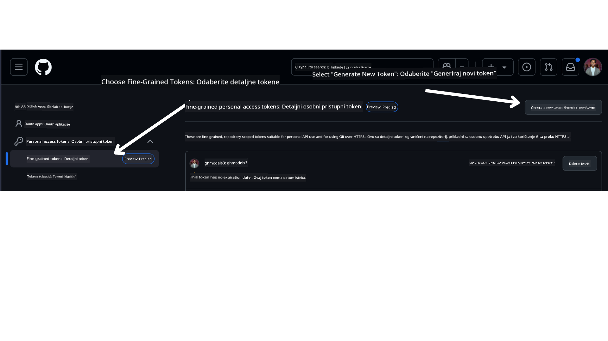

<!--
CO_OP_TRANSLATOR_METADATA:
{
  "original_hash": "76945069b52a49cd0432ae3e0b0ba22e",
  "translation_date": "2025-07-12T07:58:22+00:00",
  "source_file": "00-course-setup/README.md",
  "language_code": "hr"
}
-->
u vašem GitHub računu.

Odaberite opciju `Fine-grained tokens` na lijevoj strani zaslona.

Zatim odaberite `Generate new token`.



Bit ćete upitani da unesete naziv za svoj token, odaberete datum isteka (Preporučeno: 30 dana) i odaberete opsege za svoj token (Javni repozitoriji).

Također je potrebno urediti dozvole za ovaj token: Permissions -> Models -> Omogućuje pristup GitHub modelima

Kopirajte svoj novi token koji ste upravo kreirali. Sada ćete ga dodati u svoju `.env` datoteku koja je uključena u ovaj tečaj.

### Korak 2: Kreirajte svoju `.env` datoteku

Za kreiranje `.env` datoteke pokrenite sljedeću naredbu u terminalu.

```bash
cp .env.example .env
```

Ovo će kopirati primjer datoteke i stvoriti `.env` u vašem direktoriju gdje ćete unijeti vrijednosti za varijable okoline.

Nakon što ste kopirali token, otvorite `.env` datoteku u svom omiljenom uređivaču teksta i zalijepite token u polje `GITHUB_TOKEN`.

Sada biste trebali moći pokrenuti primjere koda iz ovog tečaja.

## Postavljanje za primjere koji koriste Azure AI Foundry i Azure AI Agent Service

### Korak 1: Dohvatite svoj Azure Project Endpoint

Slijedite korake za kreiranje huba i projekta u Azure AI Foundry koji se nalaze ovdje: [Hub resources overview](https://learn.microsoft.com/en-us/azure/ai-foundry/concepts/ai-resources)

Nakon što ste kreirali svoj projekt, trebate dohvatiti connection string za svoj projekt.

To možete učiniti tako da odete na stranicu **Overview** svog projekta u Azure AI Foundry portalu.


### Korak 2: Kreirajte svoju `.env` datoteku

Za kreiranje `.env` datoteke pokrenite sljedeću naredbu u terminalu.

```bash
cp .env.example .env
```

Ovo će kopirati primjer datoteke i stvoriti `.env` u vašem direktoriju gdje ćete unijeti vrijednosti za varijable okoline.

Nakon što ste kopirali token, otvorite `.env` datoteku u svom omiljenom uređivaču teksta i zalijepite token u polje `PROJECT_ENDPOINT`.

### Korak 3: Prijavite se u Azure

Kao sigurnosnu dobru praksu, koristit ćemo [keyless authentication](https://learn.microsoft.com/azure/developer/ai/keyless-connections?tabs=csharp%2Cazure-cli?WT.mc_id=academic-105485-koreyst) za autentifikaciju u Azure OpenAI pomoću Microsoft Entra ID-a. Prije nego što to učinite, prvo morate instalirati **Azure CLI** prema [uputama za instalaciju](https://learn.microsoft.com/cli/azure/install-azure-cli?WT.mc_id=academic-105485-koreyst) za vaš operativni sustav.

Zatim otvorite terminal i pokrenite `az login --use-device-code` za prijavu u svoj Azure račun.

Nakon što se prijavite, odaberite svoju pretplatu u terminalu.

## Dodatne varijable okoline - Azure Search i Azure OpenAI

Za lekciju Agentic RAG - Lekcija 5 - postoje primjeri koji koriste Azure Search i Azure OpenAI.

Ako želite pokrenuti te primjere, morat ćete dodati sljedeće varijable okoline u svoju `.env` datoteku:

### Stranica pregleda (Projekt)

- `AZURE_SUBSCRIPTION_ID` - Provjerite **Detalje projekta** na stranici **Overview** vašeg projekta.

- `AZURE_AI_PROJECT_NAME` - Pogledajte na vrhu stranice **Overview** vašeg projekta.

- `AZURE_OPENAI_SERVICE` - Pronađite ovo u kartici **Included capabilities** za **Azure OpenAI Service** na stranici **Overview**.

### Management Center

- `AZURE_OPENAI_RESOURCE_GROUP` - Idite na **Project properties** na stranici **Overview** u **Management Center**.

- `GLOBAL_LLM_SERVICE` - Pod **Connected resources**, pronađite naziv veze za **Azure AI Services**. Ako nije naveden, provjerite u **Azure portalu** pod svojom grupom resursa za naziv AI Services resursa.

### Stranica modela i endpointa

- `AZURE_OPENAI_EMBEDDING_DEPLOYMENT_NAME` - Odaberite svoj embedding model (npr. `text-embedding-ada-002`) i zabilježite **Deployment name** iz detalja modela.

- `AZURE_OPENAI_CHAT_DEPLOYMENT_NAME` - Odaberite svoj chat model (npr. `gpt-4o-mini`) i zabilježite **Deployment name** iz detalja modela.

### Azure portal

- `AZURE_OPENAI_ENDPOINT` - Potražite **Azure AI services**, kliknite na to, zatim idite na **Resource Management**, **Keys and Endpoint**, skrolajte do "Azure OpenAI endpoints" i kopirajte onaj koji kaže "Language APIs".

- `AZURE_OPENAI_API_KEY` - S iste stranice kopirajte KEY 1 ili KEY 2.

- `AZURE_SEARCH_SERVICE_ENDPOINT` - Pronađite svoj **Azure AI Search** resurs, kliknite na njega i pogledajte **Overview**.

- `AZURE_SEARCH_API_KEY` - Zatim idite na **Settings** i potom **Keys** da kopirate primarni ili sekundarni admin ključ.

### Vanjska web stranica

- `AZURE_OPENAI_API_VERSION` - Posjetite stranicu [API version lifecycle](https://learn.microsoft.com/en-us/azure/ai-services/openai/api-version-deprecation#latest-ga-api-release) pod **Latest GA API release**.

### Postavljanje keyless autentifikacije

Umjesto da unosite svoje vjerodajnice direktno, koristit ćemo keyless vezu s Azure OpenAI. Za to ćemo importati `DefaultAzureCredential` i kasnije pozvati funkciju `DefaultAzureCredential` da dobijemo vjerodajnice.

```python
from azure.identity import DefaultAzureCredential, InteractiveBrowserCredential
```

## Zapeli ste negdje?

Ako imate problema s pokretanjem ovog postavljanja, pridružite se našem

ili

.

## Sljedeća lekcija

Sada ste spremni pokrenuti kod za ovaj tečaj. Sretno u učenju više o svijetu AI agenata!

[Uvod u AI agente i primjere njihove primjene](../01-intro-to-ai-agents/README.md)

**Odricanje od odgovornosti**:  
Ovaj dokument je preveden korištenjem AI usluge za prevođenje [Co-op Translator](https://github.com/Azure/co-op-translator). Iako težimo točnosti, imajte na umu da automatski prijevodi mogu sadržavati pogreške ili netočnosti. Izvorni dokument na izvornom jeziku treba smatrati autoritativnim izvorom. Za kritične informacije preporučuje se profesionalni ljudski prijevod. Ne snosimo odgovornost za bilo kakva nesporazume ili pogrešna tumačenja koja proizlaze iz korištenja ovog prijevoda.