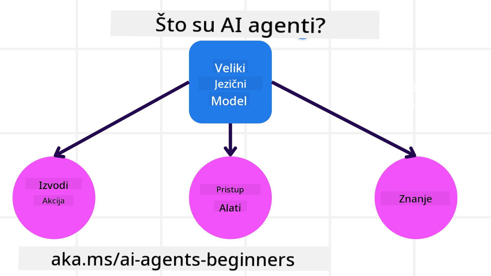
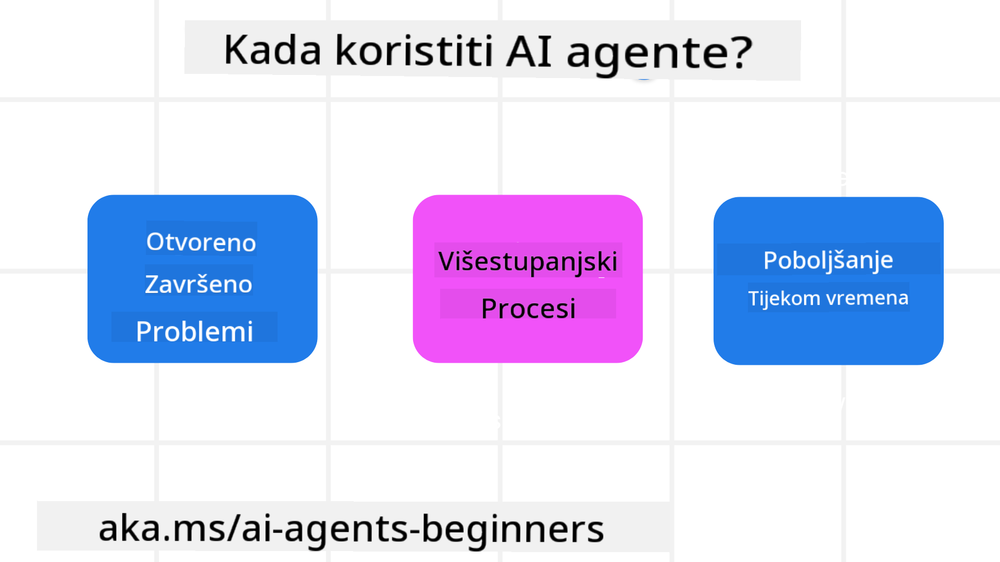

<!--
CO_OP_TRANSLATOR_METADATA:
{
  "original_hash": "d84943abc8f001ad4670418d32c2d899",
  "translation_date": "2025-07-12T08:13:04+00:00",
  "source_file": "01-intro-to-ai-agents/README.md",
  "language_code": "hr"
}
-->
da se upoznate s drugim polaznicima i kreatorima AI agenata te postavite sva pitanja koja imate o ovom tečaju.

Za početak ovog tečaja, krenut ćemo s boljim razumijevanjem što su AI agenti i kako ih možemo koristiti u aplikacijama i radnim procesima koje gradimo.

## Uvod

Ova lekcija obuhvaća:

- Što su AI agenti i koje su različite vrste agenata?
- Koje su najbolje primjene za AI agente i kako nam mogu pomoći?
- Koji su osnovni gradivni blokovi pri dizajniranju agentnih rješenja?

## Ciljevi učenja
Nakon završetka ove lekcije, trebali biste moći:

- Razumjeti koncepte AI agenata i kako se razlikuju od drugih AI rješenja.
- Najefikasnije primijeniti AI agente.
- Produktivno dizajnirati agentna rješenja za korisnike i klijente.

## Definiranje AI agenata i vrste AI agenata

### Što su AI agenti?

AI agenti su **sustavi** koji omogućuju **velikim jezičnim modelima (LLM-ovima)** da **izvršavaju radnje** proširujući njihove mogućnosti tako da LLM-ovima daju **pristup alatima** i **znanju**.

Razložimo ovu definiciju na manje dijelove:

- **Sustav** – Važno je razmišljati o agentima ne samo kao o jednoj komponenti, već kao o sustavu sastavljenom od više komponenti. Na osnovnoj razini, komponente AI agenta su:
  - **Okruženje** – Definirani prostor u kojem AI agent djeluje. Na primjer, ako imamo AI agenta za rezervaciju putovanja, okruženje može biti sustav za rezervaciju putovanja koji agent koristi za izvršavanje zadataka.
  - **Senzori** – Okruženja imaju informacije i pružaju povratne informacije. AI agenti koriste senzore za prikupljanje i tumačenje tih informacija o trenutnom stanju okruženja. U primjeru agenta za rezervaciju putovanja, sustav može pružiti informacije poput dostupnosti hotela ili cijena letova.
  - **Aktuatori** – Nakon što AI agent primi trenutno stanje okruženja, za zadatak koji je pred njim agent određuje koju radnju treba poduzeti da bi promijenio okruženje. Za agenta za rezervaciju putovanja to može biti rezervacija dostupne sobe za korisnika.

**Veliki jezični modeli** – Koncept agenata postojao je i prije nastanka LLM-ova. Prednost izgradnje AI agenata s LLM-ovima je njihova sposobnost tumačenja ljudskog jezika i podataka. Ta sposobnost omogućuje LLM-ovima da interpretiraju informacije iz okruženja i definiraju plan za promjenu okruženja.

**Izvršavanje radnji** – Izvan AI agentnih sustava, LLM-ovi su ograničeni na situacije u kojima je radnja generiranje sadržaja ili informacija na temelju korisničkog upita. Unutar AI agentnih sustava, LLM-ovi mogu izvršavati zadatke tumačenjem korisničkog zahtjeva i korištenjem alata dostupnih u njihovom okruženju.

**Pristup alatima** – Koji alati su dostupni LLM-u određuje 1) okruženje u kojem djeluje i 2) programer AI agenta. U našem primjeru agenta za putovanja, alati agenta ograničeni su operacijama dostupnim u sustavu za rezervaciju, a/ili programer može ograničiti pristup agentu samo na letove.

**Memorija i znanje** – Memorija može biti kratkoročna u kontekstu razgovora između korisnika i agenta. Dugoročno, osim informacija koje pruža okruženje, AI agenti mogu dohvaćati znanje iz drugih sustava, servisa, alata pa čak i drugih agenata. U primjeru agenta za putovanja, to znanje može biti informacija o korisnikovim preferencijama putovanja pohranjena u bazi podataka korisnika.

### Različite vrste agenata

Sada kada imamo opću definiciju AI agenata, pogledajmo neke specifične vrste agenata i kako bi se primijenili na AI agenta za rezervaciju putovanja.

| **Vrsta agenta**              | **Opis**                                                                                                                            | **Primjer**                                                                                                                                                                                                                   |
| ----------------------------- | ----------------------------------------------------------------------------------------------------------------------------------- | ----------------------------------------------------------------------------------------------------------------------------------------------------------------------------------------------------------------------------- |
| **Jednostavni refleksni agenti** | Izvršavaju trenutne radnje na temelju unaprijed definiranih pravila.                                                                | Agent za putovanja interpretira kontekst e-pošte i prosljeđuje pritužbe na putovanja službi za korisnike.                                                                                                                      |
| **Model-bazirani refleksni agenti** | Izvršavaju radnje na temelju modela svijeta i promjena u tom modelu.                                                                | Agent za putovanja daje prioritet rutama s značajnim promjenama cijena na temelju pristupa povijesnim podacima o cijenama.                                                                                                    |
| **Agent s ciljem**             | Stvara planove za postizanje određenih ciljeva tumačeći cilj i određujući radnje za njegovo ostvarenje.                              | Agent za putovanja rezervira putovanje određujući potrebne aranžmane (auto, javni prijevoz, letovi) od trenutne lokacije do odredišta.                                                                                        |
| **Agent temeljen na korisnosti** | Razmatra preferencije i numerički procjenjuje kompromise kako bi odredio kako postići ciljeve.                                         | Agent za putovanja maksimizira korisnost vagajući pogodnost naspram troškova prilikom rezervacije putovanja.                                                                                                                  |
| **Učeći agenti**              | Poboljšavaju se tijekom vremena reagiranjem na povratne informacije i prilagođavanjem radnji.                                        | Agent za putovanja poboljšava se koristeći povratne informacije korisnika iz anketa nakon putovanja za prilagodbu budućih rezervacija.                                                                                      |
| **Hijerarhijski agenti**       | Sastoje se od više agenata u slojevitom sustavu, pri čemu viši agenti razlažu zadatke na podzadatke koje niži agenti izvršavaju.    | Agent za putovanja otkazuje putovanje dijeleći zadatak na podzadatke (npr. otkazivanje pojedinačnih rezervacija) koje izvršavaju niži agenti, a zatim izvještavaju višeg agenta.                                              |
| **Sustavi s više agenata (MAS)** | Agenti samostalno izvršavaju zadatke, bilo suradnički ili natjecateljski.                                                           | Suradnički: Više agenata rezervira specifične usluge poput hotela, letova i zabave. Natjecateljski: Više agenata upravlja i natječe se za zajednički kalendar rezervacija hotela kako bi smjestili goste.                      |

## Kada koristiti AI agente

U ranijem dijelu koristili smo primjer agenta za putovanja da objasnimo kako se različite vrste agenata mogu koristiti u različitim scenarijima rezervacije putovanja. Nastavit ćemo koristiti ovu aplikaciju kroz cijeli tečaj.

Pogledajmo vrste primjena za koje su AI agenti najprikladniji:

- **Otvoreni problemi** – dopuštajući LLM-u da odredi potrebne korake za dovršetak zadatka jer se ne mogu uvijek unaprijed programirati u radni proces.
- **Višestupanjski procesi** – zadaci koji zahtijevaju razinu složenosti u kojoj AI agent treba koristiti alate ili informacije kroz više koraka, a ne samo jednokratno dohvaćanje.
- **Poboljšanje tijekom vremena** – zadaci u kojima se agent može poboljšavati primanjem povratnih informacija iz okruženja ili od korisnika kako bi pružio bolju korisnost.

Više o razmatranjima korištenja AI agenata obrađujemo u lekciji Izgradnja pouzdanih AI agenata.

## Osnove agentnih rješenja

### Razvoj agenata

Prvi korak u dizajniranju AI agentnog sustava je definirati alate, radnje i ponašanja. U ovom tečaju fokusiramo se na korištenje **Azure AI Agent Service** za definiranje naših agenata. Nudi značajke poput:

- Izbor otvorenih modela kao što su OpenAI, Mistral i Llama
- Korištenje licenciranih podataka preko pružatelja poput Tripadvisor
- Korištenje standardiziranih OpenAPI 3.0 alata

### Agentni obrasci

Komunikacija s LLM-ovima odvija se putem upita (promptova). S obzirom na poluautonomnu prirodu AI agenata, nije uvijek moguće ili potrebno ručno ponovno slati upite LLM-u nakon promjene u okruženju. Koristimo **agentne obrasce** koji nam omogućuju da upite šaljemo kroz više koraka na skalabilniji način.

Ovaj tečaj podijeljen je prema nekim od trenutno popularnih agentnih obrazaca.

### Agentni okviri

Agentni okviri omogućuju programerima implementaciju agentnih obrazaca kroz kod. Ti okviri nude predloške, dodatke i alate za bolju suradnju AI agenata. Ove prednosti omogućuju bolju vidljivost i rješavanje problema u AI agentnim sustavima.

U ovom tečaju istražit ćemo istraživački orijentirani AutoGen okvir i proizvodno spreman Agent okvir iz Semantic Kernel-a.

## Prethodna lekcija

[Postavljanje tečaja](../00-course-setup/README.md)

## Sljedeća lekcija

[Istraživanje agentnih okvira](../02-explore-agentic-frameworks/README.md)

**Odricanje od odgovornosti**:  
Ovaj dokument je preveden korištenjem AI usluge za prevođenje [Co-op Translator](https://github.com/Azure/co-op-translator). Iako težimo točnosti, imajte na umu da automatski prijevodi mogu sadržavati pogreške ili netočnosti. Izvorni dokument na izvornom jeziku treba smatrati službenim i autoritativnim izvorom. Za kritične informacije preporučuje se profesionalni ljudski prijevod. Ne snosimo odgovornost za bilo kakva nesporazuma ili pogrešna tumačenja koja proizlaze iz korištenja ovog prijevoda.