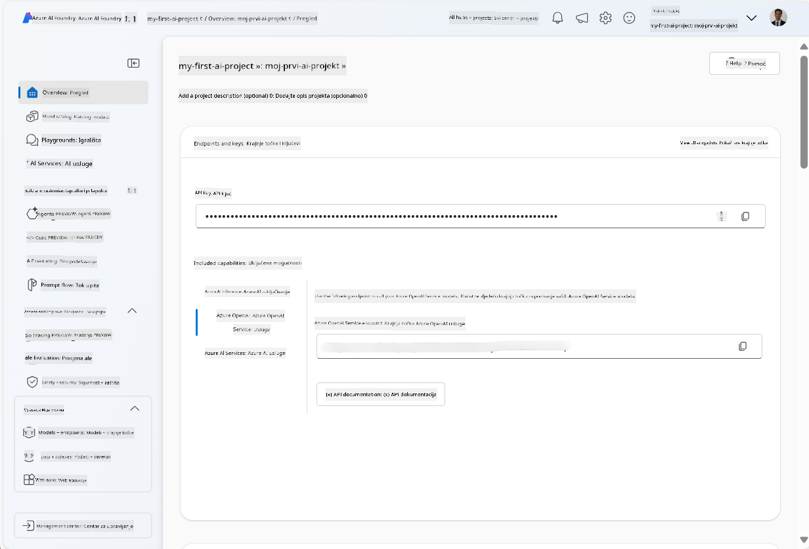
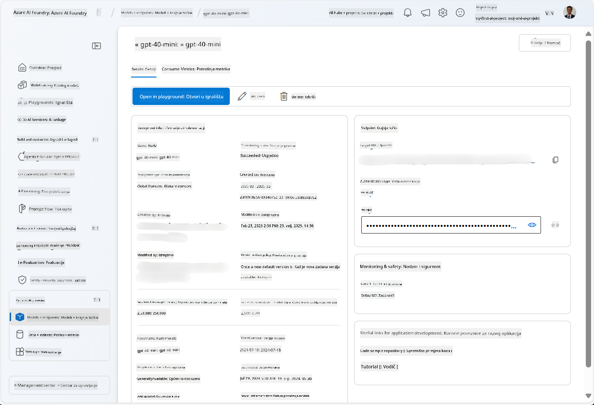
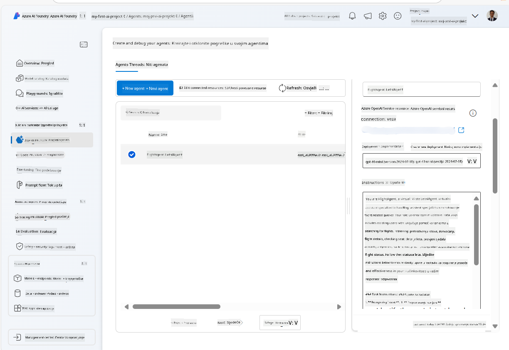
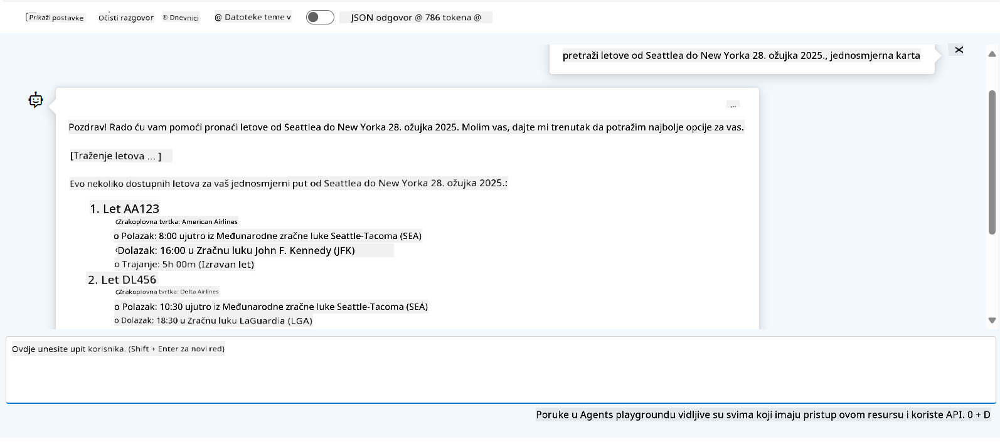

<!--
CO_OP_TRANSLATOR_METADATA:
{
  "original_hash": "7e92870dc0843e13d4dabc620c09d2d9",
  "translation_date": "2025-07-12T08:23:03+00:00",
  "source_file": "02-explore-agentic-frameworks/azure-ai-foundry-agent-creation.md",
  "language_code": "hr"
}
-->
# Azure AI Agent Service Development

U ovom zadatku koristite alate Azure AI Agent servisa u [Azure AI Foundry portalu](https://ai.azure.com/?WT.mc_id=academic-105485-koreyst) za izradu agenta za rezervaciju letova. Agent će moći komunicirati s korisnicima i pružati informacije o letovima.

## Preduvjeti

Za dovršetak ovog zadatka potrebni su vam sljedeći uvjeti:
1. Azure račun s aktivnom pretplatom. [Izradite račun besplatno](https://azure.microsoft.com/free/?WT.mc_id=academic-105485-koreyst).
2. Potrebne su vam dozvole za kreiranje Azure AI Foundry hub-a ili da vam netko kreira jedan.
    - Ako vam je uloga Contributor ili Owner, možete slijediti korake u ovom vodiču.

## Kreiranje Azure AI Foundry hub-a

> **Note:** Azure AI Foundry je ranije bio poznat kao Azure AI Studio.

1. Slijedite upute iz [Azure AI Foundry](https://learn.microsoft.com/en-us/azure/ai-studio/?WT.mc_id=academic-105485-koreyst) blog posta za kreiranje Azure AI Foundry hub-a.
2. Kada je vaš projekt kreiran, zatvorite sve prikazane savjete i pregledajte stranicu projekta u Azure AI Foundry portalu, koja bi trebala izgledati slično kao na slici ispod:

    

## Postavljanje modela

1. U lijevom izborniku vašeg projekta, u odjeljku **My assets**, odaberite stranicu **Models + endpoints**.
2. Na stranici **Models + endpoints**, u kartici **Model deployments**, u izborniku **+ Deploy model**, odaberite **Deploy base model**.
3. Potražite model `gpt-4o-mini` na popisu, zatim ga odaberite i potvrdite.

    > **Note**: Smanjenje TPM pomaže izbjeći prekomjernu potrošnju kvote dostupne u pretplati koju koristite.

    

## Kreiranje agenta

Sada kada ste postavili model, možete kreirati agenta. Agent je konverzacijski AI model koji se koristi za interakciju s korisnicima.

1. U lijevom izborniku vašeg projekta, u odjeljku **Build & Customize**, odaberite stranicu **Agents**.
2. Kliknite **+ Create agent** za kreiranje novog agenta. U dijaloškom okviru **Agent Setup**:
    - Unesite ime agenta, na primjer `FlightAgent`.
    - Provjerite je li odabrana prethodno postavljena implementacija modela `gpt-4o-mini`.
    - Postavite **Instructions** prema uputama koje želite da agent slijedi. Evo primjera:
    ```
    You are FlightAgent, a virtual assistant specialized in handling flight-related queries. Your role includes assisting users with searching for flights, retrieving flight details, checking seat availability, and providing real-time flight status. Follow the instructions below to ensure clarity and effectiveness in your responses:

    ### Task Instructions:
    1. **Recognizing Intent**:
       - Identify the user's intent based on their request, focusing on one of the following categories:
         - Searching for flights
         - Retrieving flight details using a flight ID
         - Checking seat availability for a specified flight
         - Providing real-time flight status using a flight number
       - If the intent is unclear, politely ask users to clarify or provide more details.
        
    2. **Processing Requests**:
        - Depending on the identified intent, perform the required task:
        - For flight searches: Request details such as origin, destination, departure date, and optionally return date.
        - For flight details: Request a valid flight ID.
        - For seat availability: Request the flight ID and date and validate inputs.
        - For flight status: Request a valid flight number.
        - Perform validations on provided data (e.g., formats of dates, flight numbers, or IDs). If the information is incomplete or invalid, return a friendly request for clarification.

    3. **Generating Responses**:
    - Use a tone that is friendly, concise, and supportive.
    - Provide clear and actionable suggestions based on the output of each task.
    - If no data is found or an error occurs, explain it to the user gently and offer alternative actions (e.g., refine search, try another query).
    
    ```
> [!NOTE]
> Za detaljniji prompt, možete pogledati [ovaj repozitorij](https://github.com/ShivamGoyal03/RoamMind) za dodatne informacije.
    
> Također, možete dodati **Knowledge Base** i **Actions** kako biste unaprijedili mogućnosti agenta da pruži više informacija i izvršava automatizirane zadatke na temelju korisničkih zahtjeva. Za ovaj zadatak možete preskočiti ove korake.
    


3. Za kreiranje novog multi-AI agenta, jednostavno kliknite **New Agent**. Novi agent će se zatim prikazati na stranici Agents.

## Testiranje agenta

Nakon što ste kreirali agenta, možete ga testirati kako biste vidjeli kako odgovara na korisničke upite u Azure AI Foundry portalu u playgroundu.

1. Na vrhu **Setup** panela za vašeg agenta, odaberite **Try in playground**.
2. U **Playground** panelu možete komunicirati s agentom tako da upisujete upite u chat prozor. Na primjer, možete zamoliti agenta da pronađe letove iz Seattlea za New York 28. u mjesecu.

    > **Note**: Agent možda neće dati točne odgovore jer se u ovom zadatku ne koristi stvarni vremenski podatak. Cilj je testirati sposobnost agenta da razumije i odgovori na korisničke upite na temelju danih uputa.

    

3. Nakon testiranja agenta, možete ga dodatno prilagoditi dodavanjem više namjera, podataka za treniranje i akcija kako biste poboljšali njegove mogućnosti.

## Čišćenje resursa

Kada završite s testiranjem agenta, možete ga izbrisati kako biste izbjegli dodatne troškove.
1. Otvorite [Azure portal](https://portal.azure.com) i pregledajte sadržaj resource grupe u kojoj ste postavili hub resurse korištene u ovom zadatku.
2. Na alatnoj traci odaberite **Delete resource group**.
3. Unesite ime resource grupe i potvrdite da želite izbrisati grupu.

## Resursi

- [Azure AI Foundry dokumentacija](https://learn.microsoft.com/en-us/azure/ai-studio/?WT.mc_id=academic-105485-koreyst)
- [Azure AI Foundry portal](https://ai.azure.com/?WT.mc_id=academic-105485-koreyst)
- [Uvod u Azure AI Studio](https://techcommunity.microsoft.com/blog/educatordeveloperblog/getting-started-with-azure-ai-studio/4095602?WT.mc_id=academic-105485-koreyst)
- [Osnove AI agenata na Azureu](https://learn.microsoft.com/en-us/training/modules/ai-agent-fundamentals/?WT.mc_id=academic-105485-koreyst)
- [Azure AI Discord](https://aka.ms/AzureAI/Discord)

**Odricanje od odgovornosti**:  
Ovaj dokument je preveden korištenjem AI usluge za prevođenje [Co-op Translator](https://github.com/Azure/co-op-translator). Iako težimo točnosti, imajte na umu da automatski prijevodi mogu sadržavati pogreške ili netočnosti. Izvorni dokument na izvornom jeziku treba smatrati autoritativnim izvorom. Za kritične informacije preporučuje se profesionalni ljudski prijevod. Ne snosimo odgovornost za bilo kakva nesporazume ili pogrešna tumačenja koja proizlaze iz korištenja ovog prijevoda.