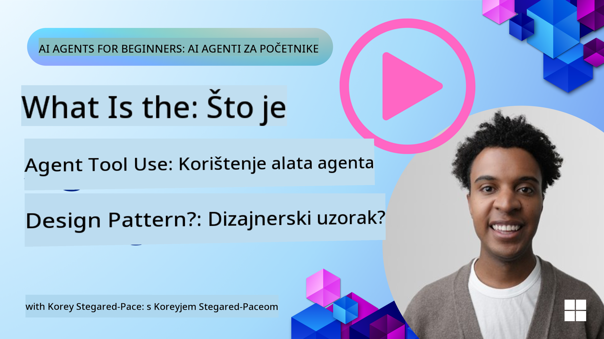
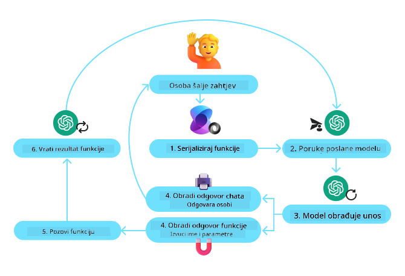
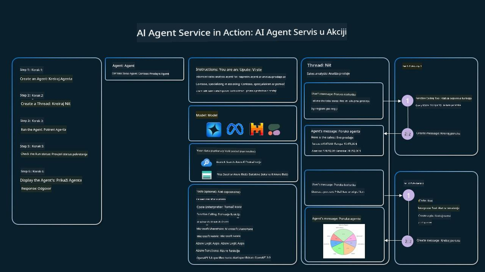

<!--
CO_OP_TRANSLATOR_METADATA:
{
  "original_hash": "88258b03f2893aa2e69eb8fb24baabbc",
  "translation_date": "2025-07-12T09:45:41+00:00",
  "source_file": "04-tool-use/README.md",
  "language_code": "hr"
}
-->
[](https://youtu.be/vieRiPRx-gI?si=cEZ8ApnT6Sus9rhn)

> _(Kliknite na gornju sliku za pregled videa ove lekcije)_

# Dizajnerski obrazac korištenja alata

Alati su zanimljivi jer omogućuju AI agentima širi spektar mogućnosti. Umjesto da agent ima ograničen skup radnji koje može izvršiti, dodavanjem alata agent sada može obavljati širok raspon radnji. U ovom poglavlju razmotrit ćemo Dizajnerski obrazac korištenja alata, koji opisuje kako AI agenti mogu koristiti specifične alate za postizanje svojih ciljeva.

## Uvod

U ovoj lekciji želimo odgovoriti na sljedeća pitanja:

- Što je dizajnerski obrazac korištenja alata?
- U kojim slučajevima se može primijeniti?
- Koji su elementi/gradivni blokovi potrebni za implementaciju ovog obrasca?
- Koje su posebne napomene pri korištenju Dizajnerskog obrasca korištenja alata za izgradnju pouzdanih AI agenata?

## Ciljevi učenja

Nakon završetka ove lekcije moći ćete:

- Definirati Dizajnerski obrazac korištenja alata i njegovu svrhu.
- Prepoznati slučajeve u kojima je ovaj obrazac primjenjiv.
- Razumjeti ključne elemente potrebne za implementaciju obrasca.
- Uočiti važne aspekte za osiguranje pouzdanosti AI agenata koji koriste ovaj obrazac.

## Što je Dizajnerski obrazac korištenja alata?

**Dizajnerski obrazac korištenja alata** usredotočen je na omogućavanje LLM-ovima da komuniciraju s vanjskim alatima kako bi postigli određene ciljeve. Alati su kod koji agent može izvršiti za obavljanje radnji. Alat može biti jednostavna funkcija poput kalkulatora ili poziv API-ja treće strane, poput provjere cijena dionica ili vremenske prognoze. U kontekstu AI agenata, alati su dizajnirani da ih agenti izvršavaju kao odgovor na **funkcijske pozive generirane modelom**.

## U kojim slučajevima se može primijeniti?

AI agenti mogu koristiti alate za dovršavanje složenih zadataka, dohvaćanje informacija ili donošenje odluka. Dizajnerski obrazac korištenja alata često se koristi u scenarijima koji zahtijevaju dinamičku interakciju s vanjskim sustavima, poput baza podataka, web servisa ili interpretatora koda. Ova sposobnost korisna je u različitim slučajevima, uključujući:

- **Dinamičko dohvaćanje informacija:** Agenti mogu upitavati vanjske API-je ili baze podataka za najnovije podatke (npr. upit SQLite baze za analizu podataka, dohvaćanje cijena dionica ili vremenskih podataka).
- **Izvršavanje i interpretacija koda:** Agenti mogu izvršavati kod ili skripte za rješavanje matematičkih problema, generiranje izvještaja ili izvođenje simulacija.
- **Automatizacija radnih tokova:** Automatizacija ponavljajućih ili višestupanjskih procesa integracijom alata poput raspoređivača zadataka, email servisa ili podatkovnih cjevovoda.
- **Korisnička podrška:** Agenti mogu komunicirati s CRM sustavima, platformama za upravljanje tiketima ili bazama znanja za rješavanje korisničkih upita.
- **Generiranje i uređivanje sadržaja:** Agenti mogu koristiti alate poput provjere gramatike, sažimanja teksta ili evaluacije sigurnosti sadržaja za pomoć u kreiranju sadržaja.

## Koji su elementi/gradivni blokovi potrebni za implementaciju dizajnerskog obrasca korištenja alata?

Ovi gradivni blokovi omogućuju AI agentu da obavlja širok spektar zadataka. Pogledajmo ključne elemente potrebne za implementaciju Dizajnerskog obrasca korištenja alata:

- **Sheme funkcija/alata**: Detaljni opisi dostupnih alata, uključujući ime funkcije, svrhu, potrebne parametre i očekivane izlaze. Ove sheme omogućuju LLM-u da razumije koji su alati dostupni i kako sastaviti valjane zahtjeve.

- **Logika izvršavanja funkcija**: Upravljanje načinom i vremenom pozivanja alata na temelju korisničke namjere i konteksta razgovora. To može uključivati module za planiranje, mehanizme usmjeravanja ili uvjetne tokove koji dinamički određuju korištenje alata.

- **Sustav upravljanja porukama**: Komponente koje upravljaju tijekovima razgovora između korisničkih unosa, odgovora LLM-a, poziva alata i njihovih rezultata.

- **Okvir za integraciju alata**: Infrastruktura koja povezuje agenta s različitim alatima, bilo da su to jednostavne funkcije ili složeni vanjski servisi.

- **Rukovanje pogreškama i validacija**: Mehanizmi za upravljanje neuspjesima u izvršavanju alata, provjeru parametara i upravljanje neočekivanim odgovorima.

- **Upravljanje stanjem**: Praćenje konteksta razgovora, prethodnih interakcija s alatima i trajnih podataka kako bi se osigurala dosljednost tijekom višekratnih interakcija.

Sljedeće ćemo detaljnije razmotriti pozivanje funkcija/alata.

### Pozivanje funkcija/alata

Pozivanje funkcija je glavni način na koji omogućujemo velikim jezičnim modelima (LLM-ovima) interakciju s alatima. Često ćete vidjeti da se 'funkcija' i 'alat' koriste naizmjenično jer su 'funkcije' (blokovi ponovo upotrebljivog koda) alati koje agenti koriste za izvršavanje zadataka. Da bi se kod funkcije pozvao, LLM mora usporediti korisnički zahtjev s opisom funkcije. Za to se šalje shema koja sadrži opise svih dostupnih funkcija LLM-u. LLM zatim odabire najprikladniju funkciju za zadatak i vraća njezino ime i argumente. Odabrana funkcija se poziva, njezin odgovor se šalje natrag LLM-u, koji koristi te informacije za odgovor korisniku.

Za programere koji žele implementirati pozivanje funkcija za agente, potrebni su:

1. LLM model koji podržava pozivanje funkcija
2. Shema koja sadrži opise funkcija
3. Kod za svaku opisanu funkciju

Koristimo primjer dobivanja trenutnog vremena u nekom gradu za ilustraciju:

1. **Inicijalizirajte LLM koji podržava pozivanje funkcija:**

    Nisu svi modeli podržavaju pozivanje funkcija, stoga je važno provjeriti podršku u modelu koji koristite. <a href="https://learn.microsoft.com/azure/ai-services/openai/how-to/function-calling" target="_blank">Azure OpenAI</a> podržava pozivanje funkcija. Možemo započeti inicijalizacijom Azure OpenAI klijenta.

    ```python
    # Initialize the Azure OpenAI client
    client = AzureOpenAI(
        azure_endpoint = os.getenv("AZURE_OPENAI_ENDPOINT"), 
        api_key=os.getenv("AZURE_OPENAI_API_KEY"),  
        api_version="2024-05-01-preview"
    )
    ```

1. **Kreirajte shemu funkcije:**

    Zatim definiramo JSON shemu koja sadrži ime funkcije, opis što funkcija radi te imena i opise parametara funkcije. Tu shemu prosljeđujemo klijentu zajedno s korisničkim zahtjevom za pronalaskom vremena u San Franciscu. Važno je napomenuti da se vraća **poziv alata**, a **ne** konačni odgovor na pitanje. Kao što je ranije spomenuto, LLM vraća ime funkcije koju je odabrao za zadatak i argumente koji će joj biti proslijeđeni.

    ```python
    # Function description for the model to read
    tools = [
        {
            "type": "function",
            "function": {
                "name": "get_current_time",
                "description": "Get the current time in a given location",
                "parameters": {
                    "type": "object",
                    "properties": {
                        "location": {
                            "type": "string",
                            "description": "The city name, e.g. San Francisco",
                        },
                    },
                    "required": ["location"],
                },
            }
        }
    ]
    ```
   
    ```python
  
    # Initial user message
    messages = [{"role": "user", "content": "What's the current time in San Francisco"}] 
  
    # First API call: Ask the model to use the function
      response = client.chat.completions.create(
          model=deployment_name,
          messages=messages,
          tools=tools,
          tool_choice="auto",
      )
  
      # Process the model's response
      response_message = response.choices[0].message
      messages.append(response_message)
  
      print("Model's response:")  

      print(response_message)
  
    ```

    ```bash
    Model's response:
    ChatCompletionMessage(content=None, role='assistant', function_call=None, tool_calls=[ChatCompletionMessageToolCall(id='call_pOsKdUlqvdyttYB67MOj434b', function=Function(arguments='{"location":"San Francisco"}', name='get_current_time'), type='function')])
    ```
  
1. **Kod funkcije potreban za izvršenje zadatka:**

    Nakon što je LLM odabrao funkciju koja se treba pokrenuti, potrebno je implementirati i izvršiti kod koji obavlja zadatak. Kod za dobivanje trenutnog vremena možemo napisati u Pythonu. Također ćemo napisati kod za izdvajanje imena funkcije i argumenata iz response_message kako bismo dobili konačni rezultat.

    ```python
      def get_current_time(location):
        """Get the current time for a given location"""
        print(f"get_current_time called with location: {location}")  
        location_lower = location.lower()
        
        for key, timezone in TIMEZONE_DATA.items():
            if key in location_lower:
                print(f"Timezone found for {key}")  
                current_time = datetime.now(ZoneInfo(timezone)).strftime("%I:%M %p")
                return json.dumps({
                    "location": location,
                    "current_time": current_time
                })
      
        print(f"No timezone data found for {location_lower}")  
        return json.dumps({"location": location, "current_time": "unknown"})
    ```

    ```python
     # Handle function calls
      if response_message.tool_calls:
          for tool_call in response_message.tool_calls:
              if tool_call.function.name == "get_current_time":
     
                  function_args = json.loads(tool_call.function.arguments)
     
                  time_response = get_current_time(
                      location=function_args.get("location")
                  )
     
                  messages.append({
                      "tool_call_id": tool_call.id,
                      "role": "tool",
                      "name": "get_current_time",
                      "content": time_response,
                  })
      else:
          print("No tool calls were made by the model.")  
  
      # Second API call: Get the final response from the model
      final_response = client.chat.completions.create(
          model=deployment_name,
          messages=messages,
      )
  
      return final_response.choices[0].message.content
     ```

    ```bash
      get_current_time called with location: San Francisco
      Timezone found for san francisco
      The current time in San Francisco is 09:24 AM.
     ```

Pozivanje funkcija je srž većine, ako ne i svih, dizajna korištenja alata u agentima, no implementacija od nule ponekad može biti izazovna. Kao što smo naučili u [Lekciji 2](../../../02-explore-agentic-frameworks), agentni okviri pružaju nam gotove gradivne blokove za implementaciju korištenja alata.

## Primjeri korištenja alata s agentnim okvirima

Evo nekoliko primjera kako možete implementirati Dizajnerski obrazac korištenja alata koristeći različite agentne okvire:

### Semantic Kernel

<a href="https://learn.microsoft.com/azure/ai-services/agents/overview" target="_blank">Semantic Kernel</a> je open-source AI okvir za .NET, Python i Java programere koji rade s velikim jezičnim modelima (LLM). Pojednostavljuje proces korištenja pozivanja funkcija automatskim opisivanjem vaših funkcija i njihovih parametara modelu kroz proces nazvan <a href="https://learn.microsoft.com/semantic-kernel/concepts/ai-services/chat-completion/function-calling/?pivots=programming-language-python#1-serializing-the-functions" target="_blank">serijalizacija</a>. Također upravlja dvosmjernom komunikacijom između modela i vašeg koda. Još jedna prednost korištenja agentnog okvira poput Semantic Kernel je pristup gotovim alatima poput <a href="https://github.com/microsoft/semantic-kernel/blob/main/python/samples/getting_started_with_agents/openai_assistant/step4_assistant_tool_file_search.py" target="_blank">Pretraživanje datoteka</a> i <a href="https://github.com/microsoft/semantic-kernel/blob/main/python/samples/getting_started_with_agents/openai_assistant/step3_assistant_tool_code_interpreter.py" target="_blank">Interpretator koda</a>.

Sljedeća shema ilustrira proces pozivanja funkcija s Semantic Kernel:



U Semantic Kernel funkcije/alati se nazivaju <a href="https://learn.microsoft.com/semantic-kernel/concepts/plugins/?pivots=programming-language-python" target="_blank">Dodaci (Plugins)</a>. Funkciju `get_current_time` koju smo ranije vidjeli možemo pretvoriti u dodatak tako da je stavimo u klasu. Također možemo uvesti dekorator `kernel_function` koji prima opis funkcije. Kada zatim kreirate kernel s GetCurrentTimePlugin, kernel će automatski serijalizirati funkciju i njezine parametre, stvarajući shemu za slanje LLM-u.

```python
from semantic_kernel.functions import kernel_function

class GetCurrentTimePlugin:
    async def __init__(self, location):
        self.location = location

    @kernel_function(
        description="Get the current time for a given location"
    )
    def get_current_time(location: str = ""):
        ...

```

```python 
from semantic_kernel import Kernel

# Create the kernel
kernel = Kernel()

# Create the plugin
get_current_time_plugin = GetCurrentTimePlugin(location)

# Add the plugin to the kernel
kernel.add_plugin(get_current_time_plugin)
```
  
### Azure AI Agent Service

<a href="https://learn.microsoft.com/azure/ai-services/agents/overview" target="_blank">Azure AI Agent Service</a> je noviji agentni okvir dizajniran da programerima omogući sigurno izgradnju, implementaciju i skaliranje visokokvalitetnih i proširivih AI agenata bez potrebe za upravljanjem osnovnim računalnim i skladišnim resursima. Posebno je koristan za poslovne aplikacije jer je potpuno upravljana usluga s sigurnošću na razini poduzeća.

U usporedbi s razvojem direktno preko LLM API-ja, Azure AI Agent Service nudi neke prednosti, uključujući:

- Automatsko pozivanje alata – nema potrebe za parsiranjem poziva alata, pozivanjem alata i upravljanjem odgovorom; sve se to sada odvija na strani servera
- Sigurno upravljanje podacima – umjesto upravljanja vlastitim stanjem razgovora, možete se osloniti na threads koji pohranjuju sve potrebne informacije
- Alati spremni za upotrebu – alati za interakciju s vašim izvorima podataka, poput Binga, Azure AI Search i Azure Functions.

Alati dostupni u Azure AI Agent Service mogu se podijeliti u dvije kategorije:

1. Alati za znanje:
    - <a href="https://learn.microsoft.com/azure/ai-services/agents/how-to/tools/bing-grounding?tabs=python&pivots=overview" target="_blank">Povezivanje s Bing pretraživanjem</a>
    - <a href="https://learn.microsoft.com/azure/ai-services/agents/how-to/tools/file-search?tabs=python&pivots=overview" target="_blank">Pretraživanje datoteka</a>
    - <a href="https://learn.microsoft.com/azure/ai-services/agents/how-to/tools/azure-ai-search?tabs=azurecli%2Cpython&pivots=overview-azure-ai-search" target="_blank">Azure AI Search</a>

2. Alati za akcije:
    - <a href="https://learn.microsoft.com/azure/ai-services/agents/how-to/tools/function-calling?tabs=python&pivots=overview" target="_blank">Pozivanje funkcija</a>
    - <a href="https://learn.microsoft.com/azure/ai-services/agents/how-to/tools/code-interpreter?tabs=python&pivots=overview" target="_blank">Interpretator koda</a>
    - <a href="https://learn.microsoft.com/azure/ai-services/agents/how-to/tools/openapi-spec?tabs=python&pivots=overview" target="_blank">Alati definirani od strane OpenAI</a>
    - <a href="https://learn.microsoft.com/azure/ai-services/agents/how-to/tools/azure-functions?pivots=overview" target="_blank">Azure Functions</a>

Agent Service nam omogućuje korištenje ovih alata zajedno kao `toolset`. Također koristi `threads` koji prate povijest poruka iz određenog razgovora.

Zamislite da ste prodajni agent u tvrtki Contoso. Želite razviti konverzacijski agent koji može odgovarati na pitanja o vašim prodajnim podacima.

Slika ispod ilustrira kako biste mogli koristiti Azure AI Agent Service za analizu vaših prodajnih podataka:



Za korištenje bilo kojeg od ovih alata s uslugom možemo kreirati klijenta i definirati alat ili skup alata. Za praktičnu implementaciju možemo koristiti sljedeći Python kod. LLM će moći pogledati toolset i odlučiti hoće li koristiti korisnički definiranu funkciju `fetch_sales_data_using_sqlite_query` ili ugrađeni Interpretator koda, ovisno o korisničkom zahtjevu.

```python 
import os
from azure.ai.projects import AIProjectClient
from azure.identity import DefaultAzureCredential
from fecth_sales_data_functions import fetch_sales_data_using_sqlite_query # fetch_sales_data_using_sqlite_query function which can be found in a fetch_sales_data_functions.py file.
from azure.ai.projects.models import ToolSet, FunctionTool, CodeInterpreterTool

project_client = AIProjectClient.from_connection_string(
    credential=DefaultAzureCredential(),
    conn_str=os.environ["PROJECT_CONNECTION_STRING"],
)

# Initialize function calling agent with the fetch_sales_data_using_sqlite_query function and adding it to the toolset
fetch_data_function = FunctionTool(fetch_sales_data_using_sqlite_query)
toolset = ToolSet()
toolset.add(fetch_data_function)

# Initialize Code Interpreter tool and adding it to the toolset. 
code_interpreter = code_interpreter = CodeInterpreterTool()
toolset = ToolSet()
toolset.add(code_interpreter)

agent = project_client.agents.create_agent(
    model="gpt-4o-mini", name="my-agent", instructions="You are helpful agent", 
    toolset=toolset
)
```

## Koje su posebne napomene pri korištenju Dizajnerskog obrasca korištenja alata za izgradnju pouzdanih AI agenata?

Česta zabrinutost kod dinamički generiranog SQL-a od strane LLM-ova je sigurnost, osobito rizik od SQL injekcija ili zlonamjernih radnji poput brisanja ili mijenjanja baze podataka. Iako su ove zabrinutosti opravdane, mogu se učinkovito ublažiti pravilnim konfiguriranjem dozvola pristupa bazi podataka. Za većinu baza to znači konfiguraciju baze kao samo za čitanje. Za baze poput PostgreSQL-a ili Azure SQL-a, aplikaciji treba dodijeliti ulogu samo za čitanje (SELECT).

Pokretanje aplikacije u sigurnom okruženju dodatno povećava zaštitu. U poslovnim scenarijima podaci se obično izvlače i transformiraju iz operativnih sustava u bazu podataka ili skladište podataka samo za čitanje s korisnički prilagođenom shemom. Ovaj pristup osigurava da su podaci sigurni, optimizirani za performanse i dostupnost, te da aplikacija ima ograničen pristup samo za čitanje.

## Dodatni resursi

-
<a href="https://microsoft.github.io/build-your-first-agent-with-azure-ai-agent-service-workshop/" target="_blank">
Azure AI Agents Service Workshop</a>
- <a href="https://github.com/Azure-Samples/contoso-creative-writer/tree/main/docs/workshop" target="_blank">Contoso Creative Writer radionica s više agenata</a>
- <a href="https://learn.microsoft.com/semantic-kernel/concepts/ai-services/chat-completion/function-calling/?pivots=programming-language-python#1-serializing-the-functions" target="_blank">Tutorial za pozivanje funkcija u Semantic Kernelu</a>
- <a href="https://github.com/microsoft/semantic-kernel/blob/main/python/samples/getting_started_with_agents/openai_assistant/step3_assistant_tool_code_interpreter.py" target="_blank">Semantic Kernel Code Interpreter</a>
- <a href="https://microsoft.github.io/autogen/dev/user-guide/core-user-guide/components/tools.html" target="_blank">Autogen alati</a>

## Prethodna lekcija

[Understanding Agentic Design Patterns](../03-agentic-design-patterns/README.md)

## Sljedeća lekcija

[Agentic RAG](../05-agentic-rag/README.md)

**Odricanje od odgovornosti**:  
Ovaj dokument je preveden korištenjem AI usluge za prevođenje [Co-op Translator](https://github.com/Azure/co-op-translator). Iako težimo točnosti, imajte na umu da automatski prijevodi mogu sadržavati pogreške ili netočnosti. Izvorni dokument na izvornom jeziku treba smatrati autoritativnim izvorom. Za kritične informacije preporučuje se profesionalni ljudski prijevod. Ne snosimo odgovornost za bilo kakva nesporazume ili pogrešna tumačenja koja proizlaze iz korištenja ovog prijevoda.