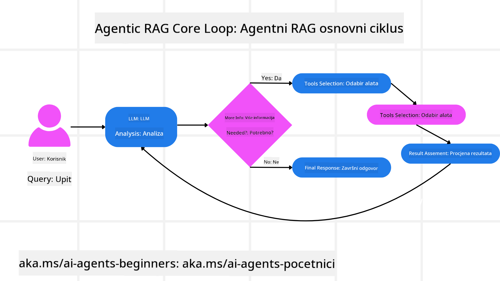
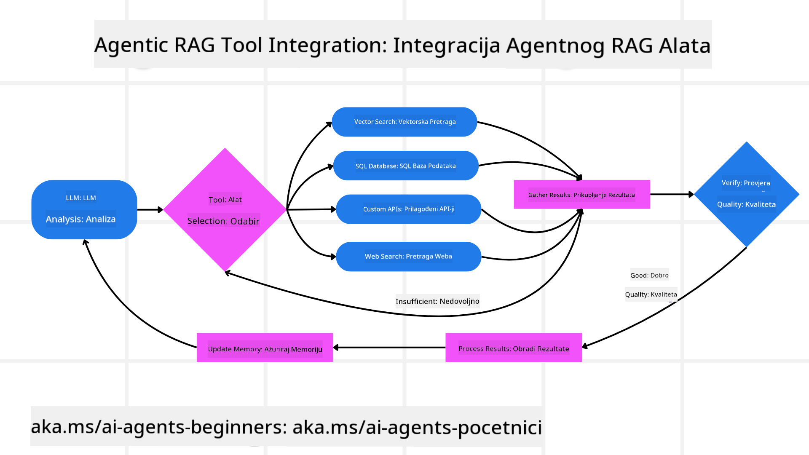
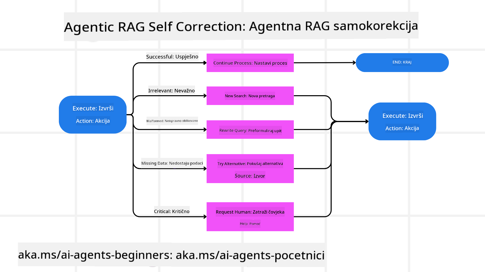
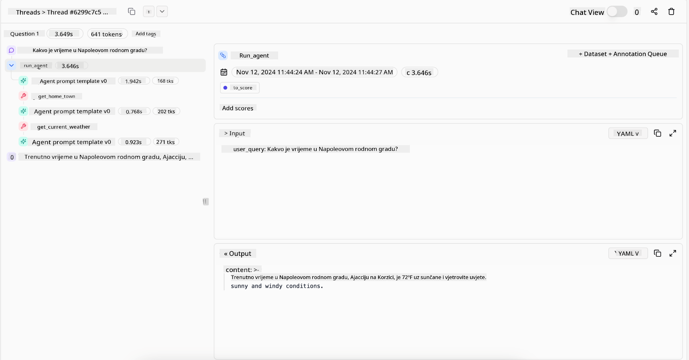
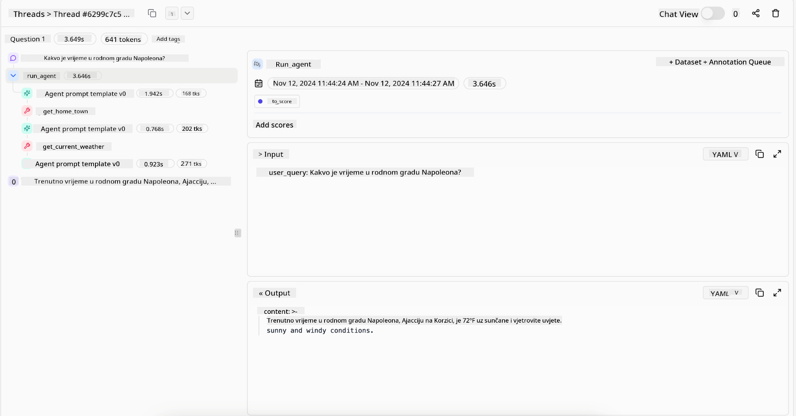

<!--
CO_OP_TRANSLATOR_METADATA:
{
  "original_hash": "7622aa72f9e676e593339f5f694ecd7d",
  "translation_date": "2025-07-12T10:14:06+00:00",
  "source_file": "05-agentic-rag/README.md",
  "language_code": "hr"
}
-->

> _(Kliknite na gornju sliku za pregled videa ove lekcije)_

# Agentic RAG

Ova lekcija pruža sveobuhvatan pregled Agentic Retrieval-Augmented Generation (Agentic RAG), novog AI paradigme u kojoj veliki jezični modeli (LLM) samostalno planiraju svoje sljedeće korake dok izvlače informacije iz vanjskih izvora. Za razliku od statičnih obrazaca dohvaćanja pa čitanja, Agentic RAG uključuje iterativne pozive LLM-u, isprekidane pozivima alata ili funkcija i strukturiranim izlazima. Sustav evaluira rezultate, usavršava upite, po potrebi poziva dodatne alate i nastavlja ovaj ciklus dok ne postigne zadovoljavajuće rješenje.

## Uvod

Ova lekcija će obuhvatiti

- **Razumijevanje Agentic RAG:** Naučite o novoj paradigmi u AI-u gdje veliki jezični modeli (LLM) samostalno planiraju svoje sljedeće korake dok izvlače informacije iz vanjskih izvora podataka.
- **Shvaćanje iterativnog Maker-Checker stila:** Razumite petlju iterativnih poziva LLM-u, isprekidanih pozivima alata ili funkcija i strukturiranim izlazima, dizajniranu za poboljšanje točnosti i rukovanje neispravnim upitima.
- **Istraživanje praktičnih primjena:** Prepoznajte situacije u kojima Agentic RAG dolazi do izražaja, poput okruženja gdje je točnost na prvom mjestu, složenih interakcija s bazama podataka i produženih radnih tokova.

## Ciljevi učenja

Nakon završetka ove lekcije, znat ćete kako/razumjeti:

- **Razumijevanje Agentic RAG:** Naučiti o novoj paradigmi u AI-u gdje veliki jezični modeli (LLM) samostalno planiraju svoje sljedeće korake dok izvlače informacije iz vanjskih izvora podataka.
- **Iterativni Maker-Checker stil:** Shvatiti koncept petlje iterativnih poziva LLM-u, isprekidanih pozivima alata ili funkcija i strukturiranim izlazima, dizajniran za poboljšanje točnosti i rukovanje neispravnim upitima.
- **Preuzimanje kontrole nad procesom rezoniranja:** Razumjeti sposobnost sustava da preuzme kontrolu nad svojim procesom rezoniranja, donoseći odluke o pristupu problemima bez oslanjanja na unaprijed definirane putanje.
- **Radni tok:** Razumjeti kako agentni model samostalno odlučuje dohvatiti izvještaje o tržišnim trendovima, identificirati podatke o konkurenciji, povezati interne prodajne metrike, sintetizirati nalaze i evaluirati strategiju.
- **Iterativne petlje, integracija alata i memorija:** Naučiti o oslanjanju sustava na obrazac interakcije u petlji, održavajući stanje i memoriju kroz korake kako bi se izbjegle ponavljajuće petlje i donosile informirane odluke.
- **Rukovanje načinima neuspjeha i samopopravak:** Istražiti robusne mehanizme samopopravka sustava, uključujući iteriranje i ponovni upit, korištenje dijagnostičkih alata i oslanjanje na ljudski nadzor.
- **Granice agencije:** Razumjeti ograničenja Agentic RAG-a, fokusirajući se na autonomiju specifičnu za domenu, ovisnost o infrastrukturi i poštivanje sigurnosnih ograda.
- **Praktične primjene i vrijednost:** Prepoznati situacije u kojima Agentic RAG dolazi do izražaja, poput okruženja gdje je točnost na prvom mjestu, složenih interakcija s bazama podataka i produženih radnih tokova.
- **Upravljanje, transparentnost i povjerenje:** Naučiti o važnosti upravljanja i transparentnosti, uključujući objašnjivo rezoniranje, kontrolu pristranosti i ljudski nadzor.

## Što je Agentic RAG?

Agentic Retrieval-Augmented Generation (Agentic RAG) je nova AI paradigma u kojoj veliki jezični modeli (LLM) samostalno planiraju svoje sljedeće korake dok izvlače informacije iz vanjskih izvora. Za razliku od statičnih obrazaca dohvaćanja pa čitanja, Agentic RAG uključuje iterativne pozive LLM-u, isprekidane pozivima alata ili funkcija i strukturiranim izlazima. Sustav evaluira rezultate, usavršava upite, po potrebi poziva dodatne alate i nastavlja ovaj ciklus dok ne postigne zadovoljavajuće rješenje. Ovaj iterativni “maker-checker” stil poboljšava točnost, rukuje neispravnim upitima i osigurava visokokvalitetne rezultate.

Sustav aktivno preuzima kontrolu nad svojim procesom rezoniranja, prepisujući neuspjele upite, birajući različite metode dohvaćanja i integrirajući više alata—poput vektorskog pretraživanja u Azure AI Search, SQL baza podataka ili prilagođenih API-ja—prije nego što finalizira svoj odgovor. Ono što razlikuje agentni sustav jest njegova sposobnost da preuzme kontrolu nad procesom rezoniranja. Tradicionalne RAG implementacije oslanjaju se na unaprijed definirane putanje, dok agentni sustav samostalno određuje slijed koraka na temelju kvalitete pronađenih informacija.

## Definiranje Agentic Retrieval-Augmented Generation (Agentic RAG)

Agentic Retrieval-Augmented Generation (Agentic RAG) je nova paradigma u razvoju AI-a gdje LLM-ovi ne samo da izvlače informacije iz vanjskih izvora podataka, već i samostalno planiraju svoje sljedeće korake. Za razliku od statičnih obrazaca dohvaćanja pa čitanja ili pažljivo skriptiranih nizova upita, Agentic RAG uključuje petlju iterativnih poziva LLM-u, isprekidanu pozivima alata ili funkcija i strukturiranim izlazima. Na svakom koraku sustav evaluira dobivene rezultate, odlučuje treba li usavršiti upite, po potrebi poziva dodatne alate i nastavlja ovaj ciklus dok ne postigne zadovoljavajuće rješenje.

Ovaj iterativni “maker-checker” stil rada dizajniran je za poboljšanje točnosti, rukovanje neispravnim upitima prema strukturiranim bazama podataka (npr. NL2SQL) i osiguravanje uravnoteženih, visokokvalitetnih rezultata. Umjesto da se oslanja isključivo na pažljivo izrađene lance upita, sustav aktivno preuzima kontrolu nad svojim procesom rezoniranja. Može prepisivati upite koji ne uspiju, birati različite metode dohvaćanja i integrirati više alata—poput vektorskog pretraživanja u Azure AI Search, SQL baza podataka ili prilagođenih API-ja—prije nego što finalizira odgovor. Time se uklanja potreba za previše složenim okvirima orkestracije. Umjesto toga, relativno jednostavna petlja “poziv LLM-u → korištenje alata → poziv LLM-u → …” može proizvesti sofisticirane i dobro utemeljene rezultate.

## Preuzimanje kontrole nad procesom rezoniranja

Ključna osobina koja sustav čini “agentnim” jest njegova sposobnost da preuzme kontrolu nad svojim procesom rezoniranja. Tradicionalne RAG implementacije često ovise o tome da ljudi unaprijed definiraju putanju za model: lanac razmišljanja koji određuje što i kada dohvatiti.  
No kada je sustav zaista agentan, on interno odlučuje kako pristupiti problemu. Ne izvršava samo skriptu; samostalno određuje slijed koraka na temelju kvalitete pronađenih informacija.  
Na primjer, ako se traži da kreira strategiju lansiranja proizvoda, ne oslanja se samo na upit koji detaljno opisuje cijeli istraživački i proces donošenja odluka. Umjesto toga, agentni model samostalno odlučuje:

1. Dohvatiti aktualne izvještaje o tržišnim trendovima koristeći Bing Web Grounding  
2. Identificirati relevantne podatke o konkurenciji koristeći Azure AI Search  
3. Povezati povijesne interne prodajne metrike koristeći Azure SQL Database  
4. Sintetizirati nalaze u koherentnu strategiju orkestriranu putem Azure OpenAI Service  
5. Evaluirati strategiju na nedostatke ili nedosljednosti, po potrebi pokrenuti još jedan krug dohvaćanja  

Svi ovi koraci—usavršavanje upita, odabir izvora, iteriranje dok ne bude “zadovoljan” odgovorom—odlučuju se od strane modela, a ne unaprijed skriptirani od strane čovjeka.

## Iterativne petlje, integracija alata i memorija

Agentni sustav se oslanja na obrazac interakcije u petlji:

- **Početni poziv:** Korisnički cilj (tj. korisnički upit) se prezentira LLM-u.  
- **Poziv alata:** Ako model prepozna nedostatak informacija ili nejasne upute, odabire alat ili metodu dohvaćanja—poput upita u vektorskoj bazi podataka (npr. Azure AI Search Hybrid pretraživanje nad privatnim podacima) ili strukturiranog SQL poziva—kako bi prikupio dodatni kontekst.  
- **Procjena i usavršavanje:** Nakon pregleda vraćenih podataka, model odlučuje jesu li informacije dovoljne. Ako nisu, usavršava upit, isprobava drugi alat ili prilagođava pristup.  
- **Ponavljanje dok nije zadovoljan:** Ovaj ciklus se nastavlja dok model ne procijeni da ima dovoljno jasnoće i dokaza za isporuku konačnog, dobro obrazloženog odgovora.  
- **Memorija i stanje:** Budući da sustav održava stanje i memoriju kroz korake, može se sjetiti prethodnih pokušaja i njihovih ishoda, izbjegavajući ponavljajuće petlje i donoseći informiranije odluke tijekom procesa.

S vremenom to stvara osjećaj evoluirajućeg razumijevanja, omogućujući modelu da navigira složenim, višekoracima zadacima bez potrebe za stalnom ljudskom intervencijom ili preoblikovanjem upita.

## Rukovanje načinima neuspjeha i samopopravak

Autonomija Agentic RAG-a uključuje i robusne mehanizme samopopravka. Kada sustav naiđe na mrtve točke—poput dohvaćanja irelevantnih dokumenata ili susreta s neispravnim upitima—može:

- **Iterirati i ponovno postavljati upite:** Umjesto da vraća odgovore niske vrijednosti, model pokušava nove strategije pretraživanja, prepisuje upite prema bazi podataka ili promatra alternativne skupove podataka.  
- **Koristiti dijagnostičke alate:** Sustav može pozvati dodatne funkcije dizajnirane da mu pomognu u otklanjanju pogrešaka u koracima rezoniranja ili potvrdi točnost dohvaćenih podataka. Alati poput Azure AI Tracing bit će važni za omogućavanje robusne promatranosti i nadzora.  
- **Oslanjati se na ljudski nadzor:** Za situacije visokog rizika ili ponavljajuće neuspješne scenarije, model može označiti nesigurnost i zatražiti ljudsko vodstvo. Nakon što čovjek pruži korektivnu povratnu informaciju, model može tu lekciju uključiti u daljnji rad.

Ovaj iterativni i dinamični pristup omogućuje modelu kontinuirano poboljšanje, osiguravajući da nije samo jednokratni sustav, već onaj koji uči iz svojih pogrešaka tijekom sesije.

## Granice agencije

Unatoč svojoj autonomiji unutar zadatka, Agentic RAG nije ekvivalent umjetnoj općoj inteligenciji. Njegove “agentne” sposobnosti ograničene su na alate, izvore podataka i politike koje su mu dali ljudski programeri. Ne može izumiti vlastite alate niti izaći izvan granica domene koje su postavljene. Umjesto toga, izvrsno upravlja dinamičkom orkestracijom dostupnih resursa.  
Ključne razlike u odnosu na naprednije oblike AI uključuju:

1. **Autonomija specifična za domenu:** Agentic RAG sustavi usmjereni su na postizanje korisnički definiranih ciljeva unutar poznate domene, koristeći strategije poput prepisivanja upita ili odabira alata za poboljšanje rezultata.  
2. **Ovisnost o infrastrukturi:** Sposobnosti sustava ovise o alatima i podacima koje integriraju programeri. Ne može prijeći te granice bez ljudske intervencije.  
3. **Poštivanje sigurnosnih ograda:** Etičke smjernice, pravila usklađenosti i poslovne politike ostaju vrlo važne. Sloboda agenta uvijek je ograničena sigurnosnim mjerama i mehanizmima nadzora (nadamo se).

## Praktične primjene i vrijednost

Agentic RAG dolazi do izražaja u scenarijima koji zahtijevaju iterativno usavršavanje i preciznost:

1. **Okruženja gdje je točnost na prvom mjestu:** U provjerama usklađenosti, regulatornim analizama ili pravnim istraživanjima, agentni model može višekratno potvrđivati činjenice, konzultirati više izvora i prepisivati upite dok ne proizvede temeljito provjeren odgovor.  
2. **Složene interakcije s bazama podataka:** Kod rada sa strukturiranim podacima gdje upiti često mogu ne uspjeti ili zahtijevati prilagodbu, sustav može samostalno usavršavati upite koristeći Azure SQL ili Microsoft Fabric OneLake, osiguravajući da konačni dohvat odgovara korisničkoj namjeri.  
3. **Produženi radni tokovi:** Duže sesije mogu se razvijati kako se pojavljuju nove informacije. Agentic RAG može kontinuirano uključivati nove podatke, mijenjajući strategije kako uči više o problemu.

## Upravljanje, transparentnost i povjerenje

Kako ovi sustavi postaju autonomniji u svom rezoniranju, upravljanje i transparentnost postaju ključni:

- **Objašnjivo rezoniranje:** Model može pružiti zapisnik upita koje je napravio, izvora koje je konzultirao i koraka rezoniranja koje je poduzeo da dođe do zaključka. Alati poput Azure AI Content Safety i Azure AI Tracing / GenAIOps pomažu održati transparentnost i smanjiti rizike.  
- **Kontrola pristranosti i uravnoteženo dohvaćanje:** Programeri mogu podešavati strategije dohvaćanja kako bi osigurali da se razmatraju uravnoteženi, reprezentativni izvori podataka, te redovito pregledavati rezultate kako bi otkrili pristranosti ili iskrivljene obrasce koristeći prilagođene modele za napredne podatkovne znanstvene organizacije koje koriste Azure Machine Learning.  
- **Ljudski nadzor i usklađenost:** Za osjetljive zadatke ljudska provjera ostaje ključna. Agentic RAG ne zamjenjuje ljudsku prosudbu u odlukama visokog rizika—nego je nadopunjuje pružajući temeljitije provjerene opcije.

Imati alate koji pružaju jasan zapis o radnjama je neophodno. Bez njih, otklanjanje pogrešaka u višekorakom procesu može biti vrlo teško. Pogledajte sljedeći primjer iz Literal AI (tvrtka iza Chainlit) za Agent run:

## Zaključak

Agentic RAG predstavlja prirodnu evoluciju u načinu na koji AI sustavi rješavaju složene, podatkovno intenzivne zadatke. Usvajanjem obrasca interakcije u petlji, samostalnim odabirom alata i usavršavanjem upita dok ne postigne visokokvalitetan rezultat, sustav prelazi granice statičnog praćenja upita u prilagodljivijeg, kontekstualno svjesnog donositelja odluka. Iako je još uvijek ograničen ljudski definiranim infrastrukturama i etičkim smjernicama, ove agentne sposobnosti omogućuju bogatije, dinamičnije i na kraju korisnije AI interakcije za poduzeća i krajnje korisnike.

## Dodatni resursi

- <a href="https://learn.microsoft.com/training/modules/use-own-data-azure-openai" target="_blank">Implement Retrieval Augmented Generation (RAG) with Azure OpenAI Service: Learn how to use your own data with the Azure OpenAI Service. This Microsoft Learn module provides a comprehensive guide on implementing RAG

- <a href="https://learn.microsoft.com/azure/ai-studio/concepts/evaluation-approach-gen-ai" target="_blank">Evaluacija generativnih AI aplikacija s Azure AI Foundry: Ovaj članak pokriva evaluaciju i usporedbu modela na javno dostupnim skupovima podataka, uključujući Agentic AI aplikacije i RAG arhitekture</a>
- <a href="https://weaviate.io/blog/what-is-agentic-rag" target="_blank">Što je Agentic RAG | Weaviate</a>
- <a href="https://ragaboutit.com/agentic-rag-a-complete-guide-to-agent-based-retrieval-augmented-generation/" target="_blank">Agentic RAG: Potpuni vodič za agentno baziranu generaciju s poboljšanim dohvatom – Vijesti iz generacije RAG</a>
- <a href="https://huggingface.co/learn/cookbook/agent_rag" target="_blank">Agentic RAG: ubrzajte svoj RAG s reformulacijom upita i samopropitivanjem! Hugging Face Open-Source AI Cookbook</a>
- <a href="https://youtu.be/aQ4yQXeB1Ss?si=2HUqBzHoeB5tR04U" target="_blank">Dodavanje Agentic slojeva u RAG</a>
- <a href="https://www.youtube.com/watch?v=zeAyuLc_f3Q&t=244s" target="_blank">Budućnost pomoćnika za znanje: Jerry Liu</a>
- <a href="https://www.youtube.com/watch?v=AOSjiXP1jmQ" target="_blank">Kako izgraditi Agentic RAG sustave</a>
- <a href="https://ignite.microsoft.com/sessions/BRK102?source=sessions" target="_blank">Korištenje Azure AI Foundry Agent Service za skaliranje vaših AI agenata</a>

### Akademski radovi

- <a href="https://arxiv.org/abs/2303.17651" target="_blank">2303.17651 Self-Refine: Iterativno usavršavanje s povratnom informacijom od samog sebe</a>
- <a href="https://arxiv.org/abs/2303.11366" target="_blank">2303.11366 Reflexion: Jezični agenti s verbalnim učenjem pojačanjem</a>
- <a href="https://arxiv.org/abs/2305.11738" target="_blank">2305.11738 CRITIC: Veliki jezični modeli mogu se samostalno ispravljati uz interaktivnu kritiku alata</a>
- <a href="https://arxiv.org/abs/2501.09136" target="_blank">2501.09136 Agentic Retrieval-Augmented Generation: Pregled Agentic RAG-a</a>

## Prethodna lekcija

[Tool Use Design Pattern](../04-tool-use/README.md)

## Sljedeća lekcija

[Building Trustworthy AI Agents](../06-building-trustworthy-agents/README.md)

**Odricanje od odgovornosti**:  
Ovaj dokument je preveden korištenjem AI usluge za prevođenje [Co-op Translator](https://github.com/Azure/co-op-translator). Iako težimo točnosti, imajte na umu da automatski prijevodi mogu sadržavati pogreške ili netočnosti. Izvorni dokument na izvornom jeziku treba smatrati autoritativnim izvorom. Za kritične informacije preporučuje se profesionalni ljudski prijevod. Ne snosimo odgovornost za bilo kakva nesporazume ili pogrešna tumačenja koja proizlaze iz korištenja ovog prijevoda.