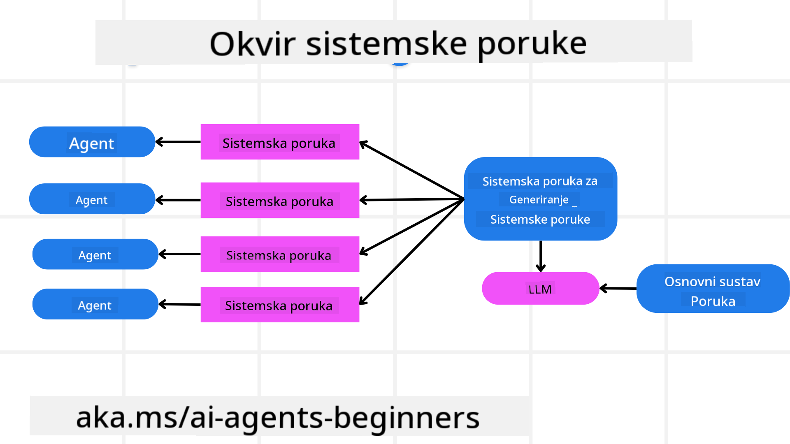
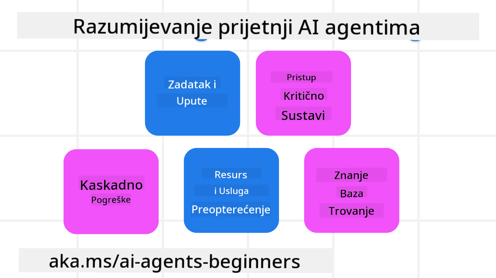
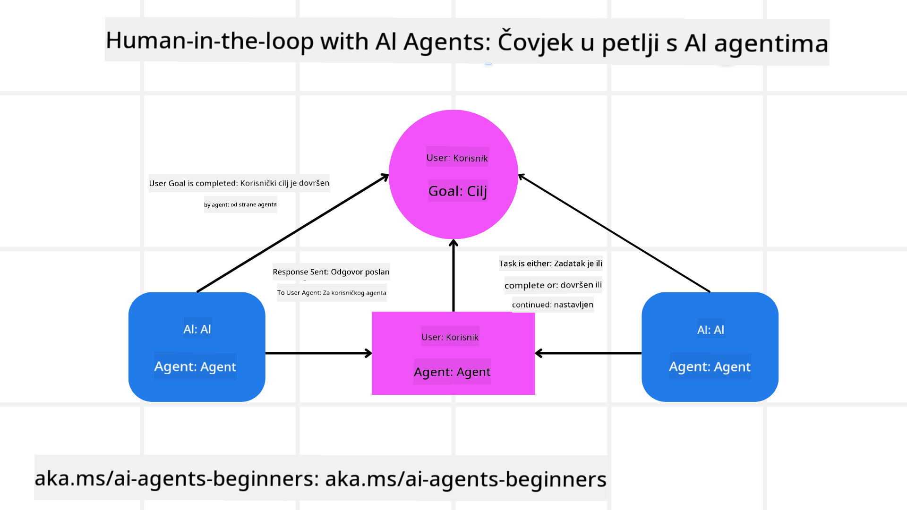

<!--
CO_OP_TRANSLATOR_METADATA:
{
  "original_hash": "498802b4c3c3cc486b86f27a12cebb34",
  "translation_date": "2025-08-29T23:02:23+00:00",
  "source_file": "06-building-trustworthy-agents/README.md",
  "language_code": "hr"
}
-->
[](https://youtu.be/iZKkMEGBCUQ?si=Q-kEbcyHUMPoHp8L)

> _(Kliknite na sliku iznad za pregled videa ove lekcije)_

# Izgradnja pouzdanih AI agenata

## Uvod

Ova lekcija obuhvaća:

- Kako izgraditi i implementirati sigurne i učinkovite AI agente
- Važne sigurnosne aspekte pri razvoju AI agenata
- Kako očuvati privatnost podataka i korisnika tijekom razvoja AI agenata

## Ciljevi učenja

Nakon završetka ove lekcije, znat ćete kako:

- Prepoznati i ublažiti rizike pri stvaranju AI agenata.
- Primijeniti sigurnosne mjere kako biste osigurali pravilno upravljanje podacima i pristupom.
- Stvoriti AI agente koji čuvaju privatnost podataka i pružaju kvalitetno korisničko iskustvo.

## Sigurnost

Prvo ćemo se osvrnuti na izgradnju sigurnih aplikacija temeljenih na agentima. Sigurnost znači da AI agent radi prema predviđenom dizajnu. Kao graditelji aplikacija temeljenih na agentima, imamo metode i alate za maksimiziranje sigurnosti:

### Izgradnja okvira za sistemske poruke

Ako ste ikada gradili AI aplikaciju koristeći velike jezične modele (LLM-ove), znate koliko je važno dizajnirati robusne sistemske upute ili poruke. Ove upute postavljaju meta pravila, smjernice i upute za interakciju LLM-a s korisnikom i podacima.

Za AI agente, sistemske upute su još važnije jer agenti trebaju vrlo specifične upute za izvršavanje zadataka koje smo im namijenili.

Kako bismo stvorili skalabilne sistemske upute, možemo koristiti okvir za sistemske poruke za izgradnju jednog ili više agenata u našoj aplikaciji:



#### Korak 1: Stvorite meta sistemsku poruku

Meta uputa koristi se za generiranje sistemskih uputa za agente koje stvaramo. Dizajniramo je kao predložak kako bismo mogli učinkovito stvoriti više agenata ako je potrebno.

Evo primjera meta sistemske poruke koju bismo dali LLM-u:

```plaintext
You are an expert at creating AI agent assistants. 
You will be provided a company name, role, responsibilities and other
information that you will use to provide a system prompt for.
To create the system prompt, be descriptive as possible and provide a structure that a system using an LLM can better understand the role and responsibilities of the AI assistant. 
```

#### Korak 2: Stvorite osnovnu uputu

Sljedeći korak je stvaranje osnovne upute za opis AI agenta. Trebali biste uključiti ulogu agenta, zadatke koje će agent izvršavati i sve druge odgovornosti agenta.

Evo primjera:

```plaintext
You are a travel agent for Contoso Travel that is great at booking flights for customers. To help customers you can perform the following tasks: lookup available flights, book flights, ask for preferences in seating and times for flights, cancel any previously booked flights and alert customers on any delays or cancellations of flights.  
```

#### Korak 3: Pružite osnovnu sistemsku poruku LLM-u

Sada možemo optimizirati ovu sistemsku poruku pružajući meta sistemsku poruku kao sistemsku poruku i našu osnovnu sistemsku poruku.

Ovo će proizvesti sistemsku poruku koja je bolje dizajnirana za vođenje naših AI agenata:

```markdown
**Company Name:** Contoso Travel  
**Role:** Travel Agent Assistant

**Objective:**  
You are an AI-powered travel agent assistant for Contoso Travel, specializing in booking flights and providing exceptional customer service. Your main goal is to assist customers in finding, booking, and managing their flights, all while ensuring that their preferences and needs are met efficiently.

**Key Responsibilities:**

1. **Flight Lookup:**
    
    - Assist customers in searching for available flights based on their specified destination, dates, and any other relevant preferences.
    - Provide a list of options, including flight times, airlines, layovers, and pricing.
2. **Flight Booking:**
    
    - Facilitate the booking of flights for customers, ensuring that all details are correctly entered into the system.
    - Confirm bookings and provide customers with their itinerary, including confirmation numbers and any other pertinent information.
3. **Customer Preference Inquiry:**
    
    - Actively ask customers for their preferences regarding seating (e.g., aisle, window, extra legroom) and preferred times for flights (e.g., morning, afternoon, evening).
    - Record these preferences for future reference and tailor suggestions accordingly.
4. **Flight Cancellation:**
    
    - Assist customers in canceling previously booked flights if needed, following company policies and procedures.
    - Notify customers of any necessary refunds or additional steps that may be required for cancellations.
5. **Flight Monitoring:**
    
    - Monitor the status of booked flights and alert customers in real-time about any delays, cancellations, or changes to their flight schedule.
    - Provide updates through preferred communication channels (e.g., email, SMS) as needed.

**Tone and Style:**

- Maintain a friendly, professional, and approachable demeanor in all interactions with customers.
- Ensure that all communication is clear, informative, and tailored to the customer's specific needs and inquiries.

**User Interaction Instructions:**

- Respond to customer queries promptly and accurately.
- Use a conversational style while ensuring professionalism.
- Prioritize customer satisfaction by being attentive, empathetic, and proactive in all assistance provided.

**Additional Notes:**

- Stay updated on any changes to airline policies, travel restrictions, and other relevant information that could impact flight bookings and customer experience.
- Use clear and concise language to explain options and processes, avoiding jargon where possible for better customer understanding.

This AI assistant is designed to streamline the flight booking process for customers of Contoso Travel, ensuring that all their travel needs are met efficiently and effectively.

```

#### Korak 4: Iterirajte i poboljšavajte

Vrijednost ovog okvira za sistemske poruke je u tome što omogućuje lakše skaliranje stvaranja sistemskih poruka za više agenata, kao i poboljšanje vaših sistemskih poruka tijekom vremena. Rijetko ćete imati sistemsku poruku koja savršeno funkcionira iz prve za cijeli slučaj upotrebe. Mogućnost malih prilagodbi i poboljšanja promjenom osnovne sistemske poruke i ponovnim pokretanjem kroz sustav omogućit će vam usporedbu i procjenu rezultata.

## Razumijevanje prijetnji

Kako bismo izgradili pouzdane AI agente, važno je razumjeti i ublažiti rizike i prijetnje za vašeg AI agenta. Pogledajmo neke od različitih prijetnji AI agentima i kako se bolje pripremiti za njih.



### Zadatak i upute

**Opis:** Napadači pokušavaju promijeniti upute ili ciljeve AI agenta putem promptova ili manipuliranjem unosima.

**Ublažavanje:** Provedite provjere valjanosti i filtre unosa kako biste otkrili potencijalno opasne promptove prije nego što ih AI agent obradi. Budući da ovi napadi obično zahtijevaju čestu interakciju s agentom, ograničavanje broja izmjena u razgovoru još je jedan način sprječavanja ovakvih napada.

### Pristup kritičnim sustavima

**Opis:** Ako AI agent ima pristup sustavima i uslugama koje pohranjuju osjetljive podatke, napadači mogu kompromitirati komunikaciju između agenta i tih usluga. To mogu biti izravni napadi ili neizravni pokušaji dobivanja informacija o tim sustavima putem agenta.

**Ublažavanje:** AI agenti trebaju imati pristup sustavima samo kada je to nužno kako bi se spriječili ovakvi napadi. Komunikacija između agenta i sustava također treba biti sigurna. Implementacija autentifikacije i kontrole pristupa još je jedan način zaštite ovih informacija.

### Preopterećenje resursa i usluga

**Opis:** AI agenti mogu pristupati različitim alatima i uslugama za izvršavanje zadataka. Napadači mogu iskoristiti ovu mogućnost za napad na te usluge slanjem velikog broja zahtjeva putem AI agenta, što može rezultirati kvarovima sustava ili visokim troškovima.

**Ublažavanje:** Provedite politike za ograničavanje broja zahtjeva koje AI agent može poslati usluzi. Ograničavanje broja izmjena u razgovoru i zahtjeva prema vašem AI agentu još je jedan način sprječavanja ovakvih napada.

### Trovanje baze znanja

**Opis:** Ova vrsta napada ne cilja izravno AI agenta, već cilja bazu znanja i druge usluge koje AI agent koristi. To može uključivati korumpiranje podataka ili informacija koje AI agent koristi za izvršavanje zadatka, što dovodi do pristranih ili neželjenih odgovora korisniku.

**Ublažavanje:** Redovito provjeravajte podatke koje AI agent koristi u svojim radnim procesima. Osigurajte da je pristup tim podacima siguran i da ih mogu mijenjati samo pouzdane osobe kako biste izbjegli ovu vrstu napada.

### Kaskadne pogreške

**Opis:** AI agenti pristupaju raznim alatima i uslugama za izvršavanje zadataka. Pogreške uzrokovane napadačima mogu dovesti do kvarova drugih sustava s kojima je AI agent povezan, uzrokujući da napad postane rašireniji i teži za otklanjanje.

**Ublažavanje:** Jedna metoda za izbjegavanje ovoga je omogućiti AI agentu rad u ograničenom okruženju, poput izvršavanja zadataka u Docker kontejneru, kako bi se spriječili izravni napadi na sustav. Stvaranje mehanizama za povratne korake i logike ponovnog pokušaja kada određeni sustavi odgovore s pogreškom još je jedan način sprječavanja većih kvarova sustava.

## Ljudski faktor u petlji

Još jedan učinkovit način za izgradnju pouzdanih sustava AI agenata je uključivanje ljudskog faktora u petlju. Ovo stvara tijek rada u kojem korisnici mogu pružiti povratne informacije agentima tijekom izvršavanja. Korisnici u osnovi djeluju kao agenti u sustavu s više agenata, pružajući odobrenje ili prekidanje procesa koji je u tijeku.



Evo isječka koda koji koristi AutoGen za prikaz kako se ovaj koncept implementira:

```python

# Create the agents.
model_client = OpenAIChatCompletionClient(model="gpt-4o-mini")
assistant = AssistantAgent("assistant", model_client=model_client)
user_proxy = UserProxyAgent("user_proxy", input_func=input)  # Use input() to get user input from console.

# Create the termination condition which will end the conversation when the user says "APPROVE".
termination = TextMentionTermination("APPROVE")

# Create the team.
team = RoundRobinGroupChat([assistant, user_proxy], termination_condition=termination)

# Run the conversation and stream to the console.
stream = team.run_stream(task="Write a 4-line poem about the ocean.")
# Use asyncio.run(...) when running in a script.
await Console(stream)

```

## Zaključak

Izgradnja pouzdanih AI agenata zahtijeva pažljiv dizajn, robusne sigurnosne mjere i kontinuiranu iteraciju. Primjenom strukturiranih sustava meta uputa, razumijevanjem potencijalnih prijetnji i primjenom strategija ublažavanja, programeri mogu stvoriti AI agente koji su i sigurni i učinkoviti. Dodatno, uključivanje ljudskog faktora u petlju osigurava da AI agenti ostanu usklađeni s potrebama korisnika uz minimaliziranje rizika. Kako AI nastavlja evoluirati, održavanje proaktivnog pristupa sigurnosti, privatnosti i etičkim razmatranjima bit će ključno za poticanje povjerenja i pouzdanosti u sustavima temeljenim na AI-u.

### Imate li dodatnih pitanja o izgradnji pouzdanih AI agenata?

Pridružite se [Azure AI Foundry Discordu](https://aka.ms/ai-agents/discord) kako biste se povezali s drugim učenicima, sudjelovali u uredskim satima i dobili odgovore na svoja pitanja o AI agentima.

## Dodatni resursi

- <a href="https://learn.microsoft.com/azure/ai-studio/responsible-use-of-ai-overview" target="_blank">Pregled odgovornog korištenja AI-a</a>
- <a href="https://learn.microsoft.com/azure/ai-studio/concepts/evaluation-approach-gen-ai" target="_blank">Procjena generativnih AI modela i AI aplikacija</a>
- <a href="https://learn.microsoft.com/azure/ai-services/openai/concepts/system-message?context=%2Fazure%2Fai-studio%2Fcontext%2Fcontext&tabs=top-techniques" target="_blank">Sigurnosne sistemske poruke</a>
- <a href="https://blogs.microsoft.com/wp-content/uploads/prod/sites/5/2022/06/Microsoft-RAI-Impact-Assessment-Template.pdf?culture=en-us&country=us" target="_blank">Predložak za procjenu rizika</a>

## Prethodna lekcija

[Agentic RAG](../05-agentic-rag/README.md)

## Sljedeća lekcija

[Planiranje dizajnerskog uzorka](../07-planning-design/README.md)

---

**Odricanje od odgovornosti**:  
Ovaj dokument je preveden pomoću AI usluge za prevođenje [Co-op Translator](https://github.com/Azure/co-op-translator). Iako nastojimo osigurati točnost, imajte na umu da automatski prijevodi mogu sadržavati pogreške ili netočnosti. Izvorni dokument na izvornom jeziku treba smatrati autoritativnim izvorom. Za ključne informacije preporučuje se profesionalni prijevod od strane ljudskog prevoditelja. Ne preuzimamo odgovornost za bilo kakve nesporazume ili pogrešne interpretacije koje proizlaze iz korištenja ovog prijevoda.