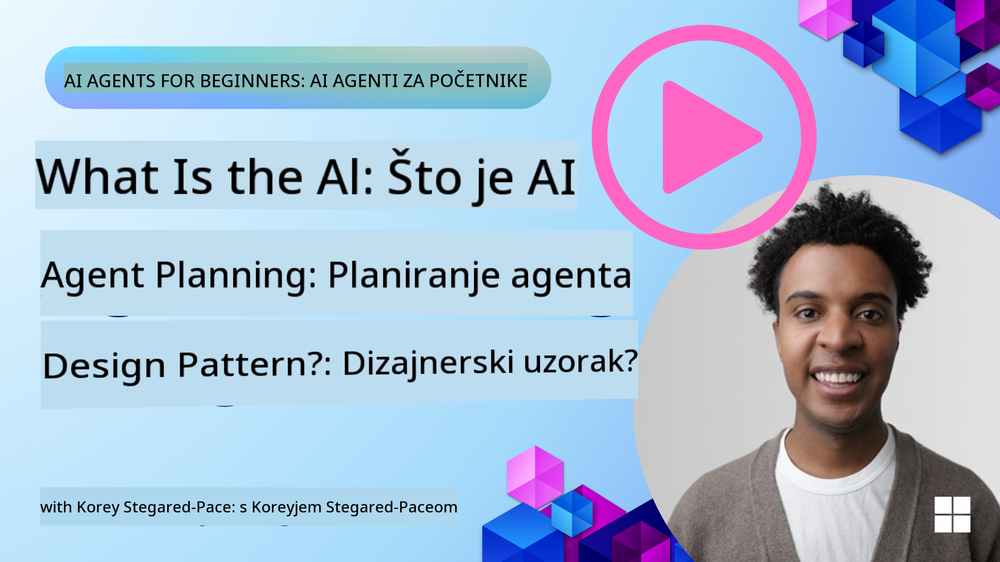
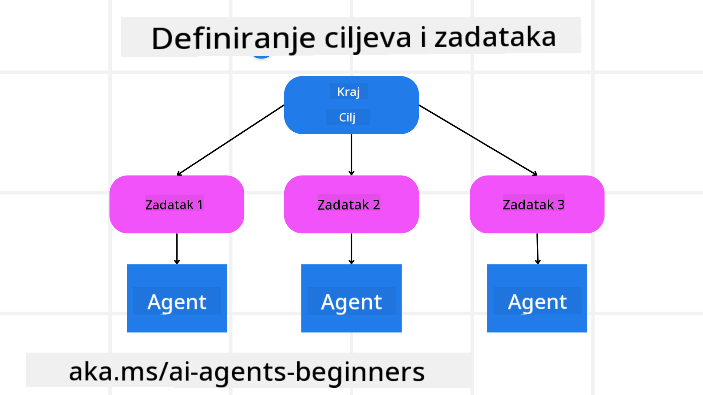

<!--
CO_OP_TRANSLATOR_METADATA:
{
  "original_hash": "a28d30590704ea13b6a08d4793cf9c2b",
  "translation_date": "2025-08-29T23:07:04+00:00",
  "source_file": "07-planning-design/README.md",
  "language_code": "hr"
}
-->
[](https://youtu.be/kPfJ2BrBCMY?si=9pYpPXp0sSbK91Dr)

> _(Kliknite na sliku iznad za video lekcije)_

# Planiranje dizajna

## Uvod

Ova lekcija pokriva:

* Definiranje jasnog ukupnog cilja i razbijanje složenog zadatka na upravljive dijelove.
* Korištenje strukturiranog izlaza za pouzdanije i strojno čitljive odgovore.
* Primjena pristupa temeljenog na događajima za upravljanje dinamičnim zadacima i neočekivanim unosima.

## Ciljevi učenja

Nakon završetka ove lekcije, razumjet ćete:

* Kako identificirati i postaviti ukupni cilj za AI agenta, osiguravajući da jasno zna što treba postići.
* Kako razložiti složen zadatak na upravljive podzadatke i organizirati ih u logičan slijed.
* Kako opremiti agente pravim alatima (npr. alatima za pretraživanje ili analizu podataka), odlučiti kada i kako ih koristiti te upravljati neočekivanim situacijama.
* Kako procijeniti rezultate podzadatka, mjeriti izvedbu i iterirati radnje za poboljšanje konačnog rezultata.

## Definiranje ukupnog cilja i razbijanje zadatka



Većina zadataka iz stvarnog svijeta previše je složena da bi se riješila u jednom koraku. AI agentu je potreban sažet cilj koji će voditi njegovo planiranje i radnje. Na primjer, razmotrite cilj:

    "Generiraj trodnevni plan putovanja."

Iako je jednostavno naveden, još uvijek zahtijeva doradu. Što je cilj jasniji, to bolje agent (i ljudski suradnici) mogu usmjeriti svoje napore na postizanje pravog rezultata, poput stvaranja sveobuhvatnog plana s opcijama za letove, preporukama za hotele i prijedlozima aktivnosti.

### Razlaganje zadatka

Veliki ili složeni zadaci postaju upravljiviji kada se podijele na manje, ciljno orijentirane podzadatke. 
Za primjer plana putovanja, cilj možete razložiti na:

* Rezervacija leta
* Rezervacija hotela
* Najam automobila
* Personalizacija

Svaki podzadatak može se obraditi od strane posvećenih agenata ili procesa. Jedan agent može se specijalizirati za traženje najboljih ponuda za letove, drugi za rezervaciju hotela i tako dalje. Koordinirajući ili "nizvodni" agent može zatim objediniti ove rezultate u jedan kohezivan plan za krajnjeg korisnika.

Ovaj modularni pristup također omogućuje postupna poboljšanja. Na primjer, možete dodati specijalizirane agente za preporuke hrane ili lokalne aktivnosti i s vremenom usavršavati plan.

### Strukturirani izlaz

Veliki jezični modeli (LLM-ovi) mogu generirati strukturirani izlaz (npr. JSON) koji je lakše parsirati i obraditi od strane nizvodnih agenata ili usluga. Ovo je posebno korisno u kontekstu više agenata, gdje se zadaci mogu izvršiti nakon što se primi izlaz planiranja. Pogledajte ovo za brzi pregled.

Sljedeći Python isječak demonstrira jednostavan planerski agent koji razlaže cilj na podzadatke i generira strukturirani plan:

```python
from pydantic import BaseModel
from enum import Enum
from typing import List, Optional, Union
import json
import os
from typing import Optional
from pprint import pprint
from autogen_core.models import UserMessage, SystemMessage, AssistantMessage
from autogen_ext.models.azure import AzureAIChatCompletionClient
from azure.core.credentials import AzureKeyCredential

class AgentEnum(str, Enum):
    FlightBooking = "flight_booking"
    HotelBooking = "hotel_booking"
    CarRental = "car_rental"
    ActivitiesBooking = "activities_booking"
    DestinationInfo = "destination_info"
    DefaultAgent = "default_agent"
    GroupChatManager = "group_chat_manager"

# Travel SubTask Model
class TravelSubTask(BaseModel):
    task_details: str
    assigned_agent: AgentEnum  # we want to assign the task to the agent

class TravelPlan(BaseModel):
    main_task: str
    subtasks: List[TravelSubTask]
    is_greeting: bool

client = AzureAIChatCompletionClient(
    model="gpt-4o-mini",
    endpoint="https://models.inference.ai.azure.com",
    # To authenticate with the model you will need to generate a personal access token (PAT) in your GitHub settings.
    # Create your PAT token by following instructions here: https://docs.github.com/en/authentication/keeping-your-account-and-data-secure/managing-your-personal-access-tokens
    credential=AzureKeyCredential(os.environ["GITHUB_TOKEN"]),
    model_info={
        "json_output": False,
        "function_calling": True,
        "vision": True,
        "family": "unknown",
    },
)

# Define the user message
messages = [
    SystemMessage(content="""You are an planner agent.
    Your job is to decide which agents to run based on the user's request.
                      Provide your response in JSON format with the following structure:
{'main_task': 'Plan a family trip from Singapore to Melbourne.',
 'subtasks': [{'assigned_agent': 'flight_booking',
               'task_details': 'Book round-trip flights from Singapore to '
                               'Melbourne.'}
    Below are the available agents specialised in different tasks:
    - FlightBooking: For booking flights and providing flight information
    - HotelBooking: For booking hotels and providing hotel information
    - CarRental: For booking cars and providing car rental information
    - ActivitiesBooking: For booking activities and providing activity information
    - DestinationInfo: For providing information about destinations
    - DefaultAgent: For handling general requests""", source="system"),
    UserMessage(
        content="Create a travel plan for a family of 2 kids from Singapore to Melboune", source="user"),
]

response = await client.create(messages=messages, extra_create_args={"response_format": 'json_object'})

response_content: Optional[str] = response.content if isinstance(
    response.content, str) else None
if response_content is None:
    raise ValueError("Response content is not a valid JSON string" )

pprint(json.loads(response_content))

# # Ensure the response content is a valid JSON string before loading it
# response_content: Optional[str] = response.content if isinstance(
#     response.content, str) else None
# if response_content is None:
#     raise ValueError("Response content is not a valid JSON string")

# # Print the response content after loading it as JSON
# pprint(json.loads(response_content))

# Validate the response content with the MathReasoning model
# TravelPlan.model_validate(json.loads(response_content))
```

### Planerski agent s orkestracijom više agenata

U ovom primjeru, Semantički Router Agent prima korisnički zahtjev (npr. "Treba mi plan hotela za moje putovanje.").

Planer zatim:

* Prima plan hotela: Planer uzima korisničku poruku i, na temelju sistemskog upita (uključujući detalje dostupnih agenata), generira strukturirani plan putovanja.
* Navodi agente i njihove alate: Registar agenata drži popis agenata (npr. za letove, hotele, najam automobila i aktivnosti) zajedno s funkcijama ili alatima koje nude.
* Usmjerava plan odgovarajućim agentima: Ovisno o broju podzadatka, planer ili šalje poruku izravno posvećenom agentu (za scenarije s jednim zadatkom) ili koordinira putem upravitelja grupnog razgovora za suradnju više agenata.
* Sažima rezultat: Na kraju, planer sažima generirani plan radi jasnoće.

Sljedeći Python uzorak koda ilustrira ove korake:

```python

from pydantic import BaseModel

from enum import Enum
from typing import List, Optional, Union

class AgentEnum(str, Enum):
    FlightBooking = "flight_booking"
    HotelBooking = "hotel_booking"
    CarRental = "car_rental"
    ActivitiesBooking = "activities_booking"
    DestinationInfo = "destination_info"
    DefaultAgent = "default_agent"
    GroupChatManager = "group_chat_manager"

# Travel SubTask Model

class TravelSubTask(BaseModel):
    task_details: str
    assigned_agent: AgentEnum # we want to assign the task to the agent

class TravelPlan(BaseModel):
    main_task: str
    subtasks: List[TravelSubTask]
    is_greeting: bool
import json
import os
from typing import Optional

from autogen_core.models import UserMessage, SystemMessage, AssistantMessage
from autogen_ext.models.openai import AzureOpenAIChatCompletionClient

# Create the client with type-checked environment variables

client = AzureOpenAIChatCompletionClient(
    azure_deployment=os.getenv("AZURE_OPENAI_DEPLOYMENT_NAME"),
    model=os.getenv("AZURE_OPENAI_DEPLOYMENT_NAME"),
    api_version=os.getenv("AZURE_OPENAI_API_VERSION"),
    azure_endpoint=os.getenv("AZURE_OPENAI_ENDPOINT"),
    api_key=os.getenv("AZURE_OPENAI_API_KEY"),
)

from pprint import pprint

# Define the user message

messages = [
    SystemMessage(content="""You are an planner agent.
    Your job is to decide which agents to run based on the user's request.
    Below are the available agents specialized in different tasks:
    - FlightBooking: For booking flights and providing flight information
    - HotelBooking: For booking hotels and providing hotel information
    - CarRental: For booking cars and providing car rental information
    - ActivitiesBooking: For booking activities and providing activity information
    - DestinationInfo: For providing information about destinations
    - DefaultAgent: For handling general requests""", source="system"),
    UserMessage(content="Create a travel plan for a family of 2 kids from Singapore to Melbourne", source="user"),
]

response = await client.create(messages=messages, extra_create_args={"response_format": TravelPlan})

# Ensure the response content is a valid JSON string before loading it

response_content: Optional[str] = response.content if isinstance(response.content, str) else None
if response_content is None:
    raise ValueError("Response content is not a valid JSON string")

# Print the response content after loading it as JSON

pprint(json.loads(response_content))
```

Slijedi izlaz iz prethodnog koda, a zatim možete koristiti ovaj strukturirani izlaz za usmjeravanje prema `assigned_agent` i sažimanje plana putovanja krajnjem korisniku.

```json
{
    "is_greeting": "False",
    "main_task": "Plan a family trip from Singapore to Melbourne.",
    "subtasks": [
        {
            "assigned_agent": "flight_booking",
            "task_details": "Book round-trip flights from Singapore to Melbourne."
        },
        {
            "assigned_agent": "hotel_booking",
            "task_details": "Find family-friendly hotels in Melbourne."
        },
        {
            "assigned_agent": "car_rental",
            "task_details": "Arrange a car rental suitable for a family of four in Melbourne."
        },
        {
            "assigned_agent": "activities_booking",
            "task_details": "List family-friendly activities in Melbourne."
        },
        {
            "assigned_agent": "destination_info",
            "task_details": "Provide information about Melbourne as a travel destination."
        }
    ]
}
```

Primjer bilježnice s prethodnim uzorkom koda dostupan je [ovdje](07-autogen.ipynb).

### Iterativno planiranje

Neki zadaci zahtijevaju povratno djelovanje ili ponovno planiranje, gdje rezultat jednog podzadatka utječe na sljedeći. Na primjer, ako agent otkrije neočekivani format podataka prilikom rezervacije letova, možda će morati prilagoditi svoju strategiju prije nego što nastavi s rezervacijom hotela.

Osim toga, povratne informacije korisnika (npr. odluka korisnika da preferira raniji let) mogu pokrenuti djelomično ponovno planiranje. Ovaj dinamičan, iterativan pristup osigurava da konačno rješenje odgovara stvarnim ograničenjima i promjenjivim preferencijama korisnika.

npr. uzorak koda

```python
from autogen_core.models import UserMessage, SystemMessage, AssistantMessage
#.. same as previous code and pass on the user history, current plan
messages = [
    SystemMessage(content="""You are a planner agent to optimize the
    Your job is to decide which agents to run based on the user's request.
    Below are the available agents specialized in different tasks:
    - FlightBooking: For booking flights and providing flight information
    - HotelBooking: For booking hotels and providing hotel information
    - CarRental: For booking cars and providing car rental information
    - ActivitiesBooking: For booking activities and providing activity information
    - DestinationInfo: For providing information about destinations
    - DefaultAgent: For handling general requests""", source="system"),
    UserMessage(content="Create a travel plan for a family of 2 kids from Singapore to Melbourne", source="user"),
    AssistantMessage(content=f"Previous travel plan - {TravelPlan}", source="assistant")
]
# .. re-plan and send the tasks to respective agents
```

Za sveobuhvatnije planiranje pogledajte Magnetic One za rješavanje složenih zadataka.

## Sažetak

U ovom članku smo pogledali primjer kako možemo stvoriti planer koji može dinamično odabrati dostupne definirane agente. Izlaz planera razlaže zadatke i dodjeljuje agente kako bi se mogli izvršiti. Pretpostavlja se da agenti imaju pristup funkcijama/alatima potrebnim za obavljanje zadatka. Osim agenata, možete uključiti i druge obrasce poput refleksije, sažimanja i kružnog razgovora za dodatnu prilagodbu.

## Dodatni resursi

* AutoGen Magnetic One - Generalistički sustav više agenata za rješavanje složenih zadataka koji je postigao impresivne rezultate na više izazovnih agentnih mjerila. Referenca: . U ovoj implementaciji orkestrator stvara plan specifičan za zadatak i delegira te zadatke dostupnim agentima. Osim planiranja, orkestrator također koristi mehanizam praćenja za praćenje napretka zadatka i ponovno planiranje prema potrebi.

### Imate li još pitanja o dizajnerskom obrascu planiranja?

Pridružite se [Azure AI Foundry Discord](https://aka.ms/ai-agents/discord) kako biste se povezali s drugim učenicima, prisustvovali uredskim satima i dobili odgovore na svoja pitanja o AI agentima.

## Prethodna lekcija

[Izgradnja pouzdanih AI agenata](../06-building-trustworthy-agents/README.md)

## Sljedeća lekcija

[Obrazac dizajna više agenata](../08-multi-agent/README.md)

---

**Odricanje od odgovornosti**:  
Ovaj dokument je preveden pomoću AI usluge za prevođenje [Co-op Translator](https://github.com/Azure/co-op-translator). Iako nastojimo osigurati točnost, imajte na umu da automatski prijevodi mogu sadržavati pogreške ili netočnosti. Izvorni dokument na izvornom jeziku treba smatrati autoritativnim izvorom. Za ključne informacije preporučuje se profesionalni prijevod od strane ljudskog prevoditelja. Ne preuzimamo odgovornost za bilo kakva nesporazuma ili pogrešna tumačenja koja proizlaze iz korištenja ovog prijevoda.