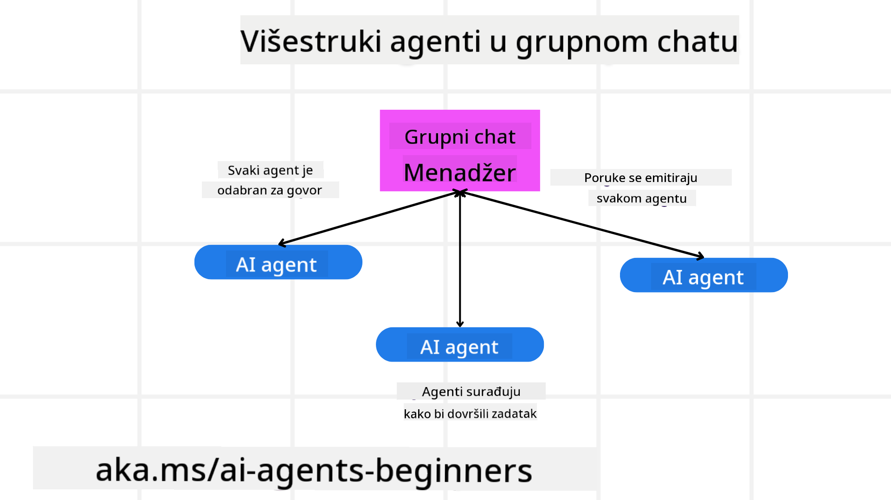
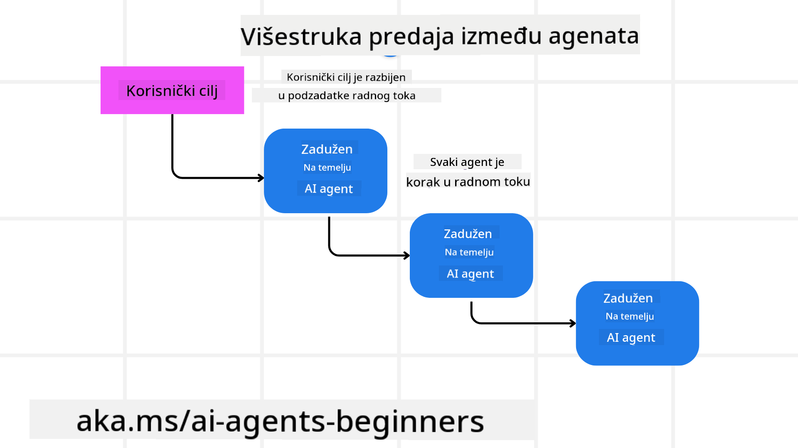
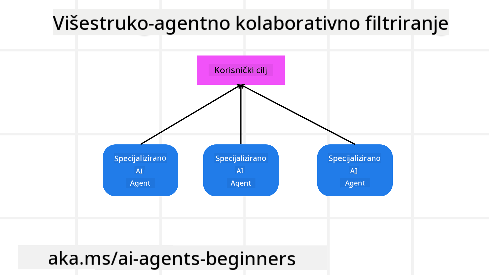

<!--
CO_OP_TRANSLATOR_METADATA:
{
  "original_hash": "c692a8975d7d5b99575a553de1c5e8a7",
  "translation_date": "2025-07-12T11:29:26+00:00",
  "source_file": "08-multi-agent/README.md",
  "language_code": "hr"
}
-->

> _(Kliknite na sliku iznad za pregled videa ove lekcije)_

# Višeagentni dizajnerski obrasci

Čim započnete rad na projektu koji uključuje više agenata, morat ćete razmotriti višeagentni dizajnerski obrazac. Međutim, možda neće biti odmah jasno kada prijeći na više agenata i koje su prednosti takvog pristupa.

## Uvod

U ovoj lekciji želimo odgovoriti na sljedeća pitanja:

- U kojim se scenarijima primjenjuju višeagenti?
- Koje su prednosti korištenja više agenata u odnosu na jednog agenta koji obavlja više zadataka?
- Koji su osnovni elementi implementacije višeagentnog dizajnerskog obrasca?
- Kako možemo pratiti interakciju između više agenata?

## Ciljevi učenja

Nakon ove lekcije trebali biste moći:

- Prepoznati scenarije u kojima su višeagenti primjenjivi
- Uočiti prednosti korištenja više agenata u odnosu na jednog agenta
- Razumjeti osnovne elemente implementacije višeagentnog dizajnerskog obrasca

Što je šira slika?

*Višeagenti su dizajnerski obrazac koji omogućuje da više agenata surađuje kako bi postigli zajednički cilj*.

Ovaj obrazac široko se koristi u različitim područjima, uključujući robotiku, autonomne sustave i distribuirano računarstvo.

## Scenariji u kojima su višeagenti primjenjivi

Koji su to scenariji u kojima je dobro koristiti višeagente? Odgovor je da postoji mnogo situacija u kojima je korisno angažirati više agenata, osobito u sljedećim slučajevima:

- **Veliki opseg posla**: Veliki zadaci mogu se podijeliti na manje dijelove i dodijeliti različitim agentima, što omogućuje paralelnu obradu i brže izvršenje. Primjer za to je obrada velikih količina podataka.
- **Složeni zadaci**: Kao i kod velikih opsega posla, složeni zadaci mogu se razložiti na manje podzadatke i dodijeliti različitim agentima, od kojih je svaki specijaliziran za određeni aspekt zadatka. Dobar primjer su autonomna vozila gdje različiti agenti upravljaju navigacijom, detekcijom prepreka i komunikacijom s drugim vozilima.
- **Raznolika stručnost**: Različiti agenti mogu imati različite stručnosti, što im omogućuje učinkovitije rješavanje različitih aspekata zadatka nego što bi to mogao jedan agent. Primjer za to je zdravstvena skrb gdje agenti mogu upravljati dijagnostikom, planovima liječenja i praćenjem pacijenata.

## Prednosti korištenja više agenata u odnosu na jednog agenta

Sustav s jednim agentom može dobro funkcionirati za jednostavne zadatke, ali za složenije zadatke korištenje više agenata donosi nekoliko prednosti:

- **Specijalizacija**: Svaki agent može biti specijaliziran za određeni zadatak. Nedostatak specijalizacije kod jednog agenta znači da agent može raditi sve, ali se može zbuniti kada se suoči sa složenim zadatkom. Na primjer, mogao bi obavljati zadatak za koji nije najbolje kvalificiran.
- **Skalabilnost**: Lakše je skalirati sustav dodavanjem više agenata nego preopterećivanjem jednog agenta.
- **Otpornost na greške**: Ako jedan agent zakaže, ostali mogu nastaviti s radom, čime se osigurava pouzdanost sustava.

Uzmimo primjer – rezervirajmo putovanje za korisnika. Sustav s jednim agentom morao bi upravljati svim aspektima procesa rezervacije, od pronalaska letova do rezervacije hotela i najma automobila. Da bi to postigao, agent bi morao imati alate za sve te zadatke, što može dovesti do složenog i monolitnog sustava koji je teško održavati i skalirati. Sustav s više agenata, s druge strane, mogao bi imati različite agente specijalizirane za pronalazak letova, rezervaciju hotela i najam automobila. To bi sustav učinilo modularnijim, lakšim za održavanje i skalabilnijim.

Usporedite to s putničkom agencijom vođenom kao mala obiteljska trgovina nasuprot franšizi. Mala trgovina imala bi jednog agenta koji upravlja svim aspektima rezervacije, dok bi franšiza imala različite agente za različite dijelove procesa.

## Osnovni elementi implementacije višeagentnog dizajnerskog obrasca

Prije nego što implementirate višeagentni dizajnerski obrazac, morate razumjeti osnovne elemente koji ga čine.

Uzmimo opet primjer rezervacije putovanja za korisnika. U tom slučaju osnovni elementi uključuju:

- **Komunikacija agenata**: Agenti za pronalazak letova, rezervaciju hotela i najam automobila moraju komunicirati i dijeliti informacije o korisničkim preferencijama i ograničenjima. Morate odlučiti o protokolima i metodama te komunikacije. Konkretno, agent za pronalazak letova mora komunicirati s agentom za rezervaciju hotela kako bi osigurao da je hotel rezerviran za iste datume kao i let. To znači da agenti moraju dijeliti informacije o datumima putovanja korisnika, pa morate odlučiti *koji agenti dijele informacije i kako ih dijele*.
- **Mehanizmi koordinacije**: Agenti moraju koordinirati svoje radnje kako bi zadovoljili korisničke preferencije i ograničenja. Na primjer, korisnička preferencija može biti da žele hotel blizu aerodroma, dok je ograničenje da su automobili za najam dostupni samo na aerodromu. To znači da agent za rezervaciju hotela mora koordinirati s agentom za najam automobila kako bi se zadovoljile korisničke želje i ograničenja. Morate odlučiti *kako agenti koordiniraju svoje radnje*.
- **Arhitektura agenata**: Agenti moraju imati unutarnju strukturu za donošenje odluka i učenje iz interakcija s korisnikom. To znači da agent za pronalazak letova mora imati strukturu za odlučivanje o tome koje letove preporučiti korisniku. Morate odlučiti *kako agenti donose odluke i uče iz interakcija s korisnikom*. Primjer učenja agenta može biti da agent za pronalazak letova koristi model strojnog učenja za preporuku letova na temelju prethodnih preferencija korisnika.
- **Vidljivost u interakcije više agenata**: Morate imati uvid u to kako se agenti međusobno povezuju i surađuju. To znači da trebate alate i tehnike za praćenje aktivnosti i interakcija agenata. To može biti u obliku alata za zapisivanje i nadzor, alata za vizualizaciju i mjernih pokazatelja performansi.
- **Višeagentni obrasci**: Postoje različiti obrasci za implementaciju višeagentnih sustava, poput centralizirane, decentralizirane i hibridne arhitekture. Morate odabrati obrazac koji najbolje odgovara vašem slučaju upotrebe.
- **Čovjek u petlji**: U većini slučajeva u sustavu će biti uključen čovjek i morate uputiti agente kada trebaju tražiti ljudsku intervenciju. To može biti u obliku korisnika koji traži određeni hotel ili let koji agenti nisu preporučili ili traženje potvrde prije rezervacije leta ili hotela.

## Vidljivost u interakcije više agenata

Važno je imati uvid u to kako se više agenata međusobno povezuje i surađuje. Ta vidljivost je ključna za otklanjanje pogrešaka, optimizaciju i osiguranje učinkovitosti cijelog sustava. Da biste to postigli, trebate alate i tehnike za praćenje aktivnosti i interakcija agenata. To može biti u obliku alata za zapisivanje i nadzor, alata za vizualizaciju i mjernih pokazatelja performansi.

Na primjer, u slučaju rezervacije putovanja za korisnika, mogli biste imati nadzornu ploču koja prikazuje status svakog agenta, korisničke preferencije i ograničenja te interakcije između agenata. Ta ploča može prikazivati datume putovanja korisnika, letove koje je preporučio agent za letove, hotele koje je preporučio agent za hotele i automobile koje je preporučio agent za najam automobila. To bi vam dalo jasan pregled kako agenti međusobno surađuju i zadovoljavaju li se korisničke želje i ograničenja.

Pogledajmo svaki od ovih aspekata detaljnije.

- **Alati za zapisivanje i nadzor**: Želite bilježiti svaku radnju koju agent poduzme. Zapisnik može sadržavati informacije o agentu koji je poduzeo radnju, o samoj radnji, vremenu kada je radnja izvršena i ishodu radnje. Te informacije mogu se koristiti za otklanjanje pogrešaka, optimizaciju i slično.

- **Alati za vizualizaciju**: Alati za vizualizaciju mogu vam pomoći da intuitivnije vidite interakcije između agenata. Na primjer, mogli biste imati graf koji prikazuje protok informacija između agenata. To može pomoći u otkrivanju uskih grla, neučinkovitosti i drugih problema u sustavu.

- **Mjerni pokazatelji performansi**: Mjerni pokazatelji pomažu vam pratiti učinkovitost višeagentnog sustava. Na primjer, možete pratiti vrijeme potrebno za izvršenje zadatka, broj zadataka izvršenih u jedinici vremena i točnost preporuka koje agenti daju. Te informacije pomažu u identificiranju područja za poboljšanje i optimizaciji sustava.

## Višeagentni obrasci

Pogledajmo neke konkretne obrasce koje možemo koristiti za izradu višeagentnih aplikacija. Evo nekoliko zanimljivih obrazaca koje vrijedi razmotriti:

### Grupni chat

Ovaj obrazac je koristan kada želite stvoriti aplikaciju za grupni chat u kojoj više agenata može međusobno komunicirati. Tipični slučajevi upotrebe uključuju timsku suradnju, korisničku podršku i društvene mreže.

U ovom obrascu svaki agent predstavlja korisnika u grupnom chatu, a poruke se razmjenjuju između agenata koristeći protokol za razmjenu poruka. Agenti mogu slati poruke grupi, primati poruke iz grupe i odgovarati na poruke drugih agenata.

Ovaj obrazac može se implementirati koristeći centraliziranu arhitekturu gdje se sve poruke usmjeravaju preko središnjeg poslužitelja, ili decentraliziranu arhitekturu gdje se poruke razmjenjuju izravno.

### Predaja zadataka

Ovaj obrazac je koristan kada želite stvoriti aplikaciju u kojoj više agenata može predavati zadatke jedni drugima.

Tipični slučajevi upotrebe uključuju korisničku podršku, upravljanje zadacima i automatizaciju radnih tokova.

U ovom obrascu svaki agent predstavlja zadatak ili korak u radnom toku, a agenti mogu predavati zadatke drugim agentima prema unaprijed definiranim pravilima.

### Suradničko filtriranje

Ovaj obrazac je koristan kada želite stvoriti aplikaciju u kojoj više agenata surađuje kako bi korisnicima dali preporuke.

Razlog zašto želite da više agenata surađuje jest taj što svaki agent može imati različitu stručnost i može na različite načine doprinijeti procesu preporuke.

Uzmimo primjer gdje korisnik želi preporuku za najbolju dionicu za kupnju na burzi.

- **Stručnjak za industriju**: Jedan agent može biti stručnjak za određenu industriju.
- **Tehnička analiza**: Drugi agent može biti stručnjak za tehničku analizu.
- **Fundamentalna analiza**: Treći agent može biti stručnjak za fundamentalnu analizu. Suradnjom ti agenti mogu korisniku pružiti sveobuhvatniju preporuku.

## Scenarij: Proces povrata novca

Razmotrimo scenarij u kojem kupac pokušava dobiti povrat novca za proizvod. U tom procesu može biti uključeno dosta agenata, ali podijelit ćemo ih na agente specifične za ovaj proces i opće agente koji se mogu koristiti u drugim procesima.

**Agenti specifični za proces povrata novca**:

Slijede neki agenti koji bi mogli biti uključeni u proces povrata:

- **Agent kupca**: Predstavlja kupca i odgovoran je za pokretanje procesa povrata.
- **Agent prodavača**: Predstavlja prodavača i odgovoran je za obradu povrata.
- **Agent plaćanja**: Predstavlja proces plaćanja i odgovoran je za vraćanje novca kupcu.
- **Agent rješavanja problema**: Predstavlja proces rješavanja problema i odgovoran je za rješavanje bilo kakvih poteškoća tijekom procesa povrata.
- **Agent usklađenosti**: Predstavlja proces usklađenosti i odgovoran je za osiguravanje da proces povrata zadovoljava propise i politike.

**Opći agenti**:

Ovi agenti mogu se koristiti u drugim dijelovima vašeg poslovanja.

- **Agent dostave**: Predstavlja proces dostave i odgovoran je za slanje proizvoda natrag prodavaču. Ovaj agent može se koristiti i za proces povrata i za opću dostavu proizvoda, na primjer prilikom kupnje.
- **Agent povratnih informacija**: Predstavlja proces prikupljanja povratnih informacija od kupca. Povratne informacije mogu se prikupljati u bilo kojem trenutku, ne samo tijekom procesa povrata.
- **Agent eskalacije**: Predstavlja proces eskalacije i odgovoran je za podizanje problema na višu razinu podrške. Ovaj tip agenta možete koristiti u bilo kojem procesu gdje je potrebna eskalacija problema.
- **Agent obavijesti**: Predstavlja proces slanja obavijesti kupcu u različitim fazama procesa povrata.
- **Agent analitike**: Predstavlja proces analize podataka vezanih uz proces povrata.
- **Agent revizije**: Predstavlja proces revizije i odgovoran je za provjeru ispravnosti provođenja procesa povrata.
- **Agent izvještavanja**: Predstavlja proces generiranja izvještaja o procesu povrata.
- **Agent znanja**: Predstavlja proces upravljanja bazom znanja vezanom uz proces povrata. Ovaj agent može biti stručan i za povrate i za druge dijelove vašeg poslovanja.
- **Agent sigurnosti**: Predstavlja proces sigurnosti i odgovoran je za osiguranje sigurnosti procesa povrata.
- **Agent kvalitete**: Predstavlja proces kontrole kvalitete i odgovoran je za osiguranje kvalitete procesa povrata.

Navedeno je priličan broj agenata, i to kako za specifični proces povrata, tako i za opće agente koji se mogu koristiti u drugim dijelovima vašeg poslovanja. Nadamo se da vam ovo daje ideju kako odlučiti koje agente koristiti u vašem višeagentnom sustavu.

## Zadatak
## Prethodna lekcija

[Planiranje dizajna](../07-planning-design/README.md)

## Sljedeća lekcija

[Metakognicija u AI agentima](../09-metacognition/README.md)

**Odricanje od odgovornosti**:  
Ovaj dokument je preveden korištenjem AI usluge za prevođenje [Co-op Translator](https://github.com/Azure/co-op-translator). Iako težimo točnosti, imajte na umu da automatski prijevodi mogu sadržavati pogreške ili netočnosti. Izvorni dokument na izvornom jeziku treba smatrati autoritativnim izvorom. Za kritične informacije preporučuje se profesionalni ljudski prijevod. Ne snosimo odgovornost za bilo kakva nesporazume ili pogrešna tumačenja koja proizlaze iz korištenja ovog prijevoda.