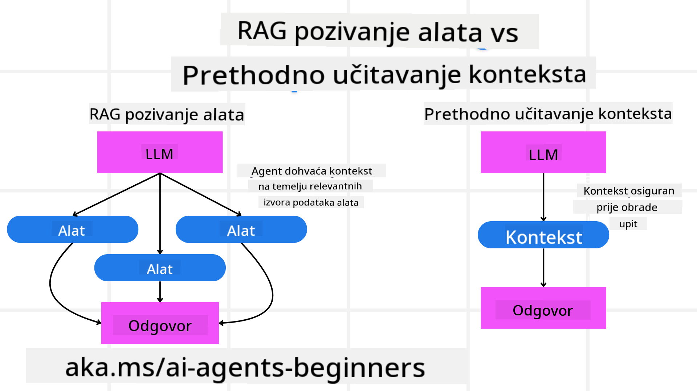

<!--
CO_OP_TRANSLATOR_METADATA:
{
  "original_hash": "8cbf460468c802c7994aa62e0e0779c9",
  "translation_date": "2025-07-12T13:24:49+00:00",
  "source_file": "09-metacognition/README.md",
  "language_code": "hr"
}
-->
[](https://youtu.be/His9R6gw6Ec?si=3_RMb8VprNvdLRhX)

> _(Kliknite na sliku iznad za pregled videa ove lekcije)_
# Metakognicija u AI agentima

## Uvod

Dobrodošli na lekciju o metakogniciji u AI agentima! Ovaj je poglavlje namijenjeno početnicima koji su znatiželjni kako AI agenti mogu razmišljati o vlastitim procesima razmišljanja. Na kraju ove lekcije razumjet ćete ključne pojmove i imat ćete praktične primjere za primjenu metakognicije u dizajnu AI agenata.

## Ciljevi učenja

Nakon završetka ove lekcije moći ćete:

1. Razumjeti implikacije petlji rezoniranja u definicijama agenata.
2. Koristiti tehnike planiranja i evaluacije za pomoć agentima koji se samopopravljaju.
3. Kreirati vlastite agente sposobne manipulirati kodom za izvršavanje zadataka.

## Uvod u metakogniciju

Metakognicija se odnosi na kognitivne procese višeg reda koji uključuju razmišljanje o vlastitom razmišljanju. Za AI agente to znači sposobnost evaluacije i prilagodbe svojih akcija na temelju samosvijesti i prošlih iskustava. Metakognicija, ili "razmišljanje o razmišljanju", važan je koncept u razvoju agentnih AI sustava. Uključuje da AI sustavi budu svjesni vlastitih unutarnjih procesa te da mogu pratiti, regulirati i prilagođavati svoje ponašanje u skladu s tim. Baš kao što mi to radimo kad "čitamo prostoriju" ili promatramo problem. Ova samosvijest može pomoći AI sustavima da donose bolje odluke, prepoznaju pogreške i poboljšaju svoje performanse tijekom vremena – što opet povezuje s Turingovim testom i raspravom hoće li AI preuzeti kontrolu.

U kontekstu agentnih AI sustava, metakognicija može pomoći u rješavanju nekoliko izazova, kao što su:
- Transparentnost: Osiguravanje da AI sustavi mogu objasniti svoje rezoniranje i odluke.
- Rezoniranje: Poboljšanje sposobnosti AI sustava da sintetiziraju informacije i donose ispravne odluke.
- Prilagodba: Omogućavanje AI sustavima da se prilagode novim okruženjima i promjenjivim uvjetima.
- Percepcija: Poboljšanje točnosti AI sustava u prepoznavanju i tumačenju podataka iz okoline.

### Što je metakognicija?

Metakognicija, ili "razmišljanje o razmišljanju", je kognitivni proces višeg reda koji uključuje samosvijest i samoregulaciju vlastitih kognitivnih procesa. U području AI, metakognicija omogućuje agentima da evaluiraju i prilagođavaju svoje strategije i akcije, što vodi do poboljšanih sposobnosti rješavanja problema i donošenja odluka. Razumijevanjem metakognicije možete dizajnirati AI agente koji nisu samo inteligentniji, već i prilagodljiviji i učinkovitiji. U pravoj metakogniciji, AI bi eksplicitno rezonirao o vlastitom rezoniranju.

Primjer: „Prioritizirao sam jeftinije letove jer... možda propuštam direktne letove, pa ću ponovno provjeriti.“
Praćenje kako ili zašto je odabrao određenu rutu.
- Primjećivanje da je napravio pogreške jer se previše oslanjao na korisničke preferencije iz prošlog puta, pa mijenja svoju strategiju donošenja odluka, a ne samo konačnu preporuku.
- Dijagnosticiranje obrazaca poput: „Kad god vidim da korisnik spominje ‘previše gužve’, ne bih trebao samo ukloniti određene atrakcije, već i razmisliti da je moja metoda odabira ‘najboljih atrakcija’ pogrešna ako uvijek rangiram po popularnosti.“

### Važnost metakognicije u AI agentima

Metakognicija ima ključnu ulogu u dizajnu AI agenata iz nekoliko razloga:


- Samorefleksija: Agenti mogu procijeniti vlastite performanse i identificirati područja za poboljšanje.
- Prilagodljivost: Agenti mogu mijenjati svoje strategije na temelju prošlih iskustava i promjenjivih uvjeta.
- Ispravljanje pogrešaka: Agenti mogu samostalno otkriti i ispraviti pogreške, što vodi do točnijih rezultata.
- Upravljanje resursima: Agenti mogu optimizirati korištenje resursa, poput vremena i računalne snage, planiranjem i evaluacijom svojih akcija.

## Komponente AI agenta

Prije nego što zaronimo u metakognitivne procese, važno je razumjeti osnovne komponente AI agenta. AI agent obično se sastoji od:

- Persona: Osobnost i karakteristike agenta koje definiraju kako komunicira s korisnicima.
- Alati: Sposobnosti i funkcije koje agent može izvršavati.
- Vještine: Znanje i stručnost koje agent posjeduje.

Ove komponente zajedno stvaraju "jedinicu stručnosti" koja može obavljati specifične zadatke.

**Primjer**:
Zamislite putničkog agenta, uslugu agenta koja ne samo da planira vaš odmor, već i prilagođava svoj put na temelju podataka u stvarnom vremenu i prošlih iskustava korisnika.

### Primjer: Metakognicija u usluzi putničkog agenta

Zamislite da dizajnirate uslugu putničkog agenta pokretanog AI-jem. Ovaj agent, "Putnički agent", pomaže korisnicima u planiranju njihovih odmora. Da bi uključio metakogniciju, Putnički agent treba evaluirati i prilagođavati svoje akcije na temelju samosvijesti i prošlih iskustava. Evo kako metakognicija može igrati ulogu:

#### Trenutni zadatak

Trenutni zadatak je pomoći korisniku u planiranju putovanja u Pariz.

#### Koraci za dovršetak zadatka

1. **Prikupljanje korisničkih preferencija**: Pitati korisnika o datumima putovanja, budžetu, interesima (npr. muzeji, kuhinja, shopping) i posebnim zahtjevima.
2. **Prikupljanje informacija**: Pretražiti opcije letova, smještaja, atrakcija i restorana koji odgovaraju korisničkim preferencijama.
3. **Generiranje preporuka**: Pružiti personalizirani itinerar s detaljima o letovima, rezervacijama hotela i predloženim aktivnostima.
4. **Prilagodba na temelju povratnih informacija**: Pitati korisnika za povratne informacije o preporukama i napraviti potrebne prilagodbe.

#### Potrebni resursi

- Pristup bazama podataka za rezervacije letova i hotela.
- Informacije o pariškim atrakcijama i restoranima.
- Podaci o povratnim informacijama korisnika iz prethodnih interakcija.

#### Iskustvo i samorefleksija

Putnički agent koristi metakogniciju za evaluaciju vlastitih performansi i učenje iz prošlih iskustava. Na primjer:

1. **Analiza povratnih informacija korisnika**: Putnički agent pregledava povratne informacije kako bi utvrdio koje su preporuke bile dobro prihvaćene, a koje nisu. Prilagođava buduće prijedloge u skladu s tim.
2. **Prilagodljivost**: Ako je korisnik ranije spomenuo da ne voli gužve, Putnički agent će ubuduće izbjegavati preporučivanje popularnih turističkih mjesta u vršnim satima.
3. **Ispravljanje pogrešaka**: Ako je Putnički agent napravio pogrešku u prethodnoj rezervaciji, poput predlaganja hotela koji je bio pun, uči da strože provjerava dostupnost prije davanja preporuka.

#### Praktični primjer za programere

Evo pojednostavljenog primjera kako bi kod Putničkog agenta mogao izgledati pri uključivanju metakognicije:

```python
class Travel_Agent:
    def __init__(self):
        self.user_preferences = {}
        self.experience_data = []

    def gather_preferences(self, preferences):
        self.user_preferences = preferences

    def retrieve_information(self):
        # Search for flights, hotels, and attractions based on preferences
        flights = search_flights(self.user_preferences)
        hotels = search_hotels(self.user_preferences)
        attractions = search_attractions(self.user_preferences)
        return flights, hotels, attractions

    def generate_recommendations(self):
        flights, hotels, attractions = self.retrieve_information()
        itinerary = create_itinerary(flights, hotels, attractions)
        return itinerary

    def adjust_based_on_feedback(self, feedback):
        self.experience_data.append(feedback)
        # Analyze feedback and adjust future recommendations
        self.user_preferences = adjust_preferences(self.user_preferences, feedback)

# Example usage
travel_agent = Travel_Agent()
preferences = {
    "destination": "Paris",
    "dates": "2025-04-01 to 2025-04-10",
    "budget": "moderate",
    "interests": ["museums", "cuisine"]
}
travel_agent.gather_preferences(preferences)
itinerary = travel_agent.generate_recommendations()
print("Suggested Itinerary:", itinerary)
feedback = {"liked": ["Louvre Museum"], "disliked": ["Eiffel Tower (too crowded)"]}
travel_agent.adjust_based_on_feedback(feedback)
```

#### Zašto je metakognicija važna

- **Samorefleksija**: Agenti mogu analizirati svoje performanse i identificirati područja za poboljšanje.
- **Prilagodljivost**: Agenti mogu mijenjati strategije na temelju povratnih informacija i promjenjivih uvjeta.
- **Ispravljanje pogrešaka**: Agenti mogu samostalno otkriti i ispraviti pogreške.
- **Upravljanje resursima**: Agenti mogu optimizirati korištenje resursa, poput vremena i računalne snage.

Uključivanjem metakognicije, Putnički agent može pružiti personaliziranije i točnije preporuke za putovanja, poboljšavajući ukupno korisničko iskustvo.

---

## 2. Planiranje u agentima

Planiranje je ključna komponenta ponašanja AI agenta. Uključuje definiranje koraka potrebnih za postizanje cilja, uzimajući u obzir trenutačno stanje, resurse i moguće prepreke.

### Elementi planiranja

- **Trenutni zadatak**: Jasno definirati zadatak.
- **Koraci za dovršetak zadatka**: Razložiti zadatak na upravljive korake.
- **Potrebni resursi**: Identificirati potrebne resurse.
- **Iskustvo**: Iskoristiti prošla iskustva za informiranje planiranja.

**Primjer**:
Evo koraka koje Putnički agent treba poduzeti da bi učinkovito pomogao korisniku u planiranju putovanja:

### Koraci za Putničkog agenta

1. **Prikupljanje korisničkih preferencija**
   - Pitati korisnika za detalje o datumima putovanja, budžetu, interesima i posebnim zahtjevima.
   - Primjeri: "Kada planirate putovati?" "Koji je vaš budžet?" "Koje aktivnosti volite na odmoru?"

2. **Prikupljanje informacija**
   - Pretražiti relevantne opcije putovanja na temelju korisničkih preferencija.
   - **Letovi**: Potražiti dostupne letove unutar budžeta i željenih datuma.
   - **Smještaj**: Pronaći hotele ili najam koji odgovaraju preferencijama korisnika po lokaciji, cijeni i sadržajima.
   - **Atrakcije i restorani**: Identificirati popularne atrakcije, aktivnosti i restorane koji odgovaraju interesima korisnika.

3. **Generiranje preporuka**
   - Sastaviti prikupljene informacije u personalizirani itinerar.
   - Pružiti detalje poput opcija letova, rezervacija hotela i predloženih aktivnosti, prilagođavajući preporuke korisnikovim željama.

4. **Predstavljanje itinerara korisniku**
   - Podijeliti predloženi itinerar s korisnikom na pregled.
   - Primjer: "Evo prijedloga itinerara za vaše putovanje u Pariz. Uključuje detalje o letovima, rezervacije hotela i popis preporučenih aktivnosti i restorana. Javite mi što mislite!"

5. **Prikupljanje povratnih informacija**
   - Pitati korisnika za povratne informacije o predloženom itineraru.
   - Primjeri: "Sviđaju li vam se opcije letova?" "Je li hotel prikladan za vaše potrebe?" "Postoje li aktivnosti koje želite dodati ili ukloniti?"

6. **Prilagodba na temelju povratnih informacija**
   - Izmijeniti itinerar prema korisničkim povratnim informacijama.
   - Napraviti potrebne promjene u preporukama za letove, smještaj i aktivnosti kako bi bolje odgovarale željama korisnika.

7. **Završna potvrda**
   - Predstaviti ažurirani itinerar korisniku na konačnu potvrdu.
   - Primjer: "Napravio sam izmjene prema vašim povratnim informacijama. Evo ažuriranog itinerara. Je li sve u redu?"

8. **Rezervacija i potvrda**
   - Nakon što korisnik odobri itinerar, nastaviti s rezervacijom letova, smještaja i planiranih aktivnosti.
   - Poslati korisniku potvrde.

9. **Pružanje kontinuirane podrške**
   - Biti dostupan za pomoć korisniku s bilo kakvim promjenama ili dodatnim zahtjevima prije i tijekom putovanja.
   - Primjer: "Ako vam tijekom putovanja zatreba dodatna pomoć, slobodno mi se obratite u bilo kojem trenutku!"

### Primjer interakcije

```python
class Travel_Agent:
    def __init__(self):
        self.user_preferences = {}
        self.experience_data = []

    def gather_preferences(self, preferences):
        self.user_preferences = preferences

    def retrieve_information(self):
        flights = search_flights(self.user_preferences)
        hotels = search_hotels(self.user_preferences)
        attractions = search_attractions(self.user_preferences)
        return flights, hotels, attractions

    def generate_recommendations(self):
        flights, hotels, attractions = self.retrieve_information()
        itinerary = create_itinerary(flights, hotels, attractions)
        return itinerary

    def adjust_based_on_feedback(self, feedback):
        self.experience_data.append(feedback)
        self.user_preferences = adjust_preferences(self.user_preferences, feedback)

# Example usage within a booing request
travel_agent = Travel_Agent()
preferences = {
    "destination": "Paris",
    "dates": "2025-04-01 to 2025-04-10",
    "budget": "moderate",
    "interests": ["museums", "cuisine"]
}
travel_agent.gather_preferences(preferences)
itinerary = travel_agent.generate_recommendations()
print("Suggested Itinerary:", itinerary)
feedback = {"liked": ["Louvre Museum"], "disliked": ["Eiffel Tower (too crowded)"]}
travel_agent.adjust_based_on_feedback(feedback)
```

## 3. Korektivni RAG sustav

Prvo, krenimo s razumijevanjem razlike između RAG alata i preemptivnog učitavanja konteksta.



### Retrieval-Augmented Generation (RAG)

RAG kombinira sustav za dohvat podataka s generativnim modelom. Kada se postavi upit, sustav za dohvat pronalazi relevantne dokumente ili podatke iz vanjskog izvora, a te dohvaćene informacije se koriste za obogaćivanje ulaza generativnom modelu. To pomaže modelu da generira točnije i kontekstualno relevantnije odgovore.

U RAG sustavu, agent dohvaća relevantne informacije iz baze znanja i koristi ih za generiranje prikladnih odgovora ili akcija.

### Korektivni RAG pristup

Korektivni RAG pristup fokusira se na korištenje RAG tehnika za ispravljanje pogrešaka i poboljšanje točnosti AI agenata. To uključuje:

1. **Tehnika poticanja (prompting)**: Korištenje specifičnih upita za usmjeravanje agenta u dohvaćanju relevantnih informacija.
2. **Alat**: Implementaciju algoritama i mehanizama koji omogućuju agentu da evaluira relevantnost dohvaćenih informacija i generira točne odgovore.
3. **Evaluacija**: Kontinuirano procjenjivanje performansi agenta i prilagodbe za poboljšanje točnosti i učinkovitosti.

#### Primjer: Korektivni RAG u pretraživačkom agentu

Zamislite pretraživačkog agenta koji dohvaća informacije s weba za odgovaranje na korisničke upite. Korektivni RAG pristup može uključivati:

1. **Tehnika poticanja**: Formuliranje upita za pretraživanje na temelju korisničkog unosa.
2. **Alat**: Korištenje algoritama za obradu prirodnog jezika i strojnog učenja za rangiranje i filtriranje rezultata pretraživanja.
3. **Evaluacija**: Analizu povratnih informacija korisnika za prepoznavanje i ispravljanje netočnosti u dohvaćenim informacijama.

### Korektivni RAG u Putničkom agentu

Korektivni RAG (Retrieval-Augmented Generation) poboljšava sposobnost AI-ja da dohvaća i generira informacije dok ispravlja eventualne netočnosti. Pogledajmo kako Putnički agent može koristiti Korektivni RAG pristup za pružanje točnijih i relevantnijih preporuka za putovanja.

To uključuje:

- **Tehniku poticanja:** Korištenje specifičnih upita za usmjeravanje agenta u dohvaćanju relevantnih informacija.
- **Alat:** Implementaciju algoritama i mehanizama koji omogućuju agentu da evaluira relevantnost dohvaćenih informacija i generira točne odgovore.
- **Evaluaciju:** Kontinuirano procjenjivanje performansi agenta i prilagodbe za poboljšanje točnosti i učinkovitosti.

#### Koraci za implementaciju Korektivnog RAG-a u Putničkom agentu

1. **Početna interakcija s korisnikom**
   - Putnički agent prikuplja početne preferencije korisnika, poput destinacije, datuma putovanja, budžeta i interesa.
   - Primjer:

     ```python
     preferences = {
         "destination": "Paris",
         "dates": "2025-04-01 to 2025-04-10",
         "budget": "moderate",
         "interests": ["museums", "cuisine"]
     }
     ```

2. **Dohvat informacija**
   - Putnički agent dohvaća informacije o letovima, smještaju, atrakcijama i restoranima na temelju korisničkih preferencija.
   - Primjer:

     ```python
     flights = search_flights(preferences)
     hotels = search_hotels(preferences)
     attractions = search_attractions(preferences)
     ```

3. **Generiranje početnih preporuka**
   - Putnički agent koristi dohvaćene informacije za generiranje personaliziranog itinerara.
   - Primjer:

     ```python
     itinerary = create_itinerary(flights, hotels, attractions)
     print("Suggested Itinerary:", itinerary)
     ```

4. **Prikupljanje povratnih informacija korisnika**
   - Putnički agent traži povratne informacije o početnim preporukama.
   - Primjer:

     ```python
     feedback = {
         "liked": ["Louvre Museum"],
         "disliked": ["Eiffel Tower (too crowded)"]
     }
     ```

5. **Proces Korektivnog RAG-a**
   - **Tehnika poticanja**: Putnički agent formulira nove upite za pretraživanje na temelju povratnih informacija korisnika.
     - Primjer:

       ```python
       if "disliked" in feedback:
           preferences["avoid"] = feedback["disliked"]
       ```

   - **Alat**: Putnički agent koristi algoritme za rangiranje i filtriranje novih rezultata pretraživanja, naglašavajući relevantnost prema povratnim informacijama korisnika.
     - Primjer:

       ```python
       new_attractions = search_attractions(preferences)
       new_itinerary = create_itinerary(flights, hotels, new_attractions)
       print("Updated Itinerary:", new_itinerary)
       ```

   - **Evaluacija**: Putnički agent kontinuirano procjenjuje relevantnost i točnost svojih preporuka analizom povratnih informacija i vr
### Pre-emptivno Učitavanje Konteksta

Pre-emptivno učitavanje konteksta podrazumijeva učitavanje relevantnih informacija ili pozadinskih podataka u model prije obrade upita. To znači da model od početka ima pristup tim informacijama, što mu pomaže da generira bolje i informiranije odgovore bez potrebe za dodatnim dohvatom podataka tijekom procesa.

Evo pojednostavljenog primjera kako bi pre-emptivno učitavanje konteksta moglo izgledati za aplikaciju turističkog agenta u Pythonu:

```python
class TravelAgent:
    def __init__(self):
        # Pre-load popular destinations and their information
        self.context = {
            "Paris": {"country": "France", "currency": "Euro", "language": "French", "attractions": ["Eiffel Tower", "Louvre Museum"]},
            "Tokyo": {"country": "Japan", "currency": "Yen", "language": "Japanese", "attractions": ["Tokyo Tower", "Shibuya Crossing"]},
            "New York": {"country": "USA", "currency": "Dollar", "language": "English", "attractions": ["Statue of Liberty", "Times Square"]},
            "Sydney": {"country": "Australia", "currency": "Dollar", "language": "English", "attractions": ["Sydney Opera House", "Bondi Beach"]}
        }

    def get_destination_info(self, destination):
        # Fetch destination information from pre-loaded context
        info = self.context.get(destination)
        if info:
            return f"{destination}:\nCountry: {info['country']}\nCurrency: {info['currency']}\nLanguage: {info['language']}\nAttractions: {', '.join(info['attractions'])}"
        else:
            return f"Sorry, we don't have information on {destination}."

# Example usage
travel_agent = TravelAgent()
print(travel_agent.get_destination_info("Paris"))
print(travel_agent.get_destination_info("Tokyo"))
```

#### Objašnjenje

1. **Inicijalizacija (`__init__` metoda)**: Klasa `TravelAgent` unaprijed učitava rječnik s informacijama o popularnim destinacijama poput Pariza, Tokija, New Yorka i Sydneya. Taj rječnik sadrži detalje poput države, valute, jezika i glavnih atrakcija za svaku destinaciju.

2. **Dohvat Informacija (`get_destination_info` metoda)**: Kada korisnik postavi upit o određenoj destinaciji, metoda `get_destination_info` dohvaća relevantne informacije iz unaprijed učitanog rječnika konteksta.

Unaprijed učitavanjem konteksta, aplikacija turističkog agenta može brzo odgovoriti na korisničke upite bez potrebe za dohvatom podataka iz vanjskog izvora u stvarnom vremenu. To čini aplikaciju učinkovitijom i responzivnijom.

### Pokretanje Plana s Ciljem Prije Iteracije

Pokretanje plana s ciljem znači započeti s jasnim ciljem ili željenim ishodom na umu. Definiranjem tog cilja unaprijed, model ga može koristiti kao vodilju tijekom iterativnog procesa. To pomaže osigurati da svaka iteracija vodi bliže ostvarenju željenog rezultata, čineći proces učinkovitijim i fokusiranijim.

Evo primjera kako možete pokrenuti plan putovanja s ciljem prije iteracije za turističkog agenta u Pythonu:

### Scenarij

Turistički agent želi isplanirati prilagođeni odmor za klijenta. Cilj je kreirati putni itinerar koji maksimizira zadovoljstvo klijenta na temelju njegovih preferencija i budžeta.

### Koraci

1. Definirati preferencije i budžet klijenta.
2. Pokrenuti početni plan na temelju tih preferencija.
3. Iterirati kako bi se plan usavršio, optimizirajući zadovoljstvo klijenta.

#### Python Kod

```python
class TravelAgent:
    def __init__(self, destinations):
        self.destinations = destinations

    def bootstrap_plan(self, preferences, budget):
        plan = []
        total_cost = 0

        for destination in self.destinations:
            if total_cost + destination['cost'] <= budget and self.match_preferences(destination, preferences):
                plan.append(destination)
                total_cost += destination['cost']

        return plan

    def match_preferences(self, destination, preferences):
        for key, value in preferences.items():
            if destination.get(key) != value:
                return False
        return True

    def iterate_plan(self, plan, preferences, budget):
        for i in range(len(plan)):
            for destination in self.destinations:
                if destination not in plan and self.match_preferences(destination, preferences) and self.calculate_cost(plan, destination) <= budget:
                    plan[i] = destination
                    break
        return plan

    def calculate_cost(self, plan, new_destination):
        return sum(destination['cost'] for destination in plan) + new_destination['cost']

# Example usage
destinations = [
    {"name": "Paris", "cost": 1000, "activity": "sightseeing"},
    {"name": "Tokyo", "cost": 1200, "activity": "shopping"},
    {"name": "New York", "cost": 900, "activity": "sightseeing"},
    {"name": "Sydney", "cost": 1100, "activity": "beach"},
]

preferences = {"activity": "sightseeing"}
budget = 2000

travel_agent = TravelAgent(destinations)
initial_plan = travel_agent.bootstrap_plan(preferences, budget)
print("Initial Plan:", initial_plan)

refined_plan = travel_agent.iterate_plan(initial_plan, preferences, budget)
print("Refined Plan:", refined_plan)
```

#### Objašnjenje Koda

1. **Inicijalizacija (`__init__` metoda)**: Klasa `TravelAgent` inicijalizira se s popisom potencijalnih destinacija, od kojih svaka ima atribute poput imena, cijene i vrste aktivnosti.

2. **Pokretanje Plana (`bootstrap_plan` metoda)**: Ova metoda kreira početni plan putovanja na temelju preferencija i budžeta klijenta. Prolazi kroz popis destinacija i dodaje ih u plan ako odgovaraju preferencijama klijenta i uklapaju se u budžet.

3. **Usklađivanje Preferencija (`match_preferences` metoda)**: Ova metoda provjerava odgovara li destinacija preferencijama klijenta.

4. **Iteracija Plana (`iterate_plan` metoda)**: Ova metoda usavršava početni plan pokušavajući zamijeniti svaku destinaciju u planu boljim izborom, uzimajući u obzir preferencije klijenta i ograničenja budžeta.

5. **Izračun Troškova (`calculate_cost` metoda)**: Ova metoda računa ukupne troškove trenutnog plana, uključujući potencijalno novu destinaciju.

#### Primjer Korištenja

- **Početni Plan**: Turistički agent kreira početni plan na temelju klijentovih preferencija za razgledavanje i budžeta od 2000$.
- **Usavršeni Plan**: Turistički agent iterira plan, optimizirajući ga prema preferencijama i budžetu klijenta.

Pokretanjem plana s jasnim ciljem (npr. maksimiziranje zadovoljstva klijenta) i iteriranjem za usavršavanje, turistički agent može kreirati prilagođeni i optimizirani itinerar za klijenta. Ovaj pristup osigurava da plan putovanja od početka odgovara preferencijama i budžetu klijenta te se poboljšava s svakom iteracijom.

### Iskorištavanje LLM-a za Ponovno Rangiranje i Ocjenjivanje

Veliki jezični modeli (LLM) mogu se koristiti za ponovno rangiranje i ocjenjivanje tako da procjenjuju relevantnost i kvalitetu dohvaćenih dokumenata ili generiranih odgovora. Evo kako to funkcionira:

**Dohvat:** Početni korak dohvaća skup kandidata dokumenata ili odgovora na temelju upita.

**Ponovno Rangiranje:** LLM procjenjuje te kandidate i ponovno ih rangira prema relevantnosti i kvaliteti. Ovaj korak osigurava da se najrelevantnije i najkvalitetnije informacije prikažu prve.

**Ocjenjivanje:** LLM dodjeljuje ocjene svakom kandidatu, odražavajući njihovu relevantnost i kvalitetu. To pomaže u odabiru najboljeg odgovora ili dokumenta za korisnika.

Korištenjem LLM-a za ponovno rangiranje i ocjenjivanje, sustav može pružiti točnije i kontekstualno relevantnije informacije, poboljšavajući ukupno korisničko iskustvo.

Evo primjera kako bi turistički agent mogao koristiti Veliki jezični model (LLM) za ponovno rangiranje i ocjenjivanje destinacija na temelju korisničkih preferencija u Pythonu:

#### Scenarij - Putovanje prema Preferencijama

Turistički agent želi preporučiti najbolje destinacije klijentu na temelju njegovih preferencija. LLM će pomoći u ponovnom rangiranju i ocjenjivanju destinacija kako bi se osigurale najrelevantnije opcije.

#### Koraci:

1. Prikupiti korisničke preferencije.
2. Dohvatiti popis potencijalnih destinacija.
3. Koristiti LLM za ponovno rangiranje i ocjenjivanje destinacija prema korisničkim preferencijama.

Evo kako možete nadograditi prethodni primjer za korištenje Azure OpenAI usluga:

#### Zahtjevi

1. Potrebno je imati Azure pretplatu.
2. Kreirati Azure OpenAI resurs i dobiti API ključ.

#### Primjer Python Koda

```python
import requests
import json

class TravelAgent:
    def __init__(self, destinations):
        self.destinations = destinations

    def get_recommendations(self, preferences, api_key, endpoint):
        # Generate a prompt for the Azure OpenAI
        prompt = self.generate_prompt(preferences)
        
        # Define headers and payload for the request
        headers = {
            'Content-Type': 'application/json',
            'Authorization': f'Bearer {api_key}'
        }
        payload = {
            "prompt": prompt,
            "max_tokens": 150,
            "temperature": 0.7
        }
        
        # Call the Azure OpenAI API to get the re-ranked and scored destinations
        response = requests.post(endpoint, headers=headers, json=payload)
        response_data = response.json()
        
        # Extract and return the recommendations
        recommendations = response_data['choices'][0]['text'].strip().split('\n')
        return recommendations

    def generate_prompt(self, preferences):
        prompt = "Here are the travel destinations ranked and scored based on the following user preferences:\n"
        for key, value in preferences.items():
            prompt += f"{key}: {value}\n"
        prompt += "\nDestinations:\n"
        for destination in self.destinations:
            prompt += f"- {destination['name']}: {destination['description']}\n"
        return prompt

# Example usage
destinations = [
    {"name": "Paris", "description": "City of lights, known for its art, fashion, and culture."},
    {"name": "Tokyo", "description": "Vibrant city, famous for its modernity and traditional temples."},
    {"name": "New York", "description": "The city that never sleeps, with iconic landmarks and diverse culture."},
    {"name": "Sydney", "description": "Beautiful harbour city, known for its opera house and stunning beaches."},
]

preferences = {"activity": "sightseeing", "culture": "diverse"}
api_key = 'your_azure_openai_api_key'
endpoint = 'https://your-endpoint.com/openai/deployments/your-deployment-name/completions?api-version=2022-12-01'

travel_agent = TravelAgent(destinations)
recommendations = travel_agent.get_recommendations(preferences, api_key, endpoint)
print("Recommended Destinations:")
for rec in recommendations:
    print(rec)
```

#### Objašnjenje Koda - Preference Booker

1. **Inicijalizacija**: Klasa `TravelAgent` inicijalizira se s popisom potencijalnih destinacija, od kojih svaka ima atribute poput imena i opisa.

2. **Dobivanje Preporuka (`get_recommendations` metoda)**: Ova metoda generira prompt za Azure OpenAI uslugu na temelju korisničkih preferencija i šalje HTTP POST zahtjev Azure OpenAI API-ju kako bi dobila ponovno rangirane i ocijenjene destinacije.

3. **Generiranje Prompt-a (`generate_prompt` metoda)**: Ova metoda sastavlja prompt za Azure OpenAI, uključujući korisničke preferencije i popis destinacija. Prompt usmjerava model da ponovno rangira i ocijeni destinacije prema navedenim preferencijama.

4. **API Poziv**: Biblioteka `requests` koristi se za slanje HTTP POST zahtjeva na Azure OpenAI API endpoint. Odgovor sadrži ponovno rangirane i ocijenjene destinacije.

5. **Primjer Korištenja**: Turistički agent prikuplja korisničke preferencije (npr. interes za razgledavanje i raznoliku kulturu) i koristi Azure OpenAI uslugu za dobivanje ponovno rangiranih i ocijenjenih preporuka destinacija.

Obavezno zamijenite `your_azure_openai_api_key` stvarnim Azure OpenAI API ključem i `https://your-endpoint.com/...` stvarnim URL-om endpointa vaše Azure OpenAI implementacije.

Korištenjem LLM-a za ponovno rangiranje i ocjenjivanje, turistički agent može pružiti personaliziranije i relevantnije preporuke putovanja klijentima, poboljšavajući njihovo ukupno iskustvo.

### RAG: Tehnika Promptanja vs Alat

Retrieval-Augmented Generation (RAG) može biti i tehnika promptanja i alat u razvoju AI agenata. Razumijevanje razlike između ta dva pristupa može vam pomoći da učinkovitije iskoristite RAG u svojim projektima.

#### RAG kao Tehnika Promptanja

**Što je to?**

- Kao tehnika promptanja, RAG uključuje formuliranje specifičnih upita ili promptova za usmjeravanje dohvaćanja relevantnih informacija iz velikog korpusa ili baze podataka. Te informacije se zatim koriste za generiranje odgovora ili akcija.

**Kako funkcionira:**

1. **Formuliranje Promptova**: Kreiranje dobro strukturiranih promptova ili upita na temelju zadatka ili korisničkog unosa.
2. **Dohvat Informacija**: Korištenje promptova za pretraživanje relevantnih podataka iz postojeće baze znanja ili skupa podataka.
3. **Generiranje Odgovora**: Kombiniranje dohvaćenih informacija s generativnim AI modelima za proizvodnju sveobuhvatnog i koherentnog odgovora.

**Primjer u Turističkom Agentu**:

- Korisnički Upit: "Želim posjetiti muzeje u Parizu."
- Prompt: "Pronađi najbolje muzeje u Parizu."
- Dohvaćene Informacije: Detalji o Louvreu, Musée d'Orsay itd.
- Generirani Odgovor: "Evo nekoliko najboljih muzeja u Parizu: Louvre, Musée d'Orsay i Centre Pompidou."

#### RAG kao Alat

**Što je to?**

- Kao alat, RAG je integrirani sustav koji automatizira proces dohvaćanja i generiranja, olakšavajući programerima implementaciju složenih AI funkcionalnosti bez ručnog kreiranja promptova za svaki upit.

**Kako funkcionira:**

1. **Integracija**: Ugradnja RAG-a u arhitekturu AI agenta, omogućujući mu automatsko upravljanje dohvatom i generiranjem.
2. **Automatizacija**: Alat upravlja cijelim procesom, od primanja korisničkog unosa do generiranja konačnog odgovora, bez potrebe za eksplicitnim promptovima za svaki korak.
3. **Učinkovitost**: Poboljšava performanse agenta pojednostavljujući proces dohvaćanja i generiranja, omogućujući brže i preciznije odgovore.

**Primjer u Turističkom Agentu**:

- Korisnički Upit: "Želim posjetiti muzeje u Parizu."
- RAG Alat: Automatski dohvaća informacije o muzejima i generira odgovor.
- Generirani Odgovor: "Evo nekoliko najboljih muzeja u Parizu: Louvre, Musée d'Orsay i Centre Pompidou."

### Usporedba

| Aspekt                 | Tehnika Promptanja                                        | Alat                                                  |
|------------------------|-----------------------------------------------------------|-------------------------------------------------------|
| **Ručno vs Automatsko**| Ručno formuliranje promptova za svaki upit.               | Automatizirani proces dohvaćanja i generiranja.       |
| **Kontrola**            | Više kontrole nad procesom dohvaćanja.                    | Pojednostavljuje i automatizira dohvat i generiranje.|
| **Fleksibilnost**       | Omogućuje prilagođene promptove prema specifičnim potrebama.| Učinkovitiji za implementacije velikih razmjera.     |
| **Složenost**           | Zahtijeva kreiranje i podešavanje promptova.              | Lakše se integrira u arhitekturu AI agenta.           |

### Praktični Primjeri

**Primjer Tehnike Promptanja:**

```python
def search_museums_in_paris():
    prompt = "Find top museums in Paris"
    search_results = search_web(prompt)
    return search_results

museums = search_museums_in_paris()
print("Top Museums in Paris:", museums)
```

**Primjer Alata:**

```python
class Travel_Agent:
    def __init__(self):
        self.rag_tool = RAGTool()

    def get_museums_in_paris(self):
        user_input = "I want to visit museums in Paris."
        response = self.rag_tool.retrieve_and_generate(user_input)
        return response

travel_agent = Travel_Agent()
museums = travel_agent.get_museums_in_paris()
print("Top Museums in Paris:", museums)
```

### Procjena Relevantnosti

Procjena relevantnosti ključan je aspekt performansi AI agenta. Osigurava da su informacije koje agent dohvaća i generira prikladne, točne i korisne za korisnika. Pogledajmo kako procijeniti relevantnost u AI agentima, uključujući praktične primjere i tehnike.

#### Ključni Pojmovi u Procjeni Relevantnosti

1. **Svijest o Kontekstu**:
   - Agent mora razumjeti kontekst korisničkog upita kako bi dohvaćao i generirao relevantne informacije.
   - Primjer: Ako korisnik traži "najbolje restorane u Parizu", agent treba uzeti u obzir korisnikove preferencije poput vrste kuhinje i budžeta.

2. **Točnost**:
   - Informacije koje agent pruža trebaju biti činjenice i ažurirane.
   - Primjer: Preporučivanje trenutno otvorenih restorana s dobrim recenzijama, a ne zastarjelih ili zatvorenih opcija.

3. **Namjera Korisnika**:
   - Agent treba zaključiti namjeru korisnika iza upita kako bi pružio najrelevantnije informacije.
   - Primjer: Ako korisnik traži "povoljni hoteli", agent treba dati prioritet pristupačnim opcijama.

4. **Povratna Informacija**:
   - Kontinuirano prikupljanje i analiza povratnih informacija korisnika pomaže agentu da poboljša proces procjene relevantnosti.
   - Primjer: Uključivanje ocjena i komentara korisnika o prethodnim preporukama za bolje buduće odgovore.

#### Praktične Tehnike za Procjenu Relevantnosti

1. **Ocjenjivanje Relevantnosti**:
   - Dodjeljivanje ocjene relevantnosti svakom dohvaćenom elementu na temelju podudarnosti s korisničkim upitom i preferencijama.
   - Primjer:

     ```python
     def relevance_score(item, query):
         score = 0
         if item['category'] in query['interests']:
             score += 1
         if item['price'] <= query['budget']:
             score += 1
         if item['location'] == query['destination']:
             score += 1
         return score
     ```

2. **Filtriranje i Rangiranje**:
   - Filtriranje irelevantnih stavki i rangiranje preostalih prema ocjenama relevantnosti.
   - Primjer:

     ```python
     def filter_and_rank(items, query):
         ranked_items = sorted(items, key=lambda item: relevance_score(item, query), reverse=True)
         return ranked_items[:10]  # Return top 10 relevant items
     ```

3. **Obrada Prirodnog Jezika (NLP)**:
   - Korištenje NLP tehnika za razumijevanje korisničkog upita i dohvat relevantnih informacija.
   - Primjer:

     ```python
     def process_query(query):
         # Use NLP to extract key information from the user's query
         processed_query = nlp(query)
         return processed_query
     ```

4. **Integracija Povratnih Informacija Korisnika**:
   - Prikupljanje povratnih informacija o preporukama i njihova upotreba za prilagodbu budućih procjena relevantnosti.
   - Primjer:

     ```python
     def adjust_based_on_feedback(feedback, items):
         for item in items:
             if item['name'] in feedback['liked']:
                 item['relevance'] += 1
             if item['name'] in feedback['disliked']:
                 item['relevance'] -= 1
         return items
     ```

#### Primjer: Procjena Relevantnosti u Turističkom Agentu

Evo praktičnog primjera kako `TravelAgent` može procijeniti relevantnost preporuka za putovanja:

```python
class Travel_Agent:
    def __init__(self):
        self.user_preferences = {}
        self.experience_data = []

    def gather_preferences(self, preferences):
        self.user_preferences = preferences

    def retrieve_information(self):
        flights = search_flights(self.user_preferences)
        hotels = search_hotels(self.user_preferences)
        attractions = search_attractions(self.user_preferences)
        return flights, hotels, attractions

    def generate_recommendations(self):
        flights, hotels, attractions = self.retrieve_information()
        ranked_hotels = self.filter_and_rank(hotels, self.user_preferences)
        itinerary = create_itinerary(flights, ranked_hotels, attractions)
        return itinerary

    def filter_and_rank(self, items, query):
        ranked_items = sorted(items, key=lambda item: self.relevance_score(item, query), reverse=True)
        return ranked_items[:10]  # Return top 10 relevant items

    def relevance_score(self, item, query):
        score = 0
        if item['category'] in query['interests']:
            score += 1
        if item['price'] <= query['budget']:
            score += 1
        if item['location'] == query['destination']:
            score += 1
        return score

    def adjust_based_on_feedback(self, feedback, items):
        for item in items:
            if item['name'] in feedback['liked']:
                item['relevance'] += 1
            if item['name'] in feedback['disliked']:
                item['relevance'] -= 1
        return items

# Example usage
travel_agent = Travel_Agent()
preferences = {
    "destination": "Paris",
    "dates": "2025-04-01 to 2025-04-10",
    "budget": "moderate",
    "interests": ["museums", "cuisine"]
}
travel_agent.gather_preferences(preferences)
itinerary = travel_agent.generate_recommendations()
print("Suggested Itinerary:", itinerary)
feedback = {"liked": ["Louvre Museum"], "disliked": ["Eiffel Tower (too crowded)"]}
updated_items = travel_agent.adjust_based_on_feedback(feedback, itinerary['hotels'])
print("Updated Itinerary with Feedback:", updated_items)
```

### Pretraživanje s Namjerom

Pretraživanje s namjerom uključuje razumijevanje i tumačenje stvarne svrhe ili cilja iza korisničkog upita kako bi se dohvatile i generirale najrelevantnije i najkorisnije informacije. Ovaj pristup ide dalje od pukog podudaranja ključnih riječi i fokusira se na shvaćanje stvarnih potreba i konteksta korisnika.

#### Ključni Pojmovi u Pretraživanju s Namjerom

1. **Razumijevanje Namjere Korisnika**:
   - Namjera korisnika može se podijeliti u tri glavne kategorije: informativna, navigacijska i transakcijska.
     - **Informativna Namjera**: Korisnik traži informacije o nekoj temi (npr. "Koji su najbolji muzeji u Parizu?").
     - **Navigacijska Namjera**: Korisnik želi doći do određene web stranice ili stranice (npr. "Službena stranica Louvre muzeja").
     - **Transakcijska Namjera**: Korisnik želi izvršiti neku radnju, poput rezervacije leta ili kupnje (npr. "Rezerviraj let za Pariz").

2. **Svijest o Kontekstu**:
   - Analiza konteksta korisničkog upita pomaže u točnom prepoznavanju njihove namjere. To uključuje razmatranje prethodnih interakcija, korisničkih preferencija i specifičnih detalja trenutnog upita.

3. **Obrada Prirodnog Jezika (NLP)**:
   - NLP tehnike koriste se za razumijevanje i tumačenje prirodnih jezičnih upita korisnika. To uključuje zadatke poput prepoznavanja entiteta, analize sentimenta i parsiranja upita.

4. **Personalizacija**:
   - Personalizacija rezultata pretraživanja na temelju korisničke povijesti, preferencija i povratnih informacija povećava relevantnost dohvaćenih informacija.
#### Praktični primjer: Pretraživanje s namjerom u Travel Agentu

Uzmimo Travel Agent kao primjer da vidimo kako se može implementirati pretraživanje s namjerom.

1. **Prikupljanje korisničkih preferencija**

   ```python
   class Travel_Agent:
       def __init__(self):
           self.user_preferences = {}

       def gather_preferences(self, preferences):
           self.user_preferences = preferences
   ```

2. **Razumijevanje korisničke namjere**

   ```python
   def identify_intent(query):
       if "book" in query or "purchase" in query:
           return "transactional"
       elif "website" in query or "official" in query:
           return "navigational"
       else:
           return "informational"
   ```

3. **Svijest o kontekstu**

   ```python
   def analyze_context(query, user_history):
       # Combine current query with user history to understand context
       context = {
           "current_query": query,
           "user_history": user_history
       }
       return context
   ```

4. **Pretraživanje i personalizacija rezultata**

   ```python
   def search_with_intent(query, preferences, user_history):
       intent = identify_intent(query)
       context = analyze_context(query, user_history)
       if intent == "informational":
           search_results = search_information(query, preferences)
       elif intent == "navigational":
           search_results = search_navigation(query)
       elif intent == "transactional":
           search_results = search_transaction(query, preferences)
       personalized_results = personalize_results(search_results, user_history)
       return personalized_results

   def search_information(query, preferences):
       # Example search logic for informational intent
       results = search_web(f"best {preferences['interests']} in {preferences['destination']}")
       return results

   def search_navigation(query):
       # Example search logic for navigational intent
       results = search_web(query)
       return results

   def search_transaction(query, preferences):
       # Example search logic for transactional intent
       results = search_web(f"book {query} to {preferences['destination']}")
       return results

   def personalize_results(results, user_history):
       # Example personalization logic
       personalized = [result for result in results if result not in user_history]
       return personalized[:10]  # Return top 10 personalized results
   ```

5. **Primjer korištenja**

   ```python
   travel_agent = Travel_Agent()
   preferences = {
       "destination": "Paris",
       "interests": ["museums", "cuisine"]
   }
   travel_agent.gather_preferences(preferences)
   user_history = ["Louvre Museum website", "Book flight to Paris"]
   query = "best museums in Paris"
   results = search_with_intent(query, preferences, user_history)
   print("Search Results:", results)
   ```

---

## 4. Generiranje koda kao alat

Agenti za generiranje koda koriste AI modele za pisanje i izvršavanje koda, rješavajući složene probleme i automatizirajući zadatke.

### Agenti za generiranje koda

Agenti za generiranje koda koriste generativne AI modele za pisanje i izvršavanje koda. Ovi agenti mogu rješavati složene probleme, automatizirati zadatke i pružati vrijedne uvide generiranjem i pokretanjem koda u različitim programskim jezicima.

#### Praktične primjene

1. **Automatsko generiranje koda**: Generiranje isječaka koda za specifične zadatke, poput analize podataka, web scraping-a ili strojnog učenja.
2. **SQL kao RAG**: Korištenje SQL upita za dohvat i manipulaciju podacima iz baza podataka.
3. **Rješavanje problema**: Kreiranje i izvršavanje koda za rješavanje specifičnih problema, poput optimizacije algoritama ili analize podataka.

#### Primjer: Agent za generiranje koda za analizu podataka

Zamislite da dizajnirate agenta za generiranje koda. Evo kako bi to moglo funkcionirati:

1. **Zadatak**: Analizirati skup podataka kako bi se identificirali trendovi i obrasci.
2. **Koraci**:
   - Učitati skup podataka u alat za analizu podataka.
   - Generirati SQL upite za filtriranje i agregaciju podataka.
   - Izvršiti upite i dohvatiti rezultate.
   - Koristiti rezultate za generiranje vizualizacija i uvida.
3. **Potrebni resursi**: Pristup skupu podataka, alati za analizu podataka i SQL mogućnosti.
4. **Iskustvo**: Koristiti prethodne rezultate analiza za poboljšanje točnosti i relevantnosti budućih analiza.

### Primjer: Agent za generiranje koda za Travel Agent

U ovom primjeru dizajnirat ćemo agenta za generiranje koda, Travel Agent, koji pomaže korisnicima u planiranju putovanja generiranjem i izvršavanjem koda. Ovaj agent može obavljati zadatke poput dohvaćanja opcija putovanja, filtriranja rezultata i sastavljanja itinerera koristeći generativnu AI.

#### Pregled agenta za generiranje koda

1. **Prikupljanje korisničkih preferencija**: Prikuplja korisničke unose poput destinacije, datuma putovanja, budžeta i interesa.
2. **Generiranje koda za dohvat podataka**: Generira isječke koda za dohvat podataka o letovima, hotelima i atrakcijama.
3. **Izvršavanje generiranog koda**: Pokreće generirani kod za dohvat informacija u stvarnom vremenu.
4. **Generiranje itinerera**: Sastavlja dohvaćene podatke u personalizirani plan putovanja.
5. **Prilagodba na temelju povratnih informacija**: Prima povratne informacije korisnika i po potrebi ponovno generira kod za poboljšanje rezultata.

#### Implementacija korak po korak

1. **Prikupljanje korisničkih preferencija**

   ```python
   class Travel_Agent:
       def __init__(self):
           self.user_preferences = {}

       def gather_preferences(self, preferences):
           self.user_preferences = preferences
   ```

2. **Generiranje koda za dohvat podataka**

   ```python
   def generate_code_to_fetch_data(preferences):
       # Example: Generate code to search for flights based on user preferences
       code = f"""
       def search_flights():
           import requests
           response = requests.get('https://api.example.com/flights', params={preferences})
           return response.json()
       """
       return code

   def generate_code_to_fetch_hotels(preferences):
       # Example: Generate code to search for hotels
       code = f"""
       def search_hotels():
           import requests
           response = requests.get('https://api.example.com/hotels', params={preferences})
           return response.json()
       """
       return code
   ```

3. **Izvršavanje generiranog koda**

   ```python
   def execute_code(code):
       # Execute the generated code using exec
       exec(code)
       result = locals()
       return result

   travel_agent = Travel_Agent()
   preferences = {
       "destination": "Paris",
       "dates": "2025-04-01 to 2025-04-10",
       "budget": "moderate",
       "interests": ["museums", "cuisine"]
   }
   travel_agent.gather_preferences(preferences)
   
   flight_code = generate_code_to_fetch_data(preferences)
   hotel_code = generate_code_to_fetch_hotels(preferences)
   
   flights = execute_code(flight_code)
   hotels = execute_code(hotel_code)

   print("Flight Options:", flights)
   print("Hotel Options:", hotels)
   ```

4. **Generiranje itinerera**

   ```python
   def generate_itinerary(flights, hotels, attractions):
       itinerary = {
           "flights": flights,
           "hotels": hotels,
           "attractions": attractions
       }
       return itinerary

   attractions = search_attractions(preferences)
   itinerary = generate_itinerary(flights, hotels, attractions)
   print("Suggested Itinerary:", itinerary)
   ```

5. **Prilagodba na temelju povratnih informacija**

   ```python
   def adjust_based_on_feedback(feedback, preferences):
       # Adjust preferences based on user feedback
       if "liked" in feedback:
           preferences["favorites"] = feedback["liked"]
       if "disliked" in feedback:
           preferences["avoid"] = feedback["disliked"]
       return preferences

   feedback = {"liked": ["Louvre Museum"], "disliked": ["Eiffel Tower (too crowded)"]}
   updated_preferences = adjust_based_on_feedback(feedback, preferences)
   
   # Regenerate and execute code with updated preferences
   updated_flight_code = generate_code_to_fetch_data(updated_preferences)
   updated_hotel_code = generate_code_to_fetch_hotels(updated_preferences)
   
   updated_flights = execute_code(updated_flight_code)
   updated_hotels = execute_code(updated_hotel_code)
   
   updated_itinerary = generate_itinerary(updated_flights, updated_hotels, attractions)
   print("Updated Itinerary:", updated_itinerary)
   ```

### Iskorištavanje svijesti o okolišu i rezoniranja

Temeljeno na shemi tablice moguće je unaprijediti proces generiranja upita koristeći svijest o okolišu i rezoniranje.

Evo primjera kako se to može napraviti:

1. **Razumijevanje sheme**: Sustav razumije shemu tablice i koristi te informacije za temeljenje generiranja upita.
2. **Prilagodba na temelju povratnih informacija**: Sustav prilagođava korisničke preferencije na temelju povratnih informacija i rezonira o tome koja polja u shemi treba ažurirati.
3. **Generiranje i izvršavanje upita**: Sustav generira i izvršava upite za dohvat ažuriranih podataka o letovima i hotelima na temelju novih preferencija.

Evo ažuriranog primjera Python koda koji uključuje ove koncepte:

```python
def adjust_based_on_feedback(feedback, preferences, schema):
    # Adjust preferences based on user feedback
    if "liked" in feedback:
        preferences["favorites"] = feedback["liked"]
    if "disliked" in feedback:
        preferences["avoid"] = feedback["disliked"]
    # Reasoning based on schema to adjust other related preferences
    for field in schema:
        if field in preferences:
            preferences[field] = adjust_based_on_environment(feedback, field, schema)
    return preferences

def adjust_based_on_environment(feedback, field, schema):
    # Custom logic to adjust preferences based on schema and feedback
    if field in feedback["liked"]:
        return schema[field]["positive_adjustment"]
    elif field in feedback["disliked"]:
        return schema[field]["negative_adjustment"]
    return schema[field]["default"]

def generate_code_to_fetch_data(preferences):
    # Generate code to fetch flight data based on updated preferences
    return f"fetch_flights(preferences={preferences})"

def generate_code_to_fetch_hotels(preferences):
    # Generate code to fetch hotel data based on updated preferences
    return f"fetch_hotels(preferences={preferences})"

def execute_code(code):
    # Simulate execution of code and return mock data
    return {"data": f"Executed: {code}"}

def generate_itinerary(flights, hotels, attractions):
    # Generate itinerary based on flights, hotels, and attractions
    return {"flights": flights, "hotels": hotels, "attractions": attractions}

# Example schema
schema = {
    "favorites": {"positive_adjustment": "increase", "negative_adjustment": "decrease", "default": "neutral"},
    "avoid": {"positive_adjustment": "decrease", "negative_adjustment": "increase", "default": "neutral"}
}

# Example usage
preferences = {"favorites": "sightseeing", "avoid": "crowded places"}
feedback = {"liked": ["Louvre Museum"], "disliked": ["Eiffel Tower (too crowded)"]}
updated_preferences = adjust_based_on_feedback(feedback, preferences, schema)

# Regenerate and execute code with updated preferences
updated_flight_code = generate_code_to_fetch_data(updated_preferences)
updated_hotel_code = generate_code_to_fetch_hotels(updated_preferences)

updated_flights = execute_code(updated_flight_code)
updated_hotels = execute_code(updated_hotel_code)

updated_itinerary = generate_itinerary(updated_flights, updated_hotels, feedback["liked"])
print("Updated Itinerary:", updated_itinerary)
```

#### Objašnjenje - Rezervacija na temelju povratnih informacija

1. **Svijest o shemi**: Rječnik `schema` definira kako se preferencije trebaju prilagoditi na temelju povratnih informacija. Uključuje polja poput `favorites` i `avoid` s pripadajućim prilagodbama.
2. **Prilagodba preferencija (`adjust_based_on_feedback` metoda)**: Ova metoda prilagođava preferencije na temelju korisničkih povratnih informacija i sheme.
3. **Prilagodbe temeljene na okolišu (`adjust_based_on_environment` metoda)**: Ova metoda prilagođava promjene na temelju sheme i povratnih informacija.
4. **Generiranje i izvršavanje upita**: Sustav generira kod za dohvat ažuriranih podataka o letovima i hotelima na temelju prilagođenih preferencija i simulira izvršavanje tih upita.
5. **Generiranje itinerera**: Sustav kreira ažurirani itinerer na temelju novih podataka o letovima, hotelima i atrakcijama.

Uvođenjem svijesti o okolišu i rezoniranja temeljenog na shemi, sustav može generirati preciznije i relevantnije upite, što vodi do boljih preporuka za putovanja i personaliziranijeg korisničkog iskustva.

### Korištenje SQL-a kao Retrieval-Augmented Generation (RAG) tehnike

SQL (Structured Query Language) je moćan alat za rad s bazama podataka. Kada se koristi kao dio Retrieval-Augmented Generation (RAG) pristupa, SQL može dohvatiti relevantne podatke iz baza podataka kako bi informirao i generirao odgovore ili akcije u AI agentima. Pogledajmo kako se SQL može koristiti kao RAG tehnika u kontekstu Travel Agenta.

#### Ključni pojmovi

1. **Interakcija s bazom podataka**:
   - SQL se koristi za upite prema bazama podataka, dohvat relevantnih informacija i manipulaciju podacima.
   - Primjer: Dohvat podataka o letovima, hotelima i atrakcijama iz baze podataka za putovanja.

2. **Integracija s RAG-om**:
   - SQL upiti se generiraju na temelju korisničkih unosa i preferencija.
   - Dohvaćeni podaci se zatim koriste za generiranje personaliziranih preporuka ili akcija.

3. **Dinamičko generiranje upita**:
   - AI agent generira dinamičke SQL upite na temelju konteksta i potreba korisnika.
   - Primjer: Prilagođavanje SQL upita za filtriranje rezultata prema budžetu, datumima i interesima.

#### Primjene

- **Automatsko generiranje koda**: Generiranje isječaka koda za specifične zadatke.
- **SQL kao RAG**: Korištenje SQL upita za manipulaciju podacima.
- **Rješavanje problema**: Kreiranje i izvršavanje koda za rješavanje problema.

**Primjer**: agent za analizu podataka:

1. **Zadatak**: Analizirati skup podataka kako bi se pronašli trendovi.
2. **Koraci**:
   - Učitati skup podataka.
   - Generirati SQL upite za filtriranje podataka.
   - Izvršiti upite i dohvatiti rezultate.
   - Generirati vizualizacije i uvide.
3. **Resursi**: Pristup skupu podataka, SQL mogućnosti.
4. **Iskustvo**: Koristiti prethodne rezultate za poboljšanje budućih analiza.

#### Praktični primjer: Korištenje SQL-a u Travel Agentu

1. **Prikupljanje korisničkih preferencija**

   ```python
   class Travel_Agent:
       def __init__(self):
           self.user_preferences = {}

       def gather_preferences(self, preferences):
           self.user_preferences = preferences
   ```

2. **Generiranje SQL upita**

   ```python
   def generate_sql_query(table, preferences):
       query = f"SELECT * FROM {table} WHERE "
       conditions = []
       for key, value in preferences.items():
           conditions.append(f"{key}='{value}'")
       query += " AND ".join(conditions)
       return query
   ```

3. **Izvršavanje SQL upita**

   ```python
   import sqlite3

   def execute_sql_query(query, database="travel.db"):
       connection = sqlite3.connect(database)
       cursor = connection.cursor()
       cursor.execute(query)
       results = cursor.fetchall()
       connection.close()
       return results
   ```

4. **Generiranje preporuka**

   ```python
   def generate_recommendations(preferences):
       flight_query = generate_sql_query("flights", preferences)
       hotel_query = generate_sql_query("hotels", preferences)
       attraction_query = generate_sql_query("attractions", preferences)
       
       flights = execute_sql_query(flight_query)
       hotels = execute_sql_query(hotel_query)
       attractions = execute_sql_query(attraction_query)
       
       itinerary = {
           "flights": flights,
           "hotels": hotels,
           "attractions": attractions
       }
       return itinerary

   travel_agent = Travel_Agent()
   preferences = {
       "destination": "Paris",
       "dates": "2025-04-01 to 2025-04-10",
       "budget": "moderate",
       "interests": ["museums", "cuisine"]
   }
   travel_agent.gather_preferences(preferences)
   itinerary = generate_recommendations(preferences)
   print("Suggested Itinerary:", itinerary)
   ```

#### Primjeri SQL upita

1. **Upit za letove**

   ```sql
   SELECT * FROM flights WHERE destination='Paris' AND dates='2025-04-01 to 2025-04-10' AND budget='moderate';
   ```

2. **Upit za hotele**

   ```sql
   SELECT * FROM hotels WHERE destination='Paris' AND budget='moderate';
   ```

3. **Upit za atrakcije**

   ```sql
   SELECT * FROM attractions WHERE destination='Paris' AND interests='museums, cuisine';
   ```

Korištenjem SQL-a kao dijela Retrieval-Augmented Generation (RAG) tehnike, AI agenti poput Travel Agenta mogu dinamički dohvaćati i koristiti relevantne podatke za pružanje točnih i personaliziranih preporuka.

### Primjer metakognicije

Da bismo demonstrirali implementaciju metakognicije, kreirat ćemo jednostavnog agenta koji *reflektira o svom procesu donošenja odluka* dok rješava problem. U ovom primjeru izgradit ćemo sustav u kojem agent pokušava optimizirati izbor hotela, ali zatim evaluira vlastito rezoniranje i prilagođava strategiju kada napravi pogreške ili suboptimalne odluke.

Simulirat ćemo to koristeći osnovni primjer gdje agent bira hotele na temelju kombinacije cijene i kvalitete, ali će "reflektirati" o svojim odlukama i prilagođavati se u skladu s tim.

#### Kako ovo ilustrira metakogniciju:

1. **Početna odluka**: Agent će odabrati najjeftiniji hotel, bez razumijevanja utjecaja kvalitete.
2. **Refleksija i evaluacija**: Nakon početnog izbora, agent će provjeriti je li hotel bio "loš" izbor koristeći povratne informacije korisnika. Ako utvrdi da je kvaliteta hotela bila preniska, reflektira o svom rezoniranju.
3. **Prilagodba strategije**: Agent prilagođava svoju strategiju na temelju refleksije, prelazeći s "najjeftinijeg" na "najkvalitetniji", čime poboljšava proces donošenja odluka u budućim iteracijama.

Evo primjera:

```python
class HotelRecommendationAgent:
    def __init__(self):
        self.previous_choices = []  # Stores the hotels chosen previously
        self.corrected_choices = []  # Stores the corrected choices
        self.recommendation_strategies = ['cheapest', 'highest_quality']  # Available strategies

    def recommend_hotel(self, hotels, strategy):
        """
        Recommend a hotel based on the chosen strategy.
        The strategy can either be 'cheapest' or 'highest_quality'.
        """
        if strategy == 'cheapest':
            recommended = min(hotels, key=lambda x: x['price'])
        elif strategy == 'highest_quality':
            recommended = max(hotels, key=lambda x: x['quality'])
        else:
            recommended = None
        self.previous_choices.append((strategy, recommended))
        return recommended

    def reflect_on_choice(self):
        """
        Reflect on the last choice made and decide if the agent should adjust its strategy.
        The agent considers if the previous choice led to a poor outcome.
        """
        if not self.previous_choices:
            return "No choices made yet."

        last_choice_strategy, last_choice = self.previous_choices[-1]
        # Let's assume we have some user feedback that tells us whether the last choice was good or not
        user_feedback = self.get_user_feedback(last_choice)

        if user_feedback == "bad":
            # Adjust strategy if the previous choice was unsatisfactory
            new_strategy = 'highest_quality' if last_choice_strategy == 'cheapest' else 'cheapest'
            self.corrected_choices.append((new_strategy, last_choice))
            return f"Reflecting on choice. Adjusting strategy to {new_strategy}."
        else:
            return "The choice was good. No need to adjust."

    def get_user_feedback(self, hotel):
        """
        Simulate user feedback based on hotel attributes.
        For simplicity, assume if the hotel is too cheap, the feedback is "bad".
        If the hotel has quality less than 7, feedback is "bad".
        """
        if hotel['price'] < 100 or hotel['quality'] < 7:
            return "bad"
        return "good"

# Simulate a list of hotels (price and quality)
hotels = [
    {'name': 'Budget Inn', 'price': 80, 'quality': 6},
    {'name': 'Comfort Suites', 'price': 120, 'quality': 8},
    {'name': 'Luxury Stay', 'price': 200, 'quality': 9}
]

# Create an agent
agent = HotelRecommendationAgent()

# Step 1: The agent recommends a hotel using the "cheapest" strategy
recommended_hotel = agent.recommend_hotel(hotels, 'cheapest')
print(f"Recommended hotel (cheapest): {recommended_hotel['name']}")

# Step 2: The agent reflects on the choice and adjusts strategy if necessary
reflection_result = agent.reflect_on_choice()
print(reflection_result)

# Step 3: The agent recommends again, this time using the adjusted strategy
adjusted_recommendation = agent.recommend_hotel(hotels, 'highest_quality')
print(f"Adjusted hotel recommendation (highest_quality): {adjusted_recommendation['name']}")
```

#### Metakognitivne sposobnosti agenata

Ključ je u sposobnosti agenta da:
- Evaluira svoje prethodne izbore i proces donošenja odluka.
- Prilagođava svoju strategiju na temelju te refleksije, tj. metakognicija u praksi.

Ovo je jednostavan oblik metakognicije gdje sustav može prilagoditi svoj proces rezoniranja na temelju unutarnjih povratnih informacija.

### Zaključak

Metakognicija je moćan alat koji može značajno unaprijediti sposobnosti AI agenata. Uključivanjem metakognitivnih procesa možete dizajnirati agente koji su inteligentniji, prilagodljiviji i učinkovitiji. Iskoristite dodatne resurse za daljnje istraživanje fascinantnog svijeta metakognicije u AI agentima.

## Prethodna lekcija

[Multi-Agent Design Pattern](../08-multi-agent/README.md)

## Sljedeća lekcija

[AI Agents in Production](../10-ai-agents-production/README.md)

**Odricanje od odgovornosti**:  
Ovaj dokument je preveden korištenjem AI usluge za prevođenje [Co-op Translator](https://github.com/Azure/co-op-translator). Iako težimo točnosti, imajte na umu da automatski prijevodi mogu sadržavati pogreške ili netočnosti. Izvorni dokument na izvornom jeziku treba smatrati službenim i autoritativnim izvorom. Za važne informacije preporučuje se profesionalni ljudski prijevod. Ne snosimo odgovornost za bilo kakve nesporazume ili pogrešna tumačenja koja proizlaze iz korištenja ovog prijevoda.