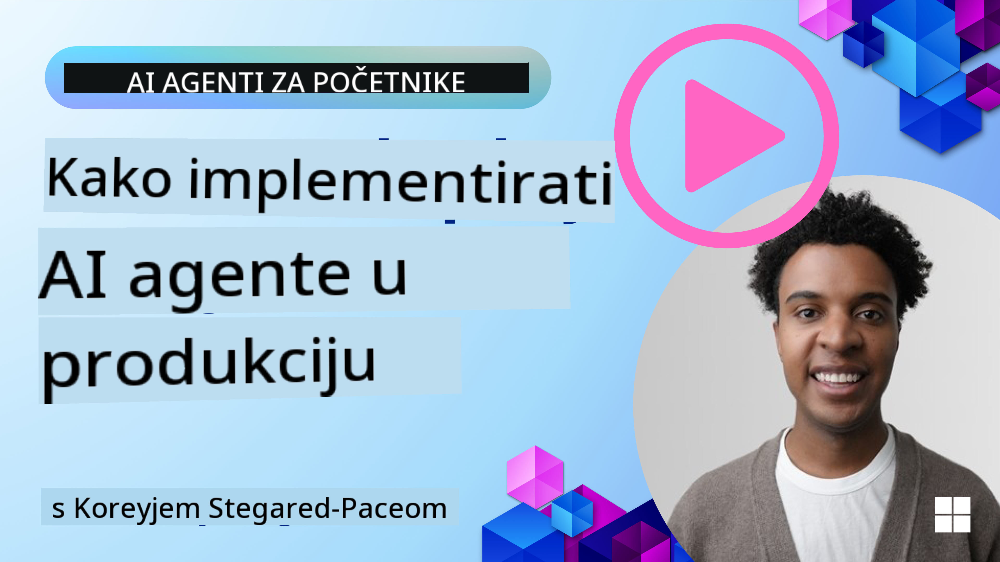

<!--
CO_OP_TRANSLATOR_METADATA:
{
  "original_hash": "cdfd0acc8592c1af14f8637833450375",
  "translation_date": "2025-08-29T23:00:44+00:00",
  "source_file": "10-ai-agents-production/README.md",
  "language_code": "hr"
}
-->
# AI agenti u produkciji: Promatranje i evaluacija

[](https://youtu.be/l4TP6IyJxmQ?si=reGOyeqjxFevyDq9)

Kako AI agenti prelaze iz eksperimentalnih prototipova u stvarne aplikacije, sposobnost razumijevanja njihovog ponašanja, praćenja performansi i sustavne evaluacije njihovih rezultata postaje ključna.

## Ciljevi učenja

Nakon završetka ove lekcije, znat ćete kako/razumjeti:
- Osnovne koncepte promatranja i evaluacije agenata
- Tehnike za poboljšanje performansi, troškova i učinkovitosti agenata
- Što i kako sustavno evaluirati kod svojih AI agenata
- Kako kontrolirati troškove prilikom implementacije AI agenata u produkciju
- Kako instrumentirati agente izgrađene s AutoGen-om

Cilj je opremiti vas znanjem kako biste svoje "crne kutije" agente transformirali u transparentne, upravljive i pouzdane sustave.

_**Napomena:** Važno je implementirati AI agente koji su sigurni i pouzdani. Pogledajte lekciju [Izgradnja pouzdanih AI agenata](./06-building-trustworthy-agents/README.md) za više informacija._

## Tragovi i segmenti

Alati za promatranje poput [Langfuse](https://langfuse.com/) ili [Azure AI Foundry](https://learn.microsoft.com/en-us/azure/ai-foundry/what-is-azure-ai-foundry) obično prikazuju rad agenata kao tragove i segmente.

- **Trag** predstavlja cjelokupni zadatak agenta od početka do kraja (npr. obrada korisničkog upita).
- **Segmenti** su pojedinačni koraci unutar traga (npr. pozivanje jezičnog modela ili dohvaćanje podataka).


Bez promatranja, AI agent može djelovati kao "crna kutija" - njegovo unutarnje stanje i razmišljanje su nejasni, što otežava dijagnosticiranje problema ili optimizaciju performansi. S promatranjem, agenti postaju "staklene kutije", pružajući transparentnost koja je ključna za izgradnju povjerenja i osiguranje da rade kako je predviđeno.

## Zašto je promatranje važno u produkcijskim okruženjima

Prijelaz AI agenata u produkcijska okruženja donosi nove izazove i zahtjeve. Promatranje više nije "lijep dodatak", već ključna sposobnost:

*   **Otklanjanje grešaka i analiza uzroka problema**: Kada agent zakaže ili proizvede neočekivani rezultat, alati za promatranje pružaju tragove potrebne za pronalaženje izvora greške. Ovo je posebno važno kod složenih agenata koji mogu uključivati više poziva LLM-a, interakcije s alatima i uvjetnu logiku.
*   **Upravljanje latencijom i troškovima**: AI agenti često se oslanjaju na LLM-ove i druge vanjske API-je koji se naplaćuju po tokenu ili pozivu. Promatranje omogućuje precizno praćenje tih poziva, pomažući u identificiranju operacija koje su previše spore ili skupe. To omogućuje timovima optimizaciju upita, odabir učinkovitijih modela ili redizajn radnih tokova kako bi upravljali operativnim troškovima i osigurali dobro korisničko iskustvo.
*   **Povjerenje, sigurnost i usklađenost**: U mnogim aplikacijama važno je osigurati da agenti djeluju sigurno i etično. Promatranje pruža revizijski trag radnji i odluka agenta. Ovo se može koristiti za otkrivanje i ublažavanje problema poput ubrizgavanja upita, generiranja štetnog sadržaja ili nepravilnog rukovanja osobnim podacima (PII). Na primjer, možete pregledati tragove kako biste razumjeli zašto je agent dao određeni odgovor ili koristio određeni alat.
*   **Kontinuirani ciklusi poboljšanja**: Podaci o promatranju temelj su iterativnog procesa razvoja. Praćenjem kako agenti rade u stvarnom svijetu, timovi mogu identificirati područja za poboljšanje, prikupiti podatke za fino podešavanje modela i potvrditi učinak promjena. Ovo stvara povratnu petlju u kojoj produkcijski uvidi iz online evaluacije informiraju offline eksperimentiranje i usavršavanje, što dovodi do progresivno boljih performansi agenata.

## Ključne metrike za praćenje

Za praćenje i razumijevanje ponašanja agenata, potrebno je pratiti niz metrika i signala. Iako se specifične metrike mogu razlikovati ovisno o svrsi agenta, neke su univerzalno važne.

Evo nekih od najčešćih metrika koje alati za promatranje prate:

**Latencija:** Koliko brzo agent odgovara? Dugo čekanje negativno utječe na korisničko iskustvo. Trebali biste mjeriti latenciju za zadatke i pojedinačne korake praćenjem rada agenta. Na primjer, agent koji za sve pozive modela treba 20 sekundi mogao bi se ubrzati korištenjem bržeg modela ili paralelnim pokretanjem poziva modela.

**Troškovi:** Koliki je trošak po radu agenta? AI agenti se oslanjaju na LLM pozive koji se naplaćuju po tokenu ili vanjske API-je. Česta upotreba alata ili više upita može brzo povećati troškove. Na primjer, ako agent poziva LLM pet puta za marginalno poboljšanje kvalitete, morate procijeniti je li trošak opravdan ili možete smanjiti broj poziva ili koristiti jeftiniji model. Praćenje u stvarnom vremenu također može pomoći u identificiranju neočekivanih skokova (npr. greške koje uzrokuju prekomjerne API petlje).

**Greške u zahtjevima:** Koliko zahtjeva je agentu neuspjelo? Ovo može uključivati API greške ili neuspjele pozive alata. Kako biste učinili agenta robusnijim u produkciji, možete postaviti rezervne opcije ili ponovne pokušaje. Npr. ako je LLM pružatelj A nedostupan, prebacujete se na LLM pružatelja B kao rezervu.

**Povratne informacije korisnika:** Implementacija izravnih evaluacija korisnika pruža vrijedne uvide. Ovo može uključivati eksplicitne ocjene (👍palac gore/👎dolje, ⭐1-5 zvjezdica) ili tekstualne komentare. Dosljedno negativne povratne informacije trebale bi vas upozoriti jer to ukazuje na to da agent ne radi kako se očekuje.

**Implicitne povratne informacije korisnika:** Ponašanja korisnika pružaju neizravne povratne informacije čak i bez eksplicitnih ocjena. Ovo može uključivati trenutnu preformulaciju pitanja, ponovljene upite ili klik na gumb za ponovni pokušaj. Npr. ako vidite da korisnici opetovano postavljaju isto pitanje, to je znak da agent ne radi kako se očekuje.

**Točnost:** Koliko često agent proizvodi točne ili poželjne rezultate? Definicije točnosti variraju (npr. točnost rješavanja problema, točnost dohvaćanja informacija, zadovoljstvo korisnika). Prvi korak je definirati što uspjeh znači za vašeg agenta. Točnost možete pratiti putem automatiziranih provjera, evaluacijskih ocjena ili oznaka završetka zadatka. Na primjer, označavanje tragova kao "uspješno" ili "neuspješno".

**Automatizirane evaluacijske metrike:** Također možete postaviti automatizirane evaluacije. Na primjer, možete koristiti LLM za ocjenjivanje rezultata agenta, npr. je li koristan, točan ili nije. Postoji i nekoliko open source biblioteka koje pomažu u ocjenjivanju različitih aspekata agenta. Npr. [RAGAS](https://docs.ragas.io/) za RAG agente ili [LLM Guard](https://llm-guard.com/) za otkrivanje štetnog jezika ili ubrizgavanja upita.

U praksi, kombinacija ovih metrika daje najbolji pregled zdravlja AI agenta. U [primjeru bilježnice](./code_samples/10_autogen_evaluation.ipynb) ovog poglavlja pokazat ćemo kako ove metrike izgledaju u stvarnim primjerima, ali prvo ćemo naučiti kako izgleda tipičan evaluacijski tijek rada.

## Instrumentiranje vašeg agenta

Kako biste prikupili podatke o tragovima, trebate instrumentirati svoj kod. Cilj je instrumentirati kod agenta kako bi emitirao tragove i metrike koje se mogu prikupiti, obraditi i vizualizirati pomoću platforme za promatranje.

**OpenTelemetry (OTel):** [OpenTelemetry](https://opentelemetry.io/) se pojavio kao industrijski standard za promatranje LLM-a. Pruža skup API-ja, SDK-ova i alata za generiranje, prikupljanje i izvoz telemetrijskih podataka.

Postoje mnoge biblioteke za instrumentiranje koje obavijaju postojeće okvire agenata i olakšavaju izvoz OpenTelemetry segmenata u alat za promatranje. Ispod je primjer instrumentiranja AutoGen agenta pomoću biblioteke [OpenLit](https://github.com/openlit/openlit):

```python
import openlit

openlit.init(tracer = langfuse._otel_tracer, disable_batch = True)
```

[Primjer bilježnice](./code_samples/10_autogen_evaluation.ipynb) u ovom poglavlju pokazat će kako instrumentirati vaš AutoGen agent.

**Ručno stvaranje segmenata:** Iako biblioteke za instrumentiranje pružaju dobru osnovu, često postoje slučajevi kada je potrebno više detaljnih ili prilagođenih informacija. Možete ručno stvoriti segmente kako biste dodali prilagođenu logiku aplikacije. Još važnije, možete obogatiti automatski ili ručno stvorene segmente prilagođenim atributima (poznatim i kao oznake ili metapodaci). Ti atributi mogu uključivati poslovno specifične podatke, međukalkulacije ili bilo koji kontekst koji bi mogao biti koristan za otklanjanje grešaka ili analizu, poput `user_id`, `session_id` ili `model_version`.

Primjer stvaranja tragova i segmenata ručno pomoću [Langfuse Python SDK-a](https://langfuse.com/docs/sdk/python/sdk-v3):

```python
from langfuse import get_client
 
langfuse = get_client()
 
span = langfuse.start_span(name="my-span")
 
span.end()
```

## Evaluacija agenata

Promatranje nam daje metrike, ali evaluacija je proces analize tih podataka (i provođenja testova) kako bi se utvrdilo koliko dobro AI agent radi i kako se može poboljšati. Drugim riječima, jednom kada imate te tragove i metrike, kako ih koristiti za procjenu agenta i donošenje odluka?

Redovita evaluacija je važna jer su AI agenti često nedeterministički i mogu se mijenjati (kroz ažuriranja ili promjene ponašanja modela) – bez evaluacije, ne biste znali radi li vaš "pametni agent" zapravo dobro ili je nazadovao.

Postoje dvije kategorije evaluacija za AI agente: **online evaluacija** i **offline evaluacija**. Obje su vrijedne i međusobno se nadopunjuju. Obično počinjemo s offline evaluacijom, jer je to minimalni nužni korak prije implementacije bilo kojeg agenta.

### Offline evaluacija


Ovo uključuje evaluaciju agenta u kontroliranom okruženju, obično koristeći testne skupove podataka, a ne upite stvarnih korisnika. Koristite kurirane skupove podataka gdje znate što je očekivani rezultat ili ispravno ponašanje, a zatim pokrećete svog agenta na njima.

Na primjer, ako ste izgradili agenta za matematičke zadatke, mogli biste imati [testni skup podataka](https://huggingface.co/datasets/gsm8k) od 100 problema s poznatim odgovorima. Offline evaluacija često se provodi tijekom razvoja (i može biti dio CI/CD procesa) kako bi se provjerila poboljšanja ili spriječile regresije. Prednost je što je **ponovljiva i možete dobiti jasne metrike točnosti jer imate poznatu istinu**. Također možete simulirati korisničke upite i mjeriti odgovore agenta u odnosu na idealne odgovore ili koristiti automatizirane metrike kao što je gore opisano.

Ključni izazov kod offline evaluacije je osigurati da vaš testni skup podataka bude sveobuhvatan i ostane relevantan – agent može dobro raditi na fiksnom testnom skupu, ali naići na vrlo različite upite u produkciji. Stoga biste trebali ažurirati testne skupove s novim rubnim slučajevima i primjerima koji odražavaju stvarne scenarije​. Korisna je kombinacija malih "testova dima" i većih evaluacijskih skupova: mali skupovi za brze provjere i veći za šire metrike performansi​.

### Online evaluacija


Ovo se odnosi na evaluaciju agenta u stvarnom, stvarnom okruženju, tj. tijekom stvarne upotrebe u produkciji. Online evaluacija uključuje praćenje performansi agenta na stvarnim korisničkim interakcijama i kontinuiranu analizu rezultata.

Na primjer, mogli biste pratiti stope uspjeha, ocjene zadovoljstva korisnika ili druge metrike na stvarnom prometu. Prednost online evaluacije je što **bilježi stvari koje možda ne biste predvidjeli u laboratorijskom okruženju** – možete promatrati promjene modela tijekom vremena (ako se učinkovitost agenta pogoršava kako se obrasci unosa mijenjaju) i uhvatiti neočekivane upite ili situacije koje nisu bile u vašim testnim podacima​. Pruža pravu sliku o tome kako se agent ponaša u stvarnom svijetu.

Online evaluacija često uključuje prikupljanje implicitnih i eksplicitnih povratnih informacija korisnika, kao što je gore opisano, i moguće provođenje testova u sjeni ili A/B testova (gdje nova verzija agenta radi paralelno kako bi se usporedila sa starom). Izazov je što može biti teško dobiti pouzdane oznake ili ocjene za interakcije uživo – možda ćete se osloniti na povratne informacije korisnika ili metrike nizvodno (npr. je li korisnik kliknuo rezultat).

### Kombiniranje dvaju pristupa

Online i offline evaluacije nisu međusobno isključive; one se snažno nadopunjuju. Uvidi iz online praćenja (npr. nove vrste korisničkih upita gdje agent loše radi) mogu se koristiti za proširenje i poboljšanje offline testnih skupova podataka. S druge strane, agenti koji dobro rade u offline testovima mogu se s više povjerenja implementirati i pratiti online.

Zapravo, mnogi timovi usvajaju petlju:

_evaluacija offline -> implementacija -> praćenje online -> prikupljanje novih slučajeva neuspjeha -> dodavanje u offline skup podataka -> usavršavanje agenta -> ponavljanje_.

## Uobičajeni problemi

Kada implementirate AI agente u produkciju, možete naići na razne izazove. Evo nekih uobičajenih problema i njihovih mogućih rješenja:

| **Problem**    | **Moguće rješenje**   |
| ------------- | ------------------ |
| AI agent ne obavlja zadatke dosljedno | - Poboljšajte upit koji se daje AI agentu; budite jasni u ciljevima.<br>- Identificirajte gdje podjela zadataka na podzadatke i njihovo rukovanje od strane više agenata može pomoći. |
| AI agent ulazi u kontinuirane petlje  | - Osigurajte da imate jasne uvjete za prekid kako bi agent znao kada zaustaviti proces. |

- Za složene zadatke koji zahtijevaju razmišljanje i planiranje, koristite veći model specijaliziran za zadatke zaključivanja. |
| AI Agent alati ne daju dobre rezultate   | - Testirajte i provjerite izlaz alata izvan sustava agenta.<br>- Poboljšajte definirane parametre, upite i nazive alata.  |
| Višeagentski sustav ne radi dosljedno | - Poboljšajte upite za svakog agenta kako bi bili specifični i različiti jedni od drugih.<br>- Izgradite hijerarhijski sustav koristeći "usmjerivača" ili kontrolnog agenta za određivanje koji je agent ispravan. |

Mnogi od ovih problema mogu se učinkovitije identificirati uz postavljenu mogućnost praćenja. Tragovi i metrike koje smo ranije spomenuli pomažu precizno odrediti gdje u tijeku rada agenta dolazi do problema, čineći otklanjanje grešaka i optimizaciju mnogo učinkovitijima.

## Upravljanje troškovima

Evo nekoliko strategija za upravljanje troškovima implementacije AI agenata u produkciji:

**Korištenje manjih modela:** Mali jezični modeli (SLM) mogu dobro obavljati određene zadatke u agentičkim slučajevima upotrebe i značajno smanjiti troškove. Kao što je ranije spomenuto, izgradnja sustava za evaluaciju kako bi se odredila i usporedila izvedba u odnosu na veće modele najbolji je način za razumijevanje kako će SLM raditi za vaš slučaj upotrebe. Razmotrite korištenje SLM-ova za jednostavnije zadatke poput klasifikacije namjere ili ekstrakcije parametara, dok veće modele rezervirate za složenije zadatke zaključivanja.

**Korištenje modela usmjerivača:** Slična strategija je korištenje raznolikosti modela i veličina. Možete koristiti LLM/SLM ili serverless funkciju za usmjeravanje zahtjeva na temelju složenosti prema modelima koji najbolje odgovaraju. Ovo će također pomoći u smanjenju troškova, a istovremeno osigurati izvedbu za odgovarajuće zadatke. Na primjer, usmjerite jednostavne upite prema manjim, bržim modelima, a skupe velike modele koristite samo za složene zadatke zaključivanja.

**Keširanje odgovora:** Identificiranje uobičajenih zahtjeva i zadataka te pružanje odgovora prije nego što prođu kroz vaš agentički sustav dobar je način za smanjenje volumena sličnih zahtjeva. Čak možete implementirati tijek rada za određivanje koliko je zahtjev sličan vašim keširanim zahtjevima koristeći osnovnije AI modele. Ova strategija može značajno smanjiti troškove za često postavljana pitanja ili uobičajene tijekove rada.

## Pogledajmo kako ovo funkcionira u praksi

U [primjeru bilježnice ovog odjeljka](./code_samples/10_autogen_evaluation.ipynb), vidjet ćemo primjere kako možemo koristiti alate za praćenje i evaluaciju naših agenata.

### Imate još pitanja o AI agentima u produkciji?

Pridružite se [Azure AI Foundry Discordu](https://aka.ms/ai-agents/discord) kako biste se povezali s drugim učenicima, sudjelovali u uredskim satima i dobili odgovore na svoja pitanja o AI agentima.

## Prethodna lekcija

[Metakognitivni dizajnerski obrazac](../09-metacognition/README.md)

## Sljedeća lekcija

[Agentički protokoli](../11-agentic-protocols/README.md)

---

**Odricanje od odgovornosti**:  
Ovaj dokument je preveden korištenjem AI usluge za prevođenje [Co-op Translator](https://github.com/Azure/co-op-translator). Iako nastojimo osigurati točnost, imajte na umu da automatski prijevodi mogu sadržavati pogreške ili netočnosti. Izvorni dokument na izvornom jeziku treba smatrati mjerodavnim izvorom. Za ključne informacije preporučuje se profesionalni prijevod od strane stručnjaka. Ne preuzimamo odgovornost za bilo kakve nesporazume ili pogrešne interpretacije proizašle iz korištenja ovog prijevoda.