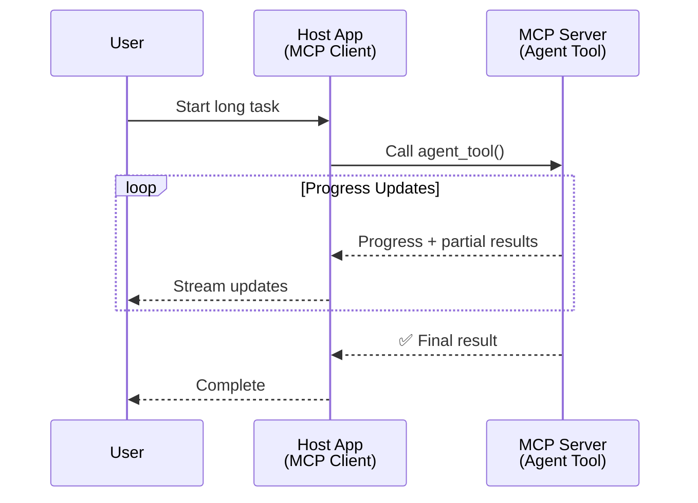
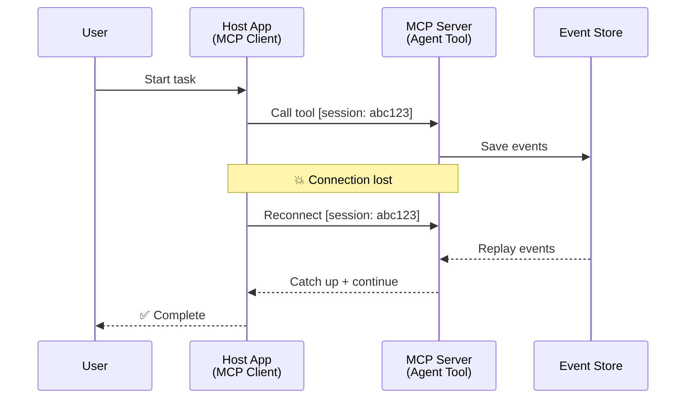
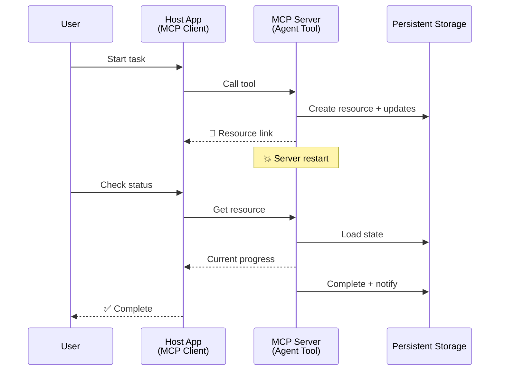
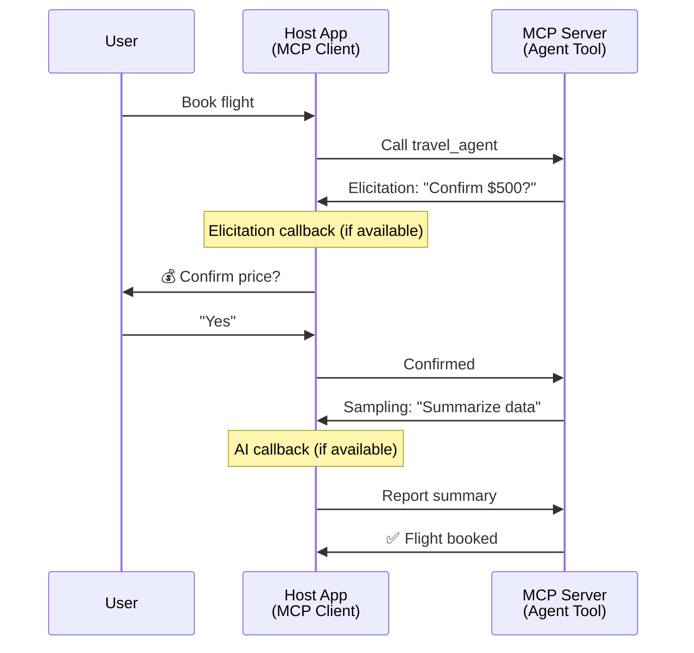
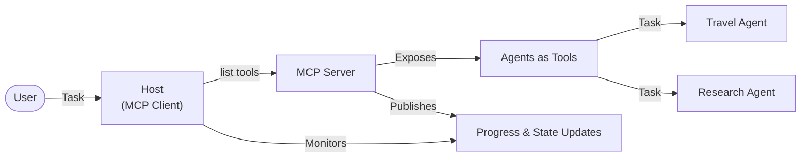

<!--
CO_OP_TRANSLATOR_METADATA:
{
  "original_hash": "5cc6836626047aa055e8960c8484a7d0",
  "translation_date": "2025-08-30T00:12:21+00:00",
  "source_file": "11-agentic-protocols/code_samples/mcp-agents/README.md",
  "language_code": "hr"
}
-->
# Izgradnja sustava komunikacije između agenata pomoću MCP-a

> Ukratko - Možete li izgraditi komunikaciju Agent2Agent na MCP-u? Da!

MCP se značajno razvio izvan svoje izvorne svrhe "pružanja konteksta LLM-ovima". S nedavnim poboljšanjima, uključujući [streamove koji se mogu nastaviti](https://modelcontextprotocol.io/docs/concepts/transports#resumability-and-redelivery), [elicitation](https://modelcontextprotocol.io/specification/2025-06-18/client/elicitation), [sampling](https://modelcontextprotocol.io/specification/2025-06-18/client/sampling) i obavijesti ([napredak](https://modelcontextprotocol.io/specification/2025-06-18/basic/utilities/progress) i [resursi](https://modelcontextprotocol.io/specification/2025-06-18/schema#resourceupdatednotification)), MCP sada pruža snažnu osnovu za izgradnju složenih sustava komunikacije između agenata.

## Zabluda o agentima i alatima

Kako sve više programera istražuje alate s agentnim ponašanjem (dugotrajno izvršavanje, potreba za dodatnim unosom tijekom izvršavanja itd.), često se javlja zabluda da MCP nije prikladan, uglavnom zbog ranih primjera njegovog primitivnog alata koji su se fokusirali na jednostavne obrasce zahtjev-odgovor.

Ova percepcija je zastarjela. MCP specifikacija značajno je poboljšana tijekom posljednjih nekoliko mjeseci s mogućnostima koje zatvaraju jaz za izgradnju dugotrajnih agentnih ponašanja:

- **Streaming i djelomični rezultati**: Ažuriranja napretka u stvarnom vremenu tijekom izvršavanja
- **Mogućnost nastavka**: Klijenti se mogu ponovno povezati i nastaviti nakon prekida veze
- **Trajnost**: Rezultati preživljavaju ponovno pokretanje servera (npr. putem poveznica na resurse)
- **Višekratna interakcija**: Interaktivni unos tijekom izvršavanja putem elicitation i sampling

Ove značajke mogu se kombinirati kako bi omogućile složene aplikacije s agentima i više agenata, sve implementirane na MCP protokolu.

Za referencu, agent ćemo nazvati "alatom" koji je dostupan na MCP serveru. To podrazumijeva postojanje host aplikacije koja implementira MCP klijent koji uspostavlja sesiju s MCP serverom i može pozvati agenta.

## Što čini MCP alat "agentnim"?

Prije nego što se upustimo u implementaciju, definirajmo koje su infrastrukturne mogućnosti potrebne za podršku dugotrajnih agenata.

> Definirat ćemo agenta kao entitet koji može autonomno djelovati tijekom duljih vremenskih razdoblja, sposoban za obavljanje složenih zadataka koji mogu zahtijevati višestruke interakcije ili prilagodbe na temelju povratnih informacija u stvarnom vremenu.

### 1. Streaming i djelomični rezultati

Tradicionalni obrasci zahtjev-odgovor ne funkcioniraju za dugotrajne zadatke. Agentima je potrebno omogućiti:

- Ažuriranja napretka u stvarnom vremenu
- Međurezultate

**Podrška MCP-a**: Obavijesti o ažuriranju resursa omogućuju streaming djelomičnih rezultata, iako to zahtijeva pažljiv dizajn kako bi se izbjegli sukobi s 1:1 modelom zahtjev/odgovor JSON-RPC-a.

| Značajka                  | Primjena                                                                                                                                                                       | Podrška MCP-a                                                                              |
| -------------------------- | ------------------------------------------------------------------------------------------------------------------------------------------------------------------------------ | ------------------------------------------------------------------------------------------ |
| Ažuriranja napretka u stvarnom vremenu | Korisnik zahtijeva zadatak migracije kodne baze. Agent streama napredak: "10% - Analiza ovisnosti... 25% - Pretvaranje TypeScript datoteka... 50% - Ažuriranje uvoza..."          | ✅ Obavijesti o napretku                                                                  |
| Djelomični rezultati            | Zadatak "Generiraj knjigu" streama djelomične rezultate, npr. 1) Okvir priče, 2) Popis poglavlja, 3) Svako poglavlje kako se dovrši. Host može pregledati, otkazati ili preusmjeriti u bilo kojoj fazi. | ✅ Obavijesti se mogu "proširiti" kako bi uključile djelomične rezultate, vidi prijedloge na PR 383, 776 |

<div align="center" style="font-style: italic; font-size: 0.95em; margin-bottom: 0.5em;">
<strong>Slika 1:</strong> Ovaj dijagram ilustrira kako MCP agent streama ažuriranja napretka u stvarnom vremenu i djelomične rezultate host aplikaciji tijekom dugotrajnog zadatka, omogućujući korisniku praćenje izvršavanja u stvarnom vremenu.
</div>



### 2. Mogućnost nastavka

Agenti moraju elegantno upravljati prekidima mreže:

- Ponovno povezivanje nakon prekida veze (klijent)
- Nastavak od mjesta gdje su stali (ponovno slanje poruka)

**Podrška MCP-a**: MCP StreamableHTTP transport danas podržava nastavak sesije i ponovno slanje poruka s ID-ovima sesije i ID-ovima posljednjih događaja. Važno je napomenuti da server mora implementirati EventStore koji omogućuje ponovno slanje događaja pri ponovnom povezivanju klijenta.  
Napomena: postoji prijedlog zajednice (PR #975) koji istražuje transportno neovisne streamove koji se mogu nastaviti.

| Značajka      | Primjena                                                                                                                                                   | Podrška MCP-a                                                                |
| ------------ | ---------------------------------------------------------------------------------------------------------------------------------------------------------- | -------------------------------------------------------------------------- |
| Mogućnost nastavka | Klijent se prekida tijekom dugotrajnog zadatka. Pri ponovnom povezivanju, sesija se nastavlja s propuštenim događajima koji se ponovno šalju, nastavljajući bez prekida. | ✅ StreamableHTTP transport s ID-ovima sesije, ponovnim slanjem događaja i EventStore |

<div align="center" style="font-style: italic; font-size: 0.95em; margin-bottom: 0.5em;">
<strong>Slika 2:</strong> Ovaj dijagram prikazuje kako MCP-ov StreamableHTTP transport i EventStore omogućuju besprijekoran nastavak sesije: ako se klijent prekine, može se ponovno povezati i ponovno poslati propuštene događaje, nastavljajući zadatak bez gubitka napretka.
</div>



### 3. Trajnost

Dugotrajni agenti trebaju trajno stanje:

- Rezultati preživljavaju ponovno pokretanje servera
- Status se može dohvatiti izvan sesije
- Praćenje napretka kroz sesije

**Podrška MCP-a**: MCP sada podržava tip povratka Resource link za pozive alata. Danas je mogući obrazac dizajnirati alat koji stvara resurs i odmah vraća poveznicu na resurs. Alat može nastaviti rješavati zadatak u pozadini i ažurirati resurs. S druge strane, klijent može odabrati provjeru stanja ovog resursa kako bi dobio djelomične ili potpune rezultate (na temelju ažuriranja resursa koje server pruža) ili se pretplatiti na resurs za obavijesti o ažuriranju.

Jedno ograničenje ovdje je da provjera resursa ili pretplata na ažuriranja može trošiti resurse s implikacijama na skalabilnost. Postoji otvoreni prijedlog zajednice (uključujući #992) koji istražuje mogućnost uključivanja webhooks ili okidača koje server može pozvati kako bi obavijestio klijenta/host aplikaciju o ažuriranjima.

| Značajka    | Primjena                                                                                                                                        | Podrška MCP-a                                                        |
| ---------- | ----------------------------------------------------------------------------------------------------------------------------------------------- | ------------------------------------------------------------------ |
| Trajnost | Server se ruši tijekom zadatka migracije podataka. Rezultati i napredak preživljavaju ponovno pokretanje, klijent može provjeriti status i nastaviti iz trajnog resursa. | ✅ Poveznice na resurse s trajnim pohranom i obavijestima o statusu |

Danas je uobičajen obrazac dizajnirati alat koji stvara resurs i odmah vraća poveznicu na resurs. Alat može u pozadini rješavati zadatak, izdavati obavijesti o resursima koje služe kao ažuriranja napretka ili uključuju djelomične rezultate te ažurirati sadržaj u resursu prema potrebi.

<div align="center" style="font-style: italic; font-size: 0.95em; margin-bottom: 0.5em;">
<strong>Slika 3:</strong> Ovaj dijagram pokazuje kako MCP agenti koriste trajne resurse i obavijesti o statusu kako bi osigurali da dugotrajni zadaci prežive ponovno pokretanje servera, omogućujući klijentima provjeru napretka i dohvaćanje rezultata čak i nakon neuspjeha.
</div>



### 4. Višekratne interakcije

Agenti često trebaju dodatni unos tijekom izvršavanja:

- Ljudsko pojašnjenje ili odobrenje
- AI pomoć za složene odluke
- Dinamičko podešavanje parametara

**Podrška MCP-a**: Potpuno podržano putem sampling (za AI unos) i elicitation (za ljudski unos).

| Značajka                 | Primjena                                                                                                                                     | Podrška MCP-a                                           |
| ----------------------- | -------------------------------------------------------------------------------------------------------------------------------------------- | ----------------------------------------------------- |
| Višekratne interakcije | Agent za rezervaciju putovanja traži potvrdu cijene od korisnika, zatim traži od AI-a da sažme podatke o putovanju prije dovršetka transakcije rezervacije. | ✅ Elicitation za ljudski unos, sampling za AI unos |

<div align="center" style="font-style: italic; font-size: 0.95em; margin-bottom: 0.5em;">
<strong>Slika 4:</strong> Ovaj dijagram prikazuje kako MCP agenti mogu interaktivno tražiti ljudski unos ili zatražiti AI pomoć tijekom izvršavanja, podržavajući složene, višekratne radne tokove poput potvrda i dinamičkog donošenja odluka.
</div>



## Implementacija dugotrajnih agenata na MCP-u - Pregled koda

Kao dio ovog članka, pružamo [repozitorij koda](https://github.com/victordibia/ai-tutorials/tree/main/MCP%20Agents) koji sadrži kompletnu implementaciju dugotrajnih agenata koristeći MCP Python SDK sa StreamableHTTP transportom za nastavak sesije i ponovno slanje poruka. Implementacija pokazuje kako se MCP mogućnosti mogu kombinirati za omogućavanje sofisticiranih ponašanja nalik agentima.

Konkretno, implementiramo server s dva primarna alata agenta:

- **Agent za putovanja** - Simulira uslugu rezervacije putovanja s potvrdom cijene putem elicitation
- **Agent za istraživanje** - Obavlja istraživačke zadatke s AI-pomoćnim sažecima putem sampling

Oba agenta demonstriraju ažuriranja napretka u stvarnom vremenu, interaktivne potvrde i potpune mogućnosti nastavka sesije.

### Ključni koncepti implementacije

Sljedeći odjeljci prikazuju implementaciju agenta na strani servera i rukovanje hostom na strani klijenta za svaku mogućnost:

#### Streaming i ažuriranja napretka - Status zadatka u stvarnom vremenu

Streaming omogućuje agentima pružanje ažuriranja napretka u stvarnom vremenu tijekom dugotrajnih zadataka, informirajući korisnike o statusu zadatka i međurezultatima.

**Implementacija na serveru (agent šalje obavijesti o napretku):**

```python
# From server/server.py - Travel agent sending progress updates
for i, step in enumerate(steps):
    await ctx.session.send_progress_notification(
        progress_token=ctx.request_id,
        progress=i * 25,
        total=100,
        message=step,
        related_request_id=str(ctx.request_id)
    )
    await anyio.sleep(2)  # Simulate work

# Alternative: Log messages for detailed step-by-step updates
await ctx.session.send_log_message(
    level="info",
    data=f"Processing step {current_step}/{steps} ({progress_percent}%)",
    logger="long_running_agent",
    related_request_id=ctx.request_id,
)
```

**Implementacija na klijentu (host prima ažuriranja napretka):**

```python
# From client/client.py - Client handling real-time notifications
async def message_handler(message) -> None:
    if isinstance(message, types.ServerNotification):
        if isinstance(message.root, types.LoggingMessageNotification):
            console.print(f"📡 [dim]{message.root.params.data}[/dim]")
        elif isinstance(message.root, types.ProgressNotification):
            progress = message.root.params
            console.print(f"🔄 [yellow]{progress.message} ({progress.progress}/{progress.total})[/yellow]")

# Register message handler when creating session
async with ClientSession(
    read_stream, write_stream,
    message_handler=message_handler
) as session:
```

#### Elicitation - Traženje korisničkog unosa

Elicitation omogućuje agentima traženje korisničkog unosa tijekom izvršavanja. Ovo je ključno za potvrde, pojašnjenja ili odobrenja tijekom dugotrajnih zadataka.

**Implementacija na serveru (agent traži potvrdu):**

```python
# From server/server.py - Travel agent requesting price confirmation
elicit_result = await ctx.session.elicit(
    message=f"Please confirm the estimated price of $1200 for your trip to {destination}",
    requestedSchema=PriceConfirmationSchema.model_json_schema(),
    related_request_id=ctx.request_id,
)

if elicit_result and elicit_result.action == "accept":
    # Continue with booking
    logger.info(f"User confirmed price: {elicit_result.content}")
elif elicit_result and elicit_result.action == "decline":
    # Cancel the booking
    booking_cancelled = True
```

**Implementacija na klijentu (host pruža callback za elicitation):**

```python
# From client/client.py - Client handling elicitation requests
async def elicitation_callback(context, params):
    console.print(f"💬 Server is asking for confirmation:")
    console.print(f"   {params.message}")

    response = console.input("Do you accept? (y/n): ").strip().lower()

    if response in ['y', 'yes']:
        return types.ElicitResult(
            action="accept",
            content={"confirm": True, "notes": "Confirmed by user"}
        )
    else:
        return types.ElicitResult(
            action="decline",
            content={"confirm": False, "notes": "Declined by user"}
        )

# Register the callback when creating the session
async with ClientSession(
    read_stream, write_stream,
    elicitation_callback=elicitation_callback
) as session:
```

#### Sampling - Traženje AI pomoći

Sampling omogućuje agentima traženje pomoći LLM-a za složene odluke ili generiranje sadržaja tijekom izvršavanja. Ovo omogućuje hibridne radne tokove čovjek-AI.

**Implementacija na serveru (agent traži AI pomoć):**

```python
# From server/server.py - Research agent requesting AI summary
sampling_result = await ctx.session.create_message(
    messages=[
        SamplingMessage(
            role="user",
            content=TextContent(type="text", text=f"Please summarize the key findings for research on: {topic}")
        )
    ],
    max_tokens=100,
    related_request_id=ctx.request_id,
)

if sampling_result and sampling_result.content:
    if sampling_result.content.type == "text":
        sampling_summary = sampling_result.content.text
        logger.info(f"Received sampling summary: {sampling_summary}")
```

**Implementacija na klijentu (host pruža callback za sampling):**

```python
# From client/client.py - Client handling sampling requests
async def sampling_callback(context, params):
    message_text = params.messages[0].content.text if params.messages else 'No message'
    console.print(f"🧠 Server requested sampling: {message_text}")

    # In a real application, this could call an LLM API
    # For demo purposes, we provide a mock response
    mock_response = "Based on current research, MCP has evolved significantly..."

    return types.CreateMessageResult(
        role="assistant",
        content=types.TextContent(type="text", text=mock_response),
        model="interactive-client",
        stopReason="endTurn"
    )

# Register the callback when creating the session
async with ClientSession(
    read_stream, write_stream,
    sampling_callback=sampling_callback,
    elicitation_callback=elicitation_callback
) as session:
```

#### Mogućnost nastavka - Kontinuitet sesije tijekom prekida veze

Mogućnost nastavka osigurava da dugotrajni zadaci agenta mogu preživjeti prekide veze klijenta i nastaviti besprijekorno pri ponovnom povezivanju. Ovo se implementira putem EventStore-a i tokena za nastavak.

**Implementacija EventStore-a (server drži stanje sesije):**

```python
# From server/event_store.py - Simple in-memory event store
class SimpleEventStore(EventStore):
    def __init__(self):
        self._events: list[tuple[StreamId, EventId, JSONRPCMessage]] = []
        self._event_id_counter = 0

    async def store_event(self, stream_id: StreamId, message: JSONRPCMessage) -> EventId:
        """Store an event and return its ID."""
        self._event_id_counter += 1
        event_id = str(self._event_id_counter)
        self._events.append((stream_id, event_id, message))
        return event_id

    async def replay_events_after(self, last_event_id: EventId, send_callback: EventCallback) -> StreamId | None:
        """Replay events after the specified ID for resumption."""
        # Find events after the last known event and replay them
        for _, event_id, message in self._events[start_index:]:
            await send_callback(EventMessage(message, event_id))

# From server/server.py - Passing event store to session manager
def create_server_app(event_store: Optional[EventStore] = None) -> Starlette:
    server = ResumableServer()

    # Create session manager with event store for resumption
    session_manager = StreamableHTTPSessionManager(
        app=server,
        event_store=event_store,  # Event store enables session resumption
        json_response=False,
        security_settings=security_settings,
    )

    return Starlette(routes=[Mount("/mcp", app=session_manager.handle_request)])

# Usage: Initialize with event store
event_store = SimpleEventStore()
app = create_server_app(event_store)
```

**Metapodaci klijenta s tokenom za nastavak (klijent se ponovno povezuje koristeći pohranjeno stanje):**

```python
# From client/client.py - Client resumption with metadata
if existing_tokens and existing_tokens.get("resumption_token"):
    # Use existing resumption token to continue where we left off
    metadata = ClientMessageMetadata(
        resumption_token=existing_tokens["resumption_token"],
    )
else:
    # Create callback to save resumption token when received
    def enhanced_callback(token: str):
        protocol_version = getattr(session, 'protocol_version', None)
        token_manager.save_tokens(session_id, token, protocol_version, command, args)

    metadata = ClientMessageMetadata(
        on_resumption_token_update=enhanced_callback,
    )

# Send request with resumption metadata
result = await session.send_request(
    types.ClientRequest(
        types.CallToolRequest(
            method="tools/call",
            params=types.CallToolRequestParams(name=command, arguments=args)
        )
    ),
    types.CallToolResult,
    metadata=metadata,
)
```

Host aplikacija lokalno održava ID-ove sesija i tokene za nastavak, omogućujući ponovno povezivanje s postojećim sesijama bez gubitka napretka ili stanja.

### Organizacija koda

<div align="center" style="font-style: italic; font-size: 0.95em; margin-bottom: 0.5em;">
<strong>Slika 5:</strong> Arhitektura sustava agenata temeljenog na MCP-u
</div>



**Ključne datoteke:**

- **`server/server.py`** - MCP server s mogućnošću nastavka, s agentima za putovanja i istraživanje koji demonstriraju elicitation, sampling i ažuriranja napretka
- **`client/client.py`** - Interaktivna host aplikacija s podrškom za nastavak, callback handlerima i upravljanjem tokenima
- **`server/event_store.py`** - Implementacija EventStore-a koja omogućuje nastavak sesije i ponovno slanje poruka

## Proširenje na komunikaciju između više agenata na MCP-u

Gore navedena implementacija može se proširiti na sustave s više agenata poboljšanjem inteligencije i opsega host aplikacije:

- **Inteligentna dekompozicija zadataka**: Host analizira složene korisničke zahtjeve i razlaže ih na podzadatke za različite specijalizirane agente
- **Koordinacija više servera**: Host održava veze s više MCP servera, od kojih svaki izlaže različite mogućnosti agenata
- **Upravljanje stanjem zadatka**: Host prati napredak kroz više istovremenih zadataka agenata, upravljajući ovisnostima i redoslijedom
- **Otpornost i ponovni pokušaji**: Host upravlja neuspjesima, implementira logiku ponovnog pokušaja i preusmjerava zadatke kada agenti postanu nedostupni
- **Sintetiziranje rezultata**: Host kombinira izlaze iz više agenata u koherentne konačne rezultate

Host se razvija od jednostavnog klijenta do inteligentnog orkestratora, koordinirajući distribuirane mogućnosti agenata dok održava istu MCP protokolnu osnovu.

## Zaključak

Poboljšane mogućnosti MCP-a - obavijesti o resursima, elicitation/sampling, streamovi koji se mogu nastaviti i trajni resursi - omogućuju složene interakcije između agenata uz održavanje jednostavnosti protokola.

## Početak rada

Spremni za izgradnju vlastitog sustava Agent2Agent? Slijedite ove korake:

### 1. Pokrenite demo

```bash
# Start the server with event store for resumption
python -m server.server --port 8006

# In another terminal, run the interactive client
python -m client.client --url http://127.0.0.1:8006/mcp
```

**Dostupne naredbe u interaktivnom načinu:**

- `travel_agent` - Rezervirajte putovanje s potvrdom cijene putem elicitation
- `research_agent` - Istražujte teme s AI-pomoćnim sažecima putem sampling
- `list` - Prikaži sve dostupne alate
- `clean-tokens` - Očistite tokene za nastavak
- `help` - Prikaži detaljnu pomoć za naredbe
- `quit` - Izađite iz klijenta

### 2. Testirajte mogućnosti nastavka

- Pokrenite dugotrajni agent (npr. `travel_agent`)
- Prekinite klijenta tijekom izvršavanja (Ctrl+C)
- Ponovno pokrenite klijenta - automatski će nastaviti od mjesta gdje je stao

### 3. Istražite i proširite

- **Istražite primjere**: Pogledajte ovaj [mcp-agents](https://github.com/victordibia/ai-tutorials/tree/main/MCP%20Agents)
- **Pridružite se zajednici**: Sudjelujte u MCP raspravama na GitHubu
- **Eksperimentirajte**: Započnite s jednostavnim dugotrajnim zadatkom i postupno dodajte streaming, mogućnost nastavka i koordinaciju više agenata

Ovo pokazuje kako MCP omogućuje inteligentna ponašanja agenata uz održavanje jednostavnosti

---

**Odricanje od odgovornosti**:  
Ovaj dokument je preveden pomoću AI usluge za prevođenje [Co-op Translator](https://github.com/Azure/co-op-translator). Iako nastojimo osigurati točnost, imajte na umu da automatski prijevodi mogu sadržavati pogreške ili netočnosti. Izvorni dokument na izvornom jeziku treba smatrati autoritativnim izvorom. Za ključne informacije preporučuje se profesionalni prijevod od strane ljudskog prevoditelja. Ne preuzimamo odgovornost za nesporazume ili pogrešne interpretacije koje mogu proizaći iz korištenja ovog prijevoda.