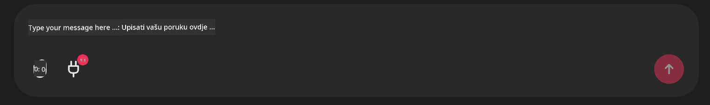

<!--
CO_OP_TRANSLATOR_METADATA:
{
  "original_hash": "9bf0395cbc541ce8db2a9699c8678dfc",
  "translation_date": "2025-07-12T14:25:05+00:00",
  "source_file": "11-mcp/code_samples/github-mcp/README.md",
  "language_code": "hr"
}
-->
# Github MCP Server Primjer

## Opis

Ovo je demo napravljen za AI Agents Hackathon održan kroz Microsoft Reactor.

Alat se koristi za preporuku hackathon projekata na temelju korisnikovih Github repozitorija.  
To se postiže na sljedeći način:

1. **Github Agent** - Koristi Github MCP Server za dohvat repozitorija i informacija o tim repozitorijima.  
2. **Hackathon Agent** - Uzima podatke od Github Agenta i smišlja kreativne ideje za hackathon projekte na temelju projekata, programskih jezika koje korisnik koristi i tema projekata za AI Agents hackathon.  
3. **Events Agent** - Na temelju prijedloga hackathon agenta, Events Agent preporučuje relevantne događaje iz serije AI Agent Hackathon.

## Pokretanje koda

### Varijable okoline

Ovaj demo koristi Azure Open AI Service, Semantic Kernel, Github MCP Server i Azure AI Search.

Provjerite imate li ispravno postavljene varijable okoline za korištenje ovih alata:

```python
AZURE_OPENAI_CHAT_DEPLOYMENT_NAME=""
AZURE_OPENAI_EMBEDDING_DEPLOYMENT_NAME=""
AZURE_OPENAI_ENDPOINT=""
AZURE_OPENAI_API_KEY=""
AZURE_OPENAI_API_VERSION=""
AZURE_SEARCH_SERVICE_ENDPOINT=""
AZURE_SEARCH_API_KEY=""
```

## Pokretanje Chainlit Servera

Za povezivanje s MCP serverom, ovaj demo koristi Chainlit kao chat sučelje.

Za pokretanje servera, u terminal unesite sljedeću naredbu:

```bash
chainlit run app.py -w
```

Ovo bi trebalo pokrenuti vaš Chainlit server na `localhost:8000` i istovremeno popuniti vaš Azure AI Search Index sadržajem iz `event-descriptions.md`.

## Povezivanje s MCP Serverom

Za povezivanje s Github MCP Serverom, odaberite ikonu "plug" ispod chat okvira "Type your message here..":



Zatim kliknite na "Connect an MCP" da dodate naredbu za povezivanje s Github MCP Serverom:

```bash
npx -y @modelcontextprotocol/server-github --env GITHUB_PERSONAL_ACCESS_TOKEN=[YOUR PERSONAL ACCESS TOKEN]
```

Zamijenite "[YOUR PERSONAL ACCESS TOKEN]" sa svojim stvarnim Personal Access Tokenom.

Nakon povezivanja, trebali biste vidjeti (1) pored ikone plug kao potvrdu da je veza uspostavljena. Ako ne, pokušajte ponovno pokrenuti chainlit server s `chainlit run app.py -w`.

## Korištenje Demo-a

Za pokretanje tijeka rada agenta koji preporučuje hackathon projekte, možete upisati poruku poput:

"Recommend hackathon projects for the Github user koreyspace"

Router Agent će analizirati vaš zahtjev i odrediti koja kombinacija agenata (GitHub, Hackathon i Events) je najbolje prilagođena za obradu vašeg upita. Agenti surađuju kako bi pružili sveobuhvatne preporuke na temelju analize Github repozitorija, ideja za projekte i relevantnih tehnoloških događaja.

**Odricanje od odgovornosti**:  
Ovaj dokument je preveden korištenjem AI usluge za prevođenje [Co-op Translator](https://github.com/Azure/co-op-translator). Iako težimo točnosti, imajte na umu da automatski prijevodi mogu sadržavati pogreške ili netočnosti. Izvorni dokument na izvornom jeziku treba smatrati autoritativnim izvorom. Za kritične informacije preporučuje se profesionalni ljudski prijevod. Ne snosimo odgovornost za bilo kakva nesporazuma ili pogrešna tumačenja koja proizlaze iz korištenja ovog prijevoda.