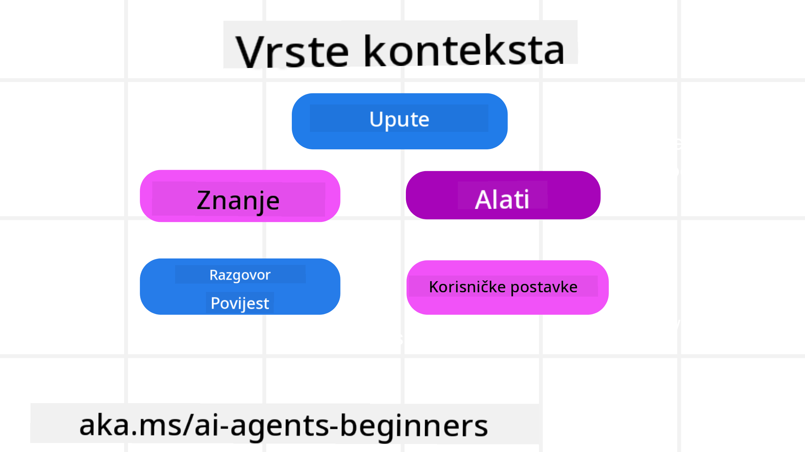
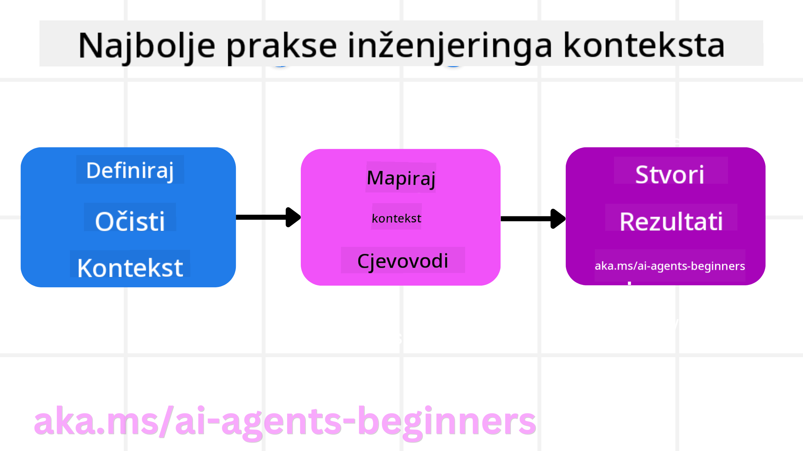

<!--
CO_OP_TRANSLATOR_METADATA:
{
  "original_hash": "cb7e50f471905ce6fdb92a30269a7a98",
  "translation_date": "2025-09-04T10:30:24+00:00",
  "source_file": "12-context-engineering/README.md",
  "language_code": "hr"
}
-->
# Inženjering konteksta za AI agente

> _(Kliknite na sliku iznad za video lekcije)_

Razumijevanje složenosti aplikacije za koju gradite AI agenta ključno je za stvaranje pouzdanog sustava. Potrebno je razviti AI agente koji učinkovito upravljaju informacijama kako bi zadovoljili složene potrebe koje nadilaze samo inženjering upita.

U ovoj lekciji istražit ćemo što je inženjering konteksta i njegovu ulogu u izgradnji AI agenata.

## Uvod

Ova lekcija obuhvaća:

• **Što je inženjering konteksta** i zašto se razlikuje od inženjeringa upita.

• **Strategije za učinkovit inženjering konteksta**, uključujući pisanje, odabir, kompresiju i izolaciju informacija.

• **Uobičajene greške u kontekstu** koje mogu omesti vašeg AI agenta i kako ih riješiti.

## Ciljevi učenja

Nakon završetka ove lekcije, znat ćete kako:

• **Definirati inženjering konteksta** i razlikovati ga od inženjeringa upita.

• **Identificirati ključne komponente konteksta** u aplikacijama koje koriste velike jezične modele (LLM).

• **Primijeniti strategije za pisanje, odabir, kompresiju i izolaciju konteksta** kako biste poboljšali performanse agenta.

• **Prepoznati uobičajene greške u kontekstu** poput trovanja, distrakcije, konfuzije i sukoba te implementirati tehnike za njihovo ublažavanje.

## Što je inženjering konteksta?

Za AI agente, kontekst je ono što usmjerava planiranje AI agenta da poduzme određene radnje. Inženjering konteksta je praksa osiguravanja da AI agent ima prave informacije za dovršavanje sljedećeg koraka zadatka. Prozor konteksta je ograničen veličinom, pa kao graditelji agenata moramo razviti sustave i procese za upravljanje dodavanjem, uklanjanjem i sažimanjem informacija u prozoru konteksta.

### Inženjering upita vs. inženjering konteksta

Inženjering upita fokusira se na skup statičkih uputa za učinkovito vođenje AI agenata prema pravilima. Inženjering konteksta odnosi se na upravljanje dinamičkim skupom informacija, uključujući početni upit, kako bi se osiguralo da AI agent ima ono što mu je potrebno tijekom vremena. Glavna ideja inženjeringa konteksta je učiniti ovaj proces ponovljivim i pouzdanim.

### Vrste konteksta

Važno je zapamtiti da kontekst nije samo jedna stvar. Informacije koje AI agent treba mogu dolaziti iz različitih izvora, a na nama je da osiguramo da agent ima pristup tim izvorima:

Vrste konteksta koje AI agent može trebati uključuju:

• **Upute:** Ovo su poput "pravila" agenta – upiti, sistemske poruke, primjeri s malo podataka (pokazujući AI-u kako nešto učiniti) i opisi alata koje može koristiti. Ovdje se fokus inženjeringa upita kombinira s inženjeringom konteksta.

• **Znanje:** Ovo obuhvaća činjenice, informacije preuzete iz baza podataka ili dugoročne memorije koje je agent akumulirao. To uključuje integraciju sustava za generaciju uz pomoć pretraživanja (RAG) ako agent treba pristupiti različitim izvorima znanja i bazama podataka.

• **Alati:** Ovo su definicije vanjskih funkcija, API-ja i MCP servera koje agent može pozvati, zajedno s povratnim informacijama (rezultatima) koje dobiva njihovim korištenjem.

• **Povijest razgovora:** Tijekom dijaloga s korisnikom. Kako vrijeme prolazi, ti razgovori postaju dulji i složeniji, što znači da zauzimaju prostor u prozoru konteksta.

• **Preferencije korisnika:** Informacije naučene o korisnikovim željama ili nesklonostima tijekom vremena. Ovo se može pohraniti i koristiti pri donošenju ključnih odluka kako bi se korisniku pomoglo.

## Strategije za učinkovit inženjering konteksta

### Strategije planiranja

Dobar inženjering konteksta počinje dobrim planiranjem. Evo pristupa koji će vam pomoći da počnete razmišljati o primjeni koncepta inženjeringa konteksta:

1. **Definirajte jasne rezultate** - Rezultati zadataka koje će AI agenti obavljati trebaju biti jasno definirani. Odgovorite na pitanje - "Kako će svijet izgledati kada AI agent završi svoj zadatak?" Drugim riječima, koja promjena, informacija ili odgovor bi korisnik trebao dobiti nakon interakcije s AI agentom.

2. **Mapirajte kontekst** - Nakon što ste definirali rezultate AI agenta, trebate odgovoriti na pitanje "Koje informacije AI agent treba kako bi dovršio ovaj zadatak?". Na taj način možete početi mapirati kontekst gdje se te informacije mogu pronaći.

3. **Kreirajte pipeline konteksta** - Sada kada znate gdje se informacije nalaze, trebate odgovoriti na pitanje "Kako će agent dobiti te informacije?". To se može učiniti na različite načine, uključujući RAG, korištenje MCP servera i drugih alata.

### Praktične strategije

Planiranje je važno, ali kada informacije počnu ulaziti u prozor konteksta našeg agenta, moramo imati praktične strategije za upravljanje:

#### Upravljanje kontekstom

Dok će neke informacije automatski biti dodane u prozor konteksta, inženjering konteksta uključuje aktivniju ulogu u upravljanju tim informacijama, što se može postići sljedećim strategijama:

1. **Radna bilježnica agenta**  
Omogućuje AI agentu da bilježi relevantne informacije o trenutnim zadacima i interakcijama s korisnikom tijekom jedne sesije. Ovo bi trebalo postojati izvan prozora konteksta u datoteci ili objektu u runtimeu koji agent može kasnije dohvatiti tijekom te sesije ako je potrebno.

2. **Memorije**  
Radne bilježnice su dobre za upravljanje informacijama izvan prozora konteksta jedne sesije. Memorije omogućuju agentima da pohranjuju i dohvaćaju relevantne informacije kroz više sesija. Ovo može uključivati sažetke, preferencije korisnika i povratne informacije za poboljšanja u budućnosti.

3. **Kompresija konteksta**  
Kada prozor konteksta postane prevelik i približi se svom limitu, mogu se koristiti tehnike poput sažimanja i obrezivanja. Ovo uključuje zadržavanje samo najrelevantnijih informacija ili uklanjanje starijih poruka.

4. **Sustavi s više agenata**  
Razvijanje sustava s više agenata oblik je inženjeringa konteksta jer svaki agent ima svoj prozor konteksta. Kako se taj kontekst dijeli i prenosi između različitih agenata još je jedna stvar koju treba isplanirati pri izgradnji ovih sustava.

5. **Sandbox okruženja**  
Ako agent treba pokrenuti neki kod ili obraditi velike količine informacija u dokumentu, to može zauzeti veliki broj tokena za obradu rezultata. Umjesto da se sve to pohranjuje u prozor konteksta, agent može koristiti sandbox okruženje koje može pokrenuti taj kod i samo pročitati rezultate i druge relevantne informacije.

6. **Objekti stanja u runtimeu**  
Ovo se postiže stvaranjem spremnika informacija za upravljanje situacijama kada agent treba pristupiti određenim informacijama. Za složen zadatak, ovo bi omogućilo agentu da pohrani rezultate svakog podzadatka korak po korak, omogućujući da kontekst ostane povezan samo s tim specifičnim podzadatkom.

### Primjer inženjeringa konteksta

Recimo da želimo da AI agent **"Rezervira putovanje u Pariz."**

• Jednostavan agent koji koristi samo inženjering upita mogao bi samo odgovoriti: **"U redu, kada želite ići u Pariz?"**. Obradio je samo vaše direktno pitanje u trenutku kada ste ga postavili.

• Agent koji koristi strategije inženjeringa konteksta koje smo obradili učinio bi mnogo više. Prije nego što odgovori, njegov sustav bi mogao:

  ◦ **Provjeriti vaš kalendar** za dostupne datume (dohvaćanje podataka u stvarnom vremenu).

 ◦ **Prisjetiti se prošlih preferencija putovanja** (iz dugoročne memorije) poput vaše preferirane aviokompanije, budžeta ili preferencije za direktne letove.

 ◦ **Identificirati dostupne alate** za rezervaciju letova i hotela.

- Zatim, primjer odgovora mogao bi biti: **"Hej [Vaše ime]! Vidim da ste slobodni prvi tjedan u listopadu. Da li da potražim direktne letove za Pariz na [Preferirana aviokompanija] unutar vašeg uobičajenog budžeta od [Budžet]?"**. Ovaj bogatiji, kontekstualno svjestan odgovor pokazuje snagu inženjeringa konteksta.

## Uobičajene greške u kontekstu

### Trovanje konteksta

**Što je:** Kada halucinacija (lažne informacije generirane od strane LLM-a) ili greška uđu u kontekst i ponavljano se referenciraju, uzrokujući da agent slijedi nemoguće ciljeve ili razvije besmislene strategije.

**Što učiniti:** Implementirajte **validaciju konteksta** i **karantenu**. Validirajte informacije prije nego što se dodaju u dugoročnu memoriju. Ako se otkrije potencijalno trovanje, započnite nove niti konteksta kako biste spriječili širenje loših informacija.

**Primjer rezervacije putovanja:** Vaš agent halucinira **direktan let s malog lokalnog aerodroma do udaljenog međunarodnog grada** koji zapravo ne nudi međunarodne letove. Ovaj nepostojeći detalj leta se sprema u kontekst. Kasnije, kada zatražite rezervaciju, agent stalno pokušava pronaći karte za ovu nemoguću rutu, što dovodi do ponovljenih grešaka.

**Rješenje:** Implementirajte korak koji **validira postojanje leta i rute putem API-ja u stvarnom vremenu** _prije_ dodavanja detalja leta u radni kontekst agenta. Ako validacija ne uspije, pogrešne informacije se "stavljaju u karantenu" i dalje se ne koriste.

### Distrakcija konteksta

**Što je:** Kada kontekst postane toliko velik da se model previše fokusira na akumuliranu povijest umjesto na ono što je naučio tijekom treninga, što dovodi do ponavljajućih ili nekorisnih radnji. Modeli mogu početi praviti greške čak i prije nego što se prozor konteksta popuni.

**Što učiniti:** Koristite **sažimanje konteksta**. Periodično komprimirajte akumulirane informacije u kraće sažetke, zadržavajući važne detalje dok uklanjate redundantnu povijest. Ovo pomaže "resetirati" fokus.

**Primjer rezervacije putovanja:** Dugo ste raspravljali o raznim destinacijama iz snova, uključujući detaljan opis vašeg backpacking putovanja od prije dvije godine. Kada konačno zatražite **"pronađi mi jeftin let za sljedeći mjesec"**, agent se zapetlja u stare, nebitne detalje i stalno pita o vašoj backpacking opremi ili prošlim itinerarima, zanemarujući vaš trenutni zahtjev.

**Rješenje:** Nakon određenog broja koraka ili kada kontekst postane prevelik, agent bi trebao **sažeti najnovije i najrelevantnije dijelove razgovora** – fokusirajući se na vaše trenutne datume putovanja i destinaciju – i koristiti taj sažeti sažetak za sljedeći poziv LLM-u, odbacujući manje relevantnu povijest razgovora.

### Konfuzija konteksta

**Što je:** Kada nepotreban kontekst, često u obliku previše dostupnih alata, uzrokuje da model generira loše odgovore ili poziva nebitne alate. Manji modeli su posebno skloni ovome.

**Što učiniti:** Implementirajte **upravljanje alatima** koristeći RAG tehnike. Pohranite opise alata u vektorsku bazu podataka i odaberite _samo_ najrelevantnije alate za svaki specifičan zadatak. Istraživanja pokazuju da je najbolje ograničiti izbor alata na manje od 30.

**Primjer rezervacije putovanja:** Vaš agent ima pristup desecima alata: `book_flight`, `book_hotel`, `rent_car`, `find_tours`, `currency_converter`, `weather_forecast`, `restaurant_reservations`, itd. Zatražite, **"Koji je najbolji način za kretanje po Parizu?"** Zbog velikog broja alata, agent se zbuni i pokušava pozvati `book_flight` _unutar_ Pariza ili `rent_car` iako preferirate javni prijevoz, jer se opisi alata mogu preklapati ili jednostavno ne može razlučiti najbolji.

**Rješenje:** Koristite **RAG za opise alata**. Kada zatražite informacije o kretanju po Parizu, sustav dinamički dohvaća _samo_ najrelevantnije alate poput `rent_car` ili `public_transport_info` na temelju vašeg upita, predstavljajući fokusirani "izbor" alata LLM-u.

### Sukob konteksta

**Što je:** Kada unutar konteksta postoje proturječne informacije, što dovodi do nekonzistentnog zaključivanja ili loših konačnih odgovora. Ovo se često događa kada informacije dolaze u fazama, a rane, netočne pretpostavke ostaju u kontekstu.

**Što učiniti:** Koristite **obrezivanje konteksta** i **izdvajanje**. Obrezivanje znači uklanjanje zastarjelih ili proturječnih informacija kako dolaze novi detalji. Izdvajanje omogućuje modelu da koristi odvojeni "radni prostor" za obradu informacija bez zatrpavanja glavnog konteksta.

**Primjer rezervacije putovanja:** U početku kažete svom agentu, **"Želim letjeti ekonomskom klasom."** Kasnije u razgovoru mijenjate mišljenje i kažete, **"Zapravo, za ovo putovanje, idemo poslovnom klasom."** Ako obje upute ostanu u kontekstu, agent bi mogao dobiti proturječne rezultate pretraživanja ili se zbuniti oko toga koju preferenciju treba prioritizirati.

**Rješenje:** Implementirajte **obrezivanje konteksta**. Kada nova uputa proturječi staroj, starija uputa se uklanja ili eksplicitno nadjačava u kontekstu. Alternativno, agent može koristiti **radni prostor** za usklađivanje proturječnih preferencija prije donošenja odluke, osiguravajući da samo konačna, konzistentna uputa vodi njegove radnje.

## Imate još pitanja o inženjeringu konteksta?

Pridružite se [Azure AI Foundry Discordu](https://aka.ms/ai-agents/discord) kako biste se povezali s drugim učenicima, sudjelovali u uredskim satima i dobili odgovore na svoja pitanja o AI agentima.

---

**Odricanje od odgovornosti**:  
Ovaj dokument je preveden korištenjem AI usluge za prevođenje [Co-op Translator](https://github.com/Azure/co-op-translator). Iako nastojimo osigurati točnost, imajte na umu da automatski prijevodi mogu sadržavati pogreške ili netočnosti. Izvorni dokument na izvornom jeziku treba smatrati mjerodavnim izvorom. Za ključne informacije preporučuje se profesionalni prijevod od strane stručnjaka. Ne preuzimamo odgovornost za bilo kakve nesporazume ili pogrešne interpretacije proizašle iz korištenja ovog prijevoda.