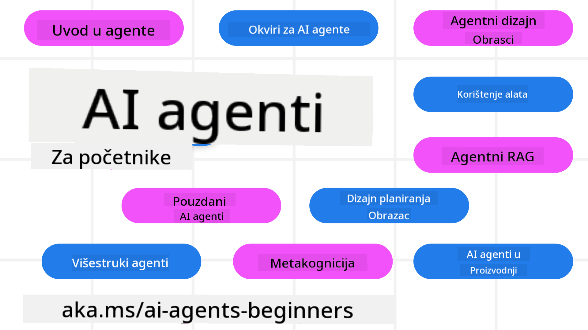

<!--
CO_OP_TRANSLATOR_METADATA:
{
  "original_hash": "9b4c2650691b24b20e0c912d01a466a2",
  "translation_date": "2025-08-21T14:00:29+00:00",
  "source_file": "README.md",
  "language_code": "hr"
}
-->
# AI Agenti za Početnike - Tečaj

## 11 Lekcija koje vas uče svemu što trebate znati za početak izrade AI Agenata

### 🌐 Podrška za Više Jezika

#### Podržano putem GitHub Action (Automatizirano i Uvijek Ažurirano)

[Francuski](../fr/README.md) | [Španjolski](../es/README.md) | [Njemački](../de/README.md) | [Ruski](../ru/README.md) | [Arapski](../ar/README.md) | [Perzijski (Farsi)](../fa/README.md) | [Urdu](../ur/README.md) | [Kineski (Pojednostavljeni)](../zh/README.md) | [Kineski (Tradicionalni, Makao)](../mo/README.md) | [Kineski (Tradicionalni, Hong Kong)](../hk/README.md) | [Kineski (Tradicionalni, Tajvan)](../tw/README.md) | [Japanski](../ja/README.md) | [Korejski](../ko/README.md) | [Hindski](../hi/README.md) | [Bengalski](../bn/README.md) | [Marathi](../mr/README.md) | [Nepalski](../ne/README.md) | [Pandžapski (Gurmukhi)](../pa/README.md) | [Portugalski (Portugal)](../pt/README.md) | [Portugalski (Brazil)](../br/README.md) | [Talijanski](../it/README.md) | [Poljski](../pl/README.md) | [Turski](../tr/README.md) | [Grčki](../el/README.md) | [Tajlandski](../th/README.md) | [Švedski](../sv/README.md) | [Danski](../da/README.md) | [Norveški](../no/README.md) | [Finski](../fi/README.md) | [Nizozemski](../nl/README.md) | [Hebrejski](../he/README.md) | [Vijetnamski](../vi/README.md) | [Indonezijski](../id/README.md) | [Malajski](../ms/README.md) | [Tagalog (Filipinski)](../tl/README.md) | [Svahili](../sw/README.md) | [Mađarski](../hu/README.md) | [Češki](../cs/README.md) | [Slovački](../sk/README.md) | [Rumunjski](../ro/README.md) | [Bugarski](../bg/README.md) | [Srpski (Ćirilica)](../sr/README.md) | [Hrvatski](./README.md) | [Slovenski](../sl/README.md) | [Ukrajinski](../uk/README.md) | [Burmanski (Mjanmar)](../my/README.md)

**Ako želite podršku za dodatne jezike, popis podržanih jezika nalazi se [ovdje](https://github.com/Azure/co-op-translator/blob/main/getting_started/supported-languages.md)**

## 🌱 Početak

Ovaj tečaj sadrži 11 lekcija koje pokrivaju osnove izrade AI Agenata. Svaka lekcija obrađuje zasebnu temu, pa možete započeti gdje god želite!

Tečaj podržava više jezika. Pogledajte naš [popis dostupnih jezika ovdje](../..). 

Ako prvi put radite s Generativnim AI modelima, pogledajte naš tečaj [Generativna AI za Početnike](https://aka.ms/genai-beginners), koji uključuje 21 lekciju o radu s GenAI.

Ne zaboravite [označiti zvjezdicom (🌟) ovaj repozitorij](https://docs.github.com/en/get-started/exploring-projects-on-github/saving-repositories-with-stars?WT.mc_id=academic-105485-koreyst) i [forkati ovaj repozitorij](https://github.com/microsoft/ai-agents-for-beginners/fork) kako biste pokrenuli kod.

### Što Vam Treba

Svaka lekcija u ovom tečaju uključuje primjere koda, koji se nalaze u mapi code_samples. Možete [forkati ovaj repozitorij](https://github.com/microsoft/ai-agents-for-beginners/fork) kako biste stvorili vlastitu kopiju.  

Primjeri koda u ovim vježbama koriste Azure AI Foundry i GitHub Model Catalogs za interakciju s jezičnim modelima:

- [GitHub modeli](https://aka.ms/ai-agents-beginners/github-models) - Besplatno / Ograničeno
- [Azure AI Foundry](https://aka.ms/ai-agents-beginners/ai-foundry) - Potreban Azure račun

Ovaj tečaj također koristi sljedeće okvire i usluge za AI Agente od Microsofta:

- [Azure AI Agent Service](https://aka.ms/ai-agents-beginners/ai-agent-service)
- [Semantic Kernel](https://aka.ms/ai-agents-beginners/semantic-kernel)
- [AutoGen](https://aka.ms/ai-agents/autogen)

Za više informacija o pokretanju koda za ovaj tečaj, posjetite [Postavljanje Tečaja](./00-course-setup/README.md).

## 🙏 Želite pomoći?

Imate prijedloge ili ste pronašli pravopisne ili programske pogreške? [Otvorite problem](https://github.com/microsoft/ai-agents-for-beginners/issues?WT.mc_id=academic-105485-koreyst) ili [Napravite zahtjev za povlačenje](https://github.com/microsoft/ai-agents-for-beginners/pulls?WT.mc_id=academic-105485-koreyst)

Ako zapnete ili imate pitanja o izradi AI Agenata, pridružite se našem [Azure AI Foundry Community Discord](https://discord.gg/kzRShWzttr) 

Ako imate povratne informacije o proizvodu ili naiđete na pogreške tijekom izrade, posjetite naš [Azure AI Foundry Developer Forum](https://aka.ms/azureaifoundry/forum)

## 📂 Svaka lekcija uključuje

- Pisanu lekciju smještenu u README i kratki video
- Primjere koda na Pythonu koji podržavaju Azure AI Foundry i GitHub modele (besplatno)
- Linkove na dodatne resurse za nastavak učenja

## 🗃️ Lekcije

| **Lekcija**                              | **Tekst i Kod**                                   | **Video**                                                  | **Dodatno Učenje**                                                                    |
|------------------------------------------|--------------------------------------------------|------------------------------------------------------------|---------------------------------------------------------------------------------------|
| Uvod u AI Agente i Primjene              | [Link](./01-intro-to-ai-agents/README.md)        | [Video](https://youtu.be/3zgm60bXmQk?si=z8QygFvYQv-9WtO1)  | [Link](https://aka.ms/ai-agents-beginners/collection?WT.mc_id=academic-105485-koreyst) |
| Istraživanje Okvira za AI Agente         | [Link](./02-explore-agentic-frameworks/README.md)| [Video](https://youtu.be/ODwF-EZo_O8?si=Vawth4hzVaHv-u0H)  | [Link](https://aka.ms/ai-agents-beginners/collection?WT.mc_id=academic-105485-koreyst) |
| Razumijevanje Dizajnerskih Obrasca za AI Agente | [Link](./03-agentic-design-patterns/README.md)   | [Video](https://youtu.be/m9lM8qqoOEA?si=BIzHwzstTPL8o9GF)  | [Link](https://aka.ms/ai-agents-beginners/collection?WT.mc_id=academic-105485-koreyst) |
| Dizajnerski Obrazac za Korištenje Alata  | [Link](./04-tool-use/README.md)                  | [Video](https://youtu.be/vieRiPRx-gI?si=2z6O2Xu2cu_Jz46N)  | [Link](https://aka.ms/ai-agents-beginners/collection?WT.mc_id=academic-105485-koreyst) |
| Agentic RAG                              | [Link](./05-agentic-rag/README.md)               | [Video](https://youtu.be/WcjAARvdL7I?si=gKPWsQpKiIlDH9A3)  | [Link](https://aka.ms/ai-agents-beginners/collection?WT.mc_id=academic-105485-koreyst) |
| Izrada Pouzdanih AI Agenata              | [Link](./06-building-trustworthy-agents/README.md)| [Video](https://youtu.be/iZKkMEGBCUQ?si=jZjpiMnGFOE9L8OK ) | [Link](https://aka.ms/ai-agents-beginners/collection?WT.mc_id=academic-105485-koreyst) |
| Dizajnerski Obrazac za Planiranje        | [Link](./07-planning-design/README.md)           | [Video](https://youtu.be/kPfJ2BrBCMY?si=6SC_iv_E5-mzucnC)  | [Link](https://aka.ms/ai-agents-beginners/collection?WT.mc_id=academic-105485-koreyst) |
| Dizajnerski Obrazac za Više Agenata      | [Link](./08-multi-agent/README.md)               | [Video](https://youtu.be/V6HpE9hZEx0?si=rMgDhEu7wXo2uo6g)  | [Link](https://aka.ms/ai-agents-beginners/collection?WT.mc_id=academic-105485-koreyst) |
| Dizajnerski Obrazac za Metakogniciju     | [Link](./09-metacognition/README.md)             | [Video](https://youtu.be/His9R6gw6Ec?si=8gck6vvdSNCt6OcF)  | [Link](https://aka.ms/ai-agents-beginners/collection?WT.mc_id=academic-105485-koreyst) |
| AI Agenti u Produkciji                   | [Link](./10-ai-agents-production/README.md)      | [Video](https://youtu.be/l4TP6IyJxmQ?si=31dnhexRo6yLRJDl)  | [Link](https://aka.ms/ai-agents-beginners/collection?WT.mc_id=academic-105485-koreyst) |
| AI Agenti s MCP                          | [Link](./11-mcp/README.md)                       |                                                            | [Link](https://aka.ms/mcp-for-beginners)                                              |

## 🎒 Ostali Tečajevi

Naš tim proizvodi i druge tečajeve! Pogledajte:
- [**NOVO** Model Context Protocol (MCP) za početnike](https://github.com/microsoft/mcp-for-beginners?WT.mc_id=academic-105485-koreyst)
- [Generativna umjetna inteligencija za početnike koristeći .NET](https://github.com/microsoft/Generative-AI-for-beginners-dotnet?WT.mc_id=academic-105485-koreyst)
- [Generativna umjetna inteligencija za početnike](https://github.com/microsoft/generative-ai-for-beginners?WT.mc_id=academic-105485-koreyst)
- [Generativna umjetna inteligencija za početnike koristeći Javu](https://github.com/microsoft/generative-ai-for-beginners-java?WT.mc_id=academic-105485-koreyst)
- [Strojno učenje za početnike](https://aka.ms/ml-beginners?WT.mc_id=academic-105485-koreyst)
- [Znanost o podacima za početnike](https://aka.ms/datascience-beginners?WT.mc_id=academic-105485-koreyst)
- [Umjetna inteligencija za početnike](https://aka.ms/ai-beginners?WT.mc_id=academic-105485-koreyst)
- [Kibernetička sigurnost za početnike](https://github.com/microsoft/Security-101??WT.mc_id=academic-96948-sayoung)
- [Web razvoj za početnike](https://aka.ms/webdev-beginners?WT.mc_id=academic-105485-koreyst)
- [IoT za početnike](https://aka.ms/iot-beginners?WT.mc_id=academic-105485-koreyst)
- [XR razvoj za početnike](https://github.com/microsoft/xr-development-for-beginners?WT.mc_id=academic-105485-koreyst)
- [Ovladavanje GitHub Copilotom za AI programiranje u paru](https://aka.ms/GitHubCopilotAI?WT.mc_id=academic-105485-koreyst)
- [Ovladavanje GitHub Copilotom za C#/.NET programere](https://github.com/microsoft/mastering-github-copilot-for-dotnet-csharp-developers?WT.mc_id=academic-105485-koreyst)
- [Odaberi svoju vlastitu Copilot avanturu](https://github.com/microsoft/CopilotAdventures?WT.mc_id=academic-105485-koreyst)

## 🌟 Zahvale zajednici

Zahvaljujemo [Shivamu Goyalu](https://www.linkedin.com/in/shivam2003/) na doprinosu važnim primjerima koda koji demonstriraju Agentic RAG.

## Doprinos

Ovaj projekt pozdravlja doprinose i prijedloge. Većina doprinosa zahtijeva da se složite s
Ugovorom o licenci za doprinositelje (CLA) kojim izjavljujete da imate pravo i stvarno dajete
nam prava za korištenje vašeg doprinosa. Za detalje, posjetite 
<https://cla.opensource.microsoft.com>.

Kada pošaljete pull request, CLA bot će automatski odrediti trebate li dostaviti
CLA i označiti PR na odgovarajući način (npr. provjera statusa, komentar). Jednostavno slijedite upute
koje vam bot pruži. Ovo ćete trebati učiniti samo jednom za sve repozitorije koji koriste naš CLA.

Ovaj projekt je usvojio [Microsoftov Kodeks ponašanja za otvoreni izvor](https://opensource.microsoft.com/codeofconduct/).
Za više informacija pogledajte [Često postavljana pitanja o Kodeksu ponašanja](https://opensource.microsoft.com/codeofconduct/faq/) ili
kontaktirajte [opencode@microsoft.com](mailto:opencode@microsoft.com) s dodatnim pitanjima ili komentarima.

## Zaštitni znakovi

Ovaj projekt može sadržavati zaštitne znakove ili logotipe za projekte, proizvode ili usluge. Ovlaštena uporaba Microsoftovih
zaštitnih znakova ili logotipa podliježe i mora slijediti
[Microsoftove smjernice za zaštitne znakove i brendove](https://www.microsoft.com/legal/intellectualproperty/trademarks/usage/general).
Korištenje Microsoftovih zaštitnih znakova ili logotipa u izmijenjenim verzijama ovog projekta ne smije izazvati zabunu ili implicirati Microsoftovo sponzorstvo.
Svaka uporaba zaštitnih znakova ili logotipa trećih strana podliježe politikama tih trećih strana.

**Odricanje od odgovornosti**:  
Ovaj dokument je preveden pomoću AI usluge za prevođenje [Co-op Translator](https://github.com/Azure/co-op-translator). Iako nastojimo osigurati točnost, imajte na umu da automatski prijevodi mogu sadržavati pogreške ili netočnosti. Izvorni dokument na izvornom jeziku treba smatrati autoritativnim izvorom. Za kritične informacije preporučuje se profesionalni prijevod od strane ljudskog prevoditelja. Ne preuzimamo odgovornost za bilo kakve nesporazume ili pogrešne interpretacije koje proizlaze iz korištenja ovog prijevoda.