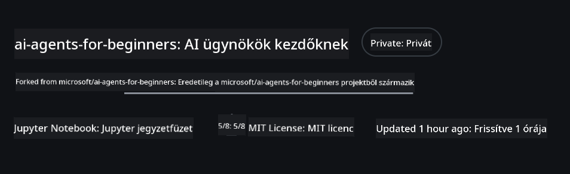
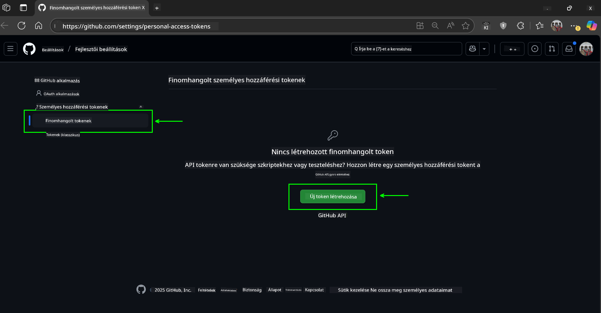
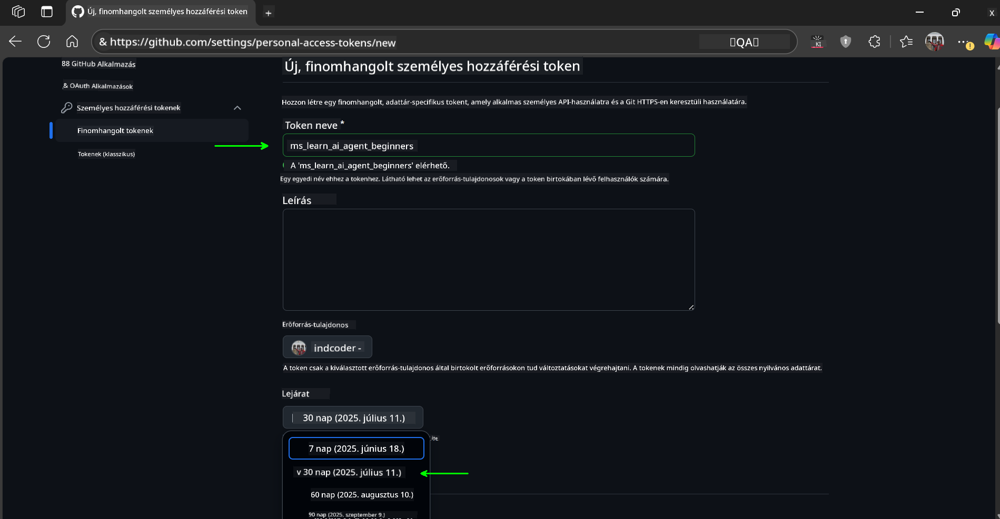
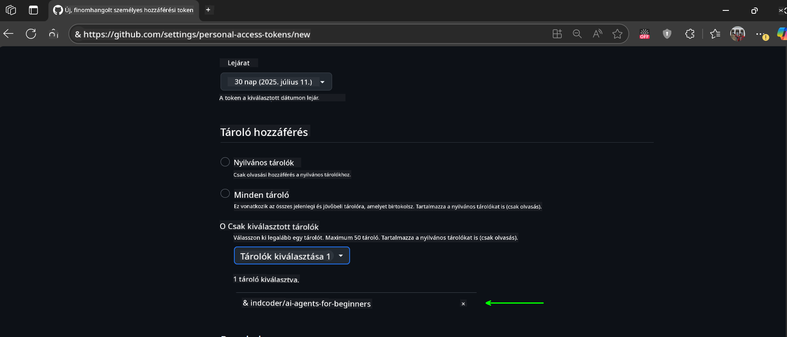
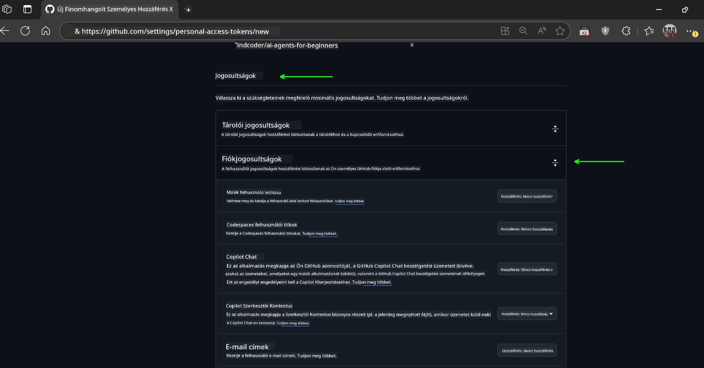
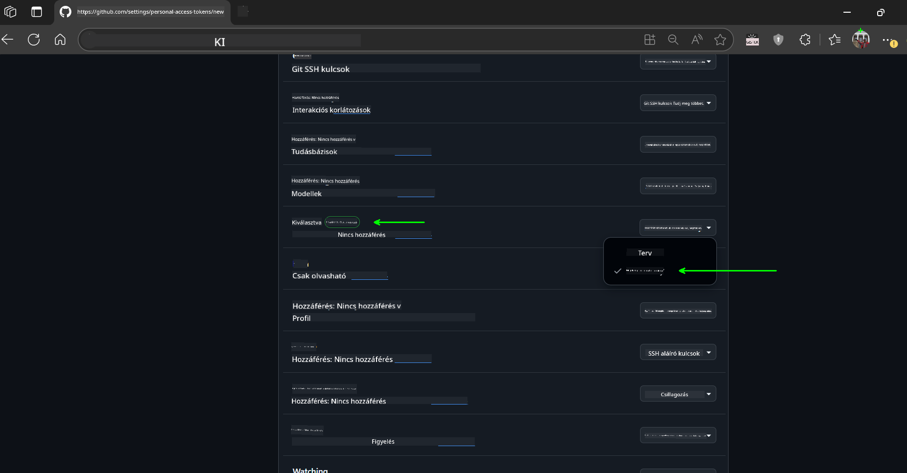
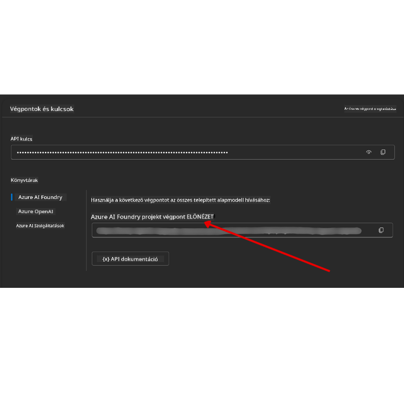

<!--
CO_OP_TRANSLATOR_METADATA:
{
  "original_hash": "c6a79c8f2b56a80370ff7e447765524f",
  "translation_date": "2025-07-23T09:06:14+00:00",
  "source_file": "00-course-setup/README.md",
  "language_code": "hu"
}
-->
# Tanfolyam Beállítása

## Bevezetés

Ebben a leckében megtanulhatod, hogyan futtasd a tanfolyam kódpéldáit.

## Klónozd vagy Forkold ezt a Repozitóriumot

Először is, klónozd vagy forkold a GitHub Repozitóriumot. Így létrehozhatod a tanfolyam anyagának saját verzióját, amelyen futtathatod, tesztelheted és módosíthatod a kódot!

Ezt a következő linkre kattintva teheted meg:



## A Kód Futtatása

Ez a tanfolyam Jupyter Notebook-ok sorozatát kínálja, amelyeket futtathatsz, hogy gyakorlati tapasztalatot szerezz AI Ügynökök építésében.

A kódpéldák a következőket használják:

**GitHub fiók szükséges - Ingyenes**:

1) Semantic Kernel Agent Framework + GitHub Models Marketplace. Jelölve: (semantic-kernel.ipynb)
2) AutoGen Framework + GitHub Models Marketplace. Jelölve: (autogen.ipynb)

**Azure Előfizetés szükséges**:
3) Azure AI Foundry + Azure AI Agent Service. Jelölve: (azureaiagent.ipynb)

Javasoljuk, hogy próbáld ki mindhárom példát, hogy megtudd, melyik működik a legjobban számodra.

Az általad választott opció határozza meg, hogy melyik beállítási lépéseket kell követned az alábbiakban:

## Követelmények

- Python 3.12+
  - **MEGJEGYZÉS**: Ha nincs telepítve a Python 3.12, győződj meg róla, hogy telepíted. Ezután hozz létre egy virtuális környezetet a python3.12 használatával, hogy biztosítsd a requirements.txt fájlból a megfelelő verziók telepítését.
- GitHub fiók - A GitHub Models Marketplace eléréséhez
- Azure Előfizetés - Az Azure AI Foundry eléréséhez
- Azure AI Foundry fiók - Az Azure AI Agent Service eléréséhez

A repozitórium gyökerében található egy `requirements.txt` fájl, amely tartalmazza az összes szükséges Python csomagot a kódpéldák futtatásához.

Ezeket a következő parancs futtatásával telepítheted a terminálban, a repozitórium gyökerében:

```bash
pip install -r requirements.txt
```
Javasoljuk, hogy hozz létre egy Python virtuális környezetet az ütközések és problémák elkerülése érdekében.

## VSCode Beállítása
Győződj meg róla, hogy a megfelelő Python verziót használod a VSCode-ban.


## Beállítás GitHub Modellek Használatához

### 1. lépés: GitHub Személyes Hozzáférési Token (PAT) Lekérése

Ez a tanfolyam a GitHub Models Marketplace-t használja, amely ingyenes hozzáférést biztosít Nagy Nyelvi Modellekhez (LLM-ekhez), amelyeket AI Ügynökök építéséhez használsz majd.

A GitHub Modellek használatához létre kell hoznod egy [GitHub Személyes Hozzáférési Tokent](https://docs.github.com/en/authentication/keeping-your-account-and-data-secure/managing-your-personal-access-tokens).

Ezt a GitHub fiókodban teheted meg.

Kérjük, kövesd a [Legkisebb Jogosultság Elve](https://docs.github.com/en/get-started/learning-to-code/storing-your-secrets-safely) irányelvet a token létrehozásakor. Ez azt jelenti, hogy csak azokat a jogosultságokat add meg a tokennek, amelyek szükségesek a tanfolyam kódpéldáinak futtatásához.

1. Válaszd ki a `Fine-grained tokens` opciót a képernyő bal oldalán.

    Ezután válaszd a `Generate new token` lehetőséget.

    

1. Adj egy leíró nevet a tokennek, amely tükrözi annak célját, hogy később könnyen azonosítható legyen. Állíts be egy lejárati dátumot (ajánlott: 30 nap; választhatsz rövidebb időtartamot, például 7 napot, ha biztonságosabb megközelítést szeretnél).

    

1. Korlátozd a token hatókörét a repozitóriumod forkjára.

    

1. Korlátozd a token jogosultságait: A **Permissions** alatt kapcsold be az **Account Permissions** lehetőséget, navigálj a **Models** részhez, és engedélyezd csak az olvasási hozzáférést, amely szükséges a GitHub Modellekhez.

    

    

Másold ki az újonnan létrehozott tokent. Most hozzáadod ezt a tanfolyam `.env` fájljához.

### 2. lépés: `.env` Fájl Létrehozása

A `.env` fájl létrehozásához futtasd a következő parancsot a terminálban:

```bash
cp .env.example .env
```

Ez lemásolja a példafájlt, és létrehoz egy `.env` fájlt a könyvtáradban, ahol kitöltheted a környezeti változók értékeit.

A tokened bemásolásához nyisd meg a `.env` fájlt a kedvenc szövegszerkesztődben, és illeszd be a tokent a `GITHUB_TOKEN` mezőbe.

Most már képesnek kell lenned a tanfolyam kódpéldáinak futtatására.

## Beállítás Azure AI Foundry és Azure AI Agent Service Használatához

### 1. lépés: Azure Projekt Végpont Lekérése

Kövesd az Azure AI Foundry hub és projekt létrehozásának lépéseit itt: [Hub erőforrások áttekintése](https://learn.microsoft.com/en-us/azure/ai-foundry/concepts/ai-resources)

Miután létrehoztad a projektedet, le kell kérned a projekted kapcsolati stringjét.

Ezt az Azure AI Foundry portál **Áttekintés** oldalán teheted meg.



### 2. lépés: `.env` Fájl Létrehozása

A `.env` fájl létrehozásához futtasd a következő parancsot a terminálban:

```bash
cp .env.example .env
```

Ez lemásolja a példafájlt, és létrehoz egy `.env` fájlt a könyvtáradban, ahol kitöltheted a környezeti változók értékeit.

A tokened bemásolásához nyisd meg a `.env` fájlt a kedvenc szövegszerkesztődben, és illeszd be a tokent a `PROJECT_ENDPOINT` mezőbe.

### 3. lépés: Bejelentkezés az Azure-ba

Biztonsági legjobb gyakorlatként kulcs nélküli hitelesítést használunk az Azure OpenAI-hoz való hitelesítéshez a Microsoft Entra ID-val.

Nyiss meg egy terminált, és futtasd az `az login --use-device-code` parancsot az Azure fiókodba való bejelentkezéshez.

Miután bejelentkeztél, válaszd ki az előfizetésedet a terminálban.

## További Környezeti Változók - Azure Search és Azure OpenAI

Az Agentic RAG Lecke - 5. lecke - mintáihoz szükséged lesz Azure Search és Azure OpenAI környezeti változókra.

Ha ezeket a mintákat szeretnéd futtatni, add hozzá a következő környezeti változókat a `.env` fájlodhoz:

### Áttekintés Oldal (Projekt)

- `AZURE_SUBSCRIPTION_ID` - Ellenőrizd a **Projekt részletek** részt az **Áttekintés** oldalon.

- `AZURE_AI_PROJECT_NAME` - Nézd meg a projekted tetején az **Áttekintés** oldalon.

- `AZURE_OPENAI_SERVICE` - Ezt az **Azure OpenAI Service** **Tartalmazott képességek** fülén találod az **Áttekintés** oldalon.

### Menedzsment Központ

- `AZURE_OPENAI_RESOURCE_GROUP` - Menj a **Projekt tulajdonságok** részhez az **Áttekintés** oldalon a **Menedzsment Központban**.

- `GLOBAL_LLM_SERVICE` - Az **Kapcsolódó erőforrások** alatt keresd meg az **Azure AI Services** kapcsolat nevét. Ha nem található, ellenőrizd az **Azure portálon** az erőforráscsoportodban az AI Services erőforrás nevét.

### Modellek + Végpontok Oldal

- `AZURE_OPENAI_EMBEDDING_DEPLOYMENT_NAME` - Válaszd ki az embedding modelledet (pl. `text-embedding-ada-002`), és jegyezd fel a **Deployment name**-et a modell részleteiből.

- `AZURE_OPENAI_CHAT_DEPLOYMENT_NAME` - Válaszd ki a chat modelledet (pl. `gpt-4o-mini`), és jegyezd fel a **Deployment name**-et a modell részleteiből.

### Azure Portál

- `AZURE_OPENAI_ENDPOINT` - Keresd meg az **Azure AI services**-t, kattints rá, majd menj a **Resource Management**, **Keys and Endpoint** részhez, görgess le az "Azure OpenAI endpoints" részhez, és másold ki azt, amelyik "Language APIs"-t mond.

- `AZURE_OPENAI_API_KEY` - Ugyaninnen másold ki az 1. vagy 2. kulcsot.

- `AZURE_SEARCH_SERVICE_ENDPOINT` - Keresd meg az **Azure AI Search** erőforrásodat, kattints rá, és nézd meg az **Áttekintés** részt.

- `AZURE_SEARCH_API_KEY` - Ezután menj a **Beállítások** és **Kulcsok** részhez, hogy lemásold az elsődleges vagy másodlagos admin kulcsot.

### Külső Weboldal

- `AZURE_OPENAI_API_VERSION` - Látogasd meg az [API verzió életciklus](https://learn.microsoft.com/en-us/azure/ai-services/openai/api-version-deprecation#latest-ga-api-release) oldalt a **Legújabb GA API kiadás** alatt.

### Kulcs nélküli hitelesítés beállítása

A hitelesítő adatok kódba írása helyett kulcs nélküli kapcsolatot használunk az Azure OpenAI-hoz. Ehhez importáljuk a `DefaultAzureCredential`-t, majd később meghívjuk a `DefaultAzureCredential` függvényt a hitelesítő adat megszerzéséhez.

```python
from azure.identity import DefaultAzureCredential, InteractiveBrowserCredential
```

## Elakadtál Valahol?

Ha bármilyen problémád van a beállítás futtatásával, csatlakozz a mi...

## Következő Lecke

Most már készen állsz a tanfolyam kódjának futtatására. Jó tanulást az AI Ügynökök világáról!

[Bevezetés az AI Ügynökökbe és azok Felhasználási Esetei](../01-intro-to-ai-agents/README.md)

**Felelősségkizárás**:  
Ez a dokumentum az [Co-op Translator](https://github.com/Azure/co-op-translator) AI fordítási szolgáltatás segítségével készült. Bár törekszünk a pontosságra, kérjük, vegye figyelembe, hogy az automatikus fordítások hibákat vagy pontatlanságokat tartalmazhatnak. Az eredeti dokumentum az eredeti nyelvén tekintendő hiteles forrásnak. Kritikus információk esetén javasolt professzionális, emberi fordítást igénybe venni. Nem vállalunk felelősséget a fordítás használatából eredő félreértésekért vagy téves értelmezésekért.