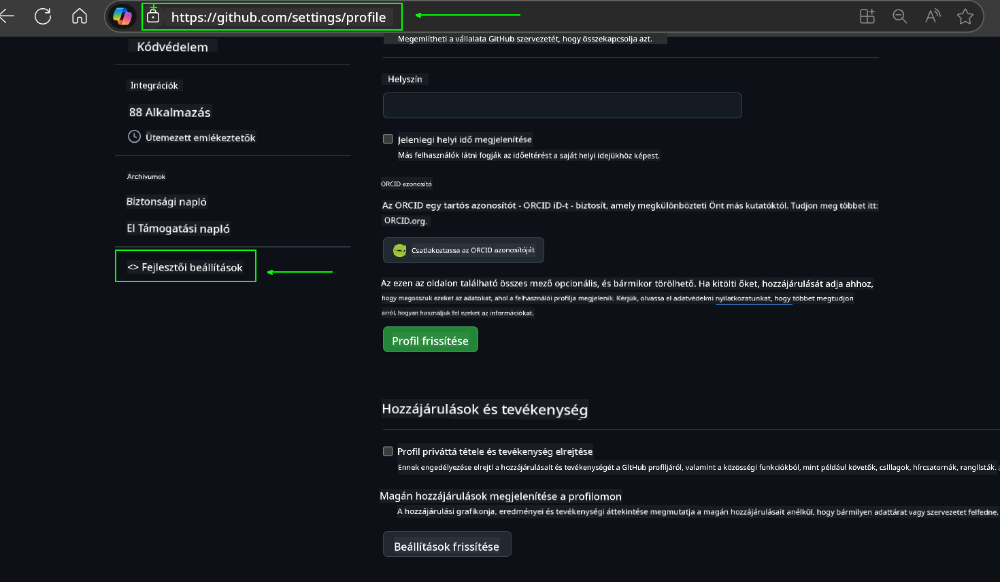
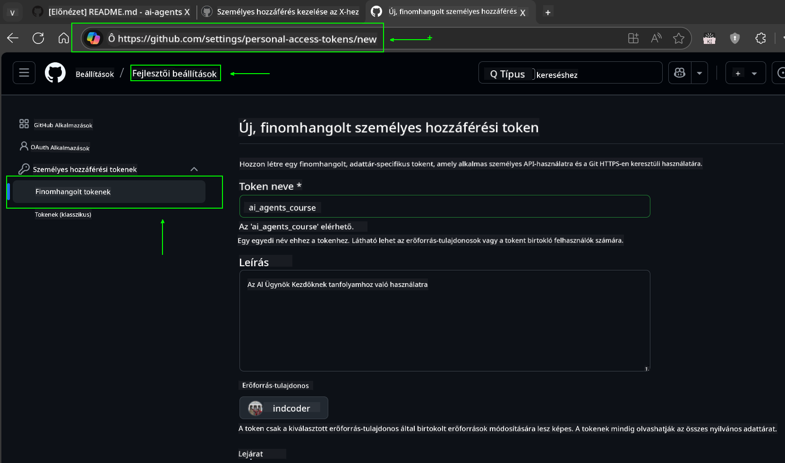
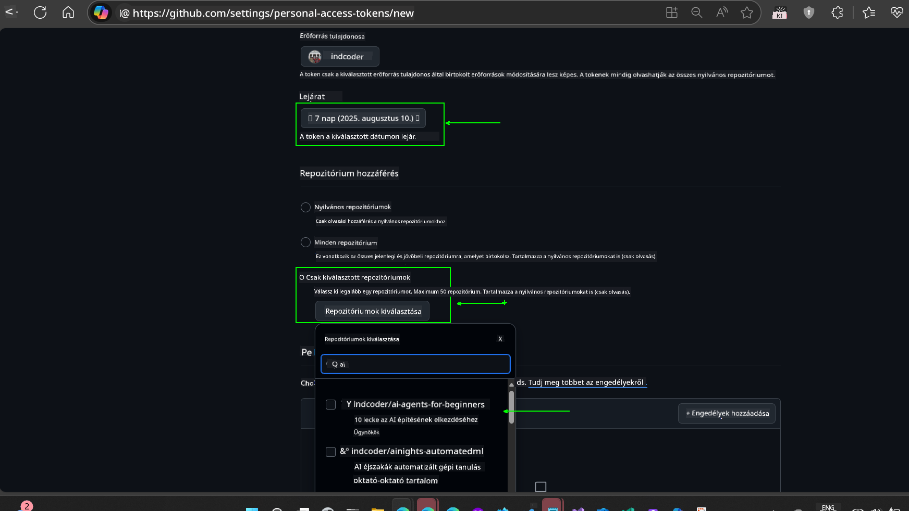
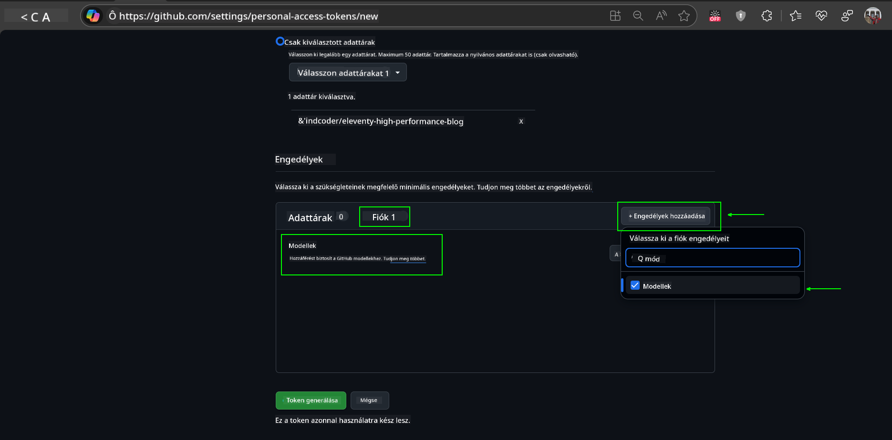
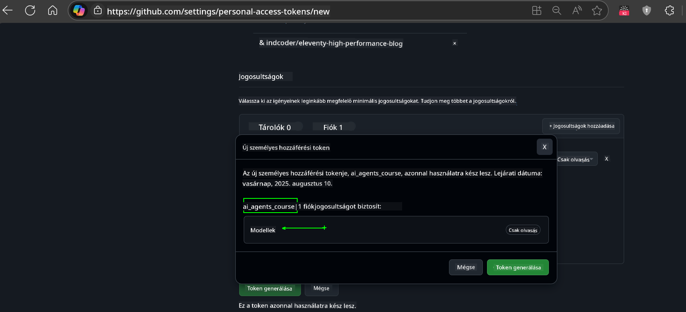
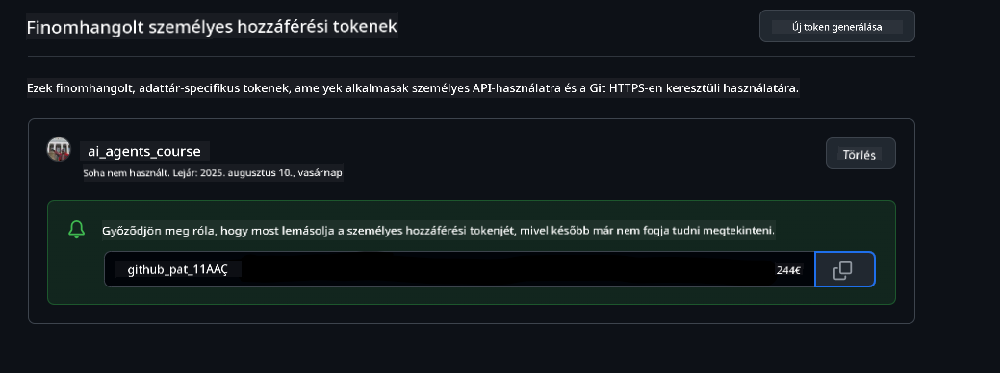
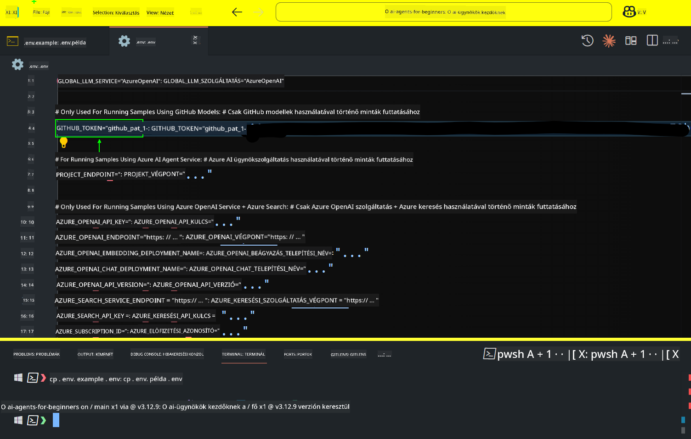

<!--
CO_OP_TRANSLATOR_METADATA:
{
  "original_hash": "8693a24942b670e3cb8def77f92513f9",
  "translation_date": "2025-08-21T13:44:10+00:00",
  "source_file": "00-course-setup/README.md",
  "language_code": "hu"
}
-->
# Tanfolyam Beállítása

## Bevezetés

Ebben a leckében megtanuljuk, hogyan futtathatjuk a tanfolyam kódpéldáit.

## Klónozd vagy Forkold ezt a Repozitóriumot

Első lépésként klónozd vagy forkold a GitHub Repozitóriumot. Így létrehozhatod a tanfolyam anyagainak saját verzióját, amelyen futtathatod, tesztelheted és módosíthatod a kódot!

Ezt az alábbi linkre kattintva teheted meg:


## A Kód Futtatása

Ez a tanfolyam Jupyter Notebookokat kínál, amelyek segítségével gyakorlati tapasztalatot szerezhetsz AI Ügynökök építésében.

A kódpéldák az alábbiakat használják:

**GitHub fiók szükséges - Ingyenes**:

1) Semantic Kernel Agent Framework + GitHub Models Marketplace. Megjelölve mint (semantic-kernel.ipynb)
2) AutoGen Framework + GitHub Models Marketplace. Megjelölve mint (autogen.ipynb)

**Azure előfizetés szükséges**:
3) Azure AI Foundry + Azure AI Agent Service. Megjelölve mint (azureaiagent.ipynb)

Javasoljuk, hogy próbáld ki mindhárom példát, hogy megtudd, melyik működik a legjobban számodra.

Az általad választott opció határozza meg, hogy melyik beállítási lépéseket kell követned az alábbiakban:

## Követelmények

- Python 3.12+
  - **MEGJEGYZÉS**: Ha nincs telepítve a Python 3.12, győződj meg róla, hogy telepíted. Ezután hozz létre egy virtuális környezetet (venv) a python3.12 használatával, hogy biztosítsd a requirements.txt fájlból a megfelelő verziók telepítését.
- GitHub fiók - A GitHub Models Marketplace eléréséhez
- Azure előfizetés - Az Azure AI Foundry eléréséhez
- Azure AI Foundry fiók - Az Azure AI Agent Service eléréséhez

A repozitórium gyökerében található egy `requirements.txt` fájl, amely tartalmazza az összes szükséges Python csomagot a kódpéldák futtatásához.

A csomagokat az alábbi parancs futtatásával telepítheted a repozitórium gyökerében lévő terminálban:

```bash
pip install -r requirements.txt
```
Javasoljuk, hogy hozz létre egy Python virtuális környezetet az esetleges konfliktusok és problémák elkerülése érdekében.

## VSCode Beállítása
Győződj meg róla, hogy a megfelelő Python verziót használod a VSCode-ban.


## Beállítás GitHub Modellek Használatához

### 1. lépés: GitHub Személyes Hozzáférési Token (PAT) Lekérése

Ez a tanfolyam a GitHub Models Marketplace-t használja, amely ingyenes hozzáférést biztosít Nagy Nyelvi Modellekhez (LLM-ekhez), amelyeket AI Ügynökök építéséhez használhatsz.

A GitHub Modellek használatához létre kell hoznod egy [GitHub Személyes Hozzáférési Tokent](https://docs.github.com/en/authentication/keeping-your-account-and-data-secure/managing-your-personal-access-tokens).

Ezt a GitHub fiókodban teheted meg.

Kérjük, kövesd a [Legkisebb Jogosultság Elve](https://docs.github.com/en/get-started/learning-to-code/storing-your-secrets-safely) irányelvet a token létrehozásakor. Ez azt jelenti, hogy csak azokat a jogosultságokat add meg a tokennek, amelyek szükségesek a tanfolyam kódpéldáinak futtatásához.

1. Válaszd ki a `Fine-grained tokens` opciót a képernyő bal oldalán a **Fejlesztői beállítások** menüpont alatt.
   

   Ezután válaszd a `Generate new token` lehetőséget.

   

2. Adj egy leíró nevet a tokennek, amely tükrözi annak célját, hogy később könnyen azonosítható legyen.

    🔐 Token Időtartam Ajánlás

    Ajánlott időtartam: 30 nap
    A biztonságosabb megközelítés érdekében választhatsz rövidebb időszakot is, például 7 napot 🛡️
    Ez egy remek módja annak, hogy személyes célt tűzz ki, és befejezd a tanfolyamot, miközben a tanulási lendületed magas 🚀.

    

3. Korlátozd a token hatókörét a repozitóriumod forkjára.

    

4. Korlátozd a token jogosultságait: A **Permissions** alatt kattints az **Account** fülre, majd kattints a "+ Add permissions" gombra. Egy legördülő menü jelenik meg. Keresd meg a **Models** opciót, és jelöld be a négyzetet.
    

5. Ellenőrizd a szükséges jogosultságokat a token generálása előtt. 

6. A token generálása előtt győződj meg róla, hogy készen állsz a token biztonságos helyen történő tárolására, például egy jelszókezelőben, mivel a token nem lesz újra látható a létrehozás után. 

Másold ki az újonnan létrehozott tokent. Most hozzá fogod adni ezt a `.env` fájlhoz, amely a tanfolyam része.

### 2. lépés: `.env` Fájl Létrehozása

A `.env` fájl létrehozásához futtasd az alábbi parancsot a terminálban.

```bash
cp .env.example .env
```

Ez az utasítás az példafájlt másolja, és létrehozza a `.env` fájlt a könyvtáradban, ahol kitöltheted a környezeti változók értékeit.

A tokened bemásolásához nyisd meg a `.env` fájlt a kedvenc szövegszerkesztődben, és illeszd be a tokent a `GITHUB_TOKEN` mezőbe.


Most már képesnek kell lenned a tanfolyam kódpéldáinak futtatására.

## Beállítás Azure AI Foundry és Azure AI Agent Service Használatához

### 1. lépés: Azure Projekt Végpont Lekérése

Kövesd az Azure AI Foundry hub és projekt létrehozásának lépéseit itt: [Hub erőforrások áttekintése](https://learn.microsoft.com/en-us/azure/ai-foundry/concepts/ai-resources)

Miután létrehoztad a projektedet, le kell kérned a projekt kapcsolat stringjét.

Ezt a projekt **Áttekintés** oldalán teheted meg az Azure AI Foundry portálon.


### 2. lépés: `.env` Fájl Létrehozása

A `.env` fájl létrehozásához futtasd az alábbi parancsot a terminálban.

```bash
cp .env.example .env
```

Ez az utasítás az példafájlt másolja, és létrehozza a `.env` fájlt a könyvtáradban, ahol kitöltheted a környezeti változók értékeit.

A tokened bemásolásához nyisd meg a `.env` fájlt a kedvenc szövegszerkesztődben, és illeszd be a tokent a `PROJECT_ENDPOINT` mezőbe.

### 3. lépés: Bejelentkezés az Azure-ba

Biztonsági legjobb gyakorlatként kulcs nélküli hitelesítést fogunk használni az Azure OpenAI-hoz a Microsoft Entra ID-val. 

Nyiss meg egy terminált, és futtasd az `az login --use-device-code` parancsot az Azure fiókodba való bejelentkezéshez.

Bejelentkezés után válaszd ki az előfizetésedet a terminálban.

## További Környezeti Változók - Azure Search és Azure OpenAI

Az Agentic RAG Lecke - 5. lecke - példáihoz szükség van az Azure Search és Azure OpenAI környezeti változók hozzáadására a `.env` fájlhoz:

### Áttekintés Oldal (Projekt)

- `AZURE_SUBSCRIPTION_ID` - Ellenőrizd a **Projekt részletek** részt a projekt **Áttekintés** oldalán.

- `AZURE_AI_PROJECT_NAME` - Nézd meg a projekt **Áttekintés** oldalának tetején.

- `AZURE_OPENAI_SERVICE` - Keresd meg az **Azure OpenAI Service**-t az **Included capabilities** fülön az **Áttekintés** oldalon.

### Menedzsment Központ

- `AZURE_OPENAI_RESOURCE_GROUP` - Menj a **Projekt tulajdonságok** részhez az **Áttekintés** oldalon a **Menedzsment Központban**.

- `GLOBAL_LLM_SERVICE` - Az **Összekapcsolt erőforrások** alatt keresd meg az **Azure AI Services** kapcsolat nevét. Ha nem található, ellenőrizd az **Azure portált** az erőforráscsoportodban az AI Services erőforrás nevét.

### Modellek + Végpontok Oldal

- `AZURE_OPENAI_EMBEDDING_DEPLOYMENT_NAME` - Válaszd ki a beágyazási modellt (pl. `text-embedding-ada-002`), és jegyezd fel a **Deployment name**-et a modell részleteiből.

- `AZURE_OPENAI_CHAT_DEPLOYMENT_NAME` - Válaszd ki a chat modellt (pl. `gpt-4o-mini`), és jegyezd fel a **Deployment name**-et a modell részleteiből.

### Azure Portál

- `AZURE_OPENAI_ENDPOINT` - Keresd meg az **Azure AI services**-t, kattints rá, majd menj a **Resource Management**, **Keys and Endpoint** részhez, görgess le az "Azure OpenAI endpoints" részhez, és másold ki azt, amelyik "Language APIs"-t mond.

- `AZURE_OPENAI_API_KEY` - Ugyanerről a képernyőről másold ki az 1. vagy 2. kulcsot.

- `AZURE_SEARCH_SERVICE_ENDPOINT` - Keresd meg az **Azure AI Search** erőforrást, kattints rá, és nézd meg az **Áttekintés** részt.

- `AZURE_SEARCH_API_KEY` - Ezután menj a **Beállítások** és **Kulcsok** részhez, hogy lemásold az elsődleges vagy másodlagos admin kulcsot.

### Külső Weboldal

- `AZURE_OPENAI_API_VERSION` - Látogasd meg az [API verzió életciklus](https://learn.microsoft.com/en-us/azure/ai-services/openai/api-version-deprecation#latest-ga-api-release) oldalt a **Legújabb GA API kiadás** alatt.

### Kulcs nélküli hitelesítés beállítása

A hitelesítő adatok kódba égetése helyett kulcs nélküli kapcsolatot fogunk használni az Azure OpenAI-val. Ehhez importáljuk a `DefaultAzureCredential`-t, majd később meghívjuk a `DefaultAzureCredential` függvényt a hitelesítő adatok lekéréséhez.

```python
from azure.identity import DefaultAzureCredential, InteractiveBrowserCredential
```

## Elakadtál Valahol?

Ha bármilyen problémád van a beállítás során, csatlakozz a

## Következő Lecke

Most már készen állsz a tanfolyam kódjának futtatására. Jó tanulást az AI Ügynökök világáról! 

[Bevezetés az AI Ügynökökbe és azok Felhasználási Eseteibe](../01-intro-to-ai-agents/README.md)

**Felelősség kizárása**:  
Ez a dokumentum az AI fordítási szolgáltatás, a [Co-op Translator](https://github.com/Azure/co-op-translator) segítségével lett lefordítva. Bár törekszünk a pontosságra, kérjük, vegye figyelembe, hogy az automatikus fordítások hibákat vagy pontatlanságokat tartalmazhatnak. Az eredeti dokumentum az eredeti nyelvén tekintendő hiteles forrásnak. Kritikus információk esetén javasolt professzionális emberi fordítást igénybe venni. Nem vállalunk felelősséget semmilyen félreértésért vagy téves értelmezésért, amely a fordítás használatából eredhet.