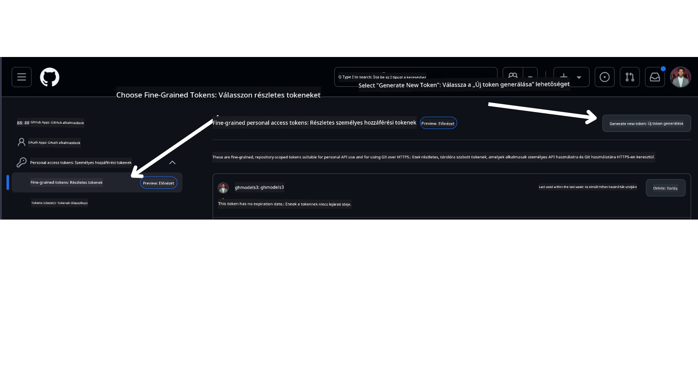

<!--
CO_OP_TRANSLATOR_METADATA:
{
  "original_hash": "76945069b52a49cd0432ae3e0b0ba22e",
  "translation_date": "2025-07-12T07:55:44+00:00",
  "source_file": "00-course-setup/README.md",
  "language_code": "hu"
}
-->
GitHub fiókodban.

Válaszd ki a bal oldalon a `Fine-grained tokens` opciót.

Ezután válaszd a `Generate new token` lehetőséget.



Meg kell adnod egy nevet a tokenednek, ki kell választanod a lejárati dátumot (ajánlott: 30 nap), és ki kell választanod a token jogosultságait (Public Repositories).

Fontos, hogy módosítsd a token jogosultságait is: Permissions -> Models -> Engedélyezd a hozzáférést a GitHub Modellekhez.

Másold ki az újonnan létrehozott tokenedet. Ezt most hozzáadod a tanfolyamhoz tartozó `.env` fájlodhoz.

### 2. lépés: `.env` fájl létrehozása

A `.env` fájl létrehozásához futtasd a következő parancsot a terminálodban:

```bash
cp .env.example .env
```

Ez lemásolja a példa fájlt, és létrehoz egy `.env` fájlt a könyvtáradban, ahol kitöltheted a környezeti változók értékeit.

Miután kimásoltad a tokenedet, nyisd meg a `.env` fájlt a kedvenc szövegszerkesztődben, és illeszd be a tokenedet a `GITHUB_TOKEN` mezőbe.

Most már képes leszel futtatni a tanfolyam kódmintáit.

## Beállítás Azure AI Foundry és Azure AI Agent Service használatához

### 1. lépés: Azure projekt végpontjának lekérése

Kövesd az Azure AI Foundry hub és projekt létrehozására vonatkozó lépéseket itt: [Hub resources overview](https://learn.microsoft.com/en-us/azure/ai-foundry/concepts/ai-resources)

Miután létrehoztad a projektedet, le kell kérned a projekt kapcsolati karakterláncát.

Ezt a projekted **Áttekintés** oldalán teheted meg az Azure AI Foundry portálon.


### 2. lépés: `.env` fájl létrehozása

A `.env` fájl létrehozásához futtasd a következő parancsot a terminálodban:

```bash
cp .env.example .env
```

Ez lemásolja a példa fájlt, és létrehoz egy `.env` fájlt a könyvtáradban, ahol kitöltheted a környezeti változók értékeit.

Miután kimásoltad a tokenedet, nyisd meg a `.env` fájlt a kedvenc szövegszerkesztődben, és illeszd be a tokenedet a `PROJECT_ENDPOINT` mezőbe.

### 3. lépés: Bejelentkezés Azure-ba

Biztonsági szempontból a [kulcs nélküli hitelesítést](https://learn.microsoft.com/azure/developer/ai/keyless-connections?tabs=csharp%2Cazure-cli?WT.mc_id=academic-105485-koreyst) fogjuk használni az Azure OpenAI-hoz Microsoft Entra ID-val. Ehhez először telepítened kell az **Azure CLI**-t az operációs rendszerednek megfelelő [telepítési útmutató](https://learn.microsoft.com/cli/azure/install-azure-cli?WT.mc_id=academic-105485-koreyst) alapján.

Ezután nyiss meg egy terminált, és futtasd az `az login --use-device-code` parancsot az Azure fiókodba való bejelentkezéshez.

Miután bejelentkeztél, válaszd ki az előfizetésedet a terminálban.

## További környezeti változók - Azure Search és Azure OpenAI

Az Agentic RAG leckéhez - 5. lecke - vannak minták, amelyek Azure Search-t és Azure OpenAI-t használnak.

Ha ezeket a mintákat szeretnéd futtatni, hozzá kell adnod a következő környezeti változókat a `.env` fájlodhoz:

### Áttekintő oldal (Projekt)

- `AZURE_SUBSCRIPTION_ID` - Ellenőrizd a **Projekt részletei** részt a projekt **Áttekintés** oldalán.

- `AZURE_AI_PROJECT_NAME` - Nézd meg a projekt **Áttekintés** oldalának tetejét.

- `AZURE_OPENAI_SERVICE` - Ezt az **Azure OpenAI Service** **Beépített képességek** fül alatt találod az **Áttekintés** oldalon.

### Management Center

- `AZURE_OPENAI_RESOURCE_GROUP` - Menj a **Projekt tulajdonságai** részhez a **Management Center** **Áttekintés** oldalán.

- `GLOBAL_LLM_SERVICE` - A **Csatlakoztatott erőforrások** alatt keresd az **Azure AI Services** kapcsolat nevét. Ha nincs felsorolva, nézd meg az **Azure portálon** az erőforráscsoportodban az AI Services erőforrás nevét.

### Modellek + Végpontok oldal

- `AZURE_OPENAI_EMBEDDING_DEPLOYMENT_NAME` - Válaszd ki a beágyazási modellt (pl. `text-embedding-ada-002`), és jegyezd fel a modell részleteiben található **Deployment name** értéket.

- `AZURE_OPENAI_CHAT_DEPLOYMENT_NAME` - Válaszd ki a chat modellt (pl. `gpt-4o-mini`), és jegyezd fel a modell részleteiben található **Deployment name** értéket.

### Azure portál

- `AZURE_OPENAI_ENDPOINT` - Keresd meg az **Azure AI services** részt, kattints rá, majd menj a **Resource Management**, **Keys and Endpoint** részhez, görgess le az "Azure OpenAI végpontok" szekcióhoz, és másold ki a "Language APIs" végpontot.

- `AZURE_OPENAI_API_KEY` - Ugyanitt másold ki az 1-es vagy 2-es kulcsot.

- `AZURE_SEARCH_SERVICE_ENDPOINT` - Keresd meg az **Azure AI Search** erőforrásodat, kattints rá, és nézd meg az **Áttekintés** oldalt.

- `AZURE_SEARCH_API_KEY` - Ezután menj a **Beállítások** majd a **Kulcsok** részhez, és másold ki az elsődleges vagy másodlagos admin kulcsot.

### Külső weboldal

- `AZURE_OPENAI_API_VERSION` - Látogasd meg az [API verzió életciklus](https://learn.microsoft.com/en-us/azure/ai-services/openai/api-version-deprecation#latest-ga-api-release) oldalt a **Legfrissebb GA API kiadás** szekció alatt.

### Kulcs nélküli hitelesítés beállítása

Ahelyett, hogy keménykódolnánk a hitelesítő adatokat, kulcs nélküli kapcsolatot fogunk használni az Azure OpenAI-hoz. Ehhez importáljuk a `DefaultAzureCredential`-t, és később meghívjuk a `DefaultAzureCredential` függvényt a hitelesítő adat megszerzéséhez.

```python
from azure.identity import DefaultAzureCredential, InteractiveBrowserCredential
```

## Elakadtál valahol?

Ha bármilyen problémád adódik a beállítás futtatásakor, csatlakozz a

vagy a

.

## Következő lecke

Most már készen állsz a tanfolyam kódjának futtatására. Jó tanulást az AI ügynökök világában!

[Bevezetés az AI ügynökökbe és az ügynökök használati eseteibe](../01-intro-to-ai-agents/README.md)

**Jogi nyilatkozat**:  
Ez a dokumentum az AI fordító szolgáltatás, a [Co-op Translator](https://github.com/Azure/co-op-translator) segítségével készült. Bár a pontosságra törekszünk, kérjük, vegye figyelembe, hogy az automatikus fordítások hibákat vagy pontatlanságokat tartalmazhatnak. Az eredeti dokumentum az anyanyelvén tekintendő hiteles forrásnak. Kritikus információk esetén professzionális emberi fordítást javaslunk. Nem vállalunk felelősséget a fordítás használatából eredő félreértésekért vagy téves értelmezésekért.