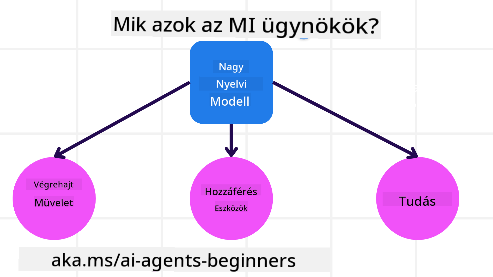
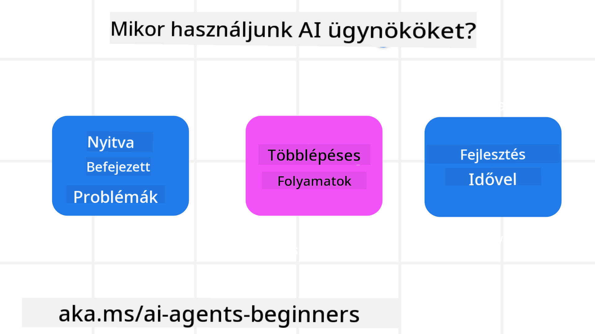

<!--
CO_OP_TRANSLATOR_METADATA:
{
  "original_hash": "d84943abc8f001ad4670418d32c2d899",
  "translation_date": "2025-07-12T08:11:02+00:00",
  "source_file": "01-intro-to-ai-agents/README.md",
  "language_code": "hu"
}
-->
csatlakozz más tanulókhoz és AI Agent építőkhöz, és tedd fel kérdéseidet a tanfolyammal kapcsolatban.

A tanfolyamot azzal kezdjük, hogy jobban megértjük, mik azok az AI Agentek, és hogyan használhatjuk őket az általunk épített alkalmazásokban és munkafolyamatokban.

## Bevezetés

Ebben a leckében a következőkről lesz szó:

- Mik azok az AI Agentek, és milyen típusai léteznek?
- Milyen felhasználási esetekhez a legalkalmasabbak az AI Agentek, és hogyan segíthetnek nekünk?
- Mik az alapvető építőelemek az Agentikus megoldások tervezésekor?

## Tanulási célok
A lecke elvégzése után képes leszel:

- Megérteni az AI Agentek fogalmát és azt, hogy miben különböznek más AI megoldásoktól.
- Hatékonyan alkalmazni az AI Agenteket.
- Termelékenyen tervezni agentikus megoldásokat mind a felhasználók, mind az ügyfelek számára.

## Az AI Agentek meghatározása és típusai

### Mik azok az AI Agentek?

Az AI Agentek olyan **rendszerek**, amelyek lehetővé teszik a **Nagy Nyelvi Modelleknek (LLM-eknek)**, hogy **műveleteket hajtsanak végre** azáltal, hogy kibővítik képességeiket, hozzáférést adva az LLM-eknek **eszközökhöz** és **tudáshoz**.

Nézzük meg ezt a definíciót kisebb részekre bontva:

- **Rendszer** – Fontos, hogy az agenteket ne csak egyetlen komponensként, hanem sok komponensből álló rendszerként gondoljuk el. Egy AI Agent alapvető komponensei:
  - **Környezet** – Az a meghatározott tér, ahol az AI Agent működik. Például egy utazási foglaló AI Agent esetén a környezet lehet maga az utazási foglaló rendszer, amelyet az agent használ a feladatok elvégzéséhez.
  - **Szenzorok** – A környezet információkat tartalmaz és visszacsatolást ad. Az AI Agentek szenzorokat használnak, hogy összegyűjtsék és értelmezzék a környezet aktuális állapotára vonatkozó információkat. Az utazási foglaló agent példájánál a foglaló rendszer szolgáltathat adatokat például a szállodai elérhetőségről vagy a repülőjegy árakról.
  - **Aktuátorok** – Miután az AI Agent megkapta a környezet aktuális állapotát, a feladat alapján eldönti, milyen műveletet hajtson végre a környezet megváltoztatásához. Az utazási agent példájánál ez lehet például egy szabad szoba lefoglalása a felhasználó számára.

**Nagy Nyelvi Modellek** – Az agentek fogalma már az LLM-ek létrejötte előtt is létezett. Az LLM-ekkel épített AI Agentek előnye az emberi nyelv és adatok értelmezésének képessége. Ez lehetővé teszi az LLM-ek számára, hogy értelmezzék a környezeti információkat és tervet készítsenek a környezet megváltoztatására.

**Műveletek végrehajtása** – Az AI Agent rendszereken kívül az LLM-ek korlátozottak abban, hogy csak tartalom vagy információ generálására képesek a felhasználó kérésére. Az AI Agent rendszerekben az LLM-ek képesek feladatokat végrehajtani a felhasználói kérés értelmezésével és a környezetükben elérhető eszközök használatával.

**Hozzáférés eszközökhöz** – Az, hogy az LLM milyen eszközökhöz fér hozzá, két dologtól függ: 1) a környezettől, amelyben működik, és 2) az AI Agent fejlesztőjétől. Az utazási agent példájánál az agent eszközei korlátozottak a foglalórendszerben elérhető műveletekre, illetve a fejlesztő korlátozhatja az agent eszközhozzáférését például csak repülőjegyekre.

**Memória + Tudás** – A memória lehet rövid távú, például a felhasználó és az agent közötti beszélgetés kontextusában. Hosszú távon, a környezet által szolgáltatott információn túl, az AI Agentek képesek tudást lekérni más rendszerekből, szolgáltatásokból, eszközökből, sőt más agentektől is. Az utazási agent példájánál ez lehet például a felhasználó utazási preferenciáit tartalmazó ügyféladatbázis.

### Az agentek különböző típusai

Most, hogy van egy általános definíciónk az AI Agentekről, nézzünk meg néhány konkrét agent típust, és hogyan alkalmazhatók egy utazási foglaló AI agent esetén.

| **Agent Típus**               | **Leírás**                                                                                                                          | **Példa**                                                                                                                                                                                                                   |
| ----------------------------- | ---------------------------------------------------------------------------------------------------------------------------------- | --------------------------------------------------------------------------------------------------------------------------------------------------------------------------------------------------------------------------- |
| **Egyszerű reflex agentek**   | Előre meghatározott szabályok alapján azonnali műveleteket hajtanak végre.                                                         | Az utazási agent értelmezi az e-mail kontextusát, és továbbítja az utazási panaszokat az ügyfélszolgálatnak.                                                                                                                |
| **Modell-alapú reflex agentek** | A világ modellje és annak változásai alapján hajtanak végre műveleteket.                                                           | Az utazási agent előnyben részesíti azokat az útvonalakat, ahol jelentős árváltozás történt, a történelmi áradatok alapján.                                                                                                  |
| **Célorientált agentek**      | Terveket készítenek konkrét célok elérésére, értelmezve a célt és meghatározva a szükséges lépéseket.                               | Az utazási agent lefoglal egy utat azzal, hogy meghatározza a szükséges utazási eszközöket (autó, tömegközlekedés, repülőjáratok) a kiindulási helytől a célállomásig.                                                        |
| **Hasznosság-alapú agentek**  | Számításba veszik a preferenciákat és számszerűsítik a kompromisszumokat a célok eléréséhez.                                        | Az utazási agent maximalizálja a hasznosságot azzal, hogy mérlegeli a kényelmet és a költséget az utazás foglalásakor.                                                                                                        |
| **Tanuló agentek**            | Idővel javulnak, visszajelzések alapján módosítják a műveleteiket.                                                                 | Az utazási agent a felhasználói visszajelzések alapján javítja a jövőbeli foglalásokat, például az utazás utáni felmérésekből tanulva.                                                                                        |
| **Hierarchikus agentek**      | Többszintű rendszer, ahol a magasabb szintű agentek feladatokat bontanak alfeladatokra, amelyeket az alsóbb szintű agentek végeznek el. | Az utazási agent egy utazás lemondását úgy végzi, hogy a feladatot alfeladatokra bontja (például egyes foglalások törlése), amelyeket az alsóbb szintű agentek hajtanak végre, majd visszajelzést adnak a magasabb szintű agentnek. |
| **Többagent rendszer (MAS)**  | Az agentek önállóan, együttműködve vagy versengve hajtanak végre feladatokat.                                                      | Együttműködés: Több agent foglal különböző utazási szolgáltatásokat, például szállodát, repülőjegyet és szórakozást. Versengés: Több agent verseng egy közös szállodai foglalási naptárért, hogy ügyfeleket foglaljon be.          |

## Mikor érdemes AI Agenteket használni?

Az előző részben az utazási agent példáján keresztül mutattuk be, hogyan használhatók az agentek különböző helyzetekben az utazás foglalás során. Ezt az alkalmazást a tanfolyam során továbbra is használni fogjuk.

Nézzük meg, milyen típusú feladatokhoz a legalkalmasabbak az AI Agentek:

- **Nyitott végű problémák** – amikor az LLM-nek kell meghatároznia a szükséges lépéseket a feladat elvégzéséhez, mert ez nem kódolható be előre a munkafolyamatba.
- **Többlépcsős folyamatok** – olyan feladatok, amelyek komplexitást igényelnek, és az AI Agentnek több lépésen keresztül kell eszközöket vagy információkat használnia, nem csak egyszeri lekérésről van szó.
- **Időbeli fejlődés** – olyan feladatok, ahol az agent visszajelzések alapján javulhat, akár a környezetből, akár a felhasználóktól kapott visszacsatolás révén, hogy jobb szolgáltatást nyújtson.

Az AI Agentek használatának további szempontjait a Megbízható AI Agentek építése leckében tárgyaljuk.

## Az agentikus megoldások alapjai

### Agent fejlesztés

Az AI Agent rendszer tervezésének első lépése az eszközök, műveletek és viselkedések meghatározása. Ebben a tanfolyamban az **Azure AI Agent Service** használatára fókuszálunk az agentek definiálásához. Ez a szolgáltatás a következőket kínálja:

- Nyílt modellek kiválasztása, mint például OpenAI, Mistral és Llama
- Licencelt adatok használata szolgáltatóktól, például a Tripadvisor-tól
- Szabványosított OpenAPI 3.0 eszközök használata

### Agentikus minták

Az LLM-ekkel való kommunikáció promptokon keresztül történik. Az AI Agentek félig autonóm jellege miatt nem mindig lehetséges vagy szükséges manuálisan újrapromptolni az LLM-et a környezet változása után. Ezért használunk **agentikus mintákat**, amelyek lehetővé teszik, hogy az LLM-et több lépésen keresztül, skálázható módon promptoljuk.

Ez a tanfolyam a jelenleg népszerű agentikus mintákra van felosztva.

### Agentikus keretrendszerek

Az agentikus keretrendszerek lehetővé teszik a fejlesztők számára, hogy kódon keresztül valósítsák meg az agentikus mintákat. Ezek a keretrendszerek sablonokat, bővítményeket és eszközöket kínálnak az AI Agentek jobb együttműködéséhez. Ezek az előnyök jobb megfigyelhetőséget és hibakeresést biztosítanak az AI Agent rendszerek számára.

Ebben a tanfolyamban megismerkedünk a kutatásközpontú AutoGen keretrendszerrel és a termelésre kész Semantic Kernel Agent keretrendszerrel.

## Előző lecke

[Course Setup](../00-course-setup/README.md)

## Következő lecke

[Exploring Agentic Frameworks](../02-explore-agentic-frameworks/README.md)

**Jogi nyilatkozat**:  
Ez a dokumentum az AI fordító szolgáltatás, a [Co-op Translator](https://github.com/Azure/co-op-translator) segítségével készült. Bár a pontosságra törekszünk, kérjük, vegye figyelembe, hogy az automatikus fordítások hibákat vagy pontatlanságokat tartalmazhatnak. Az eredeti dokumentum az anyanyelvén tekintendő hiteles forrásnak. Kritikus információk esetén professzionális emberi fordítást javaslunk. Nem vállalunk felelősséget a fordítás használatából eredő félreértésekért vagy téves értelmezésekért.