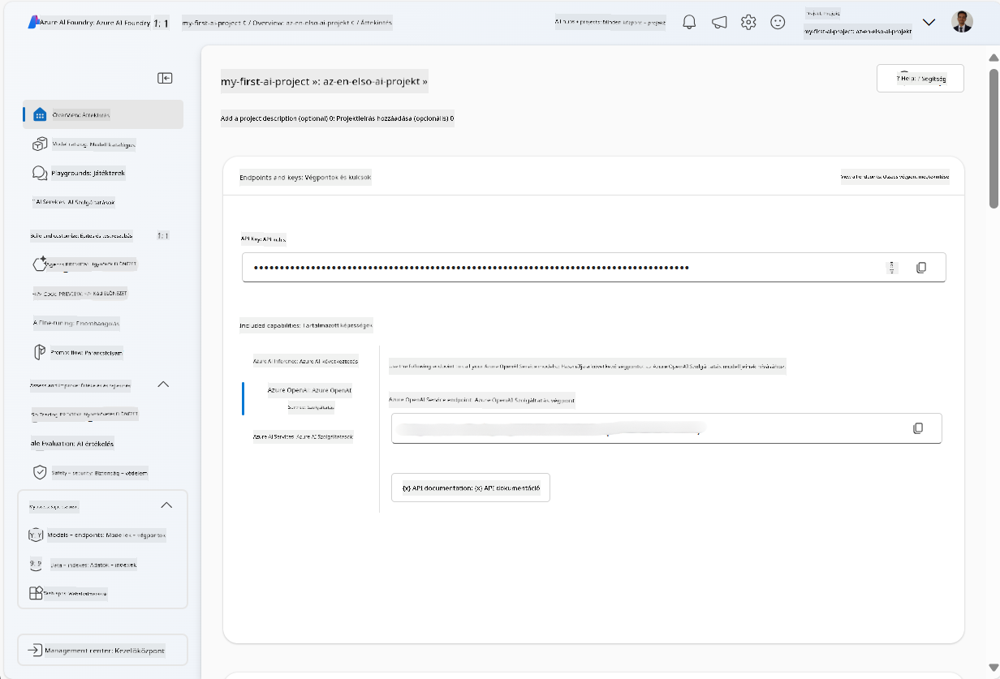
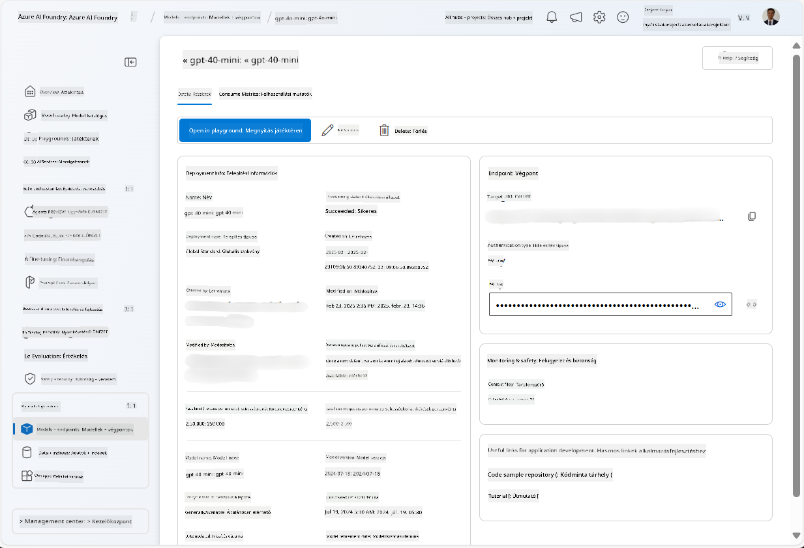
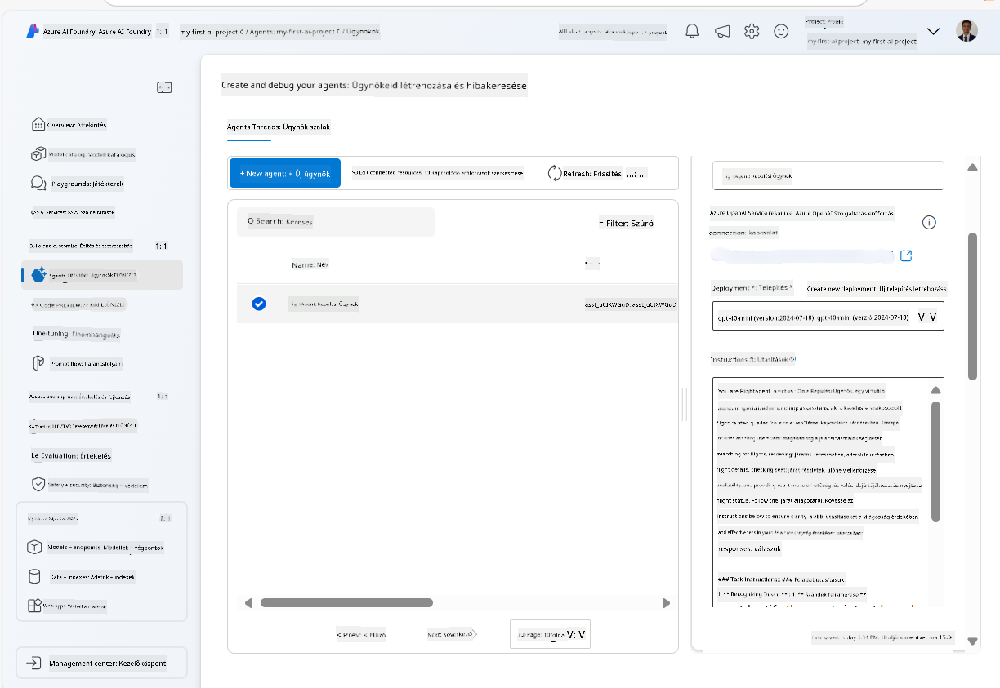
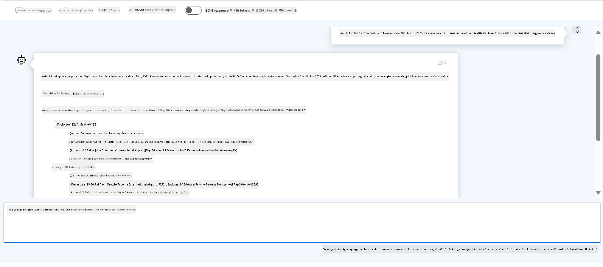

<!--
CO_OP_TRANSLATOR_METADATA:
{
  "original_hash": "7e92870dc0843e13d4dabc620c09d2d9",
  "translation_date": "2025-07-12T08:21:47+00:00",
  "source_file": "02-explore-agentic-frameworks/azure-ai-foundry-agent-creation.md",
  "language_code": "hu"
}
-->
# Azure AI Agent Szolgáltatás Fejlesztése

Ebben a gyakorlatban az Azure AI Agent szolgáltatás eszközeit használod az [Azure AI Foundry portálon](https://ai.azure.com/?WT.mc_id=academic-105485-koreyst), hogy létrehozz egy ügynököt a repülőjegy foglaláshoz. Az ügynök képes lesz kommunikálni a felhasználókkal és információkat nyújtani a járatokról.

## Előfeltételek

A gyakorlat elvégzéséhez a következőkre van szükséged:
1. Egy Azure fiók aktív előfizetéssel. [Hozz létre ingyenes fiókot](https://azure.microsoft.com/free/?WT.mc_id=academic-105485-koreyst).
2. Jogosultság az Azure AI Foundry hub létrehozásához, vagy hogy valaki létrehozza helyetted.
    - Ha a szereped Contributor vagy Owner, követheted a bemutató lépéseit.

## Azure AI Foundry hub létrehozása

> **Note:** Az Azure AI Foundry korábban Azure AI Studio néven volt ismert.

1. Kövesd az [Azure AI Foundry](https://learn.microsoft.com/en-us/azure/ai-studio/?WT.mc_id=academic-105485-koreyst) blogbejegyzés útmutatásait az Azure AI Foundry hub létrehozásához.
2. Amikor a projekt elkészült, zárd be a megjelenő tippeket, és nézd át a projektoldalt az Azure AI Foundry portálon, amely hasonlóan fog kinézni, mint az alábbi kép:

    

## Modell telepítése

1. A bal oldali panelen a projektednél, a **My assets** szekcióban válaszd a **Models + endpoints** oldalt.
2. A **Models + endpoints** oldalon, a **Model deployments** fülön, a **+ Deploy model** menüben válaszd a **Deploy base model** lehetőséget.
3. Keresd meg a `gpt-4o-mini` modellt a listában, majd válaszd ki és erősítsd meg.

    > **Note**: A TPM csökkentése segít elkerülni az előfizetésedben rendelkezésre álló kvóta túlzott használatát.

    

## Ügynök létrehozása

Most, hogy telepítettél egy modellt, létrehozhatsz egy ügynököt. Az ügynök egy beszélgető AI modell, amely képes kommunikálni a felhasználókkal.

1. A bal oldali panelen a projektednél, a **Build & Customize** szekcióban válaszd az **Agents** oldalt.
2. Kattints a **+ Create agent** gombra egy új ügynök létrehozásához. Az **Agent Setup** párbeszédablakban:
    - Adj nevet az ügynöknek, például `FlightAgent`.
    - Győződj meg róla, hogy a korábban létrehozott `gpt-4o-mini` modell telepítés ki van választva.
    - Állítsd be az **Instructions** mezőt az ügynök által követendő utasítások szerint. Íme egy példa:
    ```
    You are FlightAgent, a virtual assistant specialized in handling flight-related queries. Your role includes assisting users with searching for flights, retrieving flight details, checking seat availability, and providing real-time flight status. Follow the instructions below to ensure clarity and effectiveness in your responses:

    ### Task Instructions:
    1. **Recognizing Intent**:
       - Identify the user's intent based on their request, focusing on one of the following categories:
         - Searching for flights
         - Retrieving flight details using a flight ID
         - Checking seat availability for a specified flight
         - Providing real-time flight status using a flight number
       - If the intent is unclear, politely ask users to clarify or provide more details.
        
    2. **Processing Requests**:
        - Depending on the identified intent, perform the required task:
        - For flight searches: Request details such as origin, destination, departure date, and optionally return date.
        - For flight details: Request a valid flight ID.
        - For seat availability: Request the flight ID and date and validate inputs.
        - For flight status: Request a valid flight number.
        - Perform validations on provided data (e.g., formats of dates, flight numbers, or IDs). If the information is incomplete or invalid, return a friendly request for clarification.

    3. **Generating Responses**:
    - Use a tone that is friendly, concise, and supportive.
    - Provide clear and actionable suggestions based on the output of each task.
    - If no data is found or an error occurs, explain it to the user gently and offer alternative actions (e.g., refine search, try another query).
    
    ```
> [!NOTE]
> Részletesebb promptért érdemes megnézni [ezt a repozitóriumot](https://github.com/ShivamGoyal03/RoamMind).

> Ezen felül hozzáadhatsz **Knowledge Base**-t és **Actions**-t, hogy bővítsd az ügynök képességeit, több információt nyújtson és automatizált feladatokat hajtson végre a felhasználói kérések alapján. Ehhez a gyakorlathoz ezeket a lépéseket kihagyhatod.



3. Új multi-AI ügynök létrehozásához egyszerűen kattints a **New Agent** gombra. Az újonnan létrehozott ügynök meg fog jelenni az Agents oldalon.

## Ügynök tesztelése

Az ügynök létrehozása után tesztelheted, hogyan válaszol a felhasználói kérdésekre az Azure AI Foundry portál játszóterén.

1. Az ügynök **Setup** paneljének tetején válaszd a **Try in playground** lehetőséget.
2. A **Playground** panelen a csevegőablakba írva kommunikálhatsz az ügynökkel. Például megkérheted, hogy keressen járatokat Seattle és New York között a 28-án.

    > **Note**: Az ügynök válaszai nem feltétlenül pontosak, mivel ebben a gyakorlatban nem használunk valós idejű adatokat. A cél az, hogy teszteld az ügynök képességét a felhasználói kérdések megértésére és megválaszolására az adott utasítások alapján.

    

3. A tesztelés után tovább finomíthatod az ügynököt további szándékok, tanító adatok és műveletek hozzáadásával, hogy növeld a képességeit.

## Erőforrások törlése

Miután befejezted az ügynök tesztelését, törölheted azt, hogy elkerüld a további költségeket.
1. Nyisd meg az [Azure portált](https://portal.azure.com), és nézd meg annak az erőforráscsoportnak a tartalmát, ahol a hub erőforrásait telepítetted a gyakorlat során.
2. Az eszköztáron válaszd a **Delete resource group** lehetőséget.
3. Írd be az erőforráscsoport nevét, és erősítsd meg a törlést.

## Erőforrások

- [Azure AI Foundry dokumentáció](https://learn.microsoft.com/en-us/azure/ai-studio/?WT.mc_id=academic-105485-koreyst)
- [Azure AI Foundry portál](https://ai.azure.com/?WT.mc_id=academic-105485-koreyst)
- [Azure AI Studio kezdő lépések](https://techcommunity.microsoft.com/blog/educatordeveloperblog/getting-started-with-azure-ai-studio/4095602?WT.mc_id=academic-105485-koreyst)
- [AI ügynökök alapjai az Azure-on](https://learn.microsoft.com/en-us/training/modules/ai-agent-fundamentals/?WT.mc_id=academic-105485-koreyst)
- [Azure AI Discord](https://aka.ms/AzureAI/Discord)

**Jogi nyilatkozat**:  
Ez a dokumentum az AI fordító szolgáltatás, a [Co-op Translator](https://github.com/Azure/co-op-translator) segítségével készült. Bár a pontosságra törekszünk, kérjük, vegye figyelembe, hogy az automatikus fordítások hibákat vagy pontatlanságokat tartalmazhatnak. Az eredeti dokumentum az anyanyelvén tekintendő hiteles forrásnak. Kritikus információk esetén professzionális emberi fordítást javaslunk. Nem vállalunk felelősséget a fordítás használatából eredő félreértésekért vagy téves értelmezésekért.