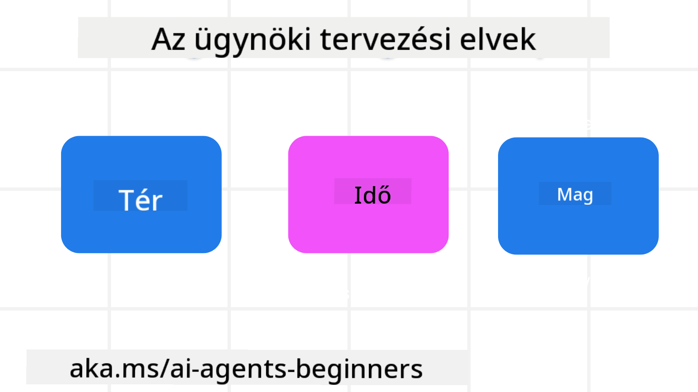

<!--
CO_OP_TRANSLATOR_METADATA:
{
  "original_hash": "4c46e4ff9e349c521e2b0b17f51afa64",
  "translation_date": "2025-08-29T20:14:43+00:00",
  "source_file": "03-agentic-design-patterns/README.md",
  "language_code": "hu"
}
-->

> _(Kattints a fenti képre, hogy megnézd a leckéhez tartozó videót)_
# AI Ügynöki Tervezési Alapelvek

## Bevezetés

Számos módja van az AI ügynöki rendszerek építésének. Mivel a kétértelműség a Generatív AI tervezésében inkább jellemző, mintsem hiba, néha nehéz a mérnököknek eldönteni, hol is kezdjék. Létrehoztunk egy emberközpontú UX tervezési alapelvekből álló készletet, amely lehetővé teszi a fejlesztők számára, hogy ügyfélközpontú ügynöki rendszereket építsenek üzleti igényeik megoldására. Ezek a tervezési alapelvek nem előíró jellegű architektúrák, hanem inkább kiindulópontot jelentenek azoknak a csapatoknak, akik ügynöki élményeket definiálnak és építenek.

Általánosságban az ügynököknek a következőket kell tenniük:

- Bővíteni és skálázni az emberi képességeket (ötletelés, problémamegoldás, automatizálás stb.)
- Kitölteni a tudásbeli hiányosságokat (gyors tájékozódás tudásterületeken, fordítás stb.)
- Elősegíteni és támogatni az együttműködést az egyéni preferenciáinknak megfelelő módon
- Jobb verziókat készíteni belőlünk (pl. életvezetési tanácsadó/feladatkezelő, érzelmi szabályozási és tudatossági készségek fejlesztése, reziliencia építése stb.)

## Ebben a leckében szó lesz

- Mik az Ügynöki Tervezési Alapelvek
- Milyen irányelveket érdemes követni ezeknek az alapelveknek a megvalósítása során
- Példák az alapelvek használatára

## Tanulási célok

A lecke elvégzése után képes leszel:

1. Elmagyarázni, mik az Ügynöki Tervezési Alapelvek
2. Elmagyarázni az Ügynöki Tervezési Alapelvek használatának irányelveit
3. Megérteni, hogyan lehet ügynököt építeni az Ügynöki Tervezési Alapelvek alapján

## Az Ügynöki Tervezési Alapelvek

### Ügynök (Tér)

Ez az a környezet, amelyben az ügynök működik. Ezek az alapelvek irányítják, hogyan tervezzük meg az ügynököket a fizikai és digitális világokban való részvételhez.

- **Kapcsolódás, nem összeomlás** – segítsen összekapcsolni embereket más emberekkel, eseményekkel és cselekvésre alkalmas tudással az együttműködés és kapcsolódás érdekében.
  - Az ügynökök segítenek összekapcsolni eseményeket, tudást és embereket.
  - Az ügynökök közelebb hozzák egymáshoz az embereket. Nem arra tervezték őket, hogy helyettesítsék vagy lekicsinyeljék az embereket.
- **Könnyen elérhető, de időnként láthatatlan** – az ügynök nagyrészt a háttérben működik, és csak akkor figyelmeztet, amikor releváns és megfelelő.
  - Az ügynök könnyen felfedezhető és elérhető az engedélyezett felhasználók számára bármilyen eszközön vagy platformon.
  - Az ügynök támogatja a multimodális bemeneteket és kimeneteket (hang, beszéd, szöveg stb.).
  - Az ügynök zökkenőmentesen vált a háttér és az előtér között; a proaktív és reaktív működés között, a felhasználói igények érzékelése alapján.
  - Az ügynök működhet láthatatlan formában, de a háttérfolyamatok útja és más ügynökökkel való együttműködése átlátható és a felhasználó által irányítható.

### Ügynök (Idő)

Ez az, ahogyan az ügynök az idő múlásával működik. Ezek az alapelvek irányítják, hogyan tervezzük meg az ügynököket, amelyek a múltban, jelenben és jövőben működnek.

- **Múlt**: A történelem tükrözése, amely magában foglalja mind az állapotot, mind a kontextust.
  - Az ügynök relevánsabb eredményeket nyújt a gazdagabb történelmi adatok elemzése alapján, nem csupán az események, emberek vagy állapotok alapján.
  - Az ügynök kapcsolatokat hoz létre múltbeli eseményekből, és aktívan reflektál az emlékezetre, hogy bekapcsolódjon a jelenlegi helyzetekbe.
- **Most**: Többet nyújt, mint értesítést.
  - Az ügynök átfogó megközelítést testesít meg az emberekkel való interakcióban. Amikor egy esemény történik, az ügynök túllép a statikus értesítéseken vagy más statikus formalitásokon. Az ügynök egyszerűsítheti a folyamatokat, vagy dinamikusan generálhat jelzéseket, hogy a felhasználó figyelmét a megfelelő pillanatban irányítsa.
  - Az ügynök információkat nyújt a kontextuális környezet, társadalmi és kulturális változások alapján, és a felhasználói szándékhoz igazítva.
  - Az ügynök interakciója fokozatos lehet, idővel fejlődhet/komplexebbé válhat, hogy hosszú távon támogassa a felhasználókat.
- **Jövő**: Alkalmazkodás és fejlődés.
  - Az ügynök alkalmazkodik különböző eszközökhöz, platformokhoz és modalitásokhoz.
  - Az ügynök alkalmazkodik a felhasználói viselkedéshez, hozzáférhetőségi igényekhez, és szabadon testreszabható.
  - Az ügynök a folyamatos felhasználói interakció révén formálódik és fejlődik.

### Ügynök (Mag)

Ezek az ügynök tervezésének kulcselemei.

- **Fogadd el a bizonytalanságot, de építs bizalmat**.
  - Az ügynök bizonyos szintű bizonytalansága elvárható. A bizonytalanság az ügynök tervezésének kulcseleme.
  - A bizalom és az átláthatóság az ügynök tervezésének alapvető rétegei.
  - Az emberek irányítják, hogy az ügynök mikor van be- vagy kikapcsolva, és az ügynök állapota mindig egyértelműen látható.

## Az alapelvek megvalósításának irányelvei

Amikor a fenti tervezési alapelveket használod, kövesd az alábbi irányelveket:

1. **Átláthatóság**: Tájékoztasd a felhasználót arról, hogy AI van jelen, hogyan működik (beleértve a múltbeli tevékenységeket), és hogyan adhat visszajelzést vagy módosíthatja a rendszert.
2. **Irányítás**: Tedd lehetővé a felhasználó számára, hogy testreszabja, megadja preferenciáit, és személyre szabja a rendszert és annak attribútumait (beleértve a felejtés lehetőségét is).
3. **Következetesség**: Törekedj következetes, multimodális élményekre az eszközök és végpontok között. Használj ismerős UI/UX elemeket, ahol lehetséges (pl. mikrofon ikon a hangalapú interakcióhoz), és csökkentsd a felhasználó kognitív terhelését, amennyire csak lehet (pl. törekedj tömör válaszokra, vizuális segédeszközökre és „Tudj meg többet” tartalomra).

## Hogyan tervezzünk utazási ügynököt ezekkel az alapelvekkel és irányelvekkel

Képzeld el, hogy egy utazási ügynököt tervezel, itt van, hogyan gondolkodhatsz a tervezési alapelvek és irányelvek használatáról:

1. **Átláthatóság** – Tájékoztasd a felhasználót arról, hogy az utazási ügynök egy AI-alapú ügynök. Adj néhány alapvető utasítást a kezdéshez (pl. egy „Helló” üzenet, minta kérdések). Dokumentáld ezt egyértelműen a termékoldalon. Mutasd meg a felhasználó által korábban feltett kérdések listáját. Tedd egyértelművé, hogyan adhat visszajelzést (például hüvelykujj fel/le, Visszajelzés küldése gomb stb.). Világosan fogalmazd meg, ha az ügynöknek vannak használati vagy témakörbeli korlátozásai.
2. **Irányítás** – Tedd egyértelművé, hogyan módosíthatja a felhasználó az ügynököt, miután létrehozta, például a Rendszer Prompt segítségével. Tedd lehetővé a felhasználó számára, hogy kiválassza, mennyire legyen részletes az ügynök, milyen stílusban írjon, és milyen témákról ne beszéljen. Engedd meg a felhasználónak, hogy megtekinthesse és törölhesse a kapcsolódó fájlokat vagy adatokat, kérdéseket és korábbi beszélgetéseket.
3. **Következetesség** – Győződj meg arról, hogy a Megosztás Prompt, fájl vagy fotó hozzáadása, valamint valaki vagy valami megjelölése ikonok szabványosak és felismerhetők. Használj például gemkapocs ikont a fájlfeltöltés/megosztás jelzésére az ügynökkel, és kép ikont a grafikai feltöltés jelzésére.

### További kérdéseid vannak az AI Ügynöki Tervezési Mintákról?

Csatlakozz az [Azure AI Foundry Discord](https://aka.ms/ai-agents/discord) közösséghez, hogy találkozz más tanulókkal, részt vegyél konzultációkon, és választ kapj az AI ügynökökkel kapcsolatos kérdéseidre.

## További források

## Előző lecke

[Ügynöki keretrendszerek felfedezése](../02-explore-agentic-frameworks/README.md)

## Következő lecke

[Eszközhasználati tervezési minta](../04-tool-use/README.md)

---

**Felelősség kizárása**:  
Ez a dokumentum az AI fordítási szolgáltatás, a [Co-op Translator](https://github.com/Azure/co-op-translator) segítségével lett lefordítva. Bár törekszünk a pontosságra, kérjük, vegye figyelembe, hogy az automatikus fordítások hibákat vagy pontatlanságokat tartalmazhatnak. Az eredeti dokumentum az eredeti nyelvén tekintendő hiteles forrásnak. Kritikus információk esetén javasolt professzionális emberi fordítást igénybe venni. Nem vállalunk felelősséget semmilyen félreértésért vagy téves értelmezésért, amely a fordítás használatából eredhet.