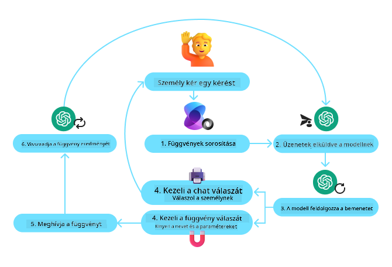

<!--
CO_OP_TRANSLATOR_METADATA:
{
  "original_hash": "88258b03f2893aa2e69eb8fb24baabbc",
  "translation_date": "2025-07-12T09:42:13+00:00",
  "source_file": "04-tool-use/README.md",
  "language_code": "hu"
}
-->
[](https://youtu.be/vieRiPRx-gI?si=cEZ8ApnT6Sus9rhn)

> _(Kattints a fenti képre a lecke videójának megtekintéséhez)_

# Eszközhasználati tervezési minta

Az eszközök azért érdekesek, mert lehetővé teszik az AI ügynökök számára, hogy szélesebb körű képességekkel rendelkezzenek. Ahelyett, hogy az ügynöknek csak egy korlátozott műveletkészlete lenne, egy eszköz hozzáadásával az ügynök most már sokféle műveletet képes végrehajtani. Ebben a fejezetben megvizsgáljuk az Eszközhasználati tervezési mintát, amely leírja, hogyan használhatnak az AI ügynökök specifikus eszközöket céljaik eléréséhez.

## Bevezetés

Ebben a leckében a következő kérdésekre keressük a választ:

- Mi az eszközhasználati tervezési minta?
- Milyen felhasználási esetekben alkalmazható?
- Milyen elemekre/építőkövekre van szükség a minta megvalósításához?
- Milyen különleges szempontokat kell figyelembe venni az Eszközhasználati tervezési minta alkalmazásakor, hogy megbízható AI ügynököket építsünk?

## Tanulási célok

A lecke elvégzése után képes leszel:

- Meghatározni az Eszközhasználati tervezési mintát és célját.
- Azonosítani azokat a felhasználási eseteket, ahol az Eszközhasználati tervezési minta alkalmazható.
- Megérteni a minta megvalósításához szükséges kulcselemeket.
- Felismerni a megbízhatóság biztosításához szükséges szempontokat az AI ügynökök esetében, amelyek ezt a mintát használják.

## Mi az az Eszközhasználati tervezési minta?

Az **Eszközhasználati tervezési minta** arra fókuszál, hogy a nagy nyelvi modellek (LLM-ek) képesek legyenek külső eszközökkel interakcióba lépni, hogy konkrét célokat érjenek el. Az eszközök olyan kódok, amelyeket az ügynök végrehajthat műveletek elvégzésére. Egy eszköz lehet egy egyszerű függvény, például egy számológép, vagy egy harmadik fél szolgáltatásának API hívása, mint például részvényárfolyam lekérdezés vagy időjárás-előrejelzés. Az AI ügynökök kontextusában az eszközöket úgy tervezték, hogy az ügynökök a **modell által generált függvényhívásokra** reagálva hajtsák végre őket.

## Milyen felhasználási esetekben alkalmazható?

Az AI ügynökök eszközöket használhatnak összetett feladatok elvégzésére, információk lekérésére vagy döntéshozatalra. Az eszközhasználati tervezési mintát gyakran alkalmazzák olyan helyzetekben, ahol dinamikus interakció szükséges külső rendszerekkel, például adatbázisokkal, webszolgáltatásokkal vagy kódértelmezőkkel. Ez a képesség számos különböző felhasználási esetben hasznos, többek között:

- **Dinamikus információlekérés:** Az ügynökök külső API-kat vagy adatbázisokat kérdezhetnek le, hogy naprakész adatokat szerezzenek (pl. SQLite adatbázis lekérdezése adat elemzéshez, részvényárfolyam vagy időjárás lekérése).
- **Kódvégrehajtás és értelmezés:** Az ügynökök kódot vagy szkripteket futtathatnak matematikai problémák megoldására, jelentések generálására vagy szimulációk végrehajtására.
- **Munkafolyamat-automatizálás:** Ismétlődő vagy több lépésből álló munkafolyamatok automatizálása eszközök, például feladatütemezők, e-mail szolgáltatások vagy adatcsatornák integrálásával.
- **Ügyfélszolgálat:** Az ügynökök CRM rendszerekkel, jegykezelő platformokkal vagy tudásbázisokkal léphetnek kapcsolatba a felhasználói kérdések megoldásához.
- **Tartalomkészítés és szerkesztés:** Az ügynökök eszközöket használhatnak, mint például nyelvtani ellenőrzők, szövegösszefoglalók vagy tartalombiztonsági értékelők, hogy segítsék a tartalomkészítési feladatokat.

## Milyen elemekre/építőkövekre van szükség az eszközhasználati tervezési minta megvalósításához?

Ezek az építőkövek teszik lehetővé, hogy az AI ügynök széles körű feladatokat hajtson végre. Nézzük meg az Eszközhasználati tervezési minta megvalósításához szükséges kulcselemeket:

- **Függvény/Eszköz sémák:** Részletes definíciók az elérhető eszközökről, beleértve a függvény nevét, célját, szükséges paramétereket és várt kimeneteket. Ezek a sémák lehetővé teszik az LLM számára, hogy megértse, milyen eszközök állnak rendelkezésre, és hogyan kell érvényes kéréseket összeállítani.

- **Függvényvégrehajtási logika:** Szabályozza, hogy mikor és hogyan hívják meg az eszközöket a felhasználó szándéka és a beszélgetés kontextusa alapján. Ez magában foglalhat tervező modulokat, irányító mechanizmusokat vagy feltételes folyamatokat, amelyek dinamikusan határozzák meg az eszközhasználatot.

- **Üzenetkezelő rendszer:** Olyan komponensek, amelyek kezelik a beszélgetés folyamatát a felhasználói bemenetek, LLM válaszok, eszközhívások és eszközkimenetek között.

- **Eszközintegrációs keretrendszer:** Infrastruktúra, amely összekapcsolja az ügynököt különféle eszközökkel, legyenek azok egyszerű függvények vagy összetett külső szolgáltatások.

- **Hibakezelés és érvényesítés:** Mechanizmusok az eszközvégrehajtás hibáinak kezelésére, a paraméterek ellenőrzésére és a váratlan válaszok kezelésére.

- **Állapotkezelés:** Követi a beszélgetés kontextusát, korábbi eszközhasználatokat és tartós adatokat, hogy biztosítsa a konzisztenciát a többfordulós interakciók során.

Most nézzük meg részletesebben a Függvény/Eszköz hívást.

### Függvény/Eszköz hívás

A függvényhívás az elsődleges módja annak, hogy a nagy nyelvi modelleket (LLM-eket) eszközökkel való interakcióra bírjuk. Gyakran használják felcserélhetően a 'Függvény' és 'Eszköz' kifejezéseket, mert a 'függvények' (újrahasználható kódrészek) azok az 'eszközök', amelyeket az ügynökök a feladatok végrehajtására használnak. Ahhoz, hogy egy függvény kódját meghívják, az LLM-nek össze kell vetnie a felhasználó kérését a függvény leírásával. Ehhez egy sémát küldenek az LLM-nek, amely tartalmazza az összes elérhető függvény leírását. Az LLM kiválasztja a feladathoz legmegfelelőbb függvényt, és visszaadja annak nevét és argumentumait. A kiválasztott függvényt meghívják, a válaszát visszaküldik az LLM-nek, amely ezt az információt felhasználva válaszol a felhasználó kérésére.

A fejlesztőknek a függvényhívás megvalósításához szükségük lesz:

1. Egy olyan LLM modellre, amely támogatja a függvényhívást
2. Egy sémára, amely tartalmazza a függvények leírását
3. A leírt függvények kódjára

Vegyük példaként, hogy hogyan kérhetjük le egy város aktuális idejét:

1. **Indítsunk el egy olyan LLM-et, amely támogatja a függvényhívást:**

    Nem minden modell támogatja a függvényhívást, ezért fontos ellenőrizni, hogy az általad használt LLM igen. Az <a href="https://learn.microsoft.com/azure/ai-services/openai/how-to/function-calling" target="_blank">Azure OpenAI</a> támogatja a függvényhívást. Kezdhetjük az Azure OpenAI kliens inicializálásával.

    ```python
    # Initialize the Azure OpenAI client
    client = AzureOpenAI(
        azure_endpoint = os.getenv("AZURE_OPENAI_ENDPOINT"), 
        api_key=os.getenv("AZURE_OPENAI_API_KEY"),  
        api_version="2024-05-01-preview"
    )
    ```

1. **Hozzunk létre egy függvénysémát:**

    Ezután definiálunk egy JSON sémát, amely tartalmazza a függvény nevét, leírását, valamint a függvény paramétereinek nevét és leírását.
    Ezt a sémát átadjuk a korábban létrehozott kliensnek, valamint a felhasználó kérésének, hogy megtaláljuk a San Francisco-i időt. Fontos megjegyezni, hogy egy **eszközhívás** az, ami visszatér, **nem** a kérdés végső válasza. Ahogy korábban említettük, az LLM visszaadja a feladathoz kiválasztott függvény nevét és az átadandó argumentumokat.

    ```python
    # Function description for the model to read
    tools = [
        {
            "type": "function",
            "function": {
                "name": "get_current_time",
                "description": "Get the current time in a given location",
                "parameters": {
                    "type": "object",
                    "properties": {
                        "location": {
                            "type": "string",
                            "description": "The city name, e.g. San Francisco",
                        },
                    },
                    "required": ["location"],
                },
            }
        }
    ]
    ```
   
    ```python
  
    # Initial user message
    messages = [{"role": "user", "content": "What's the current time in San Francisco"}] 
  
    # First API call: Ask the model to use the function
      response = client.chat.completions.create(
          model=deployment_name,
          messages=messages,
          tools=tools,
          tool_choice="auto",
      )
  
      # Process the model's response
      response_message = response.choices[0].message
      messages.append(response_message)
  
      print("Model's response:")  

      print(response_message)
  
    ```

    ```bash
    Model's response:
    ChatCompletionMessage(content=None, role='assistant', function_call=None, tool_calls=[ChatCompletionMessageToolCall(id='call_pOsKdUlqvdyttYB67MOj434b', function=Function(arguments='{"location":"San Francisco"}', name='get_current_time'), type='function')])
    ```
  
1. **A feladat végrehajtásához szükséges függvénykód:**

    Miután az LLM kiválasztotta, melyik függvényt kell futtatni, meg kell valósítani és végre kell hajtani a feladatot ellátó kódot.
    Pythonban megvalósíthatjuk az aktuális idő lekérését. Emellett szükség lesz arra is, hogy a response_message-ből kinyerjük a függvény nevét és argumentumait a végső eredményhez.

    ```python
      def get_current_time(location):
        """Get the current time for a given location"""
        print(f"get_current_time called with location: {location}")  
        location_lower = location.lower()
        
        for key, timezone in TIMEZONE_DATA.items():
            if key in location_lower:
                print(f"Timezone found for {key}")  
                current_time = datetime.now(ZoneInfo(timezone)).strftime("%I:%M %p")
                return json.dumps({
                    "location": location,
                    "current_time": current_time
                })
      
        print(f"No timezone data found for {location_lower}")  
        return json.dumps({"location": location, "current_time": "unknown"})
    ```

    ```python
     # Handle function calls
      if response_message.tool_calls:
          for tool_call in response_message.tool_calls:
              if tool_call.function.name == "get_current_time":
     
                  function_args = json.loads(tool_call.function.arguments)
     
                  time_response = get_current_time(
                      location=function_args.get("location")
                  )
     
                  messages.append({
                      "tool_call_id": tool_call.id,
                      "role": "tool",
                      "name": "get_current_time",
                      "content": time_response,
                  })
      else:
          print("No tool calls were made by the model.")  
  
      # Second API call: Get the final response from the model
      final_response = client.chat.completions.create(
          model=deployment_name,
          messages=messages,
      )
  
      return final_response.choices[0].message.content
     ```

    ```bash
      get_current_time called with location: San Francisco
      Timezone found for san francisco
      The current time in San Francisco is 09:24 AM.
     ```

A függvényhívás a legtöbb, ha nem az összes ügynök eszközhasználati tervezésének a központi eleme, azonban a megvalósítása nulláról néha kihívást jelenthet.
Ahogy a [2. leckében](../../../02-explore-agentic-frameworks) tanultuk, az ügynöki keretrendszerek előre elkészített építőelemeket biztosítanak az eszközhasználat megvalósításához.

## Eszközhasználati példák ügynöki keretrendszerekkel

Íme néhány példa arra, hogyan valósítható meg az Eszközhasználati tervezési minta különböző ügynöki keretrendszerek segítségével:

### Semantic Kernel

<a href="https://learn.microsoft.com/azure/ai-services/agents/overview" target="_blank">A Semantic Kernel</a> egy nyílt forráskódú AI keretrendszer .NET, Python és Java fejlesztők számára, akik nagy nyelvi modellekkel (LLM-ekkel) dolgoznak. Egyszerűsíti a függvényhívás használatát azzal, hogy automatikusan leírja a függvényeidet és azok paramétereit a modell számára egy <a href="https://learn.microsoft.com/semantic-kernel/concepts/ai-services/chat-completion/function-calling/?pivots=programming-language-python#1-serializing-the-functions" target="_blank">sorosítási</a> folyamaton keresztül. Emellett kezeli a modell és a kód közötti oda-vissza kommunikációt. Egy másik előnye az olyan ügynöki keretrendszerek használatának, mint a Semantic Kernel, hogy hozzáférést biztosít előre elkészített eszközökhöz, mint például a <a href="https://github.com/microsoft/semantic-kernel/blob/main/python/samples/getting_started_with_agents/openai_assistant/step4_assistant_tool_file_search.py" target="_blank">Fájlkereső</a> és a <a href="https://github.com/microsoft/semantic-kernel/blob/main/python/samples/getting_started_with_agents/openai_assistant/step3_assistant_tool_code_interpreter.py" target="_blank">Kódértelmező</a>.

Az alábbi ábra szemlélteti a függvényhívás folyamatát a Semantic Kernel használatával:



A Semantic Kernelben a függvényeket/eszközöket <a href="https://learn.microsoft.com/semantic-kernel/concepts/plugins/?pivots=programming-language-python" target="_blank">Pluginoknak</a> hívják. Az előbb látott `get_current_time` függvényt átalakíthatjuk pluginná úgy, hogy osztállyá alakítjuk, amely tartalmazza a függvényt. Importálhatjuk a `kernel_function` dekorátort is, amely átveszi a függvény leírását. Amikor létrehozol egy kernelt a GetCurrentTimePlugin segítségével, a kernel automatikusan sorosítja a függvényt és annak paramétereit, így létrehozva a sémát, amelyet az LLM-nek küld.

```python
from semantic_kernel.functions import kernel_function

class GetCurrentTimePlugin:
    async def __init__(self, location):
        self.location = location

    @kernel_function(
        description="Get the current time for a given location"
    )
    def get_current_time(location: str = ""):
        ...

```

```python 
from semantic_kernel import Kernel

# Create the kernel
kernel = Kernel()

# Create the plugin
get_current_time_plugin = GetCurrentTimePlugin(location)

# Add the plugin to the kernel
kernel.add_plugin(get_current_time_plugin)
```
  
### Azure AI Agent Service

Az <a href="https://learn.microsoft.com/azure/ai-services/agents/overview" target="_blank">Azure AI Agent Service</a> egy újabb ügynöki keretrendszer, amely lehetővé teszi a fejlesztők számára, hogy biztonságosan építsenek, telepítsenek és skálázzanak magas minőségű, bővíthető AI ügynököket anélkül, hogy az alapul szolgáló számítási és tárolási erőforrásokat kezelniük kellene. Különösen hasznos vállalati alkalmazásokhoz, mivel teljesen menedzselt szolgáltatás, vállalati szintű biztonsággal.

Az LLM API közvetlen használatához képest az Azure AI Agent Service néhány előnyt kínál, többek között:

- Automatikus eszközhívás – nem kell elemezni az eszközhívást, meghívni az eszközt és kezelni a választ; mindez most a szerver oldalon történik
- Biztonságosan kezelt adatok – ahelyett, hogy saját beszélgetési állapotot kezelnél, a szálakra támaszkodhatsz, amelyek tárolják a szükséges információkat
- Kész eszközök – olyan eszközök, amelyekkel adatforrásaiddal léphetsz kapcsolatba, például Bing, Azure AI Search és Azure Functions.

Az Azure AI Agent Service-ben elérhető eszközök két kategóriába sorolhatók:

1. Tudásalapú eszközök:
    - <a href="https://learn.microsoft.com/azure/ai-services/agents/how-to/tools/bing-grounding?tabs=python&pivots=overview" target="_blank">Bing keresés alapú tudás</a>
    - <a href="https://learn.microsoft.com/azure/ai-services/agents/how-to/tools/file-search?tabs=python&pivots=overview" target="_blank">Fájlkereső</a>
    - <a href="https://learn.microsoft.com/azure/ai-services/agents/how-to/tools/azure-ai-search?tabs=azurecli%2Cpython&pivots=overview-azure-ai-search" target="_blank">Azure AI Search</a>

2. Műveleti eszközök:
    - <a href="https://learn.microsoft.com/azure/ai-services/agents/how-to/tools/function-calling?tabs=python&pivots=overview" target="_blank">Függvényhívás</a>
    - <a href="https://learn.microsoft.com/azure/ai-services/agents/how-to/tools/code-interpreter?tabs=python&pivots=overview" target="_blank">Kódértelmező</a>
    - <a href="https://learn.microsoft.com/azure/ai-services/agents/how-to/tools/openapi-spec?tabs=python&pivots=overview" target="_blank">OpenAI által definiált eszközök</a>
    - <a href="https://learn.microsoft.com/azure/ai-services/agents/how-to/tools/azure-functions?pivots=overview" target="_blank
<a href="https://microsoft.github.io/build-your-first-agent-with-azure-ai-agent-service-workshop/" target="_blank">
Azure AI Agents Service Workshop</a>
- <a href="https://github.com/Azure-Samples/contoso-creative-writer/tree/main/docs/workshop" target="_blank">Contoso Creative Writer Többügynökös Workshop</a>
- <a href="https://learn.microsoft.com/semantic-kernel/concepts/ai-services/chat-completion/function-calling/?pivots=programming-language-python#1-serializing-the-functions" target="_blank">Semantic Kernel Függvényhívás Oktatóanyag</a>
- <a href="https://github.com/microsoft/semantic-kernel/blob/main/python/samples/getting_started_with_agents/openai_assistant/step3_assistant_tool_code_interpreter.py" target="_blank">Semantic Kernel Kódértelmező</a>
- <a href="https://microsoft.github.io/autogen/dev/user-guide/core-user-guide/components/tools.html" target="_blank">Autogen Eszközök</a>

## Előző Lecke

[Agentikus Tervezési Minták Megértése](../03-agentic-design-patterns/README.md)

## Következő Lecke

[Agentikus RAG](../05-agentic-rag/README.md)

**Jogi nyilatkozat**:  
Ez a dokumentum az AI fordító szolgáltatás, a [Co-op Translator](https://github.com/Azure/co-op-translator) segítségével készült. Bár a pontosságra törekszünk, kérjük, vegye figyelembe, hogy az automatikus fordítások hibákat vagy pontatlanságokat tartalmazhatnak. Az eredeti dokumentum az anyanyelvén tekintendő hiteles forrásnak. Kritikus információk esetén professzionális emberi fordítást javaslunk. Nem vállalunk felelősséget a fordítás használatából eredő félreértésekért vagy téves értelmezésekért.