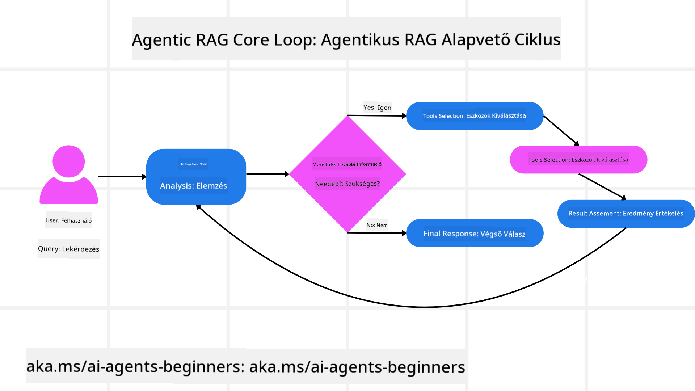
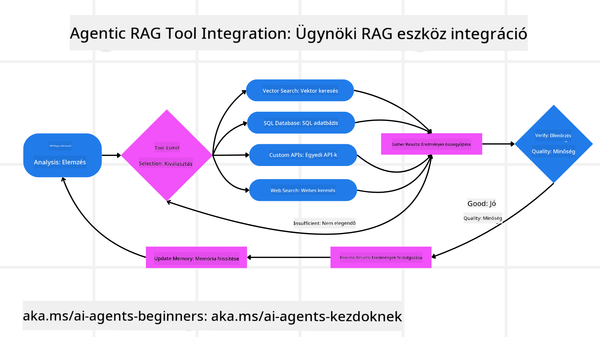
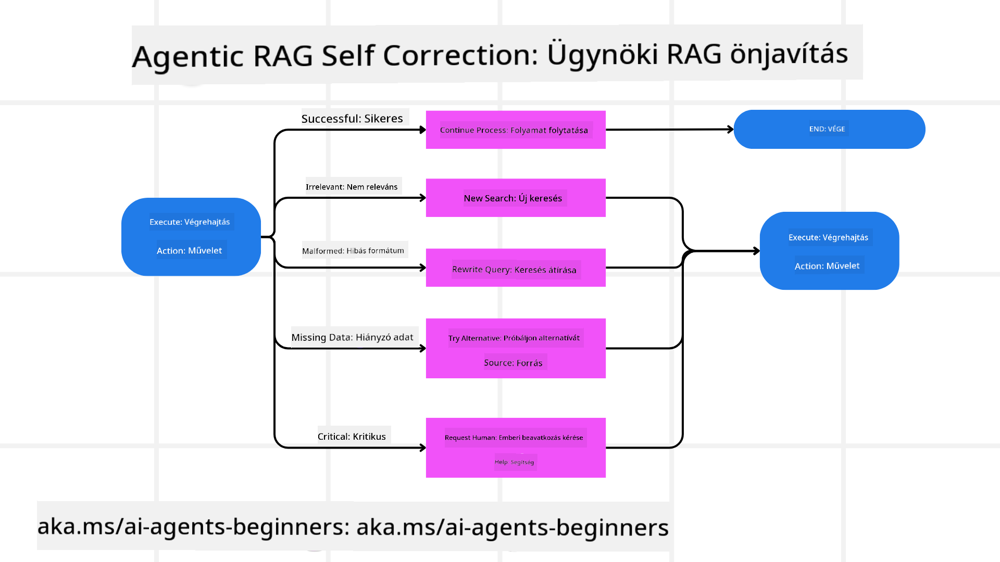

<!--
CO_OP_TRANSLATOR_METADATA:
{
  "original_hash": "7622aa72f9e676e593339f5f694ecd7d",
  "translation_date": "2025-07-12T10:10:26+00:00",
  "source_file": "05-agentic-rag/README.md",
  "language_code": "hu"
}
-->

> _(Kattints a fenti képre a lecke videójának megtekintéséhez)_

# Agentic RAG

Ez a lecke átfogó áttekintést nyújt az Agentic Retrieval-Augmented Generation-ről (Agentic RAG), egy feltörekvő AI paradigmáról, ahol a nagy nyelvi modellek (LLM-ek) önállóan tervezik meg a következő lépéseiket, miközben külső forrásokból húznak be információkat. A statikus lekérdezés-olvasás mintáktól eltérően az Agentic RAG iteratív hívásokat alkalmaz az LLM-hez, amelyeket eszköz- vagy függvényhívások és strukturált kimenetek szakítanak meg. A rendszer értékeli az eredményeket, finomítja a lekérdezéseket, szükség esetén további eszközöket hív meg, és ezt a ciklust addig folytatja, amíg kielégítő megoldást nem ér el.

## Bevezetés

Ebben a leckében a következőkről lesz szó:

- **Agentic RAG megértése:** Ismerd meg az AI új paradigmáját, ahol a nagy nyelvi modellek önállóan tervezik meg a következő lépéseiket, miközben külső adatforrásokból szereznek információkat.
- **Iteratív Maker-Checker stílus elsajátítása:** Értsd meg az LLM-hez történő iteratív hívások körforgását, amelyet eszköz- vagy függvényhívások és strukturált kimenetek szakítanak meg, a helyesség javítása és a hibás lekérdezések kezelése érdekében.
- **Gyakorlati alkalmazások felfedezése:** Azonosíts olyan helyzeteket, ahol az Agentic RAG kiemelkedik, például helyesség-központú környezetekben, összetett adatbázis-interakciókban és hosszabb munkafolyamatokban.

## Tanulási célok

A lecke elvégzése után tudni fogod/érteni fogod:

- **Agentic RAG megértése:** Ismerd meg az AI új paradigmáját, ahol a nagy nyelvi modellek önállóan tervezik meg a következő lépéseiket, miközben külső adatforrásokból szereznek információkat.
- **Iteratív Maker-Checker stílus:** Értsd meg az LLM-hez történő iteratív hívások körforgását, amelyet eszköz- vagy függvényhívások és strukturált kimenetek szakítanak meg, a helyesség javítása és a hibás lekérdezések kezelése érdekében.
- **A gondolkodási folyamat irányítása:** Értsd meg, hogy a rendszer képes saját maga irányítani a gondolkodási folyamatát, döntéseket hozva arról, hogyan közelítse meg a problémákat, anélkül, hogy előre definiált útvonalakhoz kötődne.
- **Munkafolyamat:** Értsd meg, hogyan dönt egy agentic modell önállóan arról, hogy piaci trendjelentéseket szerezzen be, versenytársi adatokat azonosítson, belső értékesítési mutatókat kapcsoljon össze, szintetizálja az eredményeket, és értékelje a stratégiát.
- **Iteratív ciklusok, eszközintegráció és memória:** Ismerd meg a rendszer körkörös interakciós mintáját, amely lépéseken át megőrzi az állapotot és memóriát, elkerülve az ismétlődő ciklusokat, és megalapozott döntéseket hozva.
- **Hibakezelés és önkorrekció:** Fedezd fel a rendszer robusztus önkorrekciós mechanizmusait, beleértve az iterálást és újra lekérdezést, diagnosztikai eszközök használatát, valamint az emberi felügyelethez való visszatérést.
- **Az ügynökség határai:** Értsd meg az Agentic RAG korlátait, különös tekintettel a domain-specifikus autonómiára, az infrastruktúra függőségére és a biztonsági korlátok tiszteletben tartására.
- **Gyakorlati felhasználási esetek és érték:** Azonosíts olyan helyzeteket, ahol az Agentic RAG kiemelkedik, például helyesség-központú környezetekben, összetett adatbázis-interakciókban és hosszabb munkafolyamatokban.
- **Irányítás, átláthatóság és bizalom:** Ismerd meg az irányítás és átláthatóság fontosságát, beleértve a magyarázható gondolkodást, az elfogultság kontrollját és az emberi felügyeletet.

## Mi az az Agentic RAG?

Az Agentic Retrieval-Augmented Generation (Agentic RAG) egy feltörekvő AI paradigma, ahol a nagy nyelvi modellek (LLM-ek) önállóan tervezik meg a következő lépéseiket, miközben külső forrásokból húznak be információkat. A statikus lekérdezés-olvasás mintáktól eltérően az Agentic RAG iteratív hívásokat alkalmaz az LLM-hez, amelyeket eszköz- vagy függvényhívások és strukturált kimenetek szakítanak meg. A rendszer értékeli az eredményeket, finomítja a lekérdezéseket, szükség esetén további eszközöket hív meg, és ezt a ciklust addig folytatja, amíg kielégítő megoldást nem ér el. Ez az iteratív „maker-checker” stílus javítja a helyességet, kezeli a hibás lekérdezéseket, és biztosítja a magas minőségű eredményeket.

A rendszer aktívan irányítja a gondolkodási folyamatát, újraírással javítja a sikertelen lekérdezéseket, különböző lekérdezési módszereket választ, és több eszközt integrál — például vektoros keresést az Azure AI Search-ben, SQL adatbázisokat vagy egyedi API-kat — mielőtt véglegesítené a válaszát. Az agentic rendszer megkülönböztető tulajdonsága, hogy képes saját maga irányítani a gondolkodási folyamatát. A hagyományos RAG megoldások előre definiált útvonalakra támaszkodnak, míg az agentic rendszer önállóan határozza meg a lépések sorrendjét az általa talált információk minősége alapján.

## Az Agentic Retrieval-Augmented Generation (Agentic RAG) meghatározása

Az Agentic Retrieval-Augmented Generation (Agentic RAG) egy új AI fejlesztési paradigma, amelyben az LLM-ek nemcsak külső adatforrásokból szereznek információkat, hanem önállóan tervezik meg a következő lépéseiket. A statikus lekérdezés-olvasás mintáktól vagy gondosan megírt prompt-szekvenciáktól eltérően az Agentic RAG egy iteratív hívásciklust alkalmaz az LLM-hez, amelyet eszköz- vagy függvényhívások és strukturált kimenetek szakítanak meg. Minden lépésnél a rendszer értékeli az elért eredményeket, eldönti, hogy finomítja-e a lekérdezéseket, szükség esetén további eszközöket hív meg, és ezt a ciklust addig folytatja, amíg kielégítő megoldást nem talál.

Ez az iteratív „maker-checker” működési mód a helyesség javítására, a hibás lekérdezések kezelésére (például NL2SQL esetén) és kiegyensúlyozott, magas minőségű eredmények biztosítására szolgál. Ahelyett, hogy kizárólag gondosan megtervezett prompt-láncokra támaszkodna, a rendszer aktívan irányítja a gondolkodási folyamatát. Újraírással javítja a sikertelen lekérdezéseket, különböző lekérdezési módszereket választ, és több eszközt integrál — például vektoros keresést az Azure AI Search-ben, SQL adatbázisokat vagy egyedi API-kat — mielőtt véglegesítené a válaszát. Ez megszünteti a túl bonyolult koordinációs keretrendszerek szükségességét. Ehelyett egy viszonylag egyszerű „LLM hívás → eszköz használat → LLM hívás → …” ciklus is kifinomult és megalapozott kimeneteket eredményezhet.

## A gondolkodási folyamat irányítása

Az a megkülönböztető tulajdonság, amely „agentic”-ké tesz egy rendszert, az a képesség, hogy saját maga irányítja a gondolkodási folyamatát. A hagyományos RAG megoldások gyakran emberek által előre meghatározott útvonalra támaszkodnak: egy gondolatmenet-láncra, amely meghatározza, mit és mikor kell lekérdezni.  
De amikor egy rendszer valóban agentic, akkor belsőleg dönt arról, hogyan közelítse meg a problémát. Nem csupán egy szkriptet hajt végre; önállóan határozza meg a lépések sorrendjét az általa talált információk minősége alapján.  
Például, ha egy termékbevezetési stratégiát kell kidolgoznia, nem csak egy olyan prompt-ra támaszkodik, amely az egész kutatási és döntéshozatali munkafolyamatot leírja. Ehelyett az agentic modell önállóan dönt arról, hogy:

1. Beszerezze a jelenlegi piaci trendjelentéseket a Bing Web Grounding segítségével
2. Azonosítsa a releváns versenytársi adatokat az Azure AI Search használatával
3. Összekapcsolja a történelmi belső értékesítési mutatókat az Azure SQL Database segítségével
4. Szintetizálja az eredményeket egy koherens stratégiává, amelyet az Azure OpenAI Service koordinál
5. Értékelje a stratégiát hiányosságok vagy ellentmondások szempontjából, és ha szükséges, újabb lekérdezési kört indít

Mindezeket a lépéseket — a lekérdezések finomítását, a források kiválasztását, az ismétlést, amíg „elégedett” nem lesz a válasszal — a modell döntései vezérlik, nem pedig előre megírt szkriptek.

## Iteratív ciklusok, eszközintegráció és memória

Egy agentic rendszer egy körkörös interakciós mintára épül:

- **Kezdeti hívás:** A felhasználó célja (más néven felhasználói prompt) kerül bemutatásra az LLM-nek.
- **Eszköz meghívása:** Ha a modell hiányzó információt vagy kétértelmű utasítást észlel, kiválaszt egy eszközt vagy lekérdezési módszert — például vektoros adatbázis-lekérdezést (pl. Azure AI Search hibrid keresés privát adatokon) vagy strukturált SQL hívást — hogy több kontextust gyűjtsön.
- **Értékelés és finomítás:** A visszakapott adatok áttekintése után a modell eldönti, hogy az információ elegendő-e. Ha nem, finomítja a lekérdezést, más eszközt próbál ki, vagy módosítja a megközelítését.
- **Ismétlés, amíg elégedett:** Ez a ciklus addig folytatódik, amíg a modell úgy nem ítéli meg, hogy elegendő tisztánlátással és bizonyítékkal rendelkezik egy végleges, jól átgondolt válasz megadásához.
- **Memória és állapot:** Mivel a rendszer megőrzi az állapotot és memóriát a lépések között, képes felidézni a korábbi próbálkozásokat és azok eredményeit, elkerülve az ismétlődő ciklusokat, és megalapozottabb döntéseket hozva a folyamat során.

Idővel ez egy fejlődő megértés érzetét kelti, lehetővé téve a modell számára, hogy összetett, több lépésből álló feladatokat navigáljon anélkül, hogy emberi beavatkozásra vagy a prompt folyamatos átalakítására lenne szükség.

## Hibakezelés és önkorrekció

Az Agentic RAG autonómiája robusztus önkorrekciós mechanizmusokat is magában foglal. Amikor a rendszer zsákutcába jut — például irreleváns dokumentumokat szerez be vagy hibás lekérdezésekkel találkozik — képes:

- **Iterálni és újra lekérdezni:** Ahelyett, hogy alacsony értékű válaszokat adna, a modell új keresési stratégiákat próbál ki, újraírással javítja az adatbázis-lekérdezéseket, vagy alternatív adatforrásokat vizsgál meg.
- **Diagnosztikai eszközök használata:** A rendszer további funkciókat hívhat meg, amelyek segítik a gondolkodási lépések hibakeresését vagy a lekért adatok helyességének megerősítését. Az olyan eszközök, mint az Azure AI Tracing, fontosak a robusztus megfigyelhetőség és monitorozás biztosításához.
- **Visszatérés emberi felügyelethez:** Magas kockázatú vagy ismétlődően sikertelen helyzetekben a modell bizonytalanságot jelezhet, és emberi iránymutatást kérhet. Amint az emberi felhasználó javító visszajelzést ad, a modell beépítheti ezt a tanulságot a további működésébe.

Ez az iteratív és dinamikus megközelítés lehetővé teszi a modell folyamatos fejlődését, biztosítva, hogy ne csak egyszeri megoldás legyen, hanem egy olyan rendszer, amely tanul a hibáiból az adott munkamenet során.

## Az ügynökség határai

Bár a rendszer autonóm a feladatokon belül, az Agentic RAG nem azonos az Általános Mesterséges Intelligenciával. „Agentic” képességei korlátozottak az emberi fejlesztők által biztosított eszközökre, adatforrásokra és szabályokra. Nem képes saját eszközöket kitalálni vagy kilépni a meghatározott domain határai közül. Inkább abban jeleskedik, hogy dinamikusan koordinálja a rendelkezésre álló erőforrásokat.  
A fejlettebb AI formáktól való főbb különbségek:

1. **Domain-specifikus autonómia:** Az Agentic RAG rendszerek a felhasználó által meghatározott célok elérésére fókuszálnak egy ismert domainen belül, olyan stratégiákat alkalmazva, mint a lekérdezés újraírása vagy eszközválasztás az eredmények javítása érdekében.
2. **Infrastruktúra-függőség:** A rendszer képességei az emberi fejlesztők által integrált eszközöktől és adatforrásoktól függenek. Ezeket a határokat emberi beavatkozás nélkül nem lépheti túl.
3. **A biztonsági korlátok tisztelete:** Az etikai irányelvek, megfelelőségi szabályok és üzleti politikák továbbra is nagyon fontosak. Az ügynök szabadsága mindig a biztonsági intézkedések és felügyeleti mechanizmusok által korlátozott (remélhetőleg).

## Gyakorlati felhasználási esetek és érték

Az Agentic RAG olyan helyzetekben tündököl, ahol iteratív finomításra és pontosságra van szükség:

1. **Helyesség-központú környezetek:** Megfelelőségi ellenőrzések, szabályozási elemzések vagy jogi kutatások során az agentic modell többszörösen ellenőrizheti a tényeket, több forrást is megkérdezhet, és újraírással finomíthatja a lekérdezéseket, amíg alaposan ellenőrzött választ nem ad.
2. **Összetett adatbázis-interakciók:** Struktur

- <a href="https://learn.microsoft.com/azure/ai-studio/concepts/evaluation-approach-gen-ai" target="_blank">Generatív AI alkalmazások értékelése az Azure AI Foundry-val: Ez a cikk a modellek nyilvánosan elérhető adatkészleteken történő értékelését és összehasonlítását tárgyalja, beleértve az Agentic AI alkalmazásokat és a RAG architektúrákat</a>
- <a href="https://weaviate.io/blog/what-is-agentic-rag" target="_blank">Mi az Agentic RAG | Weaviate</a>
- <a href="https://ragaboutit.com/agentic-rag-a-complete-guide-to-agent-based-retrieval-augmented-generation/" target="_blank">Agentic RAG: Teljes útmutató az ügynökalapú, lekérdezés-alapú generáláshoz – Hírek a generációs RAG-ról</a>
- <a href="https://huggingface.co/learn/cookbook/agent_rag" target="_blank">Agentic RAG: turbózd fel a RAG-et lekérdezés-átalakítással és önálló lekérdezéssel! Hugging Face nyílt forráskódú AI szakácskönyv</a>
- <a href="https://youtu.be/aQ4yQXeB1Ss?si=2HUqBzHoeB5tR04U" target="_blank">Agentic rétegek hozzáadása a RAG-hez</a>
- <a href="https://www.youtube.com/watch?v=zeAyuLc_f3Q&t=244s" target="_blank">A tudásasszisztensek jövője: Jerry Liu</a>
- <a href="https://www.youtube.com/watch?v=AOSjiXP1jmQ" target="_blank">Hogyan építsünk Agentic RAG rendszereket</a>
- <a href="https://ignite.microsoft.com/sessions/BRK102?source=sessions" target="_blank">Azure AI Foundry Agent szolgáltatás használata AI ügynökeid skálázásához</a>

### Tudományos cikkek

- <a href="https://arxiv.org/abs/2303.17651" target="_blank">2303.17651 Self-Refine: Iteratív finomítás önreflexióval</a>
- <a href="https://arxiv.org/abs/2303.11366" target="_blank">2303.11366 Reflexion: Nyelvi ügynökök verbális megerősítéses tanulással</a>
- <a href="https://arxiv.org/abs/2305.11738" target="_blank">2305.11738 CRITIC: Nagy nyelvi modellek önjavítása eszköz-interaktív kritikával</a>
- <a href="https://arxiv.org/abs/2501.09136" target="_blank">2501.09136 Agentic Retrieval-Augmented Generation: Áttekintés az Agentic RAG-ról</a>

## Előző lecke

[Tool Use Design Pattern](../04-tool-use/README.md)

## Következő lecke

[Building Trustworthy AI Agents](../06-building-trustworthy-agents/README.md)

**Jogi nyilatkozat**:  
Ez a dokumentum az AI fordító szolgáltatás, a [Co-op Translator](https://github.com/Azure/co-op-translator) segítségével készült. Bár a pontosságra törekszünk, kérjük, vegye figyelembe, hogy az automatikus fordítások hibákat vagy pontatlanságokat tartalmazhatnak. Az eredeti dokumentum az anyanyelvén tekintendő hiteles forrásnak. Fontos információk esetén szakmai, emberi fordítást javaslunk. Nem vállalunk felelősséget a fordítás használatából eredő félreértésekért vagy téves értelmezésekért.