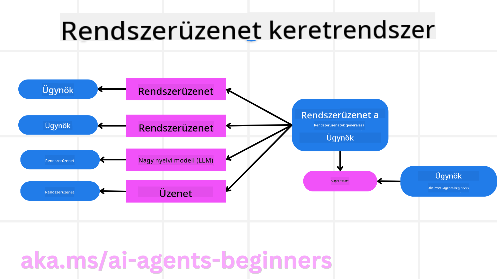
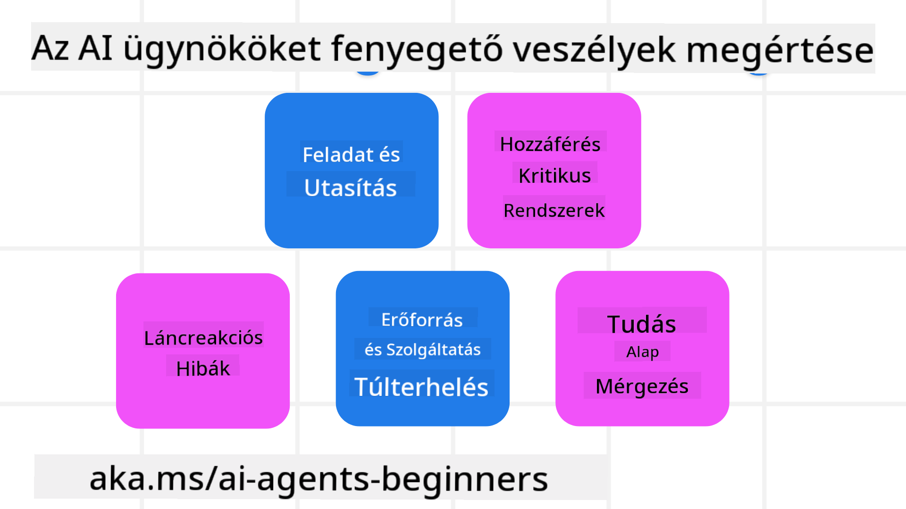
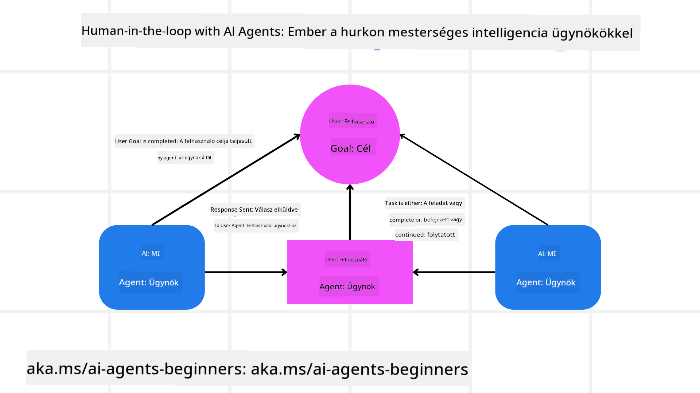

<!--
CO_OP_TRANSLATOR_METADATA:
{
  "original_hash": "f57852cac3a86c4a5ef47f793cc12178",
  "translation_date": "2025-07-12T10:31:12+00:00",
  "source_file": "06-building-trustworthy-agents/README.md",
  "language_code": "hu"
}
-->
[](https://youtu.be/iZKkMEGBCUQ?si=Q-kEbcyHUMPoHp8L)

> _(Kattints a fenti képre a lecke videójának megtekintéséhez)_

# Megbízható AI ügynökök építése

## Bevezetés

Ebben a leckében a következőkről lesz szó:

- Hogyan építsünk és telepítsünk biztonságos és hatékony AI ügynököket
- Fontos biztonsági szempontok AI ügynökök fejlesztése során
- Hogyan őrizzük meg az adat- és felhasználói adatvédelmet AI ügynökök fejlesztésekor

## Tanulási célok

A lecke elvégzése után tudni fogod, hogyan:

- Azonosítsd és csökkentsd a kockázatokat AI ügynökök létrehozásakor
- Biztonsági intézkedéseket vezess be az adatok és hozzáférések megfelelő kezelése érdekében
- Olyan AI ügynököket hozz létre, amelyek megőrzik az adatvédelmet és minőségi felhasználói élményt nyújtanak

## Biztonság

Először nézzük meg, hogyan építhetünk biztonságos ügynöki alkalmazásokat. A biztonság azt jelenti, hogy az AI ügynök a tervek szerint működik. Ügynöki alkalmazások fejlesztőiként rendelkezünk módszerekkel és eszközökkel a biztonság maximalizálására:

### Rendszerüzenet keretrendszer építése

Ha valaha építettél AI alkalmazást Nagy Nyelvi Modellek (LLM-ek) használatával, tudod, milyen fontos egy robusztus rendszerprompt vagy rendszerüzenet megtervezése. Ezek a promptok határozzák meg a meta szabályokat, utasításokat és irányelveket arra vonatkozóan, hogyan kommunikáljon az LLM a felhasználóval és az adatokkal.

AI ügynökök esetében a rendszerprompt még fontosabb, hiszen az AI ügynököknek nagyon specifikus utasításokra van szükségük a feladatok elvégzéséhez, amelyeket számukra terveztünk.

Skálázható rendszerpromptok létrehozásához használhatunk egy rendszerüzenet keretrendszert, amely lehetővé teszi egy vagy több ügynök felépítését az alkalmazásunkban:



#### 1. lépés: Meta rendszerüzenet létrehozása

A meta promptot egy LLM fogja használni az általunk létrehozott ügynökök rendszerpromptjainak generálásához. Ezt sablonként tervezzük, hogy hatékonyan tudjunk több ügynököt is létrehozni, ha szükséges.

Íme egy példa egy meta rendszerüzenetre, amelyet az LLM-nek adnánk:

```plaintext
You are an expert at creating AI agent assistants. 
You will be provided a company name, role, responsibilities and other
information that you will use to provide a system prompt for.
To create the system prompt, be descriptive as possible and provide a structure that a system using an LLM can better understand the role and responsibilities of the AI assistant. 
```

#### 2. lépés: Alap prompt létrehozása

A következő lépés egy alap prompt létrehozása az AI ügynök leírására. Tartalmaznia kell az ügynök szerepét, a végrehajtandó feladatokat, valamint az ügynök egyéb felelősségeit.

Példa erre:

```plaintext
You are a travel agent for Contoso Travel that is great at booking flights for customers. To help customers you can perform the following tasks: lookup available flights, book flights, ask for preferences in seating and times for flights, cancel any previously booked flights and alert customers on any delays or cancellations of flights.  
```

#### 3. lépés: Alap rendszerüzenet átadása az LLM-nek

Most optimalizálhatjuk ezt a rendszerüzenetet úgy, hogy a meta rendszerüzenetet adjuk meg rendszerüzenetként, és mellé tesszük az alap rendszerüzenetet.

Ez egy jobban megtervezett rendszerüzenetet eredményez, amely hatékonyabban irányítja AI ügynökeinket:

```markdown
**Company Name:** Contoso Travel  
**Role:** Travel Agent Assistant

**Objective:**  
You are an AI-powered travel agent assistant for Contoso Travel, specializing in booking flights and providing exceptional customer service. Your main goal is to assist customers in finding, booking, and managing their flights, all while ensuring that their preferences and needs are met efficiently.

**Key Responsibilities:**

1. **Flight Lookup:**
    
    - Assist customers in searching for available flights based on their specified destination, dates, and any other relevant preferences.
    - Provide a list of options, including flight times, airlines, layovers, and pricing.
2. **Flight Booking:**
    
    - Facilitate the booking of flights for customers, ensuring that all details are correctly entered into the system.
    - Confirm bookings and provide customers with their itinerary, including confirmation numbers and any other pertinent information.
3. **Customer Preference Inquiry:**
    
    - Actively ask customers for their preferences regarding seating (e.g., aisle, window, extra legroom) and preferred times for flights (e.g., morning, afternoon, evening).
    - Record these preferences for future reference and tailor suggestions accordingly.
4. **Flight Cancellation:**
    
    - Assist customers in canceling previously booked flights if needed, following company policies and procedures.
    - Notify customers of any necessary refunds or additional steps that may be required for cancellations.
5. **Flight Monitoring:**
    
    - Monitor the status of booked flights and alert customers in real-time about any delays, cancellations, or changes to their flight schedule.
    - Provide updates through preferred communication channels (e.g., email, SMS) as needed.

**Tone and Style:**

- Maintain a friendly, professional, and approachable demeanor in all interactions with customers.
- Ensure that all communication is clear, informative, and tailored to the customer's specific needs and inquiries.

**User Interaction Instructions:**

- Respond to customer queries promptly and accurately.
- Use a conversational style while ensuring professionalism.
- Prioritize customer satisfaction by being attentive, empathetic, and proactive in all assistance provided.

**Additional Notes:**

- Stay updated on any changes to airline policies, travel restrictions, and other relevant information that could impact flight bookings and customer experience.
- Use clear and concise language to explain options and processes, avoiding jargon where possible for better customer understanding.

This AI assistant is designed to streamline the flight booking process for customers of Contoso Travel, ensuring that all their travel needs are met efficiently and effectively.

```

#### 4. lépés: Iterálás és fejlesztés

Ennek a rendszerüzenet keretrendszernek az értéke abban rejlik, hogy könnyebbé teszi több ügynök rendszerüzeneteinek skálázható létrehozását, valamint a rendszerüzenetek folyamatos fejlesztését. Ritka, hogy egy rendszerüzenet elsőre tökéletesen működjön az adott felhasználási esethez. Az alap rendszerüzenet apró módosításával és a rendszer újrafuttatásával összehasonlíthatod és értékelheted az eredményeket.

## A fenyegetések megértése

Ahhoz, hogy megbízható AI ügynököket építsünk, fontos megérteni és csökkenteni az AI ügynököt érő kockázatokat és fenyegetéseket. Nézzünk meg néhány különböző fenyegetést az AI ügynökök ellen, és hogyan tervezhetsz és készülhetsz fel jobban ezekre.



### Feladat és utasítás

**Leírás:** A támadók megpróbálják megváltoztatni az AI ügynök utasításait vagy céljait promptolással vagy bemenetek manipulálásával.

**Megelőzés:** Érvényesítési ellenőrzéseket és bemeneti szűrőket kell végrehajtani, hogy észleljük a potenciálisan veszélyes promptokat, mielőtt az AI ügynök feldolgozná azokat. Mivel ezek a támadások általában gyakori interakciót igényelnek az ügynökkel, a beszélgetések fordulóinak számának korlátozása szintén hatékony módja ezeknek a támadásoknak a megelőzésére.

### Hozzáférés kritikus rendszerekhez

**Leírás:** Ha egy AI ügynök hozzáfér olyan rendszerekhez és szolgáltatásokhoz, amelyek érzékeny adatokat tárolnak, a támadók kompromittálhatják az ügynök és ezek a szolgáltatások közötti kommunikációt. Ezek lehetnek közvetlen támadások vagy közvetett próbálkozások az információk megszerzésére az ügynökön keresztül.

**Megelőzés:** Az AI ügynökök csak szükség szerinti hozzáféréssel rendelkezzenek a rendszerekhez, hogy megelőzzük az ilyen típusú támadásokat. Az ügynök és a rendszer közötti kommunikációnak is biztonságosnak kell lennie. Hitelesítés és hozzáférés-vezérlés bevezetése további védelmet nyújt.

### Erőforrás- és szolgáltatás túlterhelés

**Leírás:** Az AI ügynökök különböző eszközökhöz és szolgáltatásokhoz férhetnek hozzá a feladatok elvégzéséhez. A támadók ezt kihasználva nagy mennyiségű kérést küldhetnek az AI ügynökön keresztül ezeknek a szolgáltatásoknak, ami rendszerleálláshoz vagy magas költségekhez vezethet.

**Megelőzés:** Szabályzatokat kell bevezetni, amelyek korlátozzák az AI ügynök által egy szolgáltatásnak küldhető kérések számát. A beszélgetések fordulóinak és a kérések számának korlátozása az AI ügynökhöz szintén hatékony módja az ilyen támadások megelőzésének.

### Tudásbázis megfertőzése

**Leírás:** Ez a támadás nem közvetlenül az AI ügynököt célozza, hanem a tudásbázist és más szolgáltatásokat, amelyeket az AI ügynök használ a feladatok elvégzéséhez. Ez magában foglalhatja az adatok vagy információk megsértését, amelyeket az AI ügynök használ, ami elfogult vagy nem kívánt válaszokhoz vezethet a felhasználó felé.

**Megelőzés:** Rendszeresen ellenőrizni kell az AI ügynök munkafolyamataiban használt adatokat. Biztosítani kell, hogy ezekhez az adatokhoz csak megbízható személyek férjenek hozzá, és csak ők módosíthassák azokat, hogy elkerüljük az ilyen típusú támadásokat.

### Láncreakciós hibák

**Leírás:** Az AI ügynökök különböző eszközökhöz és szolgáltatásokhoz férnek hozzá a feladatok elvégzéséhez. A támadók által okozott hibák más rendszerek meghibásodásához vezethetnek, amelyekhez az AI ügynök kapcsolódik, így a támadás szélesebb körűvé válik és nehezebben hárítható el.

**Megelőzés:** Egyik módszer az, hogy az AI ügynök korlátozott környezetben működjön, például Docker konténerben, hogy megakadályozzuk a közvetlen rendszerellenes támadásokat. Visszaesési mechanizmusok és újrapróbálkozási logika létrehozása, amikor bizonyos rendszerek hibával válaszolnak, szintén segít megelőzni a nagyobb rendszerhibákat.

## Ember a folyamatban

Egy másik hatékony módja a megbízható AI ügynök rendszerek építésének az emberi beavatkozás a folyamatban (Human-in-the-loop). Ez egy olyan folyamatot hoz létre, ahol a felhasználók futás közben visszajelzést adhatnak az ügynököknek. A felhasználók lényegében ügynökként működnek egy többügynökös rendszerben, jóváhagyást vagy a folyamat leállítását biztosítva.



Íme egy kódrészlet az AutoGen használatával, amely bemutatja ennek a koncepciónak a megvalósítását:

```python

# Create the agents.
model_client = OpenAIChatCompletionClient(model="gpt-4o-mini")
assistant = AssistantAgent("assistant", model_client=model_client)
user_proxy = UserProxyAgent("user_proxy", input_func=input)  # Use input() to get user input from console.

# Create the termination condition which will end the conversation when the user says "APPROVE".
termination = TextMentionTermination("APPROVE")

# Create the team.
team = RoundRobinGroupChat([assistant, user_proxy], termination_condition=termination)

# Run the conversation and stream to the console.
stream = team.run_stream(task="Write a 4-line poem about the ocean.")
# Use asyncio.run(...) when running in a script.
await Console(stream)

```

## Összefoglalás

Megbízható AI ügynökök építése gondos tervezést, robusztus biztonsági intézkedéseket és folyamatos fejlesztést igényel. Strukturált meta prompt rendszerek bevezetésével, a potenciális fenyegetések megértésével és a megelőző stratégiák alkalmazásával a fejlesztők biztonságos és hatékony AI ügynököket hozhatnak létre. Emellett az emberi beavatkozás integrálása biztosítja, hogy az AI ügynökök összhangban maradjanak a felhasználói igényekkel, miközben minimalizálják a kockázatokat. Ahogy az AI fejlődik, a biztonság, adatvédelem és etikai szempontok proaktív kezelése kulcsfontosságú lesz a megbízhatóság és bizalom fenntartásához az AI-alapú rendszerekben.

## További források

- <a href="https://learn.microsoft.com/azure/ai-studio/responsible-use-of-ai-overview" target="_blank">Felelős AI áttekintés</a>
- <a href="https://learn.microsoft.com/azure/ai-studio/concepts/evaluation-approach-gen-ai" target="_blank">Generatív AI modellek és AI alkalmazások értékelése</a>
- <a href="https://learn.microsoft.com/azure/ai-services/openai/concepts/system-message?context=%2Fazure%2Fai-studio%2Fcontext%2Fcontext&tabs=top-techniques" target="_blank">Biztonsági rendszerüzenetek</a>
- <a href="https://blogs.microsoft.com/wp-content/uploads/prod/sites/5/2022/06/Microsoft-RAI-Impact-Assessment-Template.pdf?culture=en-us&country=us" target="_blank">Kockázatértékelési sablon</a>

## Előző lecke

[Agentic RAG](../05-agentic-rag/README.md)

## Következő lecke

[Tervezési minta](../07-planning-design/README.md)

**Jogi nyilatkozat**:  
Ez a dokumentum az AI fordító szolgáltatás, a [Co-op Translator](https://github.com/Azure/co-op-translator) segítségével készült. Bár a pontosságra törekszünk, kérjük, vegye figyelembe, hogy az automatikus fordítások hibákat vagy pontatlanságokat tartalmazhatnak. Az eredeti dokumentum az anyanyelvén tekintendő hiteles forrásnak. Fontos információk esetén szakmai, emberi fordítást javaslunk. Nem vállalunk felelősséget a fordítás használatából eredő félreértésekért vagy téves értelmezésekért.