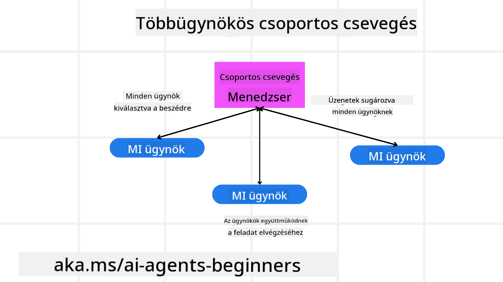
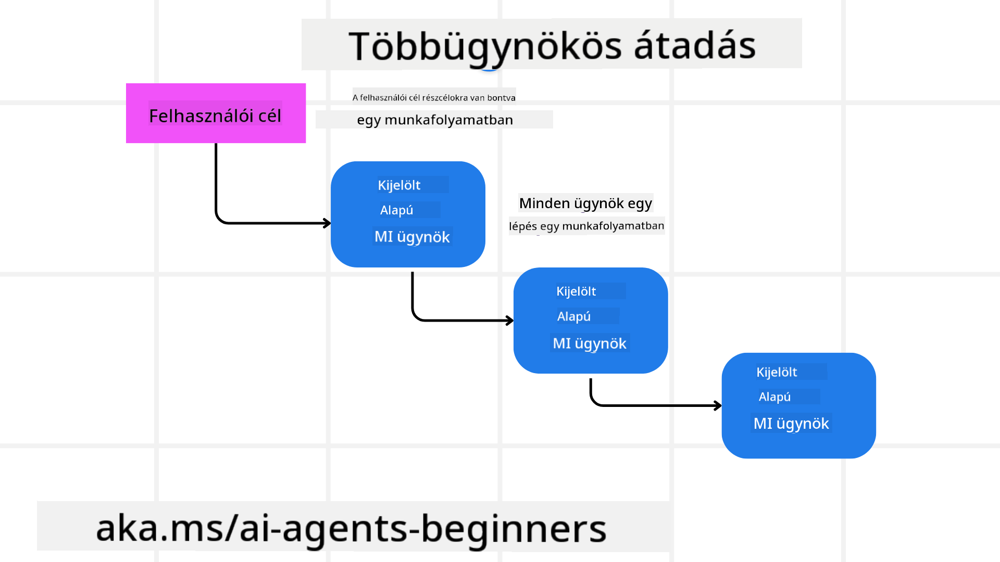
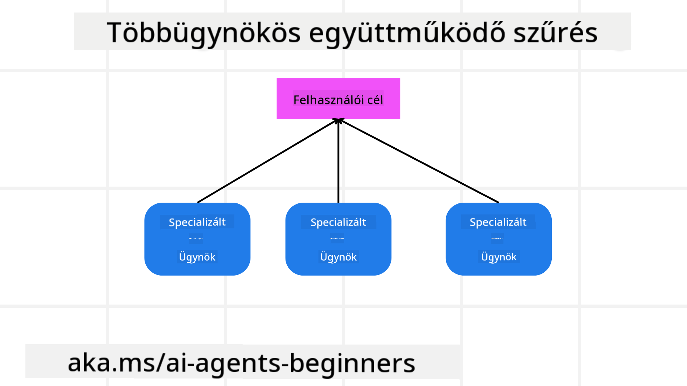

<!--
CO_OP_TRANSLATOR_METADATA:
{
  "original_hash": "c692a8975d7d5b99575a553de1c5e8a7",
  "translation_date": "2025-07-12T11:23:12+00:00",
  "source_file": "08-multi-agent/README.md",
  "language_code": "hu"
}
-->

> _(Kattints a fenti képre a lecke videójának megtekintéséhez)_

# Többügynökös tervezési minták

Amint elkezdesz dolgozni egy olyan projekten, amely több ügynököt is érint, fontolóra kell venned a többügynökös tervezési mintát. Azonban nem mindig egyértelmű, mikor érdemes áttérni több ügynökre, és mik az előnyei.

## Bevezetés

Ebben a leckében a következő kérdésekre keressük a választ:

- Milyen helyzetekben alkalmazhatók a többügynökös megoldások?
- Milyen előnyei vannak a több ügynök használatának egyetlen, több feladatot ellátó ügynökhöz képest?
- Mik a többügynökös tervezési minta megvalósításának építőelemei?
- Hogyan láthatjuk, hogy a több ügynök hogyan lép kölcsönhatásba egymással?

## Tanulási célok

A lecke elvégzése után képes leszel:

- Azonosítani azokat a helyzeteket, ahol többügynökös megoldás alkalmazható
- Felismerni a több ügynök használatának előnyeit az egyetlen ügynökhöz képest
- Megérteni a többügynökös tervezési minta megvalósításának építőelemeit

Mi a nagyobb kép?

*A többügynökös megoldás egy olyan tervezési minta, amely lehetővé teszi, hogy több ügynök együtt dolgozzon egy közös cél eléréséért.*

Ezt a mintát széles körben használják különböző területeken, például robotikában, autonóm rendszerekben és elosztott számítástechnikában.

## Helyzetek, ahol a többügynökös megoldás alkalmazható

Milyen helyzetekben érdemes több ügynököt alkalmazni? A válasz az, hogy számos olyan eset van, amikor több ügynök bevonása előnyös, különösen az alábbi esetekben:

- **Nagy munkaterhelés**: A nagy munkaterhelés kisebb feladatokra bontható, amelyeket különböző ügynököknek lehet kiosztani, így párhuzamos feldolgozás és gyorsabb befejezés érhető el. Erre példa egy nagy adatfeldolgozási feladat.
- **Összetett feladatok**: Az összetett feladatok, hasonlóan a nagy munkaterheléshez, kisebb részfeladatokra bonthatók, amelyeket különböző ügynökök végeznek, mindegyik egy adott területre specializálódva. Jó példa erre az autonóm járművek esete, ahol külön ügynökök kezelik a navigációt, akadályfelismerést és a kommunikációt más járművekkel.
- **Sokszínű szakértelem**: Különböző ügynökök eltérő szakértelemmel rendelkezhetnek, így hatékonyabban kezelhetnek különböző feladatokat, mint egyetlen ügynök. Erre jó példa az egészségügy, ahol az ügynökök diagnosztikát, kezelési terveket és betegmegfigyelést végezhetnek.

## A többügynökös megoldás előnyei az egyetlen ügynökhöz képest

Egyetlen ügynök jól működhet egyszerű feladatok esetén, de összetettebb feladatoknál a több ügynök használata számos előnyt kínál:

- **Specializáció**: Minden ügynök egy adott feladatra specializálódhat. Egyetlen ügynök esetén, aki mindent csinál, előfordulhat, hogy összezavarodik egy összetett feladat során, és nem a legmegfelelőbb feladatot végzi el.
- **Skálázhatóság**: Könnyebb a rendszert bővíteni több ügynök hozzáadásával, mint egyetlen ügynök túlterhelésével.
- **Hibatűrés**: Ha egy ügynök meghibásodik, a többi tovább működhet, így a rendszer megbízhatósága biztosított.

Vegyünk egy példát: foglaljunk utazást egy felhasználónak. Egyetlen ügynöknek kellene kezelnie az utazás összes aspektusát, a repülőjáratok keresésétől a szállodák és bérautók foglalásáig. Ehhez az ügynöknek eszközökkel kellene rendelkeznie minden feladat kezelésére, ami egy bonyolult, nehezen karbantartható és skálázható rendszert eredményezne. Ezzel szemben egy többügynökös rendszerben külön ügynökök specializálódhatnak a repülőjáratok keresésére, a szállodafoglalásra és a bérautók kezelésére. Ez modulárisabbá, könnyebben karbantarthatóvá és skálázhatóvá teszi a rendszert.

Hasonlítsuk össze ezt egy kis utazási irodával, amelyet egy családi vállalkozás működtet, és egy franchise irodával. A családi vállalkozásban egyetlen ügynök kezeli az utazás minden aspektusát, míg a franchise-ban különböző ügynökök foglalkoznak az egyes részekkel.

## A többügynökös tervezési minta megvalósításának építőelemei

Mielőtt megvalósítanád a többügynökös tervezési mintát, meg kell értened a minta építőelemeit.

Tegyük ezt konkrétabbá az utazásfoglalás példáján keresztül. Ebben az esetben az építőelemek a következők:

- **Ügynökök közötti kommunikáció**: A repülőjáratokat kereső, szállodákat és bérautókat foglaló ügynököknek kommunikálniuk kell egymással, megosztva a felhasználó preferenciáit és korlátait. El kell döntened a kommunikáció protokollját és módját. Konkrétan ez azt jelenti, hogy a repülőjáratokat kereső ügynöknek kommunikálnia kell a szállodafoglaló ügynökkel, hogy a szálloda a repülőjárat dátumaival egyezzen. Ez azt jelenti, hogy az ügynököknek meg kell osztaniuk az utazás dátumait, vagyis el kell döntened, *mely ügynökök osztanak meg információt és hogyan*.
- **Koordinációs mechanizmusok**: Az ügynököknek össze kell hangolniuk tevékenységüket, hogy a felhasználó preferenciái és korlátai teljesüljenek. Például a felhasználó szeretne egy repülőtérhez közeli szállodát, miközben a bérautók csak a repülőtéren érhetők el. Ez azt jelenti, hogy a szállodafoglaló ügynöknek koordinálnia kell a bérautó foglaló ügynökkel, hogy a felhasználó igényei teljesüljenek. Ez azt jelenti, hogy el kell döntened, *hogyan koordinálják az ügynökök a tevékenységüket*.
- **Ügynök architektúra**: Az ügynököknek belső struktúrával kell rendelkezniük a döntéshozatalhoz és a felhasználóval való interakciókból való tanuláshoz. Ez azt jelenti, hogy a repülőjáratokat kereső ügynöknek képesnek kell lennie dönteni arról, mely járatokat ajánlja a felhasználónak. Ez azt jelenti, hogy el kell döntened, *hogyan hoznak döntéseket az ügynökök és hogyan tanulnak a felhasználóval való interakciókból*. Például a repülőjáratokat kereső ügynök gépi tanulási modellt használhat, hogy a felhasználó korábbi preferenciái alapján ajánljon járatokat.
- **Átláthatóság a többügynökös interakciókban**: Látni kell, hogyan lépnek kölcsönhatásba az ügynökök egymással. Ehhez eszközökre és technikákra van szükség az ügynökök tevékenységeinek és interakcióinak nyomon követésére. Ez lehet naplózó és monitorozó eszközök, vizualizációs eszközök és teljesítménymutatók formájában.
- **Többügynökös minták**: Különböző minták léteznek a többügynökös rendszerek megvalósítására, például központosított, decentralizált és hibrid architektúrák. El kell döntened, melyik minta illik legjobban az esetedhez.
- **Ember a folyamatban**: A legtöbb esetben ember is részt vesz a folyamatban, és meg kell határoznod, mikor kérjenek az ügynökök emberi beavatkozást. Ez lehet például, amikor a felhasználó egy olyan szállodát vagy járatot kér, amit az ügynökök nem ajánlottak, vagy amikor megerősítést kérnek a foglalás előtt.

## Átláthatóság a többügynökös interakciókban

Fontos, hogy átlátható legyen, hogyan lépnek kölcsönhatásba az ügynökök egymással. Ez az átláthatóság elengedhetetlen a hibakereséshez, optimalizáláshoz és a rendszer hatékonyságának biztosításához. Ehhez eszközökre és technikákra van szükség az ügynökök tevékenységeinek és interakcióinak nyomon követésére. Ez lehet naplózó és monitorozó eszközök, vizualizációs eszközök és teljesítménymutatók formájában.

Például az utazásfoglalás esetén lehet egy irányítópult, amely mutatja az egyes ügynökök állapotát, a felhasználó preferenciáit és korlátait, valamint az ügynökök közötti interakciókat. Ez az irányítópult megjelenítheti a felhasználó utazási dátumait, a repülőjáratokat ajánló ügynök ajánlásait, a szállodákat ajánló ügynök javaslatait és a bérautókat ajánló ügynök ajánlásait. Ez tiszta képet ad arról, hogyan lépnek kölcsönhatásba az ügynökök, és teljesülnek-e a felhasználó igényei.

Nézzük meg ezeket az aspektusokat részletesebben.

- **Naplózó és monitorozó eszközök**: Minden ügynök által végrehajtott műveletet naplózni kell. Egy naplóbejegyzés tartalmazhat információt az ügynökről, aki a műveletet végrehajtotta, a művelet típusáról, az időpontjáról és az eredményéről. Ezek az adatok segíthetnek a hibakeresésben, optimalizálásban és egyéb elemzésekben.
- **Vizualizációs eszközök**: Ezek segítenek az ügynökök közötti interakciók intuitív megjelenítésében. Például lehet egy gráf, amely az információáramlást mutatja az ügynökök között. Ez segíthet azonosítani a szűk keresztmetszeteket, hatékonysági problémákat és egyéb hibákat.
- **Teljesítménymutatók**: Ezekkel nyomon követhető a többügynökös rendszer hatékonysága. Például mérhető a feladatok elvégzéséhez szükséges idő, az időegység alatt elvégzett feladatok száma, vagy az ügynökök által adott ajánlások pontossága. Ezek az adatok segítenek a fejlesztési területek azonosításában és a rendszer optimalizálásában.

## Többügynökös minták

Nézzünk néhány konkrét mintát, amelyeket többügynökös alkalmazások létrehozásához használhatunk. Íme néhány érdekes minta, amelyeket érdemes megfontolni:

### Csoportos csevegés

Ez a minta akkor hasznos, ha olyan csevegőalkalmazást szeretnél létrehozni, ahol több ügynök kommunikálhat egymással. Tipikus felhasználási területek a csapatmunka, ügyfélszolgálat és közösségi hálózatok.

Ebben a mintában minden ügynök egy felhasználót képvisel a csoportos csevegésben, és az üzeneteket egy üzenetküldési protokoll segítségével cserélik. Az ügynökök üzeneteket küldhetnek a csoportnak, fogadhatnak üzeneteket, és válaszolhatnak más ügynökök üzeneteire.

Ez a minta megvalósítható központosított architektúrával, ahol az összes üzenet egy központi szerveren keresztül halad, vagy decentralizált architektúrával, ahol az üzenetek közvetlenül cserélődnek.

### Feladatátadás

Ez a minta akkor hasznos, ha olyan alkalmazást szeretnél létrehozni, ahol az ügynökök feladatokat adhatnak át egymásnak.

Tipikus felhasználási területek az ügyfélszolgálat, feladatkezelés és munkafolyamat-automatizálás.

Ebben a mintában minden ügynök egy feladatot vagy munkafolyamat-lépést képvisel, és az ügynökök előre meghatározott szabályok alapján adhatnak át feladatokat egymásnak.

### Együttműködő szűrés

Ez a minta akkor hasznos, ha olyan alkalmazást szeretnél létrehozni, ahol több ügynök együttműködve ajánlásokat készít a felhasználóknak.

Azért érdemes több ügynököt bevonni, mert mindegyik más-más szakértelemmel rendelkezik, és különböző módon járulhat hozzá az ajánlási folyamathoz.

Vegyünk egy példát, amikor egy felhasználó a legjobb részvényt szeretné megtudni a tőzsdén.

- **Iparági szakértő**: Az egyik ügynök egy adott iparág szakértője lehet.
- **Technikai elemző**: Egy másik ügynök a technikai elemzésben jártas.
- **Fundamentális elemző**: Egy harmadik ügynök a fundamentális elemzés szakértője. Az együttműködés révén ezek az ügynökök átfogóbb ajánlást tudnak adni a felhasználónak.

## Példa: Visszatérítési folyamat

Vegyünk egy olyan helyzetet, amikor egy vásárló visszatérítést szeretne kérni egy termékre. Ebben a folyamatban több ügynök is részt vehet, de osszuk fel őket a visszatérítési folyamathoz kapcsolódó specifikus ügynökökre és az általános, más folyamatokban is használható ügynökökre.

**A visszatérítési folyamathoz kapcsolódó specifikus ügynökök**:

Az alábbi ügynökök vehetnek részt a visszatérítési folyamatban:

- **Vevő ügynök**: Ez az ügynök képviseli a vásárlót, és ő indítja el a visszatérítési folyamatot.
- **Eladó ügynök**: Ez az ügynök képviseli az eladót, és ő kezeli a visszatérítést.
- **Fizetési ügynök**: Ez az ügynök kezeli a fizetési folyamatot, és felelős a vásárló pénzének visszatérítéséért.
- **Megoldási ügynök**: Ez az ügynök kezeli a visszatérítési folyamat során felmerülő problémák megoldását.
- **Megfelelőségi ügynök**: Ez az ügynök biztosítja, hogy a visszatérítési folyamat megfeleljen a szabályozásoknak és előírásoknak
## Előző lecke

[Tervezés tervezése](../07-planning-design/README.md)

## Következő lecke

[Metakogníció az AI ügynökökben](../09-metacognition/README.md)

**Jogi nyilatkozat**:  
Ez a dokumentum az AI fordító szolgáltatás, a [Co-op Translator](https://github.com/Azure/co-op-translator) segítségével készült. Bár a pontosságra törekszünk, kérjük, vegye figyelembe, hogy az automatikus fordítások hibákat vagy pontatlanságokat tartalmazhatnak. Az eredeti dokumentum az anyanyelvén tekintendő hiteles forrásnak. Kritikus információk esetén professzionális emberi fordítást javaslunk. Nem vállalunk felelősséget a fordítás használatából eredő félreértésekért vagy téves értelmezésekért.