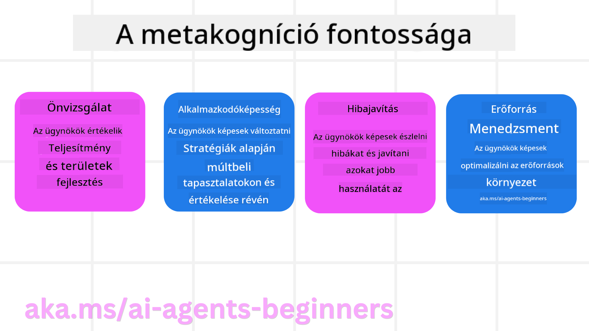
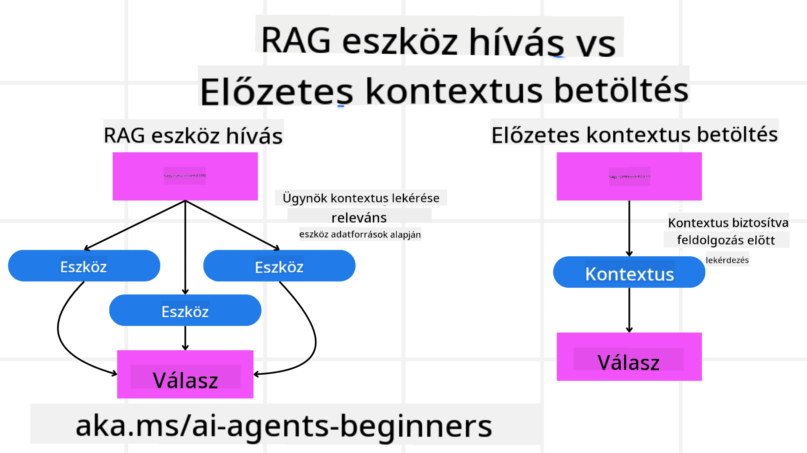

<!--
CO_OP_TRANSLATOR_METADATA:
{
  "original_hash": "8cbf460468c802c7994aa62e0e0779c9",
  "translation_date": "2025-07-12T13:09:24+00:00",
  "source_file": "09-metacognition/README.md",
  "language_code": "hu"
}
-->
[](https://youtu.be/His9R6gw6Ec?si=3_RMb8VprNvdLRhX)

> _(Kattints a fenti képre a lecke videójának megtekintéséhez)_
# Metakogníció az AI ügynökökben

## Bevezetés

Üdvözöllek a metakognícióról szóló leckében az AI ügynökök kapcsán! Ez a fejezet kezdőknek szól, akik kíváncsiak arra, hogyan képesek az AI ügynökök a saját gondolkodási folyamataikról gondolkodni. A lecke végére megérted a kulcsfogalmakat, és gyakorlati példákkal leszel felvértezve, hogy alkalmazd a metakogníciót az AI ügynökök tervezésében.

## Tanulási célok

A lecke elvégzése után képes leszel:

1. Megérteni az érvelési ciklusok jelentőségét az ügynökdefiníciókban.
2. Tervezési és értékelési technikákat alkalmazni az önjavító ügynökök támogatására.
3. Saját ügynököket létrehozni, amelyek képesek kódot manipulálni a feladatok elvégzéséhez.

## Bevezetés a metakognícióba

A metakogníció a magasabb rendű kognitív folyamatokra utal, amelyek során az ember a saját gondolkodásáról gondolkodik. Az AI ügynökök esetében ez azt jelenti, hogy képesek értékelni és módosítani a cselekedeteiket önismeretük és korábbi tapasztalataik alapján. A metakogníció, vagyis a „gondolkodás a gondolkodásról” fontos fogalom az ügynöki AI rendszerek fejlesztésében. Ez magában foglalja, hogy az AI rendszerek tisztában vannak saját belső folyamataikkal, és képesek figyelni, szabályozni, valamint alkalmazkodni a viselkedésükhöz. Hasonlóan ahhoz, ahogy mi is „leolvassuk a helyzetet” vagy megvizsgálunk egy problémát. Ez az önismeret segítheti az AI rendszereket jobb döntések meghozatalában, hibák felismerésében és teljesítményük folyamatos javításában – ami visszavezet a Turing-tesztre és a vitára arról, hogy az AI át fogja-e venni az irányítást.

Az ügynöki AI rendszerek kontextusában a metakogníció több kihívás kezelésében is segíthet, például:
- Átláthatóság: Biztosítani, hogy az AI rendszerek képesek legyenek megmagyarázni érvelésüket és döntéseiket.
- Érvelés: Javítani az AI rendszerek képességét az információk szintetizálására és megalapozott döntések meghozatalára.
- Alkalmazkodás: Lehetővé tenni az AI rendszerek számára, hogy alkalmazkodjanak új környezetekhez és változó feltételekhez.
- Észlelés: Növelni az AI rendszerek pontosságát a környezetből származó adatok felismerésében és értelmezésében.

### Mi az a metakogníció?

A metakogníció, vagyis a „gondolkodás a gondolkodásról” egy magasabb rendű kognitív folyamat, amely magában foglalja az önismeretet és a saját kognitív folyamatok önszabályozását. Az AI területén a metakogníció lehetővé teszi az ügynökök számára, hogy értékeljék és módosítsák stratégiáikat és cselekedeteiket, ami jobb problémamegoldó és döntéshozó képességekhez vezet. A metakogníció megértésével olyan AI ügynököket tervezhetsz, amelyek nemcsak intelligensebbek, hanem alkalmazkodóbbak és hatékonyabbak is. Az igazi metakogníció során az AI kifejezetten az érveléséről érvel.

Példa: „Az olcsóbb járatokat részesítettem előnyben, mert… lehet, hogy kimaradok a közvetlen járatokból, szóval újra ellenőrzöm.”  
Nyomon követi, hogyan vagy miért választott egy adott útvonalat.  
- Megjegyzi, hogy hibázott, mert túlzottan támaszkodott a felhasználó előző preferenciáira, ezért nemcsak a végső ajánlást, hanem a döntéshozatali stratégiát is módosítja.  
- Mintázatokat diagnosztizál, például: „Ha a felhasználó azt mondja, hogy ’túl zsúfolt’, nemcsak bizonyos látványosságokat kell eltávolítanom, hanem azt is figyelembe kell vennem, hogy a ’legjobb látványosságok’ kiválasztási módszerem hibás, ha mindig népszerűség alapján rangsorolok.”

### A metakogníció fontossága az AI ügynökökben

A metakogníció kulcsfontosságú szerepet játszik az AI ügynökök tervezésében több okból:



- Önreflexió: Az ügynökök képesek értékelni saját teljesítményüket és azonosítani a fejlesztendő területeket.
- Alkalmazkodóképesség: Az ügynökök módosíthatják stratégiáikat a korábbi tapasztalatok és változó környezet alapján.
- Hibajavítás: Az ügynökök önállóan felismerhetik és javíthatják a hibákat, pontosabb eredményeket érve el.
- Erőforrás-gazdálkodás: Az ügynökök optimalizálhatják az erőforrások, például az idő és a számítási kapacitás felhasználását a tervezés és értékelés során.

## Az AI ügynök összetevői

Mielőtt belevágnánk a metakognitív folyamatokba, fontos megérteni az AI ügynök alapvető összetevőit. Egy AI ügynök általában a következőkből áll:

- Persona: Az ügynök személyisége és jellemzői, amelyek meghatározzák, hogyan lép kapcsolatba a felhasználókkal.
- Eszközök: Az ügynök által végrehajtható képességek és funkciók.
- Készségek: Az ügynök tudása és szakértelme.

Ezek az összetevők együtt alkotnak egy „szakértelem egységet”, amely képes specifikus feladatok elvégzésére.

**Példa**:  
Gondolj egy utazási ügynökre, egy olyan szolgáltatásra, amely nemcsak megtervezi a nyaralásodat, hanem valós idejű adatok és korábbi ügyfélélmények alapján módosítja az útvonalat.

### Példa: Metakogníció egy utazási ügynök szolgáltatásban

Képzeld el, hogy egy AI-alapú utazási ügynök szolgáltatást tervezel. Ez az ügynök, a „Travel Agent”, segíti a felhasználókat az utazásuk megtervezésében. A metakogníció beépítéséhez a Travel Agentnek értékelnie és módosítania kell cselekedeteit önismeret és korábbi tapasztalatok alapján. Íme, hogyan játszhat szerepet a metakogníció:

#### Jelenlegi feladat

Segíteni egy felhasználót egy párizsi utazás megtervezésében.

#### A feladat elvégzésének lépései

1. **Felhasználói preferenciák összegyűjtése**: Kérdezd meg a felhasználót az utazás időpontjáról, költségvetéséről, érdeklődési köréről (pl. múzeumok, gasztronómia, vásárlás) és egyéb speciális igényeiről.
2. **Információk lekérése**: Keresd meg a járatokat, szállásokat, látnivalókat és éttermeket, amelyek megfelelnek a felhasználó preferenciáinak.
3. **Ajánlások generálása**: Készíts személyre szabott útitervet a járatok, szállásfoglalások és javasolt programok részleteivel.
4. **Visszajelzés alapján módosítás**: Kérd ki a felhasználó véleményét az ajánlásokról, és szükség szerint módosítsd azokat.

#### Szükséges erőforrások

- Hozzáférés járat- és szállásfoglalási adatbázisokhoz.
- Információk párizsi látnivalókról és éttermekről.
- Felhasználói visszajelzések korábbi interakciókból.

#### Tapasztalat és önreflexió

A Travel Agent metakogníciót használ teljesítménye értékelésére és a múltbeli tapasztalatokból való tanulásra. Például:

1. **Felhasználói visszajelzések elemzése**: Áttekinti a visszajelzéseket, hogy mely ajánlások voltak sikeresek, és melyeket kell javítani. Ennek megfelelően módosítja a jövőbeli javaslatokat.
2. **Alkalmazkodóképesség**: Ha a felhasználó korábban jelezte, hogy nem szereti a zsúfolt helyeket, a Travel Agent a jövőben elkerüli a népszerű turistahelyeket a csúcsidőszakban.
3. **Hibajavítás**: Ha korábban hibázott egy foglalásban, például egy teltházas szállodát ajánlott, megtanulja alaposabban ellenőrizni az elérhetőséget a javaslatok előtt.

#### Gyakorlati fejlesztői példa

Íme egy egyszerűsített példa arra, hogyan nézhet ki a Travel Agent kódja metakogníció beépítésével:

```python
class Travel_Agent:
    def __init__(self):
        self.user_preferences = {}
        self.experience_data = []

    def gather_preferences(self, preferences):
        self.user_preferences = preferences

    def retrieve_information(self):
        # Search for flights, hotels, and attractions based on preferences
        flights = search_flights(self.user_preferences)
        hotels = search_hotels(self.user_preferences)
        attractions = search_attractions(self.user_preferences)
        return flights, hotels, attractions

    def generate_recommendations(self):
        flights, hotels, attractions = self.retrieve_information()
        itinerary = create_itinerary(flights, hotels, attractions)
        return itinerary

    def adjust_based_on_feedback(self, feedback):
        self.experience_data.append(feedback)
        # Analyze feedback and adjust future recommendations
        self.user_preferences = adjust_preferences(self.user_preferences, feedback)

# Example usage
travel_agent = Travel_Agent()
preferences = {
    "destination": "Paris",
    "dates": "2025-04-01 to 2025-04-10",
    "budget": "moderate",
    "interests": ["museums", "cuisine"]
}
travel_agent.gather_preferences(preferences)
itinerary = travel_agent.generate_recommendations()
print("Suggested Itinerary:", itinerary)
feedback = {"liked": ["Louvre Museum"], "disliked": ["Eiffel Tower (too crowded)"]}
travel_agent.adjust_based_on_feedback(feedback)
```

#### Miért fontos a metakogníció?

- **Önreflexió**: Az ügynökök képesek elemezni teljesítményüket és azonosítani a fejlesztendő területeket.
- **Alkalmazkodóképesség**: Az ügynökök módosíthatják stratégiáikat a visszajelzések és változó körülmények alapján.
- **Hibajavítás**: Az ügynökök önállóan felismerhetik és javíthatják a hibákat.
- **Erőforrás-gazdálkodás**: Az ügynökök optimalizálhatják az erőforrások, például az idő és számítási kapacitás felhasználását.

A metakogníció beépítésével a Travel Agent személyre szabottabb és pontosabb utazási ajánlásokat nyújthat, javítva a felhasználói élményt.

---

## 2. Tervezés az ügynökökben

A tervezés kritikus eleme az AI ügynökök viselkedésének. Ez magában foglalja a cél eléréséhez szükséges lépések megtervezését, figyelembe véve a jelenlegi állapotot, az erőforrásokat és az esetleges akadályokat.

### A tervezés elemei

- **Jelenlegi feladat**: Határozd meg világosan a feladatot.
- **A feladat elvégzésének lépései**: Bontsd le a feladatot kezelhető lépésekre.
- **Szükséges erőforrások**: Azonosítsd a szükséges erőforrásokat.
- **Tapasztalat**: Használd a korábbi tapasztalatokat a tervezéshez.

**Példa**:  
Íme a lépések, amelyeket a Travel Agentnek meg kell tennie, hogy hatékonyan segítse a felhasználót az utazás megtervezésében:

### Lépések a Travel Agent számára

1. **Felhasználói preferenciák összegyűjtése**  
   - Kérdezd meg a felhasználót az utazás időpontjáról, költségvetéséről, érdeklődési köréről és egyéb speciális igényeiről.  
   - Példák: „Mikor tervezel utazni?” „Mekkora a költségvetésed?” „Milyen tevékenységeket szeretsz a nyaralás alatt?”

2. **Információk lekérése**  
   - Keresd meg a felhasználó preferenciáinak megfelelő utazási lehetőségeket.  
   - **Járatok**: Keresd a felhasználó költségvetéséhez és utazási időpontjához illő járatokat.  
   - **Szállások**: Találd meg a felhasználó helyszín, ár és szolgáltatások szerinti preferenciáinak megfelelő szállodákat vagy bérleményeket.  
   - **Látnivalók és éttermek**: Azonosíts népszerű látnivalókat, programokat és éttermeket, amelyek megfelelnek a felhasználó érdeklődési körének.

3. **Ajánlások generálása**  
   - Állíts össze személyre szabott útitervet a begyűjtött információk alapján.  
   - Add meg a járatok, szállásfoglalások és javasolt programok részleteit, ügyelve arra, hogy az ajánlások igazodjanak a felhasználó preferenciáihoz.

4. **Útiterv bemutatása a felhasználónak**  
   - Oszd meg a javasolt útitervet a felhasználóval véleményezésre.  
   - Példa: „Íme egy javasolt útiterv a párizsi utazásodhoz. Tartalmazza a járatok részleteit, szállásfoglalásokat és ajánlott programokat. Mit gondolsz róla?”

5. **Visszajelzés gyűjtése**  
   - Kérd ki a felhasználó véleményét a javasolt útitervről.  
   - Példák: „Tetszenek a járatlehetőségek?” „Megfelel a szállás az igényeidnek?” „Szeretnél hozzáadni vagy eltávolítani valamilyen programot?”

6. **Módosítás a visszajelzés alapján**  
   - Módosítsd az útitervet a felhasználó visszajelzései szerint.  
   - Végez el szükséges változtatásokat a járatok, szállások és programok ajánlásában, hogy jobban megfeleljen a felhasználó igényeinek.

7. **Végleges megerősítés**  
   - Mutasd be a frissített útitervet a felhasználónak végleges jóváhagyásra.  
   - Példa: „Elvégeztem a módosításokat a visszajelzésed alapján. Íme a frissített útiterv. Minden rendben van így?”

8. **Foglalások véglegesítése**  
   - Amint a felhasználó jóváhagyja az útitervet, foglald le a járatokat, szállásokat és előre tervezett programokat.  
   - Küldd el a visszaigazolásokat a felhasználónak.

9. **Folyamatos támogatás nyújtása**  
   - Maradj elérhető, hogy segítséget nyújts a felhasználónak az utazás előtt és alatt felmerülő változtatások vagy további kérések esetén.  
   - Példa: „Ha bármilyen további segítségre van szükséged az utazás alatt, bármikor fordulhatsz hozzám!”

### Példa interakció

```python
class Travel_Agent:
    def __init__(self):
        self.user_preferences = {}
        self.experience_data = []

    def gather_preferences(self, preferences):
        self.user_preferences = preferences

    def retrieve_information(self):
        flights = search_flights(self.user_preferences)
        hotels = search_hotels(self.user_preferences)
        attractions = search_attractions(self.user_preferences)
        return flights, hotels, attractions

    def generate_recommendations(self):
        flights, hotels, attractions = self.retrieve_information()
        itinerary = create_itinerary(flights, hotels, attractions)
        return itinerary

    def adjust_based_on_feedback(self, feedback):
        self.experience_data.append(feedback)
        self.user_preferences = adjust_preferences(self.user_preferences, feedback)

# Example usage within a booing request
travel_agent = Travel_Agent()
preferences = {
    "destination": "Paris",
    "dates": "2025-04-01 to 2025-04-10",
    "budget": "moderate",
    "interests": ["museums", "cuisine"]
}
travel_agent.gather_preferences(preferences)
itinerary = travel_agent.generate_recommendations()
print("Suggested Itinerary:", itinerary)
feedback = {"liked": ["Louvre Museum"], "disliked": ["Eiffel Tower (too crowded)"]}
travel_agent.adjust_based_on_feedback(feedback)
```

## 3. Hibajavító RAG rendszer

Először is, nézzük meg a különbséget a RAG eszköz és az előzetes kontextusbetöltés között.



### Retrieval-Augmented Generation (RAG)

A RAG egy lekérdező rendszert kombinál egy generatív modellel. Amikor egy lekérdezés érkezik, a lekérdező rendszer releváns dokumentumokat vagy adatokat keres egy külső forrásból, és ezt az információt használja fel a generatív modell bemenetének kiegészítésére. Ez segíti a modellt abban, hogy pontosabb és kontextusban relevánsabb válaszokat generáljon.

Egy R
### Előzetes Kontextus Betöltés

Az előzetes kontextus betöltés azt jelenti, hogy a modell számára a lekérdezés feldolgozása előtt betöltjük a releváns háttérinformációkat vagy kontextust. Ez azt eredményezi, hogy a modell már a folyamat elején hozzáfér ezekhez az adatokhoz, ami segíthet abban, hogy tájékozottabb válaszokat adjon anélkül, hogy a feldolgozás közben további adatokat kellene lekérnie.

Íme egy egyszerűsített példa arra, hogyan nézhet ki az előzetes kontextus betöltés egy utazási ügynök alkalmazás esetén Pythonban:

```python
class TravelAgent:
    def __init__(self):
        # Pre-load popular destinations and their information
        self.context = {
            "Paris": {"country": "France", "currency": "Euro", "language": "French", "attractions": ["Eiffel Tower", "Louvre Museum"]},
            "Tokyo": {"country": "Japan", "currency": "Yen", "language": "Japanese", "attractions": ["Tokyo Tower", "Shibuya Crossing"]},
            "New York": {"country": "USA", "currency": "Dollar", "language": "English", "attractions": ["Statue of Liberty", "Times Square"]},
            "Sydney": {"country": "Australia", "currency": "Dollar", "language": "English", "attractions": ["Sydney Opera House", "Bondi Beach"]}
        }

    def get_destination_info(self, destination):
        # Fetch destination information from pre-loaded context
        info = self.context.get(destination)
        if info:
            return f"{destination}:\nCountry: {info['country']}\nCurrency: {info['currency']}\nLanguage: {info['language']}\nAttractions: {', '.join(info['attractions'])}"
        else:
            return f"Sorry, we don't have information on {destination}."

# Example usage
travel_agent = TravelAgent()
print(travel_agent.get_destination_info("Paris"))
print(travel_agent.get_destination_info("Tokyo"))
```

#### Magyarázat

1. **Inicializálás (`__init__` metódus)**: A `TravelAgent` osztály előre betölt egy szótárt, amely népszerű úti célokról tartalmaz információkat, mint például Párizs, Tokió, New York és Sydney. Ez a szótár olyan részleteket tartalmaz, mint az ország, valuta, nyelv és főbb látnivalók.

2. **Információ lekérése (`get_destination_info` metódus)**: Amikor a felhasználó egy adott úti céllal kapcsolatban érdeklődik, a `get_destination_info` metódus a betöltött kontextus szótárból veszi elő a releváns adatokat.

Az előzetes kontextus betöltésével az utazási ügynök alkalmazás gyorsan tud válaszolni a felhasználói kérdésekre anélkül, hogy valós időben kellene külső forrásból adatokat lekérnie. Ez hatékonyabbá és gyorsabbá teszi az alkalmazást.

### Célkitűzéssel Indított Terv Készítése Iterálás Előtt

A terv célkitűzéssel való indítása azt jelenti, hogy egyértelmű célt vagy kívánt eredményt határozunk meg a folyamat elején. Ezzel a céllal a modell végig irányelvként dolgozhat az iteratív folyamat során. Ez segít abban, hogy minden iteráció közelebb vigyen a kívánt eredmény eléréséhez, így a folyamat hatékonyabbá és fókuszáltabbá válik.

Íme egy példa arra, hogyan lehet egy utazási tervet célkitűzéssel indítani, mielőtt iterálnánk egy utazási ügynök esetén Pythonban:

### Forgatókönyv

Egy utazási ügynök személyre szabott nyaralást szeretne tervezni egy ügyfél számára. A cél egy olyan utazási terv összeállítása, amely maximalizálja az ügyfél elégedettségét az ő preferenciái és költségvetése alapján.

### Lépések

1. Határozzuk meg az ügyfél preferenciáit és költségvetését.
2. Indítsuk el az első tervet ezek alapján.
3. Iteráljunk a terven, finomítva azt az ügyfél elégedettségének optimalizálása érdekében.

#### Python Kód

```python
class TravelAgent:
    def __init__(self, destinations):
        self.destinations = destinations

    def bootstrap_plan(self, preferences, budget):
        plan = []
        total_cost = 0

        for destination in self.destinations:
            if total_cost + destination['cost'] <= budget and self.match_preferences(destination, preferences):
                plan.append(destination)
                total_cost += destination['cost']

        return plan

    def match_preferences(self, destination, preferences):
        for key, value in preferences.items():
            if destination.get(key) != value:
                return False
        return True

    def iterate_plan(self, plan, preferences, budget):
        for i in range(len(plan)):
            for destination in self.destinations:
                if destination not in plan and self.match_preferences(destination, preferences) and self.calculate_cost(plan, destination) <= budget:
                    plan[i] = destination
                    break
        return plan

    def calculate_cost(self, plan, new_destination):
        return sum(destination['cost'] for destination in plan) + new_destination['cost']

# Example usage
destinations = [
    {"name": "Paris", "cost": 1000, "activity": "sightseeing"},
    {"name": "Tokyo", "cost": 1200, "activity": "shopping"},
    {"name": "New York", "cost": 900, "activity": "sightseeing"},
    {"name": "Sydney", "cost": 1100, "activity": "beach"},
]

preferences = {"activity": "sightseeing"}
budget = 2000

travel_agent = TravelAgent(destinations)
initial_plan = travel_agent.bootstrap_plan(preferences, budget)
print("Initial Plan:", initial_plan)

refined_plan = travel_agent.iterate_plan(initial_plan, preferences, budget)
print("Refined Plan:", refined_plan)
```

#### Kódmagyarázat

1. **Inicializálás (`__init__` metódus)**: A `TravelAgent` osztályt egy potenciális úti célokat tartalmazó listával inicializáljuk, ahol minden cél rendelkezik olyan tulajdonságokkal, mint név, költség és tevékenységtípus.

2. **Terv indítása (`bootstrap_plan` metódus)**: Ez a metódus létrehoz egy kezdeti utazási tervet az ügyfél preferenciái és költségvetése alapján. Végigmegy az úti célok listáján, és hozzáadja azokat a tervhez, amelyek megfelelnek az ügyfél preferenciáinak és beleférnek a költségvetésbe.

3. **Preferenciák egyeztetése (`match_preferences` metódus)**: Ez a metódus ellenőrzi, hogy egy úti cél megfelel-e az ügyfél preferenciáinak.

4. **Terv iterálása (`iterate_plan` metódus)**: Ez a metódus finomítja a kezdeti tervet azzal, hogy megpróbálja jobb egyezésű úti célokra cserélni a tervben szereplőket, figyelembe véve az ügyfél preferenciáit és költségvetési korlátait.

5. **Költség számítása (`calculate_cost` metódus)**: Ez a metódus kiszámolja a jelenlegi terv teljes költségét, beleértve egy esetleges új úti célt is.

#### Példa Használat

- **Kezdeti terv**: Az utazási ügynök egy kezdeti tervet készít az ügyfél városnézés iránti preferenciái és 2000 dolláros költségvetése alapján.
- **Finomított terv**: Az utazási ügynök iterál a terven, optimalizálva azt az ügyfél preferenciái és költségvetése szerint.

A terv célkitűzéssel való indításával (pl. az ügyfél elégedettségének maximalizálása) és iterálással az utazási ügynök személyre szabott és optimalizált utazási útitervet készíthet az ügyfél számára. Ez a megközelítés biztosítja, hogy az utazási terv már az elejétől az ügyfél igényeihez és költségvetéséhez igazodjon, és minden iterációval javuljon.

### LLM Használata Újrarangsorolásra és Pontozásra

A Nagy Nyelvi Modellek (LLM-ek) használhatók újrarangsorolásra és pontozásra azáltal, hogy értékelik a lekért dokumentumok vagy generált válaszok relevanciáját és minőségét. Így működik:

**Lekérés:** Az első lépésben a lekérdezés alapján egy jelölt dokumentum- vagy válaszkészlet kerül elő.

**Újrarangsorolás:** Az LLM értékeli ezeket a jelölteket, és relevancia és minőség alapján újrarangsorolja őket. Ez biztosítja, hogy a legrelevánsabb és legjobb minőségű információ jelenjen meg először.

**Pontozás:** Az LLM pontszámokat rendel minden jelölthöz, amelyek tükrözik azok relevanciáját és minőségét. Ez segít a legjobb válasz vagy dokumentum kiválasztásában a felhasználó számára.

Az LLM-ek újrarangsorolásra és pontozásra való használatával a rendszer pontosabb és kontextusban relevánsabb információkat tud nyújtani, javítva a felhasználói élményt.

Íme egy példa arra, hogyan használhat egy utazási ügynök Nagy Nyelvi Modellt (LLM-et) az úti célok újrarangsorolására és pontozására a felhasználói preferenciák alapján Pythonban:

#### Forgatókönyv – Utazás preferenciák alapján

Egy utazási ügynök a legjobb úti célokat szeretné ajánlani egy ügyfélnek az ő preferenciái alapján. Az LLM segít az úti célok újrarangsorolásában és pontozásában, hogy a legrelevánsabb lehetőségek kerüljenek előtérbe.

#### Lépések:

1. Gyűjtsük össze a felhasználó preferenciáit.
2. Lekérjünk egy listát potenciális úti célokról.
3. Használjuk az LLM-et az úti célok újrarangsorolására és pontozására a felhasználói preferenciák alapján.

Így frissítheted az előző példát az Azure OpenAI szolgáltatások használatára:

#### Követelmények

1. Rendelkezned kell Azure előfizetéssel.
2. Hozz létre egy Azure OpenAI erőforrást, és szerezd be az API kulcsodat.

#### Példa Python Kód

```python
import requests
import json

class TravelAgent:
    def __init__(self, destinations):
        self.destinations = destinations

    def get_recommendations(self, preferences, api_key, endpoint):
        # Generate a prompt for the Azure OpenAI
        prompt = self.generate_prompt(preferences)
        
        # Define headers and payload for the request
        headers = {
            'Content-Type': 'application/json',
            'Authorization': f'Bearer {api_key}'
        }
        payload = {
            "prompt": prompt,
            "max_tokens": 150,
            "temperature": 0.7
        }
        
        # Call the Azure OpenAI API to get the re-ranked and scored destinations
        response = requests.post(endpoint, headers=headers, json=payload)
        response_data = response.json()
        
        # Extract and return the recommendations
        recommendations = response_data['choices'][0]['text'].strip().split('\n')
        return recommendations

    def generate_prompt(self, preferences):
        prompt = "Here are the travel destinations ranked and scored based on the following user preferences:\n"
        for key, value in preferences.items():
            prompt += f"{key}: {value}\n"
        prompt += "\nDestinations:\n"
        for destination in self.destinations:
            prompt += f"- {destination['name']}: {destination['description']}\n"
        return prompt

# Example usage
destinations = [
    {"name": "Paris", "description": "City of lights, known for its art, fashion, and culture."},
    {"name": "Tokyo", "description": "Vibrant city, famous for its modernity and traditional temples."},
    {"name": "New York", "description": "The city that never sleeps, with iconic landmarks and diverse culture."},
    {"name": "Sydney", "description": "Beautiful harbour city, known for its opera house and stunning beaches."},
]

preferences = {"activity": "sightseeing", "culture": "diverse"}
api_key = 'your_azure_openai_api_key'
endpoint = 'https://your-endpoint.com/openai/deployments/your-deployment-name/completions?api-version=2022-12-01'

travel_agent = TravelAgent(destinations)
recommendations = travel_agent.get_recommendations(preferences, api_key, endpoint)
print("Recommended Destinations:")
for rec in recommendations:
    print(rec)
```

#### Kódmagyarázat – Preference Booker

1. **Inicializálás**: A `TravelAgent` osztályt egy potenciális úti célokat tartalmazó listával inicializáljuk, ahol minden cél rendelkezik olyan tulajdonságokkal, mint név és leírás.

2. **Ajánlások lekérése (`get_recommendations` metódus)**: Ez a metódus egy promptot generál az Azure OpenAI szolgáltatás számára a felhasználó preferenciái alapján, majd HTTP POST kérést küld az Azure OpenAI API-nak, hogy megkapja az újrarangsorolt és pontozott úti célokat.

3. **Prompt generálása (`generate_prompt` metódus)**: Ez a metódus összeállít egy promptot az Azure OpenAI számára, amely tartalmazza a felhasználó preferenciáit és az úti célok listáját. A prompt irányítja a modellt, hogy az adott preferenciák alapján újrarangsorolja és pontozza az úti célokat.

4. **API hívás**: A `requests` könyvtárat használjuk HTTP POST kérés küldésére az Azure OpenAI API végpontjára. A válasz tartalmazza az újrarangsorolt és pontozott úti célokat.

5. **Példa használat**: Az utazási ügynök összegyűjti a felhasználó preferenciáit (pl. városnézés és sokszínű kultúra iránti érdeklődés), és az Azure OpenAI szolgáltatást használja az úti célok újrarangsorolására és pontozására.

Ne felejtsd el kicserélni a `your_azure_openai_api_key` értéket a saját Azure OpenAI API kulcsodra, és a `https://your-endpoint.com/...` URL-t az Azure OpenAI telepítésed tényleges végpontjára.

Az LLM újrarangsorolásra és pontozásra való használatával az utazási ügynök személyre szabottabb és relevánsabb utazási ajánlatokat tud nyújtani az ügyfeleknek, javítva ezzel az általános élményt.

### RAG: Promptolási Technika vs Eszköz

A Retrieval-Augmented Generation (RAG) lehet egyszerre promptolási technika és eszköz az AI ügynökök fejlesztésében. A kettő közötti különbség megértése segíthet abban, hogy hatékonyabban használd a RAG-ot a projektjeidben.

#### RAG mint Promptolási Technika

**Mi ez?**

- Promptolási technikaként a RAG speciális lekérdezések vagy promptok megfogalmazását jelenti, amelyek irányítják a releváns információk lekérését egy nagy adatbázisból vagy korpuszból. Ezeket az információkat aztán válaszok vagy műveletek generálására használják.

**Hogyan működik:**

1. **Promptok megfogalmazása**: Készíts jól strukturált promptokat vagy lekérdezéseket a feladat vagy a felhasználói input alapján.
2. **Információ lekérése**: Használd a promptokat, hogy releváns adatokat keress egy meglévő tudásbázisból vagy adathalmazból.
3. **Válasz generálása**: Kombináld a lekért információkat generatív AI modellekkel, hogy átfogó és koherens választ hozz létre.

**Példa utazási ügynöknél**:

- Felhasználói kérés: „Múzeumokat szeretnék látogatni Párizsban.”
- Prompt: „Találd meg a legjobb múzeumokat Párizsban.”
- Lekért információ: Részletek a Louvre Múzeumról, Musée d'Orsay-ról stb.
- Generált válasz: „Íme néhány kiemelkedő múzeum Párizsban: Louvre Múzeum, Musée d'Orsay és Centre Pompidou.”

#### RAG mint Eszköz

**Mi ez?**

- Eszközként a RAG egy integrált rendszer, amely automatizálja a lekérés és generálás folyamatát, megkönnyítve a fejlesztők számára a komplex AI funkciók megvalósítását anélkül, hogy minden lekérdezéshez külön promptokat kellene kézzel készíteniük.

**Hogyan működik:**

1. **Integráció**: Beágyazod a RAG-ot az AI ügynök architektúrájába, amely automatikusan kezeli a lekérés és generálás feladatait.
2. **Automatizálás**: Az eszköz az egész folyamatot kezeli, a felhasználói input fogadásától a végső válasz generálásáig, anélkül, hogy minden lépéshez explicit promptokra lenne szükség.
3. **Hatékonyság**: Javítja az ügynök teljesítményét azáltal, hogy egyszerűsíti és automatizálja a lekérés és generálás folyamatát, gyorsabb és pontosabb válaszokat eredményezve.

**Példa utazási ügynöknél**:

- Felhasználói kérés: „Múzeumokat szeretnék látogatni Párizsban.”
- RAG eszköz: Automatikusan lekéri az információkat a múzeumokról és generál egy választ.
- Generált válasz: „Íme néhány kiemelkedő múzeum Párizsban: Louvre Múzeum, Musée d'Orsay és Centre Pompidou.”

### Összehasonlítás

| Szempont               | Promptolási Technika                                      | Eszköz                                                  |
|------------------------|----------------------------------------------------------|---------------------------------------------------------|
| **Kézi vs Automatikus**| Minden lekérdezéshez kézi promptok megfogalmazása.       | Automatikus folyamat a lekérésre és generálásra.        |
| **Irányítás**          | Több kontrollt ad a lekérdezési folyamat felett.         | Egyszerűsíti és automatizálja a lekérés és generálás folyamatát. |
| **Rugalmasság**        | Testreszabott promptok készítését teszi lehetővé.        | Hatékonyabb nagy léptékű megvalósításokhoz.             |
| **Bonyolultság**       | Promptok kidolgozását és finomhangolását igényli.         | Könnyebben integrálható AI ügynök architektúrába.       |

### Gyakorlati Példák

**Promptolási Technika Példa:**

```python
def search_museums_in_paris():
    prompt = "Find top museums in Paris"
    search_results = search_web(prompt)
    return search_results

museums = search_museums_in_paris()
print("Top Museums in Paris:", museums)
```

**Eszköz Példa:**

```python
class Travel_Agent:
    def __init__(self):
        self.rag_tool = RAGTool()

    def get_museums_in_paris(self):
        user_input = "I want to visit museums in Paris."
        response = self.rag_tool.retrieve_and_generate(user_input)
        return response

travel_agent = Travel_Agent()
museums = travel_agent.get_museums_in_paris()
print("Top Museums in Paris:", museums)
```

### Relevancia Értékelése

A relevancia értékelése kulcsfontosságú az AI ügynökök teljesítményében. Ez biztosítja, hogy az ügynök által lekért és generált információk megfelelőek, pontosak és hasznosak legyenek a felhasználó számára. Nézzük meg, hogyan lehet értékelni a relevanciát AI ügynökök esetén, gyakorlati példákkal és technikákkal.

#### Kulcsfogalmak a relevancia értékelésében

1. **Kontextusérzékenység**:
   - Az ügynöknek értenie kell a felhasználó lekérdezésének kontextusát, hogy releváns információkat tudjon lekérni és generálni.
   - Példa: Ha a felhasználó „legjobb éttermek Párizsban” kérdést tesz fel, az ügynök figyelembe veszi a felhasználó preferenciáit, például az étel típusát és költségvetését.

2. **Pontosság**:
   - Az ügynök által szolgáltatott információnak tényszerűen helyesnek és naprakésznek kell lennie.
   - Példa: Jelenleg nyitva tartó, jó értékelésű éttermek ajánlása, nem pedig elavult vagy bezárt helyek.

3. **Felhasználói szándék**:
   - Az ügynöknek ki kell következtetnie a felhasználó szándékát a lekérdezés mögött, hogy a legrelevánsabb információt nyújtsa.
   - Példa: Ha a felhasználó „költséghatékony szállodák” után érdeklődik, az ügynök az olcsóbb lehetőségeket részesíti előnyben.

4. **Visszacsatolási kör**:
   - A folyamatos felhasználói visszajelzések gyűjtése és elemzése segíti az ügynököt a relevancia értékelési folyamatának finomításában.
   - Példa: A korábbi ajánlásokra adott értékelések és visszajelzések beépítése a jövőbeli válaszok javítása érdekében.

#### Gyakorlati technikák a relevancia értékelésére

1. **Relevancia pontozás**:
   - Minden lekért elemhez relevancia pontszámot rendelünk annak alapján, hogy mennyire illes
#### Gyakorlati példa: Szándék szerinti keresés a Travel Agent-ben

Vegyük példaként a Travel Agent-et, hogy megmutassuk, hogyan valósítható meg a szándék szerinti keresés.

1. **Felhasználói preferenciák összegyűjtése**

   ```python
   class Travel_Agent:
       def __init__(self):
           self.user_preferences = {}

       def gather_preferences(self, preferences):
           self.user_preferences = preferences
   ```

2. **A felhasználói szándék megértése**

   ```python
   def identify_intent(query):
       if "book" in query or "purchase" in query:
           return "transactional"
       elif "website" in query or "official" in query:
           return "navigational"
       else:
           return "informational"
   ```

3. **Környezeti tudatosság**

   ```python
   def analyze_context(query, user_history):
       # Combine current query with user history to understand context
       context = {
           "current_query": query,
           "user_history": user_history
       }
       return context
   ```

4. **Keresés és eredmények személyre szabása**

   ```python
   def search_with_intent(query, preferences, user_history):
       intent = identify_intent(query)
       context = analyze_context(query, user_history)
       if intent == "informational":
           search_results = search_information(query, preferences)
       elif intent == "navigational":
           search_results = search_navigation(query)
       elif intent == "transactional":
           search_results = search_transaction(query, preferences)
       personalized_results = personalize_results(search_results, user_history)
       return personalized_results

   def search_information(query, preferences):
       # Example search logic for informational intent
       results = search_web(f"best {preferences['interests']} in {preferences['destination']}")
       return results

   def search_navigation(query):
       # Example search logic for navigational intent
       results = search_web(query)
       return results

   def search_transaction(query, preferences):
       # Example search logic for transactional intent
       results = search_web(f"book {query} to {preferences['destination']}")
       return results

   def personalize_results(results, user_history):
       # Example personalization logic
       personalized = [result for result in results if result not in user_history]
       return personalized[:10]  # Return top 10 personalized results
   ```

5. **Használati példa**

   ```python
   travel_agent = Travel_Agent()
   preferences = {
       "destination": "Paris",
       "interests": ["museums", "cuisine"]
   }
   travel_agent.gather_preferences(preferences)
   user_history = ["Louvre Museum website", "Book flight to Paris"]
   query = "best museums in Paris"
   results = search_with_intent(query, preferences, user_history)
   print("Search Results:", results)
   ```

---

## 4. Kódgenerálás eszközként

A kódot generáló ügynökök AI modelleket használnak kód írására és futtatására, komplex problémák megoldására és feladatok automatizálására.

### Kódot generáló ügynökök

A kódot generáló ügynökök generatív AI modelleket alkalmaznak kód írására és futtatására. Ezek az ügynökök képesek összetett problémák megoldására, feladatok automatizálására, valamint értékes betekintések nyújtására különböző programozási nyelveken generált és futtatott kód segítségével.

#### Gyakorlati alkalmazások

1. **Automatizált kódgenerálás**: Kód részletek generálása specifikus feladatokhoz, például adat elemzéshez, webes adatgyűjtéshez vagy gépi tanuláshoz.
2. **SQL mint RAG**: SQL lekérdezések használata adatbázisokból történő adatkinyeréshez és manipulációhoz.
3. **Problémamegoldás**: Kód létrehozása és futtatása specifikus problémák megoldására, például algoritmusok optimalizálására vagy adatelemzésre.

#### Példa: Kódot generáló ügynök adat elemzéshez

Képzeljük el, hogy egy kódot generáló ügynököt tervezünk. Így működhet:

1. **Feladat**: Egy adathalmaz elemzése trendek és mintázatok azonosítására.
2. **Lépések**:
   - Betölteni az adathalmazt egy adat elemző eszközbe.
   - SQL lekérdezéseket generálni az adatok szűrésére és összesítésére.
   - Lefuttatni a lekérdezéseket és lekérni az eredményeket.
   - Az eredmények alapján vizualizációkat és elemzéseket készíteni.
3. **Szükséges erőforrások**: Hozzáférés az adathalmazhoz, adat elemző eszközök és SQL képességek.
4. **Tapasztalat**: Korábbi elemzési eredmények felhasználása a jövőbeli elemzések pontosságának és relevanciájának javítására.

### Példa: Kódot generáló ügynök a Travel Agent számára

Ebben a példában egy kódot generáló ügynököt, a Travel Agent-et tervezzük, amely segíti a felhasználókat az utazás tervezésében kód generálásával és futtatásával. Ez az ügynök képes kezelni olyan feladatokat, mint az utazási lehetőségek lekérése, az eredmények szűrése és egy útiterv összeállítása generatív AI segítségével.

#### A kódot generáló ügynök áttekintése

1. **Felhasználói preferenciák összegyűjtése**: Összegyűjti a felhasználó által megadott adatokat, például úti célt, utazási időpontokat, költségvetést és érdeklődési köröket.
2. **Kód generálása az adatok lekéréséhez**: Kód részleteket generál repülőjáratok, szállodák és látnivalók adatainak lekéréséhez.
3. **A generált kód futtatása**: Lefuttatja a generált kódot, hogy valós idejű információkat szerezzen.
4. **Útiterv generálása**: Összeállítja a lekért adatokat egy személyre szabott utazási tervbe.
5. **Visszajelzés alapján történő finomhangolás**: Fogadja a felhasználói visszajelzéseket, és szükség esetén újragenerálja a kódot az eredmények pontosítása érdekében.

#### Lépésről lépésre megvalósítás

1. **Felhasználói preferenciák összegyűjtése**

   ```python
   class Travel_Agent:
       def __init__(self):
           self.user_preferences = {}

       def gather_preferences(self, preferences):
           self.user_preferences = preferences
   ```

2. **Kód generálása az adatok lekéréséhez**

   ```python
   def generate_code_to_fetch_data(preferences):
       # Example: Generate code to search for flights based on user preferences
       code = f"""
       def search_flights():
           import requests
           response = requests.get('https://api.example.com/flights', params={preferences})
           return response.json()
       """
       return code

   def generate_code_to_fetch_hotels(preferences):
       # Example: Generate code to search for hotels
       code = f"""
       def search_hotels():
           import requests
           response = requests.get('https://api.example.com/hotels', params={preferences})
           return response.json()
       """
       return code
   ```

3. **A generált kód futtatása**

   ```python
   def execute_code(code):
       # Execute the generated code using exec
       exec(code)
       result = locals()
       return result

   travel_agent = Travel_Agent()
   preferences = {
       "destination": "Paris",
       "dates": "2025-04-01 to 2025-04-10",
       "budget": "moderate",
       "interests": ["museums", "cuisine"]
   }
   travel_agent.gather_preferences(preferences)
   
   flight_code = generate_code_to_fetch_data(preferences)
   hotel_code = generate_code_to_fetch_hotels(preferences)
   
   flights = execute_code(flight_code)
   hotels = execute_code(hotel_code)

   print("Flight Options:", flights)
   print("Hotel Options:", hotels)
   ```

4. **Útiterv generálása**

   ```python
   def generate_itinerary(flights, hotels, attractions):
       itinerary = {
           "flights": flights,
           "hotels": hotels,
           "attractions": attractions
       }
       return itinerary

   attractions = search_attractions(preferences)
   itinerary = generate_itinerary(flights, hotels, attractions)
   print("Suggested Itinerary:", itinerary)
   ```

5. **Visszajelzés alapján történő finomhangolás**

   ```python
   def adjust_based_on_feedback(feedback, preferences):
       # Adjust preferences based on user feedback
       if "liked" in feedback:
           preferences["favorites"] = feedback["liked"]
       if "disliked" in feedback:
           preferences["avoid"] = feedback["disliked"]
       return preferences

   feedback = {"liked": ["Louvre Museum"], "disliked": ["Eiffel Tower (too crowded)"]}
   updated_preferences = adjust_based_on_feedback(feedback, preferences)
   
   # Regenerate and execute code with updated preferences
   updated_flight_code = generate_code_to_fetch_data(updated_preferences)
   updated_hotel_code = generate_code_to_fetch_hotels(updated_preferences)
   
   updated_flights = execute_code(updated_flight_code)
   updated_hotels = execute_code(updated_hotel_code)
   
   updated_itinerary = generate_itinerary(updated_flights, updated_hotels, attractions)
   print("Updated Itinerary:", updated_itinerary)
   ```

### Környezeti tudatosság és érvelés kihasználása

A táblázat sémája valóban javíthatja a lekérdezés generálásának folyamatát, ha kihasználjuk a környezeti tudatosságot és az érvelést.

Íme egy példa arra, hogyan valósítható ez meg:

1. **A séma megértése**: A rendszer megérti a táblázat sémáját, és ezt az információt használja a lekérdezés generálásának megalapozásához.
2. **Visszajelzés alapján történő finomhangolás**: A rendszer a visszajelzések alapján módosítja a felhasználói preferenciákat, és megfontolja, hogy a séma mely mezőit kell frissíteni.
3. **Lekérdezések generálása és futtatása**: A rendszer lekérdezéseket generál és futtat a frissített preferenciák alapján, hogy naprakész repülőjárat és szálloda adatokat szerezzen.

Itt egy frissített Python kód példa, amely ezeket a koncepciókat tartalmazza:

```python
def adjust_based_on_feedback(feedback, preferences, schema):
    # Adjust preferences based on user feedback
    if "liked" in feedback:
        preferences["favorites"] = feedback["liked"]
    if "disliked" in feedback:
        preferences["avoid"] = feedback["disliked"]
    # Reasoning based on schema to adjust other related preferences
    for field in schema:
        if field in preferences:
            preferences[field] = adjust_based_on_environment(feedback, field, schema)
    return preferences

def adjust_based_on_environment(feedback, field, schema):
    # Custom logic to adjust preferences based on schema and feedback
    if field in feedback["liked"]:
        return schema[field]["positive_adjustment"]
    elif field in feedback["disliked"]:
        return schema[field]["negative_adjustment"]
    return schema[field]["default"]

def generate_code_to_fetch_data(preferences):
    # Generate code to fetch flight data based on updated preferences
    return f"fetch_flights(preferences={preferences})"

def generate_code_to_fetch_hotels(preferences):
    # Generate code to fetch hotel data based on updated preferences
    return f"fetch_hotels(preferences={preferences})"

def execute_code(code):
    # Simulate execution of code and return mock data
    return {"data": f"Executed: {code}"}

def generate_itinerary(flights, hotels, attractions):
    # Generate itinerary based on flights, hotels, and attractions
    return {"flights": flights, "hotels": hotels, "attractions": attractions}

# Example schema
schema = {
    "favorites": {"positive_adjustment": "increase", "negative_adjustment": "decrease", "default": "neutral"},
    "avoid": {"positive_adjustment": "decrease", "negative_adjustment": "increase", "default": "neutral"}
}

# Example usage
preferences = {"favorites": "sightseeing", "avoid": "crowded places"}
feedback = {"liked": ["Louvre Museum"], "disliked": ["Eiffel Tower (too crowded)"]}
updated_preferences = adjust_based_on_feedback(feedback, preferences, schema)

# Regenerate and execute code with updated preferences
updated_flight_code = generate_code_to_fetch_data(updated_preferences)
updated_hotel_code = generate_code_to_fetch_hotels(updated_preferences)

updated_flights = execute_code(updated_flight_code)
updated_hotels = execute_code(updated_hotel_code)

updated_itinerary = generate_itinerary(updated_flights, updated_hotels, feedback["liked"])
print("Updated Itinerary:", updated_itinerary)
```

#### Magyarázat – Foglalás visszajelzés alapján

1. **Séma tudatosság**: A `schema` szótár meghatározza, hogyan kell a preferenciákat módosítani a visszajelzések alapján. Tartalmaz olyan mezőket, mint a `favorites` és az `avoid`, a hozzájuk tartozó módosításokkal.
2. **Preferenciák módosítása (`adjust_based_on_feedback` metódus)**: Ez a metódus a felhasználói visszajelzések és a séma alapján módosítja a preferenciákat.
3. **Környezeti alapú módosítások (`adjust_based_on_environment` metódus)**: Ez a metódus a sémát és a visszajelzéseket figyelembe véve testre szabja a módosításokat.
4. **Lekérdezések generálása és futtatása**: A rendszer kódot generál a frissített preferenciák alapján, hogy lekérdezze a repülőjárat és szálloda adatokat, majd szimulálja ezek futtatását.
5. **Útiterv generálása**: A rendszer az új repülőjárat, szálloda és látnivaló adatok alapján frissített útitervet készít.

A rendszer környezettudatossá tétele és a séma alapján történő érvelés lehetővé teszi, hogy pontosabb és relevánsabb lekérdezéseket generáljon, ami jobb utazási ajánlásokhoz és személyre szabottabb felhasználói élményhez vezet.

### SQL használata Retrieval-Augmented Generation (RAG) technikaként

Az SQL (Structured Query Language) hatékony eszköz az adatbázisokkal való interakcióra. Amikor a Retrieval-Augmented Generation (RAG) megközelítés részeként használjuk, az SQL releváns adatokat képes lekérni az adatbázisokból, hogy informálja és generálja a válaszokat vagy műveleteket az AI ügynökök számára. Nézzük meg, hogyan alkalmazható az SQL RAG technikaként a Travel Agent esetében.

#### Kulcsfogalmak

1. **Adatbázis-interakció**:
   - Az SQL lekérdezéseket adatbázisok lekérdezésére, releváns információk kinyerésére és adatok manipulálására használják.
   - Példa: Repülőjáratok, szállodák és látnivalók lekérése egy utazási adatbázisból.

2. **Integráció a RAG-gal**:
   - Az SQL lekérdezéseket a felhasználói bemenet és preferenciák alapján generálják.
   - A lekért adatokat személyre szabott ajánlások vagy műveletek generálására használják.

3. **Dinamikus lekérdezés generálás**:
   - Az AI ügynök dinamikus SQL lekérdezéseket generál a kontextus és a felhasználói igények alapján.
   - Példa: SQL lekérdezések testreszabása az eredmények szűrésére költségvetés, időpontok és érdeklődés szerint.

#### Alkalmazások

- **Automatizált kódgenerálás**: Kód részletek generálása specifikus feladatokhoz.
- **SQL mint RAG**: SQL lekérdezések használata adatok manipulálására.
- **Problémamegoldás**: Kód létrehozása és futtatása problémák megoldására.

**Példa**: Egy adatelemző ügynök:

1. **Feladat**: Egy adathalmaz elemzése trendek feltárására.
2. **Lépések**:
   - Az adathalmaz betöltése.
   - SQL lekérdezések generálása az adatok szűrésére.
   - Lekérdezések futtatása és eredmények lekérése.
   - Vizualizációk és elemzések készítése.
3. **Erőforrások**: Hozzáférés az adathalmazhoz, SQL képességek.
4. **Tapasztalat**: Korábbi eredmények felhasználása a jövőbeli elemzések javítására.

#### Gyakorlati példa: SQL használata a Travel Agent-ben

1. **Felhasználói preferenciák összegyűjtése**

   ```python
   class Travel_Agent:
       def __init__(self):
           self.user_preferences = {}

       def gather_preferences(self, preferences):
           self.user_preferences = preferences
   ```

2. **SQL lekérdezések generálása**

   ```python
   def generate_sql_query(table, preferences):
       query = f"SELECT * FROM {table} WHERE "
       conditions = []
       for key, value in preferences.items():
           conditions.append(f"{key}='{value}'")
       query += " AND ".join(conditions)
       return query
   ```

3. **SQL lekérdezések futtatása**

   ```python
   import sqlite3

   def execute_sql_query(query, database="travel.db"):
       connection = sqlite3.connect(database)
       cursor = connection.cursor()
       cursor.execute(query)
       results = cursor.fetchall()
       connection.close()
       return results
   ```

4. **Ajánlások generálása**

   ```python
   def generate_recommendations(preferences):
       flight_query = generate_sql_query("flights", preferences)
       hotel_query = generate_sql_query("hotels", preferences)
       attraction_query = generate_sql_query("attractions", preferences)
       
       flights = execute_sql_query(flight_query)
       hotels = execute_sql_query(hotel_query)
       attractions = execute_sql_query(attraction_query)
       
       itinerary = {
           "flights": flights,
           "hotels": hotels,
           "attractions": attractions
       }
       return itinerary

   travel_agent = Travel_Agent()
   preferences = {
       "destination": "Paris",
       "dates": "2025-04-01 to 2025-04-10",
       "budget": "moderate",
       "interests": ["museums", "cuisine"]
   }
   travel_agent.gather_preferences(preferences)
   itinerary = generate_recommendations(preferences)
   print("Suggested Itinerary:", itinerary)
   ```

#### Példa SQL lekérdezések

1. **Repülőjárat lekérdezés**

   ```sql
   SELECT * FROM flights WHERE destination='Paris' AND dates='2025-04-01 to 2025-04-10' AND budget='moderate';
   ```

2. **Szálloda lekérdezés**

   ```sql
   SELECT * FROM hotels WHERE destination='Paris' AND budget='moderate';
   ```

3. **Látnivaló lekérdezés**

   ```sql
   SELECT * FROM attractions WHERE destination='Paris' AND interests='museums, cuisine';
   ```

Az SQL használatával a Retrieval-Augmented Generation (RAG) technika részeként az olyan AI ügynökök, mint a Travel Agent, dinamikusan képesek releváns adatokat lekérni és felhasználni, hogy pontos és személyre szabott ajánlásokat nyújtsanak.

### Példa a metakognícióra

Ahhoz, hogy bemutassunk egy metakogníció megvalósítást, hozzunk létre egy egyszerű ügynököt, amely *visszatekint a döntéshozatali folyamatára* egy probléma megoldása közben. Ebben a példában egy olyan rendszert építünk, ahol az ügynök megpróbálja optimalizálni a szálloda választást, majd értékeli a saját érvelését, és módosítja stratégiáját, ha hibákat vagy nem optimális döntéseket hoz.

Ezt egy egyszerű példán szimuláljuk, ahol az ügynök az ár és a minőség kombinációja alapján választ szállodát, de "visszatekint" döntéseire, és ennek megfelelően módosít.

#### Hogyan illusztrálja ez a metakogníciót:

1. **Kezdeti döntés**: Az ügynök a legolcsóbb szállodát választja, anélkül, hogy figyelembe venné a minőség hatását.
2. **Visszatekintés és értékelés**: Az első választás után az ügynök ellenőrzi, hogy a szálloda "rossz" választás volt-e a felhasználói visszajelzések alapján. Ha kiderül, hogy a szálloda minősége túl alacsony volt, az ügynök visszatekint az érvelésére.
3. **Stratégia módosítása**: Az ügynök a visszatekintés alapján módosítja stratégiáját, és a "legolcsóbb" helyett a "legjobb minőségű" választásra vált, így javítva a döntéshozatali folyamatot a jövőben.

Íme egy példa:

```python
class HotelRecommendationAgent:
    def __init__(self):
        self.previous_choices = []  # Stores the hotels chosen previously
        self.corrected_choices = []  # Stores the corrected choices
        self.recommendation_strategies = ['cheapest', 'highest_quality']  # Available strategies

    def recommend_hotel(self, hotels, strategy):
        """
        Recommend a hotel based on the chosen strategy.
        The strategy can either be 'cheapest' or 'highest_quality'.
        """
        if strategy == 'cheapest':
            recommended = min(hotels, key=lambda x: x['price'])
        elif strategy == 'highest_quality':
            recommended = max(hotels, key=lambda x: x['quality'])
        else:
            recommended = None
        self.previous_choices.append((strategy, recommended))
        return recommended

    def reflect_on_choice(self):
        """
        Reflect on the last choice made and decide if the agent should adjust its strategy.
        The agent considers if the previous choice led to a poor outcome.
        """
        if not self.previous_choices:
            return "No choices made yet."

        last_choice_strategy, last_choice = self.previous_choices[-1]
        # Let's assume we have some user feedback that tells us whether the last choice was good or not
        user_feedback = self.get_user_feedback(last_choice)

        if user_feedback == "bad":
            # Adjust strategy if the previous choice was unsatisfactory
            new_strategy = 'highest_quality' if last_choice_strategy == 'cheapest' else 'cheapest'
            self.corrected_choices.append((new_strategy, last_choice))
            return f"Reflecting on choice. Adjusting strategy to {new_strategy}."
        else:
            return "The choice was good. No need to adjust."

    def get_user_feedback(self, hotel):
        """
        Simulate user feedback based on hotel attributes.
        For simplicity, assume if the hotel is too cheap, the feedback is "bad".
        If the hotel has quality less than 7, feedback is "bad".
        """
        if hotel['price'] < 100 or hotel['quality'] < 7:
            return "bad"
        return "good"

# Simulate a list of hotels (price and quality)
hotels = [
    {'name': 'Budget Inn', 'price': 80, 'quality': 6},
    {'name': 'Comfort Suites', 'price': 120, 'quality': 8},
    {'name': 'Luxury Stay', 'price': 200, 'quality': 9}
]

# Create an agent
agent = HotelRecommendationAgent()

# Step 1: The agent recommends a hotel using the "cheapest" strategy
recommended_hotel = agent.recommend_hotel(hotels, 'cheapest')
print(f"Recommended hotel (cheapest): {recommended_hotel['name']}")

# Step 2: The agent reflects on the choice and adjusts strategy if necessary
reflection_result = agent.reflect_on_choice()
print(reflection_result)

# Step 3: The agent recommends again, this time using the adjusted strategy
adjusted_recommendation = agent.recommend_hotel(hotels, 'highest_quality')
print(f"Adjusted hotel recommendation (highest_quality): {adjusted_recommendation['name']}")
```

#### Az ügynök metakognitív képességei

A kulcs itt az ügynök képessége, hogy:
- Értékelje korábbi döntéseit és a döntéshozatali folyamatot.
- A visszatekintés alapján módosítsa stratégiáját, azaz metakogníciót alkalmazzon.

Ez egy egyszerű metakogníció forma, ahol a rendszer képes a belső visszajelzések alapján módosítani az érvelési folyamatát.

### Összefoglalás

A metakogníció egy erőteljes eszköz, amely jelentősen növelheti az AI ügynökök képességeit. Metakognitív folyamatok beépítésével intelligensebb, alkalmazkodóképesebb és hatékonyabb ügynököket tervezhetünk. Használja a további forrásokat, hogy mélyebben megismerje a metakogníció izgalmas világát az AI ügynökökben.

## Előző lecke

[Multi-Agent Design Pattern](../08-multi-agent/README.md)

## Következő lecke

[AI Agents in Production](../10-ai-agents-production/README.md)

**Jogi nyilatkozat**:  
Ez a dokumentum az AI fordító szolgáltatás, a [Co-op Translator](https://github.com/Azure/co-op-translator) segítségével készült. Bár a pontosságra törekszünk, kérjük, vegye figyelembe, hogy az automatikus fordítások hibákat vagy pontatlanságokat tartalmazhatnak. Az eredeti dokumentum az anyanyelvén tekintendő hiteles forrásnak. Kritikus információk esetén professzionális emberi fordítást javaslunk. Nem vállalunk felelősséget a fordítás használatából eredő félreértésekért vagy téves értelmezésekért.