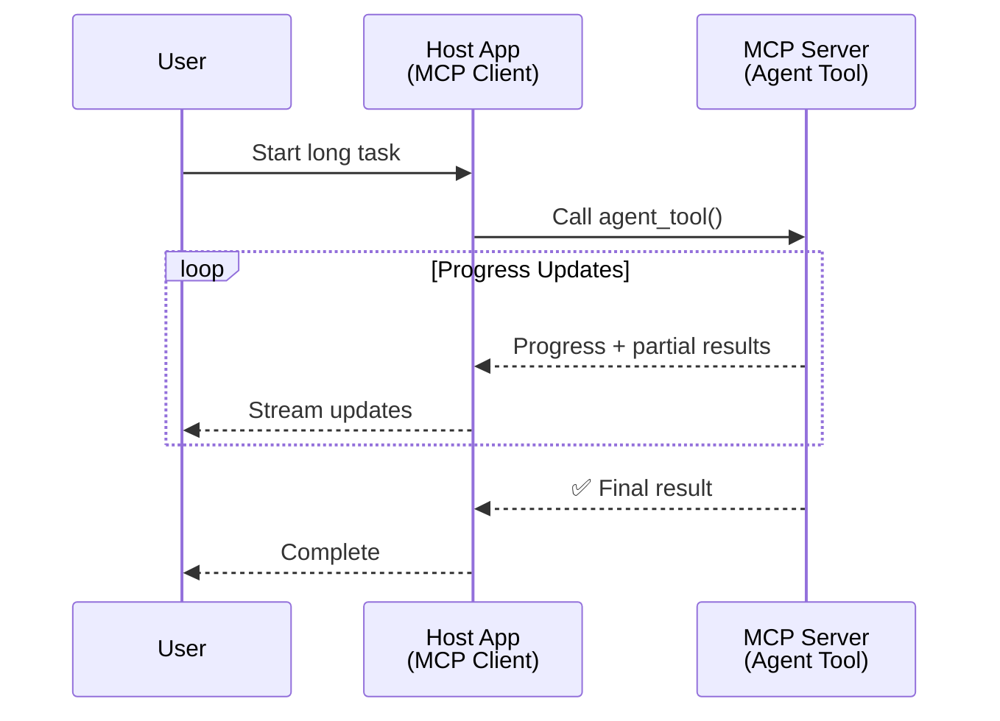
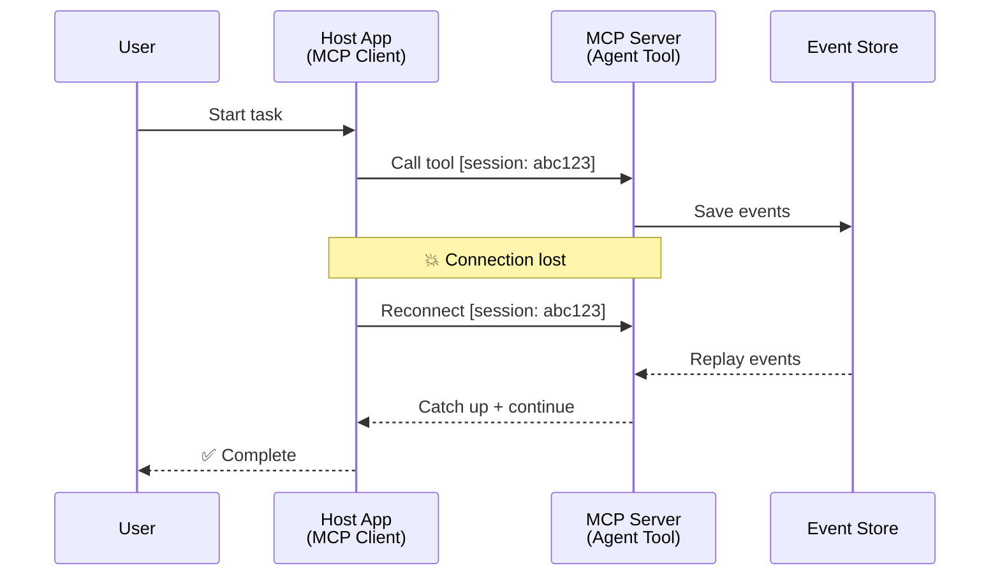
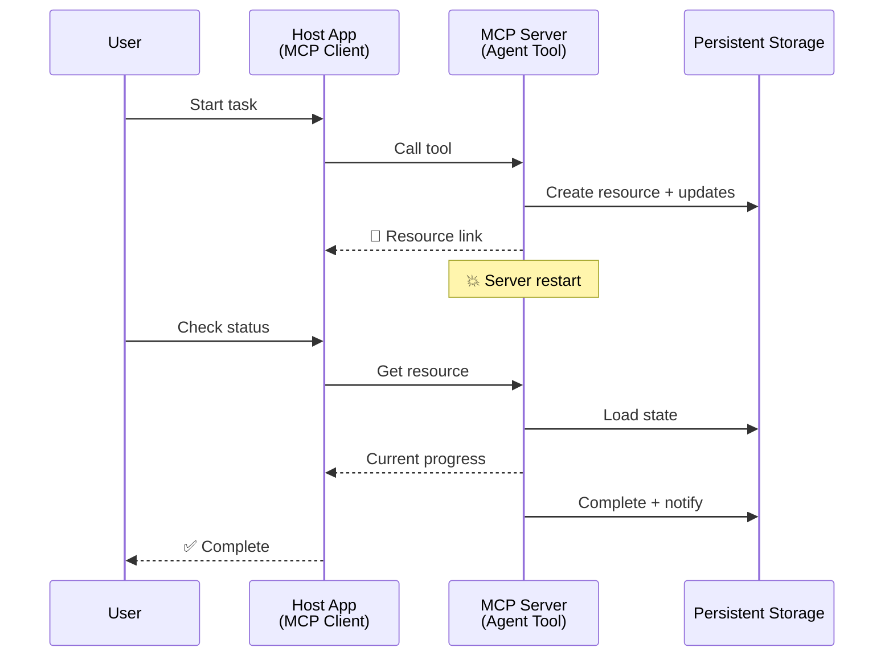
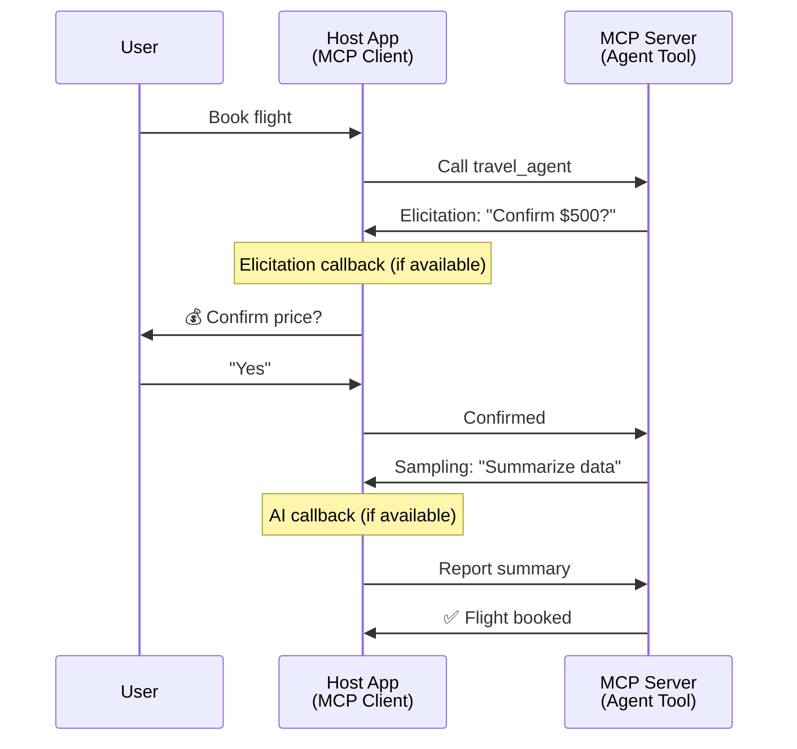
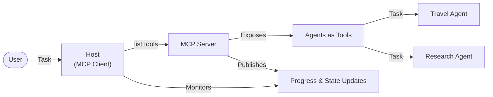

<!--
CO_OP_TRANSLATOR_METADATA:
{
  "original_hash": "5cc6836626047aa055e8960c8484a7d0",
  "translation_date": "2025-08-29T21:18:19+00:00",
  "source_file": "11-agentic-protocols/code_samples/mcp-agents/README.md",
  "language_code": "hu"
}
-->
# Agent-to-Agent Kommunikációs Rendszerek Építése MCP-vel

> Röviden - Lehet MCP-n Agent2Agent Kommunikációt Építeni? Igen!

Az MCP jelentősen túllépett eredeti célján, amely az "LLM-ek kontextusának biztosítása" volt. Az új fejlesztések, mint például a [folytatható adatfolyamok](https://modelcontextprotocol.io/docs/concepts/transports#resumability-and-redelivery), [kikérdezés](https://modelcontextprotocol.io/specification/2025-06-18/client/elicitation), [mintavétel](https://modelcontextprotocol.io/specification/2025-06-18/client/sampling), és értesítések ([haladás](https://modelcontextprotocol.io/specification/2025-06-18/basic/utilities/progress) és [erőforrások](https://modelcontextprotocol.io/specification/2025-06-18/schema#resourceupdatednotification)) révén az MCP most már szilárd alapot nyújt komplex agent-to-agent kommunikációs rendszerek építéséhez.

## Az Agent/Tool Tévképzet

Ahogy egyre több fejlesztő vizsgálja az ügynöki viselkedésű eszközöket (hosszú ideig futnak, közben további bemenetet igényelhetnek stb.), gyakori tévhit, hogy az MCP nem alkalmas erre, főként azért, mert korai példái az eszközök primitívjeinek egyszerű kérés-válasz mintákra összpontosítottak.

Ez a nézet elavult. Az MCP specifikációt az elmúlt hónapokban jelentősen kibővítették olyan képességekkel, amelyek lehetővé teszik a hosszú távú ügynöki viselkedés megvalósítását:

- **Adatfolyamok és Részleges Eredmények**: Valós idejű haladási frissítések a végrehajtás során
- **Folytathatóság**: Az ügyfelek újra csatlakozhatnak és folytathatják a megszakítás után
- **Tartósság**: Az eredmények túlélnek szerver újraindításokat (pl. erőforrás linkek révén)
- **Többfordulós**: Interaktív bemenet a végrehajtás közben kikérdezés és mintavétel révén

Ezek a funkciók kombinálhatók komplex ügynöki és több ügynököt érintő alkalmazások létrehozására, mindezt az MCP protokollon belül.

Referenciaként az ügynököt "eszközként" fogjuk említeni, amely elérhető egy MCP szerveren. Ez magában foglalja egy gazdaalkalmazás létezését, amely megvalósít egy MCP ügyfelet, amely kapcsolatot létesít az MCP szerverrel és hívhatja az ügynököt.

## Mi Teszi Az MCP Eszközt "Ügynöki"?

Mielőtt belevágnánk a megvalósításba, határozzuk meg, milyen infrastruktúra képességekre van szükség a hosszú távú ügynökök támogatásához.

> Az ügynököt úgy definiáljuk, mint egy entitást, amely képes önállóan működni hosszabb időn keresztül, komplex feladatokat kezelve, amelyek több interakciót vagy valós idejű visszajelzés alapján történő módosításokat igényelhetnek.

### 1. Adatfolyamok és Részleges Eredmények

A hagyományos kérés-válasz minták nem működnek hosszú távú feladatok esetén. Az ügynököknek biztosítaniuk kell:

- Valós idejű haladási frissítések
- Köztes eredmények

**MCP Támogatás**: Az erőforrás frissítési értesítések lehetővé teszik a részleges eredmények adatfolyamát, bár ez gondos tervezést igényel, hogy elkerüljük az ütközéseket a JSON-RPC 1:1 kérés/válasz modelljével.

| Funkció                    | Használati Példa                                                                                                                                                                       | MCP Támogatás                                                                                |
| -------------------------- | -------------------------------------------------------------------------------------------------------------------------------------------------------------------------------------- | ------------------------------------------------------------------------------------------ |
| Valós idejű Haladási Frissítések | A felhasználó kér egy kódalap migrációs feladatot. Az ügynök adatfolyamként közvetíti a haladást: "10% - Függőségek elemzése... 25% - TypeScript fájlok konvertálása... 50% - Importok frissítése..."          | ✅ Haladási értesítések                                                                  |
| Részleges Eredmények            | "Könyv generálása" feladat adatfolyamként közvetíti a részleges eredményeket, pl. 1) Történet ív vázlat, 2) Fejezet lista, 3) Minden fejezet, ahogy elkészül. A gazda megvizsgálhatja, törölheti vagy átirányíthatja bármelyik szakaszban. | ✅ Értesítések "kibővíthetők" részleges eredményekkel, lásd javaslatok PR 383, 776 |

<div align="center" style="font-style: italic; font-size: 0.95em; margin-bottom: 0.5em;">
<strong>1. ábra:</strong> Ez a diagram bemutatja, hogyan közvetíti egy MCP ügynök valós idejű haladási frissítéseket és részleges eredményeket a gazdaalkalmazásnak egy hosszú távú feladat során, lehetővé téve a felhasználó számára a végrehajtás valós idejű nyomon követését.
</div>



### 2. Folytathatóság

Az ügynököknek képesnek kell lenniük a hálózati megszakítások kezelésére:

- Újra csatlakozás megszakítás (ügyfél) után
- Folytatás ott, ahol abbahagyták (üzenet újraküldés)

**MCP Támogatás**: Az MCP StreamableHTTP transport ma támogatja a munkamenet folytatását és az üzenet újraküldést munkamenet azonosítókkal és utolsó esemény azonosítókkal. Fontos megjegyezni, hogy a szervernek meg kell valósítania egy EventStore-t, amely lehetővé teszi az események újrajátszását az ügyfél újracsatlakozásakor.  
Megjegyzendő, hogy van egy közösségi javaslat (PR #975), amely a transport-független folytatható adatfolyamokat vizsgálja.

| Funkció      | Használati Példa                                                                                                                                                   | MCP Támogatás                                                                |
| ------------ | ---------------------------------------------------------------------------------------------------------------------------------------------------------- | -------------------------------------------------------------------------- |
| Folytathatóság | Az ügyfél megszakítja a kapcsolatot egy hosszú távú feladat közben. Újracsatlakozáskor a munkamenet folytatódik az elmaradt események újrajátszásával, zökkenőmentesen ott folytatva, ahol abbahagyta. | ✅ StreamableHTTP transport munkamenet azonosítókkal, esemény újrajátszás és EventStore |

<div align="center" style="font-style: italic; font-size: 0.95em; margin-bottom: 0.5em;">
<strong>2. ábra:</strong> Ez a diagram bemutatja, hogyan teszi lehetővé az MCP StreamableHTTP transport és az eseménytár a zökkenőmentes munkamenet folytatást: ha az ügyfél megszakítja a kapcsolatot, újracsatlakozhat és újrajátszhatja az elmaradt eseményeket, folytatva a feladatot anélkül, hogy elveszítené a haladást.
</div>



### 3. Tartósság

A hosszú távú ügynököknek tartós állapotra van szükségük:

- Az eredmények túlélnek szerver újraindításokat
- Az állapot lekérdezhető külsőleg
- Haladás nyomon követése munkamenetek között

**MCP Támogatás**: Az MCP most támogatja az Erőforrás link visszatérési típust eszköz hívásokhoz. Ma egy lehetséges minta az, hogy egy eszköz létrehoz egy erőforrást, és azonnal visszaad egy erőforrás linket. Az eszköz a háttérben folytathatja a feladatot, és frissítheti az erőforrást. Az ügyfél választhat, hogy lekérdezi az erőforrás állapotát részleges vagy teljes eredményekért (az alapján, hogy milyen erőforrás frissítéseket biztosít a szerver), vagy feliratkozik az erőforrás frissítésekre.

Egy korlát itt az, hogy az erőforrások lekérdezése vagy frissítésekre való feliratkozás erőforrásokat fogyaszthat, ami skálázási következményekkel járhat. Van egy nyitott közösségi javaslat (beleértve a #992-t), amely a webhookok vagy trigger-ek lehetőségét vizsgálja, amelyeket a szerver hívhat az ügyfél/gazdaalkalmazás frissítéseinek értesítésére.

| Funkció    | Használati Példa                                                                                                                                        | MCP Támogatás                                                        |
| ---------- | ----------------------------------------------------------------------------------------------------------------------------------------------- | ------------------------------------------------------------------ |
| Tartósság | A szerver összeomlik egy adat migrációs feladat közben. Az eredmények és a haladás túlélnek az újraindítást, az ügyfél ellenőrizheti az állapotot és folytathatja a tartós erőforrásból. | ✅ Erőforrás linkek tartós tárolással és állapot értesítésekkel |

Ma egy gyakori minta az, hogy egy eszköz létrehoz egy erőforrást, és azonnal visszaad egy erőforrás linket. Az eszköz a háttérben folytathatja a feladatot, kiadhat erőforrás értesítéseket, amelyek haladási frissítésekként szolgálnak, vagy részleges eredményeket tartalmazhatnak, és szükség szerint frissítheti az erőforrás tartalmát.

<div align="center" style="font-style: italic; font-size: 0.95em; margin-bottom: 0.5em;">
<strong>3. ábra:</strong> Ez a diagram bemutatja, hogyan használják az MCP ügynökök a tartós erőforrásokat és állapot értesítéseket annak biztosítására, hogy a hosszú távú feladatok túléljék a szerver újraindításokat, lehetővé téve az ügyfelek számára a haladás ellenőrzését és az eredmények lekérését még hibák után is.
</div>



### 4. Többfordulós Interakciók

Az ügynökök gyakran további bemenetet igényelnek a végrehajtás közben:

- Emberi pontosítás vagy jóváhagyás
- AI segítség komplex döntésekhez
- Dinamikus paraméter beállítás

**MCP Támogatás**: Teljes mértékben támogatott mintavétel (AI bemenethez) és kikérdezés (emberi bemenethez) révén.

| Funkció                 | Használati Példa                                                                                                                                     | MCP Támogatás                                           |
| ----------------------- | -------------------------------------------------------------------------------------------------------------------------------------------- | ----------------------------------------------------- |
| Többfordulós Interakciók | Utazási foglalási ügynök ár megerősítést kér a felhasználótól, majd AI-tól kér összefoglalót az utazási adatokhoz, mielőtt befejezné a foglalási tranzakciót. | ✅ Kikérdezés emberi bemenethez, mintavétel AI bemenethez |

<div align="center" style="font-style: italic; font-size: 0.95em; margin-bottom: 0.5em;">
<strong>4. ábra:</strong> Ez a diagram bemutatja, hogyan képesek az MCP ügynökök interaktívan kikérni emberi bemenetet vagy AI segítséget a végrehajtás közben, támogatva komplex, többfordulós munkafolyamatokat, mint például megerősítések és dinamikus döntéshozatal.
</div>



## Hosszú Távú Ügynökök Megvalósítása MCP-n - Kód Áttekintés

Ennek a cikknek a részeként egy [kód-repozitóriumot](https://github.com/victordibia/ai-tutorials/tree/main/MCP%20Agents) biztosítunk, amely teljes megvalósítást tartalmaz hosszú távú ügynökökhöz az MCP Python SDK-val és StreamableHTTP transporttal a munkamenet folytatásához és üzenet újraküldéshez. A megvalósítás bemutatja, hogyan lehet az MCP képességeit kombinálni, hogy kifinomult ügynökszerű viselkedést érjünk el.

Különösen két fő ügynök eszközt valósítunk meg egy szerveren:

- **Utazási Ügynök** - Utazási foglalási szolgáltatást szimulál ár megerősítéssel kikérdezés révén
- **Kutatási Ügynök** - Kutatási feladatokat végez AI által segített összefoglalókkal mintavétel révén

Mindkét ügynök bemutatja a valós idejű haladási frissítéseket, interaktív megerősítéseket és teljes munkamenet folytatási képességeket.

### Kulcsfontosságú Megvalósítási Fogalmak

Az alábbi szakaszok bemutatják a szerver oldali ügynök megvalósítást és az ügyfél oldali gazda kezelését minden képességhez:

#### Adatfolyamok és Haladási Frissítések - Valós Idejű Feladat Állapot

Az adatfolyam lehetővé teszi az ügynökök számára, hogy valós idejű haladási frissítéseket biztosítsanak hosszú távú feladatok során, tájékoztatva a felhasználókat a feladat állapotáról és köztes eredményekről.

**Szerver Megvalósítás (ügynök küld haladási értesítéseket):**

```python
# From server/server.py - Travel agent sending progress updates
for i, step in enumerate(steps):
    await ctx.session.send_progress_notification(
        progress_token=ctx.request_id,
        progress=i * 25,
        total=100,
        message=step,
        related_request_id=str(ctx.request_id)
    )
    await anyio.sleep(2)  # Simulate work

# Alternative: Log messages for detailed step-by-step updates
await ctx.session.send_log_message(
    level="info",
    data=f"Processing step {current_step}/{steps} ({progress_percent}%)",
    logger="long_running_agent",
    related_request_id=ctx.request_id,
)
```

**Ügyfél Megvalósítás (gazda fogad haladási frissítéseket):**

```python
# From client/client.py - Client handling real-time notifications
async def message_handler(message) -> None:
    if isinstance(message, types.ServerNotification):
        if isinstance(message.root, types.LoggingMessageNotification):
            console.print(f"📡 [dim]{message.root.params.data}[/dim]")
        elif isinstance(message.root, types.ProgressNotification):
            progress = message.root.params
            console.print(f"🔄 [yellow]{progress.message} ({progress.progress}/{progress.total})[/yellow]")

# Register message handler when creating session
async with ClientSession(
    read_stream, write_stream,
    message_handler=message_handler
) as session:
```

#### Kikérdezés - Felhasználói Bemenet Kérése

A kikérdezés lehetővé teszi az ügynökök számára, hogy felhasználói bemenetet kérjenek a végrehajtás közben. Ez elengedhetetlen megerősítésekhez, pontosításokhoz vagy jóváhagyásokhoz hosszú távú feladatok során.

**Szerver Megvalósítás (ügynök kér megerősítést):**

```python
# From server/server.py - Travel agent requesting price confirmation
elicit_result = await ctx.session.elicit(
    message=f"Please confirm the estimated price of $1200 for your trip to {destination}",
    requestedSchema=PriceConfirmationSchema.model_json_schema(),
    related_request_id=ctx.request_id,
)

if elicit_result and elicit_result.action == "accept":
    # Continue with booking
    logger.info(f"User confirmed price: {elicit_result.content}")
elif elicit_result and elicit_result.action == "decline":
    # Cancel the booking
    booking_cancelled = True
```

**Ügyfél Megvalósítás (gazda biztosít kikérdezési visszahívást):**

```python
# From client/client.py - Client handling elicitation requests
async def elicitation_callback(context, params):
    console.print(f"💬 Server is asking for confirmation:")
    console.print(f"   {params.message}")

    response = console.input("Do you accept? (y/n): ").strip().lower()

    if response in ['y', 'yes']:
        return types.ElicitResult(
            action="accept",
            content={"confirm": True, "notes": "Confirmed by user"}
        )
    else:
        return types.ElicitResult(
            action="decline",
            content={"confirm": False, "notes": "Declined by user"}
        )

# Register the callback when creating the session
async with ClientSession(
    read_stream, write_stream,
    elicitation_callback=elicitation_callback
) as session:
```

#### Mintavétel - AI Segítség Kérése

A mintavétel lehetővé teszi az ügynökök számára, hogy LLM segítséget kérjenek komplex döntésekhez vagy tartalom generáláshoz a végrehajtás során. Ez lehetővé teszi a hibrid ember-AI munkafolyamatokat.

**Szerver Megvalósítás (ügynök kér AI segítséget):**

```python
# From server/server.py - Research agent requesting AI summary
sampling_result = await ctx.session.create_message(
    messages=[
        SamplingMessage(
            role="user",
            content=TextContent(type="text", text=f"Please summarize the key findings for research on: {topic}")
        )
    ],
    max_tokens=100,
    related_request_id=ctx.request_id,
)

if sampling_result and sampling_result.content:
    if sampling_result.content.type == "text":
        sampling_summary = sampling_result.content.text
        logger.info(f"Received sampling summary: {sampling_summary}")
```

**Ügyfél Megvalósítás (gazda biztosít mintavételi visszahívást):**

```python
# From client/client.py - Client handling sampling requests
async def sampling_callback(context, params):
    message_text = params.messages[0].content.text if params.messages else 'No message'
    console.print(f"🧠 Server requested sampling: {message_text}")

    # In a real application, this could call an LLM API
    # For demo purposes, we provide a mock response
    mock_response = "Based on current research, MCP has evolved significantly..."

    return types.CreateMessageResult(
        role="assistant",
        content=types.TextContent(type="text", text=mock_response),
        model="interactive-client",
        stopReason="endTurn"
    )

# Register the callback when creating the session
async with ClientSession(
    read_stream, write_stream,
    sampling_callback=sampling_callback,
    elicitation_callback=elicitation_callback
) as session:
```

#### Folytathatóság - Munkamenet Folytonosság Megszakítások Után

A folytathatóság biztosítja, hogy a hosszú távú ügynök feladatok túléljék az ügyfél megszakításait, és zökkenőmentesen folytatódjanak újracsatlakozáskor. Ez eseménytárak és folytatási tokenek révén valósul meg.

**Eseménytár Megvalósítás (szerver tárolja a munkamenet állapotát):**

```python
# From server/event_store.py - Simple in-memory event store
class SimpleEventStore(EventStore):
    def __init__(self):
        self._events: list[tuple[StreamId, EventId, JSONRPCMessage]] = []
        self._event_id_counter = 0

    async def store_event(self, stream_id: StreamId, message: JSONRPCMessage) -> EventId:
        """Store an event and return its ID."""
        self._event_id_counter += 1
        event_id = str(self._event_id_counter)
        self._events.append((stream_id, event_id, message))
        return event_id

    async def replay_events_after(self, last_event_id: EventId, send_callback: EventCallback) -> StreamId | None:
        """Replay events after the specified ID for resumption."""
        # Find events after the last known event and replay them
        for _, event_id, message in self._events[start_index:]:
            await send_callback(EventMessage(message, event_id))

# From server/server.py - Passing event store to session manager
def create_server_app(event_store: Optional[EventStore] = None) -> Starlette:
    server = ResumableServer()

    # Create session manager with event store for resumption
    session_manager = StreamableHTTPSessionManager(
        app=server,
        event_store=event_store,  # Event store enables session resumption
        json_response=False,
        security_settings=security_settings,
    )

    return Starlette(routes=[Mount("/mcp", app=session_manager.handle_request)])

# Usage: Initialize with event store
event_store = SimpleEventStore()
app = create_server_app(event_store)
```

**Ügyfél Metaadatok Folytatási Tokennel (ügyfél újracsatlakozik tárolt állapot használatával):**

```python
# From client/client.py - Client resumption with metadata
if existing_tokens and existing_tokens.get("resumption_token"):
    # Use existing resumption token to continue where we left off
    metadata = ClientMessageMetadata(
        resumption_token=existing_tokens["resumption_token"],
    )
else:
    # Create callback to save resumption token when received
    def enhanced_callback(token: str):
        protocol_version = getattr(session, 'protocol_version', None)
        token_manager.save_tokens(session_id, token, protocol_version, command, args)

    metadata = ClientMessageMetadata(
        on_resumption_token_update=enhanced_callback,
    )

# Send request with resumption metadata
result = await session.send_request(
    types.ClientRequest(
        types.CallToolRequest(
            method="tools/call",
            params=types.CallToolRequestParams(name=command, arguments=args)
        )
    ),
    types.CallToolResult,
    metadata=metadata,
)
```

A gazdaalkalmazás helyileg tárolja a munkamenet azonosítókat és folytatási tokeneket, lehetővé téve, hogy meglévő munkamenetekhez csatlakozzon anélkül, hogy elveszítené a haladást vagy állapotot.

### Kód Szervezés

<div align="center" style="font-style: italic; font-size: 0.95em; margin-bottom: 0.5em;">
<strong>5. ábra:</strong> MCP-alapú ügynöki rendszer architektúra
</div>



**Kulcsfontosságú Fájlok:**

- **`server/server.py

---

**Felelősség kizárása**:  
Ez a dokumentum az AI fordítási szolgáltatás [Co-op Translator](https://github.com/Azure/co-op-translator) segítségével lett lefordítva. Bár törekszünk a pontosságra, kérjük, vegye figyelembe, hogy az automatikus fordítások hibákat vagy pontatlanságokat tartalmazhatnak. Az eredeti dokumentum az eredeti nyelvén tekintendő hiteles forrásnak. Kritikus információk esetén javasolt professzionális emberi fordítást igénybe venni. Nem vállalunk felelősséget semmilyen félreértésért vagy téves értelmezésért, amely a fordítás használatából eredhet.