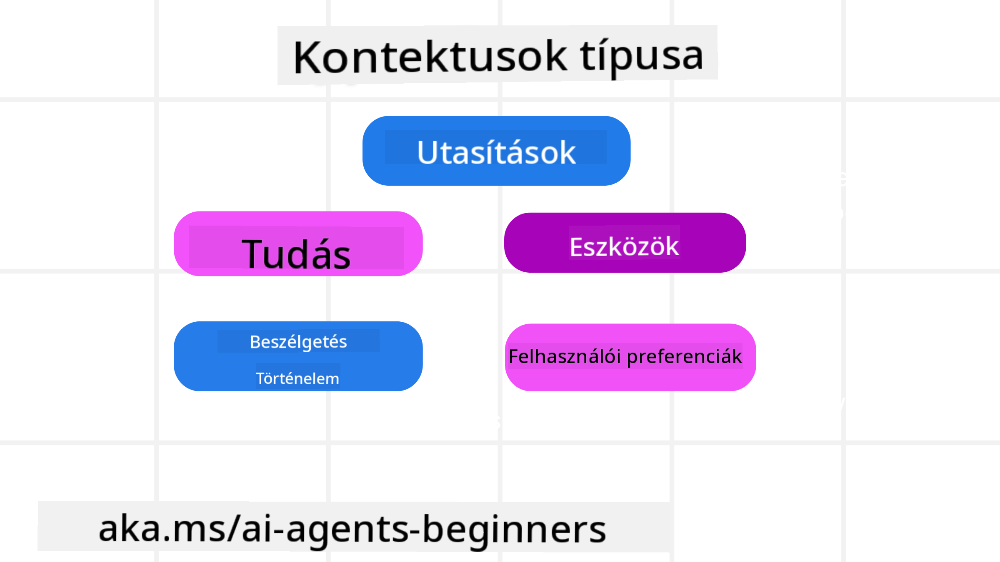
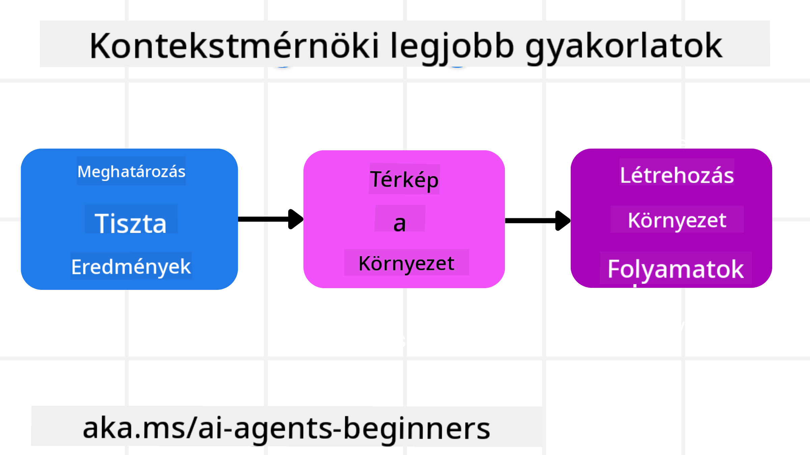

<!--
CO_OP_TRANSLATOR_METADATA:
{
  "original_hash": "cb7e50f471905ce6fdb92a30269a7a98",
  "translation_date": "2025-09-04T10:23:21+00:00",
  "source_file": "12-context-engineering/README.md",
  "language_code": "hu"
}
-->
# Kontextusmérnökség AI ügynökök számára

> _(Kattints a fenti képre a leckéhez tartozó videó megtekintéséhez)_

Fontos, hogy megértsük annak az alkalmazásnak a komplexitását, amelyhez AI ügynököt építünk, hogy megbízható rendszert hozzunk létre. Olyan AI ügynököket kell építenünk, amelyek hatékonyan kezelik az információkat, hogy összetett igényeket tudjanak kielégíteni, túlmutatva a prompt mérnökségen.

Ebben a leckében megvizsgáljuk, mi is az a kontextusmérnökség, és milyen szerepet játszik az AI ügynökök építésében.

## Bevezetés

A lecke az alábbiakat fogja tárgyalni:

• **Mi az a kontextusmérnökség**, és miért különbözik a prompt mérnökségtől.

• **Hatékony kontextusmérnökségi stratégiák**, beleértve az információk írását, kiválasztását, tömörítését és elkülönítését.

• **Gyakori kontextushibák**, amelyek kisiklatják az AI ügynököt, és hogyan javíthatók.

## Tanulási célok

A lecke elvégzése után képes leszel:

• **Meghatározni a kontextusmérnökséget**, és megkülönböztetni a prompt mérnökségtől.

• **Azonosítani a kontextus kulcselemeit** a Nagy Nyelvi Modell (LLM) alkalmazásokban.

• **Alkalmazni stratégiákat a kontextus írására, kiválasztására, tömörítésére és elkülönítésére**, hogy javítsd az ügynök teljesítményét.

• **Felismerni a gyakori kontextushibákat**, mint például a mérgezés, zavarás, összezavarodás és ütközés, valamint megvalósítani a javító technikákat.

## Mi az a kontextusmérnökség?

Az AI ügynökök esetében a kontextus az, ami meghatározza, hogy az ügynök milyen lépéseket tesz a feladat elvégzése érdekében. A kontextusmérnökség annak biztosítását jelenti, hogy az AI ügynök rendelkezzen a megfelelő információval a következő lépés végrehajtásához. A kontextusablak mérete korlátozott, ezért az ügynöképítőknek rendszereket és folyamatokat kell létrehozniuk az információ hozzáadására, eltávolítására és tömörítésére.

### Prompt mérnökség vs. Kontextusmérnökség

A prompt mérnökség egy statikus utasításhalmazra összpontosít, amely hatékonyan irányítja az AI ügynököket szabályokkal. A kontextusmérnökség viszont egy dinamikus információhalmaz kezeléséről szól, beleértve az eredeti promptot is, hogy az AI ügynök hosszú távon rendelkezzen a szükséges információkkal. A kontextusmérnökség fő célja, hogy ezt a folyamatot ismételhetővé és megbízhatóvá tegye.

### A kontextus típusai

Fontos megjegyezni, hogy a kontextus nem egyetlen dolog. Az információ, amelyre az AI ügynöknek szüksége van, különböző forrásokból származhat, és nekünk kell biztosítanunk, hogy az ügynök hozzáférjen ezekhez a forrásokhoz:

Az AI ügynök által kezelt kontextus típusai a következők lehetnek:

• **Utasítások:** Ezek az ügynök "szabályai" – promptok, rendszerüzenetek, néhány példával bemutatott feladatok (hogyan kell valamit csinálni), és az általa használható eszközök leírásai. Itt találkozik a prompt mérnökség a kontextusmérnökséggel.

• **Tudás:** Ez magában foglalja a tényeket, adatbázisokból lekért információkat vagy az ügynök által hosszú távon felhalmozott emlékeket. Ide tartozik egy Retrieval Augmented Generation (RAG) rendszer integrálása, ha az ügynöknek különböző tudásbázisokhoz és adatbázisokhoz kell hozzáférnie.

• **Eszközök:** Ezek külső funkciók, API-k és MCP szerverek definíciói, amelyeket az ügynök hívhat, valamint az ezek használatából származó visszajelzések (eredmények).

• **Beszélgetési előzmények:** A felhasználóval folytatott folyamatos párbeszéd. Idővel ezek a beszélgetések hosszabbá és összetettebbé válnak, ami helyet foglal a kontextusablakban.

• **Felhasználói preferenciák:** Információk, amelyeket az ügynök a felhasználó kedveléseiről vagy nem kedveléseiről tanul meg az idő múlásával. Ezeket kulcsfontosságú döntések meghozatalakor lehet előhívni, hogy segítsenek a felhasználónak.

## Hatékony kontextusmérnökségi stratégiák

### Tervezési stratégiák

A jó kontextusmérnökség jó tervezéssel kezdődik. Íme egy megközelítés, amely segít elkezdeni a kontextusmérnökség alkalmazását:

1. **Határozd meg az egyértelmű eredményeket** – Az AI ügynökök által elvégzendő feladatok eredményeit egyértelműen meg kell határozni. Válaszolj arra a kérdésre: "Hogyan fog kinézni a világ, amikor az AI ügynök befejezi a feladatát?" Más szóval, milyen változást, információt vagy választ kell kapnia a felhasználónak az AI ügynökkel való interakció után.

2. **Térképezd fel a kontextust** – Miután meghatároztad az AI ügynök eredményeit, válaszolj arra a kérdésre: "Milyen információkra van szüksége az AI ügynöknek a feladat elvégzéséhez?" Így elkezdheted feltérképezni, hogy hol található meg az információ.

3. **Hozz létre kontextuscsatornákat** – Most, hogy tudod, hol található az információ, válaszolj arra a kérdésre: "Hogyan fogja az ügynök megszerezni ezt az információt?" Ez különböző módokon történhet, például RAG, MCP szerverek és más eszközök használatával.

### Gyakorlati stratégiák

A tervezés fontos, de amikor az információ elkezd beáramlani az ügynök kontextusablakába, gyakorlati stratégiákra van szükség annak kezeléséhez:

#### Kontextus kezelése

Bár néhány információ automatikusan bekerül a kontextusablakba, a kontextusmérnökség aktívabb szerepet vállalhat az információ kezelésében, amelyet az alábbi stratégiák segítségével lehet megvalósítani:

1. **Ügynöki jegyzetfüzet**  
Ez lehetővé teszi az AI ügynök számára, hogy jegyzeteket készítsen a releváns információkról az aktuális feladatokról és felhasználói interakciókról egyetlen munkamenet során. Ez a kontextusablakon kívül, egy fájlban vagy futásidejű objektumban létezhet, amelyet az ügynök később visszakereshet az adott munkamenet során.

2. **Emlékek**  
A jegyzetfüzetek jók az információk kezelésére egyetlen munkamenet kontextusablakán kívül. Az emlékek lehetővé teszik az ügynökök számára, hogy releváns információkat tároljanak és visszakeressenek több munkamenet során. Ez magában foglalhat összefoglalókat, felhasználói preferenciákat és visszajelzéseket a jövőbeli fejlesztésekhez.

3. **Kontextus tömörítése**  
Amikor a kontextusablak megtelik, olyan technikák, mint az összefoglalás és a vágás alkalmazhatók. Ez magában foglalja a legrelevánsabb információk megtartását vagy a régebbi üzenetek eltávolítását.

4. **Több ügynökös rendszerek**  
Több ügynökös rendszer fejlesztése a kontextusmérnökség egy formája, mivel minden ügynöknek megvan a saját kontextusablaka. Az, hogy ez a kontextus hogyan oszlik meg és kerül átadásra az ügynökök között, egy másik tervezési szempont ezeknek a rendszereknek az építésekor.

5. **Homokozó környezetek**  
Ha egy ügynöknek kódot kell futtatnia vagy nagy mennyiségű információt kell feldolgoznia egy dokumentumban, ez jelentős mennyiségű token használatát igényelheti az eredmények feldolgozásához. Ehelyett az ügynök használhat egy homokozó környezetet, amely képes futtatni ezt a kódot, és csak az eredményeket és más releváns információkat olvassa be.

6. **Futásidejű állapotobjektumok**  
Ez úgy valósítható meg, hogy információtárolókat hozunk létre, amelyek kezelik azokat a helyzeteket, amikor az ügynöknek hozzáférnie kell bizonyos információkhoz. Egy összetett feladat esetén ez lehetővé teszi az ügynök számára, hogy minden részfeladat eredményét lépésről lépésre tárolja, így a kontextus csak az adott részfeladathoz kapcsolódik.

### Kontextusmérnökség példája

Tegyük fel, hogy azt szeretnénk, hogy egy AI ügynök **"Foglaljon nekem egy utat Párizsba."**

• Egy egyszerű ügynök, amely csak prompt mérnökséget használ, így válaszolhat: **"Rendben, mikor szeretne Párizsba utazni?"**. Csak az aktuális kérdést dolgozza fel, amikor a felhasználó megkérdezi.

• Egy ügynök, amely a kontextusmérnökségi stratégiákat alkalmazza, sokkal többet tesz. Mielőtt válaszolna, a rendszere például:

  ◦ **Ellenőrzi a naptáradat** a szabad időpontokért (valós idejű adatokat lekérve).

 ◦ **Felidézi korábbi utazási preferenciáidat** (hosszú távú memóriából), például kedvenc légitársaságodat, költségvetésedet vagy azt, hogy előnyben részesíted-e a közvetlen járatokat.

 ◦ **Azonosítja az elérhető eszközöket** repülőjegy- és szállásfoglaláshoz.

- Ezután egy példaválasz lehetne: **"Szia [Neved]! Látom, hogy szabad vagy október első hetében. Keressek közvetlen járatokat Párizsba a [Kedvenc légitársaságod] járataival, a szokásos [Költségvetésed] keretén belül?"**. Ez a gazdagabb, kontextus-tudatos válasz jól szemlélteti a kontextusmérnökség erejét.

## Gyakori kontextushibák

### Kontextus mérgezése

**Mi ez:** Amikor egy hallucináció (hamis információ, amelyet az LLM generál) vagy hiba bekerül a kontextusba, és ismételten hivatkoznak rá, az ügynök lehetetlen célokat követhet vagy értelmetlen stratégiákat alakíthat ki.

**Mit tegyünk:** Valósíts meg **kontextus validálást** és **karantént**. Ellenőrizd az információt, mielőtt hosszú távú memóriába kerülne. Ha mérgezés gyanúja merül fel, indíts új kontextusszálakat, hogy megakadályozd a hibás információ terjedését.

**Utazási foglalási példa:** Az ügynök hallucinál egy **közvetlen járatot egy kis helyi repülőtérről egy távoli nemzetközi városba**, amely valójában nem kínál nemzetközi járatokat. Ez a nem létező járat részlete bekerül a kontextusba. Később, amikor jegyet kérsz, az ügynök folyamatosan próbál jegyet találni erre a lehetetlen útvonalra, ami ismételt hibákhoz vezet.

**Megoldás:** Valósíts meg egy lépést, amely **ellenőrzi a járatok létezését és útvonalait valós idejű API-val**, mielőtt a járat részlete bekerülne az ügynök munkakontextusába. Ha az ellenőrzés sikertelen, a hibás információt "karanténba" helyezik, és nem használják tovább.

### Kontextus zavarása

**Mi ez:** Amikor a kontextus olyan nagyra nő, hogy a modell túlságosan az összegyűlt előzményekre koncentrál, ahelyett, hogy a tanulás során megszerzett tudást használná, ami ismétlődő vagy haszontalan cselekvésekhez vezet. A modellek hibákat kezdhetnek el követni, még mielőtt a kontextusablak megtelik.

**Mit tegyünk:** Használj **kontextus összefoglalást**. Időnként tömörítsd az összegyűlt információt rövidebb összefoglalókba, megtartva a fontos részleteket, miközben eltávolítod a redundáns előzményeket. Ez segít "újraindítani" a fókuszt.

**Utazási foglalási példa:** Hosszasan beszélgetsz különböző álomutazási célpontokról, beleértve egy részletes beszámolót a két évvel ezelőtti hátizsákos utazásodról. Amikor végül azt kéred, hogy **"keress nekem egy olcsó járatot a következő hónapra"**, az ügynök elmerül a régi, irreleváns részletekben, és folyamatosan a hátizsákos felszerelésedről vagy korábbi útvonalakról kérdez, elhanyagolva az aktuális kérésedet.

**Megoldás:** Egy bizonyos számú forduló után vagy amikor a kontextus túl nagyra nő, az ügynöknek **össze kell foglalnia a beszélgetés legfrissebb és legrelevánsabb részeit** – az aktuális utazási dátumokat és célpontot – és ezt a tömörített összefoglalót kell használnia a következő LLM híváshoz, elvetve a kevésbé releváns történelmi beszélgetést.

### Kontextus összezavarodása

**Mi ez:** Amikor a szükségtelen kontextus, gyakran túl sok elérhető eszköz formájában, arra készteti a modellt, hogy rossz válaszokat generáljon vagy irreleváns eszközöket hívjon meg. A kisebb modellek különösen hajlamosak erre.

**Mit tegyünk:** Valósíts meg **eszközkezelést** RAG technikák segítségével. Tárold az eszközleírásokat egy vektorbázisban, és válaszd ki _csak_ a legrelevánsabb eszközöket az adott feladathoz. Kutatások szerint az eszközválasztást érdemes 30 alatt tartani.

**Utazási foglalási példa:** Az ügynök hozzáfér több tucat eszközhöz: `book_flight`, `book_hotel`, `rent_car`, `find_tours`, `currency_converter`, `weather

---

**Felelősség kizárása**:  
Ez a dokumentum az AI fordítási szolgáltatás, a [Co-op Translator](https://github.com/Azure/co-op-translator) segítségével lett lefordítva. Bár törekszünk a pontosságra, kérjük, vegye figyelembe, hogy az automatikus fordítások hibákat vagy pontatlanságokat tartalmazhatnak. Az eredeti dokumentum az eredeti nyelvén tekintendő hiteles forrásnak. Kritikus információk esetén javasolt professzionális emberi fordítást igénybe venni. Nem vállalunk felelősséget semmilyen félreértésért vagy téves értelmezésért, amely a fordítás használatából eredhet.