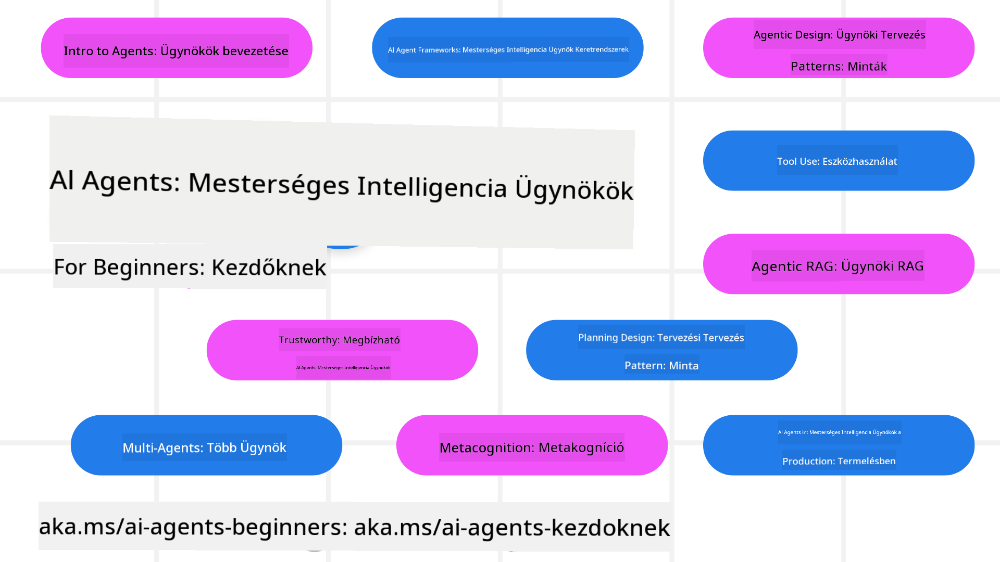

<!--
CO_OP_TRANSLATOR_METADATA:
{
  "original_hash": "6b07046397366e6f6f4524c9ddeba1e1",
  "translation_date": "2025-07-12T14:58:17+00:00",
  "source_file": "README.md",
  "language_code": "hu"
}
-->
# AI Ügynökök Kezdőknek - Egy Tanfolyam

## 11 Lecke, amely mindent megtanít, amit az AI Ügynökök építésének elkezdéséhez tudni kell

  
  
  
  

### 🌐 Többnyelvű támogatás

#### GitHub Action által támogatott (Automatikus és Mindig naprakész)

[Francia](../fr/README.md) | [Spanyol](../es/README.md) | [Német](../de/README.md) | [Orosz](../ru/README.md) | [Arab](../ar/README.md) | [Perzsa (Fárszi)](../fa/README.md) | [Urdu](../ur/README.md) | [Kínai (Egyszerűsített)](../zh/README.md) | [Kínai (Hagyományos, Makaó)](../mo/README.md) | [Kínai (Hagyományos, Hongkong)](../hk/README.md) | [Kínai (Hagyományos, Tajvan)](../tw/README.md) | [Japán](../ja/README.md) | [Koreai](../ko/README.md) | [Hindi](../hi/README.md) | [Bengáli](../bn/README.md) | [Marathi](../mr/README.md) | [Nepáli](../ne/README.md) | [Pandzsábi (Gurmukhi)](../pa/README.md) | [Portugál (Portugália)](../pt/README.md) | [Portugál (Brazília)](../br/README.md) | [Olasz](../it/README.md) | [Lengyel](../pl/README.md) | [Török](../tr/README.md) | [Görög](../el/README.md) | [Thai](../th/README.md) | [Svéd](../sv/README.md) | [Dán](../da/README.md) | [Norvég](../no/README.md) | [Finn](../fi/README.md) | [Holland](../nl/README.md) | [Héber](../he/README.md) | [Vietnami](../vi/README.md) | [Indonéz](../id/README.md) | [Maláj](../ms/README.md) | [Tagalog (Filippínó)](../tl/README.md) | [Szuahéli](../sw/README.md) | [Magyar](./README.md) | [Cseh](../cs/README.md) | [Szlovák](../sk/README.md) | [Román](../ro/README.md) | [Bolgár](../bg/README.md) | [Szerb (Cirill)](../sr/README.md) | [Horvát](../hr/README.md) | [Szlovén](../sl/README.md) | [Ukrán](../uk/README.md) | [Burmai (Myanmar)](../my/README.md)

**Ha további nyelvek támogatását szeretnéd, azok listája megtalálható [itt](https://github.com/Azure/co-op-translator/blob/main/getting_started/supported-languages.md)**

  
  

## 🌱 Kezdés

Ez a tanfolyam 11 leckét tartalmaz, amelyek az AI Ügynökök építésének alapjait fedik le. Minden lecke egy-egy témát dolgoz fel, így bátran kezdj ott, ahol szeretnéd!

A tanfolyam többnyelvű támogatással rendelkezik. Nézd meg az elérhető nyelveket [itt](../..).

Ha most építesz először Generatív AI modellekkel, nézd meg a [Generatív AI Kezdőknek](https://aka.ms/genai-beginners) tanfolyamunkat, amely 21 leckét tartalmaz a GenAI használatáról.

Ne felejtsd el [megcsillagozni (🌟) ezt a repót](https://docs.github.com/en/get-started/exploring-projects-on-github/saving-repositories-with-stars?WT.mc_id=academic-105485-koreyst) és [forkolni ezt a repót](https://github.com/microsoft/ai-agents-for-beginners/fork), hogy futtatni tudd a kódot.

### Amire szükséged lesz

Minden lecke tartalmaz kódpéldákat, amelyeket a code_samples mappában találsz. [Forkold ezt a repót](https://github.com/microsoft/ai-agents-for-beginners/fork), hogy saját példányt készíthess.

A példák az Azure AI Foundry és a GitHub Model Catalogs szolgáltatásait használják a nyelvi modellekkel való interakcióhoz:

- [Github Models](https://aka.ms/ai-agents-beginners/github-models) – Ingyenes / Korlátozott  
- [Azure AI Foundry](https://aka.ms/ai-agents-beginners/ai-foundry) – Azure fiók szükséges

A tanfolyam a Microsoft következő AI Ügynök keretrendszereit és szolgáltatásait is használja:

- [Azure AI Agent Service](https://aka.ms/ai-agents-beginners/ai-agent-service)  
- [Semantic Kernel](https://aka.ms/ai-agents-beginners/semantic-kernel)  
- [AutoGen](https://aka.ms/ai-agents/autogen)

A tanfolyam kódjának futtatásáról további információt a [Course Setup](./00-course-setup/README.md) fájlban találsz.

## 🙏 Szeretnél segíteni?

Van javaslatod, vagy találtál helyesírási vagy kódhibákat? [Nyiss egy issue-t](https://github.com/microsoft/ai-agents-for-beginners/issues?WT.mc_id=academic-105485-koreyst) vagy [készíts pull requestet](https://github.com/microsoft/ai-agents-for-beginners/pulls?WT.mc_id=academic-105485-koreyst)

Ha elakadsz vagy kérdésed van az AI Ügynökök építésével kapcsolatban, csatlakozz az [Azure AI Foundry Community Discord](https://discord.gg/kzRShWzttr) szerverünkhöz.

Ha termék-visszajelzésed vagy hibabejelentésed van az építés során, látogass el az [Azure AI Foundry Fejlesztői Fórumra](https://aka.ms/azureaifoundry/forum).

## 📂 Minden lecke tartalmaz

- Írott leckét a README-ben és egy rövid videót  
- Python kódmintákat, amelyek támogatják az Azure AI Foundryt és a Github Modelleket (ingyenes)  
- Linkeket további forrásokhoz a tanulás folytatásához

## 🗃️ Leckék

| **Lecke**                               | **Szöveg & Kód**                                   | **Videó**                                                  | **További tanulás**                                                                    |
|----------------------------------------|---------------------------------------------------|------------------------------------------------------------|----------------------------------------------------------------------------------------|
| Bevezetés az AI Ügynökökbe és használati esetek | [Link](./01-intro-to-ai-agents/README.md)          | [Videó](https://youtu.be/3zgm60bXmQk?si=z8QygFvYQv-9WtO1)  | [Link](https://aka.ms/ai-agents-beginners/collection?WT.mc_id=academic-105485-koreyst) |
| AI Ügynök keretrendszerek felfedezése | [Link](./02-explore-agentic-frameworks/README.md)  | [Videó](https://youtu.be/ODwF-EZo_O8?si=Vawth4hzVaHv-u0H)  | [Link](https://aka.ms/ai-agents-beginners/collection?WT.mc_id=academic-105485-koreyst) |
| AI Ügynök tervezési minták megértése  | [Link](./03-agentic-design-patterns/README.md)     | [Videó](https://youtu.be/m9lM8qqoOEA?si=BIzHwzstTPL8o9GF)  | [Link](https://aka.ms/ai-agents-beginners/collection?WT.mc_id=academic-105485-koreyst) |
| Eszközhasználati tervezési minta       | [Link](./04-tool-use/README.md)                    | [Videó](https://youtu.be/vieRiPRx-gI?si=2z6O2Xu2cu_Jz46N)  | [Link](https://aka.ms/ai-agents-beginners/collection?WT.mc_id=academic-105485-koreyst) |
| Ügynöki RAG                           | [Link](./05-agentic-rag/README.md)                 | [Videó](https://youtu.be/WcjAARvdL7I?si=gKPWsQpKiIlDH9A3)  | [Link](https://aka.ms/ai-agents-beginners/collection?WT.mc_id=academic-105485-koreyst) |
| Megbízható AI Ügynökök építése        | [Link](./06-building-trustworthy-agents/README.md) | [Videó](https://youtu.be/iZKkMEGBCUQ?si=jZjpiMnGFOE9L8OK ) | [Link](https://aka.ms/ai-agents-beginners/collection?WT.mc_id=academic-105485-koreyst) |
| Tervezési minta - Tervezés             | [Link](./07-planning-design/README.md)             | [Videó](https://youtu.be/kPfJ2BrBCMY?si=6SC_iv_E5-mzucnC)  | [Link](https://aka.ms/ai-agents-beginners/collection?WT.mc_id=academic-105485-koreyst) |
| Többügynökös tervezési minta           | [Link](./08-multi-agent/README.md)                 | [Videó](https://youtu.be/V6HpE9hZEx0?si=rMgDhEu7wXo2uo6g)  | [Link](https://aka.ms/ai-agents-beginners/collection?WT.mc_id=academic-105485-koreyst) |
| Metakogníciós tervezési minta          | [Link](./09-metacognition/README.md)               | [Videó](https://youtu.be/His9R6gw6Ec?si=8gck6vvdSNCt6OcF)  | [Link](https://aka.ms/ai-agents-beginners/collection?WT.mc_id=academic-105485-koreyst) |
| AI Ügynökök éles környezetben          | [Link](./10-ai-agents-production/README.md)        | [Videó](https://youtu.be/l4TP6IyJxmQ?si=31dnhexRo6yLRJDl)  | [Link](https://aka.ms/ai-agents-beginners/collection?WT.mc_id=academic-105485-koreyst) |
| AI Ügynökök MCP-vel                    | [Link](./11-mcp/README.md)                         |                                                            | [Link](https://aka.ms/mcp-for-beginners)                                               |

## 🎒 Egyéb tanfolyamok

Csapatunk más tanfolyamokat is készít! Nézd meg:
- [**ÚJ** Model Context Protocol (MCP) kezdőknek](https://github.com/microsoft/mcp-for-beginners?WT.mc_id=academic-105485-koreyst)
- [Generatív AI kezdőknek .NET használatával](https://github.com/microsoft/Generative-AI-for-beginners-dotnet?WT.mc_id=academic-105485-koreyst)
- [Generatív AI kezdőknek](https://github.com/microsoft/generative-ai-for-beginners?WT.mc_id=academic-105485-koreyst)
- [ML kezdőknek](https://aka.ms/ml-beginners?WT.mc_id=academic-105485-koreyst)
- [Adattudomány kezdőknek](https://aka.ms/datascience-beginners?WT.mc_id=academic-105485-koreyst)
- [AI kezdőknek](https://aka.ms/ai-beginners?WT.mc_id=academic-105485-koreyst)
- [Kiberbiztonság kezdőknek](https://github.com/microsoft/Security-101??WT.mc_id=academic-96948-sayoung)
- [Webfejlesztés kezdőknek](https://aka.ms/webdev-beginners?WT.mc_id=academic-105485-koreyst)
- [IoT kezdőknek](https://aka.ms/iot-beginners?WT.mc_id=academic-105485-koreyst)
- [XR fejlesztés kezdőknek](https://github.com/microsoft/xr-development-for-beginners?WT.mc_id=academic-105485-koreyst)
- [GitHub Copilot mesterfokon AI páros programozáshoz](https://aka.ms/GitHubCopilotAI?WT.mc_id=academic-105485-koreyst)
- [GitHub Copilot mesterfokon C#/.NET fejlesztőknek](https://github.com/microsoft/mastering-github-copilot-for-dotnet-csharp-developers?WT.mc_id=academic-105485-koreyst)
- [Válaszd ki a saját Copilot kalandodat](https://github.com/microsoft/CopilotAdventures?WT.mc_id=academic-105485-koreyst)

## 🌟 Közösségi köszönet

Köszönet [Shivam Goyal](https://www.linkedin.com/in/shivam2003/)-nak az Agentic RAG-et bemutató fontos kódrészletekért.

## Hozzájárulás

Ez a projekt szívesen fogad hozzájárulásokat és javaslatokat. A legtöbb hozzájáruláshoz el kell fogadnod egy
Contributor License Agreement (CLA) megállapodást, amelyben kijelented, hogy jogodban áll, és valóban megadod nekünk
a jogot a hozzájárulásod használatára. Részletekért látogass el a
<https://cla.opensource.microsoft.com> oldalra.

Amikor pull request-et küldesz be, egy CLA bot automatikusan megállapítja, hogy szükséges-e CLA-t benyújtanod,
és ennek megfelelően jelöli meg a PR-t (pl. státusz ellenőrzés, komment). Egyszerűen kövesd a bot utasításait.
Ezt csak egyszer kell megtenned az összes CLA-t használó repóban.

Ez a projekt elfogadta a [Microsoft Open Source Code of Conduct](https://opensource.microsoft.com/codeofconduct/) irányelveit.
További információkért lásd a [Code of Conduct GYIK](https://opensource.microsoft.com/codeofconduct/faq/) oldalt, vagy
keresd az [opencode@microsoft.com](mailto:opencode@microsoft.com) címet további kérdésekkel vagy észrevételekkel.

## Védjegyek

Ez a projekt tartalmazhat védjegyeket vagy logókat projektekhez, termékekhez vagy szolgáltatásokhoz. A Microsoft
védjegyek vagy logók jogosult használata a
[Microsoft védjegy- és márka irányelveinek](https://www.microsoft.com/legal/intellectualproperty/trademarks/usage/general) betartásával történhet.
A Microsoft védjegyek vagy logók módosított verziókban való használata nem okozhat félreértést, és nem sugallhat Microsoft támogatást.
Harmadik fél védjegyeinek vagy logóinak használata a harmadik felek szabályzatai szerint történik.

**Jogi nyilatkozat**:  
Ez a dokumentum az AI fordító szolgáltatás, a [Co-op Translator](https://github.com/Azure/co-op-translator) segítségével készült. Bár a pontosságra törekszünk, kérjük, vegye figyelembe, hogy az automatikus fordítások hibákat vagy pontatlanságokat tartalmazhatnak. Az eredeti dokumentum az anyanyelvén tekintendő hiteles forrásnak. Fontos információk esetén szakmai, emberi fordítást javaslunk. Nem vállalunk felelősséget a fordítás használatából eredő félreértésekért vagy téves értelmezésekért.