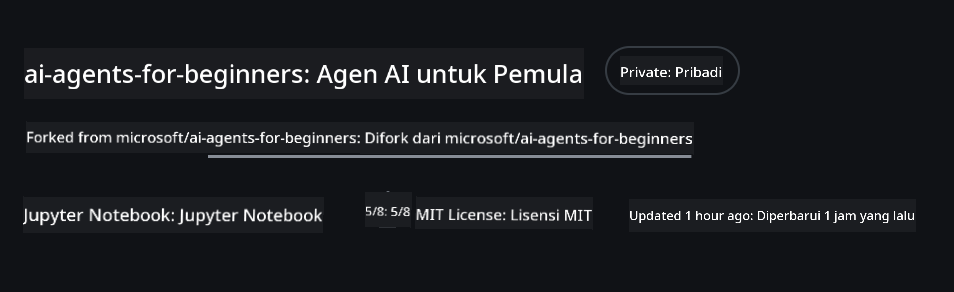
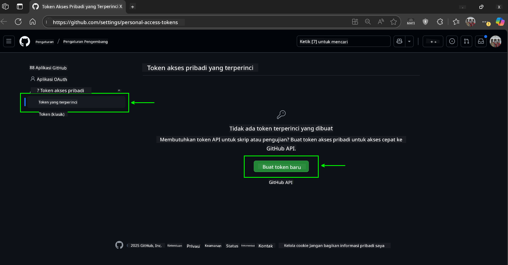
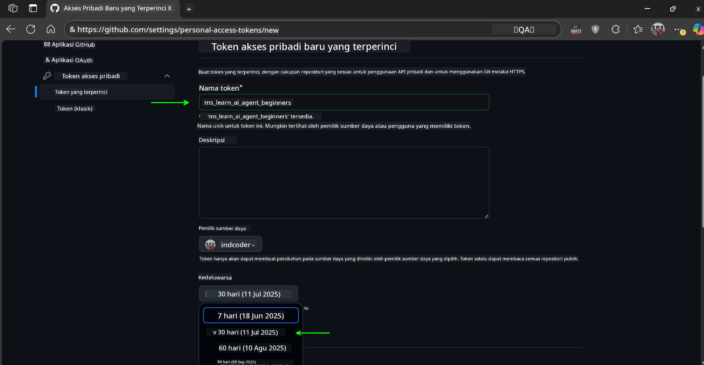
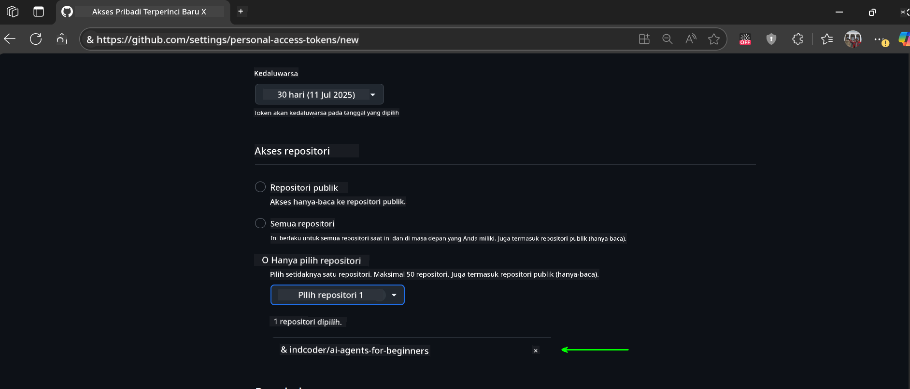
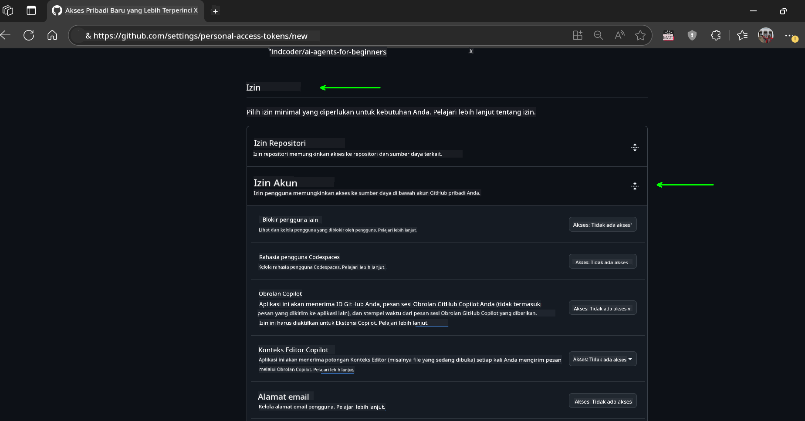
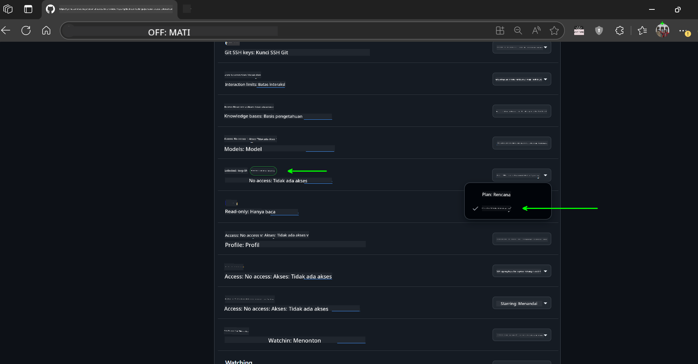
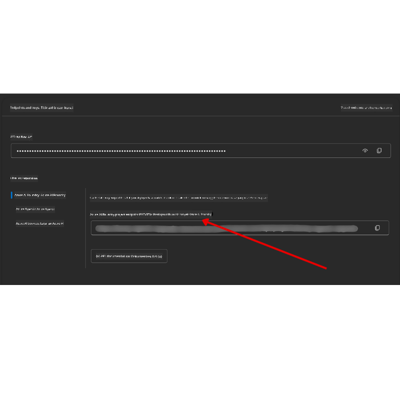

<!--
CO_OP_TRANSLATOR_METADATA:
{
  "original_hash": "c6a79c8f2b56a80370ff7e447765524f",
  "translation_date": "2025-07-23T08:59:35+00:00",
  "source_file": "00-course-setup/README.md",
  "language_code": "id"
}
-->
# Persiapan Kursus

## Pendahuluan

Pelajaran ini akan membahas cara menjalankan contoh kode dari kursus ini.

## Clone atau Fork Repo ini

Untuk memulai, silakan clone atau fork Repository GitHub. Ini akan membuat versi materi kursus Anda sendiri sehingga Anda dapat menjalankan, menguji, dan menyesuaikan kode!

Ini dapat dilakukan dengan mengklik tautan ke

Anda sekarang memiliki versi forked dari kursus ini di tautan berikut:



## Menjalankan Kode

Kursus ini menawarkan serangkaian Jupyter Notebooks yang dapat Anda jalankan untuk mendapatkan pengalaman langsung dalam membangun AI Agents.

Contoh kode menggunakan salah satu dari:

**Memerlukan Akun GitHub - Gratis**:

1) Semantic Kernel Agent Framework + GitHub Models Marketplace. Ditandai sebagai (semantic-kernel.ipynb)
2) AutoGen Framework + GitHub Models Marketplace. Ditandai sebagai (autogen.ipynb)

**Memerlukan Langganan Azure**:
3) Azure AI Foundry + Azure AI Agent Service. Ditandai sebagai (azureaiagent.ipynb)

Kami mendorong Anda untuk mencoba ketiga jenis contoh ini untuk melihat mana yang paling cocok untuk Anda.

Pilihan mana pun yang Anda pilih akan menentukan langkah-langkah pengaturan yang perlu Anda ikuti di bawah ini:

## Persyaratan

- Python 3.12+
  - **NOTE**: Jika Anda belum menginstal Python3.12, pastikan Anda menginstalnya. Kemudian buat venv Anda menggunakan python3.12 untuk memastikan versi yang benar diinstal dari file requirements.txt.
- Akun GitHub - Untuk akses ke GitHub Models Marketplace
- Langganan Azure - Untuk akses ke Azure AI Foundry
- Akun Azure AI Foundry - Untuk akses ke Azure AI Agent Service

Kami telah menyertakan file `requirements.txt` di root repository ini yang berisi semua paket Python yang diperlukan untuk menjalankan contoh kode.

Anda dapat menginstalnya dengan menjalankan perintah berikut di terminal Anda di root repository:

```bash
pip install -r requirements.txt
```
Kami merekomendasikan membuat lingkungan virtual Python untuk menghindari konflik dan masalah.

## Pengaturan VSCode
Pastikan Anda menggunakan versi Python yang benar di VSCode.


## Pengaturan untuk Contoh Menggunakan GitHub Models 

### Langkah 1: Dapatkan GitHub Personal Access Token (PAT) Anda

Kursus ini memanfaatkan GitHub Models Marketplace, yang menyediakan akses gratis ke Large Language Models (LLMs) yang akan Anda gunakan untuk membangun AI Agents.

Untuk menggunakan GitHub Models, Anda perlu membuat [GitHub Personal Access Token](https://docs.github.com/en/authentication/keeping-your-account-and-data-secure/managing-your-personal-access-tokens).

Ini dapat dilakukan dengan masuk ke akun GitHub Anda.

Silakan ikuti [Prinsip Privilege Minimum](https://docs.github.com/en/get-started/learning-to-code/storing-your-secrets-safely) saat membuat token Anda. Ini berarti Anda hanya perlu memberikan token izin yang diperlukan untuk menjalankan contoh kode dalam kursus ini.

1. Pilih opsi `Fine-grained tokens` di sisi kiri layar Anda.

    Kemudian pilih `Generate new token`.

    

1. Masukkan nama deskriptif untuk token Anda yang mencerminkan tujuannya, sehingga mudah diidentifikasi nanti. Tetapkan tanggal kedaluwarsa (disarankan: 30 hari; Anda dapat memilih periode yang lebih pendek seperti 7 hari jika Anda menginginkan keamanan lebih tinggi).

    

1. Batasi cakupan token ke fork repository ini.

    

1. Batasi izin token: Di bawah **Permissions**, aktifkan **Account Permissions**, navigasikan ke **Models** dan aktifkan hanya akses baca yang diperlukan untuk GitHub Models.

    

    

Salin token baru yang baru saja Anda buat. Anda sekarang akan menambahkannya ke file `.env` yang disertakan dalam kursus ini.

### Langkah 2: Buat File `.env` Anda

Untuk membuat file `.env` Anda, jalankan perintah berikut di terminal Anda.

```bash
cp .env.example .env
```

Ini akan menyalin file contoh dan membuat `.env` di direktori Anda di mana Anda mengisi nilai untuk variabel lingkungan.

Dengan token Anda disalin, buka file `.env` di editor teks favorit Anda dan tempelkan token Anda ke bidang `GITHUB_TOKEN`.

Anda sekarang seharusnya dapat menjalankan contoh kode dari kursus ini.

## Pengaturan untuk Contoh Menggunakan Azure AI Foundry dan Azure AI Agent Service

### Langkah 1: Dapatkan Endpoint Proyek Azure Anda

Ikuti langkah-langkah untuk membuat hub dan proyek di Azure AI Foundry yang dapat ditemukan di sini: [Hub resources overview](https://learn.microsoft.com/en-us/azure/ai-foundry/concepts/ai-resources)

Setelah Anda membuat proyek Anda, Anda perlu mendapatkan string koneksi untuk proyek Anda.

Ini dapat dilakukan dengan masuk ke halaman **Overview** proyek Anda di portal Azure AI Foundry.



### Langkah 2: Buat File `.env` Anda

Untuk membuat file `.env` Anda, jalankan perintah berikut di terminal Anda.

```bash
cp .env.example .env
```

Ini akan menyalin file contoh dan membuat `.env` di direktori Anda di mana Anda mengisi nilai untuk variabel lingkungan.

Dengan token Anda disalin, buka file `.env` di editor teks favorit Anda dan tempelkan token Anda ke bidang `PROJECT_ENDPOINT`.

### Langkah 3: Masuk ke Azure

Sebagai praktik keamanan terbaik, kita akan menggunakan [keyless authentication](https://learn.microsoft.com/azure/developer/ai/keyless-connections?tabs=csharp%2Cazure-cli?WT.mc_id=academic-105485-koreyst) untuk autentikasi ke Azure OpenAI dengan Microsoft Entra ID.

Selanjutnya, buka terminal dan jalankan `az login --use-device-code` untuk masuk ke akun Azure Anda.

Setelah Anda masuk, pilih langganan Anda di terminal.

## Variabel Lingkungan Tambahan - Azure Search dan Azure OpenAI 

Untuk pelajaran Agentic RAG - Pelajaran 5 - terdapat contoh yang menggunakan Azure Search dan Azure OpenAI.

Jika Anda ingin menjalankan contoh ini, Anda perlu menambahkan variabel lingkungan berikut ke file `.env` Anda:

### Halaman Overview (Proyek)

- `AZURE_SUBSCRIPTION_ID` - Periksa **Project details** di halaman **Overview** proyek Anda.

- `AZURE_AI_PROJECT_NAME` - Lihat bagian atas halaman **Overview** proyek Anda.

- `AZURE_OPENAI_SERVICE` - Temukan ini di tab **Included capabilities** untuk **Azure OpenAI Service** di halaman **Overview**.

### Management Center

- `AZURE_OPENAI_RESOURCE_GROUP` - Pergi ke **Project properties** di halaman **Overview** di **Management Center**.

- `GLOBAL_LLM_SERVICE` - Di bawah **Connected resources**, temukan nama koneksi **Azure AI Services**. Jika tidak terdaftar, periksa **Azure portal** di bawah grup sumber daya Anda untuk nama sumber daya AI Services.

### Halaman Models + Endpoints

- `AZURE_OPENAI_EMBEDDING_DEPLOYMENT_NAME` - Pilih model embedding Anda (misalnya, `text-embedding-ada-002`) dan catat **Deployment name** dari detail model.

- `AZURE_OPENAI_CHAT_DEPLOYMENT_NAME` - Pilih model chat Anda (misalnya, `gpt-4o-mini`) dan catat **Deployment name** dari detail model.

### Azure Portal

- `AZURE_OPENAI_ENDPOINT` - Cari **Azure AI services**, klik, lalu pergi ke **Resource Management**, **Keys and Endpoint**, gulir ke bawah ke "Azure OpenAI endpoints", dan salin yang bertuliskan "Language APIs".

- `AZURE_OPENAI_API_KEY` - Dari layar yang sama, salin KEY 1 atau KEY 2.

- `AZURE_SEARCH_SERVICE_ENDPOINT` - Temukan sumber daya **Azure AI Search** Anda, klik, dan lihat **Overview**.

- `AZURE_SEARCH_API_KEY` - Kemudian pergi ke **Settings** dan kemudian **Keys** untuk menyalin kunci admin utama atau sekunder.

### Halaman Eksternal

- `AZURE_OPENAI_API_VERSION` - Kunjungi halaman [API version lifecycle](https://learn.microsoft.com/en-us/azure/ai-services/openai/api-version-deprecation#latest-ga-api-release) di bawah **Latest GA API release**.

### Pengaturan keyless authentication

Daripada menyimpan kredensial Anda secara langsung, kita akan menggunakan koneksi tanpa kunci dengan Azure OpenAI. Untuk melakukannya, kita akan mengimpor `DefaultAzureCredential` dan kemudian memanggil fungsi `DefaultAzureCredential` untuk mendapatkan kredensial.

```python
from azure.identity import DefaultAzureCredential, InteractiveBrowserCredential
```

## Mengalami Masalah?

Jika Anda mengalami masalah saat menjalankan pengaturan ini, bergabunglah dengan kami di

## Pelajaran Selanjutnya

Anda sekarang siap untuk menjalankan kode dari kursus ini. Selamat belajar lebih banyak tentang dunia AI Agents!

[Introduction to AI Agents and Agent Use Cases](../01-intro-to-ai-agents/README.md)

**Penafian**:  
Dokumen ini telah diterjemahkan menggunakan layanan penerjemahan AI [Co-op Translator](https://github.com/Azure/co-op-translator). Meskipun kami berusaha untuk memberikan hasil yang akurat, harap diingat bahwa terjemahan otomatis mungkin mengandung kesalahan atau ketidakakuratan. Dokumen asli dalam bahasa aslinya harus dianggap sebagai sumber yang otoritatif. Untuk informasi yang bersifat kritis, disarankan menggunakan jasa penerjemahan profesional oleh manusia. Kami tidak bertanggung jawab atas kesalahpahaman atau penafsiran yang keliru yang timbul dari penggunaan terjemahan ini.