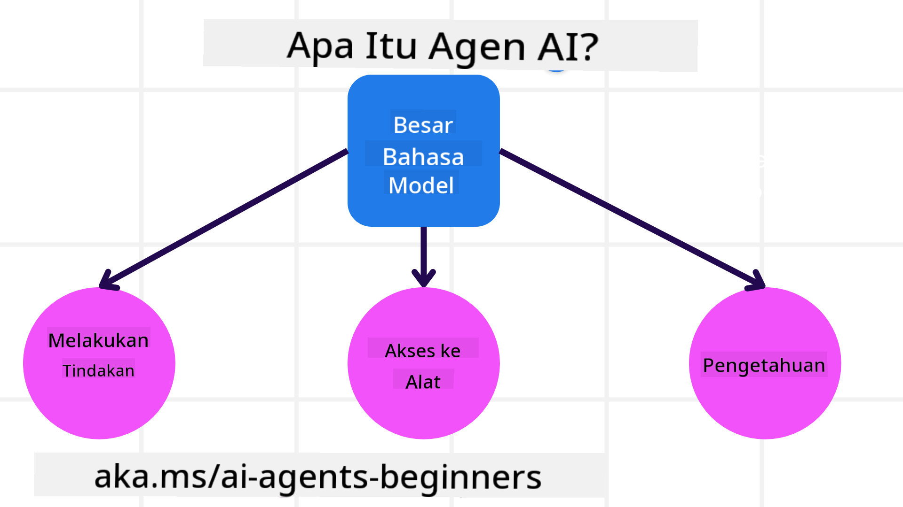
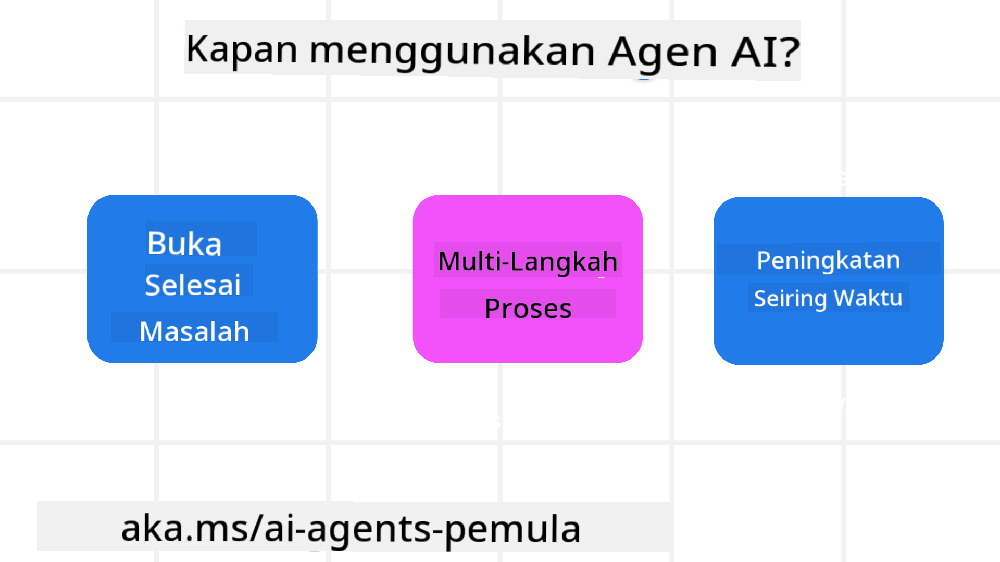

<!--
CO_OP_TRANSLATOR_METADATA:
{
  "original_hash": "d84943abc8f001ad4670418d32c2d899",
  "translation_date": "2025-07-12T08:09:47+00:00",
  "source_file": "01-intro-to-ai-agents/README.md",
  "language_code": "id"
}
-->
untuk bertemu dengan pelajar lain dan Pembuat AI Agent serta mengajukan pertanyaan apa pun yang Anda miliki tentang kursus ini.

Untuk memulai kursus ini, kita akan mulai dengan memahami lebih baik apa itu AI Agents dan bagaimana kita dapat menggunakannya dalam aplikasi dan alur kerja yang kita bangun.

## Pendahuluan

Pelajaran ini mencakup:

- Apa itu AI Agents dan apa saja jenis agen yang berbeda?
- Kasus penggunaan apa yang paling cocok untuk AI Agents dan bagaimana mereka dapat membantu kita?
- Apa saja blok bangunan dasar saat merancang Solusi Agentik?

## Tujuan Pembelajaran
Setelah menyelesaikan pelajaran ini, Anda harus dapat:

- Memahami konsep AI Agent dan bagaimana mereka berbeda dari solusi AI lainnya.
- Menerapkan AI Agents dengan cara yang paling efisien.
- Merancang solusi Agentik secara produktif untuk pengguna dan pelanggan.

## Mendefinisikan AI Agents dan Jenis AI Agents

### Apa itu AI Agents?

AI Agents adalah **sistem** yang memungkinkan **Large Language Models (LLMs)** untuk **melakukan tindakan** dengan memperluas kemampuannya dengan memberikan LLMs **akses ke alat** dan **pengetahuan**.

Mari kita uraikan definisi ini menjadi bagian-bagian yang lebih kecil:

- **Sistem** - Penting untuk memikirkan agen bukan hanya sebagai satu komponen tunggal tetapi sebagai sistem yang terdiri dari banyak komponen. Pada tingkat dasar, komponen AI Agent adalah:
  - **Lingkungan** - Ruang yang telah ditentukan tempat AI Agent beroperasi. Misalnya, jika kita memiliki AI Agent pemesanan perjalanan, lingkungannya bisa berupa sistem pemesanan perjalanan yang digunakan AI Agent untuk menyelesaikan tugas.
  - **Sensor** - Lingkungan memiliki informasi dan memberikan umpan balik. AI Agents menggunakan sensor untuk mengumpulkan dan menginterpretasikan informasi ini tentang keadaan lingkungan saat ini. Dalam contoh Travel Booking Agent, sistem pemesanan perjalanan dapat memberikan informasi seperti ketersediaan hotel atau harga penerbangan.
  - **Aktuator** - Setelah AI Agent menerima keadaan lingkungan saat ini, untuk tugas saat ini agen menentukan tindakan apa yang harus dilakukan untuk mengubah lingkungan. Untuk agen pemesanan perjalanan, mungkin tindakan tersebut adalah memesan kamar yang tersedia untuk pengguna.

**Large Language Models** - Konsep agen sudah ada sebelum pembuatan LLMs. Keuntungan membangun AI Agents dengan LLMs adalah kemampuan mereka untuk menginterpretasikan bahasa manusia dan data. Kemampuan ini memungkinkan LLMs untuk menginterpretasikan informasi lingkungan dan menentukan rencana untuk mengubah lingkungan tersebut.

**Melakukan Tindakan** - Di luar sistem AI Agent, LLMs terbatas pada situasi di mana tindakan adalah menghasilkan konten atau informasi berdasarkan permintaan pengguna. Di dalam sistem AI Agent, LLMs dapat menyelesaikan tugas dengan menginterpretasikan permintaan pengguna dan menggunakan alat yang tersedia di lingkungan mereka.

**Akses ke Alat** - Alat apa yang dapat diakses oleh LLM ditentukan oleh 1) lingkungan tempat mereka beroperasi dan 2) pengembang AI Agent. Untuk contoh agen perjalanan kita, alat agen dibatasi oleh operasi yang tersedia dalam sistem pemesanan, dan/atau pengembang dapat membatasi akses alat agen hanya untuk penerbangan.

**Memori+Pengetahuan** - Memori bisa bersifat jangka pendek dalam konteks percakapan antara pengguna dan agen. Dalam jangka panjang, di luar informasi yang disediakan oleh lingkungan, AI Agents juga dapat mengambil pengetahuan dari sistem lain, layanan, alat, dan bahkan agen lain. Dalam contoh agen perjalanan, pengetahuan ini bisa berupa informasi preferensi perjalanan pengguna yang tersimpan dalam basis data pelanggan.

### Jenis-jenis agen

Sekarang kita memiliki definisi umum tentang AI Agents, mari kita lihat beberapa jenis agen spesifik dan bagaimana mereka diterapkan pada agen pemesanan perjalanan.

| **Jenis Agen**                | **Deskripsi**                                                                                                                       | **Contoh**                                                                                                                                                                                                                   |
| ----------------------------- | ------------------------------------------------------------------------------------------------------------------------------------- | ----------------------------------------------------------------------------------------------------------------------------------------------------------------------------------------------------------------------------- |
| **Simple Reflex Agents**      | Melakukan tindakan langsung berdasarkan aturan yang telah ditentukan.                                                                 | Agen perjalanan menginterpretasikan konteks email dan meneruskan keluhan perjalanan ke layanan pelanggan.                                                                                                                    |
| **Model-Based Reflex Agents** | Melakukan tindakan berdasarkan model dunia dan perubahan pada model tersebut.                                                         | Agen perjalanan memprioritaskan rute dengan perubahan harga signifikan berdasarkan akses ke data harga historis.                                                                                                             |
| **Goal-Based Agents**         | Membuat rencana untuk mencapai tujuan tertentu dengan menginterpretasikan tujuan dan menentukan tindakan untuk mencapainya.          | Agen perjalanan memesan perjalanan dengan menentukan pengaturan perjalanan yang diperlukan (mobil, transportasi umum, penerbangan) dari lokasi saat ini ke tujuan.                                                              |
| **Utility-Based Agents**      | Mempertimbangkan preferensi dan menimbang kompromi secara numerik untuk menentukan cara mencapai tujuan.                             | Agen perjalanan memaksimalkan utilitas dengan menimbang kenyamanan versus biaya saat memesan perjalanan.                                                                                                                      |
| **Learning Agents**           | Meningkatkan kinerja seiring waktu dengan merespons umpan balik dan menyesuaikan tindakan sesuai.                                    | Agen perjalanan meningkat dengan menggunakan umpan balik pelanggan dari survei pasca-perjalanan untuk melakukan penyesuaian pada pemesanan berikutnya.                                                                        |
| **Hierarchical Agents**       | Memiliki beberapa agen dalam sistem bertingkat, dengan agen tingkat atas membagi tugas menjadi subtugas untuk agen tingkat bawah.    | Agen perjalanan membatalkan perjalanan dengan membagi tugas menjadi subtugas (misalnya, membatalkan pemesanan tertentu) dan agen tingkat bawah menyelesaikannya, kemudian melaporkan kembali ke agen tingkat atas.               |
| **Multi-Agent Systems (MAS)** | Agen menyelesaikan tugas secara independen, baik secara kooperatif maupun kompetitif.                                                | Kooperatif: Beberapa agen memesan layanan perjalanan spesifik seperti hotel, penerbangan, dan hiburan. Kompetitif: Beberapa agen mengelola dan bersaing atas kalender pemesanan hotel bersama untuk memesan pelanggan ke hotel. |

## Kapan Menggunakan AI Agents

Pada bagian sebelumnya, kita menggunakan kasus penggunaan Agen Perjalanan untuk menjelaskan bagaimana berbagai jenis agen dapat digunakan dalam skenario pemesanan perjalanan yang berbeda. Kita akan terus menggunakan aplikasi ini sepanjang kursus.

Mari kita lihat jenis kasus penggunaan yang paling cocok untuk AI Agents:

- **Masalah Terbuka** - memungkinkan LLM menentukan langkah yang diperlukan untuk menyelesaikan tugas karena tidak selalu bisa diprogram secara kaku dalam alur kerja.
- **Proses Multi-Langkah** - tugas yang memerlukan tingkat kompleksitas di mana AI Agent perlu menggunakan alat atau informasi selama beberapa langkah, bukan hanya pengambilan sekali jalan.
- **Peningkatan Seiring Waktu** - tugas di mana agen dapat meningkat seiring waktu dengan menerima umpan balik dari lingkungan atau pengguna untuk memberikan utilitas yang lebih baik.

Kita akan membahas lebih banyak pertimbangan dalam menggunakan AI Agents pada pelajaran Membangun AI Agents yang Dapat Dipercaya.

## Dasar-Dasar Solusi Agentik

### Pengembangan Agen

Langkah pertama dalam merancang sistem AI Agent adalah mendefinisikan alat, tindakan, dan perilaku. Dalam kursus ini, kita fokus menggunakan **Azure AI Agent Service** untuk mendefinisikan Agen kita. Layanan ini menawarkan fitur seperti:

- Pemilihan Model Terbuka seperti OpenAI, Mistral, dan Llama
- Penggunaan Data Berlisensi melalui penyedia seperti Tripadvisor
- Penggunaan alat OpenAPI 3.0 yang distandarisasi

### Pola Agentik

Komunikasi dengan LLM dilakukan melalui prompt. Mengingat sifat semi-otonom AI Agents, tidak selalu memungkinkan atau diperlukan untuk mem-prompt ulang LLM secara manual setelah perubahan di lingkungan. Kita menggunakan **Pola Agentik** yang memungkinkan kita mem-prompt LLM dalam beberapa langkah dengan cara yang lebih skalabel.

Kursus ini dibagi menjadi beberapa pola Agentik populer saat ini.

### Kerangka Agentik

Kerangka Agentik memungkinkan pengembang mengimplementasikan pola agentik melalui kode. Kerangka ini menawarkan template, plugin, dan alat untuk kolaborasi AI Agent yang lebih baik. Manfaat ini memberikan kemampuan untuk observabilitas dan pemecahan masalah sistem AI Agent yang lebih baik.

Dalam kursus ini, kita akan mengeksplorasi kerangka kerja AutoGen yang berbasis riset dan kerangka Agent yang siap produksi dari Semantic Kernel.

## Pelajaran Sebelumnya

[Course Setup](../00-course-setup/README.md)

## Pelajaran Selanjutnya

[Exploring Agentic Frameworks](../02-explore-agentic-frameworks/README.md)

**Penafian**:  
Dokumen ini telah diterjemahkan menggunakan layanan terjemahan AI [Co-op Translator](https://github.com/Azure/co-op-translator). Meskipun kami berupaya untuk mencapai akurasi, harap diingat bahwa terjemahan otomatis mungkin mengandung kesalahan atau ketidakakuratan. Dokumen asli dalam bahasa aslinya harus dianggap sebagai sumber yang sahih. Untuk informasi penting, disarankan menggunakan terjemahan profesional oleh manusia. Kami tidak bertanggung jawab atas kesalahpahaman atau penafsiran yang keliru yang timbul dari penggunaan terjemahan ini.