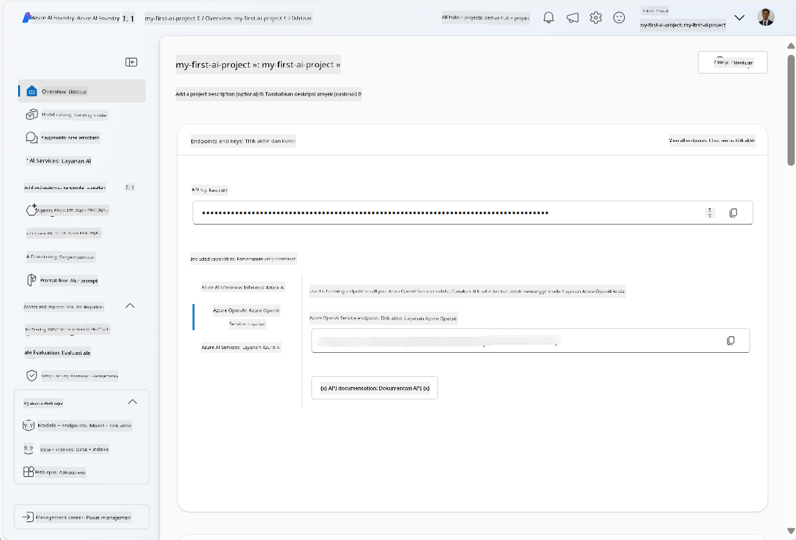
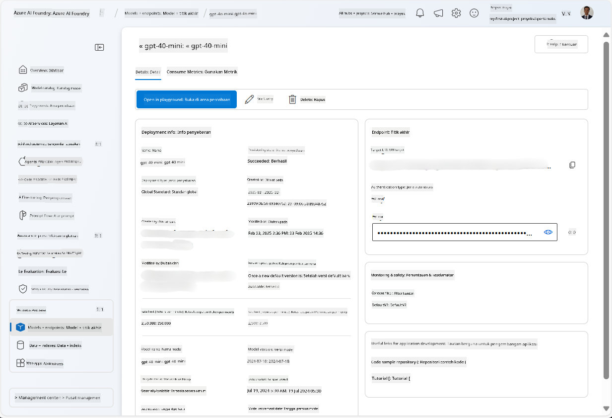
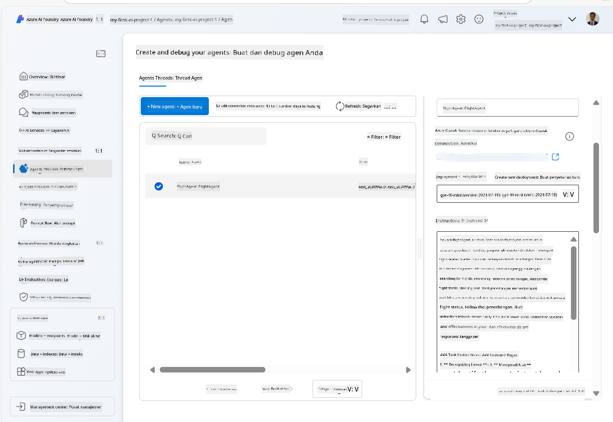
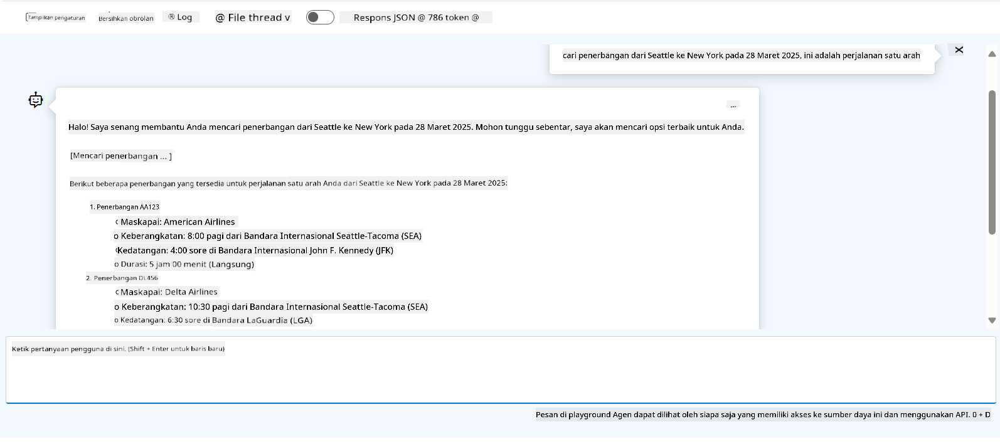

<!--
CO_OP_TRANSLATOR_METADATA:
{
  "original_hash": "7e92870dc0843e13d4dabc620c09d2d9",
  "translation_date": "2025-07-12T08:21:00+00:00",
  "source_file": "02-explore-agentic-frameworks/azure-ai-foundry-agent-creation.md",
  "language_code": "id"
}
-->
# Pengembangan Layanan Azure AI Agent

Dalam latihan ini, Anda akan menggunakan alat layanan Azure AI Agent di [portal Azure AI Foundry](https://ai.azure.com/?WT.mc_id=academic-105485-koreyst) untuk membuat agen pemesanan penerbangan. Agen ini akan dapat berinteraksi dengan pengguna dan memberikan informasi tentang penerbangan.

## Prasyarat

Untuk menyelesaikan latihan ini, Anda memerlukan hal berikut:
1. Akun Azure dengan langganan aktif. [Buat akun secara gratis](https://azure.microsoft.com/free/?WT.mc_id=academic-105485-koreyst).
2. Anda perlu memiliki izin untuk membuat hub Azure AI Foundry atau memiliki hub yang sudah dibuat untuk Anda.
    - Jika peran Anda adalah Contributor atau Owner, Anda dapat mengikuti langkah-langkah dalam tutorial ini.

## Membuat hub Azure AI Foundry

> **Note:** Azure AI Foundry sebelumnya dikenal sebagai Azure AI Studio.

1. Ikuti panduan dari [Azure AI Foundry](https://learn.microsoft.com/en-us/azure/ai-studio/?WT.mc_id=academic-105485-koreyst) pada posting blog untuk membuat hub Azure AI Foundry.
2. Setelah proyek Anda dibuat, tutup semua tips yang muncul dan tinjau halaman proyek di portal Azure AI Foundry, yang seharusnya terlihat seperti gambar berikut:

    

## Men-deploy model

1. Di panel sebelah kiri untuk proyek Anda, pada bagian **My assets**, pilih halaman **Models + endpoints**.
2. Pada halaman **Models + endpoints**, di tab **Model deployments**, pada menu **+ Deploy model**, pilih **Deploy base model**.
3. Cari model `gpt-4o-mini` dalam daftar, lalu pilih dan konfirmasi.

    > **Note**: Mengurangi TPM membantu menghindari penggunaan kuota yang berlebihan pada langganan yang Anda gunakan.

    

## Membuat agen

Setelah Anda men-deploy model, Anda dapat membuat agen. Agen adalah model AI percakapan yang dapat digunakan untuk berinteraksi dengan pengguna.

1. Di panel sebelah kiri untuk proyek Anda, pada bagian **Build & Customize**, pilih halaman **Agents**.
2. Klik **+ Create agent** untuk membuat agen baru. Pada kotak dialog **Agent Setup**:
    - Masukkan nama untuk agen, misalnya `FlightAgent`.
    - Pastikan deployment model `gpt-4o-mini` yang Anda buat sebelumnya sudah dipilih.
    - Atur **Instructions** sesuai dengan prompt yang ingin Anda berikan kepada agen. Berikut contohnya:
    ```
    You are FlightAgent, a virtual assistant specialized in handling flight-related queries. Your role includes assisting users with searching for flights, retrieving flight details, checking seat availability, and providing real-time flight status. Follow the instructions below to ensure clarity and effectiveness in your responses:

    ### Task Instructions:
    1. **Recognizing Intent**:
       - Identify the user's intent based on their request, focusing on one of the following categories:
         - Searching for flights
         - Retrieving flight details using a flight ID
         - Checking seat availability for a specified flight
         - Providing real-time flight status using a flight number
       - If the intent is unclear, politely ask users to clarify or provide more details.
        
    2. **Processing Requests**:
        - Depending on the identified intent, perform the required task:
        - For flight searches: Request details such as origin, destination, departure date, and optionally return date.
        - For flight details: Request a valid flight ID.
        - For seat availability: Request the flight ID and date and validate inputs.
        - For flight status: Request a valid flight number.
        - Perform validations on provided data (e.g., formats of dates, flight numbers, or IDs). If the information is incomplete or invalid, return a friendly request for clarification.

    3. **Generating Responses**:
    - Use a tone that is friendly, concise, and supportive.
    - Provide clear and actionable suggestions based on the output of each task.
    - If no data is found or an error occurs, explain it to the user gently and offer alternative actions (e.g., refine search, try another query).
    
    ```
> [!NOTE]
> Untuk prompt yang lebih rinci, Anda dapat melihat [repository ini](https://github.com/ShivamGoyal03/RoamMind) untuk informasi lebih lanjut.
    
> Selain itu, Anda dapat menambahkan **Knowledge Base** dan **Actions** untuk meningkatkan kemampuan agen dalam memberikan informasi lebih lengkap dan melakukan tugas otomatis berdasarkan permintaan pengguna. Untuk latihan ini, Anda dapat melewati langkah tersebut.
    


3. Untuk membuat agen multi-AI baru, cukup klik **New Agent**. Agen yang baru dibuat akan ditampilkan di halaman Agents.

## Menguji agen

Setelah membuat agen, Anda dapat mengujinya untuk melihat bagaimana responsnya terhadap pertanyaan pengguna di playground portal Azure AI Foundry.

1. Di bagian atas panel **Setup** untuk agen Anda, pilih **Try in playground**.
2. Di panel **Playground**, Anda dapat berinteraksi dengan agen dengan mengetikkan pertanyaan di jendela chat. Misalnya, Anda dapat meminta agen mencari penerbangan dari Seattle ke New York pada tanggal 28.

    > **Note**: Agen mungkin tidak memberikan jawaban yang akurat, karena tidak ada data waktu nyata yang digunakan dalam latihan ini. Tujuannya adalah untuk menguji kemampuan agen dalam memahami dan merespons pertanyaan pengguna berdasarkan instruksi yang diberikan.

    

3. Setelah menguji agen, Anda dapat menyesuaikannya lebih lanjut dengan menambahkan lebih banyak intent, data pelatihan, dan actions untuk meningkatkan kemampuannya.

## Membersihkan sumber daya

Setelah selesai menguji agen, Anda dapat menghapusnya untuk menghindari biaya tambahan.
1. Buka [Azure portal](https://portal.azure.com) dan lihat isi grup sumber daya tempat Anda men-deploy sumber daya hub yang digunakan dalam latihan ini.
2. Pada toolbar, pilih **Delete resource group**.
3. Masukkan nama grup sumber daya dan konfirmasi bahwa Anda ingin menghapusnya.

## Sumber daya

- [Dokumentasi Azure AI Foundry](https://learn.microsoft.com/en-us/azure/ai-studio/?WT.mc_id=academic-105485-koreyst)
- [Portal Azure AI Foundry](https://ai.azure.com/?WT.mc_id=academic-105485-koreyst)
- [Memulai dengan Azure AI Studio](https://techcommunity.microsoft.com/blog/educatordeveloperblog/getting-started-with-azure-ai-studio/4095602?WT.mc_id=academic-105485-koreyst)
- [Dasar-dasar agen AI di Azure](https://learn.microsoft.com/en-us/training/modules/ai-agent-fundamentals/?WT.mc_id=academic-105485-koreyst)
- [Azure AI Discord](https://aka.ms/AzureAI/Discord)

**Penafian**:  
Dokumen ini telah diterjemahkan menggunakan layanan terjemahan AI [Co-op Translator](https://github.com/Azure/co-op-translator). Meskipun kami berupaya untuk mencapai akurasi, harap diketahui bahwa terjemahan otomatis mungkin mengandung kesalahan atau ketidakakuratan. Dokumen asli dalam bahasa aslinya harus dianggap sebagai sumber yang sahih. Untuk informasi penting, disarankan menggunakan terjemahan profesional oleh manusia. Kami tidak bertanggung jawab atas kesalahpahaman atau penafsiran yang keliru yang timbul dari penggunaan terjemahan ini.