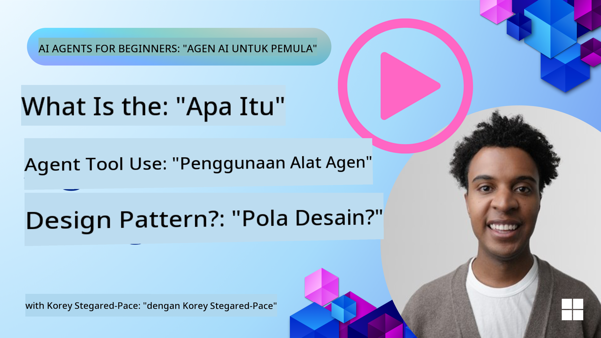
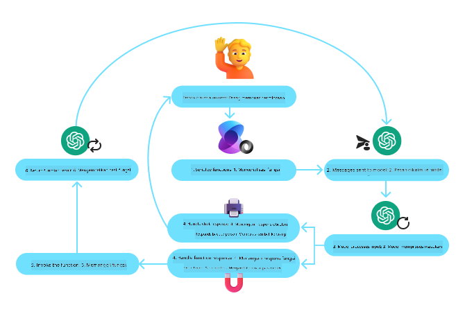
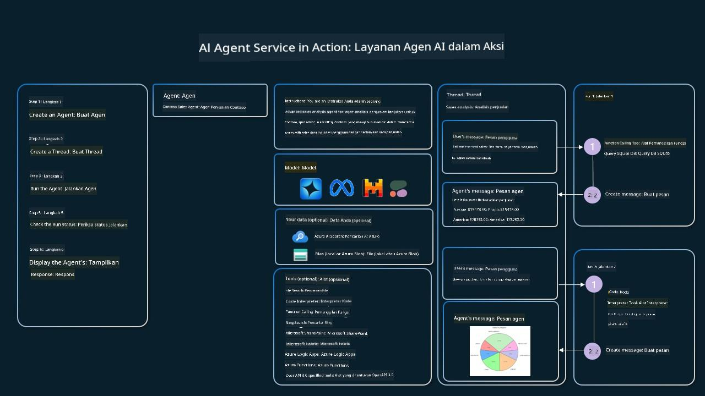

<!--
CO_OP_TRANSLATOR_METADATA:
{
  "original_hash": "88258b03f2893aa2e69eb8fb24baabbc",
  "translation_date": "2025-07-12T09:39:31+00:00",
  "source_file": "04-tool-use/README.md",
  "language_code": "id"
}
-->
[](https://youtu.be/vieRiPRx-gI?si=cEZ8ApnT6Sus9rhn)

> _(Klik gambar di atas untuk menonton video pelajaran ini)_

# Pola Desain Penggunaan Alat

Alat menarik karena memungkinkan agen AI memiliki rentang kemampuan yang lebih luas. Alih-alih agen hanya memiliki serangkaian tindakan terbatas yang bisa dilakukan, dengan menambahkan alat, agen kini dapat melakukan berbagai tindakan. Dalam bab ini, kita akan membahas Pola Desain Penggunaan Alat, yang menjelaskan bagaimana agen AI dapat menggunakan alat tertentu untuk mencapai tujuan mereka.

## Pendahuluan

Dalam pelajaran ini, kita akan mencoba menjawab pertanyaan-pertanyaan berikut:

- Apa itu pola desain penggunaan alat?
- Dalam kasus penggunaan apa pola ini dapat diterapkan?
- Apa saja elemen/komponen yang dibutuhkan untuk mengimplementasikan pola desain ini?
- Apa pertimbangan khusus dalam menggunakan Pola Desain Penggunaan Alat untuk membangun agen AI yang dapat dipercaya?

## Tujuan Pembelajaran

Setelah menyelesaikan pelajaran ini, Anda akan mampu:

- Mendefinisikan Pola Desain Penggunaan Alat dan tujuannya.
- Mengidentifikasi kasus penggunaan di mana Pola Desain Penggunaan Alat dapat diterapkan.
- Memahami elemen kunci yang dibutuhkan untuk mengimplementasikan pola desain ini.
- Mengenali pertimbangan untuk memastikan kepercayaan pada agen AI yang menggunakan pola desain ini.

## Apa itu Pola Desain Penggunaan Alat?

**Pola Desain Penggunaan Alat** berfokus pada memberikan kemampuan kepada LLM untuk berinteraksi dengan alat eksternal guna mencapai tujuan tertentu. Alat adalah kode yang dapat dijalankan oleh agen untuk melakukan tindakan. Alat bisa berupa fungsi sederhana seperti kalkulator, atau panggilan API ke layanan pihak ketiga seperti pencarian harga saham atau prakiraan cuaca. Dalam konteks agen AI, alat dirancang untuk dijalankan oleh agen sebagai respons terhadap **panggilan fungsi yang dihasilkan model**.

## Dalam kasus penggunaan apa pola ini dapat diterapkan?

Agen AI dapat memanfaatkan alat untuk menyelesaikan tugas kompleks, mengambil informasi, atau membuat keputusan. Pola desain penggunaan alat sering digunakan dalam skenario yang membutuhkan interaksi dinamis dengan sistem eksternal, seperti basis data, layanan web, atau interpreter kode. Kemampuan ini berguna untuk berbagai kasus penggunaan, termasuk:

- **Pengambilan Informasi Dinamis:** Agen dapat mengakses API eksternal atau basis data untuk mengambil data terkini (misalnya, mengquery basis data SQLite untuk analisis data, mengambil harga saham atau informasi cuaca).
- **Eksekusi dan Interpretasi Kode:** Agen dapat menjalankan kode atau skrip untuk menyelesaikan masalah matematika, membuat laporan, atau melakukan simulasi.
- **Otomatisasi Alur Kerja:** Mengotomatisasi alur kerja berulang atau multi-langkah dengan mengintegrasikan alat seperti penjadwal tugas, layanan email, atau pipeline data.
- **Dukungan Pelanggan:** Agen dapat berinteraksi dengan sistem CRM, platform tiket, atau basis pengetahuan untuk menyelesaikan pertanyaan pengguna.
- **Pembuatan dan Penyuntingan Konten:** Agen dapat memanfaatkan alat seperti pemeriksa tata bahasa, peringkas teks, atau evaluator keamanan konten untuk membantu tugas pembuatan konten.

## Apa saja elemen/komponen yang dibutuhkan untuk mengimplementasikan pola desain penggunaan alat?

Komponen-komponen ini memungkinkan agen AI melakukan berbagai tugas. Mari kita lihat elemen kunci yang dibutuhkan untuk mengimplementasikan Pola Desain Penggunaan Alat:

- **Skema Fungsi/Alat**: Definisi rinci dari alat yang tersedia, termasuk nama fungsi, tujuan, parameter yang dibutuhkan, dan output yang diharapkan. Skema ini memungkinkan LLM memahami alat apa saja yang tersedia dan bagaimana membangun permintaan yang valid.

- **Logika Eksekusi Fungsi**: Mengatur bagaimana dan kapan alat dipanggil berdasarkan niat pengguna dan konteks percakapan. Ini bisa meliputi modul perencana, mekanisme pengalihan, atau alur kondisional yang menentukan penggunaan alat secara dinamis.

- **Sistem Penanganan Pesan**: Komponen yang mengelola alur percakapan antara input pengguna, respons LLM, panggilan alat, dan output alat.

- **Kerangka Integrasi Alat**: Infrastruktur yang menghubungkan agen dengan berbagai alat, baik itu fungsi sederhana maupun layanan eksternal yang kompleks.

- **Penanganan Kesalahan & Validasi**: Mekanisme untuk menangani kegagalan eksekusi alat, memvalidasi parameter, dan mengelola respons yang tidak terduga.

- **Manajemen Status**: Melacak konteks percakapan, interaksi alat sebelumnya, dan data persisten untuk memastikan konsistensi dalam interaksi multi-putar.

Selanjutnya, mari kita lihat lebih detail tentang Panggilan Fungsi/Alat.

### Panggilan Fungsi/Alat

Panggilan fungsi adalah cara utama kita memungkinkan Large Language Models (LLM) berinteraksi dengan alat. Anda sering akan melihat istilah 'Fungsi' dan 'Alat' digunakan secara bergantian karena 'fungsi' (blok kode yang dapat digunakan ulang) adalah 'alat' yang digunakan agen untuk menjalankan tugas. Agar kode fungsi dapat dipanggil, LLM harus membandingkan permintaan pengguna dengan deskripsi fungsi. Untuk melakukan ini, sebuah skema yang berisi deskripsi semua fungsi yang tersedia dikirim ke LLM. LLM kemudian memilih fungsi yang paling sesuai untuk tugas tersebut dan mengembalikan nama serta argumennya. Fungsi yang dipilih kemudian dijalankan, responsnya dikirim kembali ke LLM, yang menggunakan informasi tersebut untuk merespons permintaan pengguna.

Untuk pengembang yang ingin mengimplementasikan panggilan fungsi untuk agen, Anda akan membutuhkan:

1. Model LLM yang mendukung panggilan fungsi
2. Skema yang berisi deskripsi fungsi
3. Kode untuk setiap fungsi yang dideskripsikan

Mari kita gunakan contoh mendapatkan waktu saat ini di sebuah kota untuk ilustrasi:

1. **Inisialisasi LLM yang mendukung panggilan fungsi:**

    Tidak semua model mendukung panggilan fungsi, jadi penting untuk memeriksa apakah LLM yang Anda gunakan mendukungnya. <a href="https://learn.microsoft.com/azure/ai-services/openai/how-to/function-calling" target="_blank">Azure OpenAI</a> mendukung panggilan fungsi. Kita bisa mulai dengan menginisialisasi klien Azure OpenAI.

    ```python
    # Initialize the Azure OpenAI client
    client = AzureOpenAI(
        azure_endpoint = os.getenv("AZURE_OPENAI_ENDPOINT"), 
        api_key=os.getenv("AZURE_OPENAI_API_KEY"),  
        api_version="2024-05-01-preview"
    )
    ```

1. **Buat Skema Fungsi**:

    Selanjutnya kita akan mendefinisikan skema JSON yang berisi nama fungsi, deskripsi apa yang dilakukan fungsi tersebut, serta nama dan deskripsi parameter fungsi.
    Skema ini kemudian akan kita berikan ke klien yang sudah dibuat sebelumnya, bersama dengan permintaan pengguna untuk mencari waktu di San Francisco. Yang penting dicatat adalah bahwa **panggilan alat** yang dikembalikan, **bukan** jawaban akhir dari pertanyaan. Seperti yang disebutkan sebelumnya, LLM mengembalikan nama fungsi yang dipilih untuk tugas tersebut, dan argumen yang akan diteruskan ke fungsi tersebut.

    ```python
    # Function description for the model to read
    tools = [
        {
            "type": "function",
            "function": {
                "name": "get_current_time",
                "description": "Get the current time in a given location",
                "parameters": {
                    "type": "object",
                    "properties": {
                        "location": {
                            "type": "string",
                            "description": "The city name, e.g. San Francisco",
                        },
                    },
                    "required": ["location"],
                },
            }
        }
    ]
    ```
   
    ```python
  
    # Initial user message
    messages = [{"role": "user", "content": "What's the current time in San Francisco"}] 
  
    # First API call: Ask the model to use the function
      response = client.chat.completions.create(
          model=deployment_name,
          messages=messages,
          tools=tools,
          tool_choice="auto",
      )
  
      # Process the model's response
      response_message = response.choices[0].message
      messages.append(response_message)
  
      print("Model's response:")  

      print(response_message)
  
    ```

    ```bash
    Model's response:
    ChatCompletionMessage(content=None, role='assistant', function_call=None, tool_calls=[ChatCompletionMessageToolCall(id='call_pOsKdUlqvdyttYB67MOj434b', function=Function(arguments='{"location":"San Francisco"}', name='get_current_time'), type='function')])
    ```
  
1. **Kode fungsi yang diperlukan untuk menjalankan tugas:**

    Setelah LLM memilih fungsi mana yang harus dijalankan, kode yang menjalankan tugas tersebut harus diimplementasikan dan dieksekusi.
    Kita dapat mengimplementasikan kode untuk mendapatkan waktu saat ini dalam Python. Kita juga perlu menulis kode untuk mengekstrak nama dan argumen dari response_message untuk mendapatkan hasil akhir.

    ```python
      def get_current_time(location):
        """Get the current time for a given location"""
        print(f"get_current_time called with location: {location}")  
        location_lower = location.lower()
        
        for key, timezone in TIMEZONE_DATA.items():
            if key in location_lower:
                print(f"Timezone found for {key}")  
                current_time = datetime.now(ZoneInfo(timezone)).strftime("%I:%M %p")
                return json.dumps({
                    "location": location,
                    "current_time": current_time
                })
      
        print(f"No timezone data found for {location_lower}")  
        return json.dumps({"location": location, "current_time": "unknown"})
    ```

    ```python
     # Handle function calls
      if response_message.tool_calls:
          for tool_call in response_message.tool_calls:
              if tool_call.function.name == "get_current_time":
     
                  function_args = json.loads(tool_call.function.arguments)
     
                  time_response = get_current_time(
                      location=function_args.get("location")
                  )
     
                  messages.append({
                      "tool_call_id": tool_call.id,
                      "role": "tool",
                      "name": "get_current_time",
                      "content": time_response,
                  })
      else:
          print("No tool calls were made by the model.")  
  
      # Second API call: Get the final response from the model
      final_response = client.chat.completions.create(
          model=deployment_name,
          messages=messages,
      )
  
      return final_response.choices[0].message.content
     ```

    ```bash
      get_current_time called with location: San Francisco
      Timezone found for san francisco
      The current time in San Francisco is 09:24 AM.
     ```

Panggilan Fungsi adalah inti dari sebagian besar, jika tidak semua, desain penggunaan alat agen, namun mengimplementasikannya dari awal terkadang bisa menantang.
Seperti yang kita pelajari di [Pelajaran 2](../../../02-explore-agentic-frameworks), kerangka kerja agentic menyediakan blok bangunan yang sudah jadi untuk mengimplementasikan penggunaan alat.

## Contoh Penggunaan Alat dengan Kerangka Kerja Agentic

Berikut beberapa contoh bagaimana Anda dapat mengimplementasikan Pola Desain Penggunaan Alat menggunakan berbagai kerangka kerja agentic:

### Semantic Kernel

<a href="https://learn.microsoft.com/azure/ai-services/agents/overview" target="_blank">Semantic Kernel</a> adalah kerangka kerja AI open-source untuk pengembang .NET, Python, dan Java yang bekerja dengan Large Language Models (LLM). Kerangka ini mempermudah proses penggunaan panggilan fungsi dengan secara otomatis mendeskripsikan fungsi dan parameter Anda ke model melalui proses yang disebut <a href="https://learn.microsoft.com/semantic-kernel/concepts/ai-services/chat-completion/function-calling/?pivots=programming-language-python#1-serializing-the-functions" target="_blank">serialisasi</a>. Semantic Kernel juga menangani komunikasi bolak-balik antara model dan kode Anda. Keuntungan lain menggunakan kerangka kerja agentic seperti Semantic Kernel adalah Anda dapat mengakses alat yang sudah jadi seperti <a href="https://github.com/microsoft/semantic-kernel/blob/main/python/samples/getting_started_with_agents/openai_assistant/step4_assistant_tool_file_search.py" target="_blank">Pencarian File</a> dan <a href="https://github.com/microsoft/semantic-kernel/blob/main/python/samples/getting_started_with_agents/openai_assistant/step3_assistant_tool_code_interpreter.py" target="_blank">Interpreter Kode</a>.

Diagram berikut menggambarkan proses panggilan fungsi dengan Semantic Kernel:



Dalam Semantic Kernel, fungsi/alat disebut <a href="https://learn.microsoft.com/semantic-kernel/concepts/plugins/?pivots=programming-language-python" target="_blank">Plugin</a>. Kita dapat mengubah fungsi `get_current_time` yang kita lihat sebelumnya menjadi plugin dengan mengubahnya menjadi kelas yang berisi fungsi tersebut. Kita juga dapat mengimpor dekorator `kernel_function`, yang menerima deskripsi fungsi. Ketika Anda membuat kernel dengan GetCurrentTimePlugin, kernel secara otomatis akan melakukan serialisasi fungsi dan parameternya, membuat skema untuk dikirim ke LLM dalam prosesnya.

```python
from semantic_kernel.functions import kernel_function

class GetCurrentTimePlugin:
    async def __init__(self, location):
        self.location = location

    @kernel_function(
        description="Get the current time for a given location"
    )
    def get_current_time(location: str = ""):
        ...

```

```python 
from semantic_kernel import Kernel

# Create the kernel
kernel = Kernel()

# Create the plugin
get_current_time_plugin = GetCurrentTimePlugin(location)

# Add the plugin to the kernel
kernel.add_plugin(get_current_time_plugin)
```
  
### Azure AI Agent Service

<a href="https://learn.microsoft.com/azure/ai-services/agents/overview" target="_blank">Azure AI Agent Service</a> adalah kerangka kerja agentic terbaru yang dirancang untuk memberdayakan pengembang membangun, menerapkan, dan menskalakan agen AI berkualitas tinggi dan dapat diperluas secara aman tanpa perlu mengelola sumber daya komputasi dan penyimpanan secara langsung. Ini sangat berguna untuk aplikasi perusahaan karena merupakan layanan yang sepenuhnya dikelola dengan keamanan tingkat perusahaan.

Dibandingkan dengan pengembangan langsung menggunakan API LLM, Azure AI Agent Service menawarkan beberapa keunggulan, termasuk:

- Panggilan alat otomatis – tidak perlu mengurai panggilan alat, menjalankan alat, dan menangani respons; semua ini dilakukan di sisi server
- Data yang dikelola dengan aman – alih-alih mengelola status percakapan sendiri, Anda dapat mengandalkan threads untuk menyimpan semua informasi yang dibutuhkan
- Alat siap pakai – Alat yang dapat Anda gunakan untuk berinteraksi dengan sumber data Anda, seperti Bing, Azure AI Search, dan Azure Functions.

Alat yang tersedia di Azure AI Agent Service dapat dibagi menjadi dua kategori:

1. Alat Pengetahuan:
    - <a href="https://learn.microsoft.com/azure/ai-services/agents/how-to/tools/bing-grounding?tabs=python&pivots=overview" target="_blank">Grounding dengan Bing Search</a>
    - <a href="https://learn.microsoft.com/azure/ai-services/agents/how-to/tools/file-search?tabs=python&pivots=overview" target="_blank">Pencarian File</a>
    - <a href="https://learn.microsoft.com/azure/ai-services/agents/how-to/tools/azure-ai-search?tabs=azurecli%2Cpython&pivots=overview-azure-ai-search" target="_blank">Azure AI Search</a>

2. Alat Aksi:
    - <a href="https://learn.microsoft.com/azure/ai-services/agents/how-to/tools/function-calling?tabs=python&pivots=overview" target="_blank">Panggilan Fungsi</a>
    - <a href="https://learn.microsoft.com/azure/ai-services/agents/how-to/tools/code-interpreter?tabs=python&pivots=overview" target="_blank">Interpreter Kode</a>
    - <a href="https://learn.microsoft.com/azure/ai-services/agents/how-to/tools/openapi-spec?tabs=python&pivots=overview" target="_blank">Alat yang didefinisikan OpenAI</a>
    - <a href="https://learn.microsoft.com/azure/ai-services/agents/how-to/tools/azure-functions?pivots=overview" target="_blank">Azure Functions</a>

Agent Service memungkinkan kita menggunakan alat-alat ini bersama sebagai sebuah `toolset`. Layanan ini juga memanfaatkan `threads` yang melacak riwayat pesan dari percakapan tertentu.

Bayangkan Anda adalah agen penjualan di sebuah perusahaan bernama Contoso. Anda ingin mengembangkan agen percakapan yang dapat menjawab pertanyaan tentang data penjualan Anda.

Gambar berikut menggambarkan bagaimana Anda dapat menggunakan Azure AI Agent Service untuk menganalisis data penjualan Anda:



Untuk menggunakan alat-alat ini dengan layanan tersebut, kita dapat membuat klien dan mendefinisikan alat atau toolset. Untuk mengimplementasikannya secara praktis, kita dapat menggunakan kode Python berikut. LLM akan dapat melihat toolset dan memutuskan apakah akan menggunakan fungsi yang dibuat pengguna, `fetch_sales_data_using_sqlite_query`, atau Code Interpreter yang sudah jadi, tergantung pada permintaan pengguna.

```python 
import os
from azure.ai.projects import AIProjectClient
from azure.identity import DefaultAzureCredential
from fecth_sales_data_functions import fetch_sales_data_using_sqlite_query # fetch_sales_data_using_sqlite_query function which can be found in a fetch_sales_data_functions.py file.
from azure.ai.projects.models import ToolSet, FunctionTool, CodeInterpreterTool

project_client = AIProjectClient.from_connection_string(
    credential=DefaultAzureCredential(),
    conn_str=os.environ["PROJECT_CONNECTION_STRING"],
)

# Initialize function calling agent with the fetch_sales_data_using_sqlite_query function and adding it to the toolset
fetch_data_function = FunctionTool(fetch_sales_data_using_sqlite_query)
toolset = ToolSet()
toolset.add(fetch_data_function)

# Initialize Code Interpreter tool and adding it to the toolset. 
code_interpreter = code_interpreter = CodeInterpreterTool()
toolset = ToolSet()
toolset.add(code_interpreter)

agent = project_client.agents.create_agent(
    model="gpt-4o-mini", name="my-agent", instructions="You are helpful agent", 
    toolset=toolset
)
```

## Apa pertimbangan khusus dalam menggunakan Pola Desain Penggunaan Alat untuk membangun agen AI yang dapat dipercaya?

Kekhawatiran umum terkait SQL yang dihasilkan secara dinamis oleh LLM adalah keamanan, terutama risiko injeksi SQL atau tindakan berbahaya seperti menghapus atau merusak basis data. Meskipun kekhawatiran ini valid, hal tersebut dapat diatasi secara efektif dengan mengonfigurasi izin akses basis data dengan benar. Untuk sebagian besar basis data, ini melibatkan pengaturan basis data dalam mode baca-saja. Untuk layanan basis data seperti PostgreSQL atau Azure SQL, aplikasi harus diberikan peran baca-saja (SELECT).

Menjalankan aplikasi di lingkungan yang aman semakin meningkatkan perlindungan. Dalam skenario perusahaan, data biasanya diekstrak dan diubah dari sistem operasional ke basis data baca-saja atau gudang data dengan skema yang ramah pengguna. Pendekatan ini memastikan data aman, dioptimalkan untuk performa dan aksesibilitas, serta aplikasi memiliki akses terbatas dan hanya baca.

## Sumber Daya Tambahan

-
<a href="https://microsoft.github.io/build-your-first-agent-with-azure-ai-agent-service-workshop/" target="_blank">
Azure AI Agents Service Workshop</a>  
- <a href="https://github.com/Azure-Samples/contoso-creative-writer/tree/main/docs/workshop" target="_blank">Contoso Creative Writer Multi-Agent Workshop</a>  
- <a href="https://learn.microsoft.com/semantic-kernel/concepts/ai-services/chat-completion/function-calling/?pivots=programming-language-python#1-serializing-the-functions" target="_blank">Tutorial Pemanggilan Fungsi Semantic Kernel</a>  
- <a href="https://github.com/microsoft/semantic-kernel/blob/main/python/samples/getting_started_with_agents/openai_assistant/step3_assistant_tool_code_interpreter.py" target="_blank">Semantic Kernel Code Interpreter</a>  
- <a href="https://microsoft.github.io/autogen/dev/user-guide/core-user-guide/components/tools.html" target="_blank">Autogen Tools</a>  

## Pelajaran Sebelumnya

[Memahami Pola Desain Agentik](../03-agentic-design-patterns/README.md)  

## Pelajaran Selanjutnya

[Agentic RAG](../05-agentic-rag/README.md)

**Penafian**:  
Dokumen ini telah diterjemahkan menggunakan layanan terjemahan AI [Co-op Translator](https://github.com/Azure/co-op-translator). Meskipun kami berupaya untuk mencapai akurasi, harap diperhatikan bahwa terjemahan otomatis mungkin mengandung kesalahan atau ketidakakuratan. Dokumen asli dalam bahasa aslinya harus dianggap sebagai sumber yang sahih. Untuk informasi penting, disarankan menggunakan terjemahan profesional oleh manusia. Kami tidak bertanggung jawab atas kesalahpahaman atau penafsiran yang keliru yang timbul dari penggunaan terjemahan ini.