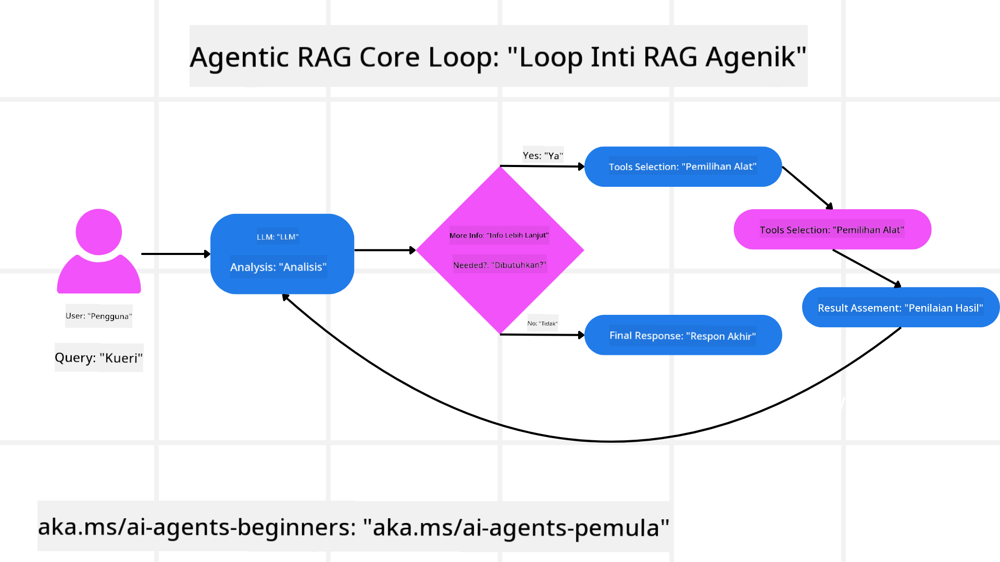
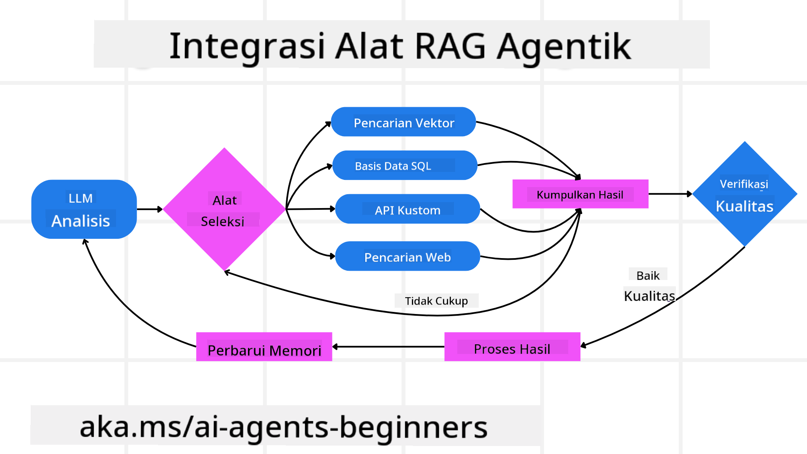
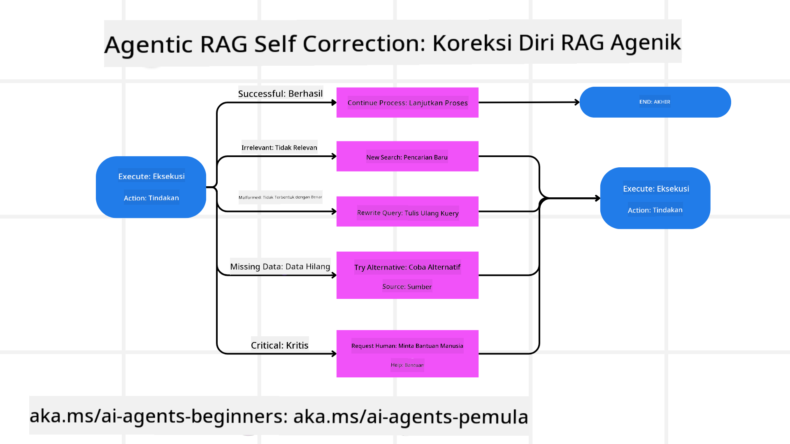
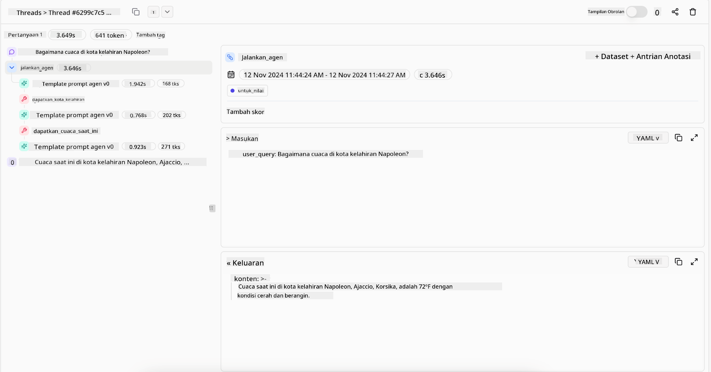
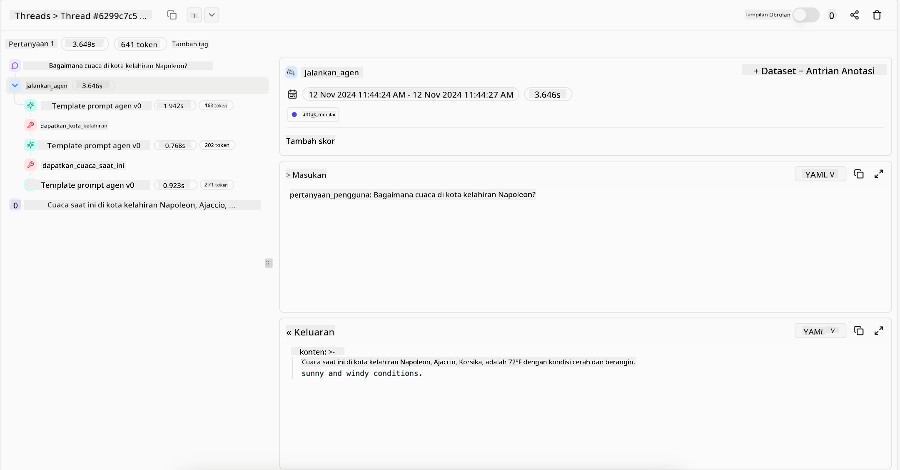

<!--
CO_OP_TRANSLATOR_METADATA:
{
  "original_hash": "7622aa72f9e676e593339f5f694ecd7d",
  "translation_date": "2025-07-12T10:08:11+00:00",
  "source_file": "05-agentic-rag/README.md",
  "language_code": "id"
}
-->

> _(Klik gambar di atas untuk menonton video pelajaran ini)_

# Agentic RAG

Pelajaran ini memberikan gambaran menyeluruh tentang Agentic Retrieval-Augmented Generation (Agentic RAG), sebuah paradigma AI yang sedang berkembang di mana model bahasa besar (LLM) secara mandiri merencanakan langkah selanjutnya sambil mengambil informasi dari sumber eksternal. Berbeda dengan pola statis pengambilan lalu membaca, Agentic RAG melibatkan panggilan iteratif ke LLM, diselingi dengan panggilan alat atau fungsi serta output terstruktur. Sistem mengevaluasi hasil, menyempurnakan kueri, memanggil alat tambahan jika diperlukan, dan melanjutkan siklus ini hingga solusi yang memuaskan tercapai.

## Pendahuluan

Pelajaran ini akan membahas

- **Memahami Agentic RAG:** Pelajari tentang paradigma AI yang sedang berkembang di mana model bahasa besar (LLM) secara mandiri merencanakan langkah selanjutnya sambil mengambil informasi dari sumber data eksternal.
- **Memahami Gaya Iteratif Maker-Checker:** Pahami siklus panggilan iteratif ke LLM, diselingi dengan panggilan alat atau fungsi dan output terstruktur, yang dirancang untuk meningkatkan ketepatan dan menangani kueri yang tidak tepat.
- **Mengeksplorasi Aplikasi Praktis:** Identifikasi skenario di mana Agentic RAG unggul, seperti lingkungan yang mengutamakan ketepatan, interaksi database kompleks, dan alur kerja yang panjang.

## Tujuan Pembelajaran

Setelah menyelesaikan pelajaran ini, Anda akan mengetahui/memahami:

- **Memahami Agentic RAG:** Pelajari tentang paradigma AI yang sedang berkembang di mana model bahasa besar (LLM) secara mandiri merencanakan langkah selanjutnya sambil mengambil informasi dari sumber data eksternal.
- **Gaya Iteratif Maker-Checker:** Pahami konsep siklus panggilan iteratif ke LLM, diselingi dengan panggilan alat atau fungsi dan output terstruktur, yang dirancang untuk meningkatkan ketepatan dan menangani kueri yang tidak tepat.
- **Menguasai Proses Penalaran:** Pahami kemampuan sistem untuk menguasai proses penalarannya sendiri, membuat keputusan tentang cara mendekati masalah tanpa bergantung pada jalur yang telah ditentukan sebelumnya.
- **Alur Kerja:** Pahami bagaimana model agentic secara mandiri memutuskan untuk mengambil laporan tren pasar, mengidentifikasi data pesaing, mengkorelasikan metrik penjualan internal, mensintesis temuan, dan mengevaluasi strategi.
- **Siklus Iteratif, Integrasi Alat, dan Memori:** Pelajari tentang ketergantungan sistem pada pola interaksi berulang, mempertahankan status dan memori di setiap langkah untuk menghindari siklus berulang dan membuat keputusan yang lebih tepat.
- **Menangani Mode Kegagalan dan Koreksi Diri:** Jelajahi mekanisme koreksi diri yang kuat dari sistem, termasuk iterasi dan pengulangan kueri, menggunakan alat diagnostik, dan mengandalkan pengawasan manusia.
- **Batasan Agensi:** Pahami keterbatasan Agentic RAG, dengan fokus pada otonomi domain-spesifik, ketergantungan infrastruktur, dan penghormatan terhadap batasan.
- **Kasus Penggunaan dan Nilai Praktis:** Identifikasi skenario di mana Agentic RAG unggul, seperti lingkungan yang mengutamakan ketepatan, interaksi database kompleks, dan alur kerja yang panjang.
- **Tata Kelola, Transparansi, dan Kepercayaan:** Pelajari pentingnya tata kelola dan transparansi, termasuk penalaran yang dapat dijelaskan, kontrol bias, dan pengawasan manusia.

## Apa itu Agentic RAG?

Agentic Retrieval-Augmented Generation (Agentic RAG) adalah paradigma AI yang sedang berkembang di mana model bahasa besar (LLM) secara mandiri merencanakan langkah selanjutnya sambil mengambil informasi dari sumber eksternal. Berbeda dengan pola statis pengambilan lalu membaca, Agentic RAG melibatkan panggilan iteratif ke LLM, diselingi dengan panggilan alat atau fungsi serta output terstruktur. Sistem mengevaluasi hasil, menyempurnakan kueri, memanggil alat tambahan jika diperlukan, dan melanjutkan siklus ini hingga solusi yang memuaskan tercapai. Gaya “maker-checker” iteratif ini meningkatkan ketepatan, menangani kueri yang tidak tepat, dan memastikan hasil berkualitas tinggi.

Sistem secara aktif menguasai proses penalarannya, menulis ulang kueri yang gagal, memilih metode pengambilan yang berbeda, dan mengintegrasikan berbagai alat—seperti pencarian vektor di Azure AI Search, database SQL, atau API kustom—sebelum menyelesaikan jawabannya. Kualitas pembeda dari sistem agentic adalah kemampuannya untuk menguasai proses penalarannya sendiri. Implementasi RAG tradisional bergantung pada jalur yang telah ditentukan sebelumnya, tetapi sistem agentic secara mandiri menentukan urutan langkah berdasarkan kualitas informasi yang ditemukan.

## Mendefinisikan Agentic Retrieval-Augmented Generation (Agentic RAG)

Agentic Retrieval-Augmented Generation (Agentic RAG) adalah paradigma yang sedang berkembang dalam pengembangan AI di mana LLM tidak hanya mengambil informasi dari sumber data eksternal tetapi juga secara mandiri merencanakan langkah selanjutnya. Berbeda dengan pola statis pengambilan lalu membaca atau urutan prompt yang disusun dengan hati-hati, Agentic RAG melibatkan siklus panggilan iteratif ke LLM, diselingi dengan panggilan alat atau fungsi serta output terstruktur. Pada setiap langkah, sistem mengevaluasi hasil yang diperoleh, memutuskan apakah perlu menyempurnakan kueri, memanggil alat tambahan jika diperlukan, dan melanjutkan siklus ini hingga mencapai solusi yang memuaskan.

Gaya operasi “maker-checker” iteratif ini dirancang untuk meningkatkan ketepatan, menangani kueri yang tidak tepat ke database terstruktur (misalnya NL2SQL), dan memastikan hasil yang seimbang dan berkualitas tinggi. Alih-alih hanya mengandalkan rantai prompt yang dirancang dengan cermat, sistem secara aktif menguasai proses penalarannya. Sistem dapat menulis ulang kueri yang gagal, memilih metode pengambilan yang berbeda, dan mengintegrasikan berbagai alat—seperti pencarian vektor di Azure AI Search, database SQL, atau API kustom—sebelum menyelesaikan jawabannya. Ini menghilangkan kebutuhan akan kerangka orkestrasi yang terlalu kompleks. Sebagai gantinya, siklus sederhana “panggilan LLM → penggunaan alat → panggilan LLM → …” dapat menghasilkan output yang canggih dan berdasar kuat.

## Menguasai Proses Penalaran

Kualitas pembeda yang membuat sebuah sistem “agentic” adalah kemampuannya untuk menguasai proses penalarannya sendiri. Implementasi RAG tradisional sering bergantung pada manusia yang menentukan jalur untuk model: rantai pemikiran yang menguraikan apa yang harus diambil dan kapan.
Namun ketika sebuah sistem benar-benar agentic, ia secara internal memutuskan bagaimana mendekati masalah. Sistem ini tidak hanya menjalankan skrip; ia secara mandiri menentukan urutan langkah berdasarkan kualitas informasi yang ditemukan.
Misalnya, jika diminta membuat strategi peluncuran produk, sistem tidak hanya mengandalkan prompt yang menjelaskan seluruh alur riset dan pengambilan keputusan. Sebaliknya, model agentic secara mandiri memutuskan untuk:

1. Mengambil laporan tren pasar terkini menggunakan Bing Web Grounding
2. Mengidentifikasi data pesaing yang relevan menggunakan Azure AI Search.
3. Mengkorelasikan metrik penjualan internal historis menggunakan Azure SQL Database.
4. Mensintesis temuan menjadi strategi yang terpadu yang diorkestrasi melalui Azure OpenAI Service.
5. Mengevaluasi strategi untuk menemukan celah atau inkonsistensi, dan melakukan pengambilan ulang jika perlu.
Semua langkah ini—menyempurnakan kueri, memilih sumber, mengulangi hingga “puas” dengan jawaban—diputuskan oleh model, bukan disusun sebelumnya oleh manusia.

## Siklus Iteratif, Integrasi Alat, dan Memori

Sistem agentic bergantung pada pola interaksi berulang:

- **Panggilan Awal:** Tujuan pengguna (alias prompt pengguna) disampaikan ke LLM.
- **Pemanggilan Alat:** Jika model mengidentifikasi informasi yang hilang atau instruksi yang ambigu, ia memilih alat atau metode pengambilan—seperti kueri database vektor (misalnya Azure AI Search Hybrid search atas data pribadi) atau panggilan SQL terstruktur—untuk mengumpulkan konteks lebih lanjut.
- **Penilaian & Penyempurnaan:** Setelah meninjau data yang dikembalikan, model memutuskan apakah informasi sudah cukup. Jika belum, model menyempurnakan kueri, mencoba alat lain, atau menyesuaikan pendekatannya.
- **Ulangi Hingga Puas:** Siklus ini berlanjut sampai model menentukan bahwa ia memiliki kejelasan dan bukti yang cukup untuk memberikan jawaban akhir yang terperinci.
- **Memori & Status:** Karena sistem mempertahankan status dan memori di setiap langkah, ia dapat mengingat upaya sebelumnya dan hasilnya, menghindari siklus berulang, dan membuat keputusan yang lebih tepat saat melanjutkan.

Seiring waktu, ini menciptakan rasa pemahaman yang berkembang, memungkinkan model menavigasi tugas kompleks berlapis tanpa perlu intervensi manusia yang terus-menerus atau mengubah prompt.

## Menangani Mode Kegagalan dan Koreksi Diri

Otonomi Agentic RAG juga melibatkan mekanisme koreksi diri yang kuat. Ketika sistem menemui jalan buntu—seperti mengambil dokumen yang tidak relevan atau menghadapi kueri yang tidak tepat—ia dapat:

- **Iterasi dan Pengulangan Kueri:** Alih-alih mengembalikan respons bernilai rendah, model mencoba strategi pencarian baru, menulis ulang kueri database, atau melihat set data alternatif.
- **Menggunakan Alat Diagnostik:** Sistem dapat memanggil fungsi tambahan yang dirancang untuk membantu memeriksa langkah penalarannya atau mengonfirmasi ketepatan data yang diambil. Alat seperti Azure AI Tracing penting untuk memungkinkan observabilitas dan pemantauan yang kuat.
- **Mengandalkan Pengawasan Manusia:** Untuk skenario berisiko tinggi atau yang sering gagal, model mungkin menandai ketidakpastian dan meminta panduan manusia. Setelah manusia memberikan umpan balik korektif, model dapat mengintegrasikan pelajaran tersebut ke depan.

Pendekatan iteratif dan dinamis ini memungkinkan model terus meningkat, memastikan bahwa sistem ini bukan hanya sekali jalan tetapi belajar dari kesalahan selama sesi berlangsung.

## Batasan Agensi

Meskipun memiliki otonomi dalam sebuah tugas, Agentic RAG tidak sama dengan Artificial General Intelligence. Kemampuan “agentic”nya terbatas pada alat, sumber data, dan kebijakan yang disediakan oleh pengembang manusia. Sistem ini tidak dapat menciptakan alatnya sendiri atau melampaui batas domain yang telah ditetapkan. Sebaliknya, sistem ini unggul dalam mengorkestrasi sumber daya yang ada secara dinamis.
Perbedaan utama dengan bentuk AI yang lebih maju meliputi:

1. **Otonomi Domain-Spesifik:** Sistem Agentic RAG fokus pada pencapaian tujuan yang ditetapkan pengguna dalam domain yang dikenal, menggunakan strategi seperti penulisan ulang kueri atau pemilihan alat untuk meningkatkan hasil.
2. **Bergantung pada Infrastruktur:** Kemampuan sistem bergantung pada alat dan data yang diintegrasikan oleh pengembang. Sistem tidak dapat melampaui batas ini tanpa intervensi manusia.
3. **Menghormati Batasan:** Pedoman etika, aturan kepatuhan, dan kebijakan bisnis tetap sangat penting. Kebebasan agen selalu dibatasi oleh langkah-langkah keamanan dan mekanisme pengawasan (semoga?).

## Kasus Penggunaan dan Nilai Praktis

Agentic RAG unggul dalam skenario yang membutuhkan penyempurnaan iteratif dan presisi:

1. **Lingkungan yang Mengutamakan Ketepatan:** Dalam pemeriksaan kepatuhan, analisis regulasi, atau riset hukum, model agentic dapat berulang kali memverifikasi fakta, berkonsultasi dengan berbagai sumber, dan menulis ulang kueri hingga menghasilkan jawaban yang benar-benar terverifikasi.
2. **Interaksi Database Kompleks:** Saat berhadapan dengan data terstruktur di mana kueri sering gagal atau perlu penyesuaian, sistem dapat secara mandiri menyempurnakan kueri menggunakan Azure SQL atau Microsoft Fabric OneLake, memastikan pengambilan akhir sesuai dengan maksud pengguna.
3. **Alur Kerja yang Panjang:** Sesi yang berjalan lama mungkin berkembang seiring munculnya informasi baru. Agentic RAG dapat terus menggabungkan data baru, mengubah strategi saat mempelajari lebih banyak tentang ruang masalah.

## Tata Kelola, Transparansi, dan Kepercayaan

Seiring sistem ini menjadi lebih otonom dalam penalarannya, tata kelola dan transparansi menjadi sangat penting:

- **Penalaran yang Dapat Dijelaskan:** Model dapat menyediakan jejak audit dari kueri yang dibuat, sumber yang dikonsultasikan, dan langkah penalaran yang diambil untuk mencapai kesimpulan. Alat seperti Azure AI Content Safety dan Azure AI Tracing / GenAIOps dapat membantu menjaga transparansi dan mengurangi risiko.
- **Kontrol Bias dan Pengambilan Data Seimbang:** Pengembang dapat mengatur strategi pengambilan untuk memastikan sumber data yang seimbang dan representatif dipertimbangkan, serta secara rutin mengaudit output untuk mendeteksi bias atau pola yang miring menggunakan model kustom untuk organisasi data science tingkat lanjut yang menggunakan Azure Machine Learning.
- **Pengawasan Manusia dan Kepatuhan:** Untuk tugas sensitif, tinjauan manusia tetap penting. Agentic RAG tidak menggantikan penilaian manusia dalam keputusan berisiko tinggi—melainkan memperkuatnya dengan memberikan opsi yang lebih terverifikasi.

Memiliki alat yang menyediakan catatan tindakan yang jelas sangat penting. Tanpa itu, debugging proses multi-langkah bisa sangat sulit. Lihat contoh berikut dari Literal AI (perusahaan di balik Chainlit) untuk sebuah Agent run:

## Kesimpulan

Agentic RAG mewakili evolusi alami dalam cara sistem AI menangani tugas kompleks yang intensif data. Dengan mengadopsi pola interaksi berulang, secara mandiri memilih alat, dan menyempurnakan kueri hingga mencapai hasil berkualitas tinggi, sistem ini melampaui pengikut prompt statis menjadi pengambil keputusan yang lebih adaptif dan sadar konteks. Meskipun masih dibatasi oleh infrastruktur dan pedoman etika yang ditetapkan manusia, kemampuan agentic ini memungkinkan interaksi AI yang lebih kaya, dinamis, dan pada akhirnya lebih berguna bagi perusahaan dan pengguna akhir.

## Sumber Daya Tambahan

- <a href="https://learn.microsoft.com/training/modules/use-own-data-azure-openai" target="_blank">Implement Retrieval Augmented Generation (RAG) with Azure OpenAI Service: Pelajari cara menggunakan data Anda sendiri dengan Azure OpenAI Service. Modul Microsoft Learn ini menyediakan panduan lengkap tentang implementasi RAG

- <a href="https://learn.microsoft.com/azure/ai-studio/concepts/evaluation-approach-gen-ai" target="_blank">Evaluasi aplikasi generative AI dengan Azure AI Foundry: Artikel ini membahas evaluasi dan perbandingan model pada dataset yang tersedia untuk umum, termasuk aplikasi Agentic AI dan arsitektur RAG</a>
- <a href="https://weaviate.io/blog/what-is-agentic-rag" target="_blank">Apa itu Agentic RAG | Weaviate</a>
- <a href="https://ragaboutit.com/agentic-rag-a-complete-guide-to-agent-based-retrieval-augmented-generation/" target="_blank">Agentic RAG: Panduan Lengkap untuk Agent-Based Retrieval Augmented Generation – Berita dari generasi RAG</a>
- <a href="https://huggingface.co/learn/cookbook/agent_rag" target="_blank">Agentic RAG: tingkatkan RAG Anda dengan reformulasi kueri dan self-query! Hugging Face Open-Source AI Cookbook</a>
- <a href="https://youtu.be/aQ4yQXeB1Ss?si=2HUqBzHoeB5tR04U" target="_blank">Menambahkan Lapisan Agentic ke RAG</a>
- <a href="https://www.youtube.com/watch?v=zeAyuLc_f3Q&t=244s" target="_blank">Masa Depan Asisten Pengetahuan: Jerry Liu</a>
- <a href="https://www.youtube.com/watch?v=AOSjiXP1jmQ" target="_blank">Cara Membangun Sistem Agentic RAG</a>
- <a href="https://ignite.microsoft.com/sessions/BRK102?source=sessions" target="_blank">Menggunakan Azure AI Foundry Agent Service untuk memperluas agen AI Anda</a>

### Makalah Akademik

- <a href="https://arxiv.org/abs/2303.17651" target="_blank">2303.17651 Self-Refine: Penyempurnaan Iteratif dengan Umpan Balik Diri</a>
- <a href="https://arxiv.org/abs/2303.11366" target="_blank">2303.11366 Reflexion: Agen Bahasa dengan Pembelajaran Penguatan Verbal</a>
- <a href="https://arxiv.org/abs/2305.11738" target="_blank">2305.11738 CRITIC: Large Language Models Dapat Memperbaiki Diri dengan Kritik Interaktif Alat</a>
- <a href="https://arxiv.org/abs/2501.09136" target="_blank">2501.09136 Agentic Retrieval-Augmented Generation: Survei tentang Agentic RAG</a>

## Pelajaran Sebelumnya

[Tool Use Design Pattern](../04-tool-use/README.md)

## Pelajaran Selanjutnya

[Building Trustworthy AI Agents](../06-building-trustworthy-agents/README.md)

**Penafian**:  
Dokumen ini telah diterjemahkan menggunakan layanan terjemahan AI [Co-op Translator](https://github.com/Azure/co-op-translator). Meskipun kami berupaya untuk akurasi, harap diketahui bahwa terjemahan otomatis mungkin mengandung kesalahan atau ketidakakuratan. Dokumen asli dalam bahasa aslinya harus dianggap sebagai sumber yang sah. Untuk informasi penting, disarankan menggunakan terjemahan profesional oleh manusia. Kami tidak bertanggung jawab atas kesalahpahaman atau penafsiran yang keliru yang timbul dari penggunaan terjemahan ini.