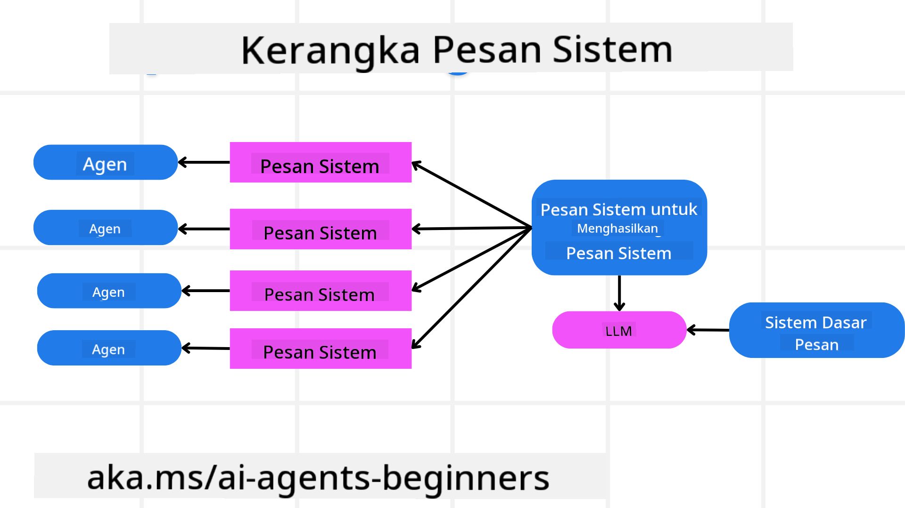
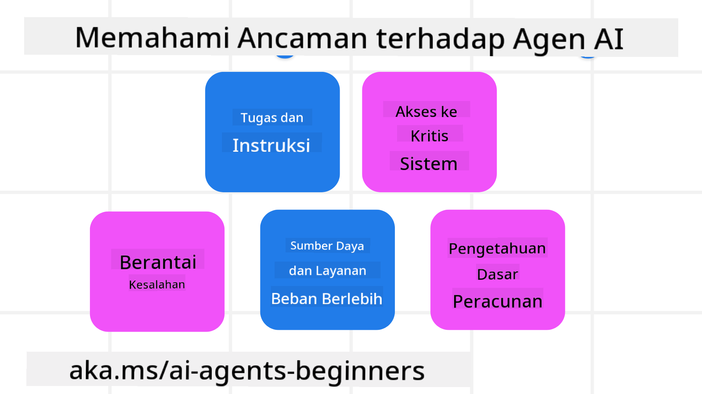
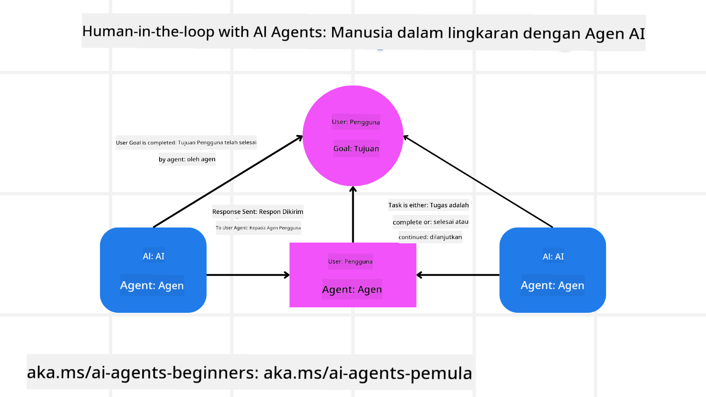

<!--
CO_OP_TRANSLATOR_METADATA:
{
  "original_hash": "f57852cac3a86c4a5ef47f793cc12178",
  "translation_date": "2025-07-12T10:30:03+00:00",
  "source_file": "06-building-trustworthy-agents/README.md",
  "language_code": "id"
}
-->
[](https://youtu.be/iZKkMEGBCUQ?si=Q-kEbcyHUMPoHp8L)

> _(Klik gambar di atas untuk menonton video pelajaran ini)_

# Membangun AI Agents yang Dapat Dipercaya

## Pendahuluan

Pelajaran ini akan membahas:

- Cara membangun dan menerapkan AI Agents yang aman dan efektif
- Pertimbangan keamanan penting saat mengembangkan AI Agents
- Cara menjaga privasi data dan pengguna saat mengembangkan AI Agents

## Tujuan Pembelajaran

Setelah menyelesaikan pelajaran ini, Anda akan mengetahui cara:

- Mengidentifikasi dan mengurangi risiko saat membuat AI Agents
- Menerapkan langkah-langkah keamanan untuk memastikan data dan akses dikelola dengan baik
- Membuat AI Agents yang menjaga privasi data dan memberikan pengalaman pengguna yang berkualitas

## Keamanan

Mari kita mulai dengan membangun aplikasi agentik yang aman. Keamanan berarti AI agent berfungsi sesuai dengan yang dirancang. Sebagai pembuat aplikasi agentik, kita memiliki metode dan alat untuk memaksimalkan keamanan:

### Membangun Kerangka Pesan Sistem

Jika Anda pernah membuat aplikasi AI menggunakan Large Language Models (LLMs), Anda tahu pentingnya merancang prompt sistem atau pesan sistem yang kuat. Prompt ini menetapkan aturan meta, instruksi, dan panduan tentang bagaimana LLM akan berinteraksi dengan pengguna dan data.

Untuk AI Agents, prompt sistem bahkan lebih penting karena AI Agents memerlukan instruksi yang sangat spesifik untuk menyelesaikan tugas yang telah kita rancang.

Untuk membuat prompt sistem yang dapat diskalakan, kita dapat menggunakan kerangka pesan sistem untuk membangun satu atau lebih agen dalam aplikasi kita:



#### Langkah 1: Buat Meta System Message

Meta prompt akan digunakan oleh LLM untuk menghasilkan prompt sistem bagi agen yang kita buat. Kita merancangnya sebagai template agar dapat dengan efisien membuat banyak agen jika diperlukan.

Berikut contoh meta system message yang akan kita berikan ke LLM:

```plaintext
You are an expert at creating AI agent assistants. 
You will be provided a company name, role, responsibilities and other
information that you will use to provide a system prompt for.
To create the system prompt, be descriptive as possible and provide a structure that a system using an LLM can better understand the role and responsibilities of the AI assistant. 
```

#### Langkah 2: Buat Prompt Dasar

Langkah berikutnya adalah membuat prompt dasar untuk mendeskripsikan AI Agent. Anda harus menyertakan peran agen, tugas yang akan diselesaikan agen, dan tanggung jawab lain dari agen tersebut.

Berikut contohnya:

```plaintext
You are a travel agent for Contoso Travel that is great at booking flights for customers. To help customers you can perform the following tasks: lookup available flights, book flights, ask for preferences in seating and times for flights, cancel any previously booked flights and alert customers on any delays or cancellations of flights.  
```

#### Langkah 3: Berikan Basic System Message ke LLM

Sekarang kita dapat mengoptimalkan pesan sistem ini dengan memberikan meta system message sebagai pesan sistem dan pesan sistem dasar kita.

Ini akan menghasilkan pesan sistem yang lebih baik untuk membimbing AI agents kita:

```markdown
**Company Name:** Contoso Travel  
**Role:** Travel Agent Assistant

**Objective:**  
You are an AI-powered travel agent assistant for Contoso Travel, specializing in booking flights and providing exceptional customer service. Your main goal is to assist customers in finding, booking, and managing their flights, all while ensuring that their preferences and needs are met efficiently.

**Key Responsibilities:**

1. **Flight Lookup:**
    
    - Assist customers in searching for available flights based on their specified destination, dates, and any other relevant preferences.
    - Provide a list of options, including flight times, airlines, layovers, and pricing.
2. **Flight Booking:**
    
    - Facilitate the booking of flights for customers, ensuring that all details are correctly entered into the system.
    - Confirm bookings and provide customers with their itinerary, including confirmation numbers and any other pertinent information.
3. **Customer Preference Inquiry:**
    
    - Actively ask customers for their preferences regarding seating (e.g., aisle, window, extra legroom) and preferred times for flights (e.g., morning, afternoon, evening).
    - Record these preferences for future reference and tailor suggestions accordingly.
4. **Flight Cancellation:**
    
    - Assist customers in canceling previously booked flights if needed, following company policies and procedures.
    - Notify customers of any necessary refunds or additional steps that may be required for cancellations.
5. **Flight Monitoring:**
    
    - Monitor the status of booked flights and alert customers in real-time about any delays, cancellations, or changes to their flight schedule.
    - Provide updates through preferred communication channels (e.g., email, SMS) as needed.

**Tone and Style:**

- Maintain a friendly, professional, and approachable demeanor in all interactions with customers.
- Ensure that all communication is clear, informative, and tailored to the customer's specific needs and inquiries.

**User Interaction Instructions:**

- Respond to customer queries promptly and accurately.
- Use a conversational style while ensuring professionalism.
- Prioritize customer satisfaction by being attentive, empathetic, and proactive in all assistance provided.

**Additional Notes:**

- Stay updated on any changes to airline policies, travel restrictions, and other relevant information that could impact flight bookings and customer experience.
- Use clear and concise language to explain options and processes, avoiding jargon where possible for better customer understanding.

This AI assistant is designed to streamline the flight booking process for customers of Contoso Travel, ensuring that all their travel needs are met efficiently and effectively.

```

#### Langkah 4: Iterasi dan Perbaikan

Nilai dari kerangka pesan sistem ini adalah kemampuannya untuk memudahkan pembuatan pesan sistem dari banyak agen sekaligus serta meningkatkan pesan sistem Anda seiring waktu. Jarang sekali Anda mendapatkan pesan sistem yang langsung sempurna untuk seluruh kasus penggunaan Anda. Dengan bisa melakukan penyesuaian kecil dan perbaikan dengan mengubah pesan sistem dasar dan menjalankannya melalui sistem, Anda dapat membandingkan dan mengevaluasi hasilnya.

## Memahami Ancaman

Untuk membangun AI agents yang dapat dipercaya, penting untuk memahami dan mengurangi risiko serta ancaman terhadap AI agent Anda. Mari kita lihat beberapa ancaman berbeda terhadap AI agents dan bagaimana Anda dapat merencanakan serta mempersiapkannya dengan lebih baik.



### Tugas dan Instruksi

**Deskripsi:** Penyerang mencoba mengubah instruksi atau tujuan AI agent melalui prompt atau manipulasi input.

**Mitigasi:** Lakukan pemeriksaan validasi dan filter input untuk mendeteksi prompt yang berpotensi berbahaya sebelum diproses oleh AI Agent. Karena serangan ini biasanya memerlukan interaksi yang sering dengan Agent, membatasi jumlah giliran dalam percakapan adalah cara lain untuk mencegah jenis serangan ini.

### Akses ke Sistem Kritis

**Deskripsi:** Jika AI agent memiliki akses ke sistem dan layanan yang menyimpan data sensitif, penyerang dapat mengganggu komunikasi antara agent dan layanan tersebut. Ini bisa berupa serangan langsung atau upaya tidak langsung untuk mendapatkan informasi tentang sistem tersebut melalui agent.

**Mitigasi:** AI agents harus memiliki akses ke sistem hanya berdasarkan kebutuhan untuk mencegah jenis serangan ini. Komunikasi antara agent dan sistem juga harus aman. Menerapkan autentikasi dan kontrol akses adalah cara lain untuk melindungi informasi ini.

### Beban Berlebih pada Sumber Daya dan Layanan

**Deskripsi:** AI agents dapat mengakses berbagai alat dan layanan untuk menyelesaikan tugas. Penyerang dapat memanfaatkan kemampuan ini untuk menyerang layanan tersebut dengan mengirimkan volume permintaan yang tinggi melalui AI Agent, yang dapat menyebabkan kegagalan sistem atau biaya tinggi.

**Mitigasi:** Terapkan kebijakan untuk membatasi jumlah permintaan yang dapat dilakukan AI agent ke suatu layanan. Membatasi jumlah giliran percakapan dan permintaan ke AI agent Anda juga merupakan cara untuk mencegah jenis serangan ini.

### Keracunan Basis Pengetahuan

**Deskripsi:** Jenis serangan ini tidak langsung menargetkan AI agent, tetapi menargetkan basis pengetahuan dan layanan lain yang digunakan AI agent. Ini bisa melibatkan korupsi data atau informasi yang digunakan AI agent untuk menyelesaikan tugas, yang mengakibatkan respons yang bias atau tidak diinginkan kepada pengguna.

**Mitigasi:** Lakukan verifikasi rutin terhadap data yang akan digunakan AI agent dalam alur kerjanya. Pastikan akses ke data ini aman dan hanya diubah oleh individu yang dipercaya untuk menghindari jenis serangan ini.

### Kesalahan Berantai

**Deskripsi:** AI agents mengakses berbagai alat dan layanan untuk menyelesaikan tugas. Kesalahan yang disebabkan oleh penyerang dapat menyebabkan kegagalan sistem lain yang terhubung dengan AI agent, sehingga serangan menjadi lebih luas dan sulit untuk diatasi.

**Mitigasi:** Salah satu cara untuk menghindari ini adalah dengan menjalankan AI Agent dalam lingkungan terbatas, seperti menjalankan tugas dalam Docker container, untuk mencegah serangan langsung ke sistem. Membuat mekanisme fallback dan logika pengulangan saat sistem tertentu merespons dengan kesalahan juga merupakan cara untuk mencegah kegagalan sistem yang lebih besar.

## Human-in-the-Loop

Cara efektif lain untuk membangun sistem AI Agent yang dapat dipercaya adalah dengan menggunakan Human-in-the-loop. Ini menciptakan alur di mana pengguna dapat memberikan umpan balik kepada Agents selama proses berjalan. Pengguna pada dasarnya bertindak sebagai agen dalam sistem multi-agen dengan memberikan persetujuan atau menghentikan proses yang sedang berjalan.



Berikut cuplikan kode menggunakan AutoGen untuk menunjukkan bagaimana konsep ini diimplementasikan:

```python

# Create the agents.
model_client = OpenAIChatCompletionClient(model="gpt-4o-mini")
assistant = AssistantAgent("assistant", model_client=model_client)
user_proxy = UserProxyAgent("user_proxy", input_func=input)  # Use input() to get user input from console.

# Create the termination condition which will end the conversation when the user says "APPROVE".
termination = TextMentionTermination("APPROVE")

# Create the team.
team = RoundRobinGroupChat([assistant, user_proxy], termination_condition=termination)

# Run the conversation and stream to the console.
stream = team.run_stream(task="Write a 4-line poem about the ocean.")
# Use asyncio.run(...) when running in a script.
await Console(stream)

```

## Kesimpulan

Membangun AI agents yang dapat dipercaya membutuhkan desain yang cermat, langkah keamanan yang kuat, dan iterasi berkelanjutan. Dengan menerapkan sistem meta prompting yang terstruktur, memahami potensi ancaman, dan menerapkan strategi mitigasi, pengembang dapat menciptakan AI agents yang aman dan efektif. Selain itu, menggabungkan pendekatan human-in-the-loop memastikan AI agents tetap selaras dengan kebutuhan pengguna sekaligus meminimalkan risiko. Seiring AI terus berkembang, menjaga sikap proaktif terhadap keamanan, privasi, dan pertimbangan etis akan menjadi kunci untuk membangun kepercayaan dan keandalan dalam sistem berbasis AI.

## Sumber Daya Tambahan

- <a href="https://learn.microsoft.com/azure/ai-studio/responsible-use-of-ai-overview" target="_blank">Gambaran Responsible AI</a>
- <a href="https://learn.microsoft.com/azure/ai-studio/concepts/evaluation-approach-gen-ai" target="_blank">Evaluasi model AI generatif dan aplikasi AI</a>
- <a href="https://learn.microsoft.com/azure/ai-services/openai/concepts/system-message?context=%2Fazure%2Fai-studio%2Fcontext%2Fcontext&tabs=top-techniques" target="_blank">Pesan sistem keamanan</a>
- <a href="https://blogs.microsoft.com/wp-content/uploads/prod/sites/5/2022/06/Microsoft-RAI-Impact-Assessment-Template.pdf?culture=en-us&country=us" target="_blank">Template Penilaian Risiko</a>

## Pelajaran Sebelumnya

[Agentic RAG](../05-agentic-rag/README.md)

## Pelajaran Berikutnya

[Planning Design Pattern](../07-planning-design/README.md)

**Penafian**:  
Dokumen ini telah diterjemahkan menggunakan layanan terjemahan AI [Co-op Translator](https://github.com/Azure/co-op-translator). Meskipun kami berusaha untuk akurasi, harap diketahui bahwa terjemahan otomatis mungkin mengandung kesalahan atau ketidakakuratan. Dokumen asli dalam bahasa aslinya harus dianggap sebagai sumber yang sahih. Untuk informasi penting, disarankan menggunakan terjemahan profesional oleh manusia. Kami tidak bertanggung jawab atas kesalahpahaman atau penafsiran yang keliru yang timbul dari penggunaan terjemahan ini.