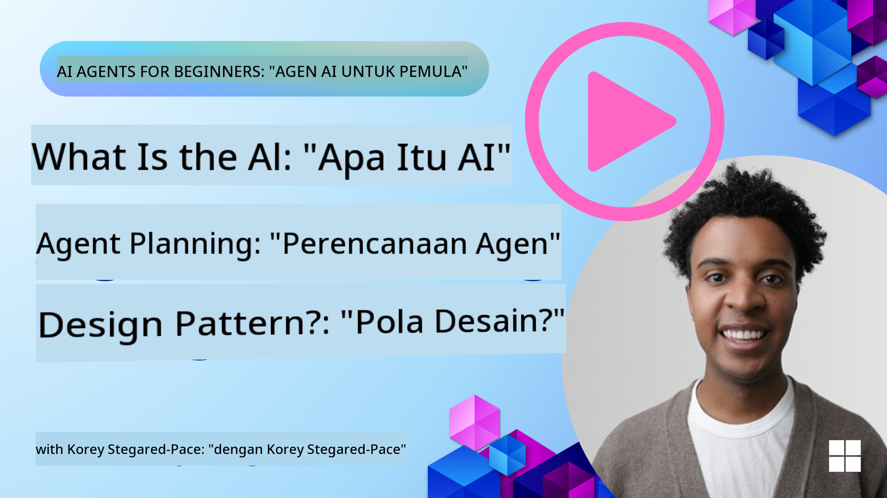
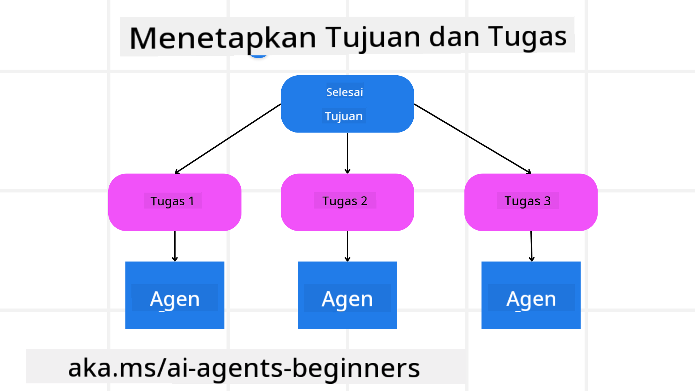

<!--
CO_OP_TRANSLATOR_METADATA:
{
  "original_hash": "a28d30590704ea13b6a08d4793cf9c2b",
  "translation_date": "2025-08-29T18:08:30+00:00",
  "source_file": "07-planning-design/README.md",
  "language_code": "id"
}
-->
[](https://youtu.be/kPfJ2BrBCMY?si=9pYpPXp0sSbK91Dr)

> _(Klik gambar di atas untuk menonton video pelajaran ini)_

# Perencanaan Desain

## Pendahuluan

Pelajaran ini akan membahas:

* Mendefinisikan tujuan keseluruhan yang jelas dan memecah tugas kompleks menjadi tugas-tugas yang dapat dikelola.
* Memanfaatkan output terstruktur untuk respons yang lebih andal dan dapat dibaca mesin.
* Menerapkan pendekatan berbasis peristiwa untuk menangani tugas dinamis dan masukan yang tidak terduga.

## Tujuan Pembelajaran

Setelah menyelesaikan pelajaran ini, Anda akan memahami tentang:

* Mengidentifikasi dan menetapkan tujuan keseluruhan untuk agen AI, memastikan agen tersebut mengetahui apa yang perlu dicapai.
* Memecah tugas kompleks menjadi sub-tugas yang dapat dikelola dan mengorganisasikannya ke dalam urutan logis.
* Membekali agen dengan alat yang tepat (misalnya, alat pencarian atau analitik data), memutuskan kapan dan bagaimana alat tersebut digunakan, serta menangani situasi tak terduga yang muncul.
* Mengevaluasi hasil sub-tugas, mengukur kinerja, dan mengulangi tindakan untuk meningkatkan output akhir.

## Mendefinisikan Tujuan Keseluruhan dan Memecah Tugas



Sebagian besar tugas di dunia nyata terlalu kompleks untuk diselesaikan dalam satu langkah. Agen AI memerlukan tujuan yang ringkas untuk memandu perencanaan dan tindakannya. Sebagai contoh, pertimbangkan tujuan berikut:

    "Buat rencana perjalanan selama 3 hari."

Meskipun mudah untuk dinyatakan, tujuan ini masih memerlukan penyempurnaan. Semakin jelas tujuannya, semakin baik agen (dan kolaborator manusia) dapat fokus untuk mencapai hasil yang tepat, seperti membuat rencana perjalanan yang komprehensif dengan opsi penerbangan, rekomendasi hotel, dan saran aktivitas.

### Pemecahan Tugas

Tugas besar atau rumit menjadi lebih mudah dikelola ketika dipecah menjadi sub-tugas kecil yang berorientasi pada tujuan.  
Untuk contoh rencana perjalanan, Anda dapat memecah tujuan menjadi:

* Pemesanan Penerbangan  
* Pemesanan Hotel  
* Penyewaan Mobil  
* Personalisasi  

Setiap sub-tugas kemudian dapat ditangani oleh agen atau proses khusus. Satu agen mungkin mengkhususkan diri dalam mencari penawaran penerbangan terbaik, agen lain fokus pada pemesanan hotel, dan sebagainya. Agen pengoordinasi atau agen "hilir" kemudian dapat mengompilasi hasil ini menjadi satu rencana perjalanan yang kohesif untuk pengguna akhir.

Pendekatan modular ini juga memungkinkan peningkatan secara bertahap. Misalnya, Anda dapat menambahkan agen khusus untuk Rekomendasi Makanan atau Saran Aktivitas Lokal dan menyempurnakan rencana perjalanan dari waktu ke waktu.

### Output Terstruktur

Model Bahasa Besar (LLM) dapat menghasilkan output terstruktur (misalnya JSON) yang lebih mudah diproses oleh agen atau layanan hilir. Hal ini sangat berguna dalam konteks multi-agen, di mana kita dapat menindaklanjuti tugas-tugas ini setelah output perencanaan diterima. Untuk gambaran cepat, berikut adalah cuplikan Python yang menunjukkan agen perencanaan sederhana yang memecah tujuan menjadi sub-tugas dan menghasilkan rencana terstruktur:

```python
from pydantic import BaseModel
from enum import Enum
from typing import List, Optional, Union
import json
import os
from typing import Optional
from pprint import pprint
from autogen_core.models import UserMessage, SystemMessage, AssistantMessage
from autogen_ext.models.azure import AzureAIChatCompletionClient
from azure.core.credentials import AzureKeyCredential

class AgentEnum(str, Enum):
    FlightBooking = "flight_booking"
    HotelBooking = "hotel_booking"
    CarRental = "car_rental"
    ActivitiesBooking = "activities_booking"
    DestinationInfo = "destination_info"
    DefaultAgent = "default_agent"
    GroupChatManager = "group_chat_manager"

# Travel SubTask Model
class TravelSubTask(BaseModel):
    task_details: str
    assigned_agent: AgentEnum  # we want to assign the task to the agent

class TravelPlan(BaseModel):
    main_task: str
    subtasks: List[TravelSubTask]
    is_greeting: bool

client = AzureAIChatCompletionClient(
    model="gpt-4o-mini",
    endpoint="https://models.inference.ai.azure.com",
    # To authenticate with the model you will need to generate a personal access token (PAT) in your GitHub settings.
    # Create your PAT token by following instructions here: https://docs.github.com/en/authentication/keeping-your-account-and-data-secure/managing-your-personal-access-tokens
    credential=AzureKeyCredential(os.environ["GITHUB_TOKEN"]),
    model_info={
        "json_output": False,
        "function_calling": True,
        "vision": True,
        "family": "unknown",
    },
)

# Define the user message
messages = [
    SystemMessage(content="""You are an planner agent.
    Your job is to decide which agents to run based on the user's request.
                      Provide your response in JSON format with the following structure:
{'main_task': 'Plan a family trip from Singapore to Melbourne.',
 'subtasks': [{'assigned_agent': 'flight_booking',
               'task_details': 'Book round-trip flights from Singapore to '
                               'Melbourne.'}
    Below are the available agents specialised in different tasks:
    - FlightBooking: For booking flights and providing flight information
    - HotelBooking: For booking hotels and providing hotel information
    - CarRental: For booking cars and providing car rental information
    - ActivitiesBooking: For booking activities and providing activity information
    - DestinationInfo: For providing information about destinations
    - DefaultAgent: For handling general requests""", source="system"),
    UserMessage(
        content="Create a travel plan for a family of 2 kids from Singapore to Melboune", source="user"),
]

response = await client.create(messages=messages, extra_create_args={"response_format": 'json_object'})

response_content: Optional[str] = response.content if isinstance(
    response.content, str) else None
if response_content is None:
    raise ValueError("Response content is not a valid JSON string" )

pprint(json.loads(response_content))

# # Ensure the response content is a valid JSON string before loading it
# response_content: Optional[str] = response.content if isinstance(
#     response.content, str) else None
# if response_content is None:
#     raise ValueError("Response content is not a valid JSON string")

# # Print the response content after loading it as JSON
# pprint(json.loads(response_content))

# Validate the response content with the MathReasoning model
# TravelPlan.model_validate(json.loads(response_content))
```

### Agen Perencanaan dengan Orkestrasi Multi-Agen

Dalam contoh ini, Semantic Router Agent menerima permintaan pengguna (misalnya, "Saya butuh rencana hotel untuk perjalanan saya.").

Perencana kemudian:

* Menerima Rencana Hotel: Perencana mengambil pesan pengguna dan, berdasarkan prompt sistem (termasuk detail agen yang tersedia), menghasilkan rencana perjalanan terstruktur.
* Mendaftar Agen dan Alat Mereka: Registri agen menyimpan daftar agen (misalnya, untuk penerbangan, hotel, penyewaan mobil, dan aktivitas) beserta fungsi atau alat yang mereka tawarkan.
* Mengarahkan Rencana ke Agen Terkait: Bergantung pada jumlah sub-tugas, perencana mengirimkan pesan langsung ke agen khusus (untuk skenario tugas tunggal) atau mengoordinasikan melalui pengelola obrolan grup untuk kolaborasi multi-agen.
* Merangkum Hasil: Akhirnya, perencana merangkum rencana yang dihasilkan untuk kejelasan.  
Cuplikan kode Python berikut menggambarkan langkah-langkah ini:

```python

from pydantic import BaseModel

from enum import Enum
from typing import List, Optional, Union

class AgentEnum(str, Enum):
    FlightBooking = "flight_booking"
    HotelBooking = "hotel_booking"
    CarRental = "car_rental"
    ActivitiesBooking = "activities_booking"
    DestinationInfo = "destination_info"
    DefaultAgent = "default_agent"
    GroupChatManager = "group_chat_manager"

# Travel SubTask Model

class TravelSubTask(BaseModel):
    task_details: str
    assigned_agent: AgentEnum # we want to assign the task to the agent

class TravelPlan(BaseModel):
    main_task: str
    subtasks: List[TravelSubTask]
    is_greeting: bool
import json
import os
from typing import Optional

from autogen_core.models import UserMessage, SystemMessage, AssistantMessage
from autogen_ext.models.openai import AzureOpenAIChatCompletionClient

# Create the client with type-checked environment variables

client = AzureOpenAIChatCompletionClient(
    azure_deployment=os.getenv("AZURE_OPENAI_DEPLOYMENT_NAME"),
    model=os.getenv("AZURE_OPENAI_DEPLOYMENT_NAME"),
    api_version=os.getenv("AZURE_OPENAI_API_VERSION"),
    azure_endpoint=os.getenv("AZURE_OPENAI_ENDPOINT"),
    api_key=os.getenv("AZURE_OPENAI_API_KEY"),
)

from pprint import pprint

# Define the user message

messages = [
    SystemMessage(content="""You are an planner agent.
    Your job is to decide which agents to run based on the user's request.
    Below are the available agents specialized in different tasks:
    - FlightBooking: For booking flights and providing flight information
    - HotelBooking: For booking hotels and providing hotel information
    - CarRental: For booking cars and providing car rental information
    - ActivitiesBooking: For booking activities and providing activity information
    - DestinationInfo: For providing information about destinations
    - DefaultAgent: For handling general requests""", source="system"),
    UserMessage(content="Create a travel plan for a family of 2 kids from Singapore to Melbourne", source="user"),
]

response = await client.create(messages=messages, extra_create_args={"response_format": TravelPlan})

# Ensure the response content is a valid JSON string before loading it

response_content: Optional[str] = response.content if isinstance(response.content, str) else None
if response_content is None:
    raise ValueError("Response content is not a valid JSON string")

# Print the response content after loading it as JSON

pprint(json.loads(response_content))
```

Berikut adalah output dari kode sebelumnya, dan Anda kemudian dapat menggunakan output terstruktur ini untuk mengarahkan ke `assigned_agent` dan merangkum rencana perjalanan kepada pengguna akhir.

```json
{
    "is_greeting": "False",
    "main_task": "Plan a family trip from Singapore to Melbourne.",
    "subtasks": [
        {
            "assigned_agent": "flight_booking",
            "task_details": "Book round-trip flights from Singapore to Melbourne."
        },
        {
            "assigned_agent": "hotel_booking",
            "task_details": "Find family-friendly hotels in Melbourne."
        },
        {
            "assigned_agent": "car_rental",
            "task_details": "Arrange a car rental suitable for a family of four in Melbourne."
        },
        {
            "assigned_agent": "activities_booking",
            "task_details": "List family-friendly activities in Melbourne."
        },
        {
            "assigned_agent": "destination_info",
            "task_details": "Provide information about Melbourne as a travel destination."
        }
    ]
}
```

Notebook contoh dengan cuplikan kode sebelumnya tersedia [di sini](07-autogen.ipynb).

### Perencanaan Iteratif

Beberapa tugas memerlukan proses bolak-balik atau perencanaan ulang, di mana hasil dari satu sub-tugas memengaruhi langkah berikutnya. Misalnya, jika agen menemukan format data yang tidak terduga saat memesan penerbangan, agen mungkin perlu menyesuaikan strateginya sebelum melanjutkan ke pemesanan hotel.

Selain itu, umpan balik pengguna (misalnya, pengguna memutuskan mereka lebih suka penerbangan lebih awal) dapat memicu perencanaan ulang parsial. Pendekatan dinamis dan iteratif ini memastikan bahwa solusi akhir selaras dengan kendala dunia nyata dan preferensi pengguna yang berkembang.

Contoh kode:

```python
from autogen_core.models import UserMessage, SystemMessage, AssistantMessage
#.. same as previous code and pass on the user history, current plan
messages = [
    SystemMessage(content="""You are a planner agent to optimize the
    Your job is to decide which agents to run based on the user's request.
    Below are the available agents specialized in different tasks:
    - FlightBooking: For booking flights and providing flight information
    - HotelBooking: For booking hotels and providing hotel information
    - CarRental: For booking cars and providing car rental information
    - ActivitiesBooking: For booking activities and providing activity information
    - DestinationInfo: For providing information about destinations
    - DefaultAgent: For handling general requests""", source="system"),
    UserMessage(content="Create a travel plan for a family of 2 kids from Singapore to Melbourne", source="user"),
    AssistantMessage(content=f"Previous travel plan - {TravelPlan}", source="assistant")
]
# .. re-plan and send the tasks to respective agents
```

Untuk perencanaan yang lebih komprehensif, lihat Magnetic One untuk menyelesaikan tugas-tugas kompleks.

## Ringkasan

Dalam artikel ini, kita telah melihat contoh bagaimana kita dapat membuat perencana yang dapat secara dinamis memilih agen yang tersedia yang telah ditentukan. Output dari Perencana memecah tugas dan menetapkan agen sehingga tugas dapat dijalankan. Diasumsikan bahwa agen memiliki akses ke fungsi/alat yang diperlukan untuk menyelesaikan tugas. Selain agen, Anda dapat menyertakan pola lain seperti refleksi, peringkas, dan obrolan round robin untuk kustomisasi lebih lanjut.

## Sumber Daya Tambahan

* AutoGen Magnetic One - Sistem multi-agen generalis untuk menyelesaikan tugas-tugas kompleks dan telah mencapai hasil yang mengesankan pada berbagai tolok ukur agenik yang menantang. Referensi:  
. Dalam implementasi ini, pengatur orkestrasi membuat rencana spesifik tugas dan mendelegasikan tugas-tugas ini ke agen yang tersedia. Selain perencanaan, pengatur orkestrasi juga menggunakan mekanisme pelacakan untuk memantau kemajuan tugas dan merencanakan ulang jika diperlukan.

### Punya Pertanyaan Lebih Lanjut tentang Pola Desain Perencanaan?

Bergabunglah dengan [Azure AI Foundry Discord](https://aka.ms/ai-agents/discord) untuk bertemu dengan pelajar lain, menghadiri jam konsultasi, dan mendapatkan jawaban atas pertanyaan Anda tentang Agen AI.

## Pelajaran Sebelumnya

[Membangun Agen AI yang Dapat Dipercaya](../06-building-trustworthy-agents/README.md)

## Pelajaran Selanjutnya

[Pola Desain Multi-Agen](../08-multi-agent/README.md)

---

**Penafian**:  
Dokumen ini telah diterjemahkan menggunakan layanan penerjemahan AI [Co-op Translator](https://github.com/Azure/co-op-translator). Meskipun kami berupaya untuk memberikan hasil yang akurat, harap diperhatikan bahwa terjemahan otomatis mungkin mengandung kesalahan atau ketidakakuratan. Dokumen asli dalam bahasa aslinya harus dianggap sebagai sumber yang berwenang. Untuk informasi yang bersifat kritis, disarankan menggunakan jasa penerjemahan manusia profesional. Kami tidak bertanggung jawab atas kesalahpahaman atau penafsiran yang keliru yang timbul dari penggunaan terjemahan ini.