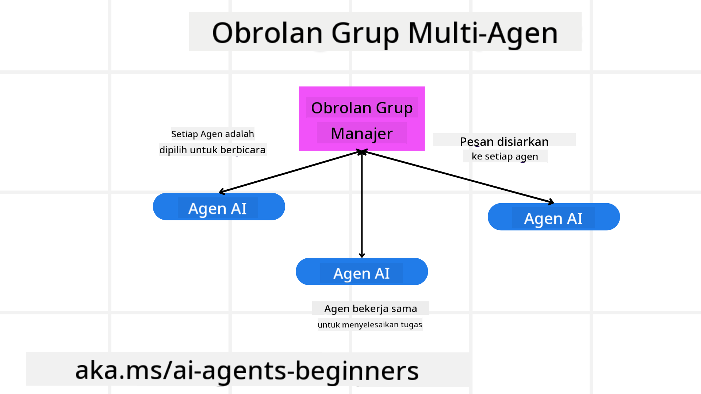
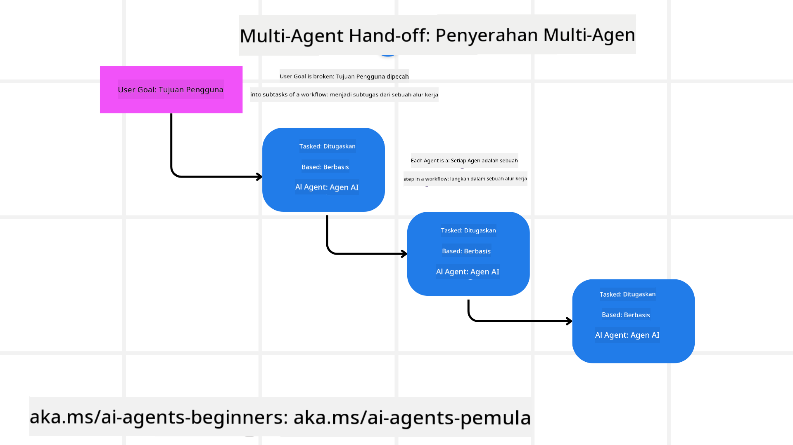
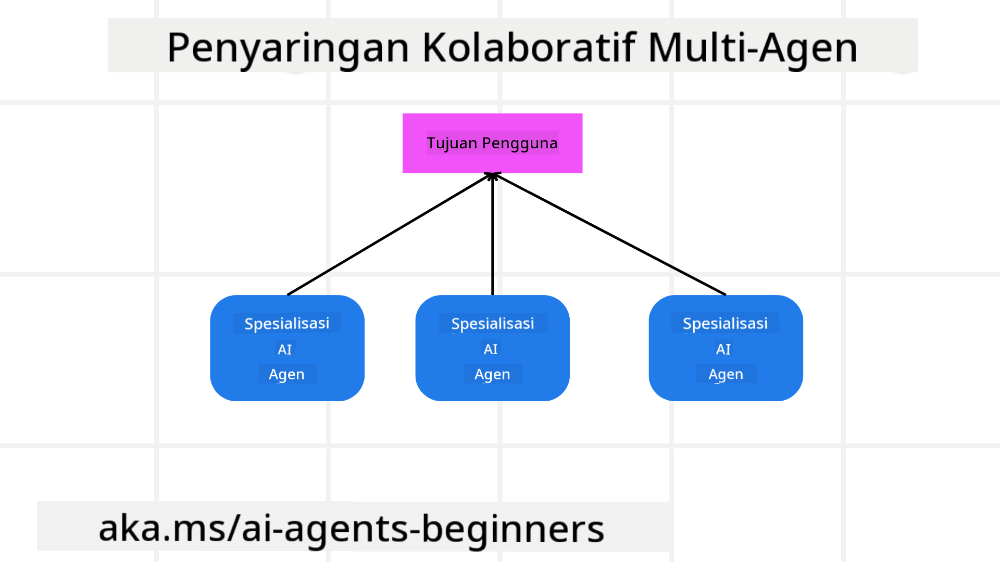

<!--
CO_OP_TRANSLATOR_METADATA:
{
  "original_hash": "c692a8975d7d5b99575a553de1c5e8a7",
  "translation_date": "2025-07-12T11:19:26+00:00",
  "source_file": "08-multi-agent/README.md",
  "language_code": "id"
}
-->

> _(Klik gambar di atas untuk menonton video pelajaran ini)_

# Pola desain multi-agent

Begitu Anda mulai mengerjakan proyek yang melibatkan banyak agen, Anda perlu mempertimbangkan pola desain multi-agent. Namun, mungkin belum langsung jelas kapan harus beralih ke multi-agent dan apa keuntungannya.

## Pendahuluan

Dalam pelajaran ini, kita akan mencoba menjawab pertanyaan-pertanyaan berikut:

- Dalam skenario apa multi-agent dapat diterapkan?
- Apa keuntungan menggunakan multi-agent dibandingkan hanya satu agen yang melakukan banyak tugas?
- Apa saja komponen dasar dalam mengimplementasikan pola desain multi-agent?
- Bagaimana kita bisa melihat bagaimana banyak agen berinteraksi satu sama lain?

## Tujuan Pembelajaran

Setelah pelajaran ini, Anda seharusnya dapat:

- Mengidentifikasi skenario di mana multi-agent dapat diterapkan
- Mengenali keuntungan menggunakan multi-agent dibandingkan agen tunggal
- Memahami komponen dasar dalam mengimplementasikan pola desain multi-agent

Apa gambaran besarnya?

*Multi-agent adalah pola desain yang memungkinkan banyak agen bekerja sama untuk mencapai tujuan bersama*.

Pola ini banyak digunakan di berbagai bidang, termasuk robotika, sistem otonom, dan komputasi terdistribusi.

## Skenario di Mana Multi-Agent Dapat Diterapkan

Jadi, skenario apa yang cocok untuk menggunakan multi-agent? Jawabannya adalah ada banyak skenario di mana penggunaan banyak agen sangat menguntungkan, terutama dalam kasus-kasus berikut:

- **Beban kerja besar**: Beban kerja besar dapat dibagi menjadi tugas-tugas kecil dan diberikan ke agen yang berbeda, memungkinkan pemrosesan paralel dan penyelesaian lebih cepat. Contohnya adalah dalam tugas pemrosesan data besar.
- **Tugas kompleks**: Tugas kompleks, seperti beban kerja besar, dapat dipecah menjadi subtugas yang lebih kecil dan diberikan ke agen yang berbeda, masing-masing mengkhususkan diri pada aspek tertentu dari tugas tersebut. Contoh yang baik adalah pada kendaraan otonom di mana agen berbeda mengelola navigasi, deteksi rintangan, dan komunikasi dengan kendaraan lain.
- **Keahlian beragam**: Agen yang berbeda dapat memiliki keahlian yang beragam, memungkinkan mereka menangani aspek berbeda dari tugas dengan lebih efektif dibandingkan satu agen saja. Contohnya dalam bidang kesehatan di mana agen dapat mengelola diagnostik, rencana perawatan, dan pemantauan pasien.

## Keuntungan Menggunakan Multi-Agent Dibandingkan Agen Tunggal

Sistem agen tunggal bisa bekerja dengan baik untuk tugas sederhana, tetapi untuk tugas yang lebih kompleks, menggunakan banyak agen dapat memberikan beberapa keuntungan:

- **Spesialisasi**: Setiap agen dapat mengkhususkan diri pada tugas tertentu. Kurangnya spesialisasi pada agen tunggal berarti agen tersebut harus melakukan semuanya, yang bisa membingungkan saat menghadapi tugas kompleks. Misalnya, agen tersebut mungkin akhirnya melakukan tugas yang sebenarnya bukan keahliannya.
- **Skalabilitas**: Lebih mudah untuk meningkatkan sistem dengan menambah agen daripada membebani satu agen tunggal.
- **Toleransi Kesalahan**: Jika satu agen gagal, agen lain dapat terus berfungsi, memastikan keandalan sistem.

Mari kita ambil contoh, memesan perjalanan untuk seorang pengguna. Sistem agen tunggal harus menangani semua aspek proses pemesanan perjalanan, mulai dari mencari penerbangan hingga memesan hotel dan mobil sewaan. Untuk mencapai ini dengan satu agen, agen tersebut harus memiliki alat untuk menangani semua tugas ini. Ini bisa menghasilkan sistem yang kompleks dan monolitik yang sulit dipelihara dan diskalakan. Sistem multi-agent, di sisi lain, bisa memiliki agen berbeda yang mengkhususkan diri dalam mencari penerbangan, memesan hotel, dan mobil sewaan. Ini membuat sistem lebih modular, mudah dipelihara, dan skalabel.

Bandingkan ini dengan biro perjalanan yang dijalankan sebagai toko kecil keluarga versus biro perjalanan yang dijalankan sebagai waralaba. Toko kecil keluarga akan memiliki satu agen yang menangani semua aspek pemesanan perjalanan, sementara waralaba akan memiliki agen berbeda yang menangani aspek berbeda dari proses pemesanan perjalanan.

## Komponen Dasar dalam Mengimplementasikan Pola Desain Multi-Agent

Sebelum Anda dapat mengimplementasikan pola desain multi-agent, Anda perlu memahami komponen dasar yang membentuk pola tersebut.

Mari kita buat ini lebih konkret dengan kembali melihat contoh memesan perjalanan untuk pengguna. Dalam kasus ini, komponen dasarnya meliputi:

- **Komunikasi Agen**: Agen untuk mencari penerbangan, memesan hotel, dan mobil sewaan perlu berkomunikasi dan berbagi informasi tentang preferensi dan batasan pengguna. Anda perlu memutuskan protokol dan metode komunikasi ini. Secara konkret, agen pencari penerbangan perlu berkomunikasi dengan agen pemesan hotel untuk memastikan hotel dipesan pada tanggal yang sama dengan penerbangan. Ini berarti agen-agen tersebut harus berbagi informasi tentang tanggal perjalanan pengguna, sehingga Anda perlu memutuskan *agen mana yang berbagi info dan bagaimana mereka berbagi info*.
- **Mekanisme Koordinasi**: Agen perlu mengoordinasikan tindakan mereka untuk memastikan preferensi dan batasan pengguna terpenuhi. Misalnya, preferensi pengguna bisa jadi ingin hotel dekat bandara, sedangkan batasannya adalah mobil sewaan hanya tersedia di bandara. Ini berarti agen pemesan hotel harus berkoordinasi dengan agen pemesan mobil sewaan agar preferensi dan batasan pengguna terpenuhi. Anda perlu memutuskan *bagaimana agen-agen mengoordinasikan tindakan mereka*.
- **Arsitektur Agen**: Agen perlu memiliki struktur internal untuk membuat keputusan dan belajar dari interaksi dengan pengguna. Ini berarti agen pencari penerbangan harus memiliki struktur internal untuk memutuskan penerbangan mana yang direkomendasikan kepada pengguna. Anda perlu memutuskan *bagaimana agen membuat keputusan dan belajar dari interaksi dengan pengguna*. Contohnya, agen pencari penerbangan bisa menggunakan model machine learning untuk merekomendasikan penerbangan berdasarkan preferensi pengguna sebelumnya.
- **Visibilitas Interaksi Multi-Agent**: Anda perlu memiliki visibilitas tentang bagaimana banyak agen berinteraksi satu sama lain. Ini berarti Anda perlu memiliki alat dan teknik untuk melacak aktivitas dan interaksi agen. Ini bisa berupa alat logging dan monitoring, alat visualisasi, dan metrik kinerja.
- **Pola Multi-Agent**: Ada berbagai pola untuk mengimplementasikan sistem multi-agent, seperti arsitektur terpusat, terdesentralisasi, dan hibrida. Anda perlu memilih pola yang paling sesuai dengan kasus penggunaan Anda.
- **Human in the loop**: Dalam banyak kasus, Anda akan melibatkan manusia dalam proses dan perlu menginstruksikan agen kapan harus meminta intervensi manusia. Ini bisa berupa pengguna yang meminta hotel atau penerbangan tertentu yang tidak direkomendasikan agen, atau meminta konfirmasi sebelum memesan penerbangan atau hotel.

## Visibilitas Interaksi Multi-Agent

Penting untuk memiliki visibilitas tentang bagaimana banyak agen berinteraksi satu sama lain. Visibilitas ini penting untuk debugging, optimasi, dan memastikan efektivitas sistem secara keseluruhan. Untuk mencapai ini, Anda perlu memiliki alat dan teknik untuk melacak aktivitas dan interaksi agen. Ini bisa berupa alat logging dan monitoring, alat visualisasi, dan metrik kinerja.

Misalnya, dalam kasus memesan perjalanan untuk pengguna, Anda bisa memiliki dashboard yang menunjukkan status setiap agen, preferensi dan batasan pengguna, serta interaksi antar agen. Dashboard ini bisa menampilkan tanggal perjalanan pengguna, penerbangan yang direkomendasikan oleh agen penerbangan, hotel yang direkomendasikan oleh agen hotel, dan mobil sewaan yang direkomendasikan oleh agen mobil sewaan. Ini memberi Anda gambaran jelas tentang bagaimana agen berinteraksi dan apakah preferensi serta batasan pengguna terpenuhi.

Mari kita lihat lebih detail setiap aspek ini.

- **Alat Logging dan Monitoring**: Anda ingin melakukan logging untuk setiap tindakan yang diambil oleh agen. Entri log bisa menyimpan informasi tentang agen yang melakukan tindakan, tindakan yang diambil, waktu tindakan dilakukan, dan hasil dari tindakan tersebut. Informasi ini kemudian bisa digunakan untuk debugging, optimasi, dan lainnya.

- **Alat Visualisasi**: Alat visualisasi dapat membantu Anda melihat interaksi antar agen dengan cara yang lebih intuitif. Misalnya, Anda bisa memiliki grafik yang menunjukkan aliran informasi antar agen. Ini bisa membantu mengidentifikasi hambatan, ketidakefisienan, dan masalah lain dalam sistem.

- **Metrik Kinerja**: Metrik kinerja dapat membantu Anda melacak efektivitas sistem multi-agent. Misalnya, Anda bisa melacak waktu yang dibutuhkan untuk menyelesaikan tugas, jumlah tugas yang diselesaikan per satuan waktu, dan akurasi rekomendasi yang dibuat oleh agen. Informasi ini dapat membantu mengidentifikasi area yang perlu diperbaiki dan mengoptimalkan sistem.

## Pola Multi-Agent

Mari kita bahas beberapa pola konkret yang bisa digunakan untuk membuat aplikasi multi-agent. Berikut beberapa pola menarik yang layak dipertimbangkan:

### Obrolan grup

Pola ini berguna ketika Anda ingin membuat aplikasi obrolan grup di mana banyak agen dapat berkomunikasi satu sama lain. Kasus penggunaan umum untuk pola ini termasuk kolaborasi tim, dukungan pelanggan, dan jejaring sosial.

Dalam pola ini, setiap agen mewakili pengguna dalam obrolan grup, dan pesan dipertukarkan antar agen menggunakan protokol pesan. Agen dapat mengirim pesan ke obrolan grup, menerima pesan dari obrolan grup, dan merespons pesan dari agen lain.

Pola ini dapat diimplementasikan menggunakan arsitektur terpusat di mana semua pesan dialihkan melalui server pusat, atau arsitektur terdesentralisasi di mana pesan dipertukarkan secara langsung.

### Penyerahan tugas (Hand-off)

Pola ini berguna ketika Anda ingin membuat aplikasi di mana banyak agen dapat menyerahkan tugas satu sama lain.

Kasus penggunaan umum untuk pola ini termasuk dukungan pelanggan, manajemen tugas, dan otomatisasi alur kerja.

Dalam pola ini, setiap agen mewakili tugas atau langkah dalam alur kerja, dan agen dapat menyerahkan tugas ke agen lain berdasarkan aturan yang telah ditentukan.

### Penyaringan kolaboratif (Collaborative filtering)

Pola ini berguna ketika Anda ingin membuat aplikasi di mana banyak agen dapat berkolaborasi untuk memberikan rekomendasi kepada pengguna.

Alasan Anda ingin banyak agen berkolaborasi adalah karena setiap agen dapat memiliki keahlian berbeda dan dapat berkontribusi pada proses rekomendasi dengan cara yang berbeda.

Mari kita ambil contoh di mana seorang pengguna ingin rekomendasi saham terbaik untuk dibeli di pasar saham.

- **Ahli industri**: Satu agen bisa menjadi ahli di industri tertentu.
- **Analisis teknikal**: Agen lain bisa ahli dalam analisis teknikal.
- **Analisis fundamental**: Agen lain lagi bisa ahli dalam analisis fundamental. Dengan berkolaborasi, agen-agen ini dapat memberikan rekomendasi yang lebih komprehensif kepada pengguna.

## Skenario: Proses pengembalian dana

Pertimbangkan skenario di mana pelanggan mencoba mendapatkan pengembalian dana untuk sebuah produk, ada cukup banyak agen yang terlibat dalam proses ini, tapi mari kita bagi antara agen khusus untuk proses ini dan agen umum yang bisa digunakan di proses lain.

**Agen khusus untuk proses pengembalian dana**:

Berikut beberapa agen yang bisa terlibat dalam proses pengembalian dana:

- **Agen pelanggan**: Agen ini mewakili pelanggan dan bertanggung jawab memulai proses pengembalian dana.
- **Agen penjual**: Agen ini mewakili penjual dan bertanggung jawab memproses pengembalian dana.
- **Agen pembayaran**: Agen ini mewakili proses pembayaran dan bertanggung jawab mengembalikan pembayaran kepada pelanggan.
- **Agen resolusi**: Agen ini mewakili proses penyelesaian dan bertanggung jawab menyelesaikan masalah yang muncul selama proses pengembalian dana.
- **Agen kepatuhan**: Agen ini mewakili proses kepatuhan dan bertanggung jawab memastikan proses pengembalian dana sesuai dengan regulasi dan kebijakan.

**Agen umum**:

Agen-agen ini bisa digunakan oleh bagian lain dari bisnis Anda.

- **Agen pengiriman**: Agen ini mewakili proses pengiriman dan bertanggung jawab mengirimkan produk kembali ke penjual. Agen ini bisa digunakan baik untuk proses pengembalian dana maupun pengiriman produk secara umum, misalnya melalui pembelian.
- **Agen umpan balik**: Agen ini mewakili proses pengumpulan umpan balik dan bertanggung jawab mengumpulkan masukan dari pelanggan. Umpan balik bisa dikumpulkan kapan saja, tidak hanya selama proses pengembalian dana.
- **Agen eskalasi**: Agen ini mewakili proses eskalasi dan bertanggung jawab mengeskalasi masalah ke tingkat dukungan yang lebih tinggi. Anda bisa menggunakan jenis agen ini untuk proses apa pun yang membutuhkan eskalasi masalah.
- **Agen notifikasi**: Agen ini mewakili proses pemberitahuan dan bertanggung jawab mengirimkan notifikasi kepada pelanggan pada berbagai tahap proses pengembalian dana.
- **Agen analitik**: Agen ini mewakili proses analitik dan bertanggung jawab menganalisis data terkait proses pengembalian dana.
- **Agen audit**: Agen ini mewakili proses audit dan bertanggung jawab mengaudit proses pengembalian dana untuk memastikan proses berjalan dengan benar.
- **Agen pelaporan**: Agen ini mewakili proses pelaporan dan bertanggung jawab membuat laporan tentang proses pengembalian dana.
- **Agen pengetahuan**: Agen ini mewakili proses pengetahuan dan bertanggung jawab memelihara basis pengetahuan terkait proses pengembalian dana. Agen ini bisa memiliki pengetahuan tentang pengembalian dana maupun bagian lain dari bisnis Anda.
- **Agen keamanan**: Agen ini mewakili proses keamanan dan bertanggung jawab memastikan keamanan proses pengembalian dana.
- **Agen kualitas**: Agen ini mewakili proses kualitas dan bertanggung jawab memastikan kualitas proses pengembalian dana.

Ada cukup banyak agen yang disebutkan sebelumnya, baik untuk proses pengembalian dana khusus maupun agen umum yang bisa digunakan di bagian lain bisnis Anda. Semoga ini memberi Anda gambaran tentang bagaimana Anda bisa memutuskan agen mana yang akan digunakan dalam sistem multi-agent Anda.

## Tugas
## Pelajaran Sebelumnya

[Perencanaan Desain](../07-planning-design/README.md)

## Pelajaran Berikutnya

[Metakognisi dalam Agen AI](../09-metacognition/README.md)

**Penafian**:  
Dokumen ini telah diterjemahkan menggunakan layanan terjemahan AI [Co-op Translator](https://github.com/Azure/co-op-translator). Meskipun kami berupaya untuk mencapai akurasi, harap diperhatikan bahwa terjemahan otomatis mungkin mengandung kesalahan atau ketidakakuratan. Dokumen asli dalam bahasa aslinya harus dianggap sebagai sumber yang sahih. Untuk informasi penting, disarankan menggunakan terjemahan profesional oleh manusia. Kami tidak bertanggung jawab atas kesalahpahaman atau penafsiran yang keliru yang timbul dari penggunaan terjemahan ini.