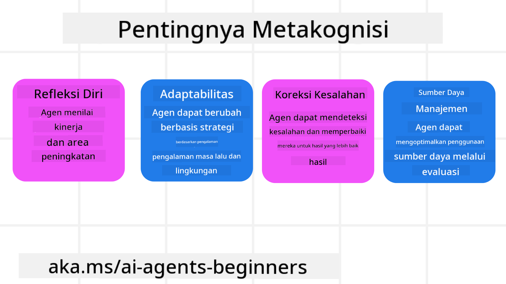
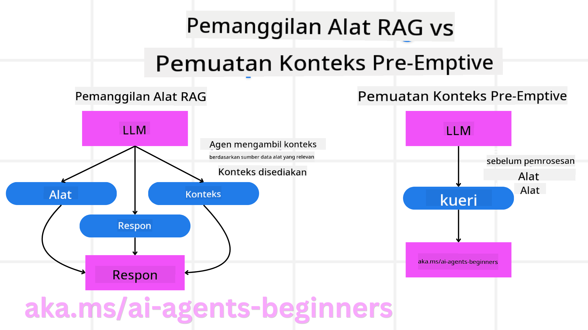

<!--
CO_OP_TRANSLATOR_METADATA:
{
  "original_hash": "8cbf460468c802c7994aa62e0e0779c9",
  "translation_date": "2025-07-12T12:59:31+00:00",
  "source_file": "09-metacognition/README.md",
  "language_code": "id"
}
-->
[](https://youtu.be/His9R6gw6Ec?si=3_RMb8VprNvdLRhX)

> _(Klik gambar di atas untuk menonton video pelajaran ini)_
# Metakognisi pada Agen AI

## Pendahuluan

Selamat datang di pelajaran tentang metakognisi pada agen AI! Bab ini dirancang untuk pemula yang ingin tahu bagaimana agen AI dapat memikirkan proses berpikir mereka sendiri. Di akhir pelajaran ini, Anda akan memahami konsep utama dan dilengkapi dengan contoh praktis untuk menerapkan metakognisi dalam desain agen AI.

## Tujuan Pembelajaran

Setelah menyelesaikan pelajaran ini, Anda akan mampu:

1. Memahami implikasi dari loop penalaran dalam definisi agen.
2. Menggunakan teknik perencanaan dan evaluasi untuk membantu agen yang dapat mengoreksi diri sendiri.
3. Membuat agen Anda sendiri yang mampu memanipulasi kode untuk menyelesaikan tugas.

## Pengenalan Metakognisi

Metakognisi mengacu pada proses kognitif tingkat tinggi yang melibatkan pemikiran tentang proses berpikir seseorang sendiri. Untuk agen AI, ini berarti mampu mengevaluasi dan menyesuaikan tindakannya berdasarkan kesadaran diri dan pengalaman masa lalu. Metakognisi, atau "berpikir tentang berpikir," adalah konsep penting dalam pengembangan sistem AI agenik. Ini melibatkan sistem AI yang sadar akan proses internal mereka sendiri dan mampu memantau, mengatur, serta menyesuaikan perilaku mereka sesuai kebutuhan. Sama seperti kita saat membaca situasi atau melihat sebuah masalah. Kesadaran diri ini dapat membantu sistem AI membuat keputusan yang lebih baik, mengidentifikasi kesalahan, dan meningkatkan kinerjanya seiring waktu—kembali mengaitkan dengan tes Turing dan perdebatan apakah AI akan mengambil alih.

Dalam konteks sistem AI agenik, metakognisi dapat membantu mengatasi beberapa tantangan, seperti:
- Transparansi: Memastikan sistem AI dapat menjelaskan penalaran dan keputusannya.
- Penalaran: Meningkatkan kemampuan sistem AI untuk mensintesis informasi dan membuat keputusan yang tepat.
- Adaptasi: Memungkinkan sistem AI menyesuaikan diri dengan lingkungan baru dan kondisi yang berubah.
- Persepsi: Meningkatkan akurasi sistem AI dalam mengenali dan menginterpretasi data dari lingkungan mereka.

### Apa itu Metakognisi?

Metakognisi, atau "berpikir tentang berpikir," adalah proses kognitif tingkat tinggi yang melibatkan kesadaran diri dan pengaturan diri atas proses kognitif seseorang. Dalam ranah AI, metakognisi memberdayakan agen untuk mengevaluasi dan menyesuaikan strategi serta tindakannya, yang mengarah pada peningkatan kemampuan pemecahan masalah dan pengambilan keputusan. Dengan memahami metakognisi, Anda dapat merancang agen AI yang tidak hanya lebih cerdas tetapi juga lebih adaptif dan efisien. Dalam metakognisi sejati, Anda akan melihat AI secara eksplisit menalar tentang penalarannya sendiri.

Contoh: “Saya memprioritaskan penerbangan yang lebih murah karena… mungkin saya melewatkan penerbangan langsung, jadi saya akan memeriksa ulang.”
Melacak bagaimana atau mengapa memilih rute tertentu.
- Mencatat bahwa ia membuat kesalahan karena terlalu mengandalkan preferensi pengguna dari sebelumnya, sehingga ia mengubah strategi pengambilan keputusannya, bukan hanya rekomendasi akhir.
- Mendiagnosis pola seperti, “Setiap kali saya melihat pengguna menyebut ‘terlalu ramai,’ saya tidak hanya harus menghapus beberapa atraksi tetapi juga merefleksikan bahwa metode saya memilih ‘atraksi teratas’ salah jika saya selalu mengurutkan berdasarkan popularitas.”

### Pentingnya Metakognisi pada Agen AI

Metakognisi memainkan peran penting dalam desain agen AI karena beberapa alasan:



- Refleksi Diri: Agen dapat menilai kinerjanya sendiri dan mengidentifikasi area yang perlu diperbaiki.
- Adaptabilitas: Agen dapat mengubah strategi berdasarkan pengalaman masa lalu dan lingkungan yang berubah.
- Koreksi Kesalahan: Agen dapat mendeteksi dan memperbaiki kesalahan secara mandiri, menghasilkan hasil yang lebih akurat.
- Manajemen Sumber Daya: Agen dapat mengoptimalkan penggunaan sumber daya, seperti waktu dan daya komputasi, dengan merencanakan dan mengevaluasi tindakannya.

## Komponen Agen AI

Sebelum masuk ke proses metakognitif, penting untuk memahami komponen dasar agen AI. Agen AI biasanya terdiri dari:

- Persona: Kepribadian dan karakteristik agen, yang menentukan bagaimana ia berinteraksi dengan pengguna.
- Alat: Kemampuan dan fungsi yang dapat dilakukan agen.
- Keterampilan: Pengetahuan dan keahlian yang dimiliki agen.

Komponen-komponen ini bekerja sama untuk menciptakan "unit keahlian" yang dapat melakukan tugas tertentu.

**Contoh**:
Bayangkan agen perjalanan, layanan agen yang tidak hanya merencanakan liburan Anda tetapi juga menyesuaikan jalurnya berdasarkan data waktu nyata dan pengalaman perjalanan pelanggan sebelumnya.

### Contoh: Metakognisi dalam Layanan Agen Perjalanan

Bayangkan Anda merancang layanan agen perjalanan yang didukung AI. Agen ini, "Travel Agent," membantu pengguna merencanakan liburan mereka. Untuk mengintegrasikan metakognisi, Travel Agent perlu mengevaluasi dan menyesuaikan tindakannya berdasarkan kesadaran diri dan pengalaman masa lalu. Berikut bagaimana metakognisi dapat berperan:

#### Tugas Saat Ini

Tugas saat ini adalah membantu pengguna merencanakan perjalanan ke Paris.

#### Langkah-langkah Menyelesaikan Tugas

1. **Kumpulkan Preferensi Pengguna**: Tanyakan kepada pengguna tentang tanggal perjalanan, anggaran, minat (misalnya, museum, kuliner, belanja), dan kebutuhan khusus.
2. **Ambil Informasi**: Cari opsi penerbangan, akomodasi, atraksi, dan restoran yang sesuai dengan preferensi pengguna.
3. **Buat Rekomendasi**: Berikan rencana perjalanan yang dipersonalisasi dengan detail penerbangan, reservasi hotel, dan aktivitas yang disarankan.
4. **Sesuaikan Berdasarkan Umpan Balik**: Minta umpan balik pengguna tentang rekomendasi dan lakukan penyesuaian yang diperlukan.

#### Sumber Daya yang Dibutuhkan

- Akses ke database pemesanan penerbangan dan hotel.
- Informasi tentang atraksi dan restoran di Paris.
- Data umpan balik pengguna dari interaksi sebelumnya.

#### Pengalaman dan Refleksi Diri

Travel Agent menggunakan metakognisi untuk mengevaluasi kinerjanya dan belajar dari pengalaman sebelumnya. Contohnya:

1. **Menganalisis Umpan Balik Pengguna**: Travel Agent meninjau umpan balik pengguna untuk menentukan rekomendasi mana yang diterima dengan baik dan mana yang tidak. Ia menyesuaikan saran di masa depan sesuai hal tersebut.
2. **Adaptabilitas**: Jika pengguna sebelumnya menyebutkan ketidaksukaan terhadap tempat yang ramai, Travel Agent akan menghindari merekomendasikan tempat wisata populer pada jam sibuk di masa depan.
3. **Koreksi Kesalahan**: Jika Travel Agent melakukan kesalahan dalam pemesanan sebelumnya, seperti menyarankan hotel yang sudah penuh, ia belajar untuk memeriksa ketersediaan dengan lebih teliti sebelum memberikan rekomendasi.

#### Contoh Praktis untuk Pengembang

Berikut contoh kode sederhana bagaimana Travel Agent dapat mengintegrasikan metakognisi:

```python
class Travel_Agent:
    def __init__(self):
        self.user_preferences = {}
        self.experience_data = []

    def gather_preferences(self, preferences):
        self.user_preferences = preferences

    def retrieve_information(self):
        # Search for flights, hotels, and attractions based on preferences
        flights = search_flights(self.user_preferences)
        hotels = search_hotels(self.user_preferences)
        attractions = search_attractions(self.user_preferences)
        return flights, hotels, attractions

    def generate_recommendations(self):
        flights, hotels, attractions = self.retrieve_information()
        itinerary = create_itinerary(flights, hotels, attractions)
        return itinerary

    def adjust_based_on_feedback(self, feedback):
        self.experience_data.append(feedback)
        # Analyze feedback and adjust future recommendations
        self.user_preferences = adjust_preferences(self.user_preferences, feedback)

# Example usage
travel_agent = Travel_Agent()
preferences = {
    "destination": "Paris",
    "dates": "2025-04-01 to 2025-04-10",
    "budget": "moderate",
    "interests": ["museums", "cuisine"]
}
travel_agent.gather_preferences(preferences)
itinerary = travel_agent.generate_recommendations()
print("Suggested Itinerary:", itinerary)
feedback = {"liked": ["Louvre Museum"], "disliked": ["Eiffel Tower (too crowded)"]}
travel_agent.adjust_based_on_feedback(feedback)
```

#### Mengapa Metakognisi Penting

- **Refleksi Diri**: Agen dapat menganalisis kinerjanya dan mengidentifikasi area yang perlu diperbaiki.
- **Adaptabilitas**: Agen dapat mengubah strategi berdasarkan umpan balik dan kondisi yang berubah.
- **Koreksi Kesalahan**: Agen dapat mendeteksi dan memperbaiki kesalahan secara mandiri.
- **Manajemen Sumber Daya**: Agen dapat mengoptimalkan penggunaan sumber daya, seperti waktu dan daya komputasi.

Dengan mengintegrasikan metakognisi, Travel Agent dapat memberikan rekomendasi perjalanan yang lebih personal dan akurat, meningkatkan pengalaman pengguna secara keseluruhan.

---

## 2. Perencanaan pada Agen

Perencanaan adalah komponen penting dalam perilaku agen AI. Ini melibatkan merinci langkah-langkah yang diperlukan untuk mencapai tujuan, dengan mempertimbangkan kondisi saat ini, sumber daya, dan kemungkinan hambatan.

### Elemen Perencanaan

- **Tugas Saat Ini**: Definisikan tugas dengan jelas.
- **Langkah-langkah Menyelesaikan Tugas**: Pecah tugas menjadi langkah-langkah yang dapat dikelola.
- **Sumber Daya yang Dibutuhkan**: Identifikasi sumber daya yang diperlukan.
- **Pengalaman**: Gunakan pengalaman masa lalu untuk membantu perencanaan.

**Contoh**:
Berikut langkah-langkah yang perlu dilakukan Travel Agent untuk membantu pengguna merencanakan perjalanan secara efektif:

### Langkah untuk Travel Agent

1. **Kumpulkan Preferensi Pengguna**
   - Tanyakan detail tentang tanggal perjalanan, anggaran, minat, dan kebutuhan khusus pengguna.
   - Contoh: "Kapan Anda berencana bepergian?" "Berapa kisaran anggaran Anda?" "Aktivitas apa yang Anda sukai saat liburan?"

2. **Ambil Informasi**
   - Cari opsi perjalanan yang relevan berdasarkan preferensi pengguna.
   - **Penerbangan**: Cari penerbangan yang tersedia sesuai anggaran dan tanggal perjalanan.
   - **Akomodasi**: Temukan hotel atau properti sewa yang sesuai dengan preferensi lokasi, harga, dan fasilitas.
   - **Atraksi dan Restoran**: Identifikasi atraksi populer, aktivitas, dan tempat makan yang sesuai dengan minat pengguna.

3. **Buat Rekomendasi**
   - Susun informasi yang didapat menjadi rencana perjalanan yang dipersonalisasi.
   - Berikan detail seperti opsi penerbangan, reservasi hotel, dan aktivitas yang disarankan, pastikan rekomendasi sesuai preferensi pengguna.

4. **Tampilkan Rencana Perjalanan ke Pengguna**
   - Bagikan rencana perjalanan yang diusulkan untuk ditinjau pengguna.
   - Contoh: "Ini rencana perjalanan yang saya sarankan untuk perjalanan Anda ke Paris. Termasuk detail penerbangan, pemesanan hotel, dan daftar aktivitas serta restoran yang direkomendasikan. Apa pendapat Anda?"

5. **Kumpulkan Umpan Balik**
   - Tanyakan umpan balik pengguna tentang rencana perjalanan yang diusulkan.
   - Contoh: "Apakah Anda suka opsi penerbangan ini?" "Apakah hotel ini sesuai kebutuhan Anda?" "Adakah aktivitas yang ingin Anda tambahkan atau hapus?"

6. **Sesuaikan Berdasarkan Umpan Balik**
   - Ubah rencana perjalanan berdasarkan umpan balik pengguna.
   - Lakukan perubahan yang diperlukan pada rekomendasi penerbangan, akomodasi, dan aktivitas agar lebih sesuai dengan preferensi pengguna.

7. **Konfirmasi Akhir**
   - Tampilkan rencana perjalanan yang sudah diperbarui untuk konfirmasi akhir dari pengguna.
   - Contoh: "Saya sudah melakukan penyesuaian berdasarkan umpan balik Anda. Ini rencana perjalanan terbaru. Apakah semuanya sudah sesuai?"

8. **Pesan dan Konfirmasi Reservasi**
   - Setelah pengguna menyetujui rencana perjalanan, lanjutkan dengan pemesanan penerbangan, akomodasi, dan aktivitas yang sudah direncanakan.
   - Kirimkan detail konfirmasi kepada pengguna.

9. **Berikan Dukungan Berkelanjutan**
   - Tetap tersedia untuk membantu pengguna dengan perubahan atau permintaan tambahan sebelum dan selama perjalanan.
   - Contoh: "Jika Anda membutuhkan bantuan lebih lanjut selama perjalanan, jangan ragu menghubungi saya kapan saja!"

### Contoh Interaksi

```python
class Travel_Agent:
    def __init__(self):
        self.user_preferences = {}
        self.experience_data = []

    def gather_preferences(self, preferences):
        self.user_preferences = preferences

    def retrieve_information(self):
        flights = search_flights(self.user_preferences)
        hotels = search_hotels(self.user_preferences)
        attractions = search_attractions(self.user_preferences)
        return flights, hotels, attractions

    def generate_recommendations(self):
        flights, hotels, attractions = self.retrieve_information()
        itinerary = create_itinerary(flights, hotels, attractions)
        return itinerary

    def adjust_based_on_feedback(self, feedback):
        self.experience_data.append(feedback)
        self.user_preferences = adjust_preferences(self.user_preferences, feedback)

# Example usage within a booing request
travel_agent = Travel_Agent()
preferences = {
    "destination": "Paris",
    "dates": "2025-04-01 to 2025-04-10",
    "budget": "moderate",
    "interests": ["museums", "cuisine"]
}
travel_agent.gather_preferences(preferences)
itinerary = travel_agent.generate_recommendations()
print("Suggested Itinerary:", itinerary)
feedback = {"liked": ["Louvre Museum"], "disliked": ["Eiffel Tower (too crowded)"]}
travel_agent.adjust_based_on_feedback(feedback)
```

## 3. Sistem RAG Korektif

Pertama, mari kita pahami perbedaan antara RAG Tool dan Pre-emptive Context Load



### Retrieval-Augmented Generation (RAG)

RAG menggabungkan sistem pengambilan dengan model generatif. Ketika sebuah kueri diajukan, sistem pengambilan mengambil dokumen atau data relevan dari sumber eksternal, dan informasi yang diambil ini digunakan untuk memperkaya input ke model generatif. Ini membantu model menghasilkan respons yang lebih akurat dan relevan secara kontekstual.

Dalam sistem RAG, agen mengambil informasi relevan dari basis pengetahuan dan menggunakannya untuk menghasilkan respons atau tindakan yang sesuai.

### Pendekatan RAG Korektif

Pendekatan RAG Korektif berfokus pada penggunaan teknik RAG untuk memperbaiki kesalahan dan meningkatkan akurasi agen AI. Ini melibatkan:

1. **Teknik Prompting**: Menggunakan prompt spesifik untuk membimbing agen dalam mengambil informasi yang relevan.
2. **Alat**: Menerapkan algoritma dan mekanisme yang memungkinkan agen mengevaluasi relevansi informasi yang diambil dan menghasilkan respons yang akurat.
3. **Evaluasi**: Secara terus-menerus menilai kinerja agen dan melakukan penyesuaian untuk meningkatkan akurasi dan efisiensi.

#### Contoh: RAG Korektif pada Agen Pencari

Pertimbangkan agen pencari yang mengambil informasi dari web untuk menjawab pertanyaan pengguna. Pendekatan RAG Korektif mungkin melibatkan:

1. **Teknik Prompting**: Membuat kueri pencarian berdasarkan input pengguna.
2. **Alat**: Menggunakan pemrosesan bahasa alami dan algoritma pembelajaran mesin untuk mengurutkan dan memfilter hasil pencarian.
3. **Evaluasi**: Menganalisis umpan balik pengguna untuk mengidentifikasi dan memperbaiki ketidakakuratan dalam informasi yang diambil.

### RAG Korektif pada Travel Agent

RAG Korektif (Retrieval-Augmented Generation) meningkatkan kemampuan AI untuk mengambil dan menghasilkan informasi sekaligus memperbaiki ketidakakuratan. Mari kita lihat bagaimana Travel Agent dapat menggunakan pendekatan RAG Korektif untuk memberikan rekomendasi perjalanan yang lebih akurat dan relevan.

Ini melibatkan:

- **Teknik Prompting:** Menggunakan prompt spesifik untuk membimbing agen dalam mengambil informasi yang relevan.
- **Alat:** Menerapkan algoritma dan mekanisme yang memungkinkan agen mengevaluasi relevansi informasi yang diambil dan menghasilkan respons yang akurat.
- **Evaluasi:** Secara terus-menerus menilai kinerja agen dan melakukan penyesuaian untuk meningkatkan akurasi dan efisiensi.

#### Langkah-langkah Mengimplementasikan RAG Korektif pada Travel Agent

1. **Interaksi Awal dengan Pengguna**
   - Travel Agent mengumpulkan preferensi awal dari pengguna, seperti tujuan, tanggal perjalanan, anggaran, dan minat.
   - Contoh:

     ```python
     preferences = {
         "destination": "Paris",
         "dates": "2025-04-01 to 2025-04-10",
         "budget": "moderate",
         "interests": ["museums", "cuisine"]
     }
     ```

2. **Pengambilan Informasi**
   - Travel Agent mengambil informasi tentang penerbangan, akomodasi, atraksi, dan restoran berdasarkan preferensi pengguna.
   - Contoh:

     ```python
     flights = search_flights(preferences)
     hotels = search_hotels(preferences)
     attractions = search_attractions(preferences)
     ```

3. **Membuat Rekomendasi Awal**
   - Travel Agent menggunakan informasi yang diambil untuk membuat rencana perjalanan yang dipersonalisasi.
   - Contoh:

     ```python
     itinerary = create_itinerary(flights, hotels, attractions)
     print("Suggested Itinerary:", itinerary)
     ```

4. **Mengumpulkan Umpan Balik Pengguna**
   - Travel Agent meminta umpan balik pengguna tentang rekomendasi awal.
   - Contoh:

     ```python
     feedback = {
         "liked": ["Louvre Museum"],
         "disliked": ["Eiffel Tower (too crowded)"]
     }
     ```

5. **Proses RAG Korektif**
   - **Teknik Prompting**: Travel Agent membuat kueri pencarian baru berdasarkan umpan balik pengguna.
     - Contoh:

       ```python
       if "disliked" in feedback:
           preferences["avoid"] = feedback["disliked"]
       ```

   - **Alat**: Travel Agent menggunakan algoritma untuk mengurutkan dan memfilter hasil pencarian baru, menekankan relevansi berdasarkan umpan balik pengguna.
     - Contoh:

       ```python
       new_attractions = search_attractions(preferences)
       new_itinerary = create_itinerary(flights, hotels, new_attractions)
       print("Updated Itinerary:", new_itinerary)
       ```

   - **Evaluasi**: Travel Agent secara terus-menerus menilai relevansi dan akurasi rekomendasinya dengan menganalisis umpan balik pengguna dan melakukan penyesuaian yang diperlukan.
     - Contoh:

       ```python
       def adjust_preferences(preferences, feedback):
           if "liked" in feedback:
               preferences["favorites"] = feedback["liked"]
           if "disliked" in feedback:
               preferences["avoid"] = feedback["disliked"]
           return preferences

       preferences = adjust_preferences(preferences, feedback)
       ```

#### Contoh Praktis

Berikut contoh kode Python sederhana yang mengintegrasikan pendekatan RAG Korektif pada Travel Agent:
### Pre-emptive Context Load

Pre-emptive Context Load melibatkan pemuatan konteks atau informasi latar belakang yang relevan ke dalam model sebelum memproses sebuah kueri. Ini berarti model memiliki akses ke informasi tersebut sejak awal, yang dapat membantunya menghasilkan respons yang lebih informatif tanpa perlu mengambil data tambahan selama proses berlangsung.

Berikut adalah contoh sederhana bagaimana pre-emptive context load dapat diterapkan pada aplikasi agen perjalanan dalam Python:

#### Penjelasan

1. **Inisialisasi (metode `__init__`)**: Kelas `TravelAgent` memuat sebelumnya sebuah kamus yang berisi informasi tentang destinasi populer seperti Paris, Tokyo, New York, dan Sydney. Kamus ini mencakup detail seperti negara, mata uang, bahasa, dan atraksi utama untuk setiap destinasi.

2. **Mengambil Informasi (metode `get_destination_info`)**: Ketika pengguna menanyakan tentang destinasi tertentu, metode `get_destination_info` mengambil informasi yang relevan dari kamus konteks yang sudah dimuat sebelumnya.

Dengan memuat konteks terlebih dahulu, aplikasi agen perjalanan dapat merespons kueri pengguna dengan cepat tanpa harus mengambil informasi tersebut dari sumber eksternal secara real-time. Ini membuat aplikasi menjadi lebih efisien dan responsif.

### Memulai Rencana dengan Tujuan Sebelum Melakukan Iterasi

Memulai rencana dengan tujuan berarti memulai dengan sasaran atau hasil yang jelas di dalam pikiran. Dengan mendefinisikan tujuan ini sejak awal, model dapat menggunakannya sebagai prinsip panduan selama proses iterasi. Ini membantu memastikan setiap iterasi membawa rencana lebih dekat ke hasil yang diinginkan, sehingga proses menjadi lebih efisien dan terfokus.

Berikut contoh bagaimana Anda dapat memulai rencana perjalanan dengan tujuan sebelum melakukan iterasi untuk agen perjalanan dalam Python:

### Skenario

Seorang agen perjalanan ingin merencanakan liburan yang disesuaikan untuk klien. Tujuannya adalah membuat itinerary perjalanan yang memaksimalkan kepuasan klien berdasarkan preferensi dan anggaran mereka.

### Langkah-langkah

1. Tentukan preferensi dan anggaran klien.
2. Mulai rencana awal berdasarkan preferensi tersebut.
3. Lakukan iterasi untuk menyempurnakan rencana, mengoptimalkan kepuasan klien.

#### Kode Python

#### Penjelasan Kode

1. **Inisialisasi (metode `__init__`)**: Kelas `TravelAgent` diinisialisasi dengan daftar destinasi potensial, masing-masing memiliki atribut seperti nama, biaya, dan jenis aktivitas.

2. **Memulai Rencana (metode `bootstrap_plan`)**: Metode ini membuat rencana perjalanan awal berdasarkan preferensi dan anggaran klien. Ia melakukan iterasi melalui daftar destinasi dan menambahkannya ke rencana jika sesuai dengan preferensi klien dan masih dalam batas anggaran.

3. **Mencocokkan Preferensi (metode `match_preferences`)**: Metode ini memeriksa apakah sebuah destinasi sesuai dengan preferensi klien.

4. **Melakukan Iterasi pada Rencana (metode `iterate_plan`)**: Metode ini menyempurnakan rencana awal dengan mencoba mengganti setiap destinasi dalam rencana dengan pilihan yang lebih cocok, mempertimbangkan preferensi klien dan batasan anggaran.

5. **Menghitung Biaya (metode `calculate_cost`)**: Metode ini menghitung total biaya dari rencana saat ini, termasuk destinasi baru yang mungkin ditambahkan.

#### Contoh Penggunaan

- **Rencana Awal**: Agen perjalanan membuat rencana awal berdasarkan preferensi klien untuk wisata dan anggaran $2000.
- **Rencana yang Disempurnakan**: Agen perjalanan melakukan iterasi pada rencana, mengoptimalkan sesuai preferensi dan anggaran klien.

Dengan memulai rencana dengan tujuan yang jelas (misalnya, memaksimalkan kepuasan klien) dan melakukan iterasi untuk menyempurnakan rencana, agen perjalanan dapat membuat itinerary yang disesuaikan dan optimal untuk klien. Pendekatan ini memastikan rencana perjalanan sesuai dengan preferensi dan anggaran klien sejak awal dan terus membaik di setiap iterasi.

### Memanfaatkan LLM untuk Re-ranking dan Scoring

Large Language Models (LLM) dapat digunakan untuk re-ranking dan scoring dengan mengevaluasi relevansi dan kualitas dokumen yang diambil atau respons yang dihasilkan. Berikut cara kerjanya:

**Pengambilan:** Langkah awal mengambil sekumpulan dokumen atau respons kandidat berdasarkan kueri.

**Re-ranking:** LLM mengevaluasi kandidat-kandidat ini dan mengurutkannya ulang berdasarkan relevansi dan kualitas. Langkah ini memastikan informasi yang paling relevan dan berkualitas tinggi ditampilkan terlebih dahulu.

**Scoring:** LLM memberikan skor pada setiap kandidat, mencerminkan relevansi dan kualitasnya. Ini membantu memilih respons atau dokumen terbaik untuk pengguna.

Dengan memanfaatkan LLM untuk re-ranking dan scoring, sistem dapat memberikan informasi yang lebih akurat dan relevan secara kontekstual, meningkatkan pengalaman pengguna secara keseluruhan.

Berikut contoh bagaimana agen perjalanan dapat menggunakan Large Language Model (LLM) untuk re-ranking dan scoring destinasi perjalanan berdasarkan preferensi pengguna dalam Python:

#### Skenario - Perjalanan Berdasarkan Preferensi

Seorang agen perjalanan ingin merekomendasikan destinasi perjalanan terbaik kepada klien berdasarkan preferensi mereka. LLM akan membantu melakukan re-ranking dan scoring destinasi untuk memastikan opsi yang paling relevan disajikan.

#### Langkah-langkah:

1. Kumpulkan preferensi pengguna.
2. Ambil daftar destinasi perjalanan potensial.
3. Gunakan LLM untuk melakukan re-ranking dan scoring destinasi berdasarkan preferensi pengguna.

Berikut cara memperbarui contoh sebelumnya untuk menggunakan Azure OpenAI Services:

#### Persyaratan

1. Anda harus memiliki langganan Azure.
2. Buat sumber daya Azure OpenAI dan dapatkan API key Anda.

#### Contoh Kode Python

#### Penjelasan Kode - Preference Booker

1. **Inisialisasi**: Kelas `TravelAgent` diinisialisasi dengan daftar destinasi perjalanan potensial, masing-masing memiliki atribut seperti nama dan deskripsi.

2. **Mendapatkan Rekomendasi (metode `get_recommendations`)**: Metode ini membuat prompt untuk layanan Azure OpenAI berdasarkan preferensi pengguna dan melakukan permintaan HTTP POST ke API Azure OpenAI untuk mendapatkan destinasi yang sudah di-re-rank dan diberi skor.

3. **Membuat Prompt (metode `generate_prompt`)**: Metode ini menyusun prompt untuk Azure OpenAI, termasuk preferensi pengguna dan daftar destinasi. Prompt ini mengarahkan model untuk melakukan re-ranking dan scoring destinasi berdasarkan preferensi yang diberikan.

4. **Panggilan API**: Library `requests` digunakan untuk melakukan permintaan HTTP POST ke endpoint API Azure OpenAI. Respons berisi destinasi yang sudah di-re-rank dan diberi skor.

5. **Contoh Penggunaan**: Agen perjalanan mengumpulkan preferensi pengguna (misalnya, minat pada wisata dan budaya yang beragam) dan menggunakan layanan Azure OpenAI untuk mendapatkan rekomendasi destinasi perjalanan yang sudah di-re-rank dan diberi skor.

Pastikan untuk mengganti `your_azure_openai_api_key` dengan API key Azure OpenAI Anda yang sebenarnya dan `https://your-endpoint.com/...` dengan URL endpoint aktual dari deployment Azure OpenAI Anda.

Dengan memanfaatkan LLM untuk re-ranking dan scoring, agen perjalanan dapat memberikan rekomendasi perjalanan yang lebih personal dan relevan kepada klien, meningkatkan pengalaman mereka secara keseluruhan.

### RAG: Teknik Prompting vs Alat

Retrieval-Augmented Generation (RAG) bisa menjadi teknik prompting maupun alat dalam pengembangan agen AI. Memahami perbedaan keduanya dapat membantu Anda memanfaatkan RAG dengan lebih efektif dalam proyek Anda.

#### RAG sebagai Teknik Prompting

**Apa itu?**

- Sebagai teknik prompting, RAG melibatkan pembuatan kueri atau prompt spesifik untuk mengarahkan pengambilan informasi relevan dari korpus besar atau basis data. Informasi ini kemudian digunakan untuk menghasilkan respons atau tindakan.

**Cara kerjanya:**

1. **Membuat Prompt**: Buat prompt atau kueri yang terstruktur dengan baik berdasarkan tugas atau input pengguna.
2. **Mengambil Informasi**: Gunakan prompt tersebut untuk mencari data relevan dari basis pengetahuan atau dataset yang sudah ada.
3. **Menghasilkan Respons**: Gabungkan informasi yang diambil dengan model AI generatif untuk menghasilkan respons yang komprehensif dan koheren.

**Contoh di Agen Perjalanan**:

- Input Pengguna: "Saya ingin mengunjungi museum di Paris."
- Prompt: "Cari museum terbaik di Paris."
- Informasi yang Diambil: Detail tentang Museum Louvre, Musée d'Orsay, dll.
- Respons yang Dihasilkan: "Berikut beberapa museum terbaik di Paris: Museum Louvre, Musée d'Orsay, dan Centre Pompidou."

#### RAG sebagai Alat

**Apa itu?**

- Sebagai alat, RAG adalah sistem terintegrasi yang mengotomatisasi proses pengambilan dan generasi, memudahkan pengembang mengimplementasikan fungsi AI kompleks tanpa harus membuat prompt secara manual untuk setiap kueri.

**Cara kerjanya:**

1. **Integrasi**: Sematkan RAG dalam arsitektur agen AI, memungkinkan sistem menangani pengambilan dan generasi secara otomatis.
2. **Otomatisasi**: Alat ini mengelola seluruh proses, dari menerima input pengguna hingga menghasilkan respons akhir, tanpa perlu prompt eksplisit untuk setiap langkah.
3. **Efisiensi**: Meningkatkan performa agen dengan menyederhanakan proses pengambilan dan generasi, memungkinkan respons yang lebih cepat dan akurat.

**Contoh di Agen Perjalanan**:

- Input Pengguna: "Saya ingin mengunjungi museum di Paris."
- Alat RAG: Secara otomatis mengambil informasi tentang museum dan menghasilkan respons.
- Respons yang Dihasilkan: "Berikut beberapa museum terbaik di Paris: Museum Louvre, Musée d'Orsay, dan Centre Pompidou."

### Perbandingan

| Aspek                  | Teknik Prompting                                         | Alat                                                  |
|------------------------|---------------------------------------------------------|-------------------------------------------------------|
| **Manual vs Otomatis** | Formulasi prompt manual untuk setiap kueri.             | Proses otomatis untuk pengambilan dan generasi.       |
| **Kontrol**            | Memberikan kontrol lebih pada proses pengambilan.       | Menyederhanakan dan mengotomatisasi pengambilan dan generasi. |
| **Fleksibilitas**      | Memungkinkan prompt yang disesuaikan berdasarkan kebutuhan spesifik. | Lebih efisien untuk implementasi skala besar.         |
| **Kompleksitas**       | Membutuhkan pembuatan dan penyempurnaan prompt.          | Lebih mudah diintegrasikan dalam arsitektur agen AI.  |

### Contoh Praktis

**Contoh Teknik Prompting:**

**Contoh Alat:**

### Mengevaluasi Relevansi

Mengevaluasi relevansi adalah aspek penting dalam performa agen AI. Ini memastikan bahwa informasi yang diambil dan dihasilkan oleh agen sesuai, akurat, dan berguna bagi pengguna. Mari kita lihat bagaimana mengevaluasi relevansi dalam agen AI, termasuk contoh dan teknik praktis.

#### Konsep Kunci dalam Mengevaluasi Relevansi

1. **Kesadaran Konteks**:
   - Agen harus memahami konteks kueri pengguna untuk mengambil dan menghasilkan informasi yang relevan.
   - Contoh: Jika pengguna menanyakan "restoran terbaik di Paris," agen harus mempertimbangkan preferensi pengguna seperti jenis masakan dan anggaran.

2. **Akurasi**:
   - Informasi yang diberikan agen harus benar secara faktual dan terkini.
   - Contoh: Merekomendasikan restoran yang saat ini buka dengan ulasan baik, bukan yang sudah tutup atau usang.

3. **Niat Pengguna**:
   - Agen harus menafsirkan niat pengguna di balik kueri untuk memberikan informasi yang paling relevan.
   - Contoh: Jika pengguna mencari "hotel ramah anggaran," agen harus memprioritaskan opsi yang terjangkau.

4. **Umpan Balik**:
   - Mengumpulkan dan menganalisis umpan balik pengguna secara terus-menerus membantu agen menyempurnakan proses evaluasi relevansi.
   - Contoh: Menggunakan rating dan umpan balik pengguna atas rekomendasi sebelumnya untuk meningkatkan respons di masa depan.

#### Teknik Praktis untuk Mengevaluasi Relevansi

1. **Pemberian Skor Relevansi**:
   - Berikan skor relevansi pada setiap item yang diambil berdasarkan seberapa baik item tersebut cocok dengan kueri dan preferensi pengguna.
   - Contoh:

2. **Penyaringan dan Pengurutan**:
   - Saring item yang tidak relevan dan urutkan yang tersisa berdasarkan skor relevansi.
   - Contoh:

3. **Pemrosesan Bahasa Alami (NLP)**:
   - Gunakan teknik NLP untuk memahami kueri pengguna dan mengambil informasi yang relevan.
   - Contoh:

4. **Integrasi Umpan Balik Pengguna**:
   - Kumpulkan umpan balik pengguna terhadap rekomendasi yang diberikan dan gunakan untuk menyesuaikan evaluasi relevansi di masa depan.
   - Contoh:

#### Contoh: Mengevaluasi Relevansi di Agen Perjalanan

Berikut contoh praktis bagaimana Travel Agent dapat mengevaluasi relevansi rekomendasi perjalanan:

### Pencarian dengan Niat

Pencarian dengan niat melibatkan pemahaman dan interpretasi tujuan atau maksud di balik kueri pengguna untuk mengambil dan menghasilkan informasi yang paling relevan dan berguna. Pendekatan ini melampaui pencocokan kata kunci dan fokus pada pemahaman kebutuhan dan konteks pengguna yang sebenarnya.

#### Konsep Kunci dalam Pencarian dengan Niat

1. **Memahami Niat Pengguna**:
   - Niat pengguna dapat dikategorikan menjadi tiga jenis utama: informasional, navigasional, dan transaksional.
     - **Niat Informasional**: Pengguna mencari informasi tentang suatu topik (misalnya, "Apa museum terbaik di Paris?").
     - **Niat Navigasional**: Pengguna ingin menuju ke situs atau halaman tertentu (misalnya, "Situs resmi Museum Louvre").
     - **Niat Transaksional**: Pengguna ingin melakukan transaksi, seperti memesan tiket atau melakukan pembelian (misalnya, "Pesan tiket pesawat ke Paris").

2. **Kesadaran Konteks**:
   - Menganalisis konteks kueri pengguna membantu mengidentifikasi niat mereka dengan tepat. Ini termasuk mempertimbangkan interaksi sebelumnya, preferensi pengguna, dan detail spesifik dari kueri saat ini.

3. **Pemrosesan Bahasa Alami (NLP)**:
   - Teknik NLP digunakan untuk memahami dan menginterpretasi kueri bahasa alami yang diberikan pengguna. Ini mencakup tugas seperti pengenalan entitas, analisis sentimen, dan parsing kueri.

4. **Personalisasi**:
   - Memperpersonalisasi hasil pencarian berdasarkan riwayat, preferensi, dan umpan balik pengguna meningkatkan relevansi informasi yang diambil.
#### Contoh Praktis: Pencarian dengan Niat di Travel Agent

Mari kita ambil Travel Agent sebagai contoh untuk melihat bagaimana pencarian dengan niat dapat diimplementasikan.

1. **Mengumpulkan Preferensi Pengguna**

   ```python
   class Travel_Agent:
       def __init__(self):
           self.user_preferences = {}

       def gather_preferences(self, preferences):
           self.user_preferences = preferences
   ```

2. **Memahami Niat Pengguna**

   ```python
   def identify_intent(query):
       if "book" in query or "purchase" in query:
           return "transactional"
       elif "website" in query or "official" in query:
           return "navigational"
       else:
           return "informational"
   ```

3. **Kesadaran Konteks**

   ```python
   def analyze_context(query, user_history):
       # Combine current query with user history to understand context
       context = {
           "current_query": query,
           "user_history": user_history
       }
       return context
   ```

4. **Mencari dan Memersonalisasi Hasil**

   ```python
   def search_with_intent(query, preferences, user_history):
       intent = identify_intent(query)
       context = analyze_context(query, user_history)
       if intent == "informational":
           search_results = search_information(query, preferences)
       elif intent == "navigational":
           search_results = search_navigation(query)
       elif intent == "transactional":
           search_results = search_transaction(query, preferences)
       personalized_results = personalize_results(search_results, user_history)
       return personalized_results

   def search_information(query, preferences):
       # Example search logic for informational intent
       results = search_web(f"best {preferences['interests']} in {preferences['destination']}")
       return results

   def search_navigation(query):
       # Example search logic for navigational intent
       results = search_web(query)
       return results

   def search_transaction(query, preferences):
       # Example search logic for transactional intent
       results = search_web(f"book {query} to {preferences['destination']}")
       return results

   def personalize_results(results, user_history):
       # Example personalization logic
       personalized = [result for result in results if result not in user_history]
       return personalized[:10]  # Return top 10 personalized results
   ```

5. **Contoh Penggunaan**

   ```python
   travel_agent = Travel_Agent()
   preferences = {
       "destination": "Paris",
       "interests": ["museums", "cuisine"]
   }
   travel_agent.gather_preferences(preferences)
   user_history = ["Louvre Museum website", "Book flight to Paris"]
   query = "best museums in Paris"
   results = search_with_intent(query, preferences, user_history)
   print("Search Results:", results)
   ```

---

## 4. Menghasilkan Kode sebagai Alat

Agen penghasil kode menggunakan model AI untuk menulis dan menjalankan kode, menyelesaikan masalah kompleks, dan mengotomatisasi tugas.

### Agen Penghasil Kode

Agen penghasil kode menggunakan model AI generatif untuk menulis dan menjalankan kode. Agen ini dapat menyelesaikan masalah kompleks, mengotomatisasi tugas, dan memberikan wawasan berharga dengan menghasilkan dan menjalankan kode dalam berbagai bahasa pemrograman.

#### Aplikasi Praktis

1. **Pembuatan Kode Otomatis**: Menghasilkan potongan kode untuk tugas tertentu, seperti analisis data, web scraping, atau machine learning.
2. **SQL sebagai RAG**: Menggunakan query SQL untuk mengambil dan memanipulasi data dari database.
3. **Pemecahan Masalah**: Membuat dan menjalankan kode untuk menyelesaikan masalah spesifik, seperti mengoptimalkan algoritma atau menganalisis data.

#### Contoh: Agen Penghasil Kode untuk Analisis Data

Bayangkan Anda sedang merancang agen penghasil kode. Berikut cara kerjanya:

1. **Tugas**: Menganalisis dataset untuk mengidentifikasi tren dan pola.
2. **Langkah-langkah**:
   - Memuat dataset ke dalam alat analisis data.
   - Menghasilkan query SQL untuk memfilter dan mengagregasi data.
   - Menjalankan query dan mengambil hasilnya.
   - Menggunakan hasil untuk membuat visualisasi dan wawasan.
3. **Sumber Daya yang Dibutuhkan**: Akses ke dataset, alat analisis data, dan kemampuan SQL.
4. **Pengalaman**: Menggunakan hasil analisis sebelumnya untuk meningkatkan akurasi dan relevansi analisis berikutnya.

### Contoh: Agen Penghasil Kode untuk Travel Agent

Dalam contoh ini, kita akan merancang agen penghasil kode, Travel Agent, untuk membantu pengguna merencanakan perjalanan dengan menghasilkan dan menjalankan kode. Agen ini dapat menangani tugas seperti mengambil opsi perjalanan, memfilter hasil, dan menyusun rencana perjalanan menggunakan AI generatif.

#### Gambaran Umum Agen Penghasil Kode

1. **Mengumpulkan Preferensi Pengguna**: Mengumpulkan input pengguna seperti tujuan, tanggal perjalanan, anggaran, dan minat.
2. **Menghasilkan Kode untuk Mengambil Data**: Menghasilkan potongan kode untuk mengambil data tentang penerbangan, hotel, dan atraksi.
3. **Menjalankan Kode yang Dihasilkan**: Menjalankan kode yang dihasilkan untuk mengambil informasi waktu nyata.
4. **Menghasilkan Itinerary**: Menyusun data yang diambil menjadi rencana perjalanan yang dipersonalisasi.
5. **Menyesuaikan Berdasarkan Umpan Balik**: Menerima umpan balik pengguna dan menghasilkan ulang kode jika perlu untuk menyempurnakan hasil.

#### Implementasi Langkah demi Langkah

1. **Mengumpulkan Preferensi Pengguna**

   ```python
   class Travel_Agent:
       def __init__(self):
           self.user_preferences = {}

       def gather_preferences(self, preferences):
           self.user_preferences = preferences
   ```

2. **Menghasilkan Kode untuk Mengambil Data**

   ```python
   def generate_code_to_fetch_data(preferences):
       # Example: Generate code to search for flights based on user preferences
       code = f"""
       def search_flights():
           import requests
           response = requests.get('https://api.example.com/flights', params={preferences})
           return response.json()
       """
       return code

   def generate_code_to_fetch_hotels(preferences):
       # Example: Generate code to search for hotels
       code = f"""
       def search_hotels():
           import requests
           response = requests.get('https://api.example.com/hotels', params={preferences})
           return response.json()
       """
       return code
   ```

3. **Menjalankan Kode yang Dihasilkan**

   ```python
   def execute_code(code):
       # Execute the generated code using exec
       exec(code)
       result = locals()
       return result

   travel_agent = Travel_Agent()
   preferences = {
       "destination": "Paris",
       "dates": "2025-04-01 to 2025-04-10",
       "budget": "moderate",
       "interests": ["museums", "cuisine"]
   }
   travel_agent.gather_preferences(preferences)
   
   flight_code = generate_code_to_fetch_data(preferences)
   hotel_code = generate_code_to_fetch_hotels(preferences)
   
   flights = execute_code(flight_code)
   hotels = execute_code(hotel_code)

   print("Flight Options:", flights)
   print("Hotel Options:", hotels)
   ```

4. **Menghasilkan Itinerary**

   ```python
   def generate_itinerary(flights, hotels, attractions):
       itinerary = {
           "flights": flights,
           "hotels": hotels,
           "attractions": attractions
       }
       return itinerary

   attractions = search_attractions(preferences)
   itinerary = generate_itinerary(flights, hotels, attractions)
   print("Suggested Itinerary:", itinerary)
   ```

5. **Menyesuaikan Berdasarkan Umpan Balik**

   ```python
   def adjust_based_on_feedback(feedback, preferences):
       # Adjust preferences based on user feedback
       if "liked" in feedback:
           preferences["favorites"] = feedback["liked"]
       if "disliked" in feedback:
           preferences["avoid"] = feedback["disliked"]
       return preferences

   feedback = {"liked": ["Louvre Museum"], "disliked": ["Eiffel Tower (too crowded)"]}
   updated_preferences = adjust_based_on_feedback(feedback, preferences)
   
   # Regenerate and execute code with updated preferences
   updated_flight_code = generate_code_to_fetch_data(updated_preferences)
   updated_hotel_code = generate_code_to_fetch_hotels(updated_preferences)
   
   updated_flights = execute_code(updated_flight_code)
   updated_hotels = execute_code(updated_hotel_code)
   
   updated_itinerary = generate_itinerary(updated_flights, updated_hotels, attractions)
   print("Updated Itinerary:", updated_itinerary)
   ```

### Memanfaatkan Kesadaran Lingkungan dan Penalaran

Berdasarkan skema tabel memang dapat meningkatkan proses pembuatan query dengan memanfaatkan kesadaran lingkungan dan penalaran.

Berikut contoh bagaimana hal ini dapat dilakukan:

1. **Memahami Skema**: Sistem akan memahami skema tabel dan menggunakan informasi ini untuk mendasari pembuatan query.
2. **Menyesuaikan Berdasarkan Umpan Balik**: Sistem akan menyesuaikan preferensi pengguna berdasarkan umpan balik dan mempertimbangkan bidang mana dalam skema yang perlu diperbarui.
3. **Menghasilkan dan Menjalankan Query**: Sistem akan menghasilkan dan menjalankan query untuk mengambil data penerbangan dan hotel yang diperbarui berdasarkan preferensi baru.

Berikut contoh kode Python yang diperbarui yang menggabungkan konsep-konsep ini:

```python
def adjust_based_on_feedback(feedback, preferences, schema):
    # Adjust preferences based on user feedback
    if "liked" in feedback:
        preferences["favorites"] = feedback["liked"]
    if "disliked" in feedback:
        preferences["avoid"] = feedback["disliked"]
    # Reasoning based on schema to adjust other related preferences
    for field in schema:
        if field in preferences:
            preferences[field] = adjust_based_on_environment(feedback, field, schema)
    return preferences

def adjust_based_on_environment(feedback, field, schema):
    # Custom logic to adjust preferences based on schema and feedback
    if field in feedback["liked"]:
        return schema[field]["positive_adjustment"]
    elif field in feedback["disliked"]:
        return schema[field]["negative_adjustment"]
    return schema[field]["default"]

def generate_code_to_fetch_data(preferences):
    # Generate code to fetch flight data based on updated preferences
    return f"fetch_flights(preferences={preferences})"

def generate_code_to_fetch_hotels(preferences):
    # Generate code to fetch hotel data based on updated preferences
    return f"fetch_hotels(preferences={preferences})"

def execute_code(code):
    # Simulate execution of code and return mock data
    return {"data": f"Executed: {code}"}

def generate_itinerary(flights, hotels, attractions):
    # Generate itinerary based on flights, hotels, and attractions
    return {"flights": flights, "hotels": hotels, "attractions": attractions}

# Example schema
schema = {
    "favorites": {"positive_adjustment": "increase", "negative_adjustment": "decrease", "default": "neutral"},
    "avoid": {"positive_adjustment": "decrease", "negative_adjustment": "increase", "default": "neutral"}
}

# Example usage
preferences = {"favorites": "sightseeing", "avoid": "crowded places"}
feedback = {"liked": ["Louvre Museum"], "disliked": ["Eiffel Tower (too crowded)"]}
updated_preferences = adjust_based_on_feedback(feedback, preferences, schema)

# Regenerate and execute code with updated preferences
updated_flight_code = generate_code_to_fetch_data(updated_preferences)
updated_hotel_code = generate_code_to_fetch_hotels(updated_preferences)

updated_flights = execute_code(updated_flight_code)
updated_hotels = execute_code(updated_hotel_code)

updated_itinerary = generate_itinerary(updated_flights, updated_hotels, feedback["liked"])
print("Updated Itinerary:", updated_itinerary)
```

#### Penjelasan - Pemesanan Berdasarkan Umpan Balik

1. **Kesadaran Skema**: Kamus `schema` mendefinisikan bagaimana preferensi harus disesuaikan berdasarkan umpan balik. Ini mencakup bidang seperti `favorites` dan `avoid`, dengan penyesuaian yang sesuai.
2. **Menyesuaikan Preferensi (metode `adjust_based_on_feedback`)**: Metode ini menyesuaikan preferensi berdasarkan umpan balik pengguna dan skema.
3. **Penyesuaian Berdasarkan Lingkungan (metode `adjust_based_on_environment`)**: Metode ini menyesuaikan penyesuaian berdasarkan skema dan umpan balik.
4. **Menghasilkan dan Menjalankan Query**: Sistem menghasilkan kode untuk mengambil data penerbangan dan hotel yang diperbarui berdasarkan preferensi yang disesuaikan dan mensimulasikan eksekusi query tersebut.
5. **Menghasilkan Itinerary**: Sistem membuat itinerary yang diperbarui berdasarkan data penerbangan, hotel, dan atraksi yang baru.

Dengan membuat sistem sadar lingkungan dan melakukan penalaran berdasarkan skema, sistem dapat menghasilkan query yang lebih akurat dan relevan, menghasilkan rekomendasi perjalanan yang lebih baik dan pengalaman pengguna yang lebih personal.

### Menggunakan SQL sebagai Teknik Retrieval-Augmented Generation (RAG)

SQL (Structured Query Language) adalah alat yang kuat untuk berinteraksi dengan database. Ketika digunakan sebagai bagian dari pendekatan Retrieval-Augmented Generation (RAG), SQL dapat mengambil data relevan dari database untuk menginformasikan dan menghasilkan respons atau tindakan dalam agen AI. Mari kita jelajahi bagaimana SQL dapat digunakan sebagai teknik RAG dalam konteks Travel Agent.

#### Konsep Utama

1. **Interaksi Database**:
   - SQL digunakan untuk query database, mengambil informasi relevan, dan memanipulasi data.
   - Contoh: Mengambil detail penerbangan, informasi hotel, dan atraksi dari database perjalanan.

2. **Integrasi dengan RAG**:
   - Query SQL dihasilkan berdasarkan input dan preferensi pengguna.
   - Data yang diambil kemudian digunakan untuk menghasilkan rekomendasi atau tindakan yang dipersonalisasi.

3. **Pembuatan Query Dinamis**:
   - Agen AI menghasilkan query SQL dinamis berdasarkan konteks dan kebutuhan pengguna.
   - Contoh: Menyesuaikan query SQL untuk memfilter hasil berdasarkan anggaran, tanggal, dan minat.

#### Aplikasi

- **Pembuatan Kode Otomatis**: Menghasilkan potongan kode untuk tugas tertentu.
- **SQL sebagai RAG**: Menggunakan query SQL untuk memanipulasi data.
- **Pemecahan Masalah**: Membuat dan menjalankan kode untuk menyelesaikan masalah.

**Contoh**:  
Agen analisis data:

1. **Tugas**: Menganalisis dataset untuk menemukan tren.  
2. **Langkah-langkah**:  
   - Memuat dataset.  
   - Menghasilkan query SQL untuk memfilter data.  
   - Menjalankan query dan mengambil hasil.  
   - Menghasilkan visualisasi dan wawasan.  
3. **Sumber Daya**: Akses dataset, kemampuan SQL.  
4. **Pengalaman**: Menggunakan hasil sebelumnya untuk meningkatkan analisis berikutnya.

#### Contoh Praktis: Menggunakan SQL di Travel Agent

1. **Mengumpulkan Preferensi Pengguna**

   ```python
   class Travel_Agent:
       def __init__(self):
           self.user_preferences = {}

       def gather_preferences(self, preferences):
           self.user_preferences = preferences
   ```

2. **Menghasilkan Query SQL**

   ```python
   def generate_sql_query(table, preferences):
       query = f"SELECT * FROM {table} WHERE "
       conditions = []
       for key, value in preferences.items():
           conditions.append(f"{key}='{value}'")
       query += " AND ".join(conditions)
       return query
   ```

3. **Menjalankan Query SQL**

   ```python
   import sqlite3

   def execute_sql_query(query, database="travel.db"):
       connection = sqlite3.connect(database)
       cursor = connection.cursor()
       cursor.execute(query)
       results = cursor.fetchall()
       connection.close()
       return results
   ```

4. **Menghasilkan Rekomendasi**

   ```python
   def generate_recommendations(preferences):
       flight_query = generate_sql_query("flights", preferences)
       hotel_query = generate_sql_query("hotels", preferences)
       attraction_query = generate_sql_query("attractions", preferences)
       
       flights = execute_sql_query(flight_query)
       hotels = execute_sql_query(hotel_query)
       attractions = execute_sql_query(attraction_query)
       
       itinerary = {
           "flights": flights,
           "hotels": hotels,
           "attractions": attractions
       }
       return itinerary

   travel_agent = Travel_Agent()
   preferences = {
       "destination": "Paris",
       "dates": "2025-04-01 to 2025-04-10",
       "budget": "moderate",
       "interests": ["museums", "cuisine"]
   }
   travel_agent.gather_preferences(preferences)
   itinerary = generate_recommendations(preferences)
   print("Suggested Itinerary:", itinerary)
   ```

#### Contoh Query SQL

1. **Query Penerbangan**

   ```sql
   SELECT * FROM flights WHERE destination='Paris' AND dates='2025-04-01 to 2025-04-10' AND budget='moderate';
   ```

2. **Query Hotel**

   ```sql
   SELECT * FROM hotels WHERE destination='Paris' AND budget='moderate';
   ```

3. **Query Atraksi**

   ```sql
   SELECT * FROM attractions WHERE destination='Paris' AND interests='museums, cuisine';
   ```

Dengan memanfaatkan SQL sebagai bagian dari teknik Retrieval-Augmented Generation (RAG), agen AI seperti Travel Agent dapat secara dinamis mengambil dan menggunakan data relevan untuk memberikan rekomendasi yang akurat dan dipersonalisasi.

### Contoh Metakognisi

Untuk mendemonstrasikan implementasi metakognisi, mari kita buat agen sederhana yang *merefleksikan proses pengambilan keputusannya* saat menyelesaikan masalah. Dalam contoh ini, kita akan membangun sistem di mana agen mencoba mengoptimalkan pilihan hotel, kemudian mengevaluasi penalarannya sendiri dan menyesuaikan strateginya ketika membuat kesalahan atau pilihan yang kurang optimal.

Kita akan mensimulasikan ini menggunakan contoh dasar di mana agen memilih hotel berdasarkan kombinasi harga dan kualitas, tetapi akan "merefleksikan" keputusannya dan menyesuaikan sesuai kebutuhan.

#### Bagaimana ini menggambarkan metakognisi:

1. **Keputusan Awal**: Agen akan memilih hotel termurah, tanpa memahami dampak kualitas.
2. **Refleksi dan Evaluasi**: Setelah pilihan awal, agen akan memeriksa apakah hotel tersebut adalah pilihan "buruk" menggunakan umpan balik pengguna. Jika ditemukan kualitas hotel terlalu rendah, agen merefleksikan penalarannya.
3. **Menyesuaikan Strategi**: Agen menyesuaikan strateginya berdasarkan refleksi tersebut dengan beralih dari "termurah" ke "kualitas_tertinggi", sehingga meningkatkan proses pengambilan keputusan di iterasi berikutnya.

Berikut contohnya:

```python
class HotelRecommendationAgent:
    def __init__(self):
        self.previous_choices = []  # Stores the hotels chosen previously
        self.corrected_choices = []  # Stores the corrected choices
        self.recommendation_strategies = ['cheapest', 'highest_quality']  # Available strategies

    def recommend_hotel(self, hotels, strategy):
        """
        Recommend a hotel based on the chosen strategy.
        The strategy can either be 'cheapest' or 'highest_quality'.
        """
        if strategy == 'cheapest':
            recommended = min(hotels, key=lambda x: x['price'])
        elif strategy == 'highest_quality':
            recommended = max(hotels, key=lambda x: x['quality'])
        else:
            recommended = None
        self.previous_choices.append((strategy, recommended))
        return recommended

    def reflect_on_choice(self):
        """
        Reflect on the last choice made and decide if the agent should adjust its strategy.
        The agent considers if the previous choice led to a poor outcome.
        """
        if not self.previous_choices:
            return "No choices made yet."

        last_choice_strategy, last_choice = self.previous_choices[-1]
        # Let's assume we have some user feedback that tells us whether the last choice was good or not
        user_feedback = self.get_user_feedback(last_choice)

        if user_feedback == "bad":
            # Adjust strategy if the previous choice was unsatisfactory
            new_strategy = 'highest_quality' if last_choice_strategy == 'cheapest' else 'cheapest'
            self.corrected_choices.append((new_strategy, last_choice))
            return f"Reflecting on choice. Adjusting strategy to {new_strategy}."
        else:
            return "The choice was good. No need to adjust."

    def get_user_feedback(self, hotel):
        """
        Simulate user feedback based on hotel attributes.
        For simplicity, assume if the hotel is too cheap, the feedback is "bad".
        If the hotel has quality less than 7, feedback is "bad".
        """
        if hotel['price'] < 100 or hotel['quality'] < 7:
            return "bad"
        return "good"

# Simulate a list of hotels (price and quality)
hotels = [
    {'name': 'Budget Inn', 'price': 80, 'quality': 6},
    {'name': 'Comfort Suites', 'price': 120, 'quality': 8},
    {'name': 'Luxury Stay', 'price': 200, 'quality': 9}
]

# Create an agent
agent = HotelRecommendationAgent()

# Step 1: The agent recommends a hotel using the "cheapest" strategy
recommended_hotel = agent.recommend_hotel(hotels, 'cheapest')
print(f"Recommended hotel (cheapest): {recommended_hotel['name']}")

# Step 2: The agent reflects on the choice and adjusts strategy if necessary
reflection_result = agent.reflect_on_choice()
print(reflection_result)

# Step 3: The agent recommends again, this time using the adjusted strategy
adjusted_recommendation = agent.recommend_hotel(hotels, 'highest_quality')
print(f"Adjusted hotel recommendation (highest_quality): {adjusted_recommendation['name']}")
```

#### Kemampuan Metakognisi Agen

Kunci di sini adalah kemampuan agen untuk:  
- Mengevaluasi pilihan dan proses pengambilan keputusan sebelumnya.  
- Menyesuaikan strateginya berdasarkan refleksi tersebut, yaitu metakognisi dalam tindakan.

Ini adalah bentuk sederhana dari metakognisi di mana sistem mampu menyesuaikan proses penalarannya berdasarkan umpan balik internal.

### Kesimpulan

Metakognisi adalah alat yang kuat yang dapat secara signifikan meningkatkan kemampuan agen AI. Dengan menggabungkan proses metakognitif, Anda dapat merancang agen yang lebih cerdas, adaptif, dan efisien. Gunakan sumber daya tambahan untuk mengeksplorasi lebih jauh dunia metakognisi yang menarik dalam agen AI.

## Pelajaran Sebelumnya

[Multi-Agent Design Pattern](../08-multi-agent/README.md)

## Pelajaran Selanjutnya

[AI Agents in Production](../10-ai-agents-production/README.md)

**Penafian**:  
Dokumen ini telah diterjemahkan menggunakan layanan terjemahan AI [Co-op Translator](https://github.com/Azure/co-op-translator). Meskipun kami berupaya untuk mencapai akurasi, harap diperhatikan bahwa terjemahan otomatis mungkin mengandung kesalahan atau ketidakakuratan. Dokumen asli dalam bahasa aslinya harus dianggap sebagai sumber yang sahih. Untuk informasi penting, disarankan menggunakan terjemahan profesional oleh manusia. Kami tidak bertanggung jawab atas kesalahpahaman atau penafsiran yang keliru yang timbul dari penggunaan terjemahan ini.